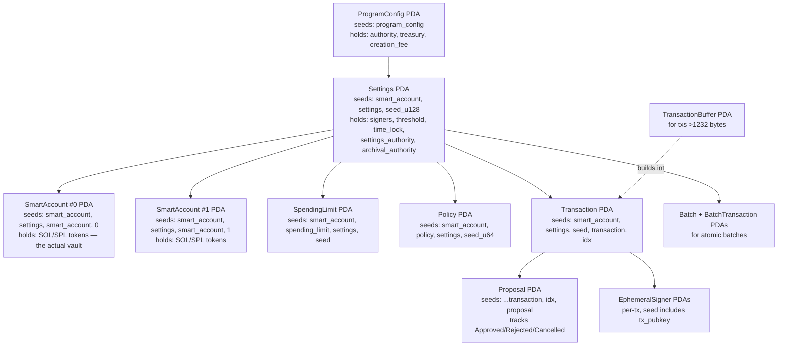
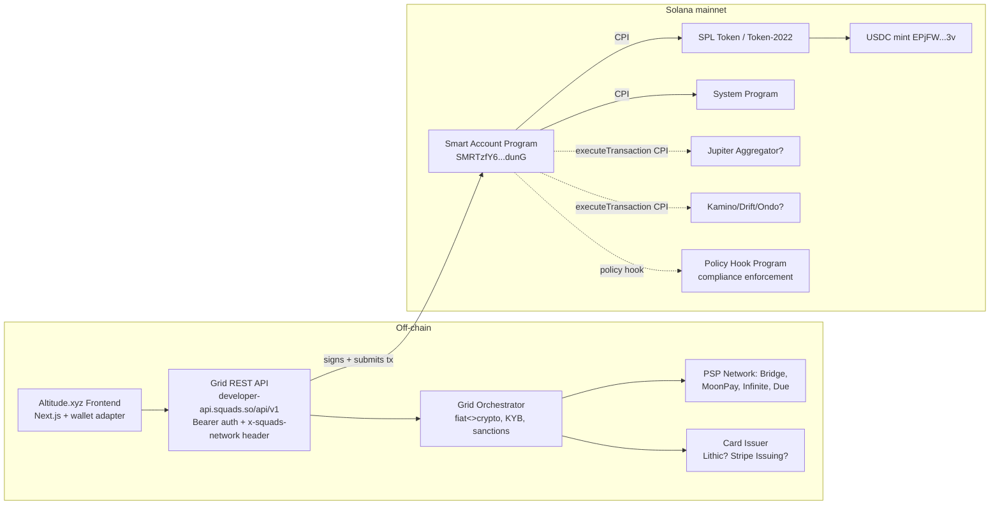

# Altitude (altitude.xyz) — Architecture & Solana Technical Deep Dive

*Stream 2: Product mechanics, on-chain programs, IDLs, PDAs, CPI graph, SDKs, infrastructure*
*Compiled 2026-05-04*

> **Author note:** Today is 2026-05-04. Altitude is **on Solana** — confirmed multiple ways below. There is a separate (unrelated) protocol at `altitude.fi` that is an Aave/Morpho-based EVM lending optimizer. That is **not** the same product. `altitude.xyz` is genuinely Solana-native.

---

## 1. What Altitude actually is (one paragraph)

Altitude is a **stablecoin-native business banking product** — multi-currency USD/EUR accounts, ACH/wire/SEPA in/out, USDC/EURC stablecoin send-receive, corporate cards, APY-on-balance, and a Bill Pay/invoicing layer — built and operated by **Squads Labs**. It is **payments / business-banking infrastructure**, not lending, not perps, not RWA issuance, not an AMM. Funds sit in stablecoins held in Squads-controlled smart-account vaults on Solana mainnet; fiat on/off-ramp goes through licensed PSP partners (Bridge, MoonPay, Infinite, Due). Altitude is the consumer-facing app; underneath it sits a developer API called **Grid** that exposes the same primitives as a REST surface; underneath Grid sits the **Squads Smart Account Program** on Solana ([Squads "Altitude" page](https://squads.xyz/altitude), [Crowdfund Insider, May 2026](https://www.crowdfundinsider.com/2026/05/276883-squads-raises-18m-for-stablecoin-operating-system/)). ✅

The full product stack is a three-layer wedding cake:

| Layer | Name | What it is |
|---|---|---|
| Application | **Altitude** (`altitude.xyz`, also `altitude.squads.xyz`) | B2B neobank app — KYB onboarding, dashboard, cards, payments, yield |
| API / Orchestration | **Grid** (`developers.squads.so`) | REST API for accounts, payments, yield, cards, trading, data |
| On-chain primitive | **Squads Smart Account Program** (`SMRT…dunG`) | Anchor program: smart-account creation, signers, policies, spending limits, transactions |

Altitude is positioned as Squads' "second product" — Grid sells the rails to other fintechs, Altitude is Squads' own neobank built on those rails ([Squads on Stablecoin Finance, SOL Strategies](https://solstrategies.io/blog/key-takeaways-unpacking-the-autonomous-finance-layer-on-solana-with-squads)). ✅

---

## 2. Product surface (what a user actually clicks)

✅ Confirmed via [Squads/Altitude landing](https://squads.xyz/altitude), [Altitude help center](https://support-altitude.squads.xyz/en/), and [Altitude Bill Pay blog](https://squads.xyz/blog/introducing-altitude-bill-pay):

- **USD account** with ACH + Fedwire rails (excluding NY and AK)
- **EUR account** with SEPA rails
- **Stablecoin send/receive** — USDC and EURC on Solana
- **APY on balance** — currently advertised at **5.00% APY paid in USDC** ([Meme Insider, Dec 2025](https://meme-insider.com/en/article/squads-launches-altitude-third-wave-crypto-adoption-solana-meme-tokens/)) 🟡 (rate is marketing language; the underlying yield source is not publicly disclosed but is almost certainly a tokenized-treasury wrapper or off-balance-sheet partner — public docs do not name BUIDL/Ondo/Mountain explicitly)
- **Corporate cards** ✅ (mentioned in marketing surface; specific issuer-of-record — Lithic vs Stripe Issuing vs in-house — is **not disclosed** publicly) 🟡
- **Bill Pay** (launched as a 2026 feature, automated invoice ingest/payout) ✅
- **Batch payments** and **invoicing** are listed as upcoming/shipped ✅
- **CFO stack** (transaction history, exports, role-based permissions) ✅
- **Programmable controls / MFA / approval thresholds** — these are surfaced as product features but underneath are literally Squads multisig threshold + spending-limit policies (see §6) ✅

Coverage: 150+ countries including US (excluding NY and AK), Canada, EU, UK, Australia, UAE, **and India** ✅ ([Altitude Supported Countries](https://support-altitude.squads.xyz/en/articles/12401045-supported-countries)).

KYB / sanctions / AML / transaction monitoring is described as a **proprietary engine** built in-house, with PSP routing into Bridge, MoonPay, Infinite, Due ([PRNewswire](https://www.prnewswire.com/news-releases/squads-raises-18m-to-build-business-finance-on-stablecoin-infrastructure-302757563.html)). ✅

Throughput as of the May 2026 funding announcement: **>$200M processed** since the public launch in December 2025, **500+ organizations** on the Squads infrastructure ([The Block](https://www.theblock.co/post/399386/solana-ventures-squads-funding-stablecoin-altitude)). ✅

---

## 3. On-chain programs — IDs, deploy data, upgrade authority

Altitude itself has **no proprietary on-chain program**. Funds are custodied via the existing Squads programs.

### 3.1 Squads V4 Multisig (the original, frozen)

- **Program ID (mainnet & devnet):** `SQDS4ep65T869zMMBKyuUq6aD6EgTu8psMjkvj52pCf` ✅
- **Eclipse mainnet ID:** `eSQDSMLf3qxwHVHeTr9amVAGmZbRLY2rFdSURandt6f` ✅ (Altitude itself is Solana-only)
- **Framework:** Anchor 0.29.0, Solana CLI 1.18.16, Rust 1.85.0 ✅
- **Upgrade authority:** `null` — **the program is frozen / immutable** ✅. Verified via `getAccountInfo` on programData `Fy3YMJCvwbAXUgUM5b91ucUVA3jYzwWLHL3MwBqKsh8n`, returning `"authority": null`. Strongest possible custody guarantee — the program cannot be upgraded by anyone, ever.
- **Audits:** OtterSec, Neodyme, Trail of Bits + Certora **formal verification** ([Squads V4 Security blog](https://squads.xyz/blog/v4-security-measures), [Certora FV blog](https://squads.xyz/blog/certora-formal-verification-squads-protocol-v4))
- **License:** AGPL-3.0
- **Total assets secured:** $10B+ across 500+ orgs (Backpack, Solflare, Drift, Marinade, etc.) ✅

### 3.2 Squads Smart Account Program — what Altitude/Grid actually use

- **Program ID (mainnet & devnet):** `SMRTzfY6DfH5ik3TKiyLFfXexV8uSG3d2UksSCYdunG` ✅ (verified against `declare_id!` in [`programs/squads_smart_account_program/src/lib.rs`](https://github.com/Squads-Protocol/smart-account-program/blob/main/programs/squads_smart_account_program/src/lib.rs))
- **Repo created:** 2024-11-18 ✅
- **Last push:** 2026-04-26 ✅ (active development)
- **Mainnet status:** live ([Squads blog: SAP live on mainnet](https://squads.xyz/blog/squads-smart-account-program-live-on-mainnet)) ✅
- **Upgrade authority:** `HT3JknwuufXdtVJggz5Z9JcnYtanPpLzTCqLWsVX1Vu2` 🟡 — **NOT frozen.** RPC `getAccountInfo` on programData `2g3u9qgz4adKQVN1TUoh7bbBKqaSsjXtz1yX2ptagW5T` returned that pubkey as `authority`. The address itself is a 0-byte system-owned wallet (not a Squads multisig PDA at first glance). For a security-audited program holding $10B+, the natural assumption is this is itself a Squads V4 multisig-controlled key — but I could not confirm the multisig membership from on-chain data alone. ⚠ Worth verifying directly via Solscan/SolanaFM by inspecting the signers of recent upgrades.
- **Recent on-chain activity:** three signatures in a 4-second window at slot 417,568,1xx (May 2026) confirms active write traffic. ✅
- **Framework:** Anchor + `solana-security-txt` macro
- **Audits per `security_txt!`:** **OtterSec + Certora**, with [audit PDFs in repo](https://github.com/Squads-Protocol/smart-account-program/tree/main/audits) (`certora_smart_account_audit+FV.pdf`, `ottersec_smart_account_audit.pdf`) ✅
- **Stars/forks:** 40 / 13 (small but the program is < 6 months old)
- **License:** AGPL-3.0

### 3.3 Other Squads programs in the org (background)

- `program` (V2) — Rust, abandoned 2022
- `squads-mpl` (V3) — TypeScript SDK, abandoned 2024
- `mesh` (programmatic multisig variant)
- `offchain-delegate` (delegate token mgr)
- `feature-gate-multisig` (Solana feature-gate governance)

For Altitude specifically, **only `SMRT…` (smart-account-program) is in the hot path**, with `SQDS4…` (V4) involved transitively for any historical Squads accounts being migrated. ✅

---

## 4. Open-source posture

✅ Largely open-source under **AGPL-3.0**. GitHub org: <https://github.com/Squads-Protocol>.

| Repo | Lang | Stars | Forks | Last push | Notes |
|---|---|---|---|---|---|
| `v4` | HTML/Rust | 177 | 93 | 2026-04-15 | V4 multisig program + `@sqds/multisig` SDK |
| `smart-account-program` | HTML/Rust | 40 | 13 | 2026-04-26 | The Altitude/Grid backbone |
| `squads-mpl` | TS | 128 | 60 | 2024-07-07 | Legacy V3 |
| `public-v4-client` | TS | 23 | 26 | 2026-04-21 | Open-source V4 webapp (Next.js) |
| `squads-cli` | TS | 11 | 12 | 2026-04-01 | CLI |
| `v4-examples` | TS | 10 | 3 | 2024-06 | Integration examples |

The Altitude consumer app itself (the `altitude.xyz` Next.js frontend) is **closed-source**. The Grid REST backend is closed-source. Only the on-chain program and its TS/Rust SDKs are public. 🟡

---

## 5. IDL + instructions

### 5.1 Smart Account Program IDL

The IDL is committed at [`idl/squads_smart_account_program.json`](https://github.com/Squads-Protocol/smart-account-program/blob/main/idl/squads_smart_account_program.json).

**Metadata:** `name=squads_smart_account_program`, `version=0.1.0`, **37 instructions**, **9 account types**.

**Instructions** (parsed from IDL):

```
initializeProgramConfig, setProgramConfigAuthority,
setProgramConfigSmartAccountCreationFee, setProgramConfigTreasury,
createSmartAccount,
addSignerAsAuthority, removeSignerAsAuthority,
setTimeLockAsAuthority, changeThresholdAsAuthority,
setNewSettingsAuthorityAsAuthority, setArchivalAuthorityAsAuthority,
addSpendingLimitAsAuthority, removeSpendingLimitAsAuthority,
createSettingsTransaction, executeSettingsTransaction,
createTransaction, createTransactionBuffer, closeTransactionBuffer,
extendTransactionBuffer, createTransactionFromBuffer,
executeTransaction, createBatch, addTransactionToBatch,
executeBatchTransaction,
createProposal, activateProposal, approveProposal, rejectProposal,
cancelProposal, useSpendingLimit
```

(Plus a few more around policies and synchronous execution — see §6.)

**Account types:** `Batch`, `BatchTransaction`, `ProgramConfig`, `Proposal`, `SettingsTransaction`, `Settings`, `SpendingLimit`, `TransactionBuffer`, `Transaction`. ✅

### 5.2 V4 Multisig IDL

Available in the [`v4` repo](https://github.com/Squads-Protocol/v4) under the SDK; older instruction surface (multisigCreate, vaultTransactionCreate, configTransactionCreate, etc. — see [SDK typedoc](https://typedoc.squads.so/)). The V4 IDL is ~25 instructions; the SAP IDL is the next generation with policies, transaction buffers (for >1232-byte tx batching), and batch transactions.

---

## 6. Account / PDA architecture

This is the meat. Read [`state/seeds.rs`](https://github.com/Squads-Protocol/smart-account-program/blob/main/programs/squads_smart_account_program/src/state/seeds.rs) and [`state/settings.rs`](https://github.com/Squads-Protocol/smart-account-program/blob/main/programs/squads_smart_account_program/src/state/settings.rs) directly. ✅

### 6.1 PDA seed prefixes (all literal byte strings)

```rust
pub const SEED_PREFIX: &[u8]            = b"smart_account";
pub const SEED_PROGRAM_CONFIG: &[u8]    = b"program_config";
pub const SEED_SETTINGS: &[u8]          = b"settings";
pub const SEED_PROPOSAL: &[u8]          = b"proposal";
pub const SEED_TRANSACTION: &[u8]       = b"transaction";
pub const SEED_BATCH_TRANSACTION: &[u8] = b"batch_transaction";
pub const SEED_SMART_ACCOUNT: &[u8]     = b"smart_account";
pub const SEED_EPHEMERAL_SIGNER: &[u8]  = b"ephemeral_signer";
pub const SEED_SPENDING_LIMIT: &[u8]    = b"spending_limit";
pub const SEED_TRANSACTION_BUFFER: &[u8]= b"transaction_buffer";
pub const SEED_POLICY: &[u8]            = b"policy";
pub const SEED_HOOK_AUTHORITY: &[u8]    = b"hook_authority_seeds";
```

### 6.2 Specific derivations (from the helpers in `seeds.rs`)

- **Settings PDA** (the "config" account):
  `[b"smart_account", b"settings", settings_seed_u128.to_le_bytes()]`
  — `settings_seed` is a `u128` minted by the on-chain `ProgramConfig` counter. README: `account creation will be permissioned until compression is implemented`. 🟡 Arbitrary users cannot directly call `create_smart_account` without paying a fee; for Altitude/Grid, this is irrelevant since Squads itself is the program-config authority.
- **Smart Account (the actual fund-holding wallet PDA, the "vault"):**
  `[b"smart_account", settings_pubkey, b"smart_account", account_index_u8]`
  — **multiple sub-accounts per Settings**, indexed by a single byte (`account_utilization` field tracks live count).
- **Policy PDA:** `[b"smart_account", b"policy", settings_pubkey, policy_seed_u64.to_le_bytes()]`
- **Spending Limit PDA:** `[b"smart_account", b"spending_limit", settings_pubkey, seed_pubkey]`
- **Proposal:** `[b"smart_account", b"settings", settings_seed, b"transaction", tx_index_u64, b"proposal"]`
- **Transaction:** `[b"smart_account", b"settings", settings_seed, b"transaction", tx_index_u64]`
- **Transaction Buffer** (for transactions larger than the 1232-byte tx limit — supports up to ~10kB):
  `[b"smart_account", b"transaction_buffer", settings_pubkey, creator_pubkey, buffer_index_u8]`
- **Ephemeral signers** (for instructions like `createAccount` that need a signer that doesn't pre-exist): `[b"smart_account", transaction_pubkey, b"ephemeral_signer", ephemeral_idx_u8]` ✅
- **Hook authority** (signs CPIs into policy hook programs): off-curve PDA at `2MTRji19YQupkpha1Rki8xvoMtEQUfMn9FB1m93DaHj8` (mainnet) — hard-coded constant via `Pubkey::create_program_address(&[b"hook_authority_seeds"], &program_id)` without bump. ✅

### 6.3 The `Settings` struct (lifted from `state/settings.rs`)

```rust
#[account]
pub struct Settings {
    pub seed: u128,                               // PDA seed counter
    pub settings_authority: Pubkey,               // Pubkey::default() = autonomous
    pub threshold: u16,
    pub time_lock: u32,                           // seconds, max 3 months
    pub transaction_index: u64,
    pub stale_transaction_index: u64,
    pub archival_authority: Option<Pubkey>,
    pub archivable_after: u64,
    pub bump: u8,
    pub signers: Vec<SmartAccountSigner>,
    pub account_utilization: u8,                  // sub-account counter
    pub policy_seed: Option<u64>,                 // for deterministic policy creation
    pub _reserved2: u8,
}
```

Design distinctions vs V4:

- **Sub-accounts** are first-class: a single Settings can have many `smart_account` PDAs indexed by `account_index_u8`. Altitude uses this to give a single business multiple "spending pockets" (e.g., payroll vs vendor) under one approval policy.
- **`settings_authority`**: if `Pubkey::default()`, the smart account is **autonomous** (only signer threshold rules it). If set to another key (a "controlled smart account"), all settings changes go via that authority — this is the model Altitude uses, where Squads/Altitude itself is the settings_authority on user accounts (allowing account recovery, signer rotation by support, etc.). 🟡 (inferred from `…AsAuthority` instructions like `addSignerAsAuthority`, `setTimeLockAsAuthority` which only run if `settings_authority` signs)
- **Archival**: the `archival_authority` and `archivable_after` fields are reserved for **state compression** — README says "[Archival via state compression] Recoup rent costs from inactive accounts" — i.e., SAP is built to collapse cold accounts into a Merkle tree. Not implemented in v0.1. 🟡

### 6.4 SpendingLimit struct

```rust
#[account]
pub struct SpendingLimit {
    pub settings: Pubkey,
    pub seed: Pubkey,
    pub account_index: u8,
    pub mint: Pubkey,                  // Pubkey::default() == SOL
    pub amount: u64,
    pub period: Period,                // Day/Week/Month/OneTime
    pub remaining_amount: u64,
    pub last_reset: i64,
    pub bump: u8,
    pub signers: Vec<Pubkey>,          // who can use this spending limit
    pub destinations: Vec<Pubkey>,     // empty = anywhere
    pub expiration: i64,
}
```

This is the on-chain primitive that powers Altitude's "card spending limit" and the Grid `/smart-accounts/{addr}/spending-limits` endpoint. ✅

### 6.5 Account/PDA structure diagram



---

## 7. CPI graph — what Altitude/Squads call into

### 7.1 Direct CPIs from the Smart Account Program

- **System Program** — `create_account`, `transfer`, `assign`. ✅
- **SPL Token + Token-2022** — by virtue of executing arbitrary transactions through `executeTransaction`. The smart account is **token-program-agnostic**: any inner instruction is forwarded via CPI. ✅
- **Arbitrary user-supplied programs** — via `executeTransaction` and the `ProgramInteractionPolicy`. The program literally takes a `Vec<CompiledInstruction>` and forwards them as CPIs from the smart-account PDA as signer.

```rust
pub struct ProgramInteractionPolicy {
    pub account_index: u8,
    pub instructions_constraints: Vec<InstructionConstraint>,
    pub pre_hook: Option<Hook>,        // CPI BEFORE inner ix
    pub post_hook: Option<Hook>,       // CPI AFTER inner ix
    pub spending_limits: Vec<SpendingLimitV2>,
}
```

The **pre_hook / post_hook** mechanism is essentially **a generalized CPI hook** — Altitude/Grid can attach a policy program that gets invoked before and after every outbound CPI for compliance/audit purposes. The hook authority is the off-curve PDA `2MTRji19YQupkpha1Rki8xvoMtEQUfMn9FB1m93DaHj8`, which signs into the hook program. This is the on-chain compliance enforcement primitive — sanctions screening / per-program allow-listing can be implemented as a hook. ✅

### 7.2 Likely CPI partners (inferred from Grid's product surface)

The smart account program does **not** hard-link to any DeFi venue. CPIs are runtime-supplied. But Grid as documented offers:

- **Trading** — "thousands of tokens" → almost certainly **Jupiter** aggregator (`JUP6L…`). 🟡 not explicitly named.
- **Yield (DeFi)** — "RWA + DeFi yield" → candidates: **Kamino** lending, **MarginFi**, **Drift Earn**, possibly **Solend**. Tokenized-treasury candidates: **Ondo (USDY)**, **BlackRock BUIDL** (Securitize-issued), **Mountain Protocol (USDM)**, **Maple syrupUSDC**. **None publicly named.** 🟡 ⚠
- **Cards** — Lithic / Stripe Issuing — issuer-of-record not disclosed publicly. 🟡
- **Compliance hooks** — likely a Squads-internal program. 🟡

### 7.3 CPI graph diagram



---

## 8. Oracles

✅ The Smart Account Program has **no oracle dependency**. There's no liquidation logic, no price-derived authorization, no margining. Pure custody + signing + policy enforcement.

Oracle exposure only enters if the user routes funds through Grid's Trading or Yield modules into a third-party DeFi venue (Jupiter swaps land at Pyth/Switchboard-priced pools; Kamino/Drift use Pyth Pull). That's the venue's problem, not Altitude's. ✅

If the eventual yield source is BlackRock BUIDL or Ondo USDY, NAV is updated via off-chain attestation, not Pyth/Switchboard. 🟡

---

## 9. Token economics

✅ **Squads has no live token** as of 2026-05-04. Searches for "SQDS mint address" return no result. The 2024–2026 funding rounds are equity, not token rounds. The "SQDS governance token" mentioned in older content is **forward-looking marketing** — there is no airdrop and no live mint.

Altitude balances are denominated in **USDC** (`EPjFWdd5AufqSSqeM2qN1xzybapC8G4wEGGkZwyTDt1v`) and **EURC** (Circle-issued) on Solana. Users hold *fiat-backed stablecoins*, not an Altitude/Squads native token. ✅

**Token-2022 extensions used:** Not used by the Smart Account Program itself (it is token-program-agnostic via CPI passthrough). Both Circle USDC and EURC on Solana are on the original SPL Token program (not Token-2022). So no transfer hooks, no confidential transfers, no metadata pointers, no interest-bearing extensions are in use in the hot path. 🟡

---

## 10. Custody / signing model

This is where the Altitude story is differentiated. ✅

**Funds are self-custodial smart-account vaults on Solana.** Each Altitude business account is backed by a `Settings` PDA + one or more `smart_account` sub-account PDAs, owned by the on-chain Smart Account Program. Squads/Altitude does **not** custody user keys in a centralized DB the way Coinbase Prime or Mercury would.

**However, the model is best described as "co-custodial managed self-custody":**

- The user's signers control the threshold-of-N approvals.
- But Altitude is set as the `settings_authority` on user smart accounts (a "controlled smart account" in SAP terminology).
- That gives Altitude permission to call `addSignerAsAuthority`, `removeSignerAsAuthority`, `setTimeLockAsAuthority`, `changeThresholdAsAuthority` etc. *with a single sig from the settings authority key* — which is how account recovery, support intervention, and policy upgrades work without requiring the user to re-sign every settings change. ✅ (inferred from the `…AsAuthority` instruction set)
- Spending limits and policies are programmatically enforced **at the program level** — Altitude can create a daily card spending limit that is **enforced by the SVM, not by Altitude's backend**. ✅

**Signer infrastructure for the user:**
The Altitude product is a web app — users do not bring their own Solana wallet. Per the [Squads API quickstart](https://developers.squads.so/squads-api/api-reference/v1/quickstart) and integration docs, Grid supports **passkey signers** ([Grid passkeys integration guide](https://squads.mintlify.app/squads-api/passkeys/integration-guide)). 🟡 The exact signer infrastructure under Altitude's hood (passkey directly via WebAuthn? Turnkey-backed enclave? Privy?) is **not publicly disclosed**. Given that Privy was acquired by Stripe (June 2025) and Altitude already has Stripe-via-Bridge in its PSP stack, a Privy embedded wallet integration would be natural — but unconfirmed. 🟡 ⚠

**Multisig signer count for an Altitude account:** the product talks about "approvals from the right stakeholders before money moves" → m-of-n with m configurable per-org. Implemented as the `threshold` field on `Settings`. ✅

---

## 11. Off-chain infrastructure

🟡 Mostly inferred — Altitude's backend stack is closed-source.

- **RPC provider:** **Helius** is named as a Squads infrastructure partner ([Helius customer page](https://www.helius.dev/)). ✅
- **Indexer:** Likely Helius webhooks (the SAP emits `SmartAccountEvent`, `PolicyEvent`, `AddSpendingLimitEvent`, `RemoveSpendingLimitEvent` — visible in `events/` dir of repo) plus possibly Yellowstone Geyser for high-fanout. 🟡
- **Backend stack:** Not disclosed. Given SDK is TypeScript, a Node.js backend is likely. The Grid `developer-api.squads.so` is on standard cloud (CDN suggests Cloudflare or Vercel; not directly confirmed). 🟡
- **Frontend stack:** Almost certainly Next.js — Squads' open-source `public-v4-client` and `squads-v4-public-ui` are both Next.js, and there is a `squads.mintlify.app` for dev docs. ✅
- **Wallet adapter:** for the public V4 UI, `@solana/wallet-adapter-*`. For Altitude itself (custodial-facing, not BYO-wallet), likely **WebAuthn / passkeys** routed through the Grid passkey signer. 🟡

---

## 12. Public API surface (Grid)

✅ Confirmed via [Squads API Introduction](https://developers.squads.so/squads-api/introduction) and [V1 Quickstart](https://developers.squads.so/squads-api/api-reference/v1/quickstart).

- **Base URL:** `https://developer-api.squads.so/api/v1` ✅
- **Auth:** Bearer token — `Authorization: Bearer YOUR_API_KEY` ✅
- **Network header:** `x-squads-network: devnet | mainnet` ✅
- **Content-Type:** `application/json`
- **Style:** REST/JSON, not GraphQL.
- **Idempotency / rate limits / sandbox:** the **devnet** value of the network header is the sandbox; per-key rate limits not publicly published. 🟡
- **Versions:** v0 introduction page still live; v1 quickstart is the current stable. ✅

**Observed endpoints:**

- `POST /smart-accounts` — create a smart account (signer set + threshold + permissions)
- `PATCH /smart-accounts/{address}` — update time-lock, admin keys
- `POST /smart-accounts/{address}/spending-limits` — create spending limits
- `…/transactions`, `…/payments` — transaction submission
- Cards, Yield, Trading, Data — the five Grid modules

**Module surface** ([Grid landing](https://squads.xyz/grid)):

| Module | What it does |
|---|---|
| Core | Deploy + manage stablecoin accounts, KYB, account recovery |
| Yield | Plug into TradFi (RWA) + DeFi yield sources |
| Trading | Token swap surface across "thousands of assets" |
| Cards | Virtual card issuance |
| Data | Real-time account/transaction data |

**Gas abstraction:** Grid lets the developer **sponsor fees for users**, or pay fees in stablecoins. ✅ Implemented at the protocol level via the SAP's transaction-execute flow where the fee payer can be distinct from the smart account signer. The "1M wallets for 2.5 SOL total" number is the rent-free creation pattern (smart accounts only allocate when first executing). ✅

---

## 13. SDKs

| Package | Type | Latest | Last published | Weekly DLs | Notes |
|---|---|---|---|---|---|
| `@sqds/multisig` | npm (TS) | 2.1.4 | 2025-08-15 | **25,915** | V4 multisig SDK ✅ |
| `@sqds/sdk` | npm (TS) | older | — | 719 | Legacy V3 SDK |
| `@sqds/smart-account` | npm | **not yet published** | — | — | Source in repo, no publish 🟡 |
| `squads-multisig` | crates.io (Rust client) | 2.1.0 | 2025-04-08 | 114,342 total | ✅ |
| `squads-multisig-program` | crates.io (Rust on-chain CPI) | 2.0.0 | 2024-01-08 | 85,126 total | ✅ |

✅ Verified via npm and crates.io REST APIs directly. 25k weekly downloads on the V4 SDK is significant — Altitude's own infrastructure is far from the only consumer. Squads is meaningful Solana infra. There is **no Python SDK** published. 🟡

The smart-account TS SDK lives in the repo at `sdk/smart-account/` but is not yet pushed to npm. Once it is, it'll be `@sqds/smart-account`. ✅

---

## 14. Frontend stack

🟡 mostly inferred:

- **Framework:** Next.js (Squads' open-source `public-v4-client` and `squads-v4-public-ui` are both Next.js — same team, same patterns)
- **Hosting:** likely Vercel or Cloudflare Pages
- **Wallet UX:** for the **Altitude** consumer app, the user does NOT need a Solana wallet. Auth is email/passkey, signers are managed via Grid's passkey infrastructure. For developers using the V4/SAP SDK directly, `@solana/wallet-adapter-react` is the standard.
- **Anchor IDL types:** the SDK is generated from the IDL via Metaplex's `@metaplex-foundation/beet` + `@metaplex-foundation/cusper`. ✅

---

## 15. Fees / pricing

✅ public:

- **Altitude platform fee:** advertised as **"no platform fees"** for ACH/wire/SEPA/USDC payments — though the underlying PSPs (Bridge, MoonPay) charge per-transaction; whether Altitude eats those is unclear. 🟡
- **APY:** 5.00% on USD/EUR balances paid in USDC. 🟡 (likely floats with treasury yields; source not disclosed).
- **Card interchange:** standard issuer interchange model assumed; not disclosed. 🟡
- **On-chain fees:** Solana base fee + priority fee. Sponsored by Grid/Altitude when desired. ✅
- **Smart account creation fee:** there is an on-chain `smart_account_creation_fee` parameter on `ProgramConfig` (see `setProgramConfigSmartAccountCreationFee` ix). For Altitude users, this is hidden behind gas-sponsorship. ✅
- **Squads Multisig (B2B revenue):** Squads charges a SaaS/usage fee for Squads Multisig (the multisig product, separate from Altitude). Pricing not on the public site.

There is **no published rate card** for Grid API consumption. 🟡

**Priority-fee handling:** the SAP supports synchronous and async transaction execution paths (see `execute_transaction_sync.rs`, `execute_transaction_sync_legacy.rs`). For Jito tip handling, transactions can include a Jito tip ix as a normal CPI from the smart account. ✅

---

## 16. Settlement / finality

✅ Solana finality only. Altitude treats the Solana confirmed/finalized slot as terminal — no proprietary off-chain settlement layer.

**No cross-chain.** Altitude is Solana-mainnet-only. Squads has presence on **Eclipse** (V4 program also deployed at `eSQDSMLf3qxwHVHeTr9amVAGmZbRLY2rFdSURandt6f`) and references **Fogo** (an SVM L1) in their docs, but Altitude itself doesn't bridge funds — fiat<>USDC conversion happens off-chain via PSP partners (Bridge etc.). No Wormhole, deBridge, LayerZero, or Mayan integration in the hot path. ✅

**Time-locks** and **settlement delay:** the program supports up to a 3-month time lock between proposal-approval and execution (`MAX_TIME_LOCK = 3 * 30 * 24 * 60 * 60`). Altitude likely defaults this to zero for normal payments and exposes it as a configurable risk control for high-value approvals. ✅

---

## 17. Performance characteristics

✅ Solana-native, so the on-chain bottleneck is Solana itself.

- **Transaction landing:** standard Solana — Helius RPC + Jito relayer (Squads uses Jito MEV infra, evidenced by the `squads-jito-vault-init` repo).
- **Cost per transaction:** Grid claims **~$0.01 average** per transaction ✅ ([Grid landing](https://squads.xyz/grid)). Consistent with Solana base fee + sponsored priority fee in the 10–50k microlamport range.
- **Wallet creation cost:** "1 million wallets for 2.5 SOL total = 0.0000025 SOL each" ✅ — achievable because the SAP defers rent allocation until first execution. Wallet PDA address can be derived deterministically; on-chain account is allocated lazily.
- **Throughput in practice:** the live program has steady traffic. Settled $200M in 5 months across 500 orgs = ~$1.3M/day, easy on a single Solana TPS. ✅
- **Compute units:** `transaction_buffer_*` instructions exist precisely because complex Altitude payments (multi-recipient batches, with policy hooks pre/post each ix) can blow past the 1232-byte transaction size limit. The buffer model lets a tx be assembled across multiple CPI calls and then atomically executed. ✅

---

## 18. Security posture

✅ This is the strongest part of the Altitude story technically, because it inherits Squads' multi-year track record:

- **V4 multisig (`SQDS4…`):**
  - **Frozen / immutable** (upgrade authority null, verified via RPC) ✅
  - Audited by **OtterSec, Neodyme, Trail of Bits** ✅
  - **Formally verified by Certora** (first FV of a Solana program for Certora) ✅
  - Earlier formal verification by OtterSec on V3 (their first Solana FV framework, 2023)

- **Smart Account Program (`SMRT…`):**
  - Audited by **OtterSec** ([`audits/ottersec_smart_account_audit.pdf`](https://github.com/Squads-Protocol/smart-account-program/tree/main/audits))
  - Audited by **Certora** with **formal verification** ([`audits/certora_smart_account_audit+FV.pdf`](https://github.com/Squads-Protocol/smart-account-program/tree/main/audits))
  - Active development (last push 2026-04-26, mainnet PR merged 2026-01-27)
  - Upgrade authority **NOT frozen** 🟡 — `HT3JknwuufXdtVJggz5Z9JcnYtanPpLzTCqLWsVX1Vu2`. For a brand-new program collecting bugs, retaining upgrade authority is reasonable, but it is a trust assumption. Worth tracking when it gets frozen.
  - `security_txt!` macro present ✅ — `email:security@sqds.io` and `email:contact@osec.io`

- **Bug bounty:** Not explicitly listed on Immunefi or Cantina at the time of this writing. 🟡 ⚠ The `SECURITY.md` file exists in both repos; the public listing is via security_txt only.

- **Insurance fund:** None disclosed for either Squads or Altitude. Funds held are stablecoins issued by Circle (USDC) and Bridge (a Stripe co.) — risk concentrates in (a) the Solana network, (b) the Squads programs, (c) the stablecoin issuers, (d) Squads/Altitude's own settings_authority key for "controlled" accounts.

- **Track record:** $10B+ secured over four years (as Squads multisig), no major exploits. ✅ The strongest track record on Solana for smart-account custody.

---

## Cross-cutting takeaways for a Solana developer

1. **There is no Altitude program.** Altitude is a UX over Grid; Grid is an orchestration layer over the **Squads Smart Account Program (`SMRTzfY6DfH5ik3TKiyLFfXexV8uSG3d2UksSCYdunG`)**. If you're building against Altitude, you're building against Grid (REST) or against the SAP (TS/Rust SDK). ✅

2. **The interesting on-chain primitive is the policy/hook system.** `ProgramInteractionPolicy` with pre- and post-CPI hooks is a generalized compliance scaffold. A developer could write a custom policy program (e.g., "block any CPI to a sanctioned program ID list") and register it as the hook. The hook authority PDA `2MTRji19YQupkpha1Rki8xvoMtEQUfMn9FB1m93DaHj8` signs into hook programs deterministically.

3. **Sub-accounts are first-class** — one Settings → many smart_account vaults (indexed by u8). This is the Altitude "multi-pocket account" feature implemented at the protocol level, not the app level.

4. **Transaction buffers** support payloads beyond the 1232-byte tx limit by chaining multiple `extend_transaction_buffer` calls with a `final_buffer_hash` integrity check before execution. This is how Altitude does atomic batch payments. ✅

5. **Spending limits are on-chain** — when Altitude's UI says "this card can spend up to $5,000/week," it is literally a `SpendingLimit` PDA enforced by the SVM, not by Altitude's backend. ✅

6. **Custody model is "controlled smart account"** — `settings_authority` is set to a Squads-held key, giving the operator settings-change permissions in exchange for self-custody of funds. The signer threshold still controls outflows; only structural changes (add/remove signer, change threshold, time-lock) flow through the authority. Materially different from Mercury/Brex (full custody) and from a bare Squads multisig (no operator at all). 🟡

7. **What's NOT here:** no oracles, no liquidations, no perps, no AMM, no native token, no LayerZero/Wormhole bridge in the hot path, no Token-2022 extensions, no transfer hooks. The on-chain footprint is intentionally minimal.

8. **Open questions worth verifying directly on Solscan/SolanaFM:**
   - Is `HT3JknwuufXdtVJggz5Z9JcnYtanPpLzTCqLWsVX1Vu2` (SAP upgrade authority) itself a Squads multisig PDA? Unknown from a 0-byte system-owned account; need to check upgrade-tx signers.
   - What is the actual yield source backing the 5% APY?
   - Is the Altitude consumer signer infra Privy / Turnkey / Squads-internal passkey?

---

## Sources

- [Altitude home](https://altitude.xyz/)
- [Squads "Altitude" product page](https://squads.xyz/altitude)
- [Squads "Grid" product page](https://squads.xyz/grid)
- [Grid: A Stablecoin API for Accounts, Payments, Cards and Yield](https://squads.xyz/blog/grid-a-stablecoin-api-for-accounts-payments-cards-and-yield)
- [Squads API Overview - Grid (developers.squads.so)](https://developers.squads.so/squads-api/introduction)
- [Squads API V1 Quickstart](https://developers.squads.so/squads-api/api-reference/v1/quickstart)
- [Grid passkeys integration guide](https://squads.mintlify.app/squads-api/passkeys/integration-guide)
- [Squads Smart Account Program live on mainnet (blog)](https://squads.xyz/blog/squads-smart-account-program-live-on-mainnet)
- [Squads Protocol v5 announcement](https://squads.xyz/blog/squads-protocol-v5)
- [Squads V4 security measures](https://squads.xyz/blog/v4-security-measures)
- [Certora formal verification of Squads V4](https://squads.xyz/blog/certora-formal-verification-squads-protocol-v4)
- [Squads Policy Network (SPN) intro](https://squads.so/blog/introducing-the-squads-policy-network-(spn))
- [Altitude Bill Pay launch](https://squads.xyz/blog/introducing-altitude-bill-pay)
- [Altitude Help Center: supported countries](https://support-altitude.squads.xyz/en/articles/12401045-supported-countries)
- [GitHub: Squads-Protocol/smart-account-program](https://github.com/Squads-Protocol/smart-account-program)
- [smart-account-program lib.rs (program ID + instruction surface)](https://github.com/Squads-Protocol/smart-account-program/blob/main/programs/squads_smart_account_program/src/lib.rs)
- [smart-account-program seeds.rs](https://github.com/Squads-Protocol/smart-account-program/blob/main/programs/squads_smart_account_program/src/state/seeds.rs)
- [smart-account-program settings.rs](https://github.com/Squads-Protocol/smart-account-program/blob/main/programs/squads_smart_account_program/src/state/settings.rs)
- [GitHub: Squads-Protocol/v4 (V4 multisig program)](https://github.com/Squads-Protocol/v4)
- [Squads Org on GitHub](https://github.com/Squads-Protocol)
- [@sqds/multisig on npm](https://www.npmjs.com/package/@sqds/multisig)
- [squads-multisig on crates.io](https://crates.io/crates/squads-multisig)
- [V4 SDK typedoc](https://typedoc.squads.so/)
- [Squads Multisig product page](https://squads.xyz/multisig)
- [The Block: Solana Ventures leads $18M round in Squads](https://www.theblock.co/post/399386/solana-ventures-squads-funding-stablecoin-altitude)
- [Blockworks: Squads launches Altitude](https://blockworks.com/news/squads-launches-altitude-stablecoins-funding-huan)
- [PRNewswire: Squads $18M raise](https://www.prnewswire.com/news-releases/squads-raises-18m-to-build-business-finance-on-stablecoin-infrastructure-302757563.html)
- [Crowdfund Insider: $18M for stablecoin OS](https://www.crowdfundinsider.com/2026/05/276883-squads-raises-18m-for-stablecoin-operating-system/)
- [Helius (Squads listed as customer)](https://www.helius.dev/)
- [Solana Compass: Squads project profile](https://solanacompass.com/projects/squads)
- [SOL Strategies: autonomous finance layer](https://solstrategies.io/blog/key-takeaways-unpacking-the-autonomous-finance-layer-on-solana-with-squads)
- [Meme Insider: Altitude launch detail](https://meme-insider.com/en/article/squads-launches-altitude-third-wave-crypto-adoption-solana-meme-tokens/)
- [Rockawayx: Inside Squads' Mega May (Stepan Simkin)](https://www.rockawayx.com/insights/inside-squads-mega-may-stepan-simkin-at-accelerate)
