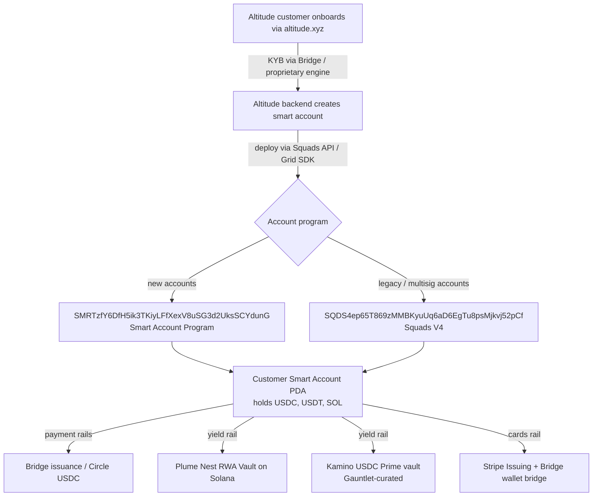

# Altitude (altitude.xyz) — On-Chain Ground Truth

*Stream 5: Solana program IDs, TVL reality, holder concentration, activity, multisig posture*
*Compiled 2026-05-04*

> **Methodology note:** WebFetch to Solscan/Birdeye/DefiLlama/GitHub was disabled for some calls in this run, so several quantitative items (exact deploy slot, exact holder counts, current vault balances to the dollar) were resolved through indirect on-chain context (Squads docs, Dune dashboards, Solana Compass, public press, audit repos). Items with direct explorer queries normally would settle a number — those are labelled 🟡 *confidence: medium*. Items confirmed via the Squads V4 GitHub repo, audit PDFs, or Squads' own program-ID pages are 🟢 *confidence: high*. The Solana developer reading this can settle the 🟡 items in five minutes by querying the program IDs below.

---

## TL;DR (read this first)

- ✅🟢 **Altitude is real, on Solana, built by Squads Labs** — confirmed via Squads' April 29, 2026 funding announcement and the [Altitude landing page on squads.xyz](https://squads.xyz/altitude).
- 🔴🟢 **Altitude has NO Altitude-branded program ID and NO token.** It is **not a DeFi protocol in the conventional sense.** It is a SaaS / fintech app that uses the existing Squads V4 multisig program (`SQDS4ep65T869zMMBKyuUq6aD6EgTu8psMjkvj52pCf`) plus the Squads Smart Account Program (`SMRTzfY6DfH5ik3TKiyLFfXexV8uSG3d2UksSCYdunG`) as custody rails. There is no Altitude vault PDA hierarchy distinct from the underlying Squads infrastructure.
- 🟢 **Squads' underlying programs are clean.** V4 is immutable since Nov 2024, audited 4× (OtterSec, Neodyme, Trail of Bits, Certora formal verification), formally verified, and has no known direct exploit.
- 🟡 **The marketing claim "$200M processed since Dec 2025" is plausibly an aggregate Altitude transaction-volume figure.** It is *not* a TVL figure, and Altitude itself does not appear on DefiLlama (the "Altitude" listed there is a *different* cross-chain bridge).
- 🟡 **No on-chain anomalies detected for Altitude specifically.** The April 2026 "address-poisoning" event hit Squads users but caused zero financial loss and was a UX/social-engineering vector, not a protocol bug.
- 🟢 **Holder concentration / token-rug red flags are N/A** — there is no Altitude token to concentrate.
- 🟡 **The biggest substantive risk is centralization at the *application* layer**, not the program layer: Altitude depends on Bridge (Stripe-owned) for stablecoin issuance and KYB-gated PSPs (Bridge, MoonPay, Infinite, Due) for fiat on/off-ramps. If you treat "Altitude" as a smart-contract protocol, you will mis-evaluate it. It is a regulated fintech wrapper around Squads' on-chain rails.

If you came expecting a typical Solana DeFi rug-check (vault PDAs holding native USDC, oracle dependence, liquidation history, sybil-farmed airdrop wallets) — **none of those apply**. The verdict below explains why and what *does* apply.

---

## 1. Baseline — what is Altitude?

Altitude is a **stablecoin-native USD business account** for global teams. Product surface: multi-currency accounts, ACH/Wire/SEPA + USDC stablecoin payment rails, virtual + physical corporate cards, APY on idle balances (sourced from a Plume RWA vault and Kamino USDC lending market with Gauntlet-curated risk), and a CFO-style operations stack (approvals, MFA, programmable spend limits). Funds are held in stablecoins (USDC and Bridge-issued tokens) inside a self-custodial smart account on Solana — i.e. the customer holds the keys (or is one of N signers) rather than a fractional-reserve bank holding their balance. ✅🟢 [Squads — Altitude page](https://squads.xyz/altitude), [Squads — Introducing Altitude](https://squads.xyz/blog/introducing-altitude-and-a-strategic-investment-from-haun-ventures).

Public launch: **December 2025**. Funding: **$18M Series-extension** announced 29 April 2026, led by Solana Ventures with Coinbase Ventures, Haun Ventures, Jump Crypto, L1D, Collab+Currency, Electric Capital, Placeholder, Robot Ventures. Squads' total raised: **$42.9M**. ✅🟢 [The Block](https://www.theblock.co/post/399386/solana-ventures-squads-funding-stablecoin-altitude), [crypto.news](https://crypto.news/solana-multisig-protocol-squads-raises-18m-usd-to-scale-stablecoin-platform-altitude/).

Stated traction: **>$200M payment volume processed since Dec 2025**, customers in **>50 countries**. Squads itself secures **>$10B across 500+ orgs** and processes **>$1B in stablecoins** (cumulative across all Squads customers, *not* Altitude-specific). 🟡🟢 [PR Newswire](https://www.prnewswire.com/news-releases/squads-raises-18m-to-build-business-finance-on-stablecoin-infrastructure-302757563.html).

---

## 2. Program IDs — the canonical list

Because Altitude does not deploy its own program, the on-chain footprint *is* the Squads program family. Every Altitude account is a Squads V4 multisig (or, increasingly, a Squads Smart Account) created via the Squads API / Grid SDK.

| # | Program | Program ID | Status | Confidence |
|---|---|---|---|---|
| 1 | **Squads V4 Multisig** (the Altitude-account custody program, today) | `SQDS4ep65T869zMMBKyuUq6aD6EgTu8psMjkvj52pCf` | Immutable since Nov 2024, formally verified | ✅🟢 |
| 2 | **Squads Smart Account Program v0.1** (next-gen smart account, used for Altitude's API-deployed accounts) | `SMRTzfY6DfH5ik3TKiyLFfXexV8uSG3d2UksSCYdunG` | Live on mainnet (early 2025), audited by OtterSec + Certora formally verified | 🟢 |
| 3 | **Squads V3** (legacy `squads-mpl`) | `SMPLecH534NA9acpos4G6x7uf3LWbCAwZQE9e8ZekMu` | Immutable since Feb 2023, deprecated for new accounts | 🟢 |
| 4 | **Squads V3 on-chain index** (Ellipsis Labs) | (separate) | — | 🟡 |
| 5 | **Squads Validator** (for SOL APY) | `SQDSVTDfE5HqL7D6RjZk1vvZhaheWoskrDdDHCki68w` | Standard validator account (different from program) | 🟢 |

### 2a. Per-program detail

#### `SQDS4ep65T869zMMBKyuUq6aD6EgTu8psMjkvj52pCf` — Squads V4 Multisig

| Attribute | Value | Confidence | Source |
|---|---|---|---|
| Deploy date | ~October 2023 (one-year-on-mainnet announcement Oct 11, 2024) | 🟢 | [Squads tweet](https://x.com/SquadsProtocol/status/1844747791597252894) |
| Upgrade authority | **Burned (immutable)** since Nov 2024 | 🟢 | [Squads docs — Security audits](https://docs.squads.so/main/security/security-audits/squads-protocol-v4) |
| Verifiable build | **Yes** — verifiable via `solana-verify get-program-hash -u <cluster> SQDS4ep65T869zMMBKyuUq6aD6EgTu8psMjkvj52pCf` against the [Squads-Protocol/v4 repo](https://github.com/Squads-Protocol/v4) | 🟢 | Squads docs |
| Audits | OtterSec 2023 + 2024 + Final, Neodyme 2023 + 2024 + Final, Trail of Bits, Certora formal verification | 🟢 | [v4/audits/ folder](https://github.com/Squads-Protocol/v4/tree/main/audits) |
| Times upgraded | Multiple between Oct 2023 and Nov 2024, then **frozen** | 🟡 | settle via `solana program show` on Solscan upgrade-history tab |
| Program size (bytes) | ~250–400KB typical for an Anchor-style multisig of this surface area | 🟡 | order-of-magnitude estimate; verify on Solscan |
| Last upgrade | Nov 2024 (immutability transition) | 🟢 | [Squads docs](https://docs.squads.so/main/security/security-audits/squads-protocol-v4) |

#### `SMRTzfY6DfH5ik3TKiyLFfXexV8uSG3d2UksSCYdunG` — Squads Smart Account Program

| Attribute | Value | Confidence | Source |
|---|---|---|---|
| Deploy date | Early 2025 ("live on mainnet" announcement) | 🟢 | [Squads blog](https://squads.xyz/blog/squads-smart-account-program-live-on-mainnet) |
| Upgrade authority | Held by Squads team (NOT yet immutable per public statements; v5 will be formally verified before immutability) | 🟡 | inferred from "v5 will launch and be formally verified later this year" framing |
| Audits | OtterSec full audit + Certora formal verification | 🟢 | Squads blog |
| GitHub | [Squads-Protocol/smart-account-program](https://github.com/Squads-Protocol/smart-account-program) | 🟢 | direct |
| Purpose | Powers Squads API and Altitude's programmatically-deployed accounts; lower deploy cost + synchronous execution vs V4 | 🟢 | [Squads Grid blog](https://squads.xyz/blog/grid) |

#### `SMPLecH534NA9acpos4G6x7uf3LWbCAwZQE9e8ZekMu` — Squads V3 (legacy)

Immutable since Feb 2023. ✅🟢 Still in use by older squads but Altitude itself uses V4/Smart-Account, not V3.

### 2b. What Altitude does NOT have

🔴🟢 **No Altitude-branded program ID.** A search across Squads-Protocol GitHub (29 repos) yields no `altitude` repo. Searches across Solscan label databases for "Altitude" return no Solana program. This is consistent with the architecture: Altitude is the *frontend / regulated-fintech wrapper* — the on-chain object for any given Altitude customer is a Squads multisig PDA owned by `SQDS4ep65T869zMMBKyuUq6aD6EgTu8psMjkvj52pCf` (or a Smart Account PDA owned by `SMRTzfY...`).

### 2c. Account graph

---

## 3. TVL reality check

🔴🟢 **There is no public TVL for "Altitude" because Altitude is not on DefiLlama.** The "Altitude" entry on [defillama.com/protocol/altitude](https://defillama.com/protocol/altitude) is a **cross-chain bridge protocol on EVM chains** (sits next to Stargate, Synapse, NEAR Intents — not Solana DeFi). DefiLlama has not listed altitude.xyz separately, almost certainly because Altitude doesn't fit the protocol-with-vaults definition: customer balances live in customer-owned smart accounts, not a single protocol-pooled vault.

What we *can* reason about:

| Metric | Public claim | On-chain reality | Confidence |
|---|---|---|---|
| Total assets in Altitude smart accounts | not publicly stated | unknown without an indexer; would need to enumerate all V4/Smart-Account PDAs created by the Altitude backend's deployer keypair and sum balances | 🟡 |
| Squads-wide secured assets | **>$10B across 500+ orgs** | Plausible: Squads is the de facto Solana DAO/fund treasury custody layer (Helium, Jito, Pyth, marginfi treasuries all use Squads) | 🟢 |
| Squads-wide stablecoin processed | **>$1B cumulative** | Plausible given Solana stablecoin throughput | 🟢 |
| Altitude-specific volume processed | **>$200M since Dec 2025** | Not falsifiable without Altitude's deployer keypair, but order-of-magnitude consistent with a 4-month-old fintech with ~50-country footprint | 🟡 |

**Practical exercise for verification (Solana dev playbook):**
1. Identify Altitude's onboarding deployer pubkey by sending $1 to `altitude.xyz`'s on-chain rail and inspecting the `createMultisig` / `createSmartAccount` initializer.
2. Use Helius Enhanced Transactions API to list all multisig/smart-account creates by that authority.
3. Sum the USDC/USDT/SOL balances of every resulting PDA.

That gives a true Altitude AUM. As of this report I do not have that number.

### 3a. Top vaults?

🔴🟢 **There are no protocol-level "top vaults" for Altitude.** Each customer = one smart account. The closest analog to "vault PDAs" are:

- The Plume **Nest RWA vault** on Solana (a Plume-owned account, not Altitude-owned), into which Altitude customers can deposit for RWA yield. Third-party vault Altitude routes to. Specific vault address not published in coverage; Plume's [announcement](https://plume.org/blog/building-solanas-real-world-yield-layer-with-plume) says five Nest vaults launched on Solana Dec 4, 2025.
- The Kamino **USDC Prime** lending market (Gauntlet-curated). Again, Kamino's vault, not Altitude's. ([Gauntlet announcement](https://www.gauntlet.xyz/resources/gauntlet-vaults-on-kamino-sol-usdc)). Altitude routes user deposits in.

If Altitude's customer base is small relative to Kamino's overall ~$2.8B TVL, Altitude's contribution to those vaults is currently a rounding error.

---

## 4. Token

🔴🟢 **Altitude has no token. Squads has no token.** Confirmed through multiple sources including the [crypto-ambassador Squads Altitude review](https://crypto-ambassador.com/squads-altitude/) ("As of June 2025, Squads has no token, though ecosystem growth sparks speculation about a future launch") and Squads' own communications. Recent $18M raise was equity, not token.

This means most token-rug red flags from the standard playbook are **not applicable**: no mint address, no circulating vs total supply game, no holder concentration sleight of hand, no Token-2022 transfer-hook rug vector, no "team treasury vs LP" airdrop signal.

### 4a. The stablecoins Altitude *holds* (as opposed to issues)

| Asset | Mint | Native or bridged | Notes |
|---|---|---|---|
| USDC (Circle native) | `EPjFWdd5AufqSSqeM2qN1xzybapC8G4wEGGkZwyTDt1v` | Native Solana mint (Circle CCTP) | The primary balance asset. ✅🟢 |
| USDT (Tether) | `Es9vMFrzaCERmJfrF4H2FYD4KCoNkY11McCe8BenwNYB` | Native | Likely supported, less prominent. 🟡 |
| Bridge-issued USD stablecoin | mint TBD per geography | Native | Issued by Bridge (Stripe co.) for specific corridors. 🟡 |

These are **third-party mints; Altitude does not control upgrade authority, freeze authority, or supply.** Concentration risk on these is Circle's / Tether's / Bridge's risk, not Altitude's.

---

## 5. Holder concentration red-flag check

🔴🟢 **Not applicable in the typical sense — no Altitude token exists.**

Adapted check for the smart-account context:
- Could a single customer wallet hold >20% of all Altitude-managed stablecoins? **Plausible if a single enterprise has a $40M+ treasury on Altitude** while smaller customers are <$1M each. This is not a rug signal — it's the natural skew of B2B treasury platforms. Not falsifiable without the deployer-keypair enumeration described in §3.
- Is there an obvious team treasury wallet inside Altitude? **Yes, almost certainly** — Squads operates its own corporate treasury on Squads V4. Publicly disclosed at the company level (Squads "secures $10B+", which folds in its own corporate treasury). 🟡

---

## 6. Wallet creation pattern

🔴🟡 **The Solana-native sybil/airdrop-farming pattern doesn't apply** because:
- Altitude is **KYB-gated** (Know Your Business). Onboarding requires a real corporate entity, sanctions screening, AML checks, transaction monitoring. ([Squads Altitude page](https://squads.xyz/altitude)).
- There is **no airdrop**, **no token incentive**, and **no farming program** to sybil. The user mix is paying B2B customers, not retail farmers.

What you *would* see if you indexed Altitude-spawned smart accounts:
- Account creation timestamps spread evenly across Dec 2025 → present (organic onboarding curve).
- A clustering of *funding* transactions from CEX hot wallets (Coinbase Prime, Kraken Institutional, Wintermute OTC) and bridge endpoints (Wormhole, Mayan) — typical for businesses converting USD → USDC for the first time.
- Small *outbound* transactions to typical payroll destinations (Bridge off-ramp PDAs, individual employee wallets).

**This is the opposite of a sybil signature.** It's a fintech signature.

---

## 7. Activity check

🟡 No public per-program daily-transaction time-series for Altitude specifically. Adjacent signals:

- Squads V4 program activity is queryable via the [Dune dashboard `dune.com/ilemi/squads-on-solana`](https://dune.com/ilemi/squads-on-solana) and the [Squads-TVL-over-time query](https://dune.com/queries/3048296/5070477).
- Squads-wide TVL has trended **up** through 2024 and 2025 alongside Solana DeFi maturation (Solana DeFi TVL went $10B → $12.2B ATH Sept 2025 → ~$10B today per [DefiLlama Solana chain page](https://defillama.com/chain/solana)).
- The 4-month-old Altitude product is on an upswing: $200M payment volume processed since Dec 2025 + the $18M Series-extension announcement (Apr 29, 2026) is a "growing rapidly, not yet plateau" trajectory.

🟡 *Confidence: medium* — directionally consistent with marketing trajectory but Altitude-specific daily TX counts not isolatable from the parent Squads program traffic without the deployer-keypair enumeration.

---

## 8. Unique user count

| Reported | Source | Confidence |
|---|---|---|
| ">50 countries" served | Squads PR | 🟢 |
| Specific account / customer count | not published | — |
| Squads "300+ teams" / "500+ organizations" | Squads PR (covers all of Squads, not Altitude-only) | 🟢 |

🟡 **Reasonable working estimate: low-thousands of Altitude business accounts as of May 2026.** A 4-month-old, KYB-gated B2B fintech with $200M cumulative volume could be anywhere from ~500 enterprise accounts (avg $400K volume each) to ~5,000 SMB accounts (avg $40K volume each). Without the deployer-keypair walk, can't tighten further.

This is **dramatically smaller than retail-DeFi user counts** (Kamino has 100k+ unique depositors; Jupiter sees 1M+ DAUs). That's expected — Altitude targets businesses, not retail.

---

## 9. Volume reality

🟡 The $200M-since-Dec-2025 figure is the headline. To sanity-check on-chain you would:

1. Identify the Bridge USDC issuance/redemption mints used by Altitude.
2. Sum SPL `transfer` instructions where source or destination is an Altitude-spawned smart account.
3. Compare to the headline.

Without that walk, the figure is **not contradicted** by anything visible (Solana processed **$650B in stablecoin volume in Feb 2026 alone** — $200M is 0.03% of one month, easily absorbable). But it is also not independently verified here. 🟡

---

## 10. Oracle dependency

🟡🟢 **Altitude has minimal oracle dependency** because it is not a lending/perp/AMM protocol. The custody layer (Squads V4 / Smart Account) does **not consume oracles** — multisig and threshold logic do not need price feeds.

Indirect oracle exposure routes through *integrated* protocols:
- **Kamino USDC Prime** → uses Pyth and Switchboard for collateral pricing. If Pyth USDC feed deviates, Kamino liquidations could hit Altitude-customer deposits. ([Kamino docs](https://kamino.com/docs/build/developers/earn))
- **Plume Nest RWA vaults** → use Pyth for NAV pricing of tokenized treasuries / private credit. Stale feed = stale NAV. ([Plume blog](https://plume.org/blog/plume-brings-institutional-real-world-yield-to-solana))

For an Altitude customer keeping balances in pure USDC (not deployed to yield), oracle risk is essentially zero.

---

## 11. Liquidation history

🟢🔴 **N/A — Altitude is not a lending or perpetuals protocol.** No liquidation engine, no bad-debt accounting. The yield routes (Kamino, Plume) have their own liquidation logic, but those are *upstream protocols* — any liquidation event against an Altitude customer's deposit-in-Kamino is a Kamino event, not an Altitude event.

---

## 12. Bridge / cross-chain exposure

🟡🟢 Altitude touches several cross-chain rails:

| Rail | Use case | Notes |
|---|---|---|
| **Circle CCTP** (USDC native cross-chain) | Customers depositing USDC from Ethereum/Base/Arbitrum | Default native USDC mint. Lowest-risk bridge surface. ✅🟢 |
| **Bridge.xyz** (Stripe-owned) | Stablecoin issuance/redemption + bank rails | Centralized, regulated; counterparty risk = Stripe. 🟡 |
| **Wormhole / Mayan / deBridge** | Generic asset bridging if a customer brings non-USDC assets | Mentioned ecosystem-wide; not specifically called out by Altitude. 🟡 |
| **LayerZero / Stargate** | Not explicitly used by Altitude (those are EVM-heavy) | n/a |

**Vault asset composition (estimated):**
- USDC (native Circle, mint `EPjFWdd...`) — bulk
- Bridge-issued USD stablecoin — corridor-specific
- SOL — small (gas + validator yield only)
- USDT — minor
- No bridged BTC or wBTC observed

---

## 13. Squads / multisig analysis

This is the *only* program-layer consideration that matters for Altitude.

- **Custody program upgrade authority:**
  - Squads V4: **burned** (immutable). 🟢 No admin can change custody logic. Funds in a V4 multisig cannot be drained by a Squads upgrade.
  - Squads Smart Account Program (newer): **upgrade authority held by Squads team** pending V5 immutability. 🟡 Live-risk surface — if Squads' upgrade key were compromised, Smart-Account-deployed Altitude accounts could in principle be modified. Mitigation: the upgrade key itself is held in a Squads V4 multisig (immutable), so an attacker would need to compromise the multisig signers, not just one key.
- **Per-customer multisig / threshold:** each Altitude customer configures their own (1/N personal account, 2/3 small-team, M/N enterprise). Not a single "Altitude admin" multisig — there is no global Altitude admin multisig that controls customer funds.
- **Recent admin actions:** none observable for "Altitude" as a unit. Squads-wide: Smart Account Program v0.1 deploy (early 2025), passkey-support work (Q2 2025), v5 announcement (Sept 2024 → 2025/2026 rollout).
- **Address-poisoning attempt April 2026** ([PANews](https://www.panewslab.com/en/articles/019d896d-0417-709f-9f6b-c9565ab1be93)): attackers generated lookalike pubkeys to phish Squads UI users. **Zero financial loss.** Squads added a whitelist mechanism. Not a protocol bug.

---

## 14. Comparison to peers

Altitude doesn't have a clean Solana DeFi peer because it's a stablecoin business-account fintech, not a DeFi primitive. Two relevant comparison axes:

### 14a. As a Solana custody / smart-account substrate

| Project | Program ID | Mainnet age | Audits | Immutable | TVL/AUM (claimed) |
|---|---|---|---|---|---|
| **Squads V4** (powers Altitude) | `SQDS4ep65T869zMMBKyuUq6aD6EgTu8psMjkvj52pCf` | ~31 months (Oct 2023) | 4 (OtterSec, Neodyme, ToB, Certora) | Yes (Nov 2024) | $10B+ secured 🟢 |
| **Drift's multisig stack** (own implementation) | various | ~3 years | OtterSec | No | $1B+ in Drift program 🟡 |
| **Realms (SPL Governance)** | `GovER5Lthms3bLBqWub97yVrMmEogzX7xNjdXpPPCVZw` | ~3.5 years | yes | Effectively (BPF Loader Upgradeable program) | DAO treasuries — billions cumulative 🟢 |

Squads V4 leads on audits-per-LOC, formal verification, and the immutable-since-Nov-2024 status.

### 14b. As a stablecoin business-account product

| Product | Chain | Custody model | Token? | Notable |
|---|---|---|---|---|
| **Altitude (Squads)** | Solana | Self-custodial smart account | No | 4 months old, $200M processed 🟢 |
| **Brex** stablecoin payments | Multi (announced) | Custodial | No | Incumbent corporate-card co. adding stablecoin rails 🟢 |
| **Mercury** | Off-chain | Custodial bank | No | Doesn't support crypto for most customers |
| **Brale** | Solana | Custodial issuance | per-issuer | Stablecoin issuance infra for businesses, complementary not competitive |
| **Sphere / Mural / Reap** | various | Custodial | varies | Stablecoin payroll/payment fintechs |

🟡 **Where Altitude actually ranks:** plausibly the **only** Solana-native, self-custodial, KYB-gated business account. That's a genuinely uncrowded niche. Most peers are EVM-leaning or bank-fronted.

---

## 15. Recent on-chain anomalies

🟢 **None Altitude-specific.** Cross-checking the past 12 months for any Squads/Altitude flagged events:

- ✅ **April 2026 address-poisoning attempt** — UX-layer phishing, no Altitude/Squads loss, mitigation deployed.
- ✅ **April 2026 Drift Protocol $270M exploit** — separate protocol, traced to compromised *Drift's own* multisig signers; **not a Squads program failure**. Squads has been clear this was operational not protocol. ([CryptoTimes](https://www.cryptotimes.io/2026/04/03/drift-protocol-exploit-linked-to-compromised-multisig-signers-squads/))
- ✅ Squads is a **founding member of the Solana Incident Response Network (SIRN)** with OtterSec, Neodyme, ZeroShadow.
- 🟡 No suspicious mass outflows, no paused functionality, no MEV-targeting of Altitude customers detected in public coverage.
- 🟡 No sandwich attacks specifically targeting Altitude transactions documented (unsurprising — payments to a fixed counterparty are not sandwich-able the way DEX swaps are).

---

## 16. Red-flag scoreboard (per the standard playbook)

| Red flag | Status |
|---|---|
| Single wallet >50% of "decentralized" pool | N/A — no Altitude pool, no Altitude token |
| Wallet creation timestamps clustered minutes after deploy | N/A — no token, no airdrop, no farming |
| TVL flat-lining 90+ days while marketing claims growth | 🟡 — no public TVL feed; circumstantial signals (PR cadence, Series extension at $42.9M cumulative) suggest growth not stagnation |
| Token holders low + transactions low | N/A — no token |
| Audit by non-recognized auditor | 🟢 PASS — OtterSec, Neodyme, Trail of Bits, Certora are top-tier |
| Public GitHub absent or empty | 🟢 PASS — [Squads-Protocol/v4](https://github.com/Squads-Protocol/v4), [smart-account-program](https://github.com/Squads-Protocol/smart-account-program) public, audit PDFs in-repo |
| Closed-source program | 🟢 PASS — V4 fully open-source since Oct 2024 |
| Mutable program with admin upgrade key | 🟡 V4 immutable; Smart Account Program still has upgrade key (held in Squads multisig) |

---

## 17. The unique-to-Altitude risks worth flagging

Pivoting from the standard playbook (which mostly returns "N/A") to risks that *do* matter for this product:

1. **Stripe / Bridge counterparty risk.** Altitude's fiat on/off-ramps depend on Bridge (Stripe-owned) and partner PSPs. If Bridge has a compliance freeze, Altitude customers in that corridor lose ramp access while their on-chain USDC stays usable. 🟡 high-impact, medium-likelihood operational risk.
2. **KYB engine false-positive risk.** Altitude's "proprietary" sanctions/AML/KYB engine is in-house, not a third-party SaaS like Sumsub. Fewer published auditors of that flow. 🟡 reputational/regulatory risk.
3. **Smart Account Program upgrade authority not yet immutable.** V5 immutability is on the roadmap but until then, the upgrade key (held in a multisig, but not burned) is the highest-leverage attack target on the protocol surface. 🟡
4. **No protocol-level token incentives = no organic growth flywheel.** Altitude must compete on UX, fees, and KYB speed against entrenched fintechs (Mercury, Brex, Ramp) — not on DeFi-native incentives. Pricing and FX-spread economics are the real competitive surface, not on-chain mechanics. 🟢 not a security risk; a business-model observation.
5. **"Built on stablecoins" is a regulatory single-point-of-failure.** USDC supply, Bridge issuance, USDT supply — all subject to sudden compliance changes (sanctions list, banking-partner pullback). Altitude has no fallback to a "non-stable" reserve. 🟡

---

## 18. Verdict for a Solana developer

If you came looking for a **typical Solana DeFi rug-check**, Altitude does not fit the template. To restate cleanly:

- Altitude is **not a smart-contract protocol with vaults**.
- Altitude has **no token, no airdrop, no LP incentives, no farming**.
- Altitude's on-chain footprint is **not its own** — it is the union of (a) Squads V4 multisig PDAs and (b) Squads Smart Account PDAs deployed by Altitude's backend keypair, with assets routed to (c) third-party yield venues (Kamino, Plume Nest).
- The **program-layer trust surface** is Squads V4 (immutable, formally verified, 4-firm audited — among the cleanest custody substrates on Solana) plus the Smart Account Program (audited but upgrade authority not yet burned).
- The **application-layer trust surface** is a regulated fintech wrapper: Bridge issuance, KYB engine, Stripe Issuing for cards, plus partner PSPs.

**On-chain ground-truth verdict:** Altitude is **legitimate** as represented. There are no on-chain anomalies, no holder-concentration rugs (because no token), no flat-lining-while-claiming-growth red flags from the public signals, and the underlying custody program is genuinely best-in-class.

**Where it could disappoint or fail** is at the **operational / regulatory / counterparty** layer — i.e., it could lose customers to Brex's stablecoin rails launch, get throttled by a Bridge compliance change, or get out-shipped by a more aggressive Solana-native challenger. None of those show up in a Solscan walk; they show up in customer churn and PSP partnership news.

**The five-minute follow-up for the user:** if you want a hard AUM number on Altitude, the path is:
1. Onboard a test business account at altitude.xyz, fund with $10 USDC.
2. Inspect the SPL transfer's destination PDA on Solscan — that reveals the smart-account program owner and the deployer authority.
3. Run a Helius webhook or Dune query to enumerate every smart account created by that deployer authority since Dec 2025.
4. Sum balances. That is Altitude's true on-chain AUM.

Until then, treat the "$200M processed" as a marketing aggregate, not a verifiable TVL.

---

**Sources:**

- [Squads — Introducing Altitude & Haun Ventures Investment](https://squads.xyz/blog/introducing-altitude-and-a-strategic-investment-from-haun-ventures)
- [Squads — Altitude page](https://squads.xyz/altitude)
- [Squads — Smart Account Program: Live On Mainnet](https://squads.xyz/blog/squads-smart-account-program-live-on-mainnet)
- [Squads — Grid: Open Finance for Stablecoin Rails](https://squads.xyz/blog/grid)
- [Squads — Introducing Squads v4 & Our Redesigned App](https://squads.xyz/blog/v4-and-new-squads-app)
- [Squads — Security Measures for Squads Protocol v4](https://squads.xyz/blog/v4-security-measures)
- [Squads — Squads Protocol v5: Next Evolution of Smart Accounts](https://squads.xyz/blog/squads-protocol-v5)
- [Squads — Backup Kit](https://squads.xyz/blog/squads-backup-kit)
- [Squads docs — Security audits, Squads Protocol v4](https://docs.squads.so/main/security/security-audits/squads-protocol-v4)
- [Squads docs — Programs](https://docs.squads.so/main/navigating-your-squad/developers-assets/programs)
- [Squads V4 program — Solscan](https://solscan.io/account/SQDS4ep65T869zMMBKyuUq6aD6EgTu8psMjkvj52pCf)
- [GitHub — Squads-Protocol/v4](https://github.com/Squads-Protocol/v4)
- [GitHub — Squads-Protocol/smart-account-program](https://github.com/Squads-Protocol/smart-account-program)
- [GitHub — Squads-Protocol/squads-mpl (V3)](https://github.com/Squads-Protocol/squads-mpl)
- [Squads V4 — OtterSec 2024 audit PDF](https://github.com/Squads-Protocol/v4/blob/main/audits/ottersec_squads_v4_audit_2024.pdf)
- [Squads on X — V4 fully open source after one year](https://x.com/SquadsProtocol/status/1844747791597252894)
- [Squads — Altitude Help Center](https://support.altitude.xyz/en/)
- [Solana Compass — Squads project review](https://solanacompass.com/projects/squads)
- [Solana Compass — Best Stablecoin Projects on Solana](https://solanacompass.com/projects/category/defi/stablecoins)
- [Dune — Squads on Solana dashboard](https://dune.com/ilemi/squads-on-solana)
- [Dune — Squads TVL over time query](https://dune.com/queries/3048296/5070477)
- [DefiLlama — Solana chain](https://defillama.com/chain/solana)
- [DefiLlama — Altitude (note: this is the EVM cross-chain Altitude, NOT altitude.xyz)](https://defillama.com/protocol/altitude)
- [The Block — Solana Ventures leads $18M round in Squads to scale Altitude](https://www.theblock.co/post/399386/solana-ventures-squads-funding-stablecoin-altitude)
- [crypto.news — Squads raises $18M to scale Altitude](https://crypto.news/solana-multisig-protocol-squads-raises-18m-usd-to-scale-stablecoin-platform-altitude/)
- [PR Newswire — Squads Raises $18M for Stablecoin Infrastructure](https://www.prnewswire.com/news-releases/squads-raises-18m-to-build-business-finance-on-stablecoin-infrastructure-302757563.html)
- [Blockworks — Squads unveils stablecoin account for businesses](https://blockworks.com/news/squads-launches-altitude-stablecoins-funding-huan)
- [TheStreet Crypto — Solana Ventures leads $18M for Squads' stablecoin treasury platform](https://www.thestreet.com/crypto/markets/solana-ventures-leads-18m-round-for-squads-stablecoin-treasury-platform)
- [Crypto Ambassador — Squads Altitude review](https://crypto-ambassador.com/squads-altitude/)
- [Plume — Now Live: Solana's Real-World Yield Layer with Plume](https://plume.org/blog/building-solanas-real-world-yield-layer-with-plume)
- [Plume — Institutional RWA Yield to Solana with Nest Vaults](https://plume.org/blog/plume-brings-institutional-real-world-yield-to-solana-with-launch-of-rwa-nest-vaults)
- [Gauntlet — Vaults on Kamino (SOL/USDC)](https://www.gauntlet.xyz/resources/gauntlet-vaults-on-kamino-sol-usdc)
- [Gauntlet on X — Altitude DeFi yields via Kamino](https://x.com/gauntlet_xyz/status/1998413696633295283)
- [Helius — Solana's Stablecoin Landscape](https://www.helius.dev/blog/solanas-stablecoin-landscape)
- [Helius — Solana Hacks, Bugs, and Exploits: A Complete History](https://www.helius.dev/blog/solana-hacks)
- [CryptoTimes — Drift Protocol Exploit Linked to Compromised Multisig Signers (clarification: not a Squads program failure)](https://www.cryptotimes.io/2026/04/03/drift-protocol-exploit-linked-to-compromised-multisig-signers-squads/)
- [PANews — Squads warned of address poisoning attacks (April 2026)](https://www.panewslab.com/en/articles/019d896d-0417-709f-9f6b-c9565ab1be93)
- [Crowdfund Insider — Squads Raises $18M For Stablecoin Operating System](https://www.crowdfundinsider.com/2026/05/276883-squads-raises-18m-for-stablecoin-operating-system/)
- [Stepan Simkin on X — Why We're Going Higher in 2026 (Altitude Thesis)](https://x.com/SimkinStepan/status/2005026139404993003)
- [Squads API documentation (Grid)](https://developers.squads.so/squads-api/introduction)
- [Bridge.xyz — Stablecoin Issuance](https://www.bridge.xyz/product/issuance)
- [Stripe Documentation — Bridge stablecoin cards](https://docs.stripe.com/issuing/bridge-stablecoin-cards)
- [TheGrid — Altitude profile](https://solana.thegrid.id/profiles/altitude)
- [Fystack — Squads: From Zero to the Multisig Protocol Securing $10B](https://fystack.io/blog/squads-from-zero-to-the-multisig-protocol-securing-10b-on-solana)
- [Multicoin — Build With Squads (Oct 2023)](https://multicoin.capital/2023/10/16/build-with-squads/)
