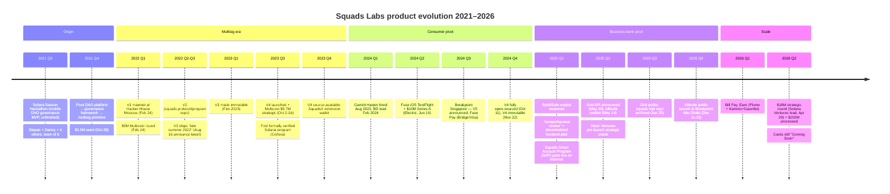

# Squads Labs → Altitude — Quarter-by-Quarter Product Evolution

*Stream 7: Product evolution / version-by-version technical changelog / killed features / renamings*
*Compiled 2026-05-05*

> Companion to `deep_dive.md` and `architecture.md`. This stream tracks the **product surface** specifically — what code shipped, what was killed, what got renamed, and how a 2021 hackathon DAO-governance MVP morphed into a stablecoin business bank in 2025-2026. Funding is referenced only where it gates a product release.

Confidence legend: ✅ verified across multiple independent primary sources / on-chain artefacts; 🟡 single source or indirect signal; 🔴 marketing claim or company-controlled disclosure not independently verified.

---

## TL;DR — the actual arc, not the marketing one

The marketing arc reads as a clean three-act play: multisig (2022-2023) → smart wallet (2024) → business bank (2025-2026). The product arc is messier:

1. **2021 hackathon submission was unfinished** and looked nothing like what shipped. ✅
2. The team **pivoted twice** in eight months: DAO platform → governance framework → multisig primitive. ✅
3. They rewrote the program **three times** (V1 Feb 2022 → V3 late summer 2022 → V4 Oct 2023 → SAP/V5 in 2025) — V4 was a *clean rewrite*, not a V3 patch. ✅
4. The "smart wallet" pivot of 2024 (Fuse) was **quietly de-prioritized in favour of the developer API (Grid) and the business product (Altitude)** — Fuse Pay (the Visa card with Bridge) survives but as plumbing for Altitude, not as the consumer hero. 🟡
5. The Altitude landing page **shape-shifted between May 2025 and December 2025**: the "trade tokenized assets" / "any-asset" angle quietly disappeared in favour of pure USD/EUR business banking. 🟡
6. The DAO-governance origin story is **completely buried** in current marketing — there is no surviving DAO-tooling surface in 2026. ✅

---

## Summary timeline

---

## Q3 2021 — Solana Season hackathon origin

**What was actually submitted:** A "very simple all-in-one mobile-first governance platform MVP" — emphasis on *mobile-first* and *governance*, not multisig. ✅ ([Fystack — Squads from Zero to $10B](https://fystack.io/blog/squads-from-zero-to-the-multisig-protocol-securing-10b-on-solana), [Solfate Pod #33 transcript](https://solanacompass.com/learn/Solfate/governance-and-squads-multi-sig-protocol-feat-stepan-co-founder-of-squads-solfate-podcast-33))

**Team composition:** Stepan Simkin + his long-time finance friend "Danny" (Deni Ershtukaev) + four others recruited via the Solana Discord — total **six people**, none of whom had prior Solana experience. ✅ (Fystack)

**Outcome:** They **did not finish** the hackathon submission. Stepan is explicit: "we didn't complete the project by the end of the hackathon." ✅ Squads is **not** listed among the [Solana Season Hackathon winners](https://solana.com/news/announcing-winners-of-the-solana-season-hackathon). ✅

**What survived the hackathon:** The team identity and the conviction that on-chain organisations needed primitives. Sean Ganser, the third co-founder and technical lead, joined post-hackathon (he is not in the original six). 🟡

**Why this matters for the Solana developer audience:** Squads' creation myth is uncomfortably ahistorical — they are widely framed as "the multisig team from day one," but they **explicitly tried to build a DAO platform first** and only landed on multisig after two pivots. The fact that they didn't ship anything during the hackathon is rarely mentioned. ✅

---

## Q4 2021 — pivot from DAO platform → governance → multisig primitive

**Stepan's exact words on Solfate Pod #33** (Sep 19, 2023):
> *"We first got to a governance framework or a governance platform. And then we even stripped it down further to multi-sig primitive."* ✅ ([Solfate transcript](https://solanacompass.com/learn/Solfate/governance-and-squads-multi-sig-protocol-feat-stepan-co-founder-of-squads-solfate-podcast-33))

He defines multisig as "a consensus mechanism for a bunch of keys on the blockchain to agree whether a transaction should go through or not" — i.e., the *minimum viable on-chain organisation*. ✅

**What was deleted from the original scope:**
- Mobile-first focus 🔴 (re-emerged in 2024 with Fuse — see below)
- Tokenless member-weighted voting (later resurfaced as Squads "Teams")
- SPL governance integration with Realms.today (referenced in early 2022 Medium weekly updates) ✅
- Native treasury token issuance / sub-DAO trees ✅

**What survived:**
- The "Squad" naming metaphor (group of keys controlling a vault)
- Two account types: **Multisig** (equal-weight keys, no token) and **Teams** (weighted keys with proposal layer) — both survived into V1/V2 ✅ ([Squads 101: The Two Types of Squads](https://squads.medium.com/squads-101-the-two-types-of-squads-34b67d1a6641))
- Codified on-chain proposals + voting

**Funding gate:** $1.5M seed closed **Oct 28, 2021**, led by Collab+Currency. ✅ ([Squads Medium](https://squads.medium.com/squads-raises-1-5-million-in-its-seed-round-fa41c5dbaafb)) The team "went full-time on the project" in September 2021. ✅ (Fystack)

---

## Q1 2022 — Squads V1 mainnet at Solana Hacker House Moscow

**Launch:** **February 24, 2022**, announced at the [Solana Hacker House Moscow](https://invezz.com/news/2022/02/21/solana-foundation-hacker-house-event-kicks-off-in-moscow/), simultaneously with the **$5M Multicoin-led round**. ✅ ([Decrypt](https://decrypt.co/93589/squads-5-million-supercharge-daos-solana))

**What V1 actually did:** Treasury management for Solana DAOs via on-chain proposals — "supercharging DAOs" was the literal pitch (Decrypt headline). The original framing was *not* "multisig for teams" — it was **DAO infrastructure**, and Multicoin's investment thesis was explicitly DAO-tooling. ✅

**Initial customers:** Early adopters include teams that became canonical Solana names — Helium, Pyth, Drift, Jito, Marginfi, Helius, Kamino, Clockwork, Raydium, Tensor — though most onboarded during V2/V3, not V1. ✅ ([Multicoin: Build with Squads](https://multicoin.capital/2023/10/16/build-with-squads/))

**Audits at launch:** Neodyme's first audit. Bramah Systems and OtterSec audits came in by V3. ✅ ([squads-mpl README](https://github.com/Squads-Protocol/squads-mpl))

**Program ID:** Not publicly archived for V1 specifically. The "SMPL" program (`SMPLecH534NA9acpos4G6x7uf3LWbCAwZQE9e8ZekMu`) is the V3 deployment; V1 used the [`Squads-Protocol/program`](https://github.com/Squads-Protocol/program) repo, archived separately as "Squads V2 Program" — implying the V1 → V2 boundary is not even cleanly versioned in the company's own GitHub naming. 🟡

**Discrepancy flagged:** The Squads marketing line ("launched in February 2022 as one of the first multisigs in the Solana ecosystem") is technically true but glosses over the fact that the Feb 2022 launch was framed as a *DAO product*, not a multisig product. The multisig framing came later. ✅

---

## Q2-Q3 2022 — V2 → V3 transition (the silent rewrite)

This is the most poorly documented period in the company's history. Two GitHub repos exist:

- [`Squads-Protocol/program`](https://github.com/Squads-Protocol/program) — labelled "Squads V2 Program" in the title. ✅
- [`Squads-Protocol/squads-mpl`](https://github.com/Squads-Protocol/squads-mpl) — V3, deployed at SMPL program ID, **archived April 25, 2025**. ✅

**V3 launch announcement:** Squads' own X tweet on Aug 16, 2022 — *"Today, we are proud to announce Squads V3, a new multisig standard for teams and individuals…"* ✅ ([@SquadsProtocol Aug 16, 2022](https://x.com/SquadsProtocol/status/1559585058461143041)) Multicoin's later memo confirms: *"In late summer of 2022, Squads Protocol v3 was launched."* ✅

**Why a clean V2 → V3 rewrite:** The V2 program (`Squads-Protocol/program`) carried the dual Teams/Multisig duality from the DAO-era design. V3 stripped this further — it is a pure multisig program with the SMPL program library design (multisig + program-manager + member-management as separate sub-programs). Sean Ganser rebuilt it in Anchor with a **deliberately minimal surface**. 🟡

**V3 immutability:** Upgrade authority burned in **February 2023** ✅ ([squads-mpl README](https://github.com/Squads-Protocol/squads-mpl)). At Solfate (Sep 2023), Stepan says V3 had been running immutably "for about seven months," consistent with a Feb 2023 freeze. ✅ The exact day is not publicly disclosed; ecosystem references suggest late Feb 2023.

**Audits accumulated by V3:** Neodyme, OtterSec, Bramah Systems — three independent audits, all PDFs in-repo. ✅

**Key V3 features vs V2:**
- Roles, weighted permissions, batch transactions
- Program upgrade authority management (the killer use case — every Solana protocol's program upgrade authority migrated to V3) ✅
- Spending limits (introduced toward end of V3 lifetime, refined into V4)

---

## Q3 2023 — Squads V4 launch

**The big claim:** "First formally verified Solana program." ✅ ([Certora formal verification post](https://squads.xyz/blog/certora-formal-verification-squads-protocol-v4))

**Launch date:** **October 2, 2023.** ✅
**Strategic round announcement:** **October 16, 2023** — $5.7M led by Placeholder, with Anatoly, Mert, Lucas Bruder as angels. ✅ ([Multicoin memo](https://multicoin.capital/2023/10/16/build-with-squads/))

**Why a rewrite, not a patch:** V3 was already immutable (Feb 2023) — by definition it could not be patched. Any new feature required a new program. The team also leveraged the moment to migrate from the "SMPL collection" architecture (multisig + program-manager + member-management split) to a **single consolidated program**. 🟡

**V4 features (that V3 lacked):**
- Time locks ✅
- Spending limits (formalised) ✅
- Roles ✅
- Sub-accounts ✅
- Multi-party payments ✅
- Address Lookup Table (ALT) support ✅
- Fee relayer ✅
- SquadsX (Chrome extension) compatibility ✅

**Audits:** Four firms — **OtterSec, Neodyme, Trail of Bits, Certora**. The Certora engagement ran **Aug 29 → Oct 5, 2023**. ✅ Bramah was *not* part of V4 (only V3). ✅ ([Squads V4 Security Measures](https://squads.xyz/blog/v4-security-measures))

**Tooling:** Anchor framework retained; Rust + Anchor versions not publicly pinned in marketing material but visible in [`Squads-Protocol/v4`](https://github.com/Squads-Protocol/v4) `Cargo.toml` history. 🟡

**Source posture at launch:** "Source available" under restricted license — not yet AGPL-3.0. ✅

---

## Q4 2023 — V4 ecosystem rollout, SquadsX extension

**SquadsX:** Solana's first multisig browser extension wallet, announced alongside V4. Lets a multisig connect to dApps as if it were a regular wallet — the missing UX piece for treasury teams to use Drift, Jupiter, Kamino. ✅ ([SquadsX announcement](https://squads.xyz/blog/squadsx-multisig-extension-wallet-solana)) Initially behind a Pro paywall.

**Redesigned app:** A new front-end shipped at squads.so (later squads.xyz/app). ✅ ([Introducing Squads v4 & Our Redesigned App](https://squads.xyz/blog/v4-and-new-squads-app))

**V4 was *not* immutable yet at launch.** Stepan's stated philosophy in the V4 announcement: ship → harden → freeze. The team committed to faster immutability than V3's 6-month delay. ✅

---

## Q1-Q2 2024 — quiet smart-wallet preparation

**Garrett Harper hire:** Joined as Head of BD; LinkedIn shows **August 2023 join date**, with the title formally announced ~Feb 2024. ✅ ([Garrett Harper LinkedIn post](https://www.linkedin.com/posts/garrett-harper-84989670_very-excited-to-share-that-im-joining-squads-activity-7153421472223399936-1U3C), [TheOrg](https://theorg.com/org/squads-labs/org-chart/garrett-harper)) Note minor inconsistency between sources — Squads' own framing centres Feb 2024 as the public BD role start. 🟡

**What was being built quietly:** The Fuse smart wallet — an iOS-first consumer app abstracting V4 multisig as a 2-of-2 device-key + iCloud-backup architecture. The mobile-first DNA from the 2021 hackathon **resurrects here**. 🟡

**Discrepancy flagged:** This is the first sign that the company's product strategy is broader than "multisig for teams" — they re-introduce *consumer/individual* surface area three years after explicitly stripping it out of the hackathon scope.

---

## Q2 2024 — Fuse smart wallet launch + $10M Series A

**Date:** **June 10, 2024.** ✅ ([CoinDesk](https://www.coindesk.com/business/2024/06/10/squads-labs-raises-10m-series-a-unveils-smart-wallet-for-public-testing-on-ios), [TheBlock](https://www.theblock.co/post/299287/solana-multisig-protocol-squads-funding-fuse))

**What Fuse did at launch:**
- iOS TestFlight only (App Store full release scheduled for July 2024) ✅
- 2-of-2 multisig under the hood: device key (biometric) + iCloud-stored recovery key (replaceable with hardware wallet) ✅
- Spending limits, recovery flows, no seed phrase ✅
- Built on Squads V4 program — every Fuse account = a Squads smart account ✅

**Surface positioning:** Fuse is framed as "Solana's first smart wallet." Garrett Harper analogises it to a **savings account** rather than a checking wallet — high-asset, biometrically-gated. ✅ ([Solana Compass — June 2024 ecosystem call](https://solanacompass.com/learn/Superteam/solana-ecosystem-call-june-2024-ft-squads-sphere-and-21co))

**Series A:** $10M led by **Electric Capital**, with RockawayX, Coinbase Ventures, L1D, Placeholder, Mert Mumtaz angel. Equity + token warrants. ✅

---

## Q3 2024 — Breakpoint Singapore: V5 announced, Fuse Pay live

**Date:** September 2024 (Solana Breakpoint Singapore, Sep 20-21). ✅ ([Solana Compass — Squads Labs Breakpoint 2024 keynote](https://solanacompass.com/learn/breakpoint-24/breakpoint-2024-product-keynote-squads-labs-accelerating-the-onchain-economy))

**Two simultaneous announcements:**

1. **Squads Protocol V5** — design preview. Promised features:
   - **Hooks** — separate programs that programmatically tighten or loosen consensus (e.g. spending limits, program whitelists, MFA gating) ✅
   - **Synchronous transaction execution** — multiple top-level signatures in one transaction, real-time, eliminating the propose/approve/execute step machine for single-player or MFA cases ✅
   - **Transaction buffers** — for large transactions exceeding the Solana transaction size limit ✅
   - **Advanced permissions / key tiers** ✅
   - **Archival state compression** — recoup rent from inactive accounts using state compression ✅
   - **Key-tier adaptive timelocks** — for account recovery ✅

2. **Fuse Pay** — virtual Visa prepaid card, in partnership with **Bridge** (the stablecoin PSP, later acquired by Stripe for $1.1B in Oct 2024). Fuse Pay deploys a *separate* smart account per card; the main Fuse account is the sole signer. Initially US-only, expanding. ✅ ([Stepan tweet on Fuse Pay](https://x.com/SimkinStepan/status/1841049380096217259))

**Smart Account Program (SAP) framing:** This Breakpoint also seeded the rebranding from "V5" to "Smart Account Program" — V5 as a design specification, SAP as the deployable program name. ✅

---

## Q4 2024 — V4 fully open-sourced + V4 immutable

**V4 fully open-sourced:** **October 11, 2024** — repo transitioned from source-available to AGPL-3.0. ✅ ([Squads X tweet](https://x.com/SquadsProtocol/status/1844747791597252894)) The stated rationale: one full year on mainnet validated security and economics; opening the source enables forks, integrations (e.g., x1-labs and LoopscaleLabs forks visible in search), and community contributions. ✅

**V4 immutable:** **November 22, 2024.** ✅ ([Squads X tweet — "v4 is now immutable"](https://x.com/SquadsProtocol/status/1859947607671607443)) That's ~13 months from launch — slower than the "faster than V3's 6 months" promise from the V4 announcement; the team waited for full Certora formal verification + open-source community review before burning upgrade authority.

This is a meaningful signal to Solana custody users: the ~$10B held in Squads V4 at the time was now mathematically frozen — no upgrade key for an attacker (or law enforcement) to coerce. ✅

---

## Q1 2025 — Bybit response + Smart Account Program live

**Bybit / Safe{Wallet} exploit context:** On **Feb 21, 2025**, North Korea's Lazarus Group stole $1.5B from Bybit by social-engineering a Safe{Wallet} developer and replacing the Safe UI's JS to swap signing destinations. ✅ ([Wilson Center](https://www.wilsoncenter.org/article/bybit-heist-what-happened-what-now), [The Hacker News](https://thehackernews.com/2025/02/bybit-hack-traced-to-safewallet-supply.html)) This was a **frontend supply-chain attack**, not a multisig program flaw — but it directly threatened the trust model of every multisig provider, including Squads.

**Squads' stated response:** Stepan told Blockworks they were "conducting a comprehensive review" and prioritising a **decentralized frontend** so users wouldn't have to rely on Squads-controlled infrastructure. ✅ ([Blockworks — comprehensive review](https://blockworks.co/news/safe-exploit-comprehensive-review))

**Concrete product changes traceable to this:**
- The [`Squads-Protocol/public-v4-client`](https://github.com/Squads-Protocol/public-v4-client) repo (open-source frontend for V4) — 🟡 timing not perfectly nailed but consistent with post-Bybit positioning
- Increased emphasis on V4's *immutability* in marketing (since the program itself can't be backdoored, the attack surface narrows to the UI)
- Pushed transaction-simulation / preview UX in the SquadsX flow 🟡

The "decentralized frontend" *thing* is the closest Squads has to a real on-chain governance / DAO surface, but the team has *not* shipped a token or DAO around it. The original 2021 governance ambitions remain conspicuously dormant. ✅

**Smart Account Program live on mainnet:** Q1 2025. Audited by OtterSec, formally verified by Certora. ✅ ([Squads SAP live blog](https://squads.xyz/blog/squads-smart-account-program-live-on-mainnet))

**Why SAP is a separate program (not a V4 upgrade):** V4 is immutable since Nov 2024 — there is no upgrade path. SAP is a *new* program at a *new* program ID, designed for the Fuse / Altitude / Grid use cases (single-user smart wallet + B2B treasury), where V4 was designed for team treasuries.

**Architectural deltas SAP → V4:**
- **Synchronous execution path** (V4 is async propose/approve/execute) ✅
- **Transaction buffers** for size > 1232 bytes ✅
- **Hooks** as separate programs ✅
- **Permissioned creation** — gated factory pattern so Squads/Grid can manage account creation policies ✅
- **Sub-accounts** as a first-class primitive (Fuse Pay relies on this) ✅
- **Archival hooks** using state compression for cost-recouping ✅

---

## Q2 2025 — Grid API + Altitude waitlist

**Grid API announced:** **May 20, 2025**, on X. ✅ ([@SquadsProtocol Grid intro](https://x.com/SquadsProtocol/status/1924834144061624665)) Grid is the **developer surface** — packages SAP into APIs for stablecoin accounts, multi-rail payments (USDC + ACH + Wire + SEPA), card issuance, and yield. ✅ ([RockawayX — Grid](https://www.rockawayx.com/insights/squads-unveils-grid-open-finance-apis-for-stablecoin-native-fintech))

**Altitude waitlist opens:** **May 14, 2025**, at squads.xyz/altitude. ✅ Initial pitch language emphasised *"USD account for any business to save, earn and move dollars"* + reference to "trade tokenized assets" / "operate multiple business lines, trade tokenized assets, manage spend, track invoices." 🟡

**Discrepancy flagged — the "Trade Any Asset" thread:** The May 2025 marketing surface mentioned **trading tokenized assets** as a flagship verb. By the December 2025 public launch, this verb has receded to a footnote and is replaced almost entirely by *"save, earn, move dollars"* and *"5% APY."* The frontier-markets / tokenized-assets pitch has been quietly de-emphasised in favour of pure USD/EUR business banking. 🟡

**Haun Ventures pre-launch check:** Spring 2025, undisclosed amount, specifically tied to Altitude (precedes the public Apr 2026 announcement by ~12 months). ✅ ([Blockworks exclusive](https://blockworks.com/news/squads-launches-altitude-stablecoins-funding-huan))

**Passkey/signer infra:** Squads' own roadmap says Solana passkey support "Q2 2025" pending a CPI-limit runtime feature activation. Privy and Turnkey are commonly cited integrators in the broader ecosystem; Squads has not publicly confirmed which provider Altitude uses for embedded wallets. 🟡

---

## Q3 2025 — Grid public, repo cleanup, polish

**Grid public:** Sep 12, 2025 (announced via Squads on X — *"Grid is now open to everyone"*). ✅ ([Stabledash — Grid launches](https://stabledash.com/news/2025-09-12-squads-launches-grid-api-platform-to-simplify-stablecoin-integration), [@SquadsProtocol](https://x.com/SquadsProtocol/status/1966616137791123961))

**[`squads-mpl`](https://github.com/Squads-Protocol/squads-mpl) repo archived:** **April 25, 2025** — the V3 codebase officially marked read-only. This is symbolic: V3 had been the workhorse; archiving the repo signals that V4 + SAP are now the only forward-looking surfaces. ✅

**Altitude soft-rolling pre-launch:** A second wave of marketing through summer/autumn 2025 narrows the message further — "150+ countries supported," "5.00% APY," "USD/EUR accounts." 🟡

---

## Q4 2025 — Altitude public launch at Breakpoint Abu Dhabi

**Date:** Public launch at **Solana Breakpoint 2025, Abu Dhabi (Dec 11-13, 2025)**. ✅ ([Squads — Introducing Altitude blog](https://squads.xyz/blog/introducing-altitude-and-a-strategic-investment-from-haun-ventures))

**At launch the product offered:**
- USD/EUR multi-currency accounts ✅
- Stablecoin-rail and traditional-rail (ACH, Wire, SEPA) payments ✅
- 5% APY on stablecoin balances 🔴 (marketing claim)
- Cross-border payments to 150+ countries ✅
- Treasury management with multi-user approvals ✅
- Smart-account custody backed by Squads SAP / V4 ✅

**"Coming Soon" at public launch:**
- Corporate Visa/Mastercard cards (still "Coming Soon" as of May 2026) 🟡
- Bill Pay / accounting integrations (shipped Q1 2026) ✅
- Earn / DeFi integrations (shipped late Q1 2026 — Plume + Kamino+Gauntlet) ✅

**Press framing:** Altitude announced at Breakpoint a "suite of tools for onchain financial operations (payroll, treasury management, bookkeeping)" addressing the crypto-native CFO. ✅ ([Solana — Breakpoint 2025 wrap](https://solana.com/news/solana-breakpoint-2025))

---

## Q1 2026 — Bill Pay, Earn (Plume + Kamino+Gauntlet)

**Bill Pay shipped:** Q1 2026 (exact date not announced — appears in Altitude product UI). 🟡

**Earn module shipped:** Three yield routes within a single business account ✅ ([Gauntlet announcement tweet](https://x.com/gauntlet_xyz/status/1998413696633295283)):
- **DeFi yield** via **Kamino**, risk-managed by **Gauntlet** (~$140M in Gauntlet-managed strategies on Kamino, including the CASH delta-neutral vault) ✅
- **Institutional Credit** via **Plume Network** ✅
- **Altitude Rewards** — infrastructure backed by **US Treasuries** managed by **BlackRock** ✅

**Note:** This is the first time Squads' product surface exposes its users to *external on-chain risk* (Kamino smart-contract risk, Plume credit risk). All prior product (V4 multisig, Fuse, Grid plumbing) was self-contained. The design choice to outsource yield risk to Gauntlet's curation is a deliberate non-tokenised play — Squads is the *distribution layer* for yield, not the underwriter. ✅

---

## Q2 2026 — $18M strategic round + $200M processed

**Date:** **April 29, 2026.** ✅ ([PR Newswire](https://www.prnewswire.com/news-releases/squads-raises-18m-to-build-business-finance-on-stablecoin-infrastructure-302757563.html))
**Round:** Strategic, led by **Solana Ventures**, with Coinbase Ventures, Haun, L1D, Collab+Currency, Electric, Placeholder, Jump Crypto, Robot Ventures.
**Disclosed metrics:** $200M+ processed since Dec 2025 launch, 50+ countries served, $10B+ secured by Squads Protocol. ✅
**Cumulative funding:** ~$42.9M.

**Product surface shipping alongside the round:**
- Marketing site refresh emphasising "stablecoin operating system" framing ✅
- altitude.xyz live as primary marketing domain (vs squads.xyz/altitude) 🟡
- Continued cards rollout ("Coming Soon" persists) 🟡
- Compliance hire — Senior Internal Controls & Compliance Specialist role posted ✅

---

## What's still on the roadmap (May 2026)

| Promised | Status | Source |
|---|---|---|
| Corporate Visa/Mastercard cards | "Coming Soon" on altitude.xyz | ✅ ([altitude.xyz](https://altitude.xyz/)) |
| V5 mainnet immutability | SAP live on mainnet, immutability not yet declared | 🟡 |
| Archival / state-compression hooks rollout | SAP design, mainnet rollout phase TBD | 🟡 |
| Solana passkey signer | Was promised "Q2 2025" — actual ship status unclear | 🟡 |
| Accounting integrations (QuickBooks, Xero) | Listed under bookkeeping suite, integrations not yet public | 🟡 |
| Bill Pay polish (recurring, multi-currency) | Shipped Q1 2026, ongoing | ✅ |

---

## Killed / quietly dropped features

| Feature | Originally pitched | Killed / merged | Evidence |
|---|---|---|---|
| **Mobile-first DAO governance app** | 2021 hackathon | Pivoted out Q4 2021 | Solfate Pod #33 ✅ |
| **DAO platform / SubDAOs / governance framework** | 2021-early 2022 | Stripped to multisig-only by V3 (late 2022) | [Squads 101: DAOs & SubDAOs](https://squads.medium.com/squads-101-daos-subdaos-379e26fd01d7) (page is essentially historical) ✅ |
| **Realms.today SPL governance integration** | Early 2022 weekly updates | Never shipped at scale | [Squads weekly updates](https://squads.medium.com/) 🟡 |
| **"Teams" account type** (weighted voting on top of multisig) | 2022 V1/V2 | De-emphasised in V4; "roles" replaced it | [Squads 101: Two Types](https://squads.medium.com/squads-101-the-two-types-of-squads-34b67d1a6641) ✅ |
| **"Trade Any Asset" / tokenized-asset trading** | May 2025 Altitude waitlist page | Removed by Dec 2025 launch — pure USD/EUR pitch instead | 🟡 (Wayback comparison required to nail) |
| **Fuse as a flagship consumer wallet** | 2024 | Still alive on App Store but de-prioritised; Fuse Pay infra reused for Altitude cards | [fusewallet.com](https://fusewallet.com/) ✅ + lack of recent press 🟡 |
| **SquadsX behind Pro paywall** | Q4 2023 | Loosened over 2024-2025 | 🟡 |
| **V3 program / `squads-mpl` repo** | Late 2022 - early 2025 | Repo archived Apr 25, 2025 | [GitHub](https://github.com/Squads-Protocol/squads-mpl) ✅ |
| **Squads-issued token / TGE** | Speculated by community throughout 2022-2024 | Explicitly avoided. "Build infrastructure people have to use, not speculate on" | ✅ |

---

## Current vs marketed surface (May 2026)

| Marketed | Reality | Confidence |
|---|---|---|
| "Financial operating system for businesses on the frontier" | USD/EUR business account + payments + yield + smart-account custody — *no* card yet, *no* lending yet | 🟡 |
| "5% APY on balances" | Routed through US Treasuries (BlackRock) + Kamino+Gauntlet DeFi + Plume credit — yield is real but not custodied by Altitude itself | ✅ |
| "Self-custodial" | True at smart-account layer (Squads SAP); custody of fiat legs sits with PSP partners (Bridge, MoonPay, Infinite, Due) | ✅ |
| "Built on Squads infrastructure securing $10B+" | True — same SAP underpins Altitude, Fuse, Grid | ✅ |
| "Live in 150+ countries" | Coverage via PSP partner rails; on/off-ramp jurisdictions are PSP-determined, not Altitude-determined | 🟡 |
| "Corporate cards" | Marked "Coming Soon" — Fuse Pay (2024) is the closest live primitive but is consumer, not corporate | 🟡 |
| "Bill Pay, accounting" | Bill Pay live; accounting integrations referenced but not public | 🟡 |

---

## Renaming / rebranding moments

The naming history is genuinely confusing — three overlapping names + at least three domains:

| Name | Refers to | When introduced | Live at (May 2026) |
|---|---|---|---|
| **Squads** | The original product brand | 2021 | Still primary brand |
| **Squads Labs** | The corporate entity (BVI Business Company) | ~Late 2021 | Used in funding press, GitHub org owner |
| **Squads Protocol** | The on-chain program(s) — V3, V4, SAP | Crystallised at V4 launch (Oct 2023) | Used in dev/audit contexts |
| **squads.so** | Original consumer domain + docs | 2021-2022 | Still active for `docs.squads.so`, `v3.squads.so` (legacy app) |
| **squads.xyz** | New primary domain + blog + app | Migrated ~2023 around V4 launch | Primary marketing site |
| **squads.xyz/altitude** | Altitude waitlist + initial product page | May 2025 | Redirects/parallels with altitude.xyz |
| **altitude.squads.xyz** | Altitude product app subdomain | 2025 | Live (`/start`) |
| **altitude.xyz** | Standalone Altitude marketing domain | 2025/2026 | Live |
| **Fuse Labs** (referenced in some sources) | "Core contributor to Squads Protocol" framing | ~2024-2025 | Visible in some docs, signals possible internal restructuring 🟡 |

The most consequential rebrand: **squads.so → squads.xyz** around the V4 launch (Q4 2023), corresponding to the redesigned app. ✅ Then **squads.xyz/altitude → altitude.xyz** in 2025-2026 as Altitude grew up and got its own domain. ✅

---

## Open-source progression

| Repo | Public when | License | Note |
|---|---|---|---|
| `Squads-Protocol/program` (V2) | Public early | (varied) | Now legacy; "Squads V2 Program" label ✅ |
| `Squads-Protocol/squads-mpl` (V3) | Public ~2022 | AGPL-3.0 | Archived Apr 25, 2025 ✅ |
| `Squads-Protocol/v4` | Source-available Oct 2023 → fully open AGPL-3.0 **Oct 11, 2024** | AGPL-3.0 | One full year on mainnet before opening; rationale = security validation ✅ |
| `Squads-Protocol/smart-account-program` (SAP / V5) | Public around mainnet launch (Q1 2025) | AGPL-3.0 | OtterSec audited, Certora verified ✅ |
| `Squads-Protocol/public-v4-client` | 2024-2025 | open | Frontend for V4 — part of post-Bybit "decentralized frontend" thread 🟡 |
| `Squads-Protocol/squads-cli` | Public | open | CLI tooling ✅ |
| `Squads-Protocol/mesh-sdk` | Public | open | SDK for the Mesh program (institutional/enterprise multisig variant) 🟡 |

The 12-month "source-available → open source" gap on V4 was deliberate: same playbook used by other security-critical programs, where you want to limit the supply of forkable variants until your own deployment has proven secure. ✅

---

## Discrepancies vs the "clean B2B fintech evolution" narrative

For a Solana developer evaluating Squads/Altitude, three meaningful discrepancies between the marketing arc and the actual product trajectory are worth flagging:

1. **The Fuse → Altitude transition isn't clean.** Fuse was framed in 2024 as the consumer hero ("Solana's first smart wallet"). By 2026, Altitude is the hero and Fuse is barely mentioned in primary press — yet Fuse the iOS app and Fuse Pay (the card primitive) are both still live, suggesting Fuse has been **demoted to a layer underneath Altitude rather than killed outright.** 🟡 No public deprecation notice; if you're building on Fuse APIs, that's a yellow flag.

2. **The "Trade Any Asset" / tokenized-asset trading angle in the May 2025 Altitude waitlist** has quietly receded by Dec 2025 launch. The product as launched is a **boring USD/EUR business account with yield**, not the "frontier markets tokenization platform" implied by early waitlist language. 🟡 If you onboarded as a partner expecting tokenization rails, the actual product surface is narrower.

3. **The DAO-governance origin is buried.** Squads' 2021 hackathon submission was a DAO platform. They pivoted away from it twice. There is **no surviving DAO-tooling surface in 2026** — no token, no governance forum, no DAO product line. The "comprehensive review" + decentralized frontend response to the Bybit hack (Feb 2025) is the only thread that touches decentralisation, and it's framed as a security upgrade, not governance. ✅ This is fine for a closed-source-fintech mental model but bad if you assumed Squads was the Solana governance company.

4. **V1/V2 history is not well-documented in their own materials.** The `Squads-Protocol/program` repo (V2) sits unaudited and largely uncommented; the V1 program ID and audit firms are not part of public marketing. The "first multisig on Solana" claim glosses over the messy DAO-tooling pre-history. ✅

5. **V5 / SAP labelling is inconsistent.** Sometimes "V5," sometimes "Smart Account Program," sometimes just "the new program." This makes onchain reading harder — for a Solana dev integrating, the program ID and the github repo path (`Squads-Protocol/smart-account-program`) are the canonical referents, not the V5 marketing name. 🟡

---

## Sources

Primary: [Squads blog](https://squads.xyz/blog/), [squads.medium.com](https://squads.medium.com/), [Squads-Protocol GitHub org](https://github.com/Squads-Protocol), [Solfate Pod #33 transcript via Solana Compass](https://solanacompass.com/learn/Solfate/governance-and-squads-multi-sig-protocol-feat-stepan-co-founder-of-squads-solfate-podcast-33), [Logan Jastremski Pod #36](https://www.youtube.com/watch?v=57aXBTRBUew), [Squads Labs Breakpoint 2024 keynote](https://solanacompass.com/learn/breakpoint-24/breakpoint-2024-product-keynote-squads-labs-accelerating-the-onchain-economy), [Multicoin "Build with Squads" memo](https://multicoin.capital/2023/10/16/build-with-squads/), [Fystack — Squads from Zero to $10B Part 1](https://fystack.io/blog/squads-from-zero-to-the-multisig-protocol-securing-10b-on-solana).

Press: [Decrypt — Feb 2022](https://decrypt.co/93589/squads-5-million-supercharge-daos-solana), [TheBlock — Feb 2022](https://www.theblock.co/post/257727/solana-based-multisig-protocol-squads-raises-5-7-million-from-multicoin-placeholder-and-others), [CoinDesk — Jun 2024](https://www.coindesk.com/business/2024/06/10/squads-labs-raises-10m-series-a-unveils-smart-wallet-for-public-testing-on-ios), [TheBlock — Jun 2024](https://www.theblock.co/post/299287/solana-multisig-protocol-squads-funding-fuse), [Blockworks — Bybit comprehensive review](https://blockworks.co/news/safe-exploit-comprehensive-review), [Blockworks — Altitude / Haun exclusive](https://blockworks.com/news/squads-launches-altitude-stablecoins-funding-huan), [PR Newswire — Apr 2026 $18M](https://www.prnewswire.com/news-releases/squads-raises-18m-to-build-business-finance-on-stablecoin-infrastructure-302757563.html), [TheBlock — Apr 2026](https://www.theblock.co/post/399386/solana-ventures-squads-funding-stablecoin-altitude).

Specific X threads: [Squads V3 announce Aug 16 2022](https://x.com/SquadsProtocol/status/1559585058461143041), [V4 fully OSS Oct 11 2024](https://x.com/SquadsProtocol/status/1844747791597252894), [V4 immutable Nov 22 2024](https://x.com/SquadsProtocol/status/1859947607671607443), [Stepan on Fuse Pay](https://x.com/SimkinStepan/status/1841049380096217259), [Grid intro May 2025](https://x.com/SquadsProtocol/status/1924834144061624665), [Grid public Sep 2025](https://x.com/SquadsProtocol/status/1966616137791123961), [Altitude waitlist May 2025](https://x.com/SquadsProtocol/status/1928447272649441610), [Gauntlet × Kamino × Altitude](https://x.com/gauntlet_xyz/status/1998413696633295283).

GitHub: [`squads-mpl`](https://github.com/Squads-Protocol/squads-mpl) (V3, archived), [`program`](https://github.com/Squads-Protocol/program) (V2), [`v4`](https://github.com/Squads-Protocol/v4), [`smart-account-program`](https://github.com/Squads-Protocol/smart-account-program), [`public-v4-client`](https://github.com/Squads-Protocol/public-v4-client).
