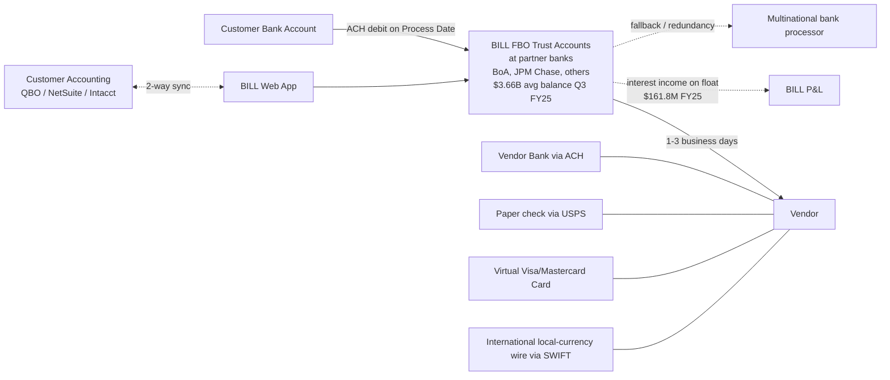

# BILL Holdings (NYSE: BILL) — Deep Technical Research Report

*Research date: 2026-06-03. Confidence labels: ✅ verified from primary or near-primary sources, 🟡 inferred from multiple secondary sources, 🔴 marketing claim / unverified.*

---

## 1. Company snapshot and product footprint

BILL Holdings, Inc. is the publicly-traded parent of what most people still call "Bill.com" — a financial operations platform aimed at the "Fortune 5 Million" (SMB to lower-mid-market). FY2025 (ended June 30, 2025) revenue was **$1.5B** with **$23.8M net income**, a return to GAAP profitability versus a $28.9M loss in FY2024 ([10-K summary](https://www.stocktitan.net/sec-filings/BILL/10-k-bill-holdings-inc-files-annual-report-99b223bf99d7.html)). Q3 FY2026 (ended March 31, 2026) revenue was **$406.6M, +13.5% YoY**, with core revenue +16% and first sustained GAAP profitability ([Q3 FY2026 8-K](https://www.sec.gov/Archives/edgar/data/0001786352/000162828026032064/bill-2026331xexx991.htm)).

The four-SKU mental model from prior research is **mostly correct but incomplete** — BILL has been actively bundling and adding adjacent SKUs since 2024. As of June 2026, the buyable surface is:

| SKU | Status | Sold to |
|---|---|---|
| BILL AP (Accounts Payable) | Core, paid per user | SMBs |
| BILL AR (Accounts Receivable) | Sold bundled with AP, same tiers | SMBs |
| BILL Spend & Expense (ex-Divvy) | Free SaaS, monetized via interchange | SMBs |
| BILL Accountant Console | Free to enrolled CPA firms; clients pay | CPA firms + multi-entity firms |
| BILL Insights (Cash Flow Forecasting, from Finmark) | Bundled into Corporate/Enterprise after Finmark standalone shutdown 4/1/2026 | All paid customers |
| BILL Procurement | Launched April 2025, GA, premium add-on | Corporate/Enterprise |
| BILL 1099 Filing | Launched December 2024 | All AP customers |
| BILL API Platform / Elements | Launched April 2025 | Developers, partners, accountant firms |
| BILL Connect | White-label embedded inside bank portals | JPM Chase, Wells Fargo, PNC, KeyBank, Commerce, FNBO |

✅ The 4-SKU model is the marketing surface; in reality BILL is now a 9-SKU platform with Procurement, 1099, API Platform, Insights, and Connect added since 2023.

---

## 2. Pricing — verified current rates (June 2026)

Direct customer pricing as currently sold ([BILL pricing](https://www.bill.com/product/pricing), corroborated by [Tekpon](https://tekpon.com/software/bill-com/pricing/), [Capterra](https://www.capterra.com/p/166559/BILL/pricing/), [Vendr](https://www.vendr.com/marketplace/bill-com)):

| Tier | Per user / month | Who it's for |
|---|---|---|
| Essentials (AP **or** AR) | **$45** | Solo / single-entity SMB |
| Team (AP **or** AR) | **$55** | Adds approval workflow + accounting sync |
| Corporate (AP **and** AR) | **$79–$89** depending on bundle | Multi-approver, multi-currency, custom roles |
| Enterprise | Custom | Multi-entity, API, dedicated support |

Important nuances:
- ✅ On **Corporate and Enterprise**, approver-only users are billed at a reduced seat price; on Essentials and Team, every user is a full seat. This is a known gotcha.
- ✅ Per-transaction fees: **$0.49–$0.59 ACH**, **$0 wire** for local-currency international, **~$15–$20 wire** for USD wires, **2.9% pay-by-card**, virtual card to vendor **$0**.
- ✅ **BILL Spend & Expense has no per-user or subscription fee**. BILL earns interchange on card swipes — this is the same model Ramp and Brex use.
- ✅ Accountant Partner Program clients buy at discounted volume tiers; partner firms earn **$500 per referred BILL client** when at silver-tier or above ([Accountant Resource Center](https://www.bill.com/accountant-resource-center/articles/your-accountant-partner-program-benefits)).

---

## 3. Money flow architecture — the most important question

This is where Mercury's "no middleman" pitch lives. Here is what actually happens, confirmed from BILL Help Center articles ([clearing account reconciliation](https://help.bill.com/direct/s/article/115005449786), [payment timing](https://help.bill.com/direct/s/article/115005322726)) and the FY2023 SVB 8-K ([SEC](https://www.sec.gov/Archives/edgar/data/0001786352/000119312523068403/d459924dex991.htm)):



**Step-by-step ✅ verified flow:**

1. Customer schedules a payment in BILL. Funds **are not pulled yet**.
2. On the **Process Date** (T), BILL initiates a **lump-sum ACH debit** from the customer's bank account into a **BILL-controlled FBO/trust account at a partner bank** ([BILL Help Center](https://help.bill.com/direct/s/article/115005449786)).
3. Money sits in BILL's FBO ("For Benefit Of customers") accounts for typically **1–3 business days** while BILL pays out via the customer-selected rail.
4. **Payout rails**: ACH (1–3 days, default), virtual card (instant — vendor processes the card), USPS check (5–7 days), international wire/SWIFT (1–3 days), or RTP/instant transfer if both ends support it.
5. The clearing account is supposed to be **$0 every day at end-of-day** for accounting purposes, but customer funds visibly sit in BILL's account during transit.
6. BILL invests these funds in **money market funds and short-term marketable debt securities** — earning float income. As of Sept 30, 2024, funds held for customers were **$3.80B** ($772M restricted cash + $1.42B restricted cash equivalents + $1.60B available-for-sale debt securities + $12M funds receivable) ([10-Q FY2024](https://www.sec.gov/Archives/edgar/data/0001786352/000178635224000045/Financial_Report.xlsx)).
7. The customer earns **nothing** on the float; BILL keeps 100% of it.

✅ **Mercury's "no middleman" pitch is technically accurate.** Mercury is itself a deposit account; payments go from one Mercury balance directly via standard rails. BILL is a money transmitter that *requires* the funds to enter its FBO account first — there is no architecture in which money goes "directly" customer-to-vendor.

🟡 **Where the float sits exactly.** BILL has confirmed in its 10-Ks and the March 2023 SVB 8-K that it holds customer FBO funds across **multiple banking partners**, naming Silicon Valley Bank historically (~$370M of $3.3B was at SVB pre-collapse). The remaining ~$2.93B was distributed across **multinational bank processors** they declined to name publicly. **Bank of America** is a publicly confirmed bank partner ([Payments Dive, 2024](https://www.paymentsdive.com/news/bill-holdings-bank-of-america-SMB-digital-payments-contract/707238/)), but BILL has not disclosed a definitive list of FBO custodians. **JPMorgan Chase** is both an investor (since 2017) and a Connect distribution partner — likely also a custodian, not publicly confirmed.

---

## 4. Banking & infrastructure partner stack

| Function | Partner | Confidence |
|---|---|---|
| FBO custodian (primary) | Bank of America, plus undisclosed "multinational bank processors" | ✅ BoA confirmed; rest 🟡 |
| FBO custodian (historical, lost in SVB collapse March 2023) | Silicon Valley Bank | ✅ |
| ACH origination | Same partner banks as FBO (BILL is **not** a direct Fed ACH originator — it's a third-party sender) | 🟡 |
| Wire origination | Same partner banks (SWIFT for international) | 🟡 |
| Card issuer for Divvy / Spend & Expense | **Cross River Bank** (member FDIC) | ✅ ([Bankrate](https://www.bankrate.com/credit-cards/reviews/divvy-business-card/), [Merchant Maverick](https://www.merchantmaverick.com/reviews/bill-divvy-card-review/)) |
| Card network for Divvy + virtual cards | **Visa and Mastercard** (both — vendors get either) | ✅ ([Help Center](https://help.bill.com/direct/s/article/360021237411)) |
| Real-time payments rail | RTP via The Clearing House and FedNow (via partner banks) | 🟡 — BILL markets "instant transfer" but doesn't name the rail explicitly |
| KYC/KYB vendor | Undisclosed; risk engine described as "proprietary and third-party tools" in 10-K | 🔴 not disclosed (Persona/Alloy/Middesk **not** confirmed) |
| FX execution | Wholesale interbank rates; partners with "leading banks" — implication is Convera, OFX, or a major bank like JPM is the FX counterparty, but undisclosed | 🟡 |
| FinCEN status | Registered Money Services Business; licensed money transmitter in all 50 states | ✅ ([BILL Connect press release](https://bill.com/about-us/press-release/billcom-unveils-connect-first-platform-designed-help-banks-transform-business)) |

**Bank of America relationship update.** In early 2024 BoA notified BILL it was changing its company-wide payments approach. Management explicitly flagged uncertainty about the future of the BoA relationship ([Payments Dive](https://www.paymentsdive.com/news/bill-holdings-bank-of-america-SMB-digital-payments-contract/707238/)). As of mid-2026 the partnership has been "revamped" but BILL has reduced dependency on a single bank.

**Redundancy is real.** Every 10-K since FY2023 emphasizes that BILL maintains redundancy across core payment methods so that if one processor goes down, payments route through an alternative — this was operationally proven during the SVB collapse when they re-routed within days ([10-K language](https://www.sec.gov/Archives/edgar/data/0001786352/000178635225000037/bill-20250630.htm)).

---

## 5. The Network model — what it actually is

✅ The BILL Network is **identity + payment routing graph** between BILL members. Verified mechanics ([Help Center](https://help.bill.com/direct/s/article/115005307443)):

- When a customer adds a vendor that **already has a BILL account**, the system auto-detects (matches on email + tax ID) and connects — payments route as ePayments without the vendor entering bank details.
- When a vendor **does not** have a BILL account, the customer can (a) email-invite the vendor to set up a free BILL receive-only account, or (b) enter the vendor's bank info directly (more friction, less secure).
- Network-routed payments are pitched as a **fraud reduction tool** — vendor bank details are entered by the vendor themselves, mitigating business email compromise.

🔴 Network size claims (like "millions of members") appear in marketing but I did not find a verified count in the 10-K. The 10-K refers to ~480K direct customers and far more network-connected members on the receive-only side.

**Is the network a moat?** Practitioners debate this. The same vendor can be paid by Ramp, Brex, or a direct ACH from QBO, so the network doesn't lock vendors in. The moat is more about **accountant-firm penetration** (98 of top 100 US accounting firms — ✅ [BILL accountant page](https://www.bill.com/for-accountants)) than network effects.

---

## 6. AI capabilities — what's actually shipped

**BILL AI** is the umbrella, launched as a suite on **October 28, 2025** ([press release](https://www.bill.com/press-release/bill-launches-new-ai-agents), [Businesswire](https://www.businesswire.com/news/home/20251028682021/en/BILL-Launches-New-AI-Agents-to-Power-Touchless-Transactions-for-the-Fortune-5-Million)). A second wave released in **February 2026** ([CPA Practice Advisor](https://www.cpapracticeadvisor.com/2026/02/10/bill-releases-new-and-enhanced-ai-agents/177829/)). Confirmed agents:

| Agent | Function | Confidence |
|---|---|---|
| **Invoice Coding Agent** | Extracts and codes multi-line bills; learns from historical coding patterns. BILL claims it is "trained on more than 250 million bills." Claims **~20% time reduction with higher accuracy** in marketing — the user's "80% manual reduction" framing is the BILL-AI-suite marketing claim, not the Invoice Coding Agent specifically. | ✅ exists, 🔴 250M training claim is BILL marketing, no model card or external audit; the 20% number is BILL-reported |
| **W-9 Tax Compliance Agent** | Autonomously emails vendors, requests W-9s, pre-validates IRS TIN match. Marketing claim: erases work for "up to 3 million W-9s," saving 650K hours. | ✅ shipped; 🔴 savings numbers are projections |
| **Touchless Receipts Agent** | OCRs receipts in Spend & Expense, codes the transaction, reconciles to the card swipe. Marketing claim: 1,100+ hours saved since October launch. | ✅ shipped |
| **Vendor Q&A Agent** (Feb 2026) | Drafts answers to routine vendor questions about bill and payment status. | ✅ shipped |
| Bill payment anomaly / fraud detection | Mentioned in 10-K as part of risk engine — "proprietary and third-party tools to detect, identify, and mitigate financial risk" | 🟡 exists, not a customer-facing agent |

🔴 **Model architecture is undisclosed.** BILL has not published whether agents run on OpenAI, Anthropic, in-house models, or a mix. No model card, no published latency numbers, no published evaluation suite. Inference latency, customer-side controls (e.g., "human in the loop" toggles for auto-coding) are mentioned in marketing but not specified in docs. The "Audit Agent" mentioned in the user's framing does not appear by that exact name; the closest is a future-roadmap "month-end and audit" capability claimed in February 2026 press materials.

**Honest assessment**: BILL AI is real shipping product but the user-facing scope is narrower than the marketing suggests — OCR/coding, W-9 collection, receipt reconciliation, FAQ generation. There is **no autonomous payment-decision agent** that approves and pays bills end-to-end; the bottleneck remains human approval, which is appropriate for SOC 2 / SOX controls but means the "touchless transactions" pitch is partial.

---

## 7. API surface — developer.bill.com (v3)

```
================================================
 BILL API + SDK SUMMARY (verified June 2026)
================================================
 Base URL (prod)     : https://gateway.prod.bill.com/connect/v3
 Base URL (sandbox)  : https://gateway.stage.bill.com/connect/v3
 Auth                : POST /v3/login → returns sessionId
                       Required: username, password, organizationId, devKey
 MFA                 : POST /v3/mfa/setup, /v3/mfa/validate,
                       /v3/mfa/challenge, /v3/mfa/challenge/validate
 Session             : 35-minute inactivity timeout → auto-logout
 Spend & Expense API : Separate token-based auth (different scheme)
 Rate limits         : Hourly cap. On hit: error BDC_1144.
                       Recommended retry: exponential 2^attempts seconds,
                       resets at top of next hour.
 Webhooks            : Org-level and partner-level webhooks; configured
                       via API headers; signing scheme documented at
                       developer.bill.com/docs/bill-webhook-api-general-rules
 Endpoint families   : login/logout, MFA, bills, vendors, vendor banking,
                       payments, approvals, organizations, bank accounts,
                       documents, BILL Network, Elements (embedded UI)
 Sandbox             : Free, no subscription charge, separate keys; sandbox
                       keys do NOT work in production
 Official SDKs       : None published by BILL
 Community SDKs      : BriteCore/bill.com (Python), ataber/rubill (Ruby) —
                       both targeting older v2 API; low activity, low stars
 Embedded option     : BILL Elements — low-code UI components, paired with
                       v3 API; launched April 2025 alongside the public
                       API Platform tier
 LLM docs index      : developer.bill.com/llms.txt (machine-readable for
                       AI agents/clients)
================================================
```

Sources: [API reference overview](https://developer.bill.com/reference/api-reference-overview), [Get started](https://developer.bill.com/docs/bill-v3-api-get-started), [Rate limits](https://developer.bill.com/docs/api-rate-limits), [Sandbox docs](https://developer.bill.com/docs/api-sandbox-sign-in), [Spend & Expense auth](https://developer.bill.com/docs/authentication-with-api-token).

🔴 **No first-party SDKs is a real gap.** Compare to Mercury (TypeScript SDK), Stripe (8+ first-party SDKs), Plaid (5+ SDKs). Community libraries exist but are tied to v2, not v3. Mid-market customers wanting custom workflows have to roll REST clients by hand. The April 2025 API Platform launch was BILL's first serious attempt to make this developer-friendly; the Elements offering (low-code embedded components) is the more polished path.

---

## 8. Integrations matrix — verified

✅ 2-way sync with ([BILL integrations](https://www.bill.com/integrations)):
- **QuickBooks Online, QuickBooks Pro/Premier, QuickBooks Enterprise** (the SMB sweet spot)
- **Xero**
- **Oracle NetSuite**
- **Sage Intacct**
- **Microsoft Dynamics 365 Business Central**

✅ 2-way sync (Spend & Expense only): QBO, QB Desktop, NetSuite, Xero, Sage Intacct.

🟡 Import/export only (one-way or batch): Acumatica, Blackbaud, Sage 50, Sage 100, FreshBooks, Abila.

**Sync mechanics.** Practitioners on Reddit and review sites repeatedly complain about sync inconsistency with NetSuite, Sage Intacct, and QBO ([Stampli analysis](https://www.stampli.com/blog/accounts-payable/bill-com-reviews/)). The pattern is real but is the standard double-write sync problem (BILL writes a payment, ERP records the offsetting clearing entry, and any failure mode leaves the books out of balance). Sync is **near real-time, not strictly real-time** — events trigger sync but there is a queuing layer.

---

## 9. Float economics — the most important revenue line

| Period | Float (interest on customer funds) | Total revenue | Float as % |
|---|---|---|---|
| Q4 FY2025 (Apr–Jun 2025) | **$37.4M** | $383.3M | 9.8% |
| FY2025 full year | **$161.8M** | $1.5B | ~11% |
| Q3 FY2026 (Jan–Mar 2026) | **$35.4M** (–6.6% YoY) | $406.6M | 8.7% |
| FY2026 guidance | **$145.7M** ($4.2M raised vs prior guide) | $1.642–1.652B | ~9% |

Sources: [Q4 FY25 8-K](https://www.sec.gov/Archives/edgar/data/0001786352/000178635225000033/bill-20250630xexx991.htm), [Q3 FY26 8-K](https://www.sec.gov/Archives/edgar/data/0001786352/000162828026032064/bill-2026331xexx991.htm).

✅ **Funds held for customers ~$3.66B** at Q3 FY2025; ~$3.80B at Q1 FY2025. This balance is roughly 1.3x quarterly TPV held in transit.

🟡 **Is float a moat or a liability?** Float is a **partial liability** in a falling-rate environment — the Q3 FY26 decline shows that. But the operational moat is the FBO custody itself: customers and vendors have onboarded ACH consents, KYC files, and accounting integrations into BILL's rails — switching costs are high regardless of float yield. The financial moat is the rate environment dependency: a 100 bps Fed cut from current levels would shave roughly **$30–40M** off the float line at current balance levels (sensitivity is roughly linear at the current balance).

---

## 10. Security / compliance posture

✅ Verified from [BILL Security page](https://www.bill.com/security):
- **SOC 1 Type II and SOC 2 Type II** audited annually for AP, AR, and Spend & Expense
- 2FA enforced
- Role-based access with separation of duties
- Timestamped immutable audit trail of bills/approvals/payments
- Registered Money Services Business with FinCEN
- Licensed money transmitter in all 50 states

🟡 Not publicly verified on bill.com/security as of June 2026 search results:
- PCI DSS specifically for the Spend & Expense card flow (Cross River as issuer probably carries this) — not surfaced in the search but implied
- ISO 27001 — not confirmed
- Public trust center / status page URL — BILL has https://status.bill.com but it's not as polished as Stripe's or Mercury's
- Subprocessor list — not publicly indexed; presumably available on request under DPA

🔴 BILL does not publish: bug bounty payouts, public penetration test reports, vendor risk assessment cadence beyond "annual."

---

## 11. In-house vs partner-routed vs manual

| Layer | Who runs it |
|---|---|
| Application / web app / mobile app | BILL in-house |
| AP/AR workflows, approvals, document storage | BILL in-house |
| BILL Network member-to-member matching | BILL in-house |
| ACH origination | Partner banks (BoA + others) — BILL is a 3rd-party sender |
| Check printing + mailing | Partner — likely Deluxe or similar check printer; BILL doesn't disclose |
| Card issuance for Divvy | Cross River Bank ✅ |
| Card network | Visa + Mastercard ✅ |
| FBO custody | Partner banks |
| International FX execution | Undisclosed bank/FX broker partner 🟡 |
| Risk engine / fraud scoring | "Proprietary + third-party tools" — partly in-house, partly vendored |
| KYC/KYB | Undisclosed vendor 🟡 |
| Human ops (exception handling, sanctioned-payment reviews, fraud disputes) | BILL operations team in-house — this is the source of the customer-service complaints |

🔴 The clearest **failure mode evidence** is in BBB and Trustpilot reviews where BILL holds payments for "limit review" without warning, debits the customer bank instantly but delays vendor payment. This is BILL's in-house risk team in the loop, not a partner — and the lack of transparency about why holds happen is a recurring customer complaint ([Trustpilot reviews](https://www.trustpilot.com/review/bill.com), [BBB complaints](https://www.bbb.org/us/ca/alviso/profile/payment-processing-services/billcom-llc-1216-1000005293/complaints)).

---

## 12. What breaks if a key partner disappears

- **Bank of America walks away (already happening in 2024–2026).** BILL has demonstrated redundancy; SVB collapse in March 2023 was the live test — they re-routed payments to multinational processors within days. ✅ Operational risk is real but managed.
- **Cross River Bank regulatory action.** Cross River has had FDIC consent orders in the past. If Cross River lost issuing authority, **the entire Divvy card program would have to migrate to a new issuer** — months of work, possible card replacements for ~1M+ cardholders. This is the **single largest concentrated partner risk**.
- **Stripe deprecating a service.** Not a confirmed BILL partner — I found no evidence Stripe is in the stack. Likely irrelevant.
- **JPMorgan Chase severs Connect partnership.** Loses a distribution channel but not core operating capability.

---

## 13. What BILL has historically struggled to ship

- **First-party SDKs.** Still none in June 2026.
- **Real-time payments at scale.** "Instant transfer" exists, but is gated on both ends supporting RTP/FedNow — not the default rail.
- **Self-serve cross-border.** International payments work to 137 countries in 100+ currencies, but the onboarding for international vendors is high-friction; complaints about "limited international payment capabilities" are common on G2/Capterra.
- **Crypto / stablecoin settlement.** Zero presence. Competitors (Brex, Ramp) have dabbled; BILL has not.
- **Modern developer experience.** The April 2025 API Platform launch is BILL's first real attempt to compete with Stripe/Plaid-tier DX. Maturity is years behind.
- **Finmark standalone product.** Acquired November 2022 for cash-flow forecasting; standalone product **shuts down April 1, 2026** with features folded into BILL Insights. This is a failed-standalone-acquisition pattern.

---

## 14. Recent product launches (last 12 months, May 2025 – June 2026)

- **April 2025**: BILL Procurement, BILL Multi-Entity, BILL API Platform, bulk payments option ([Finovate](https://finovate.com/bill-launches-new-procurement-capabilities-for-small-businesses/), [BILL Procurement page](https://www.bill.com/product/procurement))
- **October 28, 2025**: BILL AI suite launch — W-9 Agent, Touchless Receipts Agent, Invoice Coding Agent ([press release](https://www.bill.com/press-release/bill-launches-new-ai-agents))
- **February 2026**: Second AI wave — Vendor Q&A Agent, enhanced Invoice Coding Agent ([CPA Practice Advisor](https://www.cpapracticeadvisor.com/2026/02/10/bill-releases-new-and-enhanced-ai-agents/177829/))
- **April 1, 2026**: Finmark standalone product sunsetted; features migrated to BILL Insights
- **May 7, 2026**: 8-K — workforce reduction of up to 30% (~700 of 2,333 employees), $30–60M severance charges; **$1B buyback authorized over 24 months** ([SEC 8-K](https://www.sec.gov/Archives/edgar/data/0001786352/000162828026032064/bill-2026331xexx991.htm))

🟡 The May 2026 layoff is notable: BILL announced GAAP profitability for the first time in Q3 FY26 and **simultaneously** cut 30% of staff. This signals a pivot from growth to efficiency — likely driven by float-revenue declines and slowing core revenue (16% growth is healthy but below the 30%+ they posted pre-2024).

---

## 15. Practitioner reality from review sites

Recurring themes from G2, Capterra, Trustpilot, and review aggregators:

**Strengths (consistent across sources):**
- Centralized AP workflow saves accounting teams real hours
- Accountant Console for multi-client firms is genuinely best-in-class
- 2-way QBO/NetSuite/Intacct sync works for most customers most of the time
- Spend & Expense card-plus-software is "free" and simple
- Audit trail is thorough enough to satisfy auditors

**Weaknesses (consistent):**
- Customer support is rated poor — long waits, scripted responses
- Payment holds happen without warning; customer's bank is debited even when vendor payment is delayed
- Sync errors with NetSuite/Intacct/QBO can corrupt historical data and require deep cleanup
- International payment UX is brittle; vendor verification fails frequently
- Per-user pricing on Essentials/Team gets expensive fast for firms with many approvers (the Corporate-tier discount on approver-only seats is the answer, but customers have to upgrade to get it)

---

## Confidence-labeled summary table

| Claim from user's prior research | Verdict |
|---|---|
| Four main product lines (AP, AR, Spend & Expense, Accountant Console) | ✅ correct as marketing surface; reality is now 9 SKUs |
| Invoice Coding Agent trained on 250M+ invoices | 🔴 BILL marketing claim; no external verification |
| Invoice Coding Agent claims 80% manual work reduction | 🔴 not for the Invoice Coding Agent specifically; BILL claims **~20%** for it. The 80% framing applies loosely to the full BILL AI suite |
| BILL uses clearing accounts; money sits in BILL-controlled accounts | ✅ verified — FBO accounts at partner banks, $3.66B+ balance |
| Mercury's "no middleman" pitch is accurate | ✅ |
| Bank of America is an ACH partner | ✅ confirmed; relationship being revamped |
| Cross River, Stripe, or others involved | ✅ Cross River = card issuer for Divvy; Stripe = no evidence |
| API exists at developer.bill.com | ✅ v3 API |
| Major integrations: QBO, NetSuite, Xero, Sage Intacct | ✅ all bidirectional |
| Float income meaningful revenue line | ✅ ~$162M FY25, ~$146M FY26 guide |
| Pricing tiers: Essentials/Team/Corporate/Enterprise | ✅ correct; current $45/$55/$79–89/custom |

---

## Sources

- BILL Holdings FY2025 10-K — [SEC EDGAR](https://www.sec.gov/Archives/edgar/data/0001786352/000178635225000037/bill-20250630.htm)
- BILL Holdings FY2024 10-K — [SEC EDGAR](https://www.sec.gov/Archives/edgar/data/0001786352/000178635224000035/bill-20240630.htm)
- BILL Q4 FY2025 8-K — [SEC EDGAR](https://www.sec.gov/Archives/edgar/data/0001786352/000178635225000033/bill-20250630xexx991.htm)
- BILL Q3 FY2026 8-K — [SEC EDGAR](https://www.sec.gov/Archives/edgar/data/0001786352/000162828026032064/bill-2026331xexx991.htm)
- BILL Q1 FY2025 10-Q — [SEC EDGAR](https://www.sec.gov/Archives/edgar/data/0001786352/000178635224000045/Financial_Report.xlsx)
- BILL SVB impact 8-K, March 2023 — [SEC EDGAR](https://www.sec.gov/Archives/edgar/data/0001786352/000119312523068403/d459924dex991.htm)
- [BILL Pricing page](https://www.bill.com/product/pricing)
- [BILL AI product page](https://www.bill.com/product/ai)
- [BILL Procurement](https://www.bill.com/product/procurement)
- [BILL International Payments](https://www.bill.com/product/international-payments)
- [BILL Spend & Expense](https://www.bill.com/product/spend-and-expense)
- [BILL Security](https://www.bill.com/security)
- [BILL Connect for banks](https://www.bill.com/banks)
- [BILL Network Payments](https://www.bill.com/product/network-payments)
- [BILL Integrations directory](https://www.bill.com/integrations)
- [BILL Accountant Partner Program](https://www.bill.com/accountant-partner-program)
- [developer.bill.com v3 reference](https://developer.bill.com/reference/api-reference-overview)
- [BILL v3 API getting started](https://developer.bill.com/docs/bill-v3-api-get-started)
- [BILL API rate limits](https://developer.bill.com/docs/api-rate-limits)
- [BILL sandbox sign-in](https://developer.bill.com/docs/api-sandbox-sign-in)
- [BILL Spend & Expense API authentication](https://developer.bill.com/docs/authentication-with-api-token)
- [BILL webhook API general rules](https://developer.bill.com/docs/bill-webhook-api-general-rules)
- [BILL Help Center — clearing account reconciliation](https://help.bill.com/direct/s/article/115005449786)
- [BILL Help Center — payment timing](https://help.bill.com/direct/s/article/115005322726)
- [BILL Help Center — connect to vendor / ePayments](https://help.bill.com/direct/s/article/115005307443)
- [BILL Help Center — virtual card FAQ](https://help.bill.com/direct/s/article/360021237411)
- [BILL Press release — New AI Agents Oct 2025](https://www.bill.com/press-release/bill-launches-new-ai-agents)
- [Businesswire — Oct 28 2025 AI launch](https://www.businesswire.com/news/home/20251028682021/en/BILL-Launches-New-AI-Agents-to-Power-Touchless-Transactions-for-the-Fortune-5-Million)
- [CPA Practice Advisor — Feb 2026 AI release](https://www.cpapracticeadvisor.com/2026/02/10/bill-releases-new-and-enhanced-ai-agents/177829/)
- [Finovate — BILL procurement April 2025](https://finovate.com/bill-launches-new-procurement-capabilities-for-small-businesses/)
- [Payments Dive — BoA relationship 2024](https://www.paymentsdive.com/news/bill-holdings-bank-of-america-SMB-digital-payments-contract/707238/)
- [Bankrate — BILL Divvy card review (Cross River as issuer)](https://www.bankrate.com/credit-cards/reviews/divvy-business-card/)
- [Merchant Maverick — BILL Divvy card review](https://www.merchantmaverick.com/reviews/bill-divvy-card-review/)
- [Tekpon — BILL Pricing 2026](https://tekpon.com/software/bill-com/pricing/)
- [Vendr marketplace — BILL pricing 2026](https://www.vendr.com/marketplace/bill-com)
- [Capterra BILL pricing](https://www.capterra.com/p/166559/BILL/pricing/)
- [hhhypergrowth — BILL deep dive](https://hhhypergrowth.com/a-bill-com-deep-dive/)
- [Trustpilot — BILL reviews](https://www.trustpilot.com/review/bill.com)
- [BBB — BILL complaints](https://www.bbb.org/us/ca/alviso/profile/payment-processing-services/billcom-llc-1216-1000005293/complaints)
- [Stampli — BILL reviews analysis](https://www.stampli.com/blog/accounts-payable/bill-com-reviews/)
- [layoffhedge — BILL 30% layoffs May 2026](https://layoffhedge.com/company/bill-holdings)
- [Ramp blog — top BILL alternatives](https://ramp.com/blog/top-bill-alternatives)
- [BILL press release — Finmark acquisition](https://www.bill.com/press-release/bill-acquire-finmark)
- [Accounting Today — BILL adds cash flow forecasting](https://www.accountingtoday.com/news/bill-adds-cash-flow-insight-capacity-into-finops-platform)
