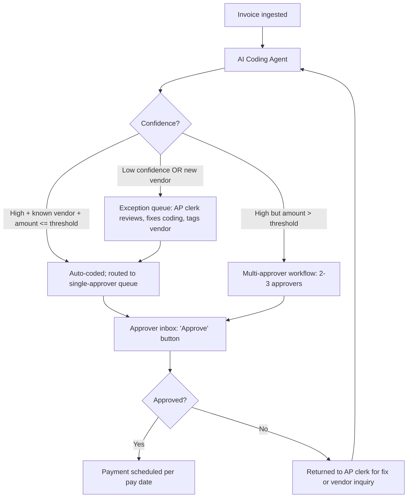
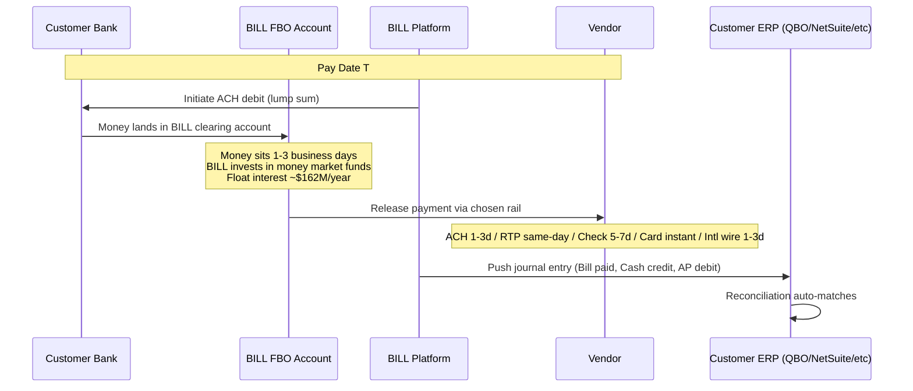
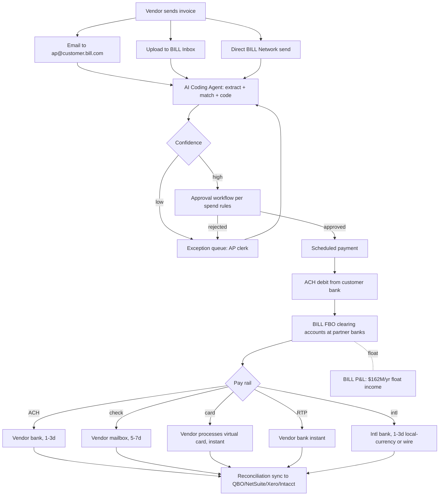

# Bill.com — Product Flow

The canonical end-to-end money + data + state flow inside BILL, including failure modes and human handoff points.

## 1. The user starts here

The AP cycle begins when **a vendor sends an invoice to a customer**. Three intake channels:

1. **Email forwarding.** The customer has a unique inbox at `ap@<theircompany>.bill.com`. Vendors email PDFs here.
2. **BILL Inbox upload.** Customer drags-and-drops PDFs into the web app.
3. **BILL Network direct send.** A vendor who already has a BILL account can push an invoice directly to a BILL customer via the in-network identity match (email + tax ID).

## 2. Data enters here

The intake event triggers the **BILL AI Coding Agent** (October 2025 launch; enhanced February 2026). Steps:

1. **Document type detection.** Bill vs. receipt vs. statement vs. PO. Misclassification = down-stream errors.
2. **Header extraction.** Vendor name, amount, due date, invoice number, PO reference. BILL claims ~99% accuracy on this layer.
3. **Line-item extraction.** Quantities, unit prices, descriptions, tax per line. Lower accuracy; uneven adoption.
4. **Vendor matching.** Match to existing vendor in the customer's BILL Network, or flag as "new vendor" → human review.
5. **GL coding.** Predict GL account, class, location, project based on (a) the last ~5 bills from this vendor, (b) the customer's chart-of-accounts patterns, (c) the 250M-bill historical training corpus.
6. **Confidence scoring.** High-confidence → auto-coded. Low-confidence → "exception queue."

## 3. The system transforms it here

After extraction + coding, the bill enters one of three states:

The approval workflow respects spend rules: dollar thresholds, per-vendor caps, per-category limits, department budgets, required-approver chains. These rules are configured in BILL's admin panel.

## 4. External tools / partners / rails are called here

When the payment is approved and the pay date arrives, BILL calls out to:

- **Customer's bank** (ACH origination) — BILL initiates an ACH debit to pull a single aggregated sum covering all scheduled payments that day. BILL is *not* a direct Fed ACH originator; it's a third-party sender via partner banks.
- **Partner bank** (FBO custodian) — Bank of America is the publicly-confirmed primary; JPMorgan Chase, and other multinational banks are inferred custodians. The funds land in BILL-controlled "For Benefit Of" trust accounts.
- **Payment rail** based on customer choice:
  - **ACH** (default, 1-3 business days, $0.49-0.59 fee)
  - **USPS check** (BILL prints and mails, 5-7 days, $1.99)
  - **Virtual Visa/Mastercard card** (instant, vendor processes the card; BILL earns interchange)
  - **RTP / FedNow** (instant, if both ends support it — gated)
  - **International wire / Local Transfer** (1-3 days, 137 countries, 100+ currencies; FX margin embedded)
- **Cross River Bank** (only for Spend & Expense card swipes — different code path)
- **Risk engine** (proprietary + third-party) — fraud check, sanctions screen, anomaly detection.

## 5. Money / data / state changes here

State changes recorded:
- **Bill state machine:** `received → coded → in_approval → approved → scheduled → in_transit → paid → reconciled` (with `disputed` / `held` / `failed` branches)
- **Audit log:** every state transition timestamped, immutable, attributed to a user or system.
- **Float ledger:** customer dollars in transit are accounted in the FBO with sub-ledger per customer; investment returns flow to BILL's P&L, not customers'.

## 6. The user sees output here

- **Real-time dashboard** showing scheduled payments, cash position, pending approvals.
- **Vendor notification** (email) confirming payment dispatched + remittance details.
- **Approval inbox** for approvers (web + mobile app).
- **Reconciliation report** at month-end showing matched/unmatched items.
- **GL sync confirmation** in QBO/NetSuite (the bill appears as paid, the cash account credited, AP cleared).

For AR (collecting from your customers), the flow inverts:
1. Customer issues a BILL invoice.
2. End-customer receives an email with an online pay link.
3. End-customer pays via ACH (free) / card (2.9% surcharge) / check.
4. BILL handles dunning reminders on a schedule.
5. Funds land in customer's bank.
6. BILL pushes the receipt entry to the GL.

## 7. Failure cases go here

Documented failure modes and where they break:

- **Sync break (QBO/NetSuite/Intacct).** Most common. Bill marked paid in BILL but the GL entry didn't sync, or duplicated. Customer ends up with ghost transactions. Requires manual cleanup, sometimes BILL support.
- **ACH debit fails.** Customer bank rejects (insufficient funds, account closed, frozen). BILL charges $25 re-debit fee; bill stays in `scheduled` state. Vendor still expects payment.
- **Vendor bank info wrong.** ACH rejects, money returns to FBO; BILL retries via check after a delay (often days).
- **Risk hold.** BILL's in-house risk team flags a payment for "limit review." Customer bank is debited, but vendor payment is delayed. Audit logs not shared with the customer in some cases. Top BBB complaint category.
- **Cross-border failure.** Vendor verification fails (name doesn't match bank), or local-currency wire bounces. Brittle UX; complaints frequent on G2.
- **Account freeze.** BSA/OFAC/risk review escalation. Customer's account locked while BILL investigates. Funds held during investigation. Multiple BBB complaints in 2026.
- **Approver-not-responding.** Bill sits in approval queue indefinitely. No automated escalation; AP clerk has to chase.
- **AI mis-coding.** Wrong GL account assigned. Bill is paid, then has to be reclassified after the fact in QBO.

## 8. Human handoffs happen here

- **Exception queue** (AP clerk reviews AI-flagged bills) — daily, ~10-30% of bills.
- **Approval workflows** (controller / CFO / department head) — every state-changing payment.
- **New vendor onboarding** (AP clerk verifies banking info, requests W-9 — W-9 Agent automates the W-9 collection step, but the verification still needs a human in some cases).
- **Risk holds** (BILL in-house risk operations team) — opaque to customer; complaints.
- **CS escalations** (BILL support) — slow, queue-driven, rated poor on Trustpilot/G2/BBB.
- **CPA / accountant** (for the ~30-50% of customers managed via the Accountant Console) — accountant handles coding, approvals, and reconciliation on behalf of the SMB.

## 9. The complete picture

## What would break if BILL disappeared tomorrow?

For an SMB customer of 5+ years:
- Vendor list, banking info, approval workflows, GL coding patterns all need rebuilding in the new tool.
- Historical audit trail (5+ years of paid bills) is in BILL — exportable but reformatting is painful.
- ACH micro-deposit re-verifications for every vendor (new bank, new mandate).
- Pending payments mid-flight stay in BILL's FBO — recoverable, but requires CS contact.

Practical migration time: 2-4 weeks for a single-entity SMB; 2-6 months for a multi-entity operator. Most customers do not switch because the friction is real, not because the product is unmatched.

For a CPA firm with 50+ clients on Accountant Console:
- Migration is functionally a multi-quarter project. Each client's books, approval flows, vendor banks, and historical reconciliations have to be re-established.
- This is BILL's deepest moat: the *firms* are stuck, even when individual clients aren't.
