# BILL Holdings (NYSE: BILL) — Customer-Focused Research Brief

*Research cutoff: June 3, 2026. Confidence labels: ✅ strongly evidenced, 🟡 directionally supported, 🔴 weak/contested.*

## 1. The 30-Second Customer Picture

BILL ended Q3 FY2026 (quarter ending March 31, 2026) with "nearly 500,000" SMBs on platform, $355 billion in annualized payment volume, ~34 million transactions in the quarter (+14% YoY), and core revenue of $371.1M (+16% YoY). The same quarter delivered BILL's first GAAP profit ($12.8M net income) but coincided with a 30% workforce reduction announced May 7, 2026 — its second cut in six months. Net new customer adds are now guided "below 4,000 per quarter," with management explicitly pivoting from SMB-volume acquisition to higher-ARPU mid-market and accountant-channel-driven growth. ✅ ([Q3 FY2026 transcript](https://www.fool.com/earnings/call-transcripts/2026/05/08/bill-bill-q3-2026-earnings-call-transcript/), [Q3 FY2026 10-Q](https://www.sec.gov/Archives/edgar/data/0001786352/000162828026032387/bill-20260331.htm), [Stocktitan layoff disclosure](https://www.stocktitan.net/sec-filings/BILL/8-k-bill-holdings-inc-reports-material-event-a30cd671905e.html))

Verifying the prior-research priors:
- "~480K SMBs" → close. Actual is closer to ~500K as of Q3 FY2026. ✅
- "US-domestic 95%+ of revenue" → consistent with disclosures. Cross-border is now in 137 countries / 100+ currencies, but a tiny revenue share. ✅ ([BILL international press release](https://www.bill.com/press-release/billcom-expands-international-payments-footprint-more-130-countries))
- "Accountant channel ~30-50% of net new adds" → confirmed directionally. Q2 FY2025 accountant-channel net new adds were +38% YoY; Q4 FY2025 +24% YoY. Specific revenue share % is not broken out publicly. 🟡
- "Finance team spends 10-20 hours/week on AP pre-BILL" → consistent with Armanino's "15 minutes per bill × ~hundreds of bills/month" baseline. ✅
- "NRR has been under pressure" → confirmed. Management explicitly cites "declining customer acquisition rates" and shifted go-to-market posture. Exact NRR % not isolated in surfaced filings; investor write-ups cite the broader strategic pivot. 🟡

---

## 2. Named Customer Walkthroughs

### 2.1 Armanino LLP — Top-10 US accounting firm (CPA channel, AP for own firm AND clients) ✅

- **Business:** Largest California-based CPA/consulting firm, top-10 US fastest-growing accounting firm. Thousands of employees, multi-state.
- **BILL products:** AP for the firm itself, plus AP services delivered to clients via Accountant Console.
- **Before BILL:** ~15 minutes per bill — receive paper invoice → manually enter into accounting system → cut paper check → mail → match remittance. Significant supply spend (check stock, envelopes, postage, toner).
- **With BILL:** ~10 minutes per bill (a 30% reduction). Invoices arrive in BILL inbox, get routed for approval per dollar-threshold policies, paid electronically, synced to the GL.
- **Disclosed savings:** Armanino disclosed time reduction equivalent to 9.6 work-weeks/year of AP labor. Eliminated check-stock/envelope/postage/toner spend.
- **Person of interest:** A controller/AP lead whose day used to start with batch-printing checks and manually keying invoices now spends most of the morning reviewing already-coded bills, clicking approve, and resolving exception cases.
- **Source:** [BILL Armanino case study](https://www.bill.com/case-study/customer-success-story-armanino), [Insightful Accountant](https://www.intuitiveaccountant.com/accounting-tech/general-ledger/armanino-cuts-bill-pay-process-time-for-their-clients-with-b/)

### 2.2 ThinkLeader Consulting — Boutique consulting firm running outsourced AP for clients ✅

- **Business:** Consulting firm that performs bill-pay-as-a-service on behalf of small business clients.
- **BILL products:** AP (primary), with approval policies and granular user permissions.
- **Before BILL:** Largely paper/email invoices, manual coding, paper checks, no segregation of duties.
- **With BILL:** Vendor uploads/emails invoice → BILL's network/AI captures key fields → ThinkLeader coder assigns GL/class → routed through approver hierarchy → ePayment scheduled → reconciled in QuickBooks.
- **Disclosed savings:** 85% reduction in AP processing time vs. their 2001 baseline. ThinkLeader could move to value-based pricing without adding headcount.
- **Person of interest:** A staff accountant who previously stuffed envelopes now manages a queue of bills "tagged" with notes, addressing only exceptions.
- **Source:** [ThinkLeader case study](https://www.bill.com/case-study/customer-success-story-thinkleader)

### 2.3 Supporting Strategies — Outsourced accounting franchise (CEO Leslie Jorgensen) ✅

- **Business:** Franchise model providing full outsourced finance/AP/AR functions to SMBs. Founded 2004.
- **BILL products:** AP (primary) plus AR.
- **Before BILL:** "Labor- and paper-intensive" — manual handling, weak controls, hard to introduce separation-of-duties.
- **With BILL:** Online approval workflows with checks/balances; AR via emailed invoices with online payment options and automatic payments.
- **Disclosed savings:** 50% reduction in bill-payment time. Profits up without headcount increase.
- **Person of interest:** A franchise controller managing several SMB clients in a shared console.
- **Source:** [Supporting Strategies case study](https://www.bill.com/case-study/customer-success-story-supporting-strategies)

### 2.4 Bookkeeper360 — Cloud-first bookkeeping firm ✅

- **Business:** Personalized bookkeeping, tax, and fractional CFO services to SMBs. Heavy CPG / multi-store retail client base.
- **BILL products:** AP primarily; analytics surfaced to clients.
- **Before BILL:** 5–10 minutes per bill, manual entry, no client P&L visibility across outlets.
- **With BILL:** 1–2 minutes per bill. Multi-outlet retail clients now get per-store P&L visibility.
- **Disclosed savings:** Up to **130 hours per month** saved.
- **Source:** [Bookkeeper360 case study](https://www.bill.com/case-study/customer-success-story-bookkeeper360)

### 2.5 Love Catering — LA-based catering company (hospitality vertical) ✅

- **Business:** Full-service catering for private events, brand activations, studio productions, corporate hospitality (JP Morgan Private Bank, Disney Animation).
- **BILL products:** AP (~100+ invoices/month for produce, dairy, premium meats, labor, dry goods).
- **Before BILL:** Paper invoices submitted, hand-coded, manually keyed.
- **With BILL:** Vendor invoices ingested digitally; coded by category (food, labor, COGS), routed for approval, paid via ACH.
- **Source:** [Love Catering case study](https://www.bill.com/case-study/customer-success-story-love-catering)

### 2.6 O&M Restaurant Group — Multi-brand restaurant operator ✅

- **Business:** Dozens of locations across 2 states, 3 brands, 20 AP departments, $50M+ revenue, separate property entities.
- **BILL products:** AP across all entities with consolidated visibility.
- **Before BILL:** Disconnected paper workflows across each location.
- **With BILL:** Digital audit trail per transaction — used the audit trail to secure favorable refinancing terms during COVID.
- **Source:** [O&M Restaurant Group case study](https://www.bill.com/case-study/customer-success-story-om-restaurant-group)

### 2.7 Lindsay Leasing — Property management firm (Sarasota, FL) ✅

- **Business:** Mark & Teresa Lindsay's property-management firm. Goal of +1 property/month, now growing at 2x that rate; ~50 properties.
- **BILL products:** AP + AR. Automatic rent drafts from tenant accounts; vendor payments and owner distributions scheduled via BILL.
- **Before BILL:** Manual bill processing was the bottleneck preventing new client signups.
- **With BILL:** Field-based growth — Lindsays advertise faster owner payouts as competitive advantage in Sarasota.
- **Source:** [Lindsay Leasing case study](https://www.bill.com/case-study/customer-success-story-lindsay-leasing)

### 2.8 Mubarak Realty & Property Management — Maryland property manager ✅

- **Business:** Rick Mubarak manages 80+ properties.
- **BILL products:** AP.
- **Before BILL:** 30 minutes per property to pay bills × ~80 properties × 1× monthly = ~40 hrs/month.
- **With BILL:** ~5 minutes per property — an **83% time reduction**.
- **Source:** [BILL property management blog](https://www.bill.com/blog/how-property-management-companies-get-their-financial-houses-order)

### 2.9 Mark Cuban Companies — Disclosed marquee multi-entity reference ✅

- **Business:** Mark Cuban's holding portfolio — 100 entities, hundreds of budgets.
- **BILL products:** AP + Spend & Expense.
- **Notable:** One AP clerk runs the entire operation. BILL frequently cites this as their flagship multi-entity reference.
- **Source:** [BILL multi-entity page](https://www.bill.com/solutions/multi-entity)

---

## 3. The Accountant-Firm Channel — Deep Dive ✅

### 3.1 Why this matters for BILL

BILL has ~8,000 accounting firms in its Accountant Partner Program. The channel is BILL's most efficient acquisition mechanism — Q3 FY2026 strategy commentary explicitly states the company is now leaning into the "Fortune 5 Million" SMB segment "leveraging a network of 8 million members and 10,000 accounting and bank partners." The partnership with CPA.com (the technology arm of the AICPA) has been renewed beyond 2025 and is the institutional spine of the channel. ([BILL Accountant Partner Program](https://www.bill.com/accountant-partner-program), [CPA.com partnership extension](https://www.cpa.com/news/cpacom-and-billcom-extend-multiyear-partnership))

### 3.2 Accountant Console — how it actually works

1. CPA firm pays $49/month for the Accountant Console (vs. $45–89/user/month consumer pricing).
2. Firm signs up clients on the back end. Each client can be billed directly by BILL, or the firm resells AP/AR as a packaged service (white-label-ish).
3. From a single sign-on console the firm can switch between any client and process AP/AR for that client without re-logging in.
4. The firm earns CPE credits (100+ hours via CPAAcademy.org) and gets BILL Certification badges (5 CPE per cert).

### 3.3 Partner tiers (Bronze → Silver → Gold → Platinum)

- Bronze: 1–4 points
- Silver: 5–25
- Gold: 26–99
- Platinum: 100+
- 1 point = 1 client × 1 product (so multi-product clients accelerate firm climbs)
- Recalculated semi-annually each January/July ([Accountant Resource Center](https://www.bill.com/accountant-resource-center/articles/your-accountant-partner-program-benefits))

### 3.4 Named partner firms

- **Armanino LLP** — Eric Thomas, Partner, on BILL's 2024 Accountant Partner Council.
- **BDO USA** — Cliff Sussman, Managing Partner, also on the Accountant Partner Council. (BDO is a Big 4-adjacent Top-5 US accounting firm.)
- **Furey, Lescault & Walderman, MBS Accountancy, Supporting Strategies, Blue Fox, hiline, Consultance, Bookkeeper360, Accountfully (now BELAY)** — all featured customers, mostly client-services / outsourced-accounting practices in the $5M–$100M revenue band.

### 3.5 Why the accountant uses BILL

- **Operational:** ~25% of Furey's revenue is AP services. Without BILL they couldn't scale that line beyond the founders.
- **Stickiness:** Each new client onboarded onto BILL becomes a multi-year relationship; switching costs accrue to the firm, not the client.
- **Revenue economics:** Firms keep the markup on subscription pass-through and earn higher-margin advisory work on top. BILL's discounted Console pricing + zero per-client minimums makes the math work for sole practitioners too. 🟡
- **Channel performance:** Q2 FY2025 accountant-channel net new customer adds +38% YoY; Q4 FY2025 +24% YoY (Insider Monkey & Yahoo Finance transcripts). ✅

The specific "% of total subscription revenue from accountant-channel" figure is not broken out cleanly in any public BILL filing surfaced. The repeated qualitative emphasis (channel = primary growth lever; 8,000 firms; 8 million member network) strongly implies it is the dominant strategic channel. 🟡 ([Q2 FY2025 transcript](https://www.insidermonkey.com/blog/bill-com-holdings-inc-nysebill-q2-2025-earnings-call-transcript-1446056/))

---

## 4. Vertical-by-Vertical Use Cases

| Vertical | Typical Customer | Workflow Specifics | Key Source |
|---|---|---|---|
| **Professional services** (CPA, law, consulting) | Lescault & Walderman, Armanino, ThinkLeader | AP for the firm itself + outsourced client work. Trust accounting on the LEGAL side is NOT a BILL strength — no explicit IOLTA/trust-account product surfaced. Firms route operating-AP through BILL and keep trust accounting in dedicated tools (Clio, CosmoLex). 🟡 | [Lescault case study](https://www.bill.com/case-study/customer-success-story-lescault-walderman) |
| **Restaurants/hospitality** | Love Catering, O&M Restaurant Group | Repeating high-frequency vendor mix: produce, dairy, meats, linen, gas, dry goods. AP-heavy. BILL provides multi-entity rollups across brands/locations. | [Hospitality solutions page](https://www.bill.com/solutions/hospitality) |
| **Healthcare** | Small/mid medical & dental practices | No dedicated BILL healthcare case study surfaced. Practices use BILL only for operating AP (vendor payments, supplies). PHI/HIPAA isn't a BILL angle — protected info never touches the platform; BILL handles ordinary B2B vendor flow. 🟡 | n/a |
| **Real estate / property mgmt** | Lindsay Leasing, Mubarak Realty, Mark Cuban Companies | Multi-property allocations: each property becomes an "entity" or "class" in QB; BILL syncs the per-property AP. AR side handles tenant ACH drafts and owner-distribution payouts. | [Multi-entity solutions](https://www.bill.com/solutions/multi-entity) |
| **E-commerce / CPG** | Bookkeeper360 clients, Accountfully/BELAY | Inventory-heavy CPG brands. Cross-store P&L surfaces via BILL coding. International supplier payments via cross-border product (137 countries, 100+ currencies). | [Accountfully case study](https://www.bill.com/case-study/customer-success-story-accountfully) |
| **Construction** | Ironstar Building (Lescault client), MBS Accountancy clients | Subcontractor payments via ACH; job-cost coding via QB classes. Lien waivers and retainage are NOT native BILL features — these still live in dedicated construction-billing apps (Procore, GCPay, Siteline). BILL is the back-end payment rail only. 🟡 | [MBS case study](https://www.bill.com/case-study/customer-success-story-mbs-accountancy) |

---

## 5. The Canonical AP Cycle in BILL

```mermaid
flowchart LR
    A[Vendor emails invoice<br/>to ap@customer.bill.com<br/>OR uploads to BILL Inbox] --> B[BILL AI Coding Agent<br/>extracts vendor / amount / line items<br/>~99% accuracy on headers]
    B --> C[Predictions match historical<br/>vendor coding patterns<br/>5 most recent bills referenced]
    C --> D{Exception?}
    D -- No --> E[Auto-coded bill<br/>routed to approval queue]
    D -- Yes --> F[AP clerk reviews,<br/>fixes coding, tags vendor]
    F --> E
    E --> G[Approval workflow<br/>1-3 approvers by dollar threshold]
    G --> H[Scheduled ePayment<br/>ACH default; check, RTP, card, intl. options]
    H --> I[Vendor receives funds<br/>ACH: 1-3 biz days<br/>RTP: same day<br/>Check: 5-7 biz days]
    I --> J[Reconciliation syncs<br/>to QuickBooks / Sage Intacct / NetSuite]
```

**Day-by-day:**
- **Day 1:** Vendor delivers invoice via inbox forwarding, AP portal upload, or BILL Network direct-link. AI captures header data and line items (BILL claims ~99% accuracy on headers, ~75% reduction in processing time on multi-line bills, after training on >250M historical bills). ✅ ([BILL AI agent](https://www.bill.com/product/ai))
- **Day 1–2:** Coding Agent assigns GL account, class, location, project. AP staff reviews exceptions only.
- **Day 2–3:** Approval routing fires. Smaller dollar thresholds get a single approver; >$5K or >$25K may require 2–3.
- **Day 3–5:** Payment dispatched. ACH default; check option (BILL mails); RTP same-day; cross-border via Local Transfer (avoids intermediary wire fees, up to 4 days faster).
- **Day 5–7:** GL sync into QuickBooks / Sage Intacct / NetSuite. Reconciliation auto-matched.

---

## 6. The AR Cycle in BILL ✅

1. Customer is invoiced via BILL (invoice generated, optionally branded).
2. Email delivered to customer with online payment link.
3. Customer chooses ACH (free), card (fee), or check.
4. BILL handles dunning reminders automatically per schedule.
5. Funds settle to seller's bank account.
6. Receipt syncs back to GL (QuickBooks / Sage Intacct / NetSuite).

Lindsay Leasing uses this for tenant rent ACH drafts; Supporting Strategies and Furey resell the AR module as part of bundled finance services.

---

## 7. Spend & Expense (formerly Divvy) — Cross-Sell Path ✅

- **Card:** $0/user/month. Free corporate card, included budgets, expense tracking, credit lines $1K–$5M.
- **GTM strategy:** Free card is the wedge. Card users convert into paid AP/AR seats over time. BILL explicitly retired the Divvy brand in 2023 (rebranded "BILL Spend & Expense") to consolidate sales motion.
- **Cross-sell:** Q2/Q3 FY2026 management language references "deepened engagement with existing firms" and unified-platform messaging. Specific cross-sell attach rate is not disclosed cleanly. 🟡 ([BILL Spend & Expense rebrand](https://www.bill.com/blog/divvy-becoming-bill-spend-and-expense))
- **Mark Cuban Companies** runs AP + Spend & Expense in tandem — BILL's flagship cross-sell reference.

---

## 8. What Customers Complain About — 2025–2026

### 8.1 Customer Support (the #1 theme) 🔴

- Trustpilot, BBB, Capterra, and Software Advice converge on the same complaints: slow response, agent handoffs without resolution, no live phone for many tiers.
- gethuman reports: average hold ~1m46s, only 2% of callers reach a human, 5% report full resolution.
- Reviewers: "by far the worst customer service on any kind of business service" / "zero people to talk to."
- Sentiment worsened after the October 2025 (~6%) and May 2026 (~30%) layoffs. Customers explicitly cite the layoffs as a cause: *"since laying off employees, not only has their service gone downhill, it is dangerous to do business with them."* ([Stampli blog on BILL reviews](https://www.stampli.com/blog/accounts-payable/bill-com-reviews/), [Trustpilot](https://www.trustpilot.com/review/bill.com))

### 8.2 Account freezes / fund holds 🔴

- 2026 BBB complaint: account frozen after customer reported fraudulent transactions; ~$20K of wired funds withheld pending investigation; complaint that BILL refused full audit logs.
- "Held hostage" complaints: upsold to paid plan without explicit consent; downgrade flow blocked by recursive security loop. ([BBB complaints](https://www.bbb.org/us/ca/alviso/profile/payment-processing-services/billcom-llc-1216-1000005293/complaints))

### 8.3 Pricing surprises / forced upgrades 🟡

- "Per user fees, per payment fees, add-ons for features you thought were standard make costs unpredictable."
- Free-trial-to-paid conversions trigger fees the day after expiry; refund denials common.

### 8.4 Sync breakage 🟡

- QuickBooks Online, Sage Intacct, NetSuite — recurring complaints about sync errors, duplicated bills, and ghost transactions.
- Header-only capture cited as a structural limitation: *"You cannot reliably map line items to jobs, customers, or classes."* The new AI Coding Agent partly addresses this with line-item coding for AP customers, but the change is recent (Feb 2026) and adoption is uneven. ✅ ([CPA Practice Advisor — BILL releases new AI agents](https://www.cpapracticeadvisor.com/2026/02/10/bill-releases-new-and-enhanced-ai-agents/177829/))

### 8.5 Float / payment delay 🟡

- Customers report ACH payments showing as "sent" but not received by vendor for >5 business days; support agents bounce the case between teams.
- Some are vendor-side problems (vendor bank flagged), but the perceived BILL float-on-the-money issue persists.

### 8.6 Limited construction/line-item depth 🟡

- MakersHub and Ramp competitor articles call out: BILL captures header only, no line-item-to-job mapping out of the box. The new Coding Agent addresses headers + line items but only for AP customers and is still rolling out. ([MakersHub critique](https://makershub.ai/discover/blog/why-bill-com-isnt-working-for-modern-ap-teams))

---

## 9. CAC, Churn, and Customer Count Dynamics

- Net new customer adds expected "below 4,000 per quarter" — a notable deceleration from prior years' >5K/quarter pace. ✅ ([Q3 FY2026 transcript](https://www.fool.com/earnings/call-transcripts/2026/05/08/bill-bill-q3-2026-earnings-call-transcript/))
- Q3 FY2026 transaction count +14% YoY suggests existing-customer monetization is offsetting slower logo adds. ✅
- Strategic pivot: from broad SMB-volume acquisition → mid-market + accountant-channel + AI-driven ARPU expansion.
- Layoffs (Oct 2025: ~6%; May 2026: ~30%, ~709 jobs) frame this as a profitability-not-growth posture, reinforced by the $1B buyback authorization. ([Layoff coverage](https://www.interviewpal.com/layoffs/bill))
- Activist Starboard Value disclosed an 8.5% stake in Oct 2025, pushing this discipline. ([Payments Dive](https://www.paymentsdive.com/news/bill-holdings-starboard-workforce-reduction/803120/))

Explicit NRR % not surfaced in publicly available filings/transcripts during this search. Management commentary about "reduced client attrition" within the accountant channel implies non-accountant churn remains a watch item. 🟡

---

## 10. Customers Who Switched Away — Specific Anecdotes

- **Mix Talent** moved off BILL onto Ramp. Disclosed: "4+ days saved in time to close" and "50% reduction in on/off-boarding time," explicitly citing "rising fees from tools like Bill.com." ([Ramp blog on switchers](https://ramp.com/blog/accounts-payable/customers-who-switched-from-bill-to-ramp))
- The Intuit/QuickBooks Online embedded bill-pay product moved away from BILL in 2023, now powered by **Melio**. That removed the embedded SMB lead funnel from BILL's roof — under 1% of FY2023 revenue at the time but significant for top-of-funnel acquisition. ✅ ([Payments Dive on BILL/Intuit split](https://www.paymentsdive.com/news/bill-intuit-partnership-embedded-payments-smb-competition-b2b/691269/))
- Reviewer pattern: small teams switching to Ramp (price + integrated card/expense), Stampli (better support + line-item AP), Tipalti (global). Per-seat pricing ($45–$89/user/month) is the recurring escape trigger for growing customers. ([Ramp BILL alternatives](https://ramp.com/blog/top-bill-alternatives))

---

## 11. Recent High-Profile Customer-Facing Incidents (2025–2026)

- **May 2026 layoff (30%)** — most-cited externally as a quality risk by reviewers and CFO commentators on LinkedIn.
- **Status page incidents:** May 2, 2026 and April 18, 2026 platform-level outages logged on StatusGator (BILL Platform).
- **Account-freeze BBB cases (Jan-Mar 2026)** — multiple consumer-side BBB complaints about funds held during fraud investigations.
- **Free-trial billing complaints (Mar 2026)** — $49/mo charges triggered the day after trial expiry without refund.
- No documented major security/breach event surfaced in this research. 🟡

---

## 12. Customer Success / Pro Services

- BILL does not sell a heavy professional-services SKU like NetSuite. Instead, the **accountant channel = the implementation channel**.
- A growing partner ecosystem of fractional-CFO and bookkeeping firms (BELAY, hiline, Bookkeeper360, Furey, Supporting Strategies) provide implementation + ongoing management — effectively external CSM-and-onboarding for BILL.
- **Strategic Account Managers** are reserved for higher-tier (Gold/Platinum) firms based on point thresholds.

---

## 13. International Customers ✅

- BILL is US-incorporated and US-monetized. International is sender-side only: US customer paying international vendors in 137 countries, 100+ currencies.
- Local Transfer routes (no intermediary bank charges, up to 4 days faster than wire) in local currency.
- BILL does *not* serve non-US-headquartered SMBs natively. Customers like Furey's client Ocus use BILL for high-volume cross-border *payouts* from a US entity.

---

## 14. Where BILL Is Truly Sticky / Irreplaceable 🟡

The customer for whom switching cost is highest:
- **Multi-entity accountant firm with 50+ active clients on the Accountant Console.** Each client onboarded means: rebuilt vendor list, approval workflows, GL mappings, ACH micro-deposit revalidations, historical audit trail re-created or abandoned. Practically, only profitable to switch when a firm is already migrating their underlying GL platform.
- **Multi-entity operators like Mark Cuban Companies (100 entities) or O&M Restaurant Group.** Cross-entity rollups, per-entity approval policies, and the consolidated audit trail (which Joe O&M used for refinancing) are not replicated cheaply elsewhere.
- **Property managers** like Mubarak (80+ properties): per-property bill workflows + AR rent drafts + owner distributions inside one product set.

---

## 15. The Customer Most at Risk of Churning

Profile:
- **Single-entity SMB**, 20–75 employees, $5M–$30M revenue, US-domestic, paying 50–200 bills/month, with a controller who also handles expenses and a card program.
- Already using QuickBooks Online or Xero.
- Hit by per-seat creep ($45–$89/user/month) once they cross 3–5 approver users.
- Tempted by Ramp's $0 card + free AP, by Melio's pay-as-you-go simplicity, or by QuickBooks Bill Pay's $90/mo flat for unlimited payments + already-paid-for QBO integration.
- Trigger event: a CS escalation that doesn't resolve, a forced-plan-upgrade billing surprise, or a sync break right before month-end close.

This is the segment BILL's "below 4,000 net adds/quarter" guidance is pricing in — the leakage at the lower end of the SMB base is what's pushing BILL's go-to-market upmarket. ✅

---

## 16. Synthesis — What the Customer Picture Implies

- **The product's center of gravity is the accountant firm**, not the end SMB. The Console, partner tiers, CPA.com institutional alignment, CPE training engine, and ~24-38% YoY accountant-channel net new add growth all reinforce this. The firms keep the customers stuck inside BILL; the customers individually are far more switchable than the firms are. ✅
- **The product's competitive moat is multi-entity + audit trail**, not raw AP speed. Ramp and Melio match speed on simple-vendor / single-entity. They don't match BILL's multi-entity rollups, console-based partner workflow, or 250M-bill-trained coding model. ✅
- **The product's biggest unfixed pain is customer support**, and the 30% layoff in May 2026 likely makes it worse before it gets better. Negative sentiment compounds across G2/Capterra/Trustpilot/BBB. ✅
- **The product's biggest strategic risk is the SMB long tail**, not the accountant channel. Ramp, Melio, and QuickBooks Bill Pay are eroding the lowest-end SMBs faster than BILL can replace them — hence the explicit mid-market and ARPU pivot. ✅
- **The product's clearest growth lever is AI-driven ARPU expansion** — the Feb 2026 AI Coding Agent launch (99% header accuracy, line-item predictions trained on 250M bills, 75% time reduction on multi-line bills) is the genuine product-side answer to per-seat pricing complaints. Whether existing customers adopt fast enough to lift NRR above ~100% is the open question. 🟡

---

## Sources

- [BILL Customer Stories index](https://www.bill.com/case-study)
- [ThinkLeader case study](https://www.bill.com/case-study/customer-success-story-thinkleader)
- [Armanino case study](https://www.bill.com/case-study/customer-success-story-armanino)
- [Armanino — Insightful Accountant coverage](https://www.intuitiveaccountant.com/accounting-tech/general-ledger/armanino-cuts-bill-pay-process-time-for-their-clients-with-b/)
- [Supporting Strategies case study](https://www.bill.com/case-study/customer-success-story-supporting-strategies)
- [Bookkeeper360 case study](https://www.bill.com/case-study/customer-success-story-bookkeeper360)
- [Lindsay Leasing case study](https://www.bill.com/case-study/customer-success-story-lindsay-leasing)
- [Love Catering case study](https://www.bill.com/case-study/customer-success-story-love-catering)
- [O&M Restaurant Group case study](https://www.bill.com/case-study/customer-success-story-om-restaurant-group)
- [Lescault & Walderman case study](https://www.bill.com/case-study/customer-success-story-lescault-walderman)
- [hiline case study](https://www.bill.com/case-study/customer-success-story-hiline)
- [Blue Fox case study](https://www.bill.com/case-study/customer-success-story-blue-fox)
- [MBS Accountancy case study](https://www.bill.com/case-study/customer-success-story-mbs-accountancy)
- [Furey case study](https://www.bill.com/case-study/customer-success-story-furey)
- [Accountfully/BELAY case study](https://www.bill.com/case-study/customer-success-story-accountfully)
- [Mubarak Realty / property management blog](https://www.bill.com/blog/how-property-management-companies-get-their-financial-houses-order)
- [BILL Multi-Entity solutions page](https://www.bill.com/solutions/multi-entity)
- [BILL Accountant Partner Program](https://www.bill.com/accountant-partner-program)
- [Accountant Partner Program benefits](https://www.bill.com/accountant-resource-center/articles/your-accountant-partner-program-benefits)
- [BILL × CPA.com partnership extension](https://www.cpa.com/news/cpacom-and-billcom-extend-multiyear-partnership)
- [BILL AI product page](https://www.bill.com/product/ai)
- [CPA Practice Advisor — BILL AI Agents Feb 2026](https://www.cpapracticeadvisor.com/2026/02/10/bill-releases-new-and-enhanced-ai-agents/177829/)
- [BILL Spend & Expense rebrand blog](https://www.bill.com/blog/divvy-becoming-bill-spend-and-expense)
- [International payments press release — 130+ countries](https://www.bill.com/press-release/billcom-expands-international-payments-footprint-more-130-countries)
- [Q2 FY2025 earnings call transcript](https://www.insidermonkey.com/blog/bill-com-holdings-inc-nysebill-q2-2025-earnings-call-transcript-1446056/)
- [Q3 FY2026 earnings call transcript](https://www.fool.com/earnings/call-transcripts/2026/05/08/bill-bill-q3-2026-earnings-call-transcript/)
- [Q3 FY2026 10-Q (SEC)](https://www.sec.gov/Archives/edgar/data/0001786352/000162828026032387/bill-20260331.htm)
- [Stocktitan — BILL Q3 / 30% layoffs / $1B buyback](https://www.stocktitan.net/sec-filings/BILL/8-k-bill-holdings-inc-reports-material-event-a30cd671905e.html)
- [InterviewPal — 709 jobs cut](https://www.interviewpal.com/layoffs/bill)
- [Payments Dive — Starboard / Bill restructuring](https://www.paymentsdive.com/news/bill-holdings-starboard-workforce-reduction/803120/)
- [Payments Dive — BILL ends Intuit partnership, Melio takes QB Bill Pay](https://www.paymentsdive.com/news/bill-intuit-partnership-embedded-payments-smb-competition-b2b/691269/)
- [Trustpilot BILL reviews](https://www.trustpilot.com/review/bill.com)
- [BBB BILL complaints](https://www.bbb.org/us/ca/alviso/profile/payment-processing-services/billcom-llc-1216-1000005293/complaints)
- [Stampli — BILL reviews compendium](https://www.stampli.com/blog/accounts-payable/bill-com-reviews/)
- [MakersHub — Why BILL isn't working for modern AP teams](https://makershub.ai/discover/blog/why-bill-com-isnt-working-for-modern-ap-teams)
- [Ramp — Customers who switched from BILL to Ramp](https://ramp.com/blog/accounts-payable/customers-who-switched-from-bill-to-ramp)
- [Ramp — Top BILL alternatives](https://ramp.com/blog/top-bill-alternatives)
- [FitSmallBusiness — BILL vs QuickBooks Bill Pay](https://fitsmallbusiness.com/bill-com-vs-quickbooks/)
