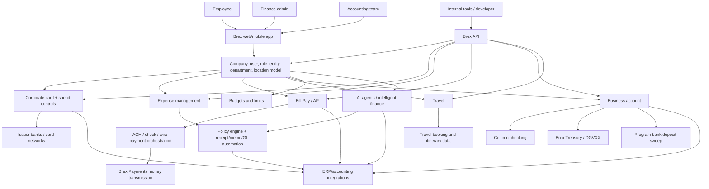

# Brex - Architecture

Date: 2026-05-09

This is an inferred architecture from Brex product pages, legal terms, pricing, developer docs, customer stories, and Capital One announcements. Exact internal systems are not public.

## One-frame architecture

## Product surfaces

Public user surfaces:

- Marketing site.
- Signup / account opening.
- Brex dashboard.
- Brex mobile app.
- Corporate cards and virtual cards.
- Travel booking.
- Bill Pay and purchase order workflows.
- Business account / treasury / vault views.
- Reports, budgets, policy configuration, approvals.
- Developer portal and APIs.
- Support and implementation services.

Back-office surfaces inferred:

- KYB and underwriting operations.
- Credit/risk monitoring.
- Card issuing operations.
- Bank partner operations.
- Money transmission/payment operations.
- Treasury/vault brokerage and sweep operations.
- Fraud/risk/compliance operations.
- Enterprise implementation.
- Support and customer success.
- AI model monitoring and audit queues.

## Core object model

Brex appears to organize the product around these objects:

- Company/account.
- Legal entities.
- Users.
- Roles/permissions.
- Departments, locations, titles.
- Cards.
- Spend limits and budgets.
- Expenses.
- Receipts, memos, attendees, merchants, MCC/category.
- Vendors.
- Transfers/payments.
- Cash accounts and card accounts.
- Statements.
- Trips.
- Accounting records and ERP mappings.
- Webhook subscriptions.

This is visible in the developer API categories: Accounting, Budgets, Expenses, Fields, Onboarding, Payments, Team, Transactions, Travel, and Webhooks.

Source: [Developer Portal](https://developer.brex.com/).

## Card architecture

Public facts:

- Brex issues physical and virtual cards.
- Cards are accepted on major card networks.
- Pricing page says unlimited global cards are accepted in 210+ countries and territories.
- Corporate card page says limits are based on financial factors such as revenue or dollars raised.
- Legal footers name issuer banks and networks.

Likely flow:

1. Company passes onboarding/KYB.
2. Brex approves credit/card program and limit based on company data.
3. Finance admin creates users, policies, cards, budgets, and limits.
4. Employee uses physical or virtual card.
5. Card authorization checks network, issuer, fraud, company limit, user/card limit, and Brex policy controls.
6. Transaction appears in Brex.
7. Expense engine asks for receipt/memo only if needed.
8. Accounting/ERP export maps the transaction to the right GL/accounting context.

The important technical pattern: card controls and expense controls are not separate products. Brex tries to decide whether spend is allowed before or at the time of purchase, then cleans accounting data after.

Sources: [corporate card](https://www.brex.com/product/credit-card), [pricing](https://www.brex.com/pricing), [Platform Agreement](https://www.brex.com/legal/platform-agreement).

## Expense and policy architecture

Brex's expense page says Brex uses AI to auto-generate receipts and route transactions to the right spend limits. It also says employees can text in receipts, and Brex auto-matches them to the right expense. Expense automation likely combines:

- Card transaction data.
- Merchant/MCC/category metadata.
- User/department/location/entity metadata.
- Budget and spend-limit mapping.
- Policy rules.
- Receipt ingestion from SMS/mobile/email/integrations.
- OCR/document parsing.
- LLM or ML-generated memo/attendee/description suggestions.
- Approval routing.
- Audit flags.
- Accounting export.

The hard part is not generating text. The hard part is mapping spend to the right legal entity, department, budget, GL code, and policy state with enough confidence for accounting.

Sources: [expense management](https://www.brex.com/product/expense-management), [Expenses API](https://developer.brex.com/openapi/expenses_api/expenses/listexpenses).

## Bill Pay / AP architecture

Public Bill Pay features:

- Invoice entry and payment automation.
- ERP sync.
- Purchase orders.
- Two-way invoice-to-PO matching.
- Scheduled invoice batches.
- Vendor management.
- ACH, check, and wire payments through APIs/docs.

Likely AP flow:

1. Vendor invoice enters through upload, email forwarding, or manual entry.
2. Brex extracts invoice fields: vendor, due date, amount, currency, PO, line items, payment details.
3. System matches invoice to purchase order if available.
4. Approval chain is selected based on entity, vendor, amount, department, and policy.
5. Approved bill is scheduled in a batch or paid immediately.
6. Payment is sent through supported rails.
7. ERP/accounting system receives bill, payment, and reconciliation data.

Sources: [Bill Pay](https://www.brex.com/product/bill-pay), [Payments API](https://developer.brex.com/openapi/payments_api/).

## Banking and treasury architecture

Brex markets business accounts, treasury, and vault products. Legal footers clarify the substrate:

- Checking: commercial checking account provided by Column N.A., Member FDIC.
- Treasury: Brex Treasury LLC, Member FINRA/SIPC; funds invested in money-market instruments such as DGVXX; not FDIC-insured.
- Vault: cash-management deposit sweep to program banks; FDIC eligibility only after funds arrive at program banks and subject to conditions.
- Brex LLC and Brex Payments LLC are Capital One company entities after acquisition.

Likely banking flow:

1. Company opens Brex business account.
2. Checking account/routing info is provided through Column.
3. Company can send/receive ACH, wires, and checks.
4. Idle cash can be moved into Treasury or Vault products.
5. Ledger balances and external account links feed the Brex dashboard.
6. Transactions sync to accounting and developer APIs.

This is a modern fintech banking experience, but legally it is a composed architecture over bank, brokerage, money-market fund, and sweep-program infrastructure.

Sources: [pricing footer](https://www.brex.com/pricing), [Platform Agreement](https://www.brex.com/legal/platform-agreement).

## AI architecture

Brex's current "intelligent finance" story is centered around AI agents for finance tasks. Capital One also describes Brex as AI-native and says it uses AI agents to automate workflows, reduce manual review, and control spend.

Named agent categories on Brex pages include:

- Brex Assistant.
- Audit Agent.
- Review Agent.

Brex also markets insights-on-demand and broader AI-powered accounting, expense, policy, and bill-pay automation.

The likely architecture:

1. Structured event stream from cards, expenses, bills, trips, users, budgets, vendors, and accounting exports.
2. Rules engine for deterministic controls.
3. AI extraction/classification for receipts, invoices, memos, categories, GL coding, anomalies, and policy issues.
4. Human review queues for low-confidence/high-risk cases.
5. Audit log for approvals, changes, and automation actions.
6. User-facing assistant/Copilot-style interface for querying spend, vendors, budgets, policy, trips, and tasks.

The strength is data access. A generic AI agent cannot answer finance questions well without normalized internal finance data. Brex can because it sits inside the spend workflow.

Sources: [Intelligent Finance](https://www.brex.com/platform/intelligent-finance), [Capital One completion announcement](https://www.capitalone.com/about/newsroom/capital-one-completes-acquisition-of-brex/).

## API architecture

Public API facts:

- REST architecture.
- OpenAPI specifications.
- JSON over HTTPS.
- Production base URL: `https://api.brex.com`.
- User-token auth with `Authorization: Bearer <token>`.
- APIs cover accounting, budgets, expenses, fields, onboarding, payments, team, transactions, travel, and webhooks.
- Staging URLs are documented, but Brex says staging is not a sandbox and will not work with customer tokens.

This is a strong public developer posture for an enterprise finance platform. The main limitation is that the API is for existing Brex customers/partners, not a self-serve embedded-finance platform like Bridge.

Sources: [Developer Portal](https://developer.brex.com/), [Authentication](https://developer.brex.com/guides/authentication), [Expenses API](https://developer.brex.com/openapi/expenses_api/expenses/listexpenses).

## What is not public

- Exact credit underwriting model.
- Capital One integration roadmap.
- Model vendors and AI evaluation approach.
- Card program routing by geography/entity.
- Loss rates.
- Approval rates.
- Revenue by product line.
- Gross margin by card/software/treasury/payment product.
- Enterprise implementation cost.
- Data-retention and AI-training policies beyond public legal/security docs.
- Full list of bank/sweep/program-bank partners.
- Exact global card/reimbursement country-by-country constraints.

## Technical lesson

Brex is not "just a card" and not "just expense software." It is a control plane for company money movement.

The reusable architecture lesson:

- Every spend event needs a pre-spend policy context.
- Every payment needs an approval context.
- Every transaction needs accounting context.
- Every workflow needs auditability.
- AI is useful only after the company has standardized the underlying objects.

For a stablecoin CFO stack, this means wallets and payments are only layer one. The real product is the workflow graph around company money.
