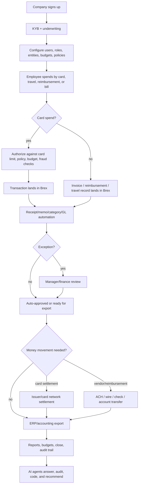

# Brex - Product Flow

Date: 2026-05-09

## 1. User starts here

The user can start from several surfaces:

- Founder signs up for Brex.
- Finance admin configures company users, entities, departments, budgets, policies, cards, and integrations.
- Employee receives a Brex card or uses Brex Travel/reimbursements.
- AP team uploads/forwards a vendor invoice.
- Developer creates an API token for internal automation.

## 2. Data enters here

Data enters Brex through:

- Signup/KYB application.
- Bank/account connections or financial data.
- Admin-created users, departments, locations, legal entities, and policies.
- Card transactions from issuer/network rails.
- Receipts from mobile/SMS/email/integrations.
- Invoices from upload/email/manual entry.
- Travel booking data.
- ERP/accounting integrations.
- API calls.
- Webhook events.

## 3. The system transforms it here

Brex transforms raw spend/payment data into finance records:

- Transaction -> expense.
- Receipt -> matched receipt record.
- Merchant/MCC -> category/policy context.
- Employee -> department/location/legal entity.
- Invoice -> bill/payment approval record.
- Payment -> vendor transfer and accounting entry.
- Trip -> travel expense context.
- Budget -> spend limit and reporting context.
- Accounting fields -> ERP export data.

AI/rules help with:

- Receipt matching.
- Memo generation.
- Expense categorization.
- GL coding.
- Invoice extraction.
- Policy/audit flags.
- Budget insights.
- Payment/travel task assistance.

## 4. External tools/partners/rails are called here

External rails and partners include:

- Card networks and issuer banks for card authorization/settlement.
- Column N.A. for commercial checking.
- Brex Treasury LLC / money-market fund / program banks for Treasury and Vault.
- Brex Payments LLC and payment rails for ACH/wire/check payments.
- ERP/accounting systems such as NetSuite/QuickBooks/Xero and enterprise ERPs.
- HRIS/SSO systems for employees/roles.
- Travel providers for booking.
- Developer webhooks/API consumers.

## 5. Money/data/state changes here

Money changes:

- Card purchase is authorized/settled.
- Vendor bill is paid.
- Reimbursement is sent.
- Cash moves between checking/treasury/vault.
- Incoming/outgoing transfer changes cash balance.

Data changes:

- Expense status changes.
- Payment status changes.
- Receipt attached.
- Budget remaining updates.
- Approval/audit log updates.
- Accounting export status updates.

State changes:

- Card/user/account status.
- Spend limit usage.
- Policy compliance status.
- ERP sync status.
- Webhook event emitted.

## 6. User sees output here

Employee sees:

- Whether spend is allowed.
- Card transaction.
- Receipt request or auto-match.
- Reimbursement/payment status.
- Travel itinerary.

Manager sees:

- Approval queue.
- Team spend.
- Budget remaining.
- Exceptions.

Finance/accounting sees:

- Real-time company spend.
- Policy violations.
- Missing docs.
- Bills awaiting approval.
- Payments scheduled/failed/processed.
- ERP export/reconciliation status.

CFO/FP&A sees:

- Budgets.
- Spend trends.
- Vendor spend.
- Cash/account balances.
- Forecasting inputs.

Developer sees:

- API responses.
- Webhook events.
- Transaction/expense/payment/account objects.

## 7. Failure cases go here

Common failure cases:

- Card declined due to limit, policy, fraud, issuer/network, or country/merchant issue.
- Receipt missing or unreadable.
- AI misclassifies memo/category/GL code.
- Expense is out of policy.
- Approval chain stalls.
- Vendor bank details are wrong.
- ACH/wire/check payment fails.
- ERP sync fails due to bad mapping.
- Cash balance insufficient.
- User/token permissions insufficient.
- Webhook delivery fails.
- Treasury/vault transfer timing creates insurance/liquidity misunderstanding.

## 8. Human handoffs happen here

Human review is needed for:

- KYB/account approval.
- Credit underwriting exceptions.
- High-risk or suspicious card activity.
- Policy exceptions.
- Missing documentation.
- Invoice approval.
- Payment failure resolution.
- Vendor detail changes.
- ERP mapping exceptions.
- Enterprise implementation and support.
- AI low-confidence cases.

## 9. Mermaid diagram of primary product flow

## Stablecoin product translation

If we build a stablecoin-native version, the Brex flow translates like this:

- Card/account -> wallet/smart account/business account.
- ACH/wire/check -> stablecoin transfer + on/off-ramp partner.
- Card controls -> wallet spend policies/multisig/approval rules.
- Bill Pay -> invoice-to-stablecoin or invoice-to-fiat payout workflow.
- Treasury/Vault -> stablecoin yield/T-bill/RWA/cash management, if legally possible.
- ERP sync -> same requirement, no shortcut.
- AI agents -> only useful after expenses, vendors, wallets, approvals, and accounting data are structured.
