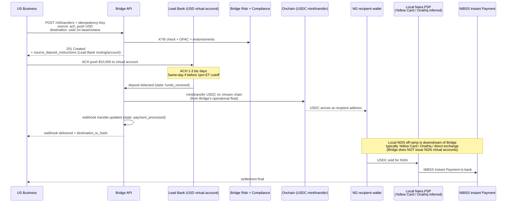
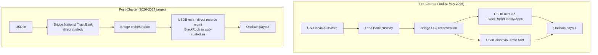
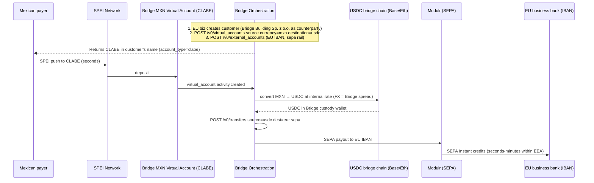
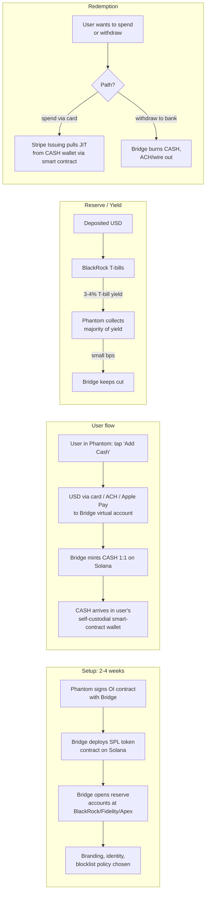
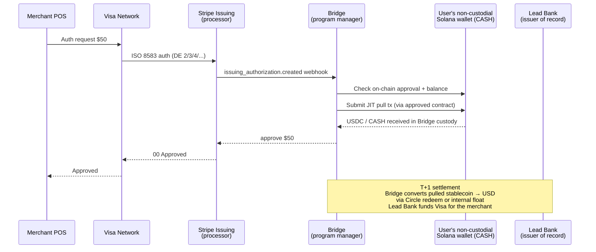

# Bridge — Complete Technical Architecture

> How Bridge actually moves money under the hood. Built from API docs (`apidocs.bridge.xyz`), Stripe blog posts, founder transcripts (especially the Nov 2025 Cheeky Pint with John Collison + Abrams + Stern), the M0 partnership docs, and the OCC trust charter Decision #1365.
> **Date:** 2026-05-03

**Confidence labels:** ✅ verified (Bridge docs / on-record statement) / 🟡 inferred (strong evidence, no direct confirmation) / 🔴 marketing claim only / ⚙️ derived

---

## TL;DR — the central architectural insight

**Bridge is NOT a Credible-style LP-pool model.** This is the single most important thing to understand.

From Zach Abrams directly on the Cheeky Pint podcast (Nov 2025):

> *"In almost all these markets now, there are very robust FX markets effectively that exist between, you know, a stablecoin like USDC or USDT and the local currency... those exchanges are dominated by stablecoin volume and they've effectively just become alternative FX markets... at least where we take care of the market is mostly after you guys have done the really hard work of converting fiat to crypto, then the question is what can you actually do with the crypto?"*

**Translation:** Bridge is a **rails-agnostic orchestration API** sitting on top of three layers:
1. A **regulated MTL/VASP fiat layer** (Bridge LLC + Bridge Building Sp. z o.o. Poland + Bridge National Trust Bank pending) connected to bank/PSP partners (Lead Bank for cards/USD, Modulr for SEPA, others opaque)
2. A **multi-chain custody + smart-contract layer** (15+ chains incl. Tron and Solana)
3. A **stablecoin issuance layer** (USDB + Open Issuance for partners)

**The "liquidity pool" question is answered by:**
- (a) Bridge's own operational stablecoin float on each chain
- (b) Just-in-time mint/burn against BlackRock-custodied USDB reserves
- (c) **Stripe parent balance sheet absorbs working-capital cost** for the gap between recipient credit and ACH/SEPA settlement
- (d) Local FX markets in emerging economies handle the actual fiat↔stablecoin conversion (NOT Bridge)

**The trust charter (OCC conditional approval Feb 2026) changes this** by letting Bridge eventually hold customer funds directly rather than through partner banks.

---

## 1. The full transaction flow — US business pays $10K contractor in Nigeria

This is the canonical flow. The pattern is **stablecoin sandwich + downstream wallet hand-off**. Bridge does NOT issue Naira virtual accounts (✅ verified absence) — the local off-ramp from USDC to NGN happens via the developer's downstream PSP, not Bridge.



### Step-by-step API mechanics

| # | Step | Endpoint / mechanism | Notes |
|---|------|----------------------|-------|
| 1 | Customer onboarding | `POST /v0/customers` (or hosted KYC link via `POST /v0/kyc_links`) | Returns `customer.id`; status `not_started → pending → approved`. KYC <1 min, KYB same/next biz day. ✅ |
| 2 | Endorsement check | `customer.endorsements[]` array | `base`, `sepa`, `spei` endorsements gate access to corresponding rails. ✅ |
| 3 | Create transfer | `POST /v0/transfers` with `Idempotency-Key` header | Body: `amount`, `on_behalf_of` (customer.id), `source: { payment_rail: "ach_push", currency: "usd" }`, `destination: { payment_rail: "base"/"solana"/etc., currency: "usdc"/"usdt"/"usdb", to_address: "0x..." }`, optional `developer_fee` and `developer_fee_percent`. ✅ |
| 4 | Source deposit instructions | Response includes `source_deposit_instructions` (Lead Bank routing/account + reference memo for reconciliation) | USD virtual account deposit bank: **Lead Bank, 1801 Main St., Kansas City, MO**. ✅ |
| 5 | Funds arrival | ACH push: 1-3 business days. Wire: same-day. ACH cutoff: 1:00 PM ET daily batch. | Transfer state: `awaiting_funds → funds_received`. ✅ |
| 6 | Conversion fiat → stablecoin | Internal — not API-exposed. Bridge mints/transfers from operational float on destination chain. | See §2 for liquidity mechanics. 🟡 |
| 7 | Onchain delivery | `payment_submitted → payment_processed`. `receipt.destination_tx_hash` populated. | **Gas paid by Bridge** (`gas_fee` is "usually 0" per docs). ✅ |
| 8 | Webhook | Event categories: `customer`, `kyc_link`, `transfer`. HMAC signed. | Listener gets `transfer.updated` with new state. ✅ |

### Costs deducted (visible in `receipt`)
- `developer_fee` — what the platform itself charges its end-user (set by developer)
- `exchange_fee` — Bridge's FX spread, in source currency
- `subtotal_amount` — `initial_amount − fiat_fees`
- `gas_fee` — typically $0 (Bridge absorbs)
- `final_amount` — what arrives at destination

**Bridge's own take is bundled inside `exchange_fee`** (FX spread, ~25-100bps depending on corridor) plus a base bps cut on transfers. **Published rate cards do not exist** — pricing is negotiated per developer. 🔴 marketing says "low and transparent"; reality: opaque, contracted per customer.

### Timing reality
- ACH-in: 1-3 business days. Same-day if before 1pm ET cutoff
- Wire-in: minutes to hours intra-US, same-day
- USDC sweep onchain: seconds-to-minutes after `funds_received`
- For >$500K transfers: docs note "no more than one additional hour" beyond normal cutoff. ✅

---

## 2. Liquidity mechanics — the central question, answered

### What Credible does (for contrast)
- $1.12M USDC LP pool on Hedera Byzanlink (ERC-4626 vault)
- LPs paid 16% APY from transaction fees
- Bridges the ACH gap by lending USDC float against in-flight ACH

### What Bridge does — three concrete mechanisms

**Bridge does NOT have an LP-vault. There is no "deposit USDC, get LP token" surface.** The liquidity is constructed differently:

#### (a) Operational float on each chain ✅ (indirect)

Bridge runs **custodial wallets per chain** (Ethereum, Base, Solana, Tron, Polygon, Arbitrum, Optimism, Avalanche, Stellar, Tempo, etc.) holding USDC, USDT, USDB and partner-issued stablecoins. When a transfer is created with destination `usdc on base`, Bridge pays out from this float **immediately upon `funds_received`** (or earlier for trusted developers).

Float is replenished by:
- ACH/wire deposits from incoming transfers (natural recycling)
- **Direct Circle Mint** operations (USDC mint/burn from USD)
- **Direct USDB mint/burn** against BlackRock-custodied reserves
- **CCTP burn-and-mint** to rebalance USDC across EVM chains
- **For Tron USDT:** OTC desks (Wintermute / Cumberland / B2C2 inferred — Bridge has not named counterparties)

#### (b) Just-in-time issuance for USDB ✅

USDB is mintable/burnable on demand. When Bridge receives USD into the USDB reserve account at BlackRock/Fidelity/Apex, it can mint USDB 1:1 onchain. **This means Bridge does NOT need to pre-stockpile USDB inventory** the way a market-maker would — incoming fiat IS the mint trigger. Structurally different from USDC (where Bridge is a customer of Circle Mint and must round-trip).

#### (c) Stripe parent balance-sheet backstop 🟡 (high confidence)

For "instant" payouts where the recipient is paid before the sender's ACH has cleared, Bridge is implicitly extending credit. Pre-acquisition this was constrained by Bridge's $58M Series A balance sheet. **Post-acquisition Stripe absorbs this** — Stripe holds tens of billions in customer balances and can provide working-capital lines to Bridge that would be impossible standalone.

No public disclosure of float size, but the `>$500K` clause in the cutoffs doc ("no more than one additional hour") implies very large per-transaction capacity.

### How the OCC trust charter changes this ✅ + 🟡

The Feb 17, 2026 OCC conditional approval ([Decision #1365](https://www.occ.gov/topics/charters-and-licensing/interpretations-and-decisions/2026/cd1365.pdf)) lets **Bridge National Trust Bank** directly:
- Issue stablecoins as a federally chartered entity
- Custody digital assets directly (no third-party custodian for USDB reserves)
- Manage reserves under direct federal supervision
- Hold customer funds without needing partner-bank float

**Conditions:** $25M raised pre-opening, 9% tier-1 leverage ratio for first three years.



**The structural impact:** today Bridge depends on Lead Bank, Modulr, etc. for the regulated fiat side; with the trust charter Bridge can move T-bill custody, stablecoin minting, and (eventually) some money-movement functions in-house. **No FDIC insurance, no traditional lending** — but for stablecoin issuance and reserve management this is the legal endgame.

---

## 3. The reverse-corridor flow — Mexican payer → EU business (EUR)

The other half of the model. Uses an **MXN virtual account (CLABE) on the receiving side** and **SEPA payout** on the EU side.



**Key technical points:**
- EU recipient account is `external_account` of `account_type: "iban"`, payment rail `sepa` ✅
- Mexican CLABE issued via `virtual_accounts` API with `source.currency: "mxn"`, `account_type: "clabe"`. The CLABE is in the **customer's** name ✅
- The two halves can be configured as a single `virtual_account` with destination `sepa/eur` (Bridge does the whole sandwich automatically), OR split into two transfers if intermediate USDC custody is desired
- SEPA rails operated through **Modulr Finance (Ireland Branch)**, with **Banking Circle S.A.** as co-listed partner ✅
- SPEI MXN side: BIN sponsor / partner not publicly named. Industry inference: **Bitso Business** is the most likely SPEI/Pix counterparty 🟡

---

## 4. On-ramp / off-ramp partners by region

| Corridor | Bridge entity | Banking / PSP partner | Confidence |
|----------|---------------|------------------------|-----------|
| **US — ACH + Wire (USD virtual accounts)** | Bridge LLC | **Lead Bank** (1801 Main St, Kansas City) — confirmed in deposit instructions. Bridge also holds MTLs in 22+ states + FinCEN MSB. | ✅ |
| **US — Card issuing** | Bridge LLC | **Lead Bank** as BIN sponsor; **Stripe Issuing** as processor | ✅ |
| **EEA — SEPA / Euro IBAN** | Bridge Building Sp. z o.o. (Poland VASP, KRS 0001039515) | **Modulr Finance (Ireland Branch)** for SEPA; **Banking Circle S.A.** also listed in EEA legal docs | ✅ |
| **Mexico — SPEI / CLABE / MXN** | Bridge LLC + downstream PSP | Not publicly named. Most likely **Bitso Business** (only player with right license stack and product fit; co-presented with Bridge CEO). Some inference toward **Albo / Cuenca** for CLABE issuance. | 🟡 medium |
| **Brazil — Pix / BRL** | Bridge LLC + downstream PSP | Not publicly named. Likely **Bitso Brazil** (operates Pix at scale via local entity); possible secondary **Transfero** or **StarkBank**. | 🟡 medium |
| **UK — Faster Payments / GBP** | Bridge Building (passported) or new UK entity | Not publicly named. Modulr also operates UK FPS via Modulr FS Ltd. (FCA-licensed) — most likely the same partner. | 🟡 high |
| **Colombia — Bre-B (beta)** | Bridge LLC | Not named. Likely **Bitso Colombia** (PSE + CVU/Alias rails) or local PSP with Bre-B membership. | 🟡 low-medium |
| **Argentina (Starlink, Cenoa)** | Bridge LLC + downstream | Not named. **Bitso Argentina** (CVU rails), possibly **Lemon Cash**. Cenoa case study confirms Bridge issues USD virtual accounts to Argentine users; **off-ramp to ARS is downstream of Bridge** — Bridge ends at USDC delivery to a wallet. | 🟡 medium |
| **Nigeria (Starlink, Airtm)** | Bridge LLC + downstream | Bridge does **NOT** publicly issue NGN virtual accounts. Off-ramp to NGN handled downstream — most likely **Yellow Card** or **Onafriq** (both have NGN/NIBSS connectivity and named stablecoin programs). | 🟡 medium |
| **Other LatAm (Chile, Peru, Ecuador for Visa cards)** | Bridge LLC | Not separately named. Card scheme settlement rides on Visa global; local merchant acquiring is whoever the merchant uses. | ✅ card program live in 18 countries |

**Honest summary:** Bridge publishes **Lead Bank** and **Modulr** by name and is silent about everyone else. The pattern matches their messaging: "we aggregate local PSPs so you don't have to," but they treat the PSP roster as a competitive moat.

---

## 5. Chain selection logic

Bridge supports 15+ chains. The supported set per liquidation addresses doc: **arbitrum, avalanche_c_chain, base, ethereum, optimism, polygon, solana, stellar, tron, evm**. Wallets and transfers cover the same plus **Tempo** (Stripe's L1, mainnet March 2026) and **Linea** (added for MetaMask mUSD).

### Default chain by use case (inferred from public artifacts)

| Use case | Default chain | Why |
|----------|---------------|-----|
| USDC corporate treasury / B2B | **Base** or **Ethereum** | Cheap, EVM, plenty of liquidity. Base is Stripe-aligned (Coinbase L2 with native CCTP) |
| Consumer wallet integration (Phantom CASH) | **Solana** | Native chain of the wallet; sub-second confirmations, ~$0.0001 fees |
| Wallet integration (MetaMask mUSD) | **Ethereum + Linea** | Native chain of MetaMask; Linea is Consensys's L2. M0 protocol issuance happens on these |
| LatAm/Africa USDT remittance | **Tron** | Where USDT user holdings actually live for remittances; ~$1 fee, 3-second blocks |
| Stripe enterprise migration (2026+) | **Tempo** | Pay gas in any stablecoin, blocklist support at protocol level for compliance, EVM-compatible |
| Airtm-style remittance | **Stellar** | Airtm uses Stellar's 400K+ access points; Bridge issues USDC on Stellar to Airtm wallets ✅ |
| Card just-in-time pull | **Solana** (Phantom Cash) or **chain of user's wallet** (Bridge-Issuing) | Pull happens against the linked non-custodial wallet on whatever chain it lives on |

### Cross-chain mechanism

- **For USDC specifically:** Bridge uses **Circle CCTP v2** (burn-and-mint) for native USDC across EVM chains and Solana. 🟡 high confidence
- **For USDT:** CCTP doesn't support USDT, so Bridge maintains **per-chain inventory** of USDT (notably Tron USDT) and routes by holding pre-positioned float. **One of the genuinely hard parts of their stack**
- **For USDB:** Bridge controls the contracts so they mint/burn natively per chain
- **For partner stablecoins (CASH, mUSD):** M0 protocol provides cross-chain primitives; Phantom CASH stays on Solana

**Critical:** chain-routing logic is **NOT exposed to developers**. Developer specifies destination chain explicitly. There is no "smart router" that picks chain for you — you tell Bridge "send USDC on base to 0x..." and Bridge does it. ✅

---

## 6. Reserve management — BlackRock + Fidelity + Apex + Superstate

For **USDB** specifically:

| Aspect | Detail | Confidence |
|---|---|---|
| What's held | Cash + short-duration money market funds at BlackRock; short-dated US Treasuries; overnight Treasury repos; partner products like **Superstate USTB** | ✅ |
| Custody | Reserves held in *segregated, bankruptcy-remote* accounts at **BlackRock, Fidelity, and Apex Clearing** (Apex is the broker-dealer custody/clearing piece, less highlighted) | ✅ |
| Allocation control | Bridge issuers (Phantom, MetaMask) can adjust cash-vs-treasury split via API | ✅ |
| Yield distribution | Bridge pays issuer "the majority" of underlying T-bill earnings. Specific share **opaque** — industry comp suggests **Bridge keeps ~10-25%** | 🟡 low confidence on exact number |
| Attestation | "Audits and transparency reports issued quarterly" per docs. **Auditor not named** — likely Big-4 (Circle uses Deloitte, Paxos uses WithumSmith+Brown) | 🔴 |
| Public reserve dashboard | Not yet. Bridge has not launched a Circle-style reserve transparency portal. **OCC trust charter conditions effectively force one in the near future** | 🔴 |

---

## 7. Open Issuance — how a project mints a stablecoin (Phantom CASH walkthrough)



### Key technical details

- **Smart contract architecture:** Phantom CASH is held in a **self-custodial smart-contract wallet on Solana**. Phantom, Bridge, Lead Bank cannot move funds. Bridge's card-pull works via an **on-chain approval** — the wallet pre-approves a spending allowance to a Bridge contract; at authorization time Bridge pulls JIT against that approval. ✅
- **Reserve control:** Phantom controls cash/T-bill split via Bridge's API
- **Time-to-launch:** Bridge claims "weeks not months." Phantom CASH was announcement-to-launch in approximately Q3 2025
- **Redemption mechanism:** Burn happens on Solana; corresponding USD paid from BlackRock-custodied reserve via Bridge LLC (or in future, Bridge National Trust Bank)

### M0 in the MetaMask mUSD case

mUSD has an additional layer: **M0 Protocol** sits between Bridge and the on-chain token. Per [m0.org press release](https://www.m0.org/press-releases/bridge-and-m0-are-partnering-to-help-businesses-issue-custom-stablecoins-starting-with-metamask-usd):
- **Bridge** is the US-licensed issuer of record (KYC, reserves, regulatory)
- **M0** provides the on-chain protocol — mint/burn primitives, cross-chain composability (Ethereum + Linea at launch), "M-extensions" for issuer customization
- **Transak** provides on-ramps to mUSD
- **Bridge** handles reserve custody (BlackRock/Fidelity/Apex)

**Why M0 specifically and not Bridge's own contracts?** Two reasons (inferred):
1. M0 has cross-chain primitives that match MetaMask's multi-chain UX better than Bridge's stock SPL/ERC-20 tokens
2. M0 is governed neutrally — useful for MetaMask's "wallet-native" positioning where Consensys wants to avoid being seen as Stripe-controlled

---

## 8. Card mechanics — Lead Bank + Stripe Issuing + Bridge composite stack

### The composite stack
- **Issuer of record:** **Lead Bank** (US BIN sponsor; legal liability for card issuance)
- **Processor:** **Stripe Issuing** (handles authorization decisioning, ISO 8583 messaging with Visa, dispute management)
- **Program manager:** **Bridge** (holds stablecoin balance, runs JIT pull from wallet)
- **Network:** **Visa**

### Authorization flow (single swipe at a merchant)



### Critical points
- **Sub-second auth requires on-chain pull within Visa's auth window (~2 seconds).** This is why the smart-contract approval pattern matters — Bridge doesn't sign a full transfer tx during auth, it's pre-authorized ✅
- **Settlement to merchant is in fiat (USD or local).** Visa global FX handles the cross-currency leg. Bridge's job ends at "stablecoin pulled and approval given to Stripe Issuing"
- **Bridge converts stablecoin to USD daily** via Circle redeem or internal float
- **Cross-chain card top-ups:** card is denominated in USD; wallet's chain is fixed at provisioning time. There is no actual "cross-chain" at point of sale
- **Stripe Issuing onboarding for new card program:** "6-8 weeks" per Stripe docs

### From the Cheeky Pint demo
Abrams literally pays for a Guinness with a Visa card backed by USDC on Solana balance:
- Stablecoins moved to a smart contract immediately
- End-of-day settlement to networks
- No bank account associated with the card
- Real-time balance check prevents overspend
- **BUT: double-spend race conditions are real** if two transactions authorize at exact same time
- **Privy built fund-freezing on first payment** as the wallet-level workaround

---

## 9. Stablecoin Financial Accounts (the Stripe customer experience)

A Stripe business in Argentina opening a **Stablecoin Financial Account** (launched May 2025, 101 countries):

| Step | What happens |
|------|--------------|
| KYB | Standard Stripe KYB + Bridge endorsement requirements layered on (sanctions, beneficial ownership, expected volume). Hosted via Stripe Connect onboarding |
| Account opens with | **USDC** (Circle) and **USDB** (Bridge) supported at launch. More to come |
| Default chain | Stripe abstracts the chain. Internally USDB on Ethereum and likely Solana for Phantom-style integrations; **Tempo expected to become default** for Stripe-internal flows |
| Custody | **Bridge holds custody.** The Stripe business sees a balance, not a wallet — closer to a Stripe Issuing balance than a self-custody wallet |
| Send funds out | RTP-style instant via stablecoin to any wallet, OR fiat off-ramp via SEPA/SPEI/Pix/etc. |
| Receive funds | Virtual account (USD ACH, EUR SEPA, MXN CLABE, BRL Pix, GBP FPS, COP beta) PLUS direct stablecoin receive address (USDC/USDB on supported chains) |
| Economics | Stripe charges customer (probably ~0.5-1% on FX, plus rail-specific fees). Bridge bills Stripe internally — **opaque post-acquisition** |

**This is the product where Stripe is most aggressively vertically integrating:** effectively a "bank account in a box for global businesses, denominated in dollars, delivered as stablecoins."

---

## 10. The complete architecture in one diagram

```mermaid
flowchart TB
    subgraph Customers["Bridge Customers"]
        SpaceX[SpaceX / Starlink<br/>treasury repatriation]
        Coinbase[Coinbase<br/>cross-chain stablecoin]
        Phantom[Phantom<br/>CASH issuance]
        MM[MetaMask<br/>mUSD via M0]
        Sui[Sui Foundation<br/>USDsui]
        SaaS[Stripe SaaS customers<br/>via SFA in 101 countries]
    end
    
    subgraph API["Bridge API Layer"]
        REST[REST API + OpenAPI<br/>api.bridge.xyz/v0/*]
        Webhook[Webhooks - HMAC signed]
        Risk[Risk + Compliance<br/>Persona KYC + OFAC]
    end
    
    subgraph Issuance["Issuance Layer"]
        USDB[USDB stablecoin]
        OI[Open Issuance platform<br/>Phantom CASH + MetaMask mUSD<br/>Hyperliquid USDH + Sui USDsui<br/>Dakota DKUSD + Slash + Lava]
    end
    
    subgraph Fiat["Regulated Fiat Layer"]
        BridgeLLC[Bridge LLC<br/>22+ state MTLs + FinCEN MSB]
        BridgePoland[Bridge Building Sp. z o.o.<br/>Polish VASP, EEA passport]
        TrustBank[Bridge National Trust Bank<br/>OCC pending - Feb 2026]
    end
    
    subgraph BankPSP["Bank / PSP Partners"]
        Lead[Lead Bank<br/>US USD + cards]
        Modulr[Modulr Finance<br/>EU SEPA + UK FPS]
        BitsoLatam[Bitso<br/>Mexico SPEI + Brazil Pix + Colombia<br/>(inferred)]
        YellowCard[Yellow Card / Onafriq<br/>Africa NGN<br/>(inferred)]
    end
    
    subgraph Reserves["Reserve Custody"]
        BlackRock[BlackRock<br/>cash + MMFs]
        Fidelity[Fidelity<br/>treasuries]
        Apex[Apex Clearing<br/>broker-dealer]
        Superstate[Superstate USTB<br/>tokenized treasuries]
    end
    
    subgraph Chains["15+ On-Chain"]
        Eth[Ethereum]
        Base[Base]
        Sol[Solana]
        Tron[Tron - in-house infra]
        Tempo[Tempo - Stripe/Paradigm L1]
        Other[Polygon, Arb, Op, Avalanche,<br/>Stellar, Linea, Plasma,<br/>Celo, Aptos, Sui, HyperEVM]
    end
    
    subgraph LocalFX["Local FX Markets - NOT Bridge"]
        LatamEx[LatAm exchanges<br/>Bitso, Lemon, Buenbit]
        AfricaEx[African exchanges<br/>Yellow Card, Quidax]
        SEAEx[SE Asia exchanges<br/>Coins.ph, Pintu]
        NoteFX["These are existing<br/>FX markets Bridge<br/>CONSUMES, not builds"]
    end
    
    subgraph Stripe["Stripe Parent"]
        BS[Stripe balance sheet<br/>working-capital backstop]
        SI[Stripe Issuing<br/>card processor]
        Privy[Privy<br/>non-custodial wallets]
    end
    
    Customers -->|REST API| REST
    REST --> Risk
    Risk --> BridgeLLC
    BridgeLLC --> Lead
    BridgeLLC --> Modulr
    BridgeLLC --> BitsoLatam
    BridgeLLC --> YellowCard
    BridgeLLC --> Issuance
    Issuance --> Reserves
    Issuance --> Chains
    Lead --> Chains
    Modulr --> Chains
    Chains --> LocalFX
    LocalFX -->|local fiat to recipient| RecipFiat[Recipient gets local fiat]
    Stripe -.->|absorbs working capital| BridgeLLC
    SI --> Lead
    
    style LocalFX fill:#5a1a1a,color:#fff
    style Stripe fill:#1a4a5a,color:#fff
    style Issuance fill:#2d5016,color:#fff
```

---

## 11. What makes Bridge's architecture hard to copy

| Capability | Hard to copy? | Why |
|-----------|---------------|-----|
| **15-chain in-house custody (esp. Tron)** | **Hard, getting harder** | Tron USDT inventory management is genuinely difficult — no CCTP, no native bridge, requires real working capital on Tron + ops team that understands TRC-20. Solana adds different security model (no EOAs) |
| **MTL coverage in 22+ US states + Polish VASP + UK + (now) trust charter** | **Hard / time-gated** | Regulatory moat. ~3 years and millions of legal spend to replicate. **Trust charter is the deepest moat** — only Circle, Bridge, BitGo, Ripple have it as of April 2026 |
| **BlackRock/Fidelity/Apex tri-custody for reserves** | **Expensive but copyable** | Legal structuring (segregated, bankruptcy-remote accounts at $T-bill custodians) is well-trodden. But you need to be a $1B+ stablecoin issuer to get serious BlackRock attention |
| **Lead Bank + Stripe Issuing + Bridge composite card stack** | **Effectively closed** | Stripe Issuing is the moat. Stripe will not give competitor PSPs the same JIT-pull integration. Deliberately Stripe-only stack now |
| **Multi-currency virtual accounts (CLABE/IBAN/SPEI/Pix/FPS/Bre-B)** | **Hard, takes time** | Each rail requires either direct local licensing or partner relationship. Bitso took 7 years to assemble a comparable Latam stack |
| **Open Issuance multi-tenant stablecoin platform** | **Medium** | Technically replicable (M0, Paxos, Brale offer similar). Bridge's edge is regulatory + integration depth, not the contracts themselves |
| **15+ chain orchestration with JIT settlement** | **Hard at scale, easy at small scale** | Building a wallet that signs txs on 15 chains is straightforward. Operating it 24/7 with float management, MEV protection, gas oracles, RPC redundancy, reorgs handling is a 30-engineer team |

**Net summary:** Bridge's actual moats are (1) the regulatory stack, (2) the composite Stripe Issuing + Lead Bank card stack, and (3) Tron USDT operational depth. Most of the "15 chains" stuff is impressive marketing but technically replicable. The Open Issuance reserve-yield-share legal structuring is novel but mostly *expensive*, not *hard*.

---

## 12. What's opaque / what we cannot confirm

| Item | Status |
|------|--------|
| Internal FX liquidity venues (OTC desks for USDT/Tron, MM relationships) | **Completely opaque.** Industry assumption: Wintermute, Cumberland, B2C2. Bridge has never confirmed |
| Per-rail fee tables | **Opaque.** Negotiated per developer. Public docs say "low fees" without numbers |
| USDB issuer yield split (what % of T-bill yield Bridge keeps vs passes through) | **Opaque.** Bridge says "majority to issuer." Inferred 10-25% Bridge cut |
| Reserve attestation auditor | **Opaque.** Quarterly cadence claimed but auditor not named |
| Reserve dashboard (Circle-style transparency) | **Doesn't exist yet** |
| Float size on each chain | **Opaque.** No public number |
| SLA on settlement latency | **Partial.** Docs say "minutes to hours" depending on rail. No P99 numbers |
| Hot-wallet custody (MPC vs HSM vs TEE) | **Opaque.** Bridge does not publicly describe key management. Privy (sister Stripe co.) uses TEE+key-sharding (AWS Nitro Enclaves) and Bridge may migrate to similar |
| Working capital line size from Stripe to Bridge | **Opaque.** Almost certainly multi-hundred-million but not disclosed |
| Tempo migration plan for Bridge flows | **Stated direction, no concrete dates.** Tempo mainnet March 2026; Bridge has not announced specific corridor migrations |
| Nigerian / Argentine / Brazilian PSP partner names | **Opaque.** Bridge ends at "USDC delivered to wallet" for Africa and treats local-fiat off-ramp as the developer's problem |

---

## 13. Bridge vs Credible — sharpened technical comparison

| Dimension | Credible | Bridge |
|---|---|---|
| **LP / liquidity model** | $1.12M USDC on-chain LP pool (Hedera Byzanlink ERC-4626 vault) paying 16% APY to LPs | **No LP pool.** Operational float per chain + JIT mint/burn for USDB + Stripe balance-sheet backstop for ACH gap |
| **Where the FX conversion happens** | Through partner NBFIs (Loap India, Chorus Africa) using local rails | **Bridge ends at "USDC to wallet"** for emerging markets; downstream developer/PSP handles local fiat off-ramp through alternative FX markets (local crypto exchanges) |
| **Chain footprint** | Hedera (vault) + Solana (Aethir/LST) | **15+ chains** including Tron in-house |
| **Custody model** | Circle Programmable Wallets | Bridge custodial + Privy non-custodial + (soon) federally-chartered trust bank custody |
| **Fiat virtual accounts** | None published | **6 native currencies** (USD ACH, EUR SEPA, MXN CLABE, BRL Pix, GBP FPS, COP Bre-B beta) |
| **Reserve management** | None — Credible doesn't issue stablecoins | BlackRock + Fidelity + Apex + Superstate, segregated bankruptcy-remote |
| **Stablecoin issuance** | None | USDB + Open Issuance powering Phantom CASH, MetaMask mUSD, Hyperliquid USDH, Sui USDsui |
| **Card mechanics** | None | Visa cards via Lead Bank (issuer) + Stripe Issuing (processor) + Bridge (program manager) with on-chain JIT pull |
| **Take rate** | 15bps + NIM share | ~25-100bps FX spread + reserve yield share + interchange |
| **Working capital backing** | LP pool capital (~$1M) | Stripe parent balance sheet (effectively unlimited) |
| **Regulatory** | Canada MSB + India lending + US partner-MSB + 5 partner jurisdictions | US 22-state MTL + FinCEN MSB + Polish EEA passport + **OCC national trust bank charter (pending)** |
| **Volume reality** | $1.12M on-chain TVL, $210K/month rev (founder claim) | $20-25B annualized volume (4× growth in 2025) |

### The fundamental architectural difference

**Credible's model says:** "We bring the capital. We underwrite the risk. We earn the spread."

**Bridge's model says:** "We bring the API + regulatory licenses + chain coverage. The capital comes from Stripe's balance sheet. The risk is mostly settlement-timing risk that scales with our parent. The local FX markets and partner PSPs do the hard fiat-conversion work for us."

These are **different businesses inside the same surface area**. A solo founder building "a competitor" needs to choose which model — capital-intensive credit (Credible) or balance-sheet-leveraged orchestration (Bridge). **You can't replicate Bridge without Stripe-tier capital.** You CAN replicate Credible at small scale.

---

## 14. The "build a better Bridge" angle — sharpened

After this technical deep dive, the exposed flanks are even clearer:

1. **SMB self-serve (wide open).** Bridge requires sales contact, custom pricing, KYB. **No public pricing exists.** A Stripe-style instant-signup product for $1M-$50M ARR SMBs is wide open. Mural is closest but small.

2. **Vertical specialization (wide open).** Bridge is horizontal. Win with vertical PMF — stablecoin payouts for creators, marketplaces, royalties (Mural's wedge), AI-API metering (per-second stablecoin micropayments), B2B trade finance (where Mansa is).

3. **Geographic depth where Bridge ends at "USDC to wallet"** (genuinely hard but defensible). Bridge does NOT issue NGN or ARS virtual accounts. **A competitor that builds true NGN/ARS off-ramp infrastructure has corridor depth Bridge can't match without years of partner work.**

4. **Working-capital lending.** Bridge doesn't lend (no credit pool). Mansa proved 5,000+ merchants need 1-5 day stablecoin credit lines. **Credible-style co-lending with NBFI partners could win where Bridge structurally can't.** This is your most defensible angle if you're willing to underwrite credit.

5. **AI-agent-native stablecoin payments.** Both Bridge and BVNK have Tempo / ACP / MPP at the infrastructure level but no opinionated "payments-for-AI-agents" SDK yet. **Most aligned with our prior research.** Bridge's `developer_fee` mechanism could be repurposed for per-API-call agent payments but isn't.

6. **Better DX for stablecoin payments.** Bridge has no SDK (REST + OpenAPI + LLMs.txt only). A `@yourcompany/payments` TypeScript SDK with type-safe transfers, automatic retries, rich error handling, and React hooks would feel meaningfully better than Bridge's bare REST surface for many developers.

---

## 15. Sources

**Bridge API docs (primary):**
- [Bridge API Docs root](https://apidocs.bridge.xyz/)
- [Transfers endpoint](https://apidocs.bridge.xyz/platform/orchestration/transfers/transfer)
- [Transfer states](https://apidocs.bridge.xyz/platform/orchestration/transfers/transfer-states)
- [Virtual accounts](https://apidocs.bridge.xyz/platform/orchestration/virtual_accounts/virtual-account)
- [Liquidation address](https://apidocs.bridge.xyz/platform/orchestration/liquidation_address/liquidation_address)
- [Customers API](https://apidocs.bridge.xyz/platform/customers/customers/api)
- [Endorsements](https://apidocs.bridge.xyz/platform/customers/customers/endorsements)
- [Custodial wallets](https://apidocs.bridge.xyz/platform/wallets/overview)
- [USDB](https://apidocs.bridge.xyz/platform/issuance/usdb)
- [Open Issuance overview](https://apidocs.bridge.xyz/platform/issuance/overview)
- [Cross-border payments guide](https://apidocs.bridge.xyz/get-started/guides/common-use-cases/cross-border-payments)
- [Cards overview](https://apidocs.bridge.xyz/platform/cards/overview/overview)
- [Cutoffs / processing windows](https://apidocs.bridge.xyz/platform/orchestration/more/cutoffs)
- [Webhooks](https://apidocs.bridge.xyz/platform/additional-information/webhooks/overview)

**Bridge corporate / blog:**
- [Bridge home](https://www.bridge.xyz/)
- [Introducing USDB](https://www.bridge.xyz/news/usdb)
- [Introducing Open Issuance](https://www.bridge.xyz/news/introducing-open-issuance)
- [Bridge receives OCC conditional approval](https://www.bridge.xyz/blog/bridge-receives-occ-conditional-approval-to-organize-a-federally-chartered-national-trust-bank)
- [Stablecoin sandwich explainer](https://www.bridge.xyz/learn/understanding-the-stablecoin-sandwich-revolutionizing-cross-border-payments)
- [Airtm case study](https://www.bridge.xyz/case-study/airtm-case-study)
- [Cenoa case study](https://www.bridge.xyz/case-study/cenoa-case-study)
- [Bridge Building Sp. z o.o. EEA terms](https://www.bridge.xyz/legal/eea-user-terms/bridge-building-sp-zoo)

**Stripe / partner docs:**
- [Stripe Stablecoin Financial Accounts](https://stripe.com/blog/introducing-stablecoin-financial-accounts)
- [Stripe Issuing Bridge stablecoin cards](https://docs.stripe.com/issuing/bridge-stablecoin-cards)
- [Bridge + Visa expansion](https://usa.visa.com/about-visa/newsroom/press-releases.releaseId.22206.html)
- [Bridge + M0 partnership for MetaMask USD](https://www.m0.org/press-releases/bridge-and-m0-are-partnering-to-help-businesses-issue-custom-stablecoins-starting-with-metamask-usd)

**Regulatory:**
- [OCC Decision #1365 (Bridge trust charter)](https://www.occ.gov/topics/charters-and-licensing/interpretations-and-decisions/2026/cd1365.pdf)

**Founder transcripts (in `./transcripts/`):**
- `cheeky_pint_collison_abrams_stern.txt` — the central source for the architectural mental model
- `empire_podcast_latam_acquisition.txt` — LatAm market mechanics
- `bridge_quadrupled_volume_visa.txt` — recent Visa expansion + 4× growth context
