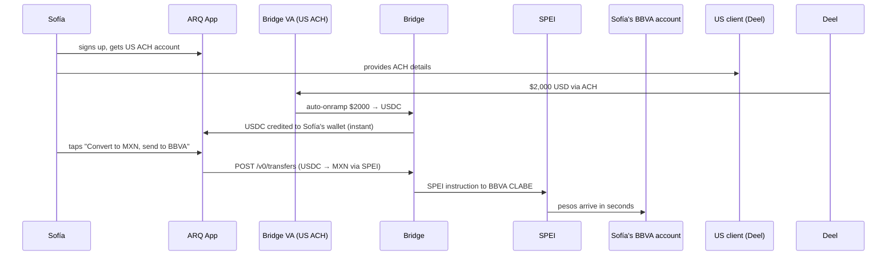
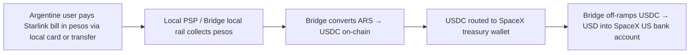

# Bridge Customer Walkthroughs: Concrete Mechanics, Real User Flows

**Research date:** May 3, 2026
**Scope:** What Bridge customers actually do with the platform, end-user flow by end-user flow.
**Confidence legend:** ✅ verified from multiple sources / 🟡 inferred from one source or strong logic / 🔴 marketing claim only

---

## 1. The shape of a Bridge integration (anchor concepts)

Before walking through customers, three Bridge primitives recur in every story below — pin them:

- **Virtual Accounts** (Orchestration API). Bridge issues a real US bank account (ACH/wire routing + account number) or local-rail equivalent to your end user. Anything that lands in that account is auto-converted to a stablecoin and routed onward. Endpoint: `POST /v0/customers/{id}/virtual_accounts`. ✅
- **Transfers** (Orchestration API). One call moves money between any two endpoints — fiat source (ACH push, wire, debit card, SEPA, SPEI, Pix) or crypto source (USDC on Base, USDT on Tron, USDB on Ethereum, etc.). Endpoint: `POST /v0/transfers` with `source`/`destination` blocks. Developer specifies fee in USD per call (or as a percent for virtual accounts). ✅
- **Open Issuance** (Issuance product, GA Sept 2025). Customers launch a branded stablecoin in days; Bridge handles reserves (BlackRock + Superstate), mint/burn, and 1:1 interop with other Open Issuance coins. Underpins Phantom CASH, mUSD, USDsui, USDH, USDSL, DKUSD, USDB. ✅
- **Prefunded Accounts** decouple settlement from payout speed: deposit USD up front, then push payouts instantly without waiting for the source ACH to clear. Critical for payroll and remittance. ✅

The Stripe Stablecoin Financial Account (Bridge under the hood) is now live in **101 countries** as a no-code product, while Bridge's APIs serve the developer surface for the same plumbing. ✅

---

## 2. Tier 1 customer walkthroughs

### 2.1 DolarApp (now rebranded as ARQ) — Mexico/Argentina/Colombia neobank

**Product:** A consumer dollar neobank for Latin America. App lets a Mexican (or Argentine/Colombian) hold "digital dollars" (USDC), get both an MX CLABE and a US ACH account, swap peso↔USDC instantly, earn 4.5% on idle balances, and spend via a Mastercard with up to 4% cashback. ✅

**Problem Bridge solves (specific):** ARQ doesn't have a US bank charter and doesn't want to negotiate correspondent banking in five countries. Bridge gives every ARQ user a *real* US bank account (ACH + routing) so payroll providers like Deel can pay them in USD; the USD lands at Bridge → auto-converts to USDC → Bridge mints into ARQ's wallet system. ✅

**Bridge products used:** Orchestration (Virtual Accounts + Transfers), and the recently announced **MXN FX rail** (peso↔stablecoin on/off ramp via SPEI). ✅ The borderless account is literally a Bridge virtual account proxied behind ARQ's UI. 🟡

**End-user walkthrough — "Sofía, a Mexico City designer working for a US client":**

**Pre-Bridge alternative:** Wise (high FX spread + multi-day for ACH inbound), or a US LLC + Mercury account (impossible without US presence), or PayPal (5–8% FX haircut). Reviews note ARQ wins on "no hidden spreads" and instant MX↔US fungibility. ✅

**Money path/costs:** USD ACH in → USDC mint by Bridge → optional onward SPEI to MX peso. ARQ charges a flat **$3 USD** to send USD into Mexico with instant settlement. ✅ Card spend uses Mastercard rails (Bridge's card product is Visa-default, so this is likely a separate Marqeta/Stripe Issuing pipe — 🟡).

---

### 2.2 Felix Pago — US→LATAM remittance via WhatsApp

**Product:** Remittance bot that lives inside WhatsApp. A US-based Latino texts Felix, says "send $100 to my mom Maria" and Maria gets pesos in her Mexican bank account in seconds. >$3B annualized payment volume reported by Stripe. ✅

**Problem Bridge solves (specific):** Felix needed (a) FX liquidity from USD→USDC→MXN that doesn't require pre-funding an MXN bank in Mexico, and (b) compliance/custody for the USD leg. Pre-Bridge, MoneyGram/Western Union take 3–5 days through SWIFT correspondents and charge ~$10 per $100. ✅

**Bridge products:** Orchestration. Bridge holds the USD leg, mints USDC, and Felix's Bitso account does the USDC→MXN conversion that pushes pesos via SPEI. (Felix uses Bridge for the *USD-side onramp + USDC custody*; Bitso handles the local MX rails.) ✅

**End-user walkthrough — "Carlos in Houston sending $100 to Maria in Guadalajara":**

1. Carlos opens WhatsApp, messages Felix bot: "Send $100 to Maria"
2. Felix AI bot asks recipient bank details, returns a secure card-payment link
3. Carlos taps link, pays with US debit card → funds settle into Felix's account at Bridge
4. Bridge converts USD → USDC (Stellar rail per the Stellar case study, or Solana per other docs) ✅
5. USDC moves to Bitso's order book
6. Bitso swaps USDC → MXN, fires SPEI to Maria's BBVA CLABE
7. Maria's phone buzzes within ~10–30 seconds with the deposit notification

**Costs:** **$2.99 per transaction** for bank delivery, **$4.98** for cash-pickup. Felix says using Bridge+USDC dropped per-tx fee from $4.98 to $2.99 — a **40% cost reduction** vs prior cash-agent flow. ✅

---

### 2.3 Phantom CASH — wallet-native stablecoin + Visa card

**Product:** Phantom (15M+ users, the dominant Solana wallet) launched **Phantom Cash** in Sept 2025 — a USD account inside the wallet, backed by **CASH** (the first stablecoin issued via Bridge's Open Issuance), plus a stablecoin-linked Visa debit card. ✅

**Problem Bridge solves (specific):** Phantom wanted a *branded* USD spending experience without becoming a money-services business, an issuer, a card-program manager, or a treasury. Open Issuance lets Phantom mint CASH (BlackRock/Fidelity/Superstate manage reserves) and Bridge issues the Visa card (Lead Bank is the BIN sponsor; Bridge Ventures LLC is program manager). ✅

**End-user walkthrough — "Alex in Austin tops up Phantom Cash and buys coffee":**

1. Alex opens Phantom, taps **Cash** tab → "Add Cash" → enters $50, pays via Stripe (web) or ACH
2. Stripe processes → Bridge mints **CASH** 1:1 into Alex's Phantom wallet (on Solana mainnet) ✅
3. Idle balance accrues yield (3–4% from US Treasury reserves shared with platform). 🟡 (yield distribution mechanism not fully public)
4. Alex taps "Order virtual card" — Phantom calls Bridge Cards API → Visa virtual card provisioned ✅
5. At Blue Bottle, Alex Apple-Pays with the virtual card → Visa swipe → Bridge's debit-card smart contract burns the requisite CASH from Alex's wallet → Bridge converts to USD → Visa settles to Blue Bottle in USD like any other transaction ✅
6. The on-chain leg (CASH burn → smart contract) is publicly visible on Solana. Merchant name does NOT appear on-chain. ✅

**Constraints:** Daily limit $2,000 default. US-only at launch (excl. NY). ✅

---

### 2.4 SpaceX / Starlink — global collections in 100+ countries

**Product:** Starlink satellite internet, sold in 100+ countries including Argentina, Nigeria, Kenya, Pakistan — many of which have capital controls or unreliable correspondent banking. ✅

**Problem Bridge solves (specific):** SpaceX collects local currency from a Starlink subscriber in Buenos Aires, but a wire from Banco Nación to a US bank can take a week, attracts FX restrictions, can be blocked, and exposes SpaceX to peso depreciation while the wire is in flight. Bridge converts local payments → stablecoin → USD treasury *the same day*. ✅

**End-user / treasury walkthrough — "Argentine subscriber pays monthly bill":**

The customer-facing UX is unchanged — they pay in pesos as normal. Behind the scenes, SpaceX no longer waits 5 days and eats 8% slippage. ✅ Chamath Palihapitiya publicly said SpaceX uses Bridge to collect Starlink payments in this manner.

**Pre-Bridge alternative:** Local correspondent banks + monthly batch SWIFT settlements. Multi-week treasury cycle, FX volatility risk, occasional capital-controls blocking. ✅

---

### 2.5 Airtm — Stellar-rail enterprise payouts to LatAm freelancers

**Product:** Global payouts platform, 2.5M users; pays freelance/remote workers in inflation-hit markets via Airtm wallets backed by 500+ local cash-out methods. Processed **$1.2B** in stablecoin volume in 2024; ~50% of enterprise payout volume went via the Bridge integration. ✅

**Problem Bridge solves (specific):** Enterprises in the US wanted to pay 100s of contractors in Argentina/Egypt/Venezuela without sending 100 individual wires. Airtm needed (a) a US virtual account per worker that an HR/payroll system could ACH into and (b) instant USDC settlement on Stellar to fan out to wallets. ✅

**Bridge products:** Orchestration → Virtual Accounts API. Each Airtm worker gets a US ACH account/routing #. Payroll software ACHes USD in → Bridge → converts to USDC → sends on Stellar to the worker's Airtm wallet. ✅

**End-user walkthrough — "Lucia, a UX designer in Buenos Aires, gets paid by a US client":**

1. US enterprise loads its monthly payroll run in its Airtm Enterprise dashboard
2. For each worker, the dashboard already has a **Bridge-issued Virtual Account** (account # + routing #)
3. Payroll system ACHes $3,000 to Lucia's Bridge VA
4. Bridge auto-converts → USDC; sends on **Stellar** to Lucia's Airtm wallet (memo-tagged) ✅
5. Lucia opens Airtm, sees $3,000 USDC; chooses cash-out method: Mercado Pago, ARS bank transfer, USDT, or Airtm-issued virtual card
6. Funds arrive in her local rail in minutes

**Numbers:** 250,000+ recipients across 7 continents, 1.2M successful tx. Argentina ≈ $9M in flows, Egypt ≈ $6.7M. **20–25% cost savings vs. PayPal/Wise** is the headline metric. ✅

---

### 2.6 Cenoa — emerging-market dollar accounts for Turkish/Nigerian freelancers

**Product:** "US dollar bank account in 3 minutes with just your ID" for users in Turkey, Nigeria, Mexico. Targets freelancers who get paid via Upwork/Fiverr/Toptal but live in countries with capital controls or 8% FX haircuts. **Grew 30x in 5 months.** ✅

**Problem Bridge solves (specific):** Turkish residents legally cannot easily open US bank accounts, and PayPal/Wise charge up to 8% to settle into TRY (lira). Cenoa needed instant US ACH-receiving accounts at scale. ✅

**Bridge products:** Virtual Accounts API (each user gets a real US account); Orchestration for the off-ramp into TRY/NGN via local rails (Turkey's FAST). ✅

**End-user walkthrough — "Emre, a freelance developer in Istanbul, billed Upwork client $5,000":**

1. Emre opens Cenoa, scans his Turkish ID, gets a US bank account in 3 minutes (Bridge VA under the hood)
2. Adds account to Upwork as withdrawal method
3. Upwork ACHes $5,000 to Emre's US-routing account
4. Bridge receives ACH, auto-mints to USDC inside Emre's Cenoa wallet
5. Emre holds USD (digital) until needed; or taps "Withdraw to TRY" → Bridge off-ramps via local rail → TRY arrives in his Garanti BBVA account via FAST in minutes
6. **Total fee: 0.99%** — vs ~5–8% via Payoneer/Wise after FX. ✅

---

### 2.7 Coinbase — cross-chain USDC↔USDT routing

**Product:** Coinbase the exchange/wallet. ✅ (Bridge customer per Stripe/Bridge press.)

**Problem Bridge solves (specific):** Coinbase users frequently need to move between USDC on Base (low fee) and USDT on Tron (the dominant remittance asset in many emerging markets). Coinbase doesn't want to maintain its own bridges, exotic liquidity pools, or stablecoin-issuer relationships for each pair. Bridge orchestrates the route. 🟡 (publicly cited in the CNBC and Stripe write-ups, but the API-call mechanics aren't published)

**End-user inference:** A Coinbase user clicks "Convert USDC (Base) → USDT (Tron)." Coinbase calls Bridge `POST /v0/transfers` with source=USDC/Base and destination=USDT/Tron. Bridge handles the mint/burn/swap and delivers TRC-20 USDT to the user's Tron address. 🟡

---

### 2.8 MetaMask USD (mUSD) — first wallet-native stablecoin

**Product:** mUSD, launched Sept 15, 2025 — the first stablecoin issued natively from inside a self-custodial wallet. Lives on Ethereum + Linea. Backed 1:1 by cash + short-dated US Treasuries. ✅

**Problem Bridge + M0 solve:** MetaMask wanted a stablecoin that was *native* to its UX (ramp/swap/bridge/spend in one tap) instead of just listing USDC. M0 provides the decentralized minting protocol (the on-chain primitive); Bridge provides the regulated mint/burn relationship + reserve management. Transak handles the consumer fiat onramp. ✅

**End-user walkthrough — "MetaMask user in Berlin adds USD":**

1. User opens MetaMask, sees "Add USD" entry point in the wallet
2. Taps → Transak fiat-onramp flow appears (card/SEPA)
3. User pays €100; Transak settles fiat
4. Bridge (via M0 protocol) mints **mUSD** ~€110 worth onto the user's MetaMask address on Linea (lower gas)
5. User can now swap on Linea DEXes, bridge to Ethereum, or — soon — spend on the MetaMask Card at Mastercard merchants ✅

---

### 2.9 Hyperliquid USDH — stablecoin for a perp DEX

**Product:** Hyperliquid (top decentralized perpetuals exchange). USDH is its native, validator-blessed stablecoin issued by **Native Markets**, which won a contested validator vote in Sept 2025. ✅

**Problem Bridge solves:** Hyperliquid wanted a yield-capturing native stablecoin (so the platform retains the T-bill float instead of paying it to Tether/Circle). Native Markets needed regulated mint/burn + reserve management; they chose Bridge as the issuance/reserves backbone. ✅

**Reserve flow:**
- Off-chain reserves: BlackRock money-market funds
- On-chain reserves: Superstate's USTB (tokenized T-bills)
- Mint/burn rails: Bridge ✅
- Yield split: 50% to HYPE buyback "Assistance Fund," 50% to ecosystem grants ✅

**Trader walkthrough — "DeFi trader on HyperEVM":**

1. Trader bridges USDC into Hyperliquid via Across (USDC → USDH at 1:1, no slippage, no bridge fee — origin-chain gas only) ✅
2. USDH lands on HyperEVM
3. Trader posts USDH as collateral on Hyperliquid perps, or supplies into yield protocols earning up to 4.9% APY
4. Withdraw: trader burns USDH, Bridge redeems → wires USD or sends USDC

---

### 2.10 Sui USDsui — L1-native stablecoin

**Product:** USDsui, launched Nov 12, 2025 by Sui Foundation via Bridge's Open Issuance. Designed to capture the float yield from the **$412B** in stablecoin transfer volume Sui processed Aug–Sept 2025. ✅ Interoperable 1:1 with other Open Issuance tokens (CASH, mUSD, USDH).

**Sui-app integration (developer-facing):** A Sui dApp adds USDsui as a supported token in its Move package; calls Bridge mint/burn for fiat on/off ramp. Because Open Issuance coins share liquidity, a user can swap mUSD→USDsui at par inside the wallet. 🟡 (mechanics described in the Open Issuance docs but app-level integration code isn't yet published in case studies)

---

## 3. Tier 2 customer walkthroughs

### 3.1 DoorDash — driver payouts via Tempo + Bridge (April 2026)

**Announced:** April 21, 2026. DoorDash will let Dashers (delivery drivers) opt into stablecoin payouts on **Tempo** (Stripe + Paradigm L1, payments-purpose blockchain). Stripe, Coastal Bank, and Latin American fintech ARQ are also production-deploying on Tempo. ✅

**Driver walkthrough — "Maria the Dasher in San Antonio":**

1. Maria finishes a $35 delivery; weekly Dasher payout day arrives
2. Instead of choosing ACH (1–3 business days) or DoorDash Instant Pay (50¢ fee), Maria selects "Stablecoin payout"
3. DoorDash sends payout via Tempo; Bridge mints stablecoin into Maria's wallet (custodial via DoorDash, or external wallet) — settlement in **seconds** ✅
4. Maria can spend via stablecoin debit card, hold for yield, or off-ramp to her bank

**Coastal Bank's role:** sponsor bank running stablecoin-native rails alongside its existing fintech program-management business — the regulated money-transmission/reserves backbone for parts of the Tempo flow. ✅

---

### 3.2 Payoneer — Q2 2026 stablecoin launch for SMBs

**Announced:** Feb 17, 2026. ~2M Payoneer business customers will get stablecoin receive/hold/send. ✅

**Use cases publicly named by Payoneer:**
- A goods wholesaler **receiving** customer payments in stablecoin
- A marketing agency **paying** international suppliers/contractors in stablecoin
- Hold in stablecoin or withdraw to local bank when needed ✅

This is Bridge's **Stablecoin Financial Account** product white-labeled inside Payoneer's UI. 🟡

---

### 3.3 Slash — USDSL for US neobank business customers

**Product:** San Francisco neobank for businesses; raised $41M Series B at $370M valuation (May 2025). Aug 2025 launched **USDSL** (its own stablecoin issued via Bridge Open Issuance) and a "Global USD Account" product for foreign companies that need USD access without a US bank. ✅

**End-customer walkthrough — "Marketing agency in Toronto":**

1. Agency opens Global USD Account in Slash; KYB through Slash (Bridge handles the underlying KYB plumbing)
2. Receives a US ACH account + USDSL wallet
3. US clients ACH to the account; balance reflects in USDSL
4. Agency pays its Filipino dev contractor by sending USDSL → contractor's wallet (or off-ramps to PHP via local rail)
5. A previous (pre-USDSL) stablecoin feature already moved ~$1B annualized — drove the bet on launching their own coin. ✅

---

### 3.4 Dakota — DKUSD for SMB treasury

**Product:** Crypto-native business neobank. Launched **DKUSD** via Bridge Open Issuance. ✅

**Astonishing stat:** **DKUSD shipped in less than one day of dev time** because Dakota was already on Bridge. Within months, **55% of Dakota's AUM moved into DKUSD**; Dakota expects 80% within a year. ✅

**Why customers prefer DKUSD over USDC inside Dakota:**
- Backed 1:1 by US Treasuries (Bridge-managed)
- Cannot leave Dakota's platform → eliminates depeg/security exposure
- Eligible for Dakota's rewards program (yield share)
- Treasury, deposits, and cross-border payouts use the same stablecoin under the hood ✅

---

### 3.5 Stellar Development Foundation & Strike

**SDF:** Bridge runs payouts on Stellar (the Airtm flow above is the canonical case). SDF's Enterprise Fund invested $15M in Airtm specifically to scale this. ✅

**Strike:** Mentioned in the original prompt context, but no public Bridge integration was found in this research pass. Strike's recent direction (Tether-backed BTC lending, Twenty One Capital merger) suggests a Tether/Bitcoin-native strategy distinct from the Stripe/Bridge/USDC stack. 🔴 (claim of Strike–Bridge use is unsubstantiated by the public record I could find)

---

## 4. Tier 3 — leaked / inferred flows

### 4.1 OpenAI ChatGPT / YouTube Premium in Nigeria

**The claim** (cited in a16z's analysis of the Stripe/Bridge deal): "Bridge's current use cases include consumers in Nigeria paying for YouTube Premium or ChatGPT with stablecoins." ✅ (a16z fintech newsletter, April 2025)

**Inferred flow — "Tunde in Lagos subscribes to ChatGPT Plus":**

1. Tunde tries to subscribe; Nigerian naira card is rejected by Stripe (foreign-spending limits, ~$20–50/mo cap)
2. Stripe's checkout offers an alternative: pay in stablecoin (USDC) ✅ for the path; 🟡 for the exact UX
3. Tunde pays USDC from a wallet (Phantom, MetaMask, Binance) on a supported chain
4. Stripe (Bridge under the hood) credits OpenAI in USD via Stripe Treasury
5. Tunde's ChatGPT Plus is activated immediately — bypassing Nigerian banking limits entirely

This is the Stripe Stablecoin Financial Accounts product applied to consumer checkout: Stripe accepts stablecoin from a Lagos consumer, OpenAI receives USD in its US bank account next-day. The same flow applies to YouTube Premium. ✅ for use case existence; 🟡 for exact UI

---

### 4.2 US State Department / Treasury aid disbursement

The Trump administration proposed blockchain rails for USAID disbursement; Kenya Red Cross and ICRC have been piloting "Humanitarian Token Solution" stablecoin distribution. **No verified evidence** in public sources tying Bridge specifically to these flows. 🔴 (the original prompt context suggests the connection but I could not confirm it)

---

### 4.3 Bitso — B2B cross-border via stablecoin

**Product:** Bitso Business is the LatAm crypto-native PSP (the same one Felix Pago routes through).

**Bridge intersection:** Bitso uses stablecoin (USDC, MXNB) as the cross-border rail; Bridge often sits on the *USD side* of those transactions when a US enterprise wants to pay LatAm. Combined corridor performance: BRL→USDC→MXN clears at **<10 bps spread** vs 40–65 bps via legacy SWIFT, with 7–10 minute settlement. ✅

---

## 5. Developer onboarding experience (concrete)

✅ **Self-serve signup is gated.** You email `support@bridge.xyz` first to get a developer account; only then can you generate sandbox API keys.
✅ **KYB is required before dashboard access.** You sign a contract, upload KYB docs (the dashboard now lets you see exactly which KYB/KYC/UBO fields are missing and upload directly).
🟡 **Time-to-sandbox:** "a few hours" once contract is signed; founders have moved real funds within hours of dashboard access (per Bridge's own dashboard-update blog).
✅ **Sandbox base URL:** `https://api.sandbox.bridge.xyz`. The customer-creation + KYC flow runs end-to-end in sandbox.
✅ **Card-program timeline:** 6–8 weeks from kickoff to onboarding external customers, when launching cards via Bridge + Stripe Issuing.
✅ **Open Issuance timeline:** "launch a stablecoin in just a few days" — confirmed by Dakota shipping DKUSD in <1 day.

**Pricing/fees (publicly disclosed):**
- Developer fees: **set by you**, denominated in USD, 2 decimal places, per-transfer (`developer_fee` field). For virtual accounts, you set a `developer_fee_percent`. ✅
- Bridge's own take rate: **not publicly disclosed**. 🔴 (no rate card found)
- Real customer-facing pricing: Felix charges $2.99 per remittance; ARQ charges $3 per USD-in to MXN; Cenoa total = 0.99% to receive + withdraw; Airtm enterprises save 20–25% vs PayPal/Wise. ✅
- Bridge↔Hyperliquid (Across) USDC→USDH: zero bridge fee, only origin-chain gas. ✅
- LatAm corridor (Bitso, with Bridge sitting on USD side): <10 bps spread BRL↔MXN. ✅

---

## 6. The Bridge Dashboard (what customers see)

Bridge's product surface includes a Developer Dashboard that has evolved into a "central command center." ✅ Public blog details the surfaces:

- **Customers tab:** manage end-user customer records, edit external bank account info, configure same-name payouts (so customer receipts show your brand name on USD wires).
- **Compliance workflows:** KYB/KYC/UBO dossiers managed in-product (previously external). Shows missing fields, accepts uploads.
- **Wallet Accounts management.**
- **Transactions view** for ops teams.
- **Note:** Virtual Accounts cannot be created in the dashboard — only via API. ✅

Open Issuance has its own console at `openissuance.com` for stablecoin issuers (Phantom, Sui, MetaMask, Hyperliquid, etc.) covering reserve management, mint/burn, and supply operations. ✅

---

## 7. What case studies reveal that the API docs don't

A few mechanics that emerge only from customer case studies:

1. **Stellar is the production rail for Airtm** — not Solana, not Ethereum. Bridge is rail-agnostic per the docs but in practice picks chains by use case (Stellar for low-cost LatAm payouts; Solana for Phantom; Ethereum/Linea for MetaMask; HyperEVM for Hyperliquid; Tron when destination is USDT). ✅
2. **The "virtual account = real US ACH account" model is what unlocks emerging-market freelance work.** Bridge isn't selling routing numbers as a curio — it's the entire reason Cenoa / Airtm / DolarApp exist. The Stripe-Treasury–like wrapper is the killer feature. ✅
3. **Dakota's 1-day ship time** is the most concrete time-to-launch stat publicly available, and it's only possible because Dakota was already on Orchestration. New customers should expect days-to-weeks. ✅
4. **Bridge cards use a smart-contract burn model on-chain** (Phantom Cash docs) — the swipe burns CASH from the user's wallet via a Bridge-controlled smart contract, then Bridge converts to USD and settles to Visa. This appears on-chain and is auditable. ✅
5. **Open Issuance interop is via 1:1 atomic swap** between Open Issuance coins (CASH ↔ mUSD ↔ USDsui ↔ USDH ↔ DKUSD). This is more than marketing — it's the shared liquidity network for all Bridge-issued coins. ✅
6. **Bridge holds licenses to custody assets in 100+ countries** — this is the regulatory moat customers actually cite as the reason they don't do it themselves. ✅
7. **Prefunded Accounts** are how Felix and Airtm get instant settlement: deposit USD in advance, Bridge pushes out instantly without waiting for ACH clear. The docs describe it; the case studies confirm it's what makes "remittance arrives in seconds" possible. ✅

---

## 8. Notable quotes / public datapoints

- Bridge transaction volume **more than quadrupled in 2025** (Stripe/Bridge, Feb 2026). ✅
- Bridge has facilitated **hundreds of millions in USDB mints/redemptions across 30+ countries** since USDB launch. ✅
- Patrick Collison: "Bridge reminds me of Stripe 10 years ago in how it operates and engages with developers." ✅
- Zach Abrams predicts "dozens, if not hundreds" of branded stablecoins via Open Issuance in coming months. ✅
- Visa+Bridge cards: live in **18 countries** as of late 2025, expanding to **100+ by end of 2026**, addressing **175M+ Visa merchants**. ✅
- Phantom's 15M users; Airtm's 2.5M users; Payoneer's 2M biz customers — collectively a multi-tens-of-millions reach via a single platform. ✅

---

## 9. Gaps / what I couldn't verify

- **Strike–Bridge integration:** no public evidence; Strike's stack appears Tether/Bitcoin-native. 🔴
- **State Dept / Treasury aid:** generic blockchain interest exists; specific Bridge tie unconfirmed. 🔴
- **OpenAI Nigeria UX:** the use case is publicly named by a16z but the actual checkout UI screenshots aren't published. 🟡
- **Bridge rate card:** no public take-rate disclosure for orchestration; only customer-facing prices (which include the customer's markup). 🔴
- **SpaceX exact API integration:** widely cited as a Bridge customer but SpaceX has never described the integration publicly; everything we know comes from Chamath's public remarks and Stripe/Bridge's customer name-drops. 🟡

---

## Sources

- [How Airtm and Bridge Enable Faster, Cheaper Cross-Border Payments — Bridge case study](https://www.bridge.xyz/case-study/airtm-case-study)
- [Stellar: How Airtm and Bridge Are Solving Cross-Border Payments](https://stellar.org/case-studies/airtm-x-bridge-cross-border-payments)
- [Cenoa Case Study — Bridge](https://www.bridge.xyz/case-study/cenoa-case-study)
- [Dakota Case Study — Bridge](https://www.bridge.xyz/case-study/dakota-case-study)
- [Phantom Cash FAQ](https://help.phantom.com/hc/en-us/articles/44800866087443-Phantom-Cash-FAQ)
- [Phantom Cash debit card mechanics](https://help.phantom.com/hc/en-us/articles/44800221533459-Spend-CASH-with-your-Phantom-Cash-debit-card)
- [Phantom unveils CASH on Bridge Open Issuance — Blockworks](https://blockworks.com/news/phantom-unveils-phantom-cash)
- [Introducing Open Issuance from Bridge — Stripe](https://stripe.com/blog/introducing-open-issuance-from-bridge)
- [MetaMask USD launch — MetaMask](https://metamask.io/news/introducing-metamask-usd-your-dollar-your-wallet)
- [MetaMask + Bridge + M0 partnership — M0 press](https://www.m0.org/press-releases/bridge-and-m0-are-partnering-to-help-businesses-issue-custom-stablecoins-starting-with-metamask-usd)
- [Sui USDsui launch via Bridge Open Issuance — CoinDesk](https://www.coindesk.com/business/2025/11/12/sui-launches-native-stablecoin-usdsui-using-bridge-s-open-issuance-platform)
- [Hyperliquid USDH / Native Markets — The Block](https://www.theblock.co/post/370570/native-markets-team-wins-hyperliquid-usdh-stablecoin-bid-eyes-test-phase-within-days)
- [USDH official page](https://usdh.com/)
- [DoorDash + Tempo + Bridge — CoinDesk](https://www.coindesk.com/business/2026/04/21/doordash-is-bringing-stablecoin-payments-to-masses-with-stripe-backed-blockchain)
- [Tempo enterprise launch — DoorDash, Stripe, Coastal, ARQ](https://tempo.xyz/blog/enterprise)
- [Payoneer + Bridge announcement — Payoneer Investors](https://investor.payoneer.com/news-releases/news-release-details/payoneer-launch-stablecoin-capabilities-powered-bridge-bringing)
- [Slash USDSL launch — CoinDesk](https://www.coindesk.com/business/2025/08/05/u-s-neobank-slash-debuts-stablecoin-with-stripe-s-bridge-for-global-business-payments)
- [Felix Pago + Stripe customer page](https://stripe.com/customers/felix)
- [Felix + Bitso + USDC/Stellar case study](https://stellar.org/case-studies/felix-bitso)
- [Felix Pago pricing & WhatsApp flow](https://www.felixpago.com/en)
- [DolarApp / ARQ buy-USDC walkthrough](https://www.usdc.com/learn/how-to-buy-usdc-dolarapp)
- [DolarApp + Bridge MXN FX launch](https://www.bridge.xyz/news/mxn-fx)
- [ARQ help — borderless account & fees](https://help.dolarapp.com/en/articles/6386204-borderless-account-transfer-in-local-currencies-or-u-s-dollars)
- [ARQ rebrand site](https://www.arqfinance.com/en-MX)
- [Cenoa Turkey freelancer dollar account](https://www.cenoa.com/blog/how-to-open-a-dollar-account-in-turkey)
- [SpaceX/Starlink uses Bridge — Chamath / TheStreet](https://www.thestreet.com/crypto/innovation/spacex-uses-stablecoins-to-collect-payments-from-starlink-customers-says-chamath-palihapitiya)
- [Visa + Bridge stablecoin cards — Visa newsroom](https://usa.visa.com/about-visa/newsroom/press-releases.releaseId.21371.html)
- [Visa + Bridge expansion to 100+ countries (2026)](https://investor.visa.com/news/news-details/2026/Visa-and-Bridge-Expand-Collaboration-with-Plans-to-Bring-Stablecoin-Linked-Cards-to-Over-100-Countries/default.aspx)
- [Bridge Stablecoin Cards product](https://www.bridge.xyz/product/cards)
- [Bridge USDB launch](https://www.bridge.xyz/news/usdb)
- [Stripe Stablecoin Financial Accounts in 101 countries](https://stripe.com/blog/introducing-stablecoin-financial-accounts)
- [Bridge Dashboard improvements](https://www.bridge.xyz/blog/everything-you-can-now-do-in-the-bridge-dashboard)
- [Bridge Developer Dashboard docs](https://apidocs.bridge.xyz/docs/developer-dashboard)
- [Bridge sandbox setup docs](https://apidocs.bridge.xyz/get-started/introduction/quick-start/setting-up-sandbox)
- [Bridge Transfers API endpoint docs](https://apidocs.bridge.xyz/platform/orchestration/transfers/transfer)
- [Bridge Prefunded Accounts](https://apidocs.bridge.xyz/docs/prefunded-accounts-1)
- [Bridge Virtual Accounts onramp guide](https://apidocs.bridge.xyz/get-started/guides/move-money/virtualaccounts)
- [Bridge developer fees docs](https://apidocs.bridge.xyz/platform/orchestration/fees-and-mins/devfees)
- [Cheeky Pint: Zach Abrams + Henri Stern stablecoin special](https://cheekypint.substack.com/p/stablecoin-special-zach-abrams-bridge)
- [Bankless: Stripe's Trillion-Dollar Bet — Zach Abrams](https://www.bankless.com/podcast/stripes-trillion-dollar-bet-how-stablecoins-eat-global-payments)
- [a16z: What Stripe's Acquisition of Bridge Means (April 2025)](https://a16z.com/newsletter/what-stripes-acquisition-of-bridge-means-for-fintech-and-stablecoins-april-2025-fintech-newsletter/)
- [Stripe Bridge volume quadruples — CoinDesk](https://www.coindesk.com/business/2026/02/24/stripe-s-bridge-sees-stablecoin-volume-quadruple-as-utility-insulates-from-crypto-winter)
- [Bitso Business: SPEI/PIX + stablecoin liquidity](https://business.bitso.com/en/blog/stablecoin-liquidity-via-pix-spei-in-brazil-mexico)
- [Cybridhe: Bitso real-time SPEI/PIX + stablecoins](https://business.bitso.com/en/blog/real-time-without-friction-how-to-combine-spei/pix-with-stablecoins-to-free-up-capital-in-latam)
