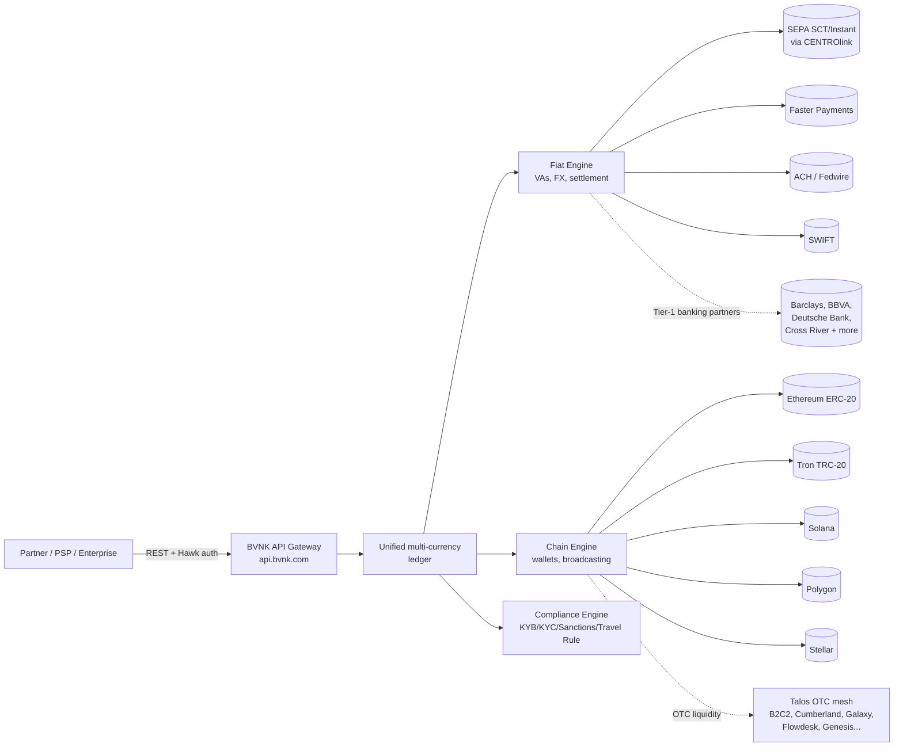
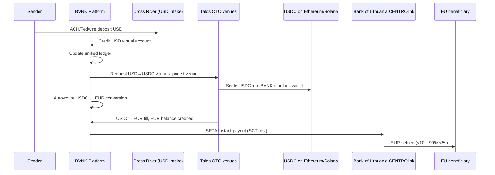
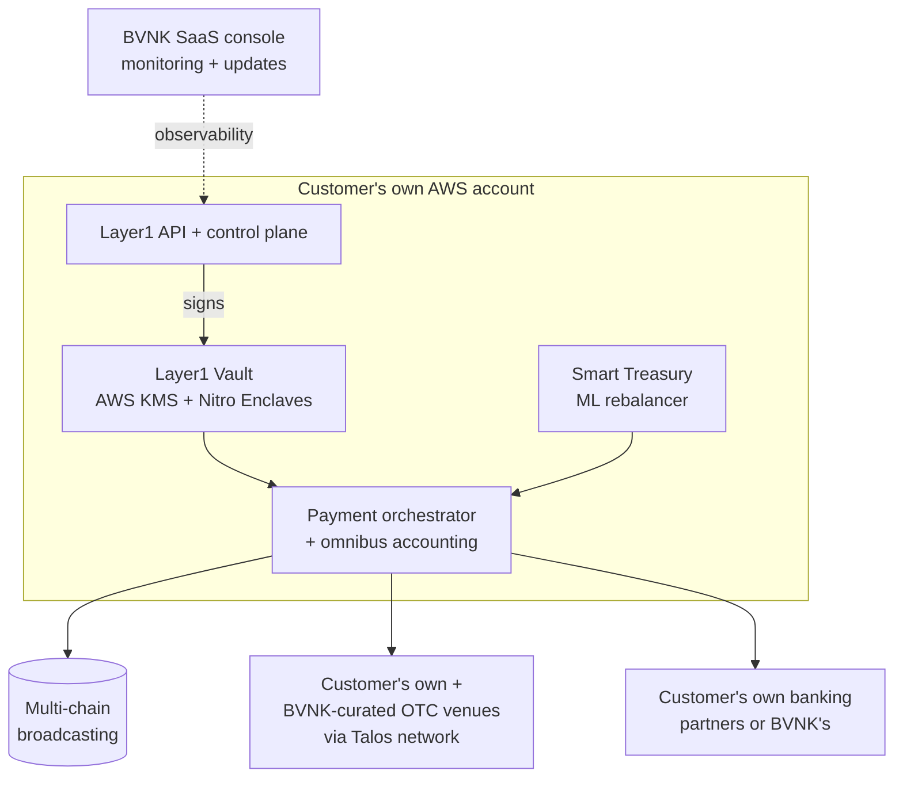

# BVNK: Architecture, Products, Technical Mechanics & Pricing — A Deep Technical Pass

*May 2026 — context: Mastercard agreed to acquire BVNK on March 17, 2026 for up to $1.8B ($1.5B upfront + $300M contingent earn-out), with closing expected late 2026 pending regulatory approvals.*

This deep dive focuses on what BVNK actually *is* under the hood — the products, the API surface, the rails, the licenses, the pricing posture, and where the marketing diverges from the substantiated reality. Confidence labels: ✅ verified across 2+ sources / 🟡 single-source or partial / 🔴 inferred or contested.

---

## 1. Product Surface — What BVNK Actually Sells

BVNK has converged on **four product SKUs** sitting on a shared platform, and they explicitly position them along a "control vs convenience" axis. Mapped:

| Product | Launched | Customer profile | Custody / licensing model |
|---|---|---|---|
| **Managed Payments** (formerly the "BVNK platform") | 2021 (core) | Fintechs / PSPs that want stablecoin rails fast | BVNK custodies, BVNK's licenses, BVNK's banks |
| **Embedded Wallets** | March 2025 | Neobanks, payroll, B2B platforms surfacing a multi-currency balance to *their* end users | Custodial under BVNK; partner = integration layer |
| **Layer1** (separate brand at layer1.com) | June 27, 2024 | PSPs/large fintechs/financial institutions wanting their own infra | **Self-hosted in customer's AWS, self-custody, customer brings own licenses** |
| **Smart Treasury** | July 15, 2025 | Layer1 customers managing high-velocity stablecoin liquidity | AI/ML auto-rebalancing layer running on top of Layer1 |

✅ Across all SKUs the primitive verbs are **Send · Receive · Store · Convert** — a deliberately Stripe-style API vocabulary BVNK has been reusing since its 2023 platform repositioning ([BVNK product showcase 2024](https://bvnk.com/blog/product-showcase-2024)).

### 1.1 Managed Payments
The flagship API product. ✅ Verified capabilities:
- Multi-currency virtual accounts in **USD, EUR, GBP** (named or "pulled" vIBANs)
- Auto-conversion fiat ↔ stablecoin at spot
- Stablecoin payouts to external wallet addresses or to fiat beneficiaries
- "Channels" (long-lived blockchain receive addresses) for merchant acquiring
- KYB/KYC handled by BVNK as the regulated counterparty
([Manage Payments](https://bvnk.com/payments) · [BlockEden report](https://blockeden.xyz/blog/2025/05/18/bvnk/))

### 1.2 Embedded Wallets
Launched March 2025. ✅ Custodial multi-currency balance product white-labeled by partners. End users hold balances in USD/EUR/GBP/USDC/USDT, with auto-conversion 24/7. Wallets are programmable, mapped per end-user, and surfaced through partner UIs. Critically, these are **balances at a regulated custodian, not on-chain smart-contract wallets the end user signs for** ([Sam Boboev deep dive](https://samboboev.medium.com/deep-dive-bvnk-vs-bridge-vs-zero-hash-stablecoin-payment-infrastructure-1235fd4e6d73) · [BVNK Embedded Wallets page](https://bvnk.com/embedded-wallets)). This is the same pattern as Bridge/Zero Hash — *"end-user wallets"* in marketing copy = ledger sub-accounts at a regulated entity.

### 1.3 Layer1 — the flagship "infra" play (deep dive in §7)
A separately branded, **self-hosted** stablecoin payments stack. Software runs in the customer's own AWS account. Customer brings their own licenses, custodian (or uses BVNK's), and liquidity. Pricing model is **quarterly fixed subscription + bps on volume** ([Layer1 specs](https://www.layer1.com/specs)). This is the closest analog to Fireblocks-for-payments + Bridge's orchestration combined.

### 1.4 Smart Treasury
Launched July 2025. ✅ ML-based forecasting that automates **venue funding, gas wallet rebalancing, withdrawal flow management** across a customer's chain footprint. Currently restricted to Layer1 customers ([Smart Treasury launch](https://ffnews.com/newsarticle/cryptocurrency/bvnk-smart-treasury-launch/)). Internal use first, then productized — meaning BVNK was eating its own dogfood for treasury automation before turning it into a SKU.

### 1.5 Card issuance — does BVNK have one?
🟡 **No native BVNK-issued card product as of May 2026.** Searches across BVNK product pages, the help center, and acquisition coverage produce zero references to a card-issuing SKU. The Mastercard deal explicitly *fills* this gap: Mastercard provides "global fiat infrastructure (push-to-card, account, wallet)" while BVNK provides the on-chain side ([Mastercard press release](https://www.mastercard.com/us/en/news-and-trends/press/2026/march/Mastercard-to-acquire-BVNK-to-connect-on-chain-payments-and-fiat-rails.html)). Pre-acquisition, BVNK offered card *acceptance* via its Worldpay partnership and "Visa Direct stablecoin payouts" through its January 2026 Visa Direct integration ([BVNK powers Visa Direct](https://bvnk.com/blog/bvnk-powers-stablecoin-payments-for-visa-direct)) — but neither is BVNK issuing branded cards itself.

### 1.6 Stablecoin issuance — Open Issuance equivalent?
🔴 **No.** Bridge has "Open Issuance" (branded reserve-backed stablecoins with shared yield on T-bills). BVNK has **no comparable issuance product**. Layer1 explicitly markets itself as "infrastructure-only software, not in the flow of funds" — it moves and orchestrates *existing* stablecoins (USDC, USDT, EURC, PYUSD) but does not mint new ones ([routefusion comparison](https://www.routefusion.com/blog/bridge-vs-bvnk-vs-routefusion-comparison) · [Sam Boboev](https://samboboev.medium.com/deep-dive-bvnk-vs-bridge-vs-zero-hash-stablecoin-payment-infrastructure-1235fd4e6d73)). This is a real product-line gap vs Bridge that Mastercard will likely address post-close (Mastercard already partners with Paxos / has its Multi-Token Network).

---

## 2. Technical Architecture

### 2.1 High-level platform model

### 2.2 End-to-end USD → EUR transfer (the "stablecoin sandwich")

✅ The sandwich pattern (fiat-in → stablecoin hop → fiat-out) is described identically across the [Coinflow case study](https://bvnk.com/case-studies/powering-instant-stablecoin-settlements-at-scale-coinflow), the [BVNK SWIFT launch piece](https://thepaypers.com/crypto-web3-and-cbdc/news/bvnk-adds-swift-payments-for-stablecoin-and-fiat-transfers), and the [Bitso partnership](https://thefintechtimes.com/bitso-business-and-bvnk-join-forces-to-simplify-international-money-movement-through-stablecoins/).

### 2.3 Banking partners

| Partner | Role | Confidence |
|---|---|---|
| **Cross River Bank** (NJ-chartered, FDIC #58410) | US USD on/off-ramp; ACH/Fedwire | ✅ confirmed; ex-CRB exec Keith Vander Leest is a BVNK US lead |
| **Barclays, BBVA, Deutsche Bank** | Tier-1 EUR/GBP/USD safeguarding accounts | ✅ named in BlockEden + multiple analyst reports |
| **Bank of Lithuania (CENTROlink)** | Direct technical partnership for SEPA SCT + SCT Inst | ✅ [Finextra](https://www.finextra.com/pressarticle/108452/bvnk-achieves-direct-sepa-access) |
| **"10+ banking partners"** total | Mix of Tier-1 EU + US partners | 🟡 self-disclosed in BVNK press; specific names beyond Barclays/BBVA/Deutsche/Cross River not exhaustively published |
| **Sutton Bank** | Not confirmed for BVNK (Sutton appears in many BaaS searches but no BVNK-specific source) | 🔴 |

### 2.4 On-chain custody model

✅ **Dual-track**, depending on SKU:

- **Managed Payments / Embedded Wallets** → BVNK custodies under HSM + MPC infrastructure ([Sam Boboev](https://samboboev.medium.com/deep-dive-bvnk-vs-bridge-vs-zero-hash-stablecoin-payment-infrastructure-1235fd4e6d73)). Whether the underlying tech is Fireblocks, in-house, or a hybrid is **not publicly disclosed**. Crossmint's competitive comparison page implies BVNK is *not* using Fireblocks (and explicitly differentiates by saying Layer1 keys "remain inaccessible to third parties, unlike alternatives like Fireblocks").
- **Layer1** → **Self-custody, deployed in the customer's own AWS environment**, key management built on **AWS KMS + AWS Nitro Enclaves (Secure Enclave)** ([Layer1 Vault page](https://www.layer1.com/specs)). This is the same architectural pattern AWS publishes as a reference implementation for blockchain key management — Layer1 productizes it.

### 2.5 Settlement chains supported

✅ Confirmed across docs and product pages:
- **Ethereum (ERC-20)**
- **Tron (TRC-20)**
- **Solana**
- **Polygon**
- **Stellar** (mentioned in architecture references)

🟡 Hinted but not confirmed in publicly indexed sources: **Cardano** (referenced in one search snippet — likely legacy from the 2021–22 era), **Avalanche/Base/Optimism/Arbitrum** (not explicitly listed for BVNK on first-party sources). Layer1 docs mention "integrations with custom blockchains will be available in future versions."

### 2.6 Stablecoins supported

✅ **USDC, USDT, PYUSD** consistently named on first-party pages.
🟡 **EURC** — no direct first-party confirmation in the searches I ran (a notable absence given BVNK's heavy EUR positioning).
🔴 No branded/private stablecoin issuance.

### 2.7 Operational float model

Bridge's well-documented model is to keep **per-chain operational float** (USDC on Ethereum, USDC on Solana, etc.) so that fiat-to-stablecoin conversions are effectively *internal book transfers* against pre-funded inventory, eliminating the chain settlement leg from the critical path.

🟡 BVNK's published architecture describes a **similar** model: "BVNK instantly converts to USDC across [the customer's] preferred chains" with sub-second internal credit. The Smart Treasury product specifically automates "venue funding, gas wallet rebalancing, and withdrawal flow management" — language that strongly implies BVNK runs **per-chain hot wallets** funded from a master treasury, with ML-driven rebalancing across chains and OTC venues. The Talos integration (which connects ~60 venues including B2C2, Cumberland, Galaxy, Flowdesk) provides the just-in-time refill liquidity ([Talos case study](https://www.talos.com/insights/bvnk-supports-stablecoin-payments-with-talos-trading-technology-and-connectivity)).

### 2.8 Local rails actually integrated

| Rail | Region | Status |
|---|---|---|
| **SEPA SCT + SCT Inst** | EEA | ✅ Direct via CENTROlink (rare — most fintechs are sponsored) |
| **Faster Payments + CHAPS** | UK | ✅ Confirmed |
| **ACH + Fedwire + SWIFT** | US/global | ✅ Confirmed (USD via Cross River + correspondents) |
| **PIX (Brazil)** | BR | 🟡 Indirect via **Bitso Business** partnership |
| **SPEI (Mexico)** | MX | 🟡 Indirect via **Bitso Business** partnership |
| Other LATAM (COP, etc.) | LATAM | 🟡 T+1/same-day via Bitso payout partner network |

This is materially different from Bridge, which has direct rails in 5 countries; BVNK's **direct EU rail access is meaningfully ahead of Bridge** (CENTROlink direct membership), but BVNK's LATAM/EM coverage is **partner-dependent (Bitso)** rather than direct.

---

## 3. API / Developer Surface

### 3.1 Base infrastructure

✅ Verified from [docs.bvnk.com](https://docs.bvnk.com/reference/overview):
- **Sandbox base URL:** `https://api.sandbox.bvnk.com/`
- **Production base URL:** `https://api.bvnk.com/`
- **Embedded surface:** `embedded.bvnk.com` (separate documentation host for the partner-customer model)
- **Protocol:** REST/HTTPS, JSON in/out
- **Postman collection** is officially provided

### 3.2 Authentication — the unusual choice

✅ **Hawk authentication** (HMAC-SHA256). This is a *distinctly unusual* choice in 2026 — most modern payments APIs use either Bearer tokens (Stripe) or API-key-in-header (Bridge, Zero Hash). Hawk requires:
1. Setting up `id`, `key`, `algorithm: "sha256"` credentials.
2. Generating per-request artifacts: `timestamp`, `nonce`, `method`, `resource`, `host`, `port`.
3. Computing HMAC-SHA256 over a canonicalized request string.
4. Building the `Authorization: Hawk ...` header.

BVNK ships sample code in **Ruby, Java, C#, PHP** (which itself tells you who their integrators are — enterprises with mature stacks, not startup TS/Python shops). Curl is *not* practical without a Hawk wrapper library. This is a real friction point for developer experience and likely a holdover from the 2021–22 PSP-era codebase.

### 3.3 Endpoints / resource catalog

Inferred from the docs structure:

| Resource | Verbs | Notes |
|---|---|---|
| **Customers** (Embedded Partner Customers / EPCs) | Create / Retrieve / List | Company or individual; KYB/KYC triggered post-create |
| **Wallets** | Create / Retrieve | Per customer, multi-currency (USD/EUR/GBP/USDC/USDT) |
| **Virtual Accounts** | Create / Retrieve | Two flavors: **Named** (vIBAN in EEA, supports SEPA) and **Pulled** (SWIFT vIBANs for cross-border) |
| **Channels** | Create / Retrieve | Long-lived crypto receive addresses, auto-convert at spot |
| **Payments / Payouts** | Create / Retrieve | Idempotency-key supported |
| **Beneficiaries** | Create / Verify | Includes name-verification endpoint |
| **FX / Conversions** | Quote / Execute | Spot conversion fiat↔stablecoin |
| **Webhooks** | Configure | HMAC-SHA256 signature, 10s timeout, retries |

### 3.4 Idempotency

✅ Documented at `/reference/idempotency`. Standard model: client sends an idempotency key on POST; identical key returns the original result. Explicitly recommended for "moving money and creating payment orders." This is parity with Stripe-class APIs.

### 3.5 Webhooks

✅ Event format: `bvnk:payment:payout:status-change` and similar dot-namespaced events. Payload signed with HMAC-SHA256 using a webhook-specific secret. Receivers must respond `2xx` within 10 seconds or BVNK retries. Unique event ID is included for receiver-side idempotency. Webhook signature validator is published in the docs.

### 3.6 SDKs

🟡 Mixed picture from GitHub:
- `github.com/BVNK` org has ~15 repos
- `bvnk/javascript-sdk` exists but appears low-activity (2 forks, 0 stars per search snippet)
- `bvnk/python-sdk` exists, with model files like `Fees.md` indicating it's auto-generated from an OpenAPI spec
- PHP and Java SDKs referenced

The fact that the SDKs are sparsely starred and appear auto-generated suggests these are **machine-generated SDK-as-doc-artifact rather than handcrafted, idiomatic libraries** — same pattern as many enterprise APIs (Plaid uses this approach; Stripe does not). For a developer evaluating BVNK vs Bridge, Bridge ships a much more polished TS-first SDK.

### 3.7 Sandbox

✅ Self-serve sandbox sign-up; mirrors production with test data. **Sandbox config does NOT auto-promote to production** (you must replicate). Withdrawals/payouts require **IP allowlisting** (production only). Read-only endpoints have fewer restrictions. Specific rate-limit numbers are not public.

---

## 4. Pricing

### 4.1 The core posture

✅ BVNK does **not publish a rate card**. All pricing is enterprise-negotiated with minimum volume commitments. This is materially less transparent than Routefusion (which publishes per-rail/per-corridor breakdowns) and roughly on par with Bridge.

### 4.2 What we can triangulate

| Component | Range | Source/confidence |
|---|---|---|
| **All-in transaction fee** | 0.3% (high-volume enterprise) – 2% | 🟡 [Eco support article 2026](https://eco.com/support/en/articles/14797799-stablecoin-payment-processors-compared-2026); Stripe/Bridge sit closer to 1.5% retail |
| **FX spreads — majors (USD/EUR/GBP)** | 5–25 bps cited in the original Routefusion piece | 🟡 Routefusion-comp narrative; the search result citing 5–30 bps for "90-day forward points" is about FX forwards, not BVNK's spot spread — be careful conflating these |
| **FX spreads — exotics** | 30–90 bps (Routefusion comparison framing) | 🟡 Same caveat |
| **Brazil↔Mexico (BRL→USDC→MXN) corridor** | **<10 bps** vs 40–65 bps legacy | ✅ [Polygon LATAM piece](https://polygon.technology/blog/latam-corridor-economics-why-enterprises-are-betting-on-stablecoins-for-cross-border-payments) — full loop closes in 7–10 minutes |
| **Layer1 pricing** | **Quarterly fixed subscription + bps on payment flows** | ✅ [Layer1 specs page](https://www.layer1.com/specs) — exact numbers private |
| **Network/gas fees** | Pass-through to customer | ✅ Layer1 docs |
| **Card interchange splits** | N/A — no card issuance product | ✅ |

### 4.3 Pricing posture vs Bridge

| Dimension | BVNK | Bridge |
|---|---|---|
| Public rate card | No | No |
| Transparent FX breakdown via API | No | No |
| Per-rail itemization | Negotiated | Negotiated |
| Volume minimums | Yes — explicit | Yes — implicit |
| Subscription component | **Yes (Layer1)** | No (Bridge is per-tx + spread) |
| Stablecoin issuance yield share | N/A (no issuance) | Yes (Open Issuance T-bill yield share) |

The Layer1 subscription model is the structural pricing difference: BVNK monetizes **infrastructure delivery** as a SaaS line, then layers volume-bps on top. Bridge is more purely volume-priced.

---

## 5. Country & Rail Coverage

### 5.1 BVNK's claim vs reality
- **Marketing claim:** "Send and receive payments on all major blockchain networks across 130+ countries" (Mastercard press release)
- **More conservative figures elsewhere:** "80+ countries" on virtual accounts, "30,000+ businesses across 34 countries" customer base
- **Reality:** the "130+ countries" number is **payout reachability**, much of it via stablecoin-to-wallet. Direct local rail integration is much smaller.

### 5.2 Direct local rails (where BVNK actually owns the integration)

| Country/Region | Inbound | Outbound | Mechanism |
|---|---|---|---|
| 🇪🇺 EEA (EUR) | ✅ SEPA / SEPA Inst | ✅ SEPA / SEPA Inst | Direct CENTROlink |
| 🇬🇧 UK (GBP) | ✅ FPS / CHAPS | ✅ FPS / CHAPS | UK EMI license |
| 🇺🇸 US (USD) | ✅ ACH / Fedwire / SWIFT | ✅ ACH / Fedwire / SWIFT | Cross River |
| 🇧🇷 Brazil (BRL) | 🟡 Indirect | 🟡 Indirect | Bitso |
| 🇲🇽 Mexico (MXN) | 🟡 Indirect | 🟡 Indirect | Bitso (SPEI) |
| 🇨🇴 COP, 🇿🇦 ZAR, others | 🔴 Stablecoin-only or T+1 | 🔴 Same | Partner network |

**Direct production-grade rail count: ~3 regions** (US, UK, EEA). Same order of magnitude as Bridge's "5 countries" claim — **not the 130+ implied by the headline**. The Bitso partnership is a force multiplier in LATAM but is partner-dependent and exposed to single-vendor risk.

### 5.3 Where BVNK *cannot* do local fiat
🔴 Most of Asia (no direct INR, IDR, PHP, VND rail mentioned), most of Africa beyond ZAR, MENA. These regions are stablecoin-payout-to-external-wallet only.

---

## 6. Compliance & Regulatory Posture

### 6.1 Group structure (✅ verified)

| Entity | Jurisdiction | Reg # | License |
|---|---|---|---|
| **System Pay Services Ltd** | UK (England & Wales) | 11621763 | FCA-authorized **EMI** |
| **System Pay Services (Malta) Ltd** | Malta | C66961 | MFSA EMI; **MiCA CASP** licensed in 2025 |
| **System Pay Services Solutions, Spain, S.L.** | Spain | — | Bank of Spain **VASP** registration |
| **System Pay Services (US), Inc.** | Delaware | 7605266 | FinCEN MSB; **NMLS ID 2531294**, MTLs in multiple states |
| **BVNK group total** | Global | — | "25+ licenses" claimed |

### 6.2 Specific licenses
✅ FCA EMI in UK, MFSA EMI + **MiCA CASP** in Malta (rare, valuable — passportable across the EU), VASP in Spain. ✅ FinCEN MSB + state MTLs in the US (specific states not publicly enumerated; Colorado and Connecticut surface in search snippets). ✅ Direct CENTROlink technical partnership (Lithuania doesn't appear in the public group structure — BVNK is a *technical* CENTROlink participant, not a Bank of Lithuania licensee).

### 6.3 KYC model

✅ **Customer-of-customer model with partner-as-integration-layer**. Identical conceptually to Bridge's posture but operationally different:
- Partner collects user data via partner's own onboarding UI
- Partner submits via API to BVNK
- **BVNK performs the KYC/KYB review** as the regulated counterparty
- Partner tracks status via webhooks/polling
- Partner contractually agrees to do their *own* KYC/AML/sanctions on end-users (per BVNK Master Service Agreement) — so it's KYC with partner-side belt-and-suspenders rather than pure pass-through

KYB documentation requested at onboarding includes certificate of incorporation, beneficial owner ID/address, director ID/address, corporate owner certificates. Compliance review timeline is not publicly stated (Glassdoor data shows BVNK has dedicated "Onboarding Services" teams, suggesting human review in the loop — implying multi-day to multi-week timelines for non-trivial entities).

---

## 7. Layer1 — Deep Dive

### 7.1 Origin and positioning
- **Announced:** June 27, 2024
- **Branding:** Separate domain (layer1.com), separate visual identity. Not "BVNK Layer1" in the URL — telegraphs intent to make Layer1 stand on its own
- **Pitch:** "Launch digital asset payments in multiple regions with **<200 lines of code**, in weeks not months"

### 7.2 What problem it actually solves

Per BVNK's own positioning, Layer1 collapses what would otherwise be a 6–18 month internal build into deployable software. Specifically it bundles:
- **Wallet creation & management** across chains
- **Omnibus accounting & reconciliation**
- **Automated gas management** per chain
- **Multi-venue trading** (Talos-style OTC routing)
- **Pre-built AML/OFAC compliance frameworks**
- **AWS KMS + Nitro Enclave** key management

The target customer is unambiguous: **a PSP, neobank, or financial institution that is large enough to have its own banking licenses and custody preferences, but does not want to write the on-chain plumbing.** That's a much narrower TAM than Managed Payments, but a higher-ACV one.

### 7.3 Architecture

Key architectural facts ✅:
- **Self-custody** — customer's keys, in customer's AWS, BVNK literally cannot move customer funds
- **Self-hosted** — entire data plane runs in customer infra; only management/observability touches BVNK SaaS
- **BYO licenses + BYO custodian + BYO liquidity** (or use BVNK's defaults via plug-ins)
- **Network/gas pass-through** to customer

### 7.4 Customers
🔴 **Publicly named Layer1 customers are scarce.** BVNK's marketing leans on the parent brand's logos (Worldpay, Flywire, Deel, dLocal, Bitso, Ferrari, Rapyd, Xapo Bank) without breaking out which of these are on Managed Payments vs Layer1. That's a real gap — for a 22-month-old "flagship infra product" you'd expect named lighthouse logos.

### 7.5 Pricing
✅ Quarterly fixed subscription + bps on payment volume + customer pays gas. Specific dollar/bps figures not public.

### 7.6 Differentiation vs Bridge Open Issuance
These are **not the same product**. Bridge Open Issuance lets you mint a branded stablecoin against T-bills with shared yield. Layer1 lets you operate a stablecoin payments network using **someone else's** (existing) stablecoins, in your infra, under your licenses. They're in different product categories: Bridge = issuance; Layer1 = orchestration/infra. The closest competitor to Layer1 is **Fireblocks Network + Fireblocks Direct Custody for payments**, not Bridge.

---

## 8. Marketing-vs-Reality Gap

### 8.1 Hand-wavy claims
- 🟡 **"130+ countries"** — payout reachability, not direct rail integration; ~3 regions are direct rail-grade.
- 🟡 **"$30B annualized volume"** (claimed in Mastercard deal coverage). Up from "$10B annualized" cited at the Series B 18 months prior — that's plausible 3x growth but unverifiable externally.
- 🟡 **"25+ licenses"** — true if you count every legal entity registration; the operationally meaningful licenses are FCA EMI, MFSA EMI, MFSA MiCA CASP, FinCEN MSB + state MTLs, and Bank of Spain VASP. That's ~5 license families.
- 🟡 **"<200 lines of code" Layer1 onboarding** — almost certainly the happy-path pure-payment-send sample, not a full integration with reconciliation, edge cases, retries, and treasury policy.

### 8.2 What's actually verifiable
- ✅ Direct CENTROlink SEPA membership (a genuine moat — most stablecoin issuers/processors are sponsored, not direct)
- ✅ MFSA MiCA CASP license (passportable across EU — a genuine moat under MiCA)
- ✅ Visa Direct integration (January 2026)
- ✅ Worldpay payouts partnership (180 markets reach via Worldpay's network)
- ✅ Bitso LATAM partnership for PIX/SPEI
- ✅ AWS KMS + Nitro Enclave key management for Layer1 (verifiable via the AWS reference architecture which Layer1 follows)
- ✅ Talos integration for OTC liquidity routing

### 8.3 Developer sentiment
- 🟡 Trustpilot rating ~3.4/5 across only 17 reviews — small sample but with real complaints about withdrawal processing, slow website, and unresponsive support. **These are predominantly retail-merchant complaints, not API-integrator complaints** — BVNK's enterprise integrators would not be writing Trustpilot reviews.
- 🔴 Searches for Reddit/HN/Twitter developer complaints turned up effectively nothing — partly because BVNK's customer base is enterprise (under NDA), not indie devs. This is a data void, not a clean bill of health.
- 🟡 The Hawk authentication choice is a real DX friction point in 2026. Combined with auto-generated SDKs, the developer experience is **functional but not delightful**, especially compared to Bridge's TypeScript-first SDK and Bearer-token API.
- ✅ Glassdoor reviews of BVNK as an employer are net positive, suggesting a healthy engineering org.

---

## 9. Quick Comparison Matrix vs Bridge

| Dimension | BVNK | Bridge |
|---|---|---|
| Year founded | 2021 | 2022 |
| Custody (managed) | HSM + MPC, undisclosed vendor | Privy + in-house |
| Self-custody offering | **Yes — Layer1 in customer's AWS** | No equivalent |
| Stablecoin issuance | **No** | **Yes — Open Issuance** |
| Direct EU rail | **Yes — CENTROlink direct** | No (sponsored) |
| MiCA CASP license | **Yes (Malta)** | Pursuing |
| US MTL footprint | NMLS 2531294, multiple states | Multiple states |
| Card issuance | No (Mastercard fills post-close) | No (uses Visa via Stripe) |
| Direct LATAM rails | Indirect (Bitso) | Direct (BR, MX) |
| Authentication | Hawk HMAC-SHA256 (legacy) | Bearer token (modern) |
| SDK quality | Auto-generated, low-engagement | TS-first, polished |
| Pricing transparency | Negotiated only | Negotiated only |
| Headline acquirer | **Mastercard $1.8B (Mar 2026)** | Stripe $1.1B (Feb 2025) |

---

## 10. Bottom Line

BVNK is **two companies in one trench coat**: (1) a regulated stablecoin PSP with genuine European rail moats (CENTROlink-direct + MiCA CASP) and a managed/embedded-wallet API stack, and (2) a self-hosted infrastructure SaaS (Layer1) sold to PSPs and FIs that want to own their stack. The first is the legacy revenue engine; the second is the strategic story that justified the $1.8B Mastercard price.

The **technical architecture** is best characterized as: a unified ledger with a fiat engine fronting Tier-1 banks and direct SEPA, a chain engine running per-chain hot wallets with Smart-Treasury ML rebalancing, and an OTC liquidity layer outsourced to Talos. The **API surface** is functionally complete (customers, wallets, virtual accounts, channels, payouts, beneficiaries, FX, webhooks, idempotency) but carries DX scar tissue from the 2021 origin (Hawk auth, auto-gen SDKs).

The **biggest verifiable moats**: direct SEPA Instant access, MiCA CASP passport, the Layer1 self-custody architecture (AWS KMS + Nitro Enclaves, customer-controlled keys). The **biggest gaps**: no native card issuance (Mastercard solves), no stablecoin issuance (a real Bridge advantage Mastercard will likely backfill via Multi-Token Network/Paxos), and partner-dependent LATAM/EM coverage.

The **biggest marketing-vs-reality wedge**: "130+ countries" really means ~3 regions of direct rail + a stablecoin-on-wallet long tail, and the Layer1 customer roster is conspicuously unnamed.
