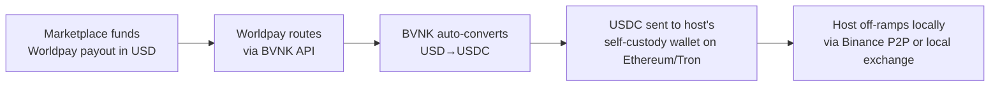
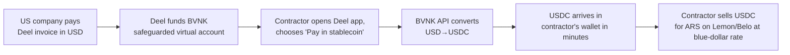
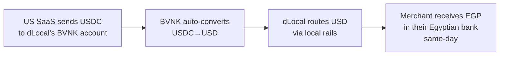
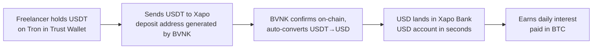
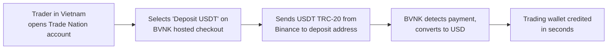

# BVNK Customer Use Cases — Concrete Mechanics & End-User Flows

*Research date: May 4, 2026*

**Context:** BVNK was acquired by Mastercard for up to **$1.8B** ($1.5B + $300M contingent) on **March 17, 2026**, after a failed $2B Coinbase deal that collapsed in November 2025. BVNK processed **~$30B in annualized stablecoin volume** in 2025 (~2.8M transactions), generated **~$40M revenue in 2024**, and added **226 new customers** in 2025 — bringing its base to roughly **375+ customers**. BVNK historically said **80% of its customers are payments companies** — FX brokers, PSPs, ecommerce gateways.

This report walks through each named customer with a concrete flow, then examines iGaming exposure, geography, deal sizes, and the comparison to Bridge.

---

## Part 1 — Named Customer Walkthroughs

### 1. Worldpay (FIS-spinout, then acquired by GTCR/Worldpay) — ✅ Confirmed flagship

**Product:** Worldpay is one of the world's three largest merchant acquirers. Processes ~$2.5T in annual card volume across 146 countries.

**Problem BVNK solves:** Worldpay's merchant clients (marketplaces, gaming platforms, travel companies) need to **pay out** to recipients in countries where SWIFT is slow, expensive, or unavailable — gig workers in Argentina, content creators in Nigeria, hotel suppliers in Vietnam. Card rails go in; nothing comes out fast.

**Integration:** Worldpay embeds **BVNK Embedded Wallets** into Worldpay's existing payouts platform. Worldpay continues handling client relationships, KYC, and fiat orchestration; BVNK handles wallet creation, blockchain settlement, USDC custody, and on/off-ramping. Worldpay's clients **never touch crypto** — they fund in USD/EUR, recipients receive USDC ([Worldpay PR](https://corporate.worldpay.com/news-releases/news-release-details/worldpay-enable-stablecoin-payouts-global-businesses), [PYMNTS](https://www.pymnts.com/cryptocurrency/2025/worldpay-teams-with-bvnk-to-offer-stablecoin-payouts/)).

**End-user flow** (e.g., Airbnb-style marketplace paying a host in Lebanon):

**Alternative before BVNK:** SWIFT wires (3–5 days, $20–40 fees, often blocked in restricted corridors) or local-rail aggregators like Thunes/Nium that depend on banking partners and don't reach all corridors.

**Money path:**
1. Marketplace's bank sends USD to Worldpay's payout account
2. Worldpay calls BVNK API with payout instruction (recipient address + amount)
3. BVNK debits the marketplace's BVNK virtual sub-account, converts to USDC at internal liquidity
4. BVNK broadcasts on-chain transfer; recipient gets USDC in seconds
5. Recipient cashes out via local OTC desk or holds

**Status:** Pilot launched H2 2025, covering **180+ markets**. Stablecoins are the **first non-fiat payout option** Worldpay has ever offered alongside its 135 fiat currencies.

---

### 2. Deel — ✅ Confirmed, longest-running flagship

**Product:** Deel is the largest global EOR (employer of record) and contractor payroll platform — pays ~750k workers in 150+ countries on behalf of 35,000+ companies.

**Problem BVNK solves:** Contractors in places like Argentina, Pakistan, the Philippines, Nigeria want USD they can spend. Local bank transfers of USD get inflation-eroded, blocked, or arrive after 3–5 day delays plus 5–8% FX haircuts.

**Integration:** Deel funds a **BVNK Virtual Account** in USD/EUR/GBP. Contractors using Deel HR portal pick "withdraw in stablecoin," paste their wallet address. Deel calls BVNK API → BVNK converts and sends USDC ([BVNK case study](https://bvnk.com/case-studies/deel-teams-up-with-bvnk)).

**End-user flow** (a developer in Buenos Aires being paid by a US Fortune 500):

**Alternative before BVNK:** Deel previously offered Wise, Payoneer, and local bank ACH. For Argentine contractors, the official-rate USD→ARS conversion meant losing ~50% of value vs. blue-market rate.

**Quoted result:** "Since launching with BVNK, we've seen more and more freelancers opting to be paid in stablecoins in more than 100 countries" ([BVNK](https://bvnk.com/case-studies/deel-teams-up-with-bvnk)). Launched Spring 2024.

**Important caveat:** 🟡 Deel **also** uses other rails — they are not BVNK-exclusive. Bridge, Stripe, and Felix Pago compete for the same workflows.

---

### 3. Visa Direct — ✅ Major partnership, January 2026

**Product:** Visa Direct is Visa's $1.7T real-time push-payment network connecting to ~9B endpoints (cards, accounts, wallets).

**Problem BVNK solves:** Visa Direct's enterprise clients (PSPs, marketplaces, remittance apps) want to fund payouts using stablecoins (avoiding pre-funding fiat in 100+ corridors), and want to **deliver** payouts in stablecoins where local banking is poor.

**Integration:** BVNK powers two flows on Visa Direct: (1) **stablecoin pre-funding** — Visa Direct enterprise clients deposit USDC instead of pre-funding fiat in each corridor, and (2) **stablecoin delivery** — recipients in select markets get USDC instead of card credits ([Coindesk](https://www.coindesk.com/business/2026/01/13/visa-teams-up-with-bvnk-to-launch-stablecoin-payouts), [BusinessWire](https://www.businesswire.com/news/home/20260114948268/en/BVNK-to-Deliver-Stablecoin-Infrastructure-for-Visa-Direct-Pilot-Programs)).

**Status:** Pilot with a "limited set of Visa Direct enterprise clients" — PSPs, marketplaces, platforms. Visa Ventures invested in BVNK in May 2025, foreshadowing this deal. Customers not publicly named.

---

### 4. dLocal — ✅ Confirmed, deeply integrated

**Product:** Public ($DLO) cross-border payments rails for emerging markets. ~$25B annual TPV across 40+ countries in LATAM, Africa, Asia.

**Problem BVNK solves:** dLocal had **trapped funds** problem — money sitting in local-currency accounts in Egypt, Nigeria, Argentina that couldn't be repatriated quickly to merchants. Also: merchants pre-funding payouts via SWIFT wires that took days.

**Integration:** Two-way swap. dLocal merchants now **fund cross-border payouts using USDC** instead of wires; in return, BVNK gets access to dLocal's fiat payout rails in 40+ emerging markets. Builds on a 2022 collaboration where dLocal first used stablecoins in treasury operations ([dLocal PR](https://www.dlocal.com/press-releases/dlocal-and-bvnk-partner-to-power-faster-global-payouts-with-stablecoins/), [BVNK blog](https://bvnk.com/blog/how-bvnk-and-dlocal-are-powering-faster-global-payments)).

**End-user flow** (a US SaaS company paying merchants in Egypt):

**Alternative before BVNK:** SWIFT wires from US → Egypt would route through 2–3 correspondent banks, take 3–5 days, lose ~3–5% in spreads. dLocal could process the local leg, but the US→dLocal funding leg was the bottleneck.

---

### 5. Xapo Bank (Xapo VASP) — ✅ Confirmed, $32M in 3 months

**Product:** Xapo is a fully-licensed Gibraltar bank serving 100+ countries — known for Bitcoin custody and USD savings accounts paying interest in BTC.

**Problem BVNK solves:** Xapo's members in Africa, Middle East, Asia want to **fund** their USD accounts but can't easily SWIFT in USD from local accounts. Stablecoins (USDC, USDT) are how they hold value locally — but turning that into a Xapo USD balance previously required selling on an exchange first.

**Integration:** Xapo VASP (the Virtual Assets Services Provider arm) takes stablecoin deposits via BVNK; BVNK sends USD to Xapo Bank's regulated environment; member sees USD in their account ([BVNK case study](https://bvnk.com/case-studies/xapo-bvnk-power-global-stablecoin-deposits)).

**End-user flow** (a freelancer in Lagos):

**Volumes:** **$32M in stablecoin deposits in first 3 months** post-launch (Aug 2025). Members in 100+ countries can now fund USD accounts in seconds vs. days. Xapo cited Q2 2025 stablecoin inflow surges of **40% in Middle East, 25% in Africa, 12% in APAC** ([BVNK blog](https://bvnk.com/blog/stablecoin-deposits-at-xapo-bank-powered-by-bvnk)).

---

### 6. Coinflow — ✅ Detailed case study with quoted volumes

**Product:** Coinflow (Series A $25M from Pantera, Coinbase Ventures, early 2025) lets merchants accept traditional payments and **settle in stablecoins in seconds**, not days. Started in crypto-native, expanding to mainstream.

**Problem BVNK solves:** Coinflow needed reliable USD↔USDC conversion at scale, multi-currency banking partnerships (EUR + USD), and the ability to settle merchants 24/7 — including weekends.

**Integration:** Coinflow uses BVNK's **orchestration + virtual accounts + global settlement network**. Coinflow's merchant takes a card payment → Coinflow's PSP rails settle to USD → BVNK auto-converts to USDC and sends to merchant wallet within seconds.

**Volumes:** Scaled to **$20M+/month within 3 months** of going live ([BVNK case study](https://bvnk.com/case-studies/powering-instant-stablecoin-settlements-at-scale-coinflow)).

**COO Jake Montgomery quotes:**
> "Our first fiat transfer landed in a few hours. We went from uncertainty to reliable, fast settlement that we could build our business on."
>
> "BVNK has the best support team on the entire planet that I've encountered."
>
> "The ability to have the power of stablecoins right there in the platform is a game changer for us. There's no need to bounce between different vendors."

This is the most detailed customer testimonial in BVNK's library — it reveals BVNK's competitive moat is *banking depth + ops* more than tech.

---

### 7. Trade Nation — ✅ CFD broker, named case study

**Product:** UK-headquartered CFD/FX broker offering retail and business trading in 1,000+ instruments.

**Problem BVNK solves:** Trade Nation's customers in **Asia** (Vietnam, Indonesia, Philippines) couldn't fund accounts via card — local card schemes blocked international forex transactions, or cards weren't valid for cross-border. Result: would-be customers couldn't onboard.

**Integration:** BVNK's API integrates with Trade Nation's hosted payments page enabling deposits/withdrawals in **14 digital currencies including USDT and BTC** ([BVNK case study](https://bvnk.com/case-studies/trade-nation)).

**End-user flow:**

**Headline result:** **56% of Trade Nation's deposit volumes in new markets are now paid in cryptocurrencies**. Average crypto deposit value is **10x larger than card payments** (per the broader CFD-broker pattern BVNK reports for Titan FX too — €5,000 average crypto deposit). BVNK also handles **under/over-payments without rejection**, saving Trade Nation's support team **12+ hours/month** ([BVNK](https://bvnk.com/case-studies/trade-nation)).

---

### 8. Titan FX — ✅ Forex broker, named case study

**Product:** International FX broker, Vanuatu-licensed, serving Asia/EMEA retail traders.

**Problem BVNK solves:** Same as Trade Nation — Asian retail trader card limitations + need to pay suppliers/affiliates in stablecoins.

**Integration:** BVNK API for both customer deposits (crypto payments gateway) and outbound payouts to suppliers/affiliates in EUR.

**Headline numbers:** **40% of Titan FX deposits are stablecoins**; average stablecoin deposit is **€5,000 — 10x card avg** ([BVNK](https://www.bvnk.com/case-studies/titan-fx-meets-demand-for-stablecoin-payments)).

---

### 9. Noda — ✅ Open-banking PSP, iGaming-adjacent

**Product:** Lithuanian open-banking PSP serving ecommerce, **iGaming**, travel, financial services. Lets merchants accept direct bank-account payments instead of cards.

**Problem BVNK solves:** Noda wanted to **settle merchants in stablecoins** for faster cross-border. Particularly relevant for iGaming clients who needed T+0 settlement and **off-ramp from EU bank-account collections into USDT for global treasury**.

**Integration:** Noda deployed BVNK's **Virtual Accounts + Global Settlement Network** to convert **€2M/month into USDT** for merchant payouts. **90% of Noda's stablecoin settlements run through BVNK** ([BVNK case study](https://bvnk.com/case-studies/noda), [Finextra](https://www.finextra.com/newsarticle/42946/open-banking-meets-stablecoins-with-noda-and-bvnk)).

**This is a key iGaming proxy:** Noda's largest vertical is iGaming. €2M/month into USDT explicitly for *merchant payouts* implies Noda's iGaming operator clients are receiving USDT settlements from Noda → which means BVNK indirectly powers iGaming operator revenue settlement.

---

### 10. Utoppia — ✅ Remote-worker fintech, named case study

**Product:** US-based fintech founded by Argentinian Stefano Angeli, gives Latin American/Indian remote workers a **US bank account** + ability to send USD globally.

**Problem BVNK solves:** Utoppia users get paid in USD by US employers, but want to **send stablecoins globally** to family, friends, or themselves on other wallets — without leaving Utoppia.

**Integration:** Utoppia user's USD balance can be sent as stablecoin via BVNK, which auto-converts USD→USDC and ships to any wallet ([BVNK case study](https://bvnk.com/case-studies/dollars-without-delays-bvnk-utoppia)).

**Result:** Utoppia projects **40%+ revenue growth** attributable in part to the BVNK integration.

---

### 11. Meow — ✅ AI/business banking neobank

**Product:** Business banking platform for global multi-entity startups (Cayman, BVI, Singapore, Panama, US). Notable: **AI agents can open Meow accounts and issue cards**. Backed by Tiger Global, QED, Lux Capital. Handles "billions in assets" ([Finextra](https://www.finextra.com/pressarticle/109523/meow-taps-bvnk-for-stablecoin-play)).

**Problem BVNK solves:** Meow's customers operate globally and need to settle in **multiple ways** — crypto, stablecoins, SWIFT — from one platform. Pre-BVNK, Meow had USDC on/off-ramps but no broader crypto, no SWIFT integration through this stack, no auto-conversion.

**Integration:** BVNK powers Meow's stablecoin + BTC + USDT support, plus **SWIFT access**. End user flow: Meow business customer can send invoice payment in USDC → recipient gets USD via SWIFT, or vice versa — all from one platform.

**Notable:** Meow is **also a Bridge customer** (Bridge powers some Meow flows per Routefusion comparison). 🟡 This is a rare case where a single customer uses both Bridge and BVNK, suggesting they are not strictly substitutes.

---

### 12. Bitso (Bitso Business) — ✅ LATAM-EU corridor

**Product:** Largest crypto exchange in Latin America (Mexico, Brazil, Argentina, Colombia). Bitso Business is the B2B arm.

**Problem BVNK solves:** Bitso's LATAM business clients want to send international payments to/from Europe **without needing an EU bank account**. Conversely, BVNK's European clients want LATAM payout rails.

**Integration:** Two-way. BVNK gives Bitso clients SEPA virtual accounts, real-time fiat→stablecoin conversion, and SEPA infrastructure. Bitso gives BVNK LATAM payout rails ([Fintech Times](https://thefintechtimes.com/bitso-business-and-bvnk-join-forces-to-simplify-international-money-movement-through-stablecoins/), [BVNK](https://fintechmagazine.com/news/how-bvnk-bitso-are-driving-global-stablecoin-expansion)). Announced Sept 2025.

---

### 13. LianLian Global — ✅ Chinese cross-border PSP

**Product:** Major Chinese cross-border payments firm serving Chinese exporters/marketplaces (think TaoBao sellers, Temu suppliers).

**Problem BVNK solves:** Chinese merchants selling globally need to **collect in stablecoins** (preferred by Western marketplace platforms), then settle in USD/RMB locally.

**Integration:** Merchants deposit USDC → BVNK auto-converts to USD → LianLian routes USD through its global network → merchant gets local currency. Cuts settlement from days to minutes across **100+ countries** ([Coindesk](https://www.coindesk.com/business/2025/06/04/stablecoin-connector-bvnk-partners-with-chinese-cross-border-payments-firm-lianlian)).

---

### 14. Equals Money × Railsr — ✅ B2B payments

**Product:** Equals Money (UK) merged with Railsr in 2025 to form a B2B expense management + corporate-card platform.

**Problem BVNK solves:** Equals' SMB customers wanted to **accept USDC** from international clients without holding crypto.

**Integration:** Customers accept USDC payments → routed through BVNK wallet → auto-converted to USD → arrives in 30 seconds ([Fintech Times](https://thefintechtimes.com/equals-money-and-bvnk-partnership-focuses-on-usdcs-role-as-the-global-b2b-payment-rail/)).

---

### 15. Volt — ✅ December 2025, real-time payments orchestration

**Product:** Volt is a real-time payments orchestration platform (open banking checkouts in 30+ countries).

**Problem BVNK solves:** Volt wanted to add **stablecoin pay-ins** to its checkout — particularly for "**digital goods and gaming companies**" with crypto-native users ([Volt PR](https://www.volt.io/newsroom/bvnk-partners-with-volt/)).

**Integration:** Phase 1 = stablecoin pay-ins at Volt-powered checkouts. Target merchants: cross-border ecommerce, trading apps, remittance providers, gaming, digital goods.

---

### 16. Paytently — ✅ iGaming-heavy PSP

**Product:** PSP serving ecommerce, fintech, and **iGaming** merchants.

**Problem BVNK solves:** Stablecoin settlement and **prefunding** of fiat payouts. Merchants can prefund payouts via stablecoins or receive settlement in stablecoins ([The Paypers](https://thepaypers.com/crypto-web3-and-cbdc/news/paytently-integrates-stablecoins-via-bvnk-for-cross-border-settlements)).

**Quote:** "A significant portion of Paytently's merchant base operates in sectors such as iGaming, fintech, and ecommerce" — confirming the iGaming pipe runs *through* PSPs like Paytently, not direct to operators.

---

### 17. Ferrari — 🟡 Confirmed but indirect

**Product:** The car company.

**Problem BVNK solves:** Crypto checkout for high-net-worth buyers in US, Europe.

**Integration:** Ferrari accepts crypto via Worldpay → Worldpay's stablecoin processing path includes BVNK ([Sacra/BVNK research](https://blockeden.xyz/blog/2025/05/18/bvnk/)). So Ferrari is a **Worldpay-of-Worldpay** customer rather than a direct BVNK contract. **40% of Ferrari's crypto-paying customers are entirely new to Ferrari** — a notable conversion stat.

---

### 18. Rapyd — ✅ Long-time customer

**Product:** $9B-valued global payments network (cards, bank transfers, ewallets across 100+ countries).

**Problem BVNK solves:** Settle merchants instantly across emerging markets where SWIFT takes 3–5 days.

**Integration:** Rapyd funds BVNK account in USD → BVNK converts to stablecoins → executes merchant payouts. Phase 2 plan: embed BVNK directly into Rapyd platform. Result: **$150M in near-instant stablecoin payouts to merchants across Africa, Eastern Europe, Middle East**, reducing settlement from 3–5 days to near instant ([BVNK Series B blog](https://bvnk.com/blog/series-b-fuel-next-era-of-stablecoin-payments)).

---

### 19. Flywire — ✅ Public ($FLYW), education/healthcare payments

**Product:** Cross-border payments for education tuition, healthcare, B2B. ~$25B annual volume.

**Problem BVNK solves:** Faster international tuition payments. International students paying US/UK universities — currently 5-day SWIFT process. Stablecoins enable T+0.

**Integration:** Listed as a confirmed BVNK customer in BVNK's 2025 retro and Mastercard acquisition press materials ([BVNK blog](https://bvnk.com/blog/stablecoins-core-financial-infrastructure-2025), [Mastercard PR](https://www.mastercard.com/us/en/news-and-trends/press/2026/march/Mastercard-to-acquire-BVNK-to-connect-on-chain-payments-and-fiat-rails.html)). Specific flow not publicly disclosed; likely treasury / merchant pre-funding rather than retail student-facing.

---

### 20. IC Markets, Thunes — 🟡 Confirmed customers, no detailed flows

Both confirmed in BVNK's customer list but no detailed public case study. **IC Markets** is a major Australian-licensed FX broker — likely same pattern as Trade Nation/Titan FX (Asian crypto deposits). **Thunes** is a Singaporean B2B cross-border network (~$50B TPV) — likely same pattern as Rapyd (stablecoin pre-funding into Thunes' fiat rails).

---

### 21. Talos — ✅ Infrastructure, not a payments customer

**Product:** Institutional crypto trading tech (think Bloomberg Terminal for digital assets).

**Relationship:** Inverted — BVNK is **Talos's customer** for liquidity aggregation. Talos lets BVNK aggregate prices from multiple market makers, integrate new LPs faster, and manage risk. Result: nearly **2x increase in trading volumes** for BVNK's stablecoin operations ([Talos](https://www.talos.com/insights/bvnk-supports-stablecoin-payments-with-talos-trading-technology-and-connectivity)).

---

### 22. Customers ruled out / no evidence found — 🔴

- **Skrill / Neteller / Paysafe** — No public BVNK partnership. Paysafe rolled their own crypto stack via BitPay for US gaming.
- **ClearJunction, iFAST, Dukascopy** — No evidence of BVNK relationships found.
- **Stake.com, Sportsbet.io, BetUS, Bet365, 1xBet** — **No direct evidence** of BVNK contracts. Stake/Sportsbet are crypto-native and run their own rails. BVNK's iGaming exposure is **via PSPs (Paytently, Noda)** not direct operators.
- **Yellow Card** — Separate company, both Visa-backed but no BVNK relationship.

---

## Part 2 — The iGaming Angle

**Why BVNK is iGaming-strong:** BVNK's roots include co-founder Jesse Hemson-Struthers' prior gaming-tech exit (sold to Sportradar). Their early product-market fit was crypto/iGaming/forex — high-risk verticals that mainstream banks won't touch. BVNK's old marketing materials list iGaming as a featured vertical ([AffCatalog](https://affcatalog.com/en/psp/bvnk/), [Stablecoin Insider](https://stablecoininsider.com/bvnk-complete-review/)).

**What iGaming needs from a stablecoin rail:**
1. **T+0 settlement** to operator (cash flow in a high-volatility vertical)
2. **Cross-border payouts to winners** without SWIFT delays
3. **Bank-account-agnostic** (iGaming operators frequently have banks de-risk them)
4. **Affiliate/influencer payouts globally** (gaming spend on affiliate marketing is huge)
5. **Compliance-ready** because regulators are tightening AML rules

**Named iGaming-adjacent BVNK customers:**
- **Paytently** — explicitly iGaming-heavy PSP
- **Noda** — €2M/month USDT settlement, iGaming is largest vertical
- **Volt** — explicitly targets gaming/digital goods in BVNK partnership
- **Worldpay** — gaming is one of three explicit verticals in BVNK partnership messaging

**Direct iGaming operators using BVNK?** No publicly named ones. The pattern is: **BVNK powers the PSPs/acquirers; the PSPs/acquirers serve the iGaming operators.** This is intentional — BVNK avoids the headline risk of being known as "the gambling stablecoin company."

**Reputational/regulatory risk:** ⚠️ Mixed Trustpilot reviews mention "blocked funds when attempting to deposit to a forex broker." The high-risk vertical exposure has cost some retail end-user trust. However: BVNK secured **MFSA CASP license in Malta**, **SOC 2 Type II**, **ISO 27001**, and is a **registered MSB with FinCEN** — the compliance posture is strong.

**Volume share?** Not publicly disclosed. But: if **80% of BVNK's customers are payments companies** (Sifted, 2022) and the largest of those — Paytently, Noda, Worldpay, dLocal — all serve iGaming as a meaningful vertical, the inferred iGaming-flowing share of BVNK's $30B is likely **20–35%**, though this is an inference, not a disclosure.

---

## Part 3 — Geographic Concentration

**Headquarters:** London + San Francisco co-HQ. **Largest engineering office: Cape Town** (~70 staff vs. London's ~40). South African origin via co-founders' prior Coindirect exit.

**Geographic distribution of named customers:**

| Region | Customers |
|---|---|
| UK/EU | Noda, Equals Money, Volt, Paytently, Trade Nation, Worldpay (UK ops), Flywire (US/global) |
| US | Coinflow, Meow, Utoppia, Worldpay (US ops), Visa Direct |
| LATAM | dLocal (Uruguay), Bitso (Mexico), Utoppia (Argentine founder) |
| Asia-Pac | LianLian (China), IC Markets (Australia), Titan FX (Vanuatu/Asia retail), Thunes (Singapore) |
| Crypto-native | Xapo Bank (Gibraltar) |

**Verdict:** Genuinely global — but heavy in **UK/EU PSPs**. The US push is recent (2024–2025); BVNK only gained 50-state coverage in 2025 via own licenses + Paxos partnership. **LATAM exposure is real but indirect** (via dLocal/Bitso, not direct corridor businesses like Felix Pago which uses Bridge).

---

## Part 4 — Average Deal Size / Customer Profile

**No leaked ACV figure.** Can be inferred:

- **Revenue:** ~$40M in 2024 (Sacra estimate / [Fortune](https://fortune.com/2026/03/17/mastercard-bvnk-acquisition-stablecoins-1-8-billion/))
- **Customers:** ~150 in 2022 → ~375 in 2025 (after +226 net new) → call it ~250 average for 2024
- **Implied ACV:** ~$160K–$200K average

**But the distribution is bimodal:**
- A handful of **whales** doing $10M+/year in BVNK fees (Worldpay, Visa Direct, dLocal, Deel-scale)
- A long tail of **forex/crypto/PSP shops** doing $20K–$200K/year

Pricing model: BVNK takes basis-point spreads on conversion + some flat platform fees. **Layer1 is a quarterly subscription + bps fees** — this is the enterprise SKU for banks/large fintechs that want self-custody.

**Customer profile:** **80% payments companies** (Sifted) — FX brokers, PSPs, ecommerce gateways. The other 20% is a mix of marketplaces, fintech wallets/neobanks, and treasury/crypto-native players.

---

## Part 5 — Customer Churn / Failures

**No publicly known major customer departures or regulatory actions against BVNK customers.** Trustpilot and forum complaints exist around:
- Held funds during AML reviews ("Held" status pending RFI)
- Onboarding rejections after compliance review
- Issues funding accounts via wire (one user complaint)

Some forex broker end-users complained on Trustpilot about deposits going missing — these are downstream-of-BVNK issues, not BVNK-direct churn signals.

**Regulatory:** BVNK has *added* licenses (Malta MFSA CASP, US state-by-state MSB, EMI passporting) and not had any publicly disclosed enforcement actions.

**The biggest "failure":** the **collapsed Coinbase $2B deal in November 2025**. Reasons not officially disclosed; speculation centers on regulatory pressure, valuation gap, due diligence findings, or Coinbase strategic reprioritization. Worth noting Mastercard then closed at $1.8B four months later — implying BVNK valuation held but deal terms shifted.

---

## Part 6 — Comparison vs Bridge Customers

**Bridge's named customer roster** (Stripe-acquired, $1.1B) reads like a who's-who of crypto-native + tech: SpaceX, Coinbase, Phantom, MetaMask, Hyperliquid, Sui, Stripe-internal, Felix Pago, ARQ, Cenoa, Airtm, Slash, Dakota, DoorDash, Payoneer.

**BVNK's roster** reads completely different: Worldpay, Visa Direct, Deel, dLocal, Flywire, Rapyd, Thunes, LianLian, Bitso, Equals Money, Xapo Bank, Paytently, Noda, Coinflow, Trade Nation, Titan FX, IC Markets, Volt, Meow, Utoppia.

**The pattern is stark:**

| Bridge | BVNK |
|---|---|
| Crypto-native infrastructure (Phantom, MetaMask, Sui, Coinbase) | Traditional payments (Worldpay, Visa, dLocal) |
| Tech-forward fintechs (DoorDash, Slash, Dakota) | FX/CFD brokers (Trade Nation, Titan FX, IC Markets) |
| Latin America remittance (Felix Pago, Cenoa, Airtm, ARQ) | LATAM PSP partnerships (dLocal, Bitso) — not direct |
| 2-4 week integration time | 2-6 month enterprise sales cycle |
| Stripe-quality APIs, modular SDKs | Compliance-heavy, regulated EMI/CASP wrappers |

**Why BVNK's roster is "less famous":**
1. **Enterprise B2B = quieter.** Worldpay, Visa, dLocal don't tweet about their stablecoin vendor.
2. **iGaming/FX is reputationally inconvenient.** BVNK doesn't trumpet customers in these verticals.
3. **PSP-of-PSP positioning.** BVNK powers PSPs, who power merchants — two layers down from end-user-visible brand recognition.
4. **South African / European origin.** Less crypto-Twitter mindshare than SF-based Bridge.

It is **not because BVNK is smaller** — BVNK processes ~$30B annualized, vs. Bridge's reported ~$5B at acquisition. **BVNK is bigger; just less visible.**

---

## Part 7 — Engineering Blogs / Dev Write-ups

**Dry well.** Unlike Stripe customers (who frequently blog integration writeups) or Bridge customers (Felix Pago has detailed technical blog posts), BVNK customers do not publish engineering blogs about their integration. The closest material:

- **Coinflow's COO testimonial** (quoted above) is the most candid customer voice — calls out reliability + support.
- **Noda's COO** quoted re: "API technology and easy-to-use product interface."
- **BVNK's own docs** mention "**2–8 weeks**" typical integration time after compliance onboarding.
- **Routefusion comparison** says BVNK is **"2-6 months due to custom integration requirements and enterprise sales cycles"** — vs. Bridge 2-4 weeks.

No timelines like "we integrated BVNK in 3 weeks." No specific dollar figures in customer-published material beyond the BVNK case study quotes.

**This is itself a finding:** BVNK's customers are **not developer-led.** They're CFO/COO-led at PSPs and brokers. There's no developer evangelism layer, which is a real product/marketing gap vs. Bridge.

---

## Synthesis — What This Tells Us

1. **BVNK's actual GTM is "PSP/acquirer arms dealer."** They sell to companies that themselves have customers — Worldpay, dLocal, Rapyd, LianLian, Bitso, Volt, Paytently, Noda, Equals. This is a **sustainable distribution moat** because each of those PSPs serves thousands of merchants — but it makes BVNK invisible to end users.

2. **iGaming is real but structurally hidden.** BVNK doesn't sign Stake or Bet365 directly. It signs Paytently and Noda, which serve those operators. This is a **deliberate reputational firewall**.

3. **Forex/CFD brokers are an underrated vertical.** Trade Nation (56% crypto deposits in new markets) and Titan FX (40% deposits, €5K avg = 10x card) are doing real volume. **This vertical is BVNK's secret weapon** — high ACV, sticky, and underserved by Bridge/Zero Hash.

4. **The $32M-in-3-months Xapo number is the most impressive disclosed customer metric.** It's a clean read on demand for "stablecoin → bank account" flow in the Global South.

5. **The Mastercard acquisition rationale is now obvious from the customer list.** Mastercard buys: (a) the Worldpay relationship (fellow incumbent), (b) the Visa Direct competitive pressure neutralization, (c) FX broker exposure, (d) PSP arms-dealer position globally. Mastercard does **not** buy crypto-native cool factor — that's Bridge's job at Stripe.

6. **The biggest gap in the public record:** Layer1 deployments (BVNK's self-hosted enterprise SKU) have **zero named customers**. The "multinational bank running stablecoin rails internally" reference appears generic. This is where to look next — Layer1 customers are likely the most strategically valuable but are operating under NDA.
