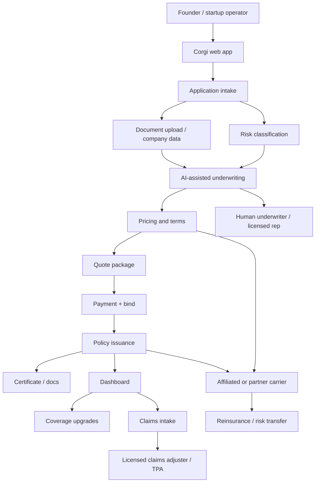

# Corgi - Architecture

Date: 2026-05-08

This is an inferred architecture from Corgi's public product pages, customer case studies, disclaimers, producer license page, YC profile, press releases, and ETF filings. Exact internal systems are not public.

## One-frame architecture

## Product surfaces

Public user surfaces:

- Marketing site.
- Quote/application flow at `app.corgi.insure`.
- Login/dashboard.
- Demo/advisor flow.
- Customer Slack channel for high-touch support, based on case studies.
- Claims support line/process.

Back-office surfaces inferred:

- Underwriting console.
- Policy admin system.
- Claims admin system.
- Producer licensing/compliance system.
- Carrier/risk pool reporting.
- Document generation.
- Payment processing.
- Customer success workflow.
- AI evaluation/monitoring for automated decisions.

## Data entering the system

Corgi's homepage intake asks for:

- Revenue in last 12 months.
- Projected revenue next 12 months.
- Financial statements if available.
- Funding raised.
- Funding date.

Insurance applications likely also collect:

- Company legal name/address.
- Industry/category.
- Number of employees.
- Funding stage.
- Customer/enterprise contract requirements.
- Prior claims.
- Existing insurance.
- Security/compliance posture.
- Data handling and AI/product risk.
- Board/investor details for D&O.

Source: [homepage application preview](https://www.corgi.insure/).

## AI system surfaces

Corgi says AI/ML/automated tools are used in:

- Marketing.
- Quoting.
- Underwriting.
- Pricing.
- Policy issuance.
- Claims processing.
- Fraud detection.
- Customer service.

The likely technical stack:

1. Structured intake and enrichment.
2. Classification of company stage/industry/risk.
3. Coverage recommendation.
4. Eligibility screening.
5. Pricing/rating assistance.
6. Policy form/endorsement selection.
7. Document generation.
8. Claims triage.
9. Fraud/anomaly detection.
10. Human review queues for material decisions.

Source: [Disclaimers & Licensing](https://www.corgi.insure/disclaimers).

## Underwriting model

Corgi's public promise is fast underwriting for common startup coverages. The likely model is not a frontier LLM alone. It is probably a rules + actuarial + ML + human-review stack:

- Rule gates: jurisdiction, eligibility, excluded industries, limits, prior claims.
- Rating factors: revenue, funding stage, headcount, industry, data sensitivity, enterprise/customer requirements.
- Policy packages: stage-based bundles.
- AI assistance: extract/normalize application data, classify risk, recommend coverage/limits, flag anomalies.
- Human underwriter: review uncertain or high-risk cases.
- Carrier authority: affiliated/partner carrier accepts final policy terms.

## Policy issuance

For simple cases:

1. Applicant submits application.
2. System generates quote.
3. Applicant pays.
4. Coverage is bound/issued if underwriting approval is satisfied.
5. Documents/certificates are delivered.

For complex/specialized lines:

1. Application enters human/advisor flow.
2. Corgi underwriter or licensed representative reviews.
3. Carrier/partner approval may be needed.
4. Turnaround can be 1-14 days for specialized coverages.

Source: [homepage](https://www.corgi.insure/).

## Claims architecture

Public disclaimers say claims on policies underwritten by Corgi-affiliated carriers may be administered by affiliated claims operations, and claims may also be administered by third-party claims administrators or adjusters. Corgi's FAQ says the customer gets a direct line to the Corgi claims team, which handles documentation, coordinates with legal teams, and provides updates.

Likely flow:

1. Customer reports incident.
2. Corgi collects first notice of loss.
3. System classifies policy/coverage/urgency.
4. Claims adjuster or TPA reviews.
5. Carrier makes coverage determination.
6. Customer receives updates and payment/denial/resolution.

Sources: [FAQ](https://www.corgi.insure/), [Disclaimers & Licensing](https://www.corgi.insure/disclaimers).

## Legal/risk-bearing architecture

Corgi's group structure appears to have:

- Producer entities: distribute insurance and hold state producer licenses.
- Program administrator: Corgi Insurance Services, Inc.
- Affiliated carriers: Corgi says it owns/controls risk-bearing insurance entities.
- Third-party carrier partners: may underwrite depending on product/jurisdiction/risk.
- Risk retention group: TRRG appears in site footers.
- Claims administration: affiliated or third-party operations.
- Reinsurance: disclosed as possible for Corgi-affiliated carriers.

This is full-stack relative to a broker, but still partner/regulation-structured in the normal insurance way.

## ETF architecture

Corgi Strategies, LLC is the SEC-registered investment adviser for Corgi ETF Trust I. SEC filings name:

- Adviser: Corgi Strategies, LLC.
- Sub-adviser: Tuttle Capital Management, LLC.
- Distributor: Paralel Distributors LLC.
- Administrator/fund accountant/transfer agent: U.S. Bank Global Fund Services.
- Custodian: U.S. Bank National Association.

This ETF infrastructure is separate from startup insurance, but it reinforces that Corgi is pursuing broader financial products.

Source: [SEC filing](https://www.sec.gov/Archives/edgar/data/2078265/000207826525000011/corgietftrustin1a.htm).

## What is not public

- Model vendors.
- Data vendors.
- Actuarial methodology.
- Loss ratio.
- Reinsurance treaties.
- Carrier capital structure.
- Exact claim automation rate.
- Human review thresholds.
- API/internal service architecture.
- Dashboard details after login.
- Payment processor.

## Technical lesson

Corgi's architecture is not "AI chatbot for insurance." It is a vertical operating system:

- Intake.
- Risk model.
- Quote.
- Bind.
- Policy admin.
- Claims.
- Compliance.
- Human review.
- Carrier/reinsurance structure.

For our AI finance product thinking, this is the important pattern: AI becomes valuable when it sits inside a complete workflow with authority to produce a real business outcome.
