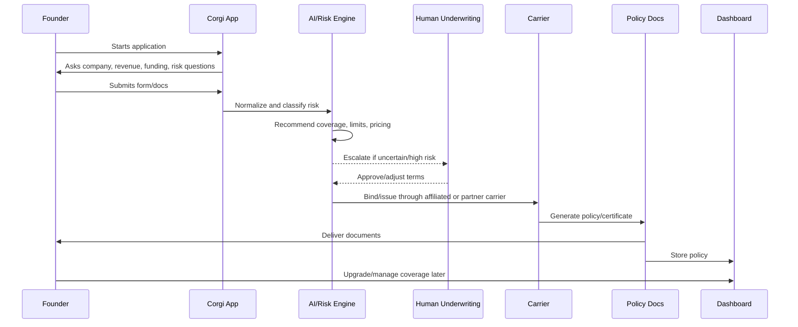

# Corgi - Product Flow

Date: 2026-05-08

## Primary product flow

## 1. User starts here

The user starts on the Corgi website or through YC/founder referral/customer requirement. They click "Get insured" or book a demo.

## 2. Data enters here

The application collects financial and company details:

- Revenue last 12 months.
- Projected revenue.
- Financial statements if available.
- Funding raised.
- Funding date.
- Company/business risk info.
- Coverage needs.

## 3. System transforms it here

Corgi converts messy founder input into underwriting-ready structured data:

- Stage: pre-seed, seed, Series A, growth.
- Industry: SaaS, AI, fintech, marketplace, health-tech, etc.
- Coverage bundle: CGL, D&O, Tech E&O, Cyber, Media, EPLI, Fiduciary, etc.
- Risk flags: sensitive data, regulated industry, hardware, enterprise contracts, prior claims.
- Pricing/rating factors.

## 4. External tools/partners/rails are called here

Likely external/internal rails:

- Payment processor for premium.
- Carrier policy admin system.
- Document generation/e-sign/binder workflow.
- Producer license/compliance checks.
- Claims admin/TPA if needed.
- Reinsurance/risk reporting.
- Customer communication tools like Slack, based on case studies.

## 5. Money/data/state changes here

- Quote becomes bound policy after payment and approval.
- Premium obligation is created.
- Policy and certificate are issued.
- Carrier takes legal risk under the policy.
- Corgi records policy/customer state in dashboard.

## 6. User sees output here

The user receives:

- Quote.
- Invoice/payment flow.
- Policy documents.
- Certificate of insurance.
- Dashboard access.
- Support/advisor channel.

## 7. Failure cases

- Applicant is not eligible.
- Coverage unavailable in jurisdiction.
- Requested limits too high.
- Industry/risk outside appetite.
- Documents insufficient.
- Payment fails.
- Human underwriter review required.
- Partner carrier declines.
- Coverage takes 1-14 days for specialized lines.

## 8. Human handoffs

Human handoff happens when:

- Customer wants advice.
- Risk is complex.
- Enterprise requirement has custom wording.
- Specialized coverage is requested.
- Claim is filed.
- Coverage/claim decision is material and requires licensed oversight.

## 9. Claim flow

1. Customer reports issue.
2. Corgi collects facts/documents.
3. Claim is mapped to policy.
4. Adjuster/TPA reviews.
5. Carrier determines coverage.
6. Defense/settlement/payment/denial process proceeds.
7. Customer receives updates.

## 10. Upgrade flow

1. Startup raises a round, hires employees, signs bigger customer, or adds office.
2. User opens dashboard or contacts Corgi.
3. Corgi recommends additional coverage.
4. User approves premium/change.
5. Endorsements or new policies are issued.
