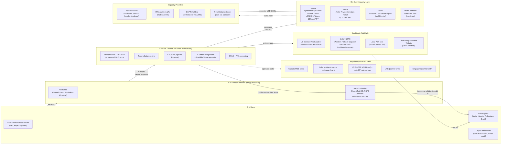
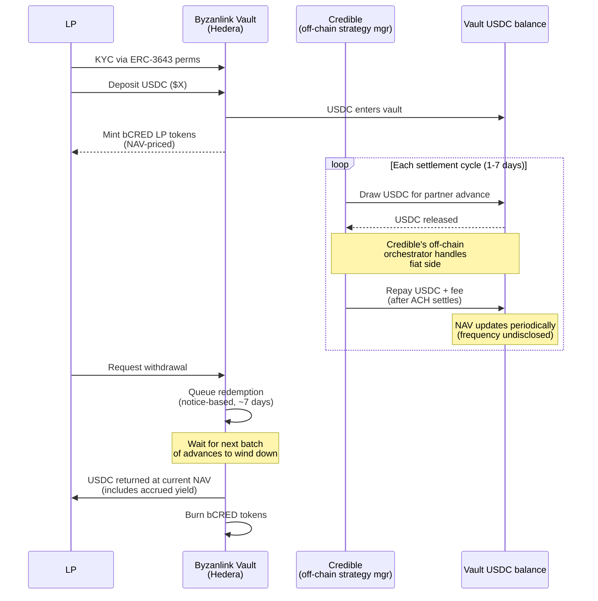
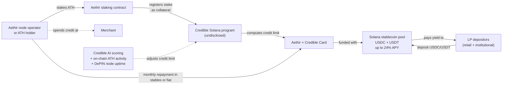
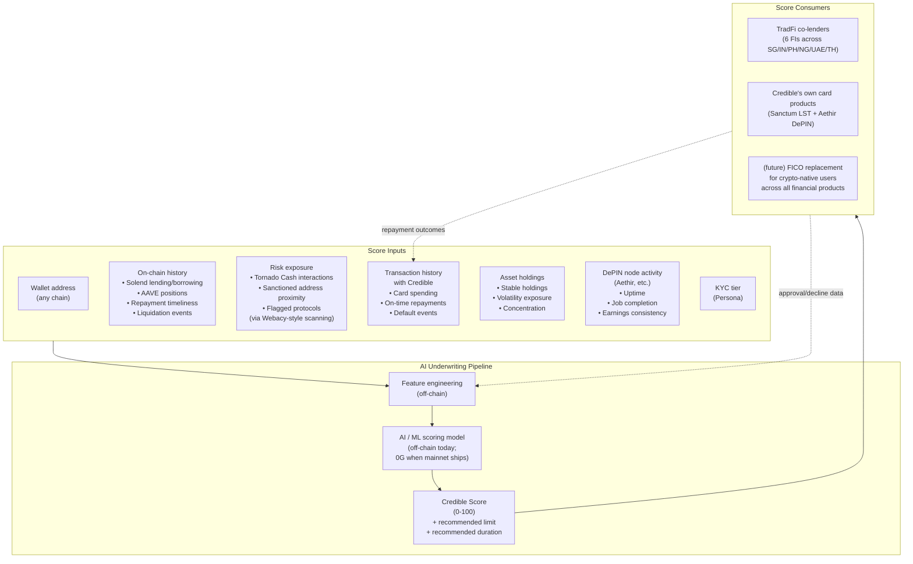
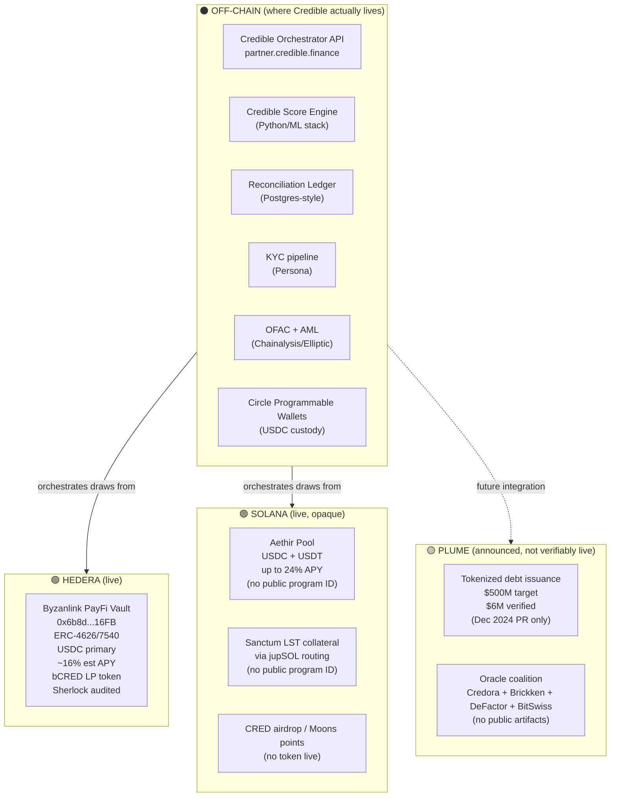
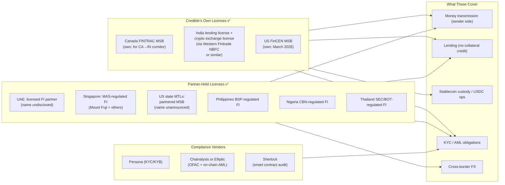
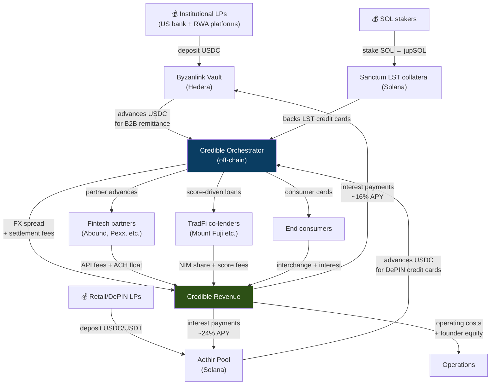

# Credible Finance — Complete Architecture

> The full flow of the company — actors, money, data, on-chain vs off-chain boundaries, all six product flows. Synthesized from [`./deep_dive.md`](./deep_dive.md), [`./how_to_build.md`](./how_to_build.md), [`./liquidity_architecture.md`](./liquidity_architecture.md), and four founder transcripts.
> **Date:** 2026-05-01

> ⚠️ **Partner-table correction (2026-05-03):** Subsequent operational research in [`./operational_partnerships.md`](./operational_partnerships.md) corrects the partner layer in this file:
> - The "Indian NBFC (Western Fintrade-adjacent; UPI/IMPS via Cashfree/Razorpay)" line should read **"Loap (named India NBFI partner) → likely Cashfree/Razorpay underneath"**. Credible doesn't own the PSP relationship; Loap does.
> - Add **Chorus Finance** as the named Africa NBFI partner ($15M deployed)
> - **Pexx is more accurately a "credit-line consumer of Credible USDC"** — Pexx owns its own settlement rail with Fireblocks custody + Ripple blockchain payments. Pexx is not a Credible-controlled integration
> - The US MSB partner is most likely **Brale** (not yet announced)
> - **Abound is NOT a verifiably live Credible partner** — their legal docs name Mudrex+Layer2+Bridge, not Credible
> - Total verifiable on-chain TVL is **$1.12M** (Hedera vault), not the multi-million implied by the marketing

---

## How to read this document

**Confidence labels** appear next to claims:
- ✅ **Verified** — confirmed by founder transcript, Byzanlink page, on-chain data, or named press release
- 🟡 **Inferred** — reasonable architectural inference but not directly stated
- 🔴 **Claim-only** — Credible-side marketing claim with no third-party verification

Each section has a **Mermaid diagram** (renders in GitHub / VS Code / Obsidian) plus a prose breakdown. If a diagram doesn't render in your viewer, the prose carries the meaning.

---

## 1. High-level system map



### What's actually happening at the system level

✅ **Credible is an off-chain orchestrator that sits between three groups it does not own:** end-users (whose money it never directly holds), regulated TradFi partners (who hold the legal obligations of credit issuance and money transmission), and on-chain liquidity providers (who supply USDC/SOL in exchange for yield).

✅ **The "Credible product" is therefore three things stitched together:**
1. **A REST API + partner dashboard** for fintechs to request payouts / advances
2. **A multi-chain liquidity layer** that pools USDC/USDT/SOL from LPs to fund those advances
3. **A credit-scoring service ("Credible Score")** that bridges on-chain reputation into TradFi credit underwriting

🟡 **The off-chain orchestrator is the moat.** Anyone can deploy a Byzanlink vault. Almost nobody can simultaneously hold (a) a Canadian MSB, (b) an Indian lending license, (c) a US MSB partnership, (d) relationships with 6+ TradFi co-lenders across 5 corridors, AND (e) a working partner-portal with reconciliation + KYC + AI underwriting.

---

## 2. Core actors & their roles

| Actor | What they do | What they hold | What they get | Confidence |
|---|---|---|---|---|
| **End sender** | Initiates a transfer (e.g., NRI in US sends home) | Source bank account, KYC | T+0 settlement, ~4–5% better FX than Wise/Remitly | ✅ |
| **End recipient** | Receives stablecoin-rail-funded fiat in local currency | Destination account / wallet | Local currency at favorable rate | ✅ |
| **Fintech partner** (Abound, Pexx, etc.) | Customer-facing UX; integrates Credible's API; is the lender/MSB of record on the user side | Their own license stack + customer relationships | Eliminated pre-funding (their working capital is freed) | ✅ |
| **TradFi co-lender** (Mount Fuji SG, NBFC partners) | Issues no-collateral credit to local borrowers using Credible Score | Local lending license + enforcement powers | Net interest margin + access to Credible's borrower flow | ✅ |
| **Credible Finance** | Orchestrates payments, runs underwriting model, generates Credible Score, manages LP relationships | Multi-jurisdiction license stack, AI underwriting model, partner relationships, brand | Payment fees + FX spread + NIM share + (future) score-licensing fees | ✅ |
| **Byzanlink** | Hosts the ERC-4626/7540 vault on Hedera | Vault smart contract, Sherlock audits, ERC-3643 KYC plumbing | Protocol fee (currently waived) | ✅ |
| **Sanctum** | Provides Solana LST routing (jupSOL etc.) for staking-backed credit cards | LST aggregation infrastructure | Volume / ecosystem benefit; integration is single-point | ✅ |
| **Aethir** | DePIN GPU network whose ATH token backs a Credible-issued credit card | ATH token economy + DePIN node operators | Increased ATH utility + fee share (claimed) | ✅ |
| **Plume** | RWAfi L1; future home of tokenized debt issuance | Plume chain + Nest vault | $500M PayFi target (Dec 2024 PR) | 🔴 |
| **LPs (institutional)** | Deposit USDC for yield | bCRED LP tokens (Hedera) | ~16% est APY | ✅ |
| **LPs (retail-via-Aethir)** | Deposit USDC/USDT in the Aethir-tied pool | LP receipt | up to 24% APY | ✅ |
| **LST stakers (via Sanctum)** | Stake SOL → Credible buys jupSOL → uses as collateral | Their own LST + a Credible credit card | Credit limit + keep all staking yield | ✅ |
| **Circle** | USDC custody via Programmable Wallets | USDC programmable-wallet infra | Float on idle USDC + Circle Alliance promotion | ✅ |
| **Persona** | KYC/KYB | KYC infra (vendor) | Per-verification fee | 🟡 |
| **Chainalysis/Elliptic** | OFAC + on-chain AML screening | Sanctions lists + chain analytics | Per-screen fee | 🟡 |

---

## 3. The six principal flows

Six distinct flows, mapped one at a time. Each has a sequence diagram + prose.

---

### 3.1 Flow A — B2B remittance (the core business)

**Scenario:** A US-based fintech partner (e.g., a NRI-targeted neobank) wants to pay out $1,000 to a recipient in India. The user expects the recipient to get the money instantly (T+0). The fintech does not have to pre-fund an Indian Nostro account.

```mermaid
sequenceDiagram
    participant Sender as US Sender (end user)
    participant Fintech as Fintech Partner<br/>(neobank)
    participant Credible as Credible API<br/>(off-chain)
    participant Vault as Byzanlink/Hedera Vault<br/>(USDC liquidity pool)
    participant USRail as US ACH<br/>(via partner MSB)
    participant INNbfc as India NBFC partner<br/>(UPI/IMPS via aggregator)
    participant Recipient as India Recipient

    Sender->>Fintech: $1,000 transfer request<br/>(via fintech app)
    Fintech->>Credible: POST /payouts<br/>{amount, recipient, KYC}
    Credible->>Credible: 1. Risk score the partner+txn<br/>(AI underwriting)
    Credible->>Credible: 2. OFAC + AML screen<br/>(recipient + partner)
    alt Approved
        Credible->>Vault: Draw USDC liquidity<br/>($1,000 worth)
        Vault-->>Credible: USDC released to corridor wallet
        Credible->>INNbfc: Trigger INR payout to recipient<br/>at 90 INR/USD<br/>(better than Wise's 85)
        INNbfc->>Recipient: ₹90,000 via UPI/IMPS<br/>(under 1 minute)
        Note over Sender,Fintech: Sender's ACH still in-flight
        Sender->>USRail: ACH debit ($1,000) initiated
        USRail-->>Credible: ACH settles T+2 to T+3<br/>($1,000 USD)
        Credible->>Vault: Refill credit pool with USDC<br/>(after on-ramp)
        Note right of Vault: Credit pool back to full;<br/>LP yield accrues from fees
    else Rejected
        Credible-->>Fintech: 402 Payment Required<br/>{reason: KYC fail / OFAC hit / partner over limit}
    end
```

**What's actually paying for this:**
- **FX spread** — Credible pays Indian counterparty at wholesale rate (~88–89 INR), charges fintech / end-user at retail-favorable (90 INR), pockets ~0.5–1% spread. ✅ founder-disclosed via Sanctum + OnePiece transcripts.
- **Settlement fee** — small per-transaction fee on top.
- **Net interest** — between when Credible advances USDC (T+0) and when ACH settles (T+2–T+3), Credible is short USDC for 2–3 days; charges fintech a per-day rate that funds the LP yield.

**Risk engineering:**
- ✅ Duration is **3–5 days max** — founder explicitly iterated down from 30–90 days. Short duration on observable ACH-settlement risk is structurally low-risk.
- ✅ "Zero defaults in 11 months on $60M+ credit" (founder-claim).
- ✅ Throttle mechanism: Credible can slow corridor-specific settlement speed if defaults rise (per gitbook).

🟡 **Untested in our research:** what happens when ACH actually fails (NSF, bank hold, fraud reversal). The compliance/dispute mechanism for ACH-revert-after-payout-already-sent isn't in any public source.

---

### 3.2 Flow B — LP capital lifecycle (Hedera / Byzanlink)

**Scenario:** An institutional LP (or qualified retail in non-US jurisdictions) deposits USDC and earns yield from the credit pool's transaction fees.



**Vault parameters (✅ from Byzanlink page):**
- Standard: ERC-4626 (sync) + ERC-7540 (async)
- Pricing: NAV-based, periodic updates
- Audits: Sherlock — Nov 2025 + Jan 2026 (private contests, reports not public)
- Lockup: none disclosed
- Withdrawal: ~7-day notice settlement
- Capital guarantees: **none**
- APY: **estimated, not fixed** (despite founder's "16% fixed" claim — flagged contradiction)

**Yield mechanics (🟡 inferred):**
The 16% must mathematically be funded by transaction fees + NIM, not subsidies. Approximate model:
- $5M LP capital × 16% APY = $800K/year in interest payments owed
- At 5-day average duration, $5M turns over ~73x/year = $365M annualized payment volume capacity
- Credible takes ~40bps (combined fee + spread) on payment volume → $1.46M/year gross
- After Credible's ~50% take → $700–800K/year to LPs ✓

**The math works only if utilization stays high.** Idle USDC pays no yield. If volume drops, the "Est. APY" headline drops mechanically.

🔴 **First-loss tranche / insurance fund — explicitly NOT mentioned anywhere in the docs.** If a partner defaults, LPs are exposed. The "zero defaults" claim is currently doing the work that an explicit insurance fund would normally do.

---

### 3.3 Flow C — Co-lending no-collateral credit issuance

**This is the flow where Credible Score actually monetizes.** The end-borrower wants a no-collateral USD/INR/PHP credit line. Credible doesn't issue it — a regulated local FI does, using the Credible Score as the underwriting signal.

```mermaid
sequenceDiagram
    participant Borrower as End Borrower<br/>(crypto-native, no FICO)
    participant CredApp as Credible mobile app
    participant Score as Credible Score Engine<br/>(off-chain AI)
    participant Chains as On-chain data sources<br/>(Solend, Webacy, etc.)
    participant LocalFI as Local FI partner<br/>(e.g., Mount Fuji SG)
    participant Pool as Credible USDC pool

    Borrower->>CredApp: Submit wallet + KYC
    CredApp->>Score: Generate score request
    Score->>Chains: Pull lending/borrowing history
    Score->>Chains: Pull risk-exposure (Tornado/etc.)
    Chains-->>Score: Wallet activity data
    Score->>Score: Combine with card transaction<br/>history with Credible (if any)
    Score-->>CredApp: Credible Score (0-100)

    Borrower->>CredApp: Apply for $5K no-collateral loan
    CredApp->>LocalFI: Forward application + score
    LocalFI->>LocalFI: Local KYC + legal-recourse check
    LocalFI->>LocalFI: Underwrite using Credible Score<br/>like a FICO-equivalent

    alt Approved (50/50 co-lending)
        LocalFI->>Pool: Pull 50% USDC ($2,500)
        Pool-->>LocalFI: USDC released
        LocalFI->>Borrower: Disburse $5,000 in local fiat<br/>(LocalFI funds 50% itself)
        Note right of LocalFI: LocalFI is lender of record;<br/>has legal recourse on default<br/>(seize assets, employer notify)
    else Approved (Credible liquidity-only)
        LocalFI->>Pool: Pull 100% USDC ($5,000)
        Pool-->>LocalFI: USDC released
        LocalFI->>Borrower: Disburse $5,000 in local fiat
        Note right of LocalFI: Credible bears LP-pool repayment risk;<br/>LocalFI takes service fee
    end

    loop Monthly repayment
        Borrower->>LocalFI: Repay installment in local fiat
        LocalFI->>Pool: Repay USDC + interest<br/>(Credible's share)
        LocalFI->>LocalFI: Keep its own share + service fee
    end

    Borrower-->>Score: Each on-time repayment<br/>boosts Credible Score
```

**Key features (✅ Sanctum fireside, Apr 2025):**
- Six FIs onboarded: Singapore (Mount Fuji), Philippines, Nigeria, UAE, India, Thailand
- US partner FI being onboarded (largest LP is also US-based)
- Two structures supported: 100% Credible-funded, or 50/50 co-lending
- LocalFI is **always** the lender of record — handles legal enforcement (asset seizure, employer notification in places like Singapore)

**Why this works regulatorily:**
- ✅ Credible "doesn't touch capital" — capital flows through LocalFI's regulated balance sheet
- ✅ Borrower's relationship is with LocalFI (a local entity with local enforcement rights)
- ✅ Credible's role is "credit-scoring vendor + liquidity provider" — neither role typically requires its own consumer-credit license
- 🟡 This structure is regulatorily defensible across most EM jurisdictions BUT untested in US (where consumer credit licensing is state-by-state and stricter)

**The Credible Score inputs (✅ founder direct):**
1. **On-chain lending/borrowing history** — pulled from Solend, AAVE, others (founder named Solend explicitly)
2. **Risk exposure check** — Webacy-style flagged-protocol scan (Tornado Cash, sanctioned addresses, etc.)
3. **Card/credit transaction history** — actual repayment behavior with Credible
4. **AI model output** — combines all three into a single score
5. **Bonus inputs** (per Aethir docs): for Aethir card holders, ATH portfolio + DePIN node activity also feed the score

---

### 3.4 Flow D — Sanctum LST-backed consumer credit card

**Scenario:** A Solana-native user wants a credit card that doesn't require them to sell SOL. They stake SOL via Credible; Credible buys jupSOL via Sanctum; the LST sits as collateral; user gets credit limit + keeps staking yield.

```mermaid
sequenceDiagram
    participant User
    participant Credible as Credible Solana program<br/>(undisclosed program ID)
    participant Sanctum as Sanctum LST router
    participant Jup as jupSOL pool
    participant Card as Card issuer<br/>(unnamed BIN partner)
    participant Merchant

    User->>Credible: Stake 5 SOL (~$1,000)
    Credible->>Sanctum: Route to jupSOL
    Sanctum->>Jup: Acquire jupSOL
    Jup-->>Credible: jupSOL deposited as collateral
    Credible-->>User: Credit limit issued (~$500 = 50% LTV)
    Credible-->>User: Card linked

    Note over User,Card: Staking yield on 5 SOL<br/>continues to accrue<br/>and goes to user 100%

    User->>Card: Spend $300 at merchant
    Card->>Merchant: Authorize + settle ($300)
    Merchant-->>Card: Confirms
    Card-->>User: Transaction complete

    Note over User,Credible: User has $200 remaining limit;<br/>jupSOL still earning yield

    loop Monthly cycle
        Credible->>User: Send invoice (e.g., $300 due)
        User->>Credible: Repay in fiat or USDC<br/>(within 3-day grace period)
    end

    alt User fails to repay AFTER grace
        Credible->>Credible: Liquidate jupSOL<br/>(only if SOL down 40%+;<br/>much higher tolerance than AAVE 20-25%)
    end

    User->>Credible: Unstake / withdraw collateral
    Credible->>Sanctum: Unwind jupSOL
    Sanctum->>Credible: SOL returned
    Credible->>User: SOL back + accrued yield
```

**Notable choices (✅ Sanctum fireside transcript):**
- **40% liquidation threshold** vs typical 20–25% on AAVE-style platforms — borrower-friendly, rare in DeFi
- **User keeps 100% of staking yield** — Credible doesn't take a cut from the yield
- **Single LST integration via Sanctum** — Sanctum acts as the routing layer for any LST (jupSOL, vSOL, mSOL, etc.) Credible wants to support
- **Monthly billing + 3-day grace period** mirrors traditional credit-card UX

🟡 **Open questions:**
- Solana program ID is not public anywhere
- Is there a separate vault smart contract, or does Credible custody the LST off-chain after acquiring it via Sanctum?
- BIN-sponsor partner (the actual card issuer) is unnamed in any source we've found
- Default rates on this product specifically — not disclosed (the "zero defaults" headline is on the B2B side)

---

### 3.5 Flow E — Aethir DePIN credit card (the ATH-backed product)

**Scenario:** A holder of ATH (Aethir's DePIN GPU token) wants USD credit without selling. Credible-issued card collateralized by their ATH stake.



**Notable (✅ crypto.news + Aethir blog):**
- **First DePIN-token-collateralized credit card** of its kind
- Credit limit determined by AI model evaluating: ATH portfolio, Credible lending pool activity, DePIN node uptime, card transaction history
- LPs in this pool earn **up to 24% APY** (vs Byzanlink's 16%) — likely because the DePIN-token collateral is more volatile
- Available initially to ATH GPU providers and node operators, with plans to expand

🟡 **The 24% vs 16% gap** suggests the Aethir pool has either (a) higher utilization, (b) higher counterparty risk, or (c) Aethir/Credible co-funding the spread to bootstrap. Likely (c) — token-funded yield subsidies are common during DePIN ecosystem launches.

---

### 3.6 Flow F — Credit Score generation (the actual product)

**This is what the founder calls "the main product."** Per Sanctum fireside: *"The financial services we are providing are actually just a way for us to prove that this credit score works. The whole point is to compete with FICO."*



**Why this is the actual moat (✅ founder framing):**
- **Distribution = onboarded FIs that accept the score.** Founder: *"People will care about their score, their reputation, only if there is a large adoption to it. If it is only for one platform nobody will care."*
- **Score competes with FICO for 560M digital-asset holders.** Most have no traditional credit file.
- **Self-improving:** every loan + repayment event flows back as training data. Scale begets scale.

🟡 **The 0G mainnet migration:** founder said they want the AI scoring model to live on-chain via 0G when 0G mainnet ships. This is for auditability + verifiable inference. Migration is roadmap, not live.

🔴 **OracleAI 100K-node network:** the docs page no longer exists. The agent surfaced no current evidence this is a real product. Treat as deprecated marketing.

---

## 4. Cross-chain split — what lives where



**The "Web 2.5" boundary, drawn explicitly:**

✅ **On-chain components:**
- Byzanlink vault on Hedera (USDC liquidity for B2B remittance)
- Aethir-tied pool on Solana (USDC/USDT for DePIN credit cards)
- Sanctum LST routing on Solana (jupSOL collateral for staking-backed cards)
- Circle Programmable Wallets (USDC custody at the edges)

✅ **Off-chain components (the actual business):**
- Partner API + dashboard (`partner.credible.finance`)
- Reconciliation ledger
- KYC pipeline (Persona)
- OFAC + AML screening (Chainalysis/Elliptic)
- AI underwriting model
- Credible Score generator
- Banking partner integrations (US MSB, Indian NBFC, regional PSPs)

🟡 **Why this split:** regulated payment transactions cannot legally settle on a permissionless chain in most jurisdictions (BSA, MiCA, RBI rules all assume regulated counterparties). On-chain pools provide *liquidity*, not *settlement*. This is the structural reason Credible's UI looks "unsophisticated" — they're not pretending to be a smart-contract platform.

---

## 5. Compliance & regulatory architecture

This is the stack that makes the whole thing legal.



**The architecture in one line:** ✅ Own MSB/lending licenses where the volume is biggest (CA, IN, US) + partner-held licenses where licensing barriers are too high (UAE, SG, PH, NG, TH) + commercial KYC/AML vendor stack on top.

**Why this matters for the playbook:** Phase 1 (Legal & Compliance Foundation) of [`./how_to_build.md`](./how_to_build.md) is the load-bearing phase. Credible's competitive moat is not the smart contract — it's the 9–12 months of license + banking partner accumulation that you can't shortcut.

---

## 6. The data flow for a single end-to-end transaction

The most important diagram in this document. **Trace one $1,000 US→India transfer all the way through.**

```mermaid
sequenceDiagram
    autonumber
    participant U as US sender
    participant FP as Fintech partner app
    participant API as Credible REST API
    participant KYC as Persona KYC
    participant OFAC as Chainalysis OFAC
    participant AI as AI underwriting
    participant Vault as Byzanlink USDC vault
    participant Circle as Circle Programmable Wallet
    participant USB as US bank<br/>(partner MSB)
    participant Aggr as Indian aggregator<br/>(Cashfree/Razorpay)
    participant NBFC as Indian NBFC<br/>(Western Fintrade-adjacent)
    participant R as India recipient
    participant Recon as Reconciliation ledger

    U->>FP: Initiate $1,000 → India
    FP->>API: POST /payouts {amount:1000, fx_rate, recipient_KYC, sender_KYC}
    API->>KYC: Verify sender + recipient
    KYC-->>API: Pass / fail
    API->>OFAC: Screen recipient address
    OFAC-->>API: Clean
    API->>AI: Score txn risk (partner tier, velocity, size)
    AI-->>API: Score: low risk, approve
    API->>Vault: Withdraw $1,000 USDC
    Vault->>Circle: Transfer USDC to corridor wallet
    Circle->>Aggr: Off-ramp USDC → INR
    Aggr->>NBFC: ₹90,000 settlement
    NBFC->>R: UPI/IMPS push to recipient bank
    R-->>FP: (notification of receipt)
    FP-->>U: ✓ Transfer complete (T+0)
    
    Note over U,USB: Meanwhile: ACH still pending
    U->>USB: ACH debit $1,000
    USB->>API: ACH settled (T+2)
    API->>Circle: Receive USD via partner MSB
    Circle->>Vault: Refill USDC ($1,000 + fee accrued)
    Vault->>Vault: Update NAV; LP yield accrues
    
    API->>Recon: Record full transaction:<br/>{partner, amount, FX, fee, USDC drawn, ACH settled, refilled}
```

**The reconciliation ledger is where the business actually runs.** Every transaction has 6+ events that must match up exactly:
1. Partner API request received
2. KYC + OFAC + AI score result
3. USDC withdrawn from vault
4. Off-ramp completed (USDC → INR)
5. Recipient bank confirms credit
6. ACH settles on sender side
7. USDC refilled into vault
8. Fees split between Credible + LPs

🟡 **If reconciliation breaks at step 6 (ACH NSF/reversal), Credible eats the loss** — the recipient already received funds. This is the actual risk Credible's AI underwrites: "will this partner's ACH actually settle?" Their "zero defaults" claim implies their ACH-validity scoring works.

---

## 7. The "what's the actual product" question — answered

If you trace all six flows, **the company has three distinct products that share infrastructure:**

| Product | Customer | Revenue source | Confidence in scale |
|---|---|---|---|
| **B2B remittance orchestration** (Flow A) | Fintech partners (Abound, Pexx, Borderless, WireNow + 5 named live) | FX spread + settlement fee + NIM on advances | ✅ this is where the volume is — $60M+ self-attested |
| **Co-lending no-collateral consumer credit** (Flow C) | End-borrowers in EM (via TradFi partner FIs) | NIM share + service fees | 🟡 small but growing — 6 FIs onboarded |
| **Consumer credit cards** (Flows D + E) | Crypto-native users (SOL stakers, ATH holders) | Card interchange + interest on revolving balance | 🟡 early stage — 370K waitlist, scale unknown |

**And one meta-product that ties them together:**

| Meta-product | Distribution | Revenue | Status |
|---|---|---|---|
| **Credible Score** (Flow F) | Currently consumed internally + by 6 TradFi co-lenders. Long-term: licensed to all financial services for 560M crypto-native users | Score-licensing fees (future) + improved underwriting on own products | 🔴 still positioning; not yet "FICO-replacement at scale" |

**The strategic logic:** B2B remittance generates the data. Data trains the score. Score unlocks no-collateral credit (higher margin than payments). No-collateral credit volume generates more data. Score becomes a FICO replacement. Score gets licensed to everyone. The company exits as a credit-bureau acquisition.

---

## 8. What we still don't know

Marked candidly so future research can target these gaps:

- 🔴 **Solana program IDs** — none disclosed for any product (Aethir pool, Sanctum LST collateral, airdrop). The "Solana-native protocol" branding is uncodified on-chain.
- 🔴 **BIN sponsor for the credit cards** — who actually issues the physical/virtual cards is unnamed in any source. Likely Marqeta + a BIN bank, or Lithic.
- 🔴 **Sherlock audit reports** — only logos visible on Byzanlink page; full reports not public (private contests).
- 🔴 **Default-loss waterfall** — what happens when a partner default actually occurs. No first-loss tranche described.
- 🔴 **Real-time TVL** — Dune dashboard renders client-side; defillama has no entry. The $60M+ figure is self-attested.
- 🔴 **US LP legal structure** — founder said "biggest LP based out of US"; no Reg D 506(c) or DST filing visible.
- 🟡 **Plume integration live volume** — only $6M verified (Dec 2024 PR). Status of $500M target by end-2025 not updated publicly.
- 🟡 **OracleAI** — page deleted from gitbook, status of "100K-node network" unknown. Treat as deprecated.
- 🟡 **Reconciliation engine internals** — never described in public. Likely Postgres + Temporal + custom matching, but inferred.
- 🟡 **The named US fintech partners** Credible says they're onboarding — undisclosed.

---

## 9. The single highest-leverage diagram

If you only print one of these diagrams, print this one — it shows where each dollar comes from and where it goes.



**The whole company in one frame.** Three pools of capital → orchestrator turns capital into payment volume → payment volume generates fees → fees pay LP yields + operating costs → Credible Score is the data byproduct that becomes the long-term moat.

---

## 10. Sources

This file synthesizes from:
- [`./deep_dive.md`](./deep_dive.md) — company background
- [`./how_to_build.md`](./how_to_build.md) — build playbook
- [`./liquidity_architecture.md`](./liquidity_architecture.md) — vault + LP mechanics
- [`./transcripts/onepiece_interview.txt`](./transcripts/onepiece_interview.txt) — founder on B2B mechanics
- [`./transcripts/sanctum_forecast_fireside.txt`](./transcripts/sanctum_forecast_fireside.txt) — founder on co-lending + LST + score
- [`./transcripts/aethir_partnership_announcement.txt`](./transcripts/aethir_partnership_announcement.txt) — DePIN credit card framing
- [`./transcripts/brand_video.txt`](./transcripts/brand_video.txt) — Credible Score positioning

External primary:
- [Byzanlink PayFi Vault page](https://markets.byzanlink.com/vaults/credible-payfi-vault/)
- [Plume × Credible PR (Dec 2024)](https://www.prnewswire.com/news-releases/500m-of-global-payfi-transaction-scales-with-credible-and-plume-302325118.html)
- [Aethir × Credible launch](https://ecosystem.aethir.com/blog-posts/aethir-and-credible-launch-first-depin-powered-credit-card-and-loan-product-backed-by-ath)
- [Credible gitbook (sanitized)](https://credible.gitbook.io/docs/)
- [Credible GitHub org](https://github.com/crediblefinance)
