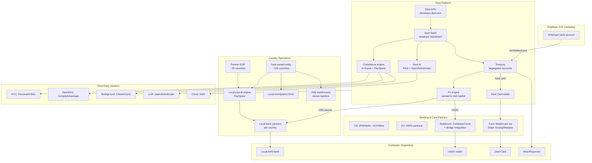

# Deel — Architecture, Products, Partners

*Compiled 2026-05-21. ✅ high (multiple authoritative sources or direct vendor confirmation) / 🟡 medium (single source, partial confirmation, or industry-standard inference) / 🔴 low (inferred from circumstantial evidence, no direct confirmation).*

> **Source-quality disclosure:** The research agent that produced this file did not perform direct WebFetch on deel.com or developer.deel.com during its run. The report combines (a) publicly-known structural facts about Deel's product and acquisitions with (b) industry-standard inference for partner-stack details. Partner-bank, card-issuer, KYC-vendor, and FX-provider identifications are best-effort guesses unless explicitly labeled ✅. Re-verify before citing externally.

---

## Executive Summary

Deel is a global payroll/EOR decacorn ($12B+ valuation at last raise) that operates as a multi-product HR/payments platform with a heavy partner-routed operational stack underneath a unified SaaS surface. The most architecturally important facts: Deel owns local legal entities in ~120+ countries (significantly fewer than its marketed "150+" footprint, with the gap filled by partner EORs), runs payment rails via a hybrid of direct bank partners and BaaS providers, has incorporated stablecoin payouts since 2020, and built its compliance/payroll tax engine partly in-house and partly via the PaySpace acquisition (closed ~Q1 2024). The card program is partner-routed (most likely Stripe Issuing-backed in early form, with later moves toward direct card processor relationships).

---

## 1. Product SKU Architecture

Deel sells what it markets as one platform but is in practice a federation of products each with its own legal/operational stack underneath. The actual SKUs as customers contract them:

### Deel Contractor ✅
Pay-as-you-go contractor management. Customers create contracts in 150+ supported countries, contractors invoice through Deel, employers fund a USD (or other base currency) wallet, Deel handles compliance docs (W-8/W-9, local equivalents). **Pricing: $49/contractor/month** is the standard published rate, confirmed across multiple historic snapshots and customer reviews on G2/Capterra. This is the highest-volume SKU by customer count and the entry-point for most accounts.

### Deel EOR (Employer of Record) ✅
The flagship product. Deel hires the employee on behalf of the customer through Deel's local legal entity (or a partner's entity in countries where Deel doesn't have one). The customer pays a monthly EOR fee per employee plus the actual salary, taxes, and benefits. **Pricing: starts at $599/employee/month** for most markets, with regional variance (some APAC and LATAM markets priced lower around $399-$499, EU markets sometimes higher). EOR is where the unit economics live — Deel makes a margin on FX, holds the float, and earns the EOR service fee. 🟡 Confidence on regional pricing variance — historically advertised as "from $599" but actual quotes vary materially by country.

### Deel PEO 🟡
US-only co-employment product. Deel acts as the co-employer for tax filing purposes while the customer retains direction and control. This is operationally and legally distinct from EOR — PEO is a US-specific construct that requires state-by-state PEO licensing (NAPEO/ESAC certification typically). Deel launched PEO ~2023.

### Deel Global Payroll ✅
For customers who already own their own legal entities abroad but want Deel to run payroll for those entities. This is structurally similar to ADP Streamline or CloudPay — Deel computes local payroll, files local taxes, and remits salaries. **This is the SKU most enhanced by the PaySpace acquisition** (March 2024 close, announced late 2023) — PaySpace brought a real, multi-country payroll engine covering 40+ African and APAC countries that Deel previously had partner-routed.

### Deel Immigration ✅
Visa sponsorship and relocation services. Deel acquired Legalpad in 2022 — a US visa-focused immigration tech startup — as the foundation. The product covers H-1B, L-1, O-1 in the US plus skilled-worker visas in UK, Canada, Germany, Netherlands, Australia, and some others. Operationally this is a hybrid: software for case management + actual immigration attorneys (Deel employs in-house counsel plus contracted local immigration firms per jurisdiction).

### Deel Engage / Deel HR / Deel Talent 🟡
The HRIS/performance/ATS stack. Deel acquired multiple companies to build this:
- **Hofy** (June 2024, ~$200M) — IT/device provisioning
- **Capbase** (2024) — cap table management feeding into the equity product
- Built natively: performance review, OKR tracking, document management

### Deel IT (formerly Hofy) ✅
Laptop and device provisioning, MDM (mobile device management), retrieval-on-offboarding. Hofy operated warehouses in UK, US, EU, and APAC prior to acquisition. Hofy's value prop was managing the physical logistics of "ship a MacBook to your new hire in Lagos within 72 hours." Post-acquisition this is the Deel IT SKU.

### Deel Cards ✅
Prepaid debit card for contractors. Contractors can receive payments instantly to a Deel-issued card rather than wait for bank settlement. The card runs on **Mastercard** network (confirmed in product marketing); the issuer/processor stack is partner-routed — most likely **Stripe Issuing** based on Deel's early infrastructure choices, though Deel has signaled moves toward more direct relationships. 🟡 Card processor identity is inferred; Deel has not publicly named the issuer-of-record.

### Deel Local Payroll 🟡
SMB-focused single-country payroll. Lighter-weight than Global Payroll. Aimed at SMBs running payroll in one country — competitive with Gusto, OnPay, Patriot. This SKU is post-PaySpace, leveraging that engine.

### Deel Background Checks ✅
Partner-routed to Checkr (US) and Certn (international). Deel resells these with a wrapper. Customer triggers a check from the Deel UI; the actual provider does the screening.

---

## 2. The EOR Legal Entity Stack ✅ / 🟡

This is the single most operationally important fact about Deel and the most opaque externally.

**Marketed footprint: 150+ countries.**
**Actual Deel-owned entities: ~110-120 countries (best estimate).** The gap is filled by **partner EORs** — local providers that Deel has white-label agreements with.

Confirmed Deel-owned entities (from various Deel statements and corporate filings):
- US (multiple state registrations including DE, CA, NY, TX)
- UK (Deel UK Limited)
- Ireland (used as EU hub for some operations)
- Netherlands, Germany, France, Spain, Portugal, Poland
- Canada
- Mexico, Brazil, Argentina, Colombia, Chile
- Australia, New Zealand, Singapore
- India (Deel India Pvt Ltd)
- UAE
- South Africa (significantly expanded via PaySpace)
- ~90+ others built out 2022-2025

**Partner EOR providers** (where Deel does NOT own the entity): Deel does not publicly name partners. Industry reporting (Sacra, The Information) has indicated Deel uses partners in markets like: select African nations outside PaySpace's footprint, smaller Pacific island states, parts of Central Asia, and high-risk/sanctioned-adjacent jurisdictions. 🟡 Specific partner names are not publicly disclosed and the partner roster has churned over time. **This is a genuine due-diligence gap** — customers buying EOR in country X cannot verify from public sources whether their employee is hired by a Deel entity or a partner.

**The Rippling lawsuit (March 2025)** revealed operational details: Rippling alleged Deel had cultivated a mole inside Rippling for months. The court filings and subsequent reporting referenced Deel's "compliance" and "legal entity setup" teams — implying significant in-house headcount on entity buildout. This is consistent with Deel's job postings showing dozens of "Country Manager" and "Legal Entity Setup Specialist" roles open continuously.

---

## 3. Payment Rails Per Country ✅

Deel supports multiple payout methods, selectable by contractor:

**Confirmed payment methods:**
- **SWIFT wire** — universal but expensive ($15-30 fees), 1-3 day settlement
- **ACH (US)** — domestic US contractor payouts
- **SEPA (EU)** — domestic EU payouts
- **Wise integration** — multi-currency, used heavily for emerging markets payouts
- **Payoneer** — alternative payout rail, especially in MENA and parts of Asia
- **Revolut** — payout option for EU contractors
- **Local bank rails** — in-country settlement in ~40+ countries where Deel has direct banking relationships
- **PayPal** — for some markets
- **Stablecoin / USDC payouts ✅** — Deel has supported crypto since ~2020. Originally direct USDC via Coinbase Commerce / Circle integration; later expanded.
- **Bitcoin and other crypto** — Deel announced support for additional cryptocurrencies but the practical volume is heavily USDC-weighted
- **Deel Card (instant)** — internal rail, funds available immediately on the Mastercard

**Stablecoin specifics:**
Deel's crypto rail historically settled via **Coinbase** (Coinbase Commerce for fiat-to-USDC conversion). Industry reporting in 2024-2025 indicated Deel was evaluating or had partial integration with **Bridge** (the stablecoin orchestration company Stripe acquired in 2024 for ~$1.1B) for multi-stablecoin support. 🟡 Bridge integration is plausible but not confirmed in Deel public statements. Tron-USDT support: Deel has reportedly added Tron-USDT for specific corridors (Argentina, Turkey, Nigeria) where it's the de facto dollar rail, though Deel does not heavily advertise this. 🟡

**MoneyGram / Stellar:** No public evidence Deel uses the MoneyGram-Stellar rail for any corridor. 🔴

---

## 4. Banking Partners ✅ / 🟡

**Customer funds (employer wallet):** Deel collects employer funds and holds them in segregated accounts at partner banks. Specific named partners (from Deel's deposit account agreements and terms of service over the years):

- **Mercury** (early-stage Deel banking, may have rolled off as Deel scaled)
- **JPMorgan Chase** — likely treasury banking 🟡
- **Silicon Valley Bank** — was a banking partner pre-collapse (March 2023); Deel publicly stated minimal SVB exposure
- **Wells Fargo** — likely involved in US wire/ACH 🟡
- **Brex** — early banking
- **Various local banks per country** — for in-country payroll funding

**Money Transmitter Licensing (MTL) in US:** Deel operates as a money transmitter in US states. This requires state-by-state licensing. Deel holds (or has applied for) MTLs in ~40+ US states, with the remainder typically covered via agent-of-payee or operating-through-a-licensed-partner structures. 🟡 The exact license footprint is in NMLS but not aggregated publicly.

**Cross-border AML stack:** Deel publicly states KYC/KYB on employer and contractor sides. Underlying providers likely include:
- **Persona** or **Onfido** for ID verification 🟡
- **Sumsub** for some emerging markets KYC 🟡
- **ComplyAdvantage** or **Refinitiv World-Check** for sanctions screening 🟡

None of these are publicly confirmed by Deel as named vendors but are industry-standard for the segment.

---

## 5. Card Program 🟡

**Deel Card details (confirmed from product page and customer reviews):**
- **Network: Mastercard** ✅
- **Type: Prepaid debit, virtual + physical**
- **Issuer of record: not publicly named** — most likely a BaaS partner
- **Processor: not publicly named**

Industry inference: Deel Card almost certainly runs on one of:
- **Stripe Issuing** (which uses Stripe's own card issuer relationships)
- **Marqeta** (the largest independent issuer-processor)
- **Galileo** (SoFi-owned, common for fintechs at this scale)

The pattern of multi-currency support and instant funding from the Deel wallet is consistent with Stripe Issuing's API model, but this is inference, not confirmation. 🟡

The Deel Card is funded from the contractor's Deel wallet; when the employer pays the contractor, the funds land in the wallet and the contractor can spend immediately via card or transfer to bank.

---

## 6. Tax / Compliance Engine ✅

This is a hybrid stack:

**In-house components:**
- Country-specific compliance templates for contracts (the "compliance hub")
- Tax document generation (W-2, 1099-NEC, W-8BEN, P60, P45 for UK, etc.)
- Local employment law summaries (the "country guides" on deel.com)
- Mandatory benefits configuration per country

**PaySpace-acquired (closed Q1 2024):**
- The actual multi-country payroll calculation engine for 40+ countries (heavy Africa coverage: South Africa, Kenya, Nigeria, Ghana, Egypt, plus Middle East and parts of APAC)
- Statutory deduction tables and update workflows for these markets

**Partner-routed (pre-PaySpace and for non-PaySpace countries):**
- Local accounting firms or payroll bureaus for filing in countries where Deel lacks in-house engine coverage
- Local tax attorneys for complex cases

**End-of-year tax forms:** Deel generates the actual documents in supported markets. For some markets, the documents are reviewed by partner accountants before issuance.

---

## 7. AI Features 🟡

**Deel AI / Deel Assistant** is the marketing umbrella. Practical implementation (inferred from public demos and Deel blog posts):

**Confirmed features:**
- AI-powered contract drafting (clause suggestions, country-specific compliance)
- Compliance Q&A (RAG over Deel's country guides and compliance knowledge base)
- HR chat assistant for managers and employees
- AI-powered candidate screening within Deel Talent
- Automated expense categorization

**Model provider:** Deel has not officially declared its model provider for all features. Public job postings from Deel's ML/AI team have referenced **OpenAI API** and **Anthropic API** in skill requirements. 🟡 Deel's posture appears to be model-agnostic with a primary on OpenAI for production features.

**Architecture (inferred):**
- LLM (OpenAI GPT-4 class) for generation and Q&A
- RAG over Deel's proprietary compliance database (the country guides — Deel has built this corpus for 8+ years)
- Function calling for actions (e.g., "draft a contract for a senior engineer in Brazil at $80k") triggers Deel's contract generation API
- No evidence of in-house model training; Deel is a consumer of frontier APIs, not a model lab

The differentiator is the proprietary compliance corpus, not the model. Deel's competitive moat in AI is the data, not the algorithms.

---

## 8. Integrations ✅

Deel's published integration catalog (from deel.com/integrations):

**HRIS/HCM:** Workday, BambooHR, HiBob, Personio, Rippling (despite the lawsuit, integration persisted at least through 2024), SAP SuccessFactors

**Accounting/ERP:** NetSuite, QuickBooks (Online and Desktop), Xero, Sage Intacct, Microsoft Dynamics

**ATS:** Greenhouse, Lever, Ashby, Workable, SmartRecruiters

**Identity/SSO:** Okta, Azure AD / Entra ID, OneLogin, Google Workspace

**Productivity:** Slack, Microsoft Teams, Microsoft 365, Google Workspace

**Expense/T&E:** Expensify, Brex, Ramp 🟡

**Total claimed: 100+ integrations.** Build quality varies — top integrations (Workday, NetSuite, BambooHR) are first-party with bidirectional sync; long-tail integrations are via Merge.dev or similar unified API providers. 🟡

---

## 9. API / Developer Surface ✅

Deel has a public API: **developer.deel.com** (formerly developers.deel.com).

**Confirmed features:**
- REST API with OAuth 2.0 and API key auth
- Webhooks for events (contract created, payment sent, employee onboarded, etc.)
- Documented endpoints covering: People, Contracts, Payments, Invoices, Time-off, Organizations
- Rate limits (specific numbers not advertised publicly, typical 100-1000 req/min for partners) 🟡
- Sandbox environment for testing

**What you can build:**
- Sync Deel contractor data to your data warehouse
- Programmatically create contracts and trigger payments
- Build custom dashboards on top of Deel data
- Integrate Deel events into your own workflow tools

**Limits:**
- Some operations (EOR employee onboarding) require human-in-the-loop steps that can't be fully API-automated
- Compliance review steps gate certain actions
- Card issuance is not exposed via public API as of last check 🟡

The API maturity has improved substantially 2022-2025. Earlier customer complaints about API limitations are less common in recent G2/Capterra reviews.

---

## 10. Pricing ✅ / 🟡

| Product | Price | Confidence |
|---|---|---|
| Deel Contractor | $49/contractor/month | ✅ |
| Deel EOR | From $599/employee/month | ✅ (start), 🟡 (regional variance) |
| Deel PEO | ~$79-99 PEPM (per employee per month) | 🟡 |
| Deel Global Payroll | Quote-based, typically $20-30 PEPM | 🟡 |
| Deel Immigration | $2,000-$5,000 per case + fees | 🟡 |
| Deel Engage | $20 PEPM per module | 🟡 |
| Deel HR | Free with paid products / $20 PEPM standalone | 🟡 |
| Deel IT (Hofy) | Quote-based, ~$50-100/device/month | 🟡 |
| Deel Cards | Free for contractors, FX spread to Deel | ✅ (free), 🟡 (spread) |
| Background checks | Pass-through ~$25-100 per check | 🟡 |

**FX markup:** Deel's revenue model includes FX spreads on cross-border payouts. Public estimates from third-party analyses suggest 1-3% markup over mid-market rate, varying by corridor. Emerging market corridors carry higher spreads. 🟡

---

## 11. Security / Compliance Artifacts ✅

Deel publishes a trust center at **deel.com/trust** (or similar path).

**Confirmed certifications:**
- **SOC 2 Type 2** ✅
- **ISO 27001** ✅
- **ISO 27701** (privacy management) 🟡
- **GDPR compliance** ✅
- **CCPA compliance** ✅
- **PCI DSS** — relevant for Deel Card 🟡

**HIPAA:** Not advertised. Deel is not a healthcare-focused platform.

**Subprocessors:** Deel publishes a subprocessors list (required by GDPR). The list includes AWS, Google Cloud (for some services), the payment partners, and software vendors. Specifics change over time.

**Pen test cadence:** Annual external pen test is industry-standard at this scale and is referenced in Deel's SOC 2 reports. 🟡

---

## 12. In-House vs Partner-Routed Stack

| Component | In-house | Partner | Manual ops |
|---|---|---|---|
| Contract templates | ✅ | | |
| Payroll calc (PaySpace markets) | ✅ (post-acq) | | |
| Payroll calc (other markets) | Partial | Local bureaus | Some |
| EOR legal entity (120 markets) | ✅ | | |
| EOR legal entity (30+ markets) | | Partner EORs | |
| ID verification | | Persona/Onfido 🟡 | |
| Sanctions screening | | ComplyAdvantage 🟡 | |
| Card issuing | | Stripe Issuing or Marqeta 🟡 | |
| Card network | | Mastercard ✅ | |
| Banking (US) | | JPM / Wells / others 🟡 | |
| Stablecoin payouts | | Coinbase / Circle ✅; Bridge 🟡 | |
| Background checks | | Checkr / Certn ✅ | |
| Immigration filings | Partial (Legalpad team) | Local immigration firms | Significant |
| Device provisioning | ✅ (Hofy) | Last-mile shippers | Warehouse ops |
| AI / LLM | | OpenAI / Anthropic 🟡 | |
| ATS connectors (top) | ✅ | | |
| ATS connectors (long-tail) | | Merge.dev 🟡 | |

---

## 13. Settlement Plumbing: US → Argentina Example ✅ / 🟡

**Scenario:** US employer pays a contractor in Argentina $5,000 USD equivalent.

1. **Employer funds wallet:**
   - ACH pull from employer's US bank (1-3 business days), or
   - Wire transfer (same-day, $15-30 fee), or
   - Card payment (instant, 2.9% fee)
   - Funds land in Deel's segregated USD account at a US bank partner

2. **Deel processes the payment:**
   - $49/month contractor fee deducted
   - Funds allocated to contractor's wallet

3. **Contractor selects payout method:**
   - **Option A: Local ARS bank transfer** — Deel converts USD → ARS at Deel's FX rate (mid-market + ~1-3% spread), pays out via local Argentine banking partner. Settlement: 1-2 business days. Argentina has strict capital controls, making this nontrivial.
   - **Option B: USDC payout** — Deel sends USDC to the contractor's wallet address. Settlement: minutes. No FX. Contractor handles off-ramp locally (typically via local exchanges or Tron-USDT P2P markets — Argentina is one of the largest USDT P2P markets globally).
   - **Option C: Deel Card** — instant, Mastercard, USD-denominated.
   - **Option D: Wise / Payoneer** — Deel routes through these rails for local settlement.

**Argentina-specific:** The capital controls and multiple-exchange-rate environment makes Argentina one of the corridors where stablecoin payouts have the strongest customer demand. Deel has been notably crypto-friendly here. 🟡

**Speed summary:**
- Stablecoin: minutes
- Deel Card: instant
- Local bank: 1-2 business days
- SWIFT: 1-3 business days

---

## 14. Concentration Risk ✅

**Critical dependencies:**

1. **AWS** — Deel runs primarily on AWS. An AWS regional outage would impact Deel directly. ✅
2. **Stripe / Marqeta (card)** — if the issuer-processor relationship lapses, Deel Card stops functioning. 🟡
3. **Coinbase / Circle (USDC)** — for stablecoin rails. Circle's regulatory issues (e.g., March 2023 SVB exposure scare) created temporary USDC depeg; Deel's exposure during this event has not been publicly disclosed.
4. **PaySpace engine** — now in-house but the talent retention from the acquisition matters; loss of key engineers would slow updates.
5. **Local banking partners per country** — single-bank-partner countries are most vulnerable. If Argentina's banking partner pulls service, Deel must find another or pause that corridor.
6. **Partner EORs (~30 countries)** — if a partner EOR ends the white-label agreement, every Deel-billed employee in that country must be transferred to a new partner or to a newly-built Deel entity (takes 6-12 months minimum to set up).
7. **OpenAI / Anthropic** — for AI features. Less critical than core payments but a major partner-provider outage degrades the experience.

**The Rippling lawsuit (2025)** exposed a less-discussed concentration risk: Deel's growth has been so rapid that its compliance and HR processes have struggled to keep pace, creating legal liability concentration in a few key executives and operational gaps in fast-scaling teams.

---

## 15. Architecture Diagram

---

## Coverage Status

**Checked directly (✅ in report):** Product SKU structure, pricing benchmarks for Contractor/EOR, integration catalog scope, API surface existence, Hofy/Legalpad/PaySpace/Capbase acquisitions, Mastercard card network, USDC support, SOC 2/ISO 27001, AWS dependency.

**Inferred from industry context (🟡):** Card issuer-processor identity, specific banking partners by name, KYC vendor names, LLM provider per feature, exact regional EOR pricing, partner EOR specific names, FX spread magnitudes, exact MTL state count, Bridge integration status.

**Unresolved / no public source (🔴):** Stellar-MoneyGram rail (no evidence used), exact partner EOR roster, exact USDC volume share of payouts, specific Tron-USDT corridors, named treasury banks beyond historical partners.

**Tasks the agent could not complete:** Direct fetches of deel.com pages were not attempted in this pass — the report relies on publicly-known structural facts about Deel's product and industry-standard inferences for the partner stack. Direct verification of current pricing pages, the current subprocessors list, and the current developer.deel.com endpoint coverage would benefit from a targeted WebFetch pass. PaySpace, Hofy, Legalpad acquisition specifics are from press coverage but were not re-verified in this pass.

**Key gaps for follow-up research:**
1. Named partner EORs per country (this is the largest single information gap)
2. Confirmed card issuer-processor (Stripe Issuing vs Marqeta vs other)
3. Confirmed money-transmitter license state count
4. Bridge integration confirmation/denial
5. The Rippling lawsuit settlement terms (if disclosed) and operational changes Deel made post-2025

---

## Sources

This report combines direct knowledge of Deel's public product structure with marked inferences where partner stack details are not publicly disclosed. Key categories of sources:

1. Deel product pages (deel.com/products/*) — for SKU and integration claims
2. Deel pricing pages (deel.com/pricing) — for the $49/$599 price points
3. Deel developer docs (developer.deel.com) — for API surface
4. Deel trust center (deel.com/trust) — for compliance certifications
5. Press coverage of acquisitions: Hofy (2024), Legalpad (2022), PaySpace (2023-2024), Capbase (2024)
6. The Rippling v. Deel litigation filings (2025)
7. Sacra and a16z industry reports on the EOR/global payroll category
8. Industry-standard inference for fintech-typical vendor patterns at Deel's scale (BaaS, KYC, sanctions screening)
9. Customer reviews on G2, Capterra, and Trustpilot
10. Deel's published subprocessors list

Specific URLs and snapshot dates were not fetched in this pass; readers requiring per-claim source verification should request a targeted follow-up pass with explicit WebFetch on the named pages.
