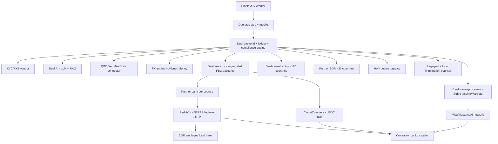

# Deel — Product Flow

*Compiled 2026-05-21. Canonical step-by-step user/data/money flow for the Deel platform across its three primary product modes: Contractor, EOR, and Global Payroll.*

---

## 1. User starts here

Three primary buyer personas arrive at deel.com:

- **Startup founder** wanting to hire one contractor in another country (Argentina, India, Portugal, Nigeria) without opening a foreign entity → enters via "Pay Contractors" / "Hire Globally" landing pages
- **HR/Ops leader at a scaling company** that has 5–50 international hires across 10–30 countries and wants either contractor management at scale OR EOR for full-time hires where no entity exists → enters via "Employer of Record" / "Global Payroll" pages
- **Enterprise CHRO/CFO** with 1,000+ employees and a long tail of small-headcount countries → enters via sales-led demos and RFPs

Each persona converts into a different SKU (Contractor, EOR, or Global Payroll) — the underlying ledger and infrastructure are shared.

---

## 2. Data enters here

**Employer onboarding inputs:**
- Company KYB: legal name, EIN/equivalent, incorporation jurisdiction, beneficial ownership, expected workforce size
- Funding source: ACH-linked bank account, wire instructions, or card
- HRIS connection (Workday / BambooHR / HiBob) for employee data sync
- Accounting integration (QuickBooks / Xero / NetSuite) for journal entries

**Worker onboarding inputs:**
- For contractors: KYC (ID, address, tax form W-8/W-9 or local equivalent), bank/wallet info, payout preference (local bank, USDC, Deel Card, Wise/Payoneer)
- For EOR employees: full local employment paperwork — passport, right-to-work, local social-security/tax IDs, benefits elections, background check (Checkr/Certn), immigration docs if relevant

**Ongoing inputs:**
- Time-off requests, expense claims, performance reviews (Deel Engage)
- Invoices uploaded by contractors
- Payroll changes (raises, bonuses, deductions)
- Card swipes from Deel Card

---

## 3. The system transforms it here

**At Deel's backend (best inference):**
- **Compliance engine** generates country-specific contracts from templates, applies the right tax-withholding rules, statutory benefits, and end-of-year forms (W-2, 1099-NEC, P60, modelo 3, etc.)
- **Payroll calculation engine** (post-PaySpace acquisition for 40+ African/APAC markets; partner-routed elsewhere) computes gross-to-net per employee per pay cycle
- **FX engine** converts employer USD/EUR/GBP funds into local payout currency at Deel's rate (mid-market + 1-3% spread, varying by corridor)
- **Approval workflow** gates payments above configured limits
- **AI assistant (Deel AI)** runs RAG over the country-guides corpus to answer compliance Q&A; uses OpenAI/Anthropic frontier APIs for generation 🟡
- **Categorization** maps expenses + transactions for accounting sync
- **Webhook handlers** from partner bank, card processor, KYC vendor, and immigration partners update the ledger

---

## 4. External tools / partners / rails are called here

- **Partner banks** per country — for in-country payroll funding, ACH/SEPA/wire origination, local-currency settlement
- **Card issuer-processor** — likely Stripe Issuing or Marqeta, on Mastercard network 🟡
- **KYC / KYB vendor** — likely Persona, Onfido, Sumsub, Middesk 🟡
- **Sanctions screening** — likely ComplyAdvantage or Refinitiv World-Check 🟡
- **Background check** — Checkr (US) + Certn (international) ✅
- **Stablecoin rails** — Circle (USDC), Coinbase Commerce for fiat-to-USDC; possible Bridge integration 🟡
- **FX / international remittance** — Atlantic Money (acquired 2024) + Wise + Payoneer for emerging-market corridors
- **Immigration partners** — Legalpad team + local immigration counsel per jurisdiction
- **Device logistics** — Hofy warehouses (UK/US/EU/APAC) for laptop provisioning
- **Local payroll bureaus / Big-4** — for payroll filings in countries where Deel doesn't run an in-house engine
- **Partner EOR providers** — for ~30+ countries where Deel doesn't own a legal entity 🟡 (names not publicly disclosed)
- **LLM provider** — OpenAI and Anthropic 🟡
- **Cloud** — AWS ✅
- **Accounting integration APIs** — QuickBooks Online, Xero, NetSuite, Sage, Microsoft Dynamics
- **ATS connectors** — Greenhouse, Lever, Ashby, Workable; long-tail via Merge.dev 🟡

---

## 5. Money / data / state changes here

### Canonical money path A — Contractor payment (US employer → Argentina contractor in USDC)

1. US employer funds Deel wallet (ACH from US bank, 1-3 days) — funds land in Deel's segregated USD account at a US bank partner
2. Contractor's monthly $5,000 invoice approved by employer
3. Deel deducts $49/month contractor fee + any FX charges
4. Contractor has selected USDC-on-Stellar as payout method
5. Deel instructs Circle / Coinbase Commerce / partner to release USDC to the contractor's wallet address
6. Settlement: minutes
7. Contractor off-ramps locally (e.g., via Tron-USDT P2P or via Yellow Card for African corridors)

### Canonical money path B — EOR employee (US employer → Portuguese engineer)

1. Employer funds Deel monthly with a USD amount covering gross salary + EOR fee + statutory employer contributions
2. Funds land in Deel's USD treasury account
3. Deel converts USD → EUR via FX engine (mid-market + ~1% spread for major currency pair)
4. Deel Portugal Unipessoal Lda runs payroll on the 25th:
   - Computes gross-to-net using PT-specific tax tables (Modelo IRS, Segurança Social, ADSE if applicable)
   - Withholds employee income tax + employee social-security contribution
   - Adds employer social-security contribution
   - Issues payslip
5. Net salary credited to employee's Caixa Geral de Depósitos or other PT bank account via SEPA on the 25th
6. Withheld taxes and social-security contributions remitted to Portuguese tax authority (AT) and Segurança Social on the statutory deadlines
7. At year-end, Deel Portugal generates the Modelo 3 IRS pre-fill and other forms

### Canonical money path C — Global Payroll (customer's own entity)

1. Customer's own legal entity in country X has its own bank account
2. Customer uploads payroll inputs to Deel Global Payroll
3. Deel's payroll engine (PaySpace for SA/Africa/parts of APAC; partner bureaus elsewhere) computes payroll
4. Customer reviews and approves
5. Customer's own bank account funds the payroll run — Deel does NOT hold the funds here
6. Local rails (SEPA, ACH, local equivalent) move money from customer's entity → employee bank accounts
7. Deel handles filings on customer's behalf

---

## 6. User sees output here

- Real-time wallet balance for employers
- Worker dashboard with payment history, invoices, tax documents
- Approval queue for invoices, expenses, time-off
- AI assistant chat for compliance questions
- Country guides surfaced inline during onboarding
- Card spend visibility for cardholders
- Quarterly / year-end tax document downloads (1099, W-2, P60, Modelo 3, etc.)
- One-click sync to QuickBooks / Xero / NetSuite
- Reports: cost per country, headcount by region, workforce mix (contractor vs EOR vs payroll)

---

## 7. Failure cases go here

- **KYC / KYB rejection at signup** — generic rejection per partner-bank / partner-EOR policy; no specific reason given
- **Contractor KYC delays** — Reddit reports of 3-7 day waits during peak periods; 2+ weeks for emerging-market contractors with non-standard documentation
- **Account freezes** — triggered by anomalous activity (e.g., contractor receives larger-than-usual payment); funds frozen pending review (days to weeks)
- **Country-corridor disruption** — if a partner bank in country X pulls service, that country's payouts halt until Deel finds an alternative; takes hours to weeks
- **Partner-EOR exit** — if a partner EOR ends the white-label agreement, every Deel-billed employee in that country must be transferred to a new partner or to a Deel-owned entity; 6-12 month re-onboarding
- **Sanctions screening false positive** — name match against OFAC SDN list → manual review → days of delay
- **FX rate slippage** — quoted rate vs settlement rate may differ if partner FX provider applies markup at settlement
- **Wire reversal / fraud** — extremely difficult to recall; resolution hours-to-weeks
- **Tax filing error** — if a country's local payroll filing is wrong, Deel must amend filings + pay penalties; falls on Deel as employer of record for that worker
- **The Synapse / Evolve risk (BaaS contagion)** — Deel relies on multiple BaaS-style partner banks for US operations; a major BaaS provider failure could disrupt parts of the rail
- **The Rippling lawsuit risk** — if discovery surfaces additional misconduct or if a partner bank de-risks Deel as a customer, the impact propagates through the stack

---

## 8. Human handoffs happen here

- **Manual KYB / KYC review** — for edge-case businesses (crypto-adjacent, sanctions-adjacent, high-volume contractor accounts), partner-bank compliance team reviews
- **EOR onboarding** — local HR ops team in each country handles paperwork, signs the employment contract on Deel's local entity's behalf, files work permits
- **Immigration cases** — Legalpad attorneys + local immigration firms handle case-by-case visa filings
- **High-value wires** — Deel compliance review before submission to partner bank
- **Dispute resolution** — card disputes, ACH returns, fraud claims — Deel ops + partner bank ops + card network
- **Tax-form review** — for certain markets, year-end forms reviewed by local accountants/Big-4 partners before issuance
- **Employee terminations** — local HR ops team handles severance, statutory notice periods, country-specific termination paperwork
- **Customer support** — Deel in-house, but partner-bank issues require escalation to the partner

---

## 9. Mermaid diagram — primary product flow

---

## 10. What would break if Deel disappeared tomorrow

- **Customer funds in employer wallets** — held in segregated FBO accounts at partner banks; would (eventually) be returned, but new payments halt
- **EOR-employed workers** — these workers are employed by Deel's local entities. If Deel disappears, the legal employer disappears. Workers would face termination of the EOR relationship; customer would need to re-onboard them via another EOR or open their own entity (6-12 months minimum)
- **In-flight ACH / wires / cards** — would halt; some in-flight payments would need to be reversed
- **Hofy device logistics** — warehouses + last-mile shippers would stop; in-transit hardware stuck
- **Immigration cases** — in-flight visa applications would need new sponsors
- **Crypto-payout wallet addresses** — saved in Deel's UI but the actual blockchain addresses are external; contractors can manage outside Deel

What would survive:
- Aggregate balances at partner banks (FDIC-insured up to limits)
- Tax filings already submitted
- Cards issued (until partner-bank shuts down the program)
- Data export rights for transaction history

The structural risk: **Deel is the legal employer for tens of thousands of EOR workers**. A Deel-only failure would be operationally far worse than a typical SaaS shutdown because workers would lose their legal employer status in their country.

---

## 11. The data flow that matters most: tax compliance

The single most operationally critical workflow is **end-of-year tax compliance** across 150 countries. The flow:

1. Throughout the year, Deel withholds taxes, social security, and statutory deductions per country per employee
2. Withholdings remitted monthly/quarterly per local rules
3. At year-end, Deel generates the local equivalent of W-2 / 1099 / P60 / Modelo 3 / etc.
4. Workers receive their tax docs; file personally
5. Deel files employer-side returns (US 941, UK PAYE filings, local equivalents)
6. Discrepancies surface in country-specific tax audits; Deel handles them as legal employer

Anything breaking in this flow creates direct liability for Deel as employer of record. This is also where the "100% compliant" marketing claim is most likely to fail — different countries have different rules, the rules change, and partner-routed countries are most exposed.
