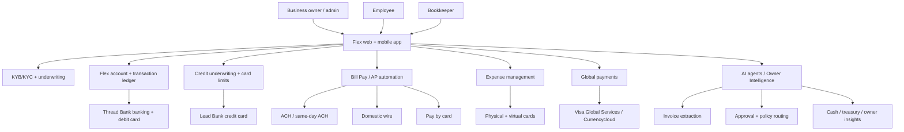

# Flex - Architecture

Date: 2026-05-09

This is an inferred architecture from Flex public pages, legal pages, support docs, and funding announcements. Flex does not publish developer docs or internal system diagrams.

## One-frame architecture

## Product primitives

Likely primitives:

- Organization/business.
- Owner/admin.
- Employee/team member.
- Bookkeeper role.
- Bank account/subaccount.
- Credit account/limit.
- Debit/credit card.
- Vendor/recipient.
- Bill/invoice.
- Approval workflow.
- Payment.
- Receipt/memo.
- Accounting sync record.
- FX/global transfer.
- AI task/agent output.

## Banking layer

Flex banking is provided through Thread Bank. Support docs show:

- Funding by ACH/wire from external bank.
- ACH/wire account details downloadable as PDF.
- Mobile check deposit with endorsement "Mobile Deposit for Thread Bank."
- Statements downloadable in PDF/CSV.
- Up to $3M FDIC coverage via Thread Bank sweep program if conditions apply.
- Tiered transaction limits.

This is a sponsor-bank digital banking architecture. Flex owns product/UX; Thread owns regulated deposit account/card issuance rails.

Sources: [business banking](https://www.flex.one/business-banking), [funding support](https://support.flex.one/hc/en-us/articles/19633150647565-Funding-Your-Flex-Banking-Account), [check deposit support](https://support.flex.one/hc/en-us/articles/33358222578317-Depositing-Checks), [FDIC support](https://support.flex.one/hc/en-us/articles/25652266905485-FDIC-Insurance), [transaction limits](https://support.flex.one/hc/en-us/articles/25580421146765-Transaction-Limits).

## Credit layer

The Flex Business Credit Card is issued by Lead Bank. Flex markets it as:

- 3-in-1 card.
- 0% interest / Net-60 terms.
- Up to 1.75% cashback.
- Credit limits explicitly tailored to business.
- Physical and virtual cards.
- Employee card controls.

Support docs describe 60-75 day 0% interest window, two due dates per month, card creation, card restrictions, activation, receipt/memo upload, and default banking account for repayments.

Sources: [homepage](https://www.flex.one/), [credit billing support](https://support.flex.one/hc/en-us/articles/31428824557709-Understanding-Credit-Card-Billing-Cycles), [issuing cards support](https://support.flex.one/hc/en-us/articles/25562592074637-Issuing-New-Credit-Cards).

## AP / Bill Pay layer

Bill Pay flow:

1. User uploads PDF or forwards bill by email.
2. AI recognizes and processes invoice data.
3. Payment enters approval workflow.
4. Admin approves in app/mobile.
5. Payment executes by ACH, same-day ACH, wire, or credit.
6. Payment syncs to accounting software.

The FAQ says Bill Pay is free for Flex bank account holders; payment with Flex credit incurs a 4% transaction fee. It integrates with QuickBooks Online and NetSuite; homepage also mentions Xero elsewhere.

Sources: [bill pay](https://www.flex.one/bill-pay), [authorizing payments support](https://support.flex.one/hc/en-us/articles/25660059245581-Authorizing-Payments).

## Global payments layer

Flex global payments use existing fiat rails, not stablecoins. Public pages name Visa Global Services Inc. and Currencycloud legal terms. The product claims:

- Send payments to 180+ countries.
- 32/34 currencies.
- USD international payments free.
- 1% FX fee for non-USD currency.
- Batch payments up to 1,000 recipients.
- Recipient receives payment directly to bank account.

Support docs say:

- International wire, USD: approximately 2-9 business days, free.
- International wire, FX: approximately 2-9 business days, 1%.

Sources: [global payments](https://www.flex.one/global-payments), [outgoing payment timelines](https://support.flex.one/hc/en-us/articles/25661300899469-Payment-Timelines), [Currencycloud terms](https://www.currencycloud.com/legal/terms/).

## Expense management layer

Flex expense management combines:

- Unlimited physical/virtual cards.
- Limits by card/user.
- Spend category restrictions.
- Termination dates.
- Real-time tracking.
- Receipt/memo upload.
- Accounting integrations.

This is the Ramp/Brex-style spend control layer. The AI framing is "Expenses on AI" and "Expense Agents proactively monitor employee expenses 24/7," but detailed model mechanics are not public.

Sources: [homepage](https://www.flex.one/), [card spend restrictions support](https://support.flex.one/hc/en-us/articles/11618322426381-Managing-Credit-Card-Spend-Restrictions), [receipt support](https://support.flex.one/hc/en-us/articles/9118731806605-How-to-Add-Receipts-and-Memos).

## AI / agentic ERP layer

Flex's Series B announcement says it is building an intelligent agent architecture across:

- Private credit.
- Business finance.
- Personal finance.
- Payments.
- ERP.

Capabilities claimed:

- Business-level and multi-entity underwriting.
- Automated expense and payment workflows.
- Cash and treasury optimization.
- Back-office operations for owner-operators.
- Real-time insights through Owner Intelligence.

This is likely a mix of:

- OCR/document extraction.
- Classification.
- Rules/policy enforcement.
- Risk/underwriting models.
- Workflow automation.
- Owner dashboards/insights.
- Human support escalations.

Source: [Series B announcement](https://www.flex.one/resource-hub/flex-raises-60m-series-b).

## What is not public

- Exact underwriting model.
- AI model vendors.
- Fraud/compliance vendors.
- Whether ledger is in-house or vendor core.
- Exact bank-core integration model.
- Detailed global payment coverage by country/currency.
- API/developer surface.
- Personal finance product mechanics.
- Owner Intelligence screenshots/workflows.

## Architecture lesson

Flex is a workflow aggregator over regulated fiat infrastructure. Its value is not only the card or bank account. Its value is bundling credit, payments, AP, expenses, support, and owner insights into one operating surface.
