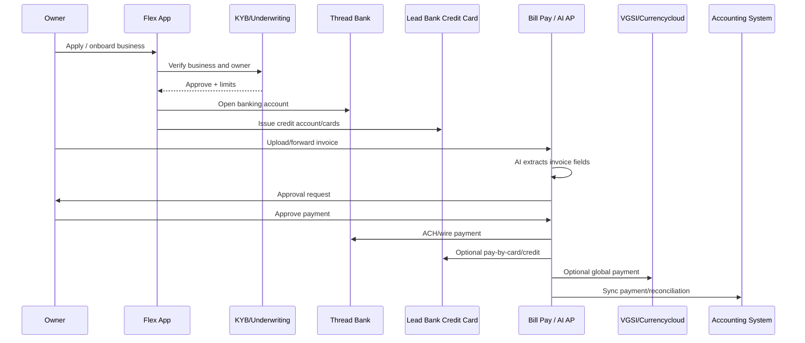

# Flex - Product Flow

Date: 2026-05-09

## Primary flow

## Flow 1: Banking account

1. Business applies.
2. Flex/Thread Bank approves account.
3. User downloads ACH/wire details.
4. User funds account from external bank.
5. User creates subaccounts/cards.
6. User sends ACH/wires, deposits checks, views statements.

Failure cases:

- KYB rejection.
- Pass-through FDIC conditions not met.
- ACH/wire delays.
- Transaction limits.
- Compliance/fraud holds.

## Flow 2: Credit card / Net-60 float

1. Business applies for credit.
2. Flex underwrites business.
3. Lead Bank issues card if approved.
4. Admin creates virtual/physical cards.
5. Admin sets limits, category restrictions, termination dates.
6. Employee spends.
7. Flex tracks receipts/memos.
8. Payment is due after the Net-60/60-75 day billing mechanics.

Failure cases:

- Low credit approval.
- Card decline.
- Missing receipts.
- Spend restriction blocks transaction.
- Late payment creates interest/fees.
- Credit line changes.

## Flow 3: Bill Pay / AP automation

1. Vendor sends invoice.
2. User uploads PDF or forwards email.
3. AI extracts invoice details.
4. Bill enters approval workflow.
5. Admin approves.
6. User pays via ACH, same-day ACH, wire, or Flex credit.
7. Payment syncs to QuickBooks/NetSuite/Xero.

Failure cases:

- AI extraction wrong.
- Duplicate invoice.
- Approval delayed.
- Vendor details wrong.
- ACH/wire cutoff missed.
- Credit payment fee surprises user.

## Flow 4: Global payment

1. User adds international recipient.
2. User selects USD or foreign currency.
3. User chooses Flex account or credit card.
4. Flex routes through VGSI/Currencycloud.
5. Recipient receives bank payment.

Failure cases:

- Country/currency unsupported.
- Bank details wrong.
- FX quote/fee unexpected.
- 2-9 business day settlement.
- Compliance review.

## Flow 5: Expense management

1. Admin creates employee card.
2. Sets limit frequency, spending limit, categories, and termination date.
3. Employee spends.
4. Transaction appears in Flex.
5. Employee uploads receipt/memo.
6. Finance/bookkeeper reviews and syncs to accounting.

Failure cases:

- Employee lacks permission.
- Merchant category blocked.
- Receipt missing.
- Transaction disputed.
- Sync mapping wrong.

## Flow 6: Owner Intelligence / AI CFO

Publicly described, but not deeply verifiable.

Likely intended flow:

1. Flex ingests banking, credit, AP, AR, expense, and payment data.
2. AI agents classify and summarize state.
3. Owner sees cash flow, risk, payment, and opportunity insights.
4. System recommends actions: pay later, use credit, move cash, approve/hold invoice, follow up AR.

Status:

This is more roadmap/positioning than support-doc-proven workflow.
