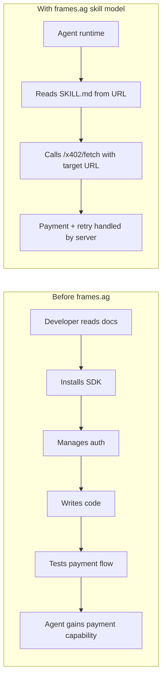
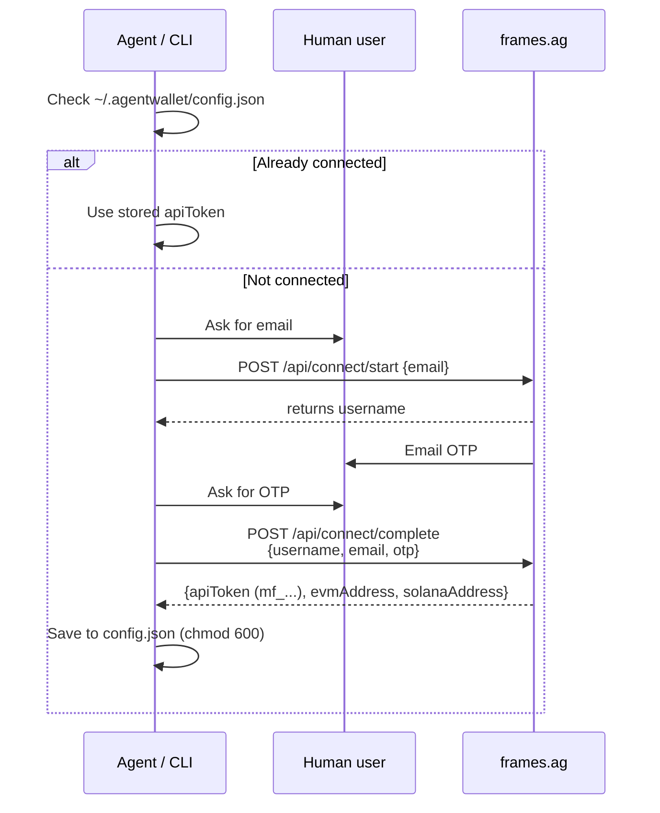
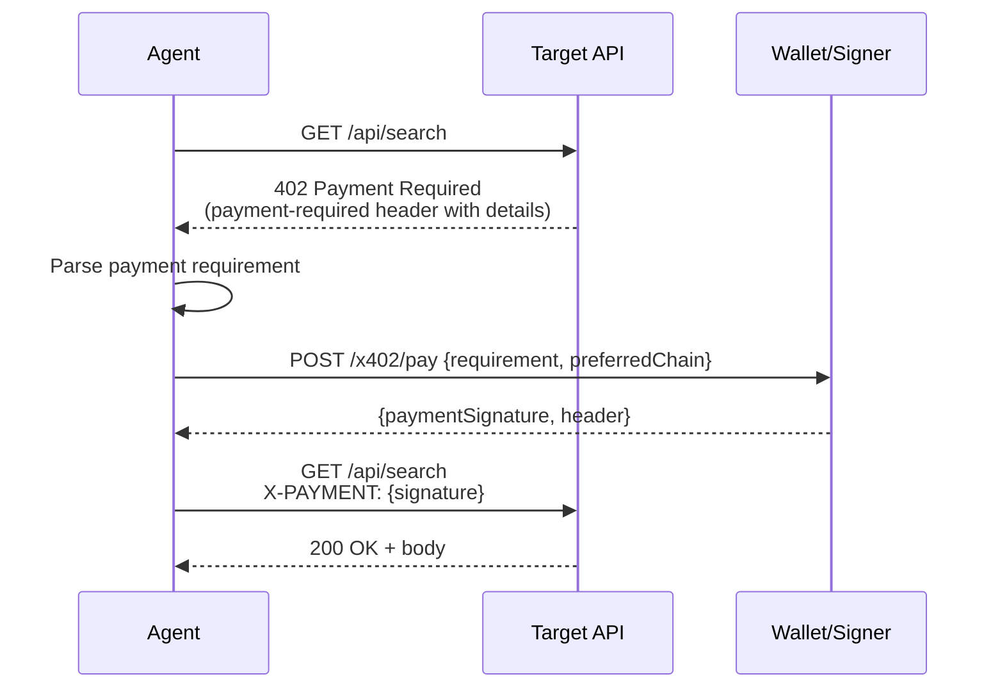
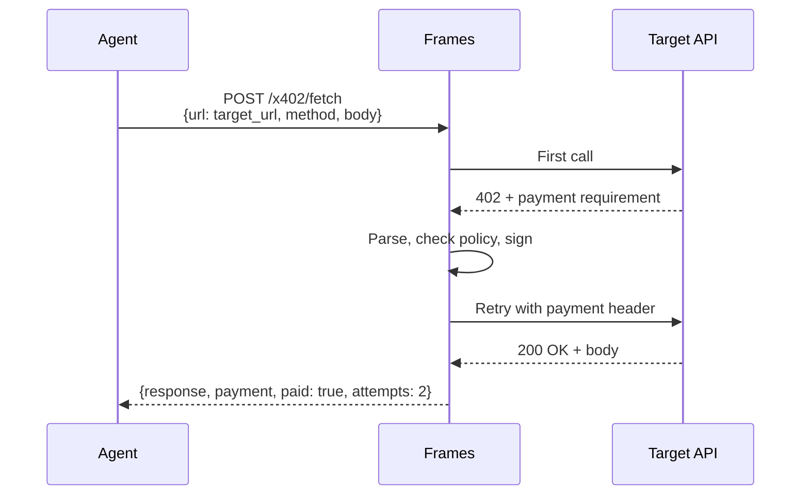
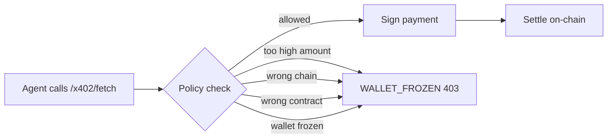
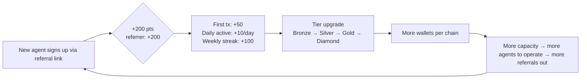
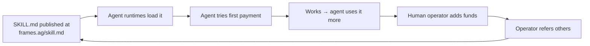

# frames.ag — How It Works

> Technical architecture explanation derived from their official `skill.md` (README) at `https://frames.ag/skill.md`. **This file is the protocol/mechanism explainer.** Company background, founders, funding, and traction live in [`./deep_dive.md`](./deep_dive.md).
> **Date:** 2026-05-02
> **Source:** Their published skill.md, plus inferences from architecture patterns

> ⚠️ **Update (2026-05-02):** Live API queries + deep-dive research in [`./deep_dive.md`](./deep_dive.md) answer most of the open questions flagged at the bottom of this file:
> - **Custody:** confirmed they're a **Privy MPC wrapper** (not custom server-side custody) — `privyWalletId` field present in their public API responses
> - **Moltbook is NOT a parent/sister** — it's Matt Schlicht's project, **acquired by Meta March 2026**. frames.ag publishes a "moltbot" skill into Moltbook's registry. So frames.ag is back-doored into a Meta agent surface.
> - **CASH token is NOT theirs** — external stablecoin-style asset (likely Catena Labs' Cash)
> - **Tempo integration is technical, not commercial** — they self-integrated against the public MPP spec, no Stripe partnership
> - **Real volume is $0 organic** — 2,160 wallets, 24 DAU, $0 of 24h USDC volume. All 4,544 daily transactions are internal promo-credit calls to their own API registry. Cumulative $75K only.
> - **Founder:** Luís Freitas ([@microchipgnu](https://x.com/microchipgnu)) — former Bitte Protocol CTO, Lisbon. ~2-person team. **No funding announced.**
> - **Not in [x402.org/ecosystem](https://x402.org/ecosystem)** — outside the official Coinbase / Linux Foundation x402 orbit

---

## TL;DR

frames.ag (also branded **AgentWallet**) gives AI agents a **server-custodied wallet that signs payments using x402 and MPP protocols**, callable from any agent runtime via a single REST endpoint. The wallet is created via **email OTP** (not full KYC), holds USDC/USDT/CASH on **EVM (9 networks) + Solana**, and exposes a one-step `/x402/fetch` endpoint that handles the entire payment dance — 402 detection, signing, retry — automatically.

The bigger product idea: **distribute the wallet via a "skill file" (SKILL.md + heartbeat.md + skill.json) that AI agents can read at runtime to learn how to use the wallet**. This is the "Pi skill" pattern (Codex/OpenClaw/possibly Claude Code skills). An agent that loads the skill instantly gains payment capability — zero developer integration required. Plus a built-in airdrop / referral program with tiered wallet limits creates a viral distribution loop.

This is the **agent-payments-thesis from `markets/agent_payments/solutions.md` actually shipping** — a clean implementation of the x402 + agent-wallet stack that's been forming under the noise. What makes it interesting isn't the protocol support (Privy, Crossmint, Coinbase AgentKit all do similar things). It's the **distribution model**: skill files → agent runtimes → instant capability.

---

## 1. The big idea



**Before:** Adding payments to an AI agent is engineering work — SDK, auth, signing, retry logic.

**With frames.ag:** The agent reads a skill file, gets credentials via email OTP, and can pay any x402- or MPP-protected API by calling one endpoint. The server handles 402 detection, payment signing, and retries.

**For this to work, three things have to be true:**
1. The agent runtime supports loading external skill files (Codex does, OpenClaw does, Claude Code can with manual install — see our `feynman-deep-research` install pattern)
2. The user trusts the wallet provider with custody
3. The economic activity actually exists (i.e., real x402 / MPP APIs people want to call)

---

## 2. The architecture, end to end

```mermaid
flowchart TB
    subgraph User["User/Operator"]
        U[Human user]
    end
    
    subgraph AgentRuntime["Agent Runtime (Codex/OpenClaw/Claude)"]
        A[AI agent]
        SK[SKILL.md loaded]
        CFG[~/.agentwallet/config.json<br/>username + apiToken]
    end
    
    subgraph Frames["frames.ag (server-side)"]
        API[REST API @ frames.ag/api]
        POLICY[Policy engine<br/>max_per_tx_usd<br/>allow_chains<br/>allow_contracts]
        SIGN[Signing service<br/>server-side custody]
        WALLETS[Wallets<br/>EVM + Solana addresses]
    end
    
    subgraph Chains["On-chain"]
        EVM[EVM: ETH/Base/OP/Polygon/<br/>Arb/BNB/Gnosis + testnets]
        SOL[Solana mainnet + devnet]
        TEMPO[Tempo eip155:4217<br/>for MPP]
    end
    
    subgraph Targets["x402 / MPP-protected APIs"]
        T1[Search API e.g. Exa]
        T2[Inference API]
        T3[Any 402-capable service]
    end
    
    U -->|email OTP onboarding| API
    API -->|provisions| WALLETS
    U -->|funds via Coinbase Onramp| WALLETS
    
    A -->|loads at session start| SK
    A -->|reads| CFG
    A -->|POST /x402/fetch<br/>{url, body}| API
    
    API --> POLICY
    POLICY -->|allowed?| SIGN
    SIGN -->|signs payment| WALLETS
    WALLETS -->|sends tx| EVM
    WALLETS -->|sends tx| SOL
    WALLETS -->|sends tx| TEMPO
    
    API -->|retries with payment header| Targets
    Targets -->|paid response| API
    API -->|response back| A
```

### The actors

| Actor | Role |
|---|---|
| **Human user** | Verifies via email OTP, funds the wallet, sets policy limits |
| **AI agent** | Reads SKILL.md, calls `/x402/fetch` with a target URL — never touches keys |
| **frames.ag server** | Custodies private keys, runs policy checks, signs payments, retries requests |
| **EVM / Solana / Tempo chains** | Settlement layer — actual on-chain transfers happen here |
| **x402 / MPP-protected APIs** | Anything that returns 402 with a payment requirement (Exa-like search, inference APIs, etc.) |

---

## 3. The onboarding flow (email OTP, not KYC)



**Notable design choices:**
- ✅ **Email OTP only** — no government-ID KYC. This is the same pattern as Privy / Web3Auth / Magic.link. Means **anyone in any jurisdiction can spin up a wallet**, which is great for adoption and a regulatory red flag for the company (FinCEN MSB perimeter — see [`../../markets/agent_payments/compliance.md`](../../markets/agent_payments/compliance.md)).
- ✅ **One config file** at `~/.agentwallet/config.json` containing the `apiToken` (starts with `mf_` — the `mf` prefix likely stands for "Moltbook Fund" or similar; metadata in README references both Moltbot and Moltbook).
- ✅ **Two addresses provisioned at once** — one EVM, one Solana — so the agent is multi-chain by default.

---

## 4. The `/x402/fetch` one-step proxy (the user-facing magic)

This is the core abstraction that makes frames.ag interesting. Here's the contrast:

### Manual x402 flow (what other wallet APIs require)



Three round-trips. Agent has to handle 402-detection logic, JSON parsing, signature consumption rules ("ONE-TIME USE — consumed even on failed requests"), retry logic.

### `/x402/fetch` — frames.ag's abstraction



**One call. The server handles everything.** That's the entire abstraction — and it's the right abstraction for agent runtimes.

### What's in the response

```json
{
  "success": true,
  "response": { "status": 200, "body": {...}, "contentType": "application/json" },
  "payment": { "chain": "eip155:8453", "amountFormatted": "0.01 USDC", "recipient": "0x..." },
  "paid": true,
  "attempts": 2,
  "duration": 1234
}
```

- ✅ The agent gets the **API response body** back, not a low-level payment receipt
- ✅ Payment metadata is included for logging/billing visibility
- ✅ `dryRun: true` flag previews cost without paying — critical for guardrails

### Smart routing across chains/tokens

The fetch endpoint takes optional `preferredChain` (auto / evm / solana) and `preferredToken` (USDC / USDT / CASH) — so when a wallet has balance across multiple chains, frames.ag picks one with sufficient balance automatically. **Agents never have to think about which network has funds.**

---

## 5. Multi-protocol — x402 AND MPP

This is the second clever architectural choice. The README says:

> *"The `/x402/fetch` endpoint auto-detects both x402 and MPP protocols — no agent changes needed. When a target API responds with `WWW-Authenticate: Payment` (MPP) instead of `payment-required` (x402), the server handles it transparently."*

| Protocol | Discovery header | Settlement |
|---|---|---|
| **x402 v1** | `X-PAYMENT` request, 402 response with `payment-required` header | EVM + Solana, USDC/USDT |
| **x402 v2** | `PAYMENT-SIGNATURE` request, CAIP-2 chain identifiers | EVM + Solana, USDC/USDT |
| **MPP (Tempo)** | `WWW-Authenticate: Payment` 402 response, `Authorization: Payment` retry | Tempo blockchain (eip155:4217) via pathUSD/USDC.e |

**Why this matters:** x402 (Coinbase / Cloudflare / x402 Foundation) and MPP (Stripe, March 2026 launch — see `deep_dive.md` on agent payments) are competing standards. Most wallet platforms pick a side. frames.ag treats them as **two flavors of the same problem and abstracts both**. From the agent's perspective there's just `/x402/fetch` — the server figures out which protocol the target API speaks.

This is a very smart strategic bet: **whichever standard wins, frames.ag wins**. And if both win (likely — different use cases), they win twice.

🟡 **Tempo integration is notable.** Tempo is Stripe's stablecoin chain (announced March 2026 per our prior research in `markets/agent_payments/solutions.md`). frames.ag being live with Tempo support implies they're an **early Stripe MPP integration partner**. Worth confirming in the deep dive.

---

## 6. Multi-chain & multi-wallet

### Networks supported

| Type | Networks |
|---|---|
| **EVM** | Ethereum (1), Base (8453), Optimism (10), Polygon (137), Arbitrum (42161), BNB (56), Gnosis (100), Sepolia, Base Sepolia |
| **Solana** | Mainnet + Devnet |
| **Tempo** | eip155:4217 (for MPP) |
| **Tokens** | USDC (everywhere), USDT (Base/Solana/Ethereum mainnet), **CASH** (Solana mainnet — likely frames.ag's own token, ❓) |

The `CASH` token reference is the most interesting unknown. Most likely interpretations:
- 🟡 frames.ag's own token (would explain the airdrop program)
- 🟡 An ecosystem token they're integrated with
- 🟡 Stablecoin like USDM or pyUSD branded as "CASH"

The deep-dive agent should confirm this.

### Multi-wallet management

Each user starts with **one EVM + one Solana wallet**. Higher tiers can have more:

| Tier | Wallets per chain | How to qualify |
|---|---|---|
| Default | 1 | Just sign up |
| Silver | 1 (no upgrade — same as default) | 5+ referrals OR 200+ airdrop points |
| Gold | 5 | 25+ referrals OR 1000+ airdrop points |
| Diamond | Unlimited | 100+ referrals OR 5000+ airdrop points |

🟡 **Silver gives no wallet upgrade** — interesting. Silver is a status-only tier. Real utility starts at Gold (5 wallets) and Diamond (unlimited).

The wallet limit is a clever growth lever — power users *need* more wallets (multiple agents, isolated workflows), and **the only path to more wallets is referrals or sustained activity**. Pure viral mechanic baked into the product.

---

## 7. Policy engine



Policy fields exposed via `PATCH /policy`:
- `max_per_tx_usd` — cap per transaction
- `allow_chains` — whitelist (e.g., only `["base", "solana"]`)
- `allow_contracts` — whitelist of contract addresses

🟡 **What's not exposed** (and matters for production):
- Daily spending caps — README says *"MPP and x402 payments share the same daily spending limits"* but the policy patch doesn't show a `max_per_day_usd` field. Probably exists, just undocumented in this skill file.
- Rate limits per agent
- Per-recipient blocklists (can you blacklist a sketchy recipient?)
- Time-of-day controls

**The policy engine is the load-bearing trust layer.** If the agent gets prompt-injected into running away with the user's funds, the only thing stopping it is `max_per_tx_usd` and `allow_chains`. This is a real and underrated risk surface.

---

## 8. Growth/distribution mechanics

### The airdrop loop



The points system is structured so that:
- **Single biggest reward** is referring others (200 pts each, equal to referrer + referred)
- **Daily activity** matters less individually but compounds over weeks
- **Wallet limit gating** at Gold tier (5 wallets) is the primary "must refer to scale" pressure point

### The skill-distribution loop



**This is the actual product.** A skill file is a markdown contract — once an agent runtime supports loading remote skills, **frames.ag becomes a default-installable capability**. They get distribution by being the first agent-wallet skill that's well-written enough to be the canonical answer.

🟡 **Heartbeat.md and skill.json** — the README mentions these alongside SKILL.md. Heartbeat probably keeps the skill "live" / version-checked. skill.json is the metadata package (we can see its structure inline in the README's frontmatter — `name`, `version`, `description`, `metadata`).

🟡 **Version checking is built in.** *"Check for updates periodically: `curl -s https://frames.ag/skill.json | grep version`"* — they expect agent runtimes to keep skills updated. Smart hygiene.

---

## 9. Where this sits in the agent-payments landscape

Mapping frames.ag against what we documented in [`../../markets/agent_payments/solutions.md`](../../markets/agent_payments/solutions.md):

| Property | Privy (Stripe) | Crossmint | Skyfire | Coinbase AgentKit | Catena Labs | **frames.ag** |
|---|---|---|---|---|---|---|
| Custody model | MPC enclave | MPC + smart wallet | Custodial | TEE-backed | Hybrid (regulated FI planned) | Server-side (model unclear) |
| KYC | Inherited from Stripe | Persona | KYA (KYB on operator) | Coinbase identity | Full FI-grade (planned) | **Email OTP only** |
| Distribution | SDK | SDK + GOAT framework | API + KYAPay | SDK | (pre-launch) | **Skill file (read by agent runtime)** |
| x402 support | Yes (via Stripe) | Yes (multi-protocol) | No (closed network) | Yes (native) | (TBD) | **Yes (one-step proxy)** |
| MPP support | Yes (Stripe is MPP) | Yes (multi-protocol) | No | (TBD) | (TBD) | **Yes (auto-detected)** |
| Multi-wallet per user | Yes | Yes | One per agent | Yes | (TBD) | **Yes, gated by tier** |
| Token / airdrop | No | No | No | No | No | **Yes (built-in)** |
| Funding model | $230M valuation (acq Stripe) | $23.6M Series A | $9.5M total | Coinbase corporate | $18M seed (a16z + Tom Brady + Balaji) | **Unknown — see `deep_dive.md`** |

**What's distinctive about frames.ag:**
1. ✅ **Skill-file distribution** — none of the others use this. They all assume developers integrate via SDK.
2. ✅ **Multi-protocol abstraction** — x402 + MPP both via one endpoint, server handles routing
3. ✅ **Built-in viral loop** via referrals + tier-gated wallet limits
4. ✅ **Email OTP onboarding** — fastest path to wallet of any in the table (~30 seconds)

**What's risky about frames.ag:**
1. 🔴 **Server-side custody model not explained** — could be MPC like Privy, raw key storage (worst), or TEE-backed (best). The deep dive needs to nail this down.
2. 🔴 **Email OTP without KYC** is a regulatory exposure — at scale, FinCEN will care
3. 🔴 **CASH token + airdrop** could be securities exposure depending on how it's distributed
4. 🟡 **Centralization risk** — if frames.ag goes down, all the wallets are unreachable. No published recovery mechanism in the skill file.

---

## 10. The complete API surface (for reference)

Pulled from the skill.md, organized by what an agent typically does:

### Onboarding & Identity
- `POST /api/connect/start` — request OTP
- `POST /api/connect/complete` — verify OTP, get apiToken
- `GET /api/wallets/{username}` — public connection check

### Payments (the main job)
- `POST /api/wallets/{username}/actions/x402/fetch` — **the one-step proxy** ⭐
- `POST /api/wallets/{username}/actions/x402/pay` — manual x402 signing (advanced)
- `POST /api/wallets/{username}/actions/mpp/pay` — manual MPP signing (advanced)

### Direct wallet operations (require human confirmation per README)
- `POST /actions/transfer` — EVM transfer (USDC/ETH on 9 chains)
- `POST /actions/transfer-solana` — Solana transfer (USDC/SOL)
- `POST /actions/contract-call` — EVM/Solana contract call (raw or structured)
- `POST /actions/sign-message` — sign arbitrary message
- `POST /actions/faucet-sol` — devnet SOL faucet (3/24h rate limit)

### Read-only
- `GET /balances` — wallet balances
- `GET /activity` — transaction history
- `GET /policy` — current policy
- `GET /wallets/{username}/wallets` — list multi-wallets
- `GET /referrals` — airdrop status
- `GET /stats` — personal rank, history, streak
- `GET /api/network/pulse` — public network stats (no auth)

### Wallet management
- `POST /wallets/{username}/wallets` — create additional wallet (tier-gated)
- `PATCH /policy` — update policy

### Misc
- `POST /feedback` — submit feedback (may be rewarded)

---

## 11. The clever design decisions worth noting

If you're thinking about building in this space:

1. **Single-endpoint abstraction over multi-step protocols.** Don't make the agent learn x402's three-step dance. Hide it behind one POST.
2. **Auto-detection across competing standards.** Don't pick x402 OR MPP — take both, route at the server. You win whichever standard prevails.
3. **Tier-gated capacity as a viral mechanic.** "More wallets" is what power users want; gating it behind referrals/activity creates organic growth without paid acquisition.
4. **Skill file as distribution channel.** Once agent runtimes support remote skills, your README becomes your install command. Zero developer effort to "integrate."
5. **Confirmable write actions.** README explicitly tells the agent: *"Human confirmation required: Transfer, contract-call, and sign-message are write operations... show the recipient, amount, chain, and action type, and wait for explicit approval."* This is a runtime-trust pattern — the wallet provider tells the agent runtime how to behave.
6. **Idempotency keys + dryRun + dedupe at every level.** All actions take an `idempotencyKey`; the dryRun flag previews cost; signatures are explicitly one-time-use. Production-grade hygiene baked into the protocol.
7. **Public network pulse endpoint.** Volunteers a leaderboard / activity feed without auth. Good marketing surface; also good signal for the deep-dive agent to verify their actual usage.

---

## 12. Open questions — what we don't know yet (for `deep_dive.md`)

These are research threads the in-flight company-research agent will hopefully answer:

| Question | Why it matters |
|---|---|
| Who founded it? When? | Founder credibility — is this a hackathon project or a serious team? |
| Funding? | Are they runway-stable? Token-funded? VC-backed? |
| Server-side custody — what model? | TEE / MPC / raw KMS? Determines trust profile |
| What is "Moltbook" / "Moltbot"? | The README's metadata references both — sister product? Parent? Same team? |
| What is the CASH token? | Their own token? Stablecoin? Wrapper? |
| Tempo integration — Stripe partner? | If yes, that's a major credibility signal |
| Active wallets, transaction volume? | `/api/network/pulse` should reveal real usage |
| KYC/MSB strategy at scale? | Email-OTP-only doesn't scale past US enforcement |
| GitHub presence? | Open source skill ecosystem participation? |
| Skill-registry presence (openclaw, codex skills) | Where is the SKILL.md actually consumed today? |

---

## 13. Sources

- **Primary:** `https://frames.ag/skill.md` (the README the user shared)
- Implied: `https://frames.ag/heartbeat.md` and `https://frames.ag/skill.json` (referenced but not fetched here)
- Cross-reference: [`../../markets/agent_payments/solutions.md`](../../markets/agent_payments/solutions.md) for context on x402, MPP, Privy, Crossmint, Skyfire, Coinbase AgentKit, Catena Labs
- Cross-reference: [`../../markets/agent_payments/compliance.md`](../../markets/agent_payments/compliance.md) for the email-OTP-only regulatory exposure
