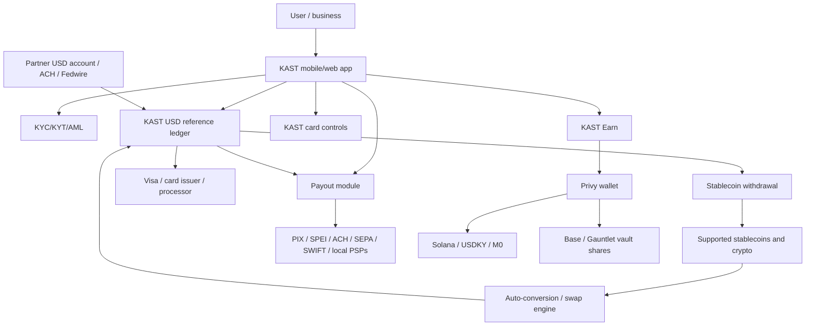

# KAST - Architecture

Date: 2026-05-08

This is an inferred architecture from public docs, support pages, terms, product pages, and funding announcements.

## One-frame architecture

## Product primitives

Likely primitives:

- User account.
- KYC profile.
- KAST Cash / USD reference balance.
- Custodian wallet or platform wallet.
- Virtual USD account details.
- Card object: virtual/physical card, PIN, freeze/unfreeze, limits.
- Stablecoin deposit address per token/network.
- Swap/conversion record.
- Fiat payout beneficiary.
- KAST Tag identity.
- Earn vault position.
- Rewards/cashback/points ledger.
- Compliance status and transaction risk score.

## Normal spending account custody model

The most important terms-language:

- If a user transfers stablecoins/virtual assets to KAST, that transfer is treated as a sale of the virtual assets to KAST.
- User loses ownership rights in the transferred virtual assets.
- KAST records a USD-denominated reference balance.
- The reference balance is not a fiat deposit, stored value, e-money, or claim against a bank unless expressly stated.
- KAST may use, pool, convert, transfer, pledge, rehypothecate, or otherwise deal with the virtual assets at its discretion.

That means the ordinary KAST balance behaves more like a custodial fintech ledger than a self-custodial wallet. The user sees USD, spends USD, and withdraws assets, but the legal asset relationship is not "I still own the exact stablecoins I deposited."

Source: [Terms](https://www.kast.xyz/legal/terms-and-conditions-of-service).

## USD account flow

Support docs say each eligible verified user can open one virtual USD account powered by partner "Leads Bank (USA)." The account supports ACH and Fedwire. Incoming funds are automatically credited to KAST Cash.

Flow:

1. User completes KYC.
2. KAST creates virtual USD account details.
3. User shares account/routing details with employer/client/platform.
4. ACH/Fedwire arrives at partner bank.
5. KAST credits KAST Cash balance.
6. User spends via card, sends payout, or withdraws.

Source: [USD account support page](https://concierge.kast.xyz/hc/en-us/articles/13971393267087-How-Do-I-Create-A-USD-Account-on-KAST).

## Stablecoin deposit and withdrawal flow

Supported deposits include:

- USDT: Ethereum, Tron, Solana, Polygon, Arbitrum, BNB Chain.
- USDC: Ethereum, Solana, Polygon, Arbitrum, Stellar.
- USDe: Ethereum, Solana.
- PYUSD: Ethereum, Solana.
- RLUSD: Ethereum, XRP Ledger.

Supported withdrawals are narrower:

- USDT: Ethereum, Tron, Solana.
- USDC: Ethereum, Solana, Arbitrum.

Flow:

1. User chooses token/network.
2. KAST shows deposit address or QR.
3. Blockchain transfer confirms.
4. KAST credits USD/stablecoin balance.
5. User can spend, send, or withdraw.

Source: [supported stablecoins](https://concierge.kast.xyz/hc/en-us/articles/11784729022863-Which-Stablecoins-Are-Supported-on-the-KAST-App).

## Crypto swap flow

Terms define swaps as exchanging supported virtual assets such as BTC/ETH into fiat-backed stablecoins such as USDT/USDC. Swaps may use KAST's internal liquidity pool, third-party liquidity providers, or affiliated counterparties, and may settle on-chain or off-chain. Conversion rate may include spread or service fee.

This is the likely path for BTC/ETH/SOL deposits that users want to spend through the card.

Source: [Terms](https://www.kast.xyz/legal/terms-and-conditions-of-service).

## Card spend flow

Flow:

1. User taps/swipes/uses card online.
2. Card issuer/processor sends authorization request.
3. KAST checks identity, fraud, balance, and risk.
4. KAST converts/settles from user balance as required.
5. Visa merchant authorization completes.
6. KAST deducts transaction amount, FX fees, and other applicable fees.
7. Rewards/cashback are credited if eligible.

KAST says cards are accepted wherever Visa is accepted, 150M merchants/ATMs, with FX fees of 0.5%-1.75% for non-USD spend.

Sources: [homepage](https://www.kast.xyz/), [fees page](https://concierge.kast.xyz/hc/en-us/articles/9850062738703-What-Are-the-Fees-and-Conditions-for-KAST-Cards-and-Accounts).

## Payout flow

KAST Pay / Global Payouts:

1. User funds KAST account with crypto, stablecoin, or local currency.
2. User selects recipient country/currency.
3. KAST quotes FX/fees.
4. Licensed PSPs execute local payout.
5. Recipient receives local currency in bank/payment rail.

KAST lists PIX, SPEI, ACH, SEPA, SWIFT, and more. Payout page claims 15+ currencies, 200+ countries, 25+ local rail countries, 99.9% success, and settlements in local accounts.

Source: [Global Payouts](https://www.kast.xyz/global-payouts).

## Earn flow

KAST Earn has two vaults:

- USD Prime Vault: up to 3.3% APY, USDKY powered by M0, backed by short-term U.S. Treasury Bill reserves, held in user's Privy wallet on Solana.
- Gauntlet Alpha Vault: up to 7.0% APY, stablecoin DeFi strategies on Base, vault shares held in user's Privy wallet on Base.

This is a different custody architecture from the normal KAST Cash balance. KAST says the assets/shares are held in the user's own Privy wallet.

Source: [KAST Earn](https://www.kast.xyz/earn).

## Business architecture

KAST Business is a waitlist/early access product. Public copy says:

- Global business accounts.
- Instant payouts worldwide.
- Team cards.
- Unlimited virtual cards with per-card/person/vendor controls.
- One view for dollars, USDC, and SOL.
- Payroll, payouts, cross-border spending.
- Cashback and cloud-service perks.

This overlaps directly with stablecoin CFO-stack products, but the current public page says applications are reviewed manually and the next wave opens early May.

Source: [Business](https://www.kast.xyz/business).

## Security/compliance stack

Publicly named security providers:

- Fireblocks.
- BitGo.
- Immunefi.
- Auth0.
- Twilio.

KAST says it performs identity verification, KYC/KYT/AML, sanctions/compliance checks, fraud scanning, and may freeze assets/accounts for compliance or risk reasons.

Sources: [About](https://www.kast.xyz/about), [Terms](https://www.kast.xyz/legal/terms-and-conditions-of-service).

## What is not public

- Card issuer and processor names on primary pages.
- Exact custody partner division of responsibility.
- Exact banking partner confirmation beyond support mention of "Leads Bank (USA)".
- Open API docs.
- Proof of reserves for USD reference balance.
- Exact USDKY token address/reserve attestation.
- Exact annualized volume calculation.
- Business product API/integration details.
