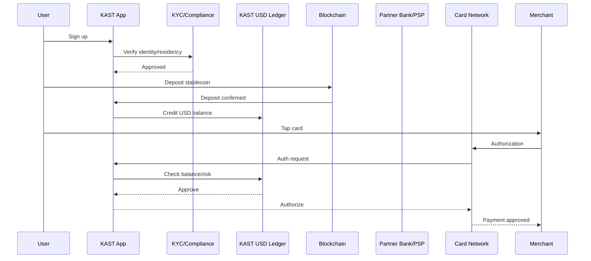

# KAST - Product Flow

Date: 2026-05-08

## Primary flow diagram

## Flow 1: User starts here

1. User downloads KAST.
2. User signs up with phone/email.
3. User completes KYC.
4. KAST checks country eligibility.
5. User gets access to wallet, account, and card features if approved.

## Flow 2: Stablecoin deposit

1. User taps Receive.
2. User selects stablecoin and network.
3. KAST displays address/QR.
4. User sends stablecoin from wallet/exchange.
5. KAST waits for blockchain confirmation.
6. KAST credits balance.
7. User can spend/send/withdraw.

Failure cases:

- Wrong network.
- Unsupported token.
- Compliance hold.
- Chain congestion.
- Funds lost or unrecoverable for unsupported deposits.

## Flow 3: Crypto deposit and auto-conversion

1. User deposits BTC/ETH/SOL or other supported non-stable crypto.
2. KAST performs auto-conversion to stablecoin/USD balance.
3. KAST charges auto-conversion fee/spread where applicable.
4. User sees spendable USD balance.

Terms say swaps may use KAST internal liquidity pool, third-party liquidity providers, or affiliated counterparties.

## Flow 4: USD account deposit

1. User opens Accounts in app.
2. User copies USD account/routing details.
3. Client/employer/platform sends ACH or Fedwire.
4. Partner bank receives funds.
5. KAST credits KAST Cash.
6. User spends or transfers.

Failure cases:

- Non-USD transfer.
- Wrong account details.
- Unsupported sender/platform.
- Intermediary bank delay.
- Compliance review.

## Flow 5: Card spend

1. User gets virtual/physical Visa card.
2. User pays merchant.
3. Merchant submits authorization.
4. KAST/issuer checks balance, fraud, country, merchant category, and compliance.
5. KAST authorizes or declines.
6. KAST deducts balance and FX/fees.
7. Cashback/points are applied if eligible.

Failure cases:

- Insufficient balance.
- Country/merchant restriction.
- Card network decline.
- Fraud trigger.
- Partner outage.
- Account frozen.

## Flow 6: Local payout

1. User chooses payout country/currency.
2. User enters recipient details.
3. KAST displays fees/FX.
4. User confirms.
5. Licensed PSP executes payout.
6. Recipient receives local currency.

Failure cases:

- Beneficiary details wrong.
- PSP rejects.
- Local rail unavailable.
- FX quote expires.
- Compliance hold.

## Flow 7: Earn

1. User opens Earn.
2. User chooses USD Prime or Gauntlet Alpha.
3. User deposits funds.
4. USD Prime converts into USDKY on Solana.
5. Gauntlet Alpha issues vault shares on Base.
6. Assets/shares are held in user's Privy wallet.
7. User withdraws when wanted, subject to product mechanics.

Failure cases:

- Smart contract risk.
- Treasury/reserve risk.
- DeFi strategy loss.
- Chain outage.
- Liquidity delay.
- Privy/account access issue.

## Flow 8: Business

1. Business requests access.
2. KAST reviews application by hand.
3. Business receives accounts/cards/payout tools if approved.
4. Business pays contractors/vendors/team members.
5. Business manages virtual card controls.
6. Business later may connect finance tools/integrations.

Status:

Early access/waitlist, not fully self-serve based on public page.
