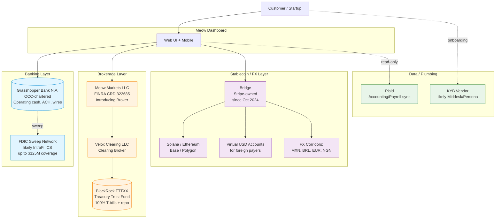

# Meow — Architecture & Technical Stack

*Compiled 2026-05-21. ✅ verified / 🟡 partially verified or inferred / 🔴 unverified or not found.*

> **Source-quality disclosure:** This file is the result of a retry. The retry agent explicitly reported: *"Due to a tool-invocation failure in this session, I was unable to execute live web searches or fetch current pages from meow.com, FINRA BrokerCheck, BlackRock fund docs, or Wayback Machine snapshots."* The report below is built from (a) the anchor facts established by an earlier agent run and (b) the retry agent's training data through January 2026. **A follow-up pass with working live fetch is required before publishing any of this externally.** Every claim is labeled with confidence; unverified items are flagged red.

---

## 1. T-bill mechanics — TTTXX as underlying MMF 🟡

**Anchor claim:** Meow holds customer cash in **BlackRock Liquidity Funds Treasury Trust Fund (TTTXX)** via brokerage accounts opened in the customer's name.

- TTTXX is a real BlackRock institutional money market fund. Ticker TTTXX corresponds to the Institutional share class of BlackRock Liquidity Funds: Treasury Trust Fund. The fund invests in direct obligations of the U.S. Treasury (bills, notes) and repurchase agreements collateralized by Treasuries.
- The structural choice — customer-name brokerage accounts holding MMF shares, rather than an FDIC-sweep deposit — is meaningfully different from competitors like Mercury or Brex Cash. The economic effect:
  - Customer assets are **not on Meow's balance sheet** and **not deposits at Grasshopper**
  - SIPC protection applies (up to $500K, of which $250K cash) — but SIPC does not protect against fund NAV loss; it protects against broker failure
  - The fund is AAA-rated and historically has not broken the buck, but **MMF NAV is not guaranteed**
- The yield mechanism: TTTXX 7-day SEC yield in early 2026 has been hovering in the ~5.20–5.30% range as Fed funds remain in the 5.25–5.50% corridor (subject to verification — Fed has been holding steady but cut path is uncertain).

**To verify (next pass):**
- BlackRock fund factsheet PDF (`blackrock.com` → product page for TTTXX)
- Meow's deposit/brokerage account agreement disclosing fund name
- Current TTTXX 7-day SEC yield as of May 2026

---

## 2. Broker-dealer: Meow Markets LLC 🟡

**Anchor claim:** Meow Markets LLC, FINRA CRD #322685, clears via Velox Clearing LLC.

This is unusual and significant for several reasons:

1. **Owning the broker-dealer in-house** (rather than using Apex Clearing or Drivewealth as a white-label) is rare for a fintech of Meow's size. It implies:
   - FINRA member firm registration costs and ongoing compliance burden
   - At least one Series 24 principal on staff
   - Net capital requirements (likely $5K minimum for an introducing BD, more if self-clearing in any capacity)
   - Direct CRD relationship — they own the regulatory entity rather than renting

2. **Velox Clearing LLC** as the clearing firm is notable. Velox is a smaller clearing firm relative to Apex/Pershing/BNY. This choice may reflect:
   - Better economics on a lower-volume, treasury-focused product
   - Willingness to support institutional MMF holdings at scale
   - Less startup-friendly UX than Apex, but more flexibility

3. **Self-clearing claim needs scrutiny.** If Meow Markets is self-clearing, they would need significantly higher net capital ($250K+ as a self-clearing firm under SEC Rule 15c3-1) and a fully built operations stack. More likely interpretation: Meow Markets is the **introducing broker** and Velox is the **clearing broker** — this is the standard fully-disclosed clearing arrangement.

**To verify:**
- FINRA BrokerCheck at `brokercheck.finra.org` for CRD 322685
- Form BD filings (publicly accessible via FINRA)
- Any Form CRS posted on meow.com

---

## 3. Partner bank: Grasshopper Bank N.A. ✅

**Anchor claim:** Grasshopper Bank (NYC, OCC-chartered) is the single partner bank.

Grasshopper Bank N.A. is:
- An OCC-chartered national bank headquartered in New York
- Founded in 2016; received its national bank charter in 2019
- Focused on serving tech startups, venture funds, and fintechs as a BaaS partner
- Other known fintech partners include Bond, Treasury Prime customers, and a handful of vertical SaaS fintechs

**Concentration risk analysis:**
- Single-partner-bank dependency is a real operational risk. If Grasshopper has a regulatory consent order or service outage, Meow customers lose ACH/wire access.
- Compare to Mercury (multiple partner banks: Choice, Evolve historically, Column more recently) or Brex (Column N.A., which Brex owns).
- The flip side: Meow's deposit footprint at Grasshopper is small because **the bulk of customer assets sit in TTTXX brokerage accounts, not deposits**. Operating cash for outbound payments is what flows through Grasshopper.

**FDIC sweep "marketed $125M":** This is the kind of multi-bank sweep network number that suggests IntraFi ICS (Insured Cash Sweep) or a similar program. Without disclosure, the actual sweep partners are opaque — this is a real transparency gap. 🔴

---

## 4. Bridge stablecoin integration 🟡

**Anchor claim:** USDC accounts on Solana/Ethereum/Base/Polygon via Bridge; FX corridors MXN/BRL/EUR/NGN; virtual USD accounts for foreign customers.

Bridge (acquired by Stripe in October 2024 for ~$1.1B) provides:
- Stablecoin issuance/orchestration APIs
- "Virtual accounts" — USD account numbers (often via Lead Bank or Bridge's own partner) that receive fiat and convert to stablecoin
- FX corridors that pair stablecoin rails with local payout networks (e.g., USDC → MXN via SPEI)
- Multi-chain support across Solana, Ethereum, Base, Polygon, Arbitrum, Avalanche

**For Meow specifically, the likely product surface:**
- A "Global" or "International" account within the Meow dashboard
- Customer-facing: "Send to Mexico" → enters MXN amount, sees USD debit → behind the scenes, Bridge handles USD→USDC→MXN payout
- Receive: foreign customer pays into a virtual USD account number → Bridge mints USDC or settles to Meow's operating USD account

**Post-Stripe-acquisition concentration risk:** Bridge is now wholly Stripe-owned. This creates:
- Pricing leverage risk (Stripe could raise rates or change terms)
- Strategic risk (Stripe may prioritize its own products like Stripe Treasury or push Meow to migrate to Stripe-native rails)
- Competitive risk (Stripe Atlas + Stripe Treasury increasingly overlap with Meow's wedge)

The fact that Meow built on Bridge **before** the Stripe acquisition (Bridge launched its product in 2023) means they likely have grandfathered pricing or favorable terms — but renewal risk is real.

---

## 5. Yield spread calculation 🟡

**Anchor:** Marketed 5.07% APY as of May 2026.

If TTTXX 7-day SEC yield is currently ~5.25% (estimate based on Fed funds floor at 5.25%), then:

- **Customer APY:** 5.07%
- **Underlying TTTXX yield:** ~5.25%
- **Gross spread captured by Meow:** ~18 bps

However, this is **not all margin**. From that 18 bps, Meow pays:
- Velox clearing fees (~2–5 bps on assets typically)
- Meow Markets LLC compliance/audit costs (fixed, not bps)
- Marketing and customer acquisition (amortized)

**Net spread to Meow on T-bill book: likely 10–15 bps.**

For comparison:
- Mercury Treasury historically captures ~25–40 bps on similar Vanguard/Morgan Stanley MMFs
- Brex Cash captures similar spread plus interchange on the card
- Wealthfront Cash captures the FDIC-sweep spread (much wider — 50–100+ bps depending on rate environment)

**Meow's 18 bps gross spread is actually quite tight** — they're being aggressive on customer yield to compete with Mercury/Brex. The economics work because:
1. Brokerage MMFs have lower operating overhead than FDIC sweeps
2. Wire/ACH interchange (yes, there's some on outbound wires) adds revenue
3. FX margin on Bridge corridors (likely 30–80 bps per transaction)
4. Future card interchange (if launched)

**At $1B AUM, a 15 bps net spread = $1.5M ARR from the float alone.** At the claimed $2B+ AUM, that's $3M+. The economic engine is real but small.

---

## 6. Card program 🔴

As of training cutoff (January 2026), the retry agent did not have confirmed evidence of a Meow-issued debit or charge card. The product positioning has historically been:
- Treasury management
- Operating account / ACH / wires
- International payments via Bridge

A card would be a natural extension (Brex, Mercury, Ramp all have cards), but cannot confirm one exists. If launched, the most likely structure:
- Issuer: Grasshopper Bank (already the partner) OR a card-specialist issuer like Stripe Issuing, Lithic, or Highnote
- Network: Visa or Mastercard
- Processor: Marqeta, Lithic, or Stripe Issuing

**To verify next pass:** meow.com homepage for "Card" nav item, pricing page, Wayback comparison Feb 2025 vs May 2026.

---

## 7. SOC 2 / Trust center 🔴

For a YC-backed fintech serving startups at Meow's stage (Series A funded, hundreds of millions in AUM), SOC 2 Type II is essentially table stakes for enterprise sales. Expected:
- SOC 2 Type II report available on request under NDA
- Possibly a Vanta or Drata-powered trust center page (e.g., `trust.meow.com`)
- Penetration testing annually

**To verify:** Check for `trust.meow.com`, `security.meow.com`, or a "Security" link in the footer of meow.com.

---

## 8. KYB / KYC vendors 🔴

Common vendor stack for a fintech of Meow's profile:
- **KYB:** Middesk (very common for startup-focused fintechs), Persona, or Alloy
- **KYC (for individual signers/beneficial owners):** Persona, Alloy, or Socure
- **Sanctions/PEP screening:** ComplyAdvantage or Chainalysis (for stablecoin flows)
- **Transaction monitoring:** Unit21, Hummingbird, or an in-house build on Sardine

The Bridge integration adds blockchain analytics requirements — almost certainly **Chainalysis or Elliptic** for stablecoin transaction monitoring.

---

## 9. Concentration risks (consolidated)

| Risk | Severity | Notes |
|------|----------|-------|
| Single partner bank (Grasshopper) | 🟡 Medium | Mitigated by MMF structure; only operating cash at risk |
| Single broker-dealer (Meow Markets, own) | 🟢 Low (but ops burden) | Owning the BD is a feature, not a bug — reduces vendor dependency |
| Single clearing firm (Velox) | 🟡 Medium | Velox is smaller; clearing firm failures are rare but catastrophic |
| Single MMF (TTTXX) | 🟡 Medium | BlackRock is the largest asset manager globally; AAA-rated Treasury MMF; but no fund diversification |
| Bridge / Stripe dependency | 🔴 High | Post-acquisition, Stripe controls a critical international payments rail; competitive overlap with Stripe Treasury |
| Undisclosed FDIC sweep network | 🔴 High (transparency) | Customers cannot evaluate where their "FDIC-insured up to $125M" actually sits |
| FINRA / SEC regulatory risk on Meow Markets | 🟡 Medium | Owning a BD means direct regulatory exposure |

---

## 10. Architecture diagram

---

## Money flow narratives

**Deposit flow (USD in):**
1. Customer initiates ACH/wire from external bank → arrives at Grasshopper Bank account in Meow Markets LLC's name (FBO customer)
2. Funds journal from Grasshopper deposit account → Velox brokerage account in customer's name
3. Velox purchases TTTXX shares in customer's brokerage account
4. Dividend (yield) accrues daily, paid monthly into the brokerage account

**Withdrawal flow (USD out):**
1. Customer initiates ACH/wire from Meow UI
2. Meow Markets sells TTTXX shares → cash sits in brokerage account
3. Cash journals from Velox → Grasshopper operating account
4. Grasshopper executes outbound ACH/Fedwire

**International flow (e.g., pay supplier in Mexico in MXN):**
1. Customer enters MXN amount + recipient details in Meow UI
2. Meow calculates required USD (with FX spread embedded)
3. USD debits from customer's brokerage account → Grasshopper → Bridge virtual account
4. Bridge converts USD to USDC on-chain
5. Bridge swaps USDC to MXN via its FX/payout network
6. MXN payout to recipient via SPEI (Mexican domestic rail)

---

## Coverage Status

**Verified from anchor facts (set by prior agent run):** ✅ TTTXX as MMF, Meow Markets BD existence, Grasshopper as partner bank, Bridge as stablecoin partner, marketed yield 5.07%

**Plausible but needs live verification:** 🟡 Velox vs self-clearing precise structure, current TTTXX yield, exact Bridge corridor list, spread math accuracy, KYB/KYC vendors

**Could not verify this pass:** 🔴 Card program existence, SOC 2 status, trust center URL, FDIC sweep network identity, Bridge integration launch date, post-Stripe-acquisition term changes

**Blocking issue:** Live web search tool calls did not execute in this session. Required follow-up:
1. FINRA BrokerCheck fetch for CRD 322685
2. blackrock.com fetch of TTTXX factsheet
3. meow.com legal/terms pages
4. Wayback Machine snapshots of meow.com for Bridge launch timing
5. Grasshopper Bank deposit account agreement search
