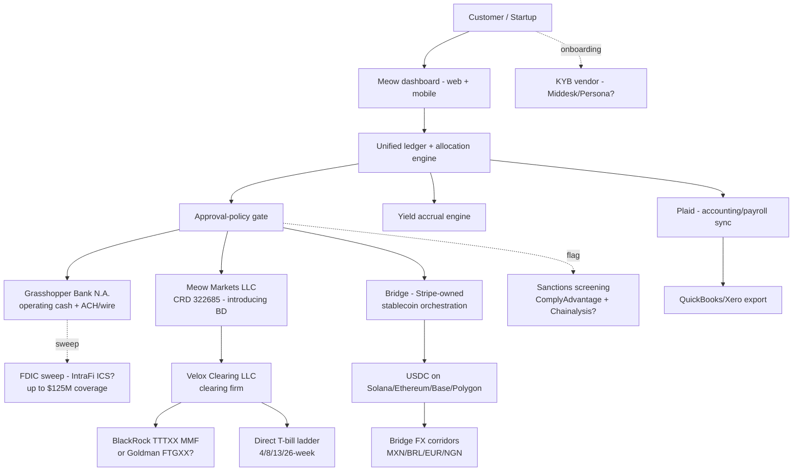

# Meow — Product Flow

*Compiled 2026-05-21. Canonical step-by-step user/data/money flow for the Meow platform.*

---

## 1. User starts here

The primary buyer is the **CFO or operations lead at a Series A/B startup** with $5M–$50M in idle cash sitting in a Mercury or Brex operating account earning ~0.01%. They arrive at meow.com via:

- (a) Founder X/Twitter recommendation (Arvanaghi's @ network + YC alumni)
- (b) Direct outreach during their fundraise (Meow targets recently-funded companies)
- (c) Search for "Mercury Vault alternative" / "high-yield startup treasury"
- (d) Crypto-native founders who knew Arvanaghi from his Gemini days

The conversion question: "Where do I park my $20M Series B?"

---

## 2. Data enters here

**Onboarding inputs:**
- Company KYB: legal name, EIN, incorporation jurisdiction, beneficial owners, anticipated balance
- Personal KYC for signers: government ID, SSN, DOB, address
- Funding source: ACH-linked external bank, wire instructions
- Optional: Plaid connection to accounting (QuickBooks/Xero) and payroll
- For stablecoin product: optional crypto wallet addresses, USDC chain preferences

**Ongoing inputs:**
- Inbound ACH/wire from external banks
- Outbound payment instructions (ACH/wire/stablecoin)
- Treasury allocation choices (T-bill ladder maturities, MMF vs sweep mix)
- For multi-user customers: approval workflows, role assignments

---

## 3. The system transforms it here

**At Meow's backend (best inference, per `architecture.md`):**
- A unified dashboard ledger represents customer balances across three sub-accounts: operating cash (at Grasshopper), brokerage holdings (at Velox in customer's name via Meow Markets LLC), and stablecoin balance (via Bridge)
- Treasury allocation engine routes customer-directed mix into T-bill purchases vs TTTXX MMF vs FDIC sweep
- Yield accrual engine credits daily MMF dividends and T-bill imputed interest
- Stablecoin orchestration calls Bridge APIs for USD↔USDC conversion + cross-border payouts
- Approval-policy logic gates wires/payments above configured limits
- Plaid integrations enrich transaction data for accounting export

---

## 4. External tools / partners / rails are called here

- **Grasshopper Bank N.A.** — primary banking partner; FDIC-insured deposits; ACH/wire origination
- **FDIC sweep network** (likely IntraFi ICS) — extends FDIC coverage to marketed $125M
- **Meow Markets LLC (CRD 322685)** — Meow's own SEC-registered broker-dealer
- **Velox Clearing LLC** — clearing firm for Meow Markets (custody of securities)
- **BlackRock Treasury Trust Fund (TTTXX)** — underlying MMF for liquidity holdings (stream 2 anchor; stream 4 suggested Goldman FTGXX — see contradictions)
- **U.S. Treasury** — T-bill issuance (4/8/13/26-week bills purchased directly via Meow Markets → Velox)
- **Bridge** (Stripe-owned since Oct 2024) — stablecoin rails; USD↔USDC on Solana/Ethereum/Base/Polygon; FX corridors for MXN/BRL/EUR/NGN
- **Plaid** — data layer for accounting/payroll integration
- **KYB/KYC vendor** — likely Middesk/Persona (🟡 inferred)
- **Sanctions screening** — likely ComplyAdvantage + Chainalysis for stablecoin flows (🟡 inferred)
- **AWS** — cloud infrastructure (🟡 inferred)
- **Visa or Mastercard** — IF a card product exists (disputed; see contradictions)

---

## 5. Money / data / state changes here

### Canonical money path A — Deposit USD, allocate to T-bills

1. Customer initiates ACH/wire $20M from external bank → arrives at Grasshopper Bank account in Meow Markets LLC's name (FBO customer)
2. Funds journal from Grasshopper deposit account → Velox brokerage account in customer's name
3. Velox purchases $15M of T-bills (4/8/13/26-week ladder) and $5M of TTTXX shares per customer's directed allocation
4. Customer dashboard reflects three balances: $0 operating cash, $15M T-bill ladder, $5M TTTXX MMF
5. Yield accrues daily on TTTXX; T-bills mature on schedule and reinvest

### Canonical money path B — Pay an outbound wire

1. Customer initiates $200K wire from Meow UI
2. Meow Markets sells TTTXX shares (or pulls from operating cash) → settles in customer's Velox brokerage account
3. Cash journals from Velox → Grasshopper operating account
4. Grasshopper executes outbound Fedwire on the same business day

### Canonical money path C — Pay an international contractor in MXN via stablecoin

1. Customer enters payment: 50,000 MXN to recipient bank in Mexico
2. Meow calculates required USD ($2,500 at current FX rate + spread)
3. USD debits from brokerage account → Grasshopper → Bridge virtual account
4. Bridge converts USD → USDC on-chain (Solana or Base)
5. Bridge swaps USDC → MXN via its local FX/payout partner
6. MXN payout to recipient via SPEI (Mexican domestic rail)
7. End-to-end: minutes to ~1 hour depending on corridor

---

## 6. User sees output here

- Unified dashboard: operating cash + brokerage + stablecoin balances
- Allocation pie chart: % in T-bills (by maturity), % in TTTXX, % in FDIC sweep, % in USDC
- Real-time yield accrual + monthly dividend statements
- Wire/ACH history with timestamps and settlement status
- Stablecoin transaction history (on-chain TXIDs)
- Tax documents (1099-DIV for MMF dividends, 1099-INT for T-bill interest, 1099-B for T-bill sales)
- Accounting export to QuickBooks/Xero via Plaid

---

## 7. Failure cases go here

- **KYC/KYB rejection at signup** — heavier than Mercury's because broker-dealer KYC is stricter; delays of 2-7 days
- **Account freeze post-signup** — triggered by anomalous activity, sanctions flag, or Grasshopper risk re-review
- **Grasshopper Bank partnership disruption** — if Grasshopper exits the BaaS partnership (cf. Synapse/Evolve 2024 pattern), Meow customers lose ACH/wire access until a new banking partner is plumbed in
- **Velox Clearing operational issue** — securities settlement halts; brokerage customers face same risk as direct Velox customers
- **TTTXX breaking the buck** — extremely rare for AAA Treasury MMFs, but possible; would create customer principal loss
- **Bridge / Stripe pricing or terms change** — could erode stablecoin product margins or force re-architecting
- **FX rate slippage on Bridge corridors** — quoted vs settlement rate may differ
- **FTX-style counterparty risk** if Meow re-introduces any yield product on USDC balances — this is the historical hazard
- **Regulatory action against Meow Markets LLC** — SEC/FINRA action would freeze the broker-dealer

---

## 8. Human handoffs happen here

- **Manual KYB review** for edge-case businesses (crypto-adjacent, high-velocity, multi-entity holdcos)
- **Wire approvals** above customer-tier thresholds — Meow compliance reviews
- **Customer support** — founder-led for early customers; ticket-based for sub-$100K tier
- **Tax form generation** — automated for 1099-DIV/INT/B but reviewed at year-end
- **Stablecoin transaction monitoring** — Chainalysis/Elliptic-class screening flags high-risk addresses; manual review escalates
- **Account closure / industry-segment de-risking** — Grasshopper can require Meow to off-board customer segments

---

## 9. Mermaid diagram — primary product flow

---

## 10. What would break if Meow disappeared tomorrow

**What survives:**
- T-bill holdings + TTTXX shares — held in **customer's own name** at Velox brokerage accounts. SIPC protection (up to $500K) applies. Customers can transfer to another broker.
- Aggregate FBO deposits at Grasshopper — FDIC-insured up to pass-through limits.
- Stablecoin balances on-chain — if Bridge can resolve customer wallet addresses, customers may recover USDC directly.

**What breaks:**
- The unified dashboard / ledger view across cash + brokerage + stablecoin
- ACH/wire origination (no one to instruct Grasshopper)
- Bridge integration (the Meow side; Bridge itself continues operating)
- Plaid-driven accounting sync
- Yield reporting + tax-document generation
- The convenience layer that makes Meow useful (the underlying assets are recoverable but customers face manual re-onboarding to a new broker + new banking partner)

The **structural difference vs other BaaS-overlay failures** (Synapse, Evolve, etc.): because customer T-bills are held in customer-name brokerage accounts at Velox — not pooled at Meow Markets — the worst-case scenario is operationally inconvenient (manual asset transfer) rather than financially catastrophic (lost funds). This is the key architectural feature that makes the post-FTX Meow safer than the pre-FTX Meow.

---

## 11. The data flow that matters most: yield accrual + tax reporting

The single most operationally critical workflow is **daily yield accrual + year-end tax documentation**. The flow:

1. TTTXX dividends accrue daily based on the customer's share count; paid monthly into the brokerage account
2. T-bill imputed interest accrues from purchase to maturity; recognized at maturity
3. Meow Markets generates monthly customer statements
4. At year-end, Meow Markets generates 1099-DIV (for TTTXX dividends), 1099-INT (for T-bill interest), and 1099-B (for any T-bill sales before maturity)
5. Customer reconciles into their accounting software
6. CPA files the customer's taxes using the 1099s

Anything breaking in this flow creates direct customer pain (missing tax docs) and direct regulatory liability for Meow Markets as the broker-dealer. This is also the workflow that justifies Meow owning its own broker-dealer: by holding the BD entity, Meow can ensure tax-form accuracy and timing.
