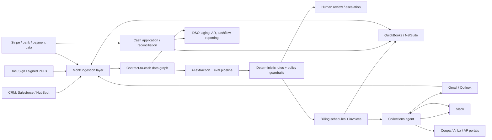
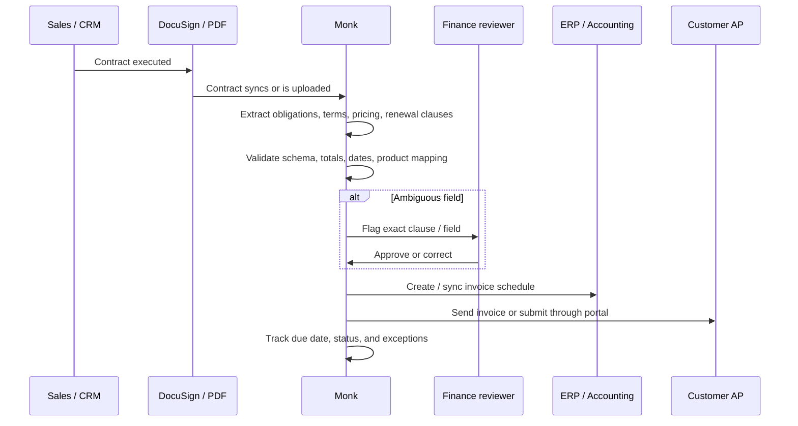
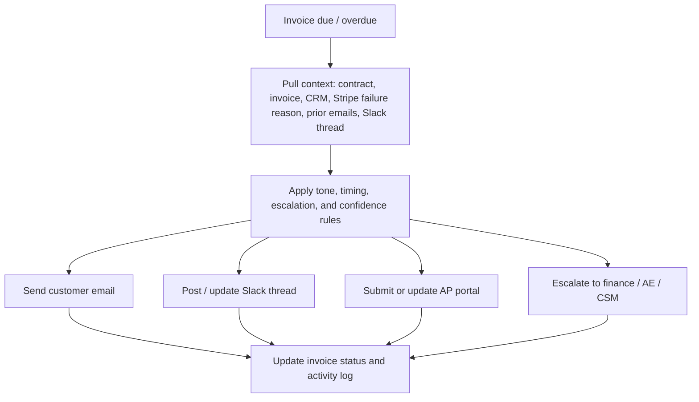

# Monk Architecture

Date: 2026-05-04

## What Monk Actually Sells

✅ **Monk sells an AI-native accounts receivable platform, not a payments rail or bank account.** The product sits on top of existing CRM, contract, ERP/accounting, payment, email, Slack, and AP-portal workflows. It ingests contracts and customer/payment data, generates billing schedules and invoices, automates follow-up, resolves exceptions, reconciles payment status, and produces AR/cashflow reporting. [Homepage](https://monk.com/), [AR Automation](https://monk.com/platform/automation), [Integrations](https://monk.com/platform/integrations)

The current SKU surface is:

| Product area | What it does | Evidence |
|---|---|---|
| AR Automation | Contract-to-cash and invoice-to-cash workflow automation | ✅ [AR Automation](https://monk.com/platform/automation) |
| Intelligent Collections | Context-aware follow-up and escalation on overdue invoices | ✅ [Intelligent Collections](https://monk.com/platform/intelligent-collections) |
| Integrations | Syncs data with ERP/accounting, CRM, payments, tax, Slack, Gmail, DocuSign | ✅ [Integrations](https://monk.com/platform/integrations) |
| Security | SOC 2, encryption, MFA/2FA, RBAC, data governance | ✅ [Security](https://monk.com/platform/security) |
| Billing engine | Contract adjustments, usage billing, meters, rate cards, credit wallet, invoice drawer | 🟡 Visible in changelog; formal packaging not public. [Changelog](https://monk.com/changelog) |
| Cash application | Remittance/payment matching and posting logic | 🟡 Described in blog and changelog, but not clearly shown as separately priced SKU. [Cash Application](https://monk.com/blog/one-day-cash-application-automating-remittance-matching-for-the-ai-era), [Changelog](https://monk.com/changelog) |
| Developer/API surface | Public REST API, API keys, invoice/customer queries, pricing estimate API, webhooks beta | 🟡 Claimed in changelog; public developer portal/OpenAPI spec not found. [Changelog](https://monk.com/changelog) |

## System Map

## Contract Processing Pipeline

✅ **Monk's core technical claim is semantic contract comprehension rather than simple OCR.** It says the system identifies billing-relevant fields such as counterparty info, ASC 606 performance obligations, pricing structures, payment terms, renewal clauses, and amendment conditions, then maps those obligations into product catalogs and billing schedules. [Reinventing contract-to-cash](https://monk.com/blog/reinventing-contract-to-cash-with-ai)

✅ **Ingestion sources include manual uploads, Salesforce, HubSpot, and DocuSign.** Monk says documents can be uploaded directly or triggered automatically from CRM/e-signature systems. [Reinventing contract-to-cash](https://monk.com/blog/reinventing-contract-to-cash-with-ai), [DocuSign integration](https://monk.com/integrations/docusign), [HubSpot integration](https://monk.com/integrations/hubspot)

✅ **Extraction is ensemble-based and eval-gated.** Monk says it uses multiple frontier models for reasoning, raw extraction, amendments, and fallback; Braintrust is named as the eval/observability layer; changes are regression-tested against annotated contracts before production. [Reinventing contract-to-cash](https://monk.com/blog/reinventing-contract-to-cash-with-ai)

✅ **Guardrails are hybrid: probabilistic extraction plus deterministic checks.** Monk describes schema validation, cross-field consistency checks, confidence scoring, human-in-the-loop routing, and deterministic business rules layered on model outputs. [Reinventing contract-to-cash](https://monk.com/blog/reinventing-contract-to-cash-with-ai)

🔴 **The precise models, data retention policy by provider, and eval dataset size are not public.** Monk says "frontier models" and "thousands of edge cases" in public claims, but does not publish a model/provider matrix, benchmark dataset, or accuracy methodology.

## Contract-To-Invoice Flow

✅ **Monk says it can handle hybrid pricing, usage-based overages, tiered pricing, flat fees, milestones, amendments, proration, and invoice schedule generation.** This is exactly where traditional billing/CPQ tools often force manual workarounds. [Reinventing contract-to-cash](https://monk.com/blog/reinventing-contract-to-cash-with-ai)

🟡 **The changelog implies a deeper billing engine than the marketing pages show.** Public changelog entries reference contract adjustments, product add/remove flows, quantity/price changes, term extensions, proration previews, regenerated invoices, credit memos, dimensional pricing, graduated rate cards, meters, usage-event CSV backfills, sub-cent precision, prepaid credit wallets, invoice drawers, and revenue-recognition schedules. This is stronger product breadth than a pure AR follow-up tool, but the changelog does not reveal pricing tiers, API docs, or production adoption by feature. [Changelog](https://monk.com/changelog)

🟡 **The best-supported customer proof is Rubie and Profound.** Rubie says signed contracts are uploaded into Monk, billing terms are parsed, invoice schedules are generated, invoices are sent, and collections/reconciliation are automated. Profound says Monk connected HubSpot and QuickBooks and automated submissions to Coupa, Ariba, and bespoke F500 AP portals. These are vendor-published case studies, but concrete. [Rubie](https://monk.com/case-study/rubie), [Profound](https://monk.com/case-study/profound)

## Collections Engine

✅ **Monk's collections agent is positioned as more than dunning email.** It uses customer context, invoice/payment status, tone rules, escalation thresholds, and payment failure data to decide what to ask and where to route the issue. [Homepage](https://monk.com/), [Unify](https://monk.com/case-study/unify), [Slack Collections](https://monk.com/blog/intelligent-collections-in-slack)

✅ **The collections surface includes email and Slack.** Monk says Slack-native collections combine customer threads, invoice status, payment confirmations, and dispute resolution in the customer's Slack channel. [Slack Collections](https://monk.com/blog/intelligent-collections-in-slack)

✅ **The Slack workflow required multi-source event orchestration.** Monk says one Slack collections workflow can receive events from Stripe, Gmail/Outlook, Monk's agent engine, and the customer's ERP, and that it built Stripe-to-Slack identity mapping with exact domain match, fuzzy company-name match, and fallback metadata injection. [Slack Collections](https://monk.com/blog/intelligent-collections-in-slack)

## Integrations

✅ **First-class integrations listed by Monk:** Salesforce, QuickBooks, HubSpot, Stripe, Anrok, NetSuite, Slack, Gmail, and DocuSign. The changelog also references GoCardless and Mercury-related payment/bank sync work. [Integrations](https://monk.com/platform/integrations), [Changelog](https://monk.com/changelog)

✅ **Monk claims accounting integrations have two-way validation sync.** It describes each integration as a "first-order object" in the Monk data graph, with 1:1 data mapping, conflict rules, and drift detection. [Integrations](https://monk.com/platform/integrations)

🟡 **Portal automation is partly product, partly service.** Monk repeatedly says it handles Coupa, Ariba, AP portals, W9s, bank letters, vendor setup, custom email support, and phone-based verification. The important unknown is how much of this is autonomous software versus Monk staff operating around the product. [Homepage](https://monk.com/), [Profound](https://monk.com/case-study/profound)

## Data Model

🟡 **Inferred data graph objects:**

| Object | Why it likely exists |
|---|---|
| Customer / account | CRM, ERP, Stripe, and collections routing require a canonical customer. |
| Contract | Contract upload/sync, extraction, amendments, audit logs. |
| Performance obligation | Monk explicitly maps billing-relevant obligations. |
| Product catalog / rate card mapping | Needed to turn extracted terms into invoices. |
| Invoice / invoice line | Invoice generation, status tracking, reconciliation. |
| Payment / remittance | Cash application, Stripe matching, bank matching. |
| Collection thread | Email/Slack workflow and activity log. |
| Exception / escalation | Missing PO, W9, approver out, portal issue. |
| Audit event | Audit log tracks contracts, invoices, amendments, comments. |
| Meter / usage event / rate card | Changelog references usage-based billing, meters, rate cards, dimensions, and event backfills. |
| Credit wallet / credit memo | Changelog references prepaid credits, expiration, breakage recognition, credit memos, and accounting impact. |

✅ **Audit logs are a real product feature.** Monk says the audit log tracks history for contracts, invoices, amendments, and comments, and distinguishes system actions from user actions. [Audit Log](https://monk.com/blog/upgrade-on-monk-audit-log)

## Security And Compliance

✅ **Monk claims SOC 2 compliance for Security, Availability, and Confidentiality, with the audit performed by Sensiba.** Customers can request the SOC 2 report and pen-test report by emailing the team. [Security](https://monk.com/platform/security)

✅ **Security controls listed publicly:** AES-256 encryption at rest, TLS in transit, mandatory 2FA, role-based access, least-privilege access, zero-trust networking, endpoint security, SSO/MFA, data minimization, and data stored in the United States. [Security](https://monk.com/platform/security)

✅ **Data-use claim:** Monk says customer data is not sold, is used only for AR workflows and account performance, can be deleted, and is not used to train models. [Homepage](https://monk.com/), [Security](https://monk.com/platform/security)

✅ **DPA exists and names the legal processor as Endurance Solutions Inc. d/b/a Monk.** It covers GDPR, UK GDPR, Swiss FADP, CCPA/CPRA, SCCs, breach notice, return/deletion, subprocessors, and third-party security reports on request. [DPA](https://monk.com/data-processing-addendum)

🟡 **Terms grant data rights only as needed to provide services, but the language deserves enterprise review.** Terms say Monk can collect, store, transmit, modify, and create derivative works of customer data to provide the service; user-generated content language also mentions improving services. That is not automatically inconsistent with "not used to train models," but buyers should verify the order form, DPA, and model-provider terms. [Terms](https://monk.com/terms-of-service), [DPA](https://monk.com/data-processing-addendum)

🔴 **Missing public artifacts:** no public SOC 2 report, public trust center, subprocessor list, model-provider retention matrix, uptime page, incident history, or public security whitepaper found.

## Developer Experience

🟡 **The changelog claims a developer/API surface exists, but it appears gated or not easily discoverable.** Public entries reference a REST API, API keys from Settings, programmatic customer and invoice queries, pagination/filtering, a pricing estimate API, meter/plan/pricing endpoints, contract creation with pricing overrides, and webhook beta events for invoice created/updated with signatures and retries. [Changelog](https://monk.com/changelog)

🔴 **Still not verified publicly:** API base URL, auth details, OpenAPI spec, SDKs, webhook catalog, sandbox/test environment, rate limits, and developer portal URL. Search results for `docs.monk.io` point to an unrelated Monk DevOps product, not monk.com.

## Architecture Verdict

✅ **Most credible technical moat:** reliability engineering around messy financial workflows: evals, structured extraction, deterministic guardrails, integration graph, and auditability.

🟡 **Most important unresolved architecture question:** how much of the product is truly automated versus enabled by a high-touch services layer. The product says "AI agents"; the operating model says "dedicated Slack channel," "staffed to ensure accuracy," "dedicated internal resources own each integration," and "7D/week support." Both can be true, but the margin/scaling profile depends on the ratio.

🔴 **Biggest buyer diligence request:** ask for a live walkthrough of one messy contract and one overdue invoice from ingestion through ERP writeback, including model confidence, audit logs, human-review points, and rollback behavior.

## Source List

- Homepage: https://monk.com/
- AR Automation: https://monk.com/platform/automation
- Intelligent Collections: https://monk.com/platform/intelligent-collections
- Integrations: https://monk.com/platform/integrations
- Security: https://monk.com/platform/security
- DocuSign integration: https://monk.com/integrations/docusign
- HubSpot integration: https://monk.com/integrations/hubspot
- Reinventing contract-to-cash: https://monk.com/blog/reinventing-contract-to-cash-with-ai
- Slack collections: https://monk.com/blog/intelligent-collections-in-slack
- Audit log: https://monk.com/blog/upgrade-on-monk-audit-log
- Cash application: https://monk.com/blog/one-day-cash-application-automating-remittance-matching-for-the-ai-era
- Changelog: https://monk.com/changelog
- DPA: https://monk.com/data-processing-addendum
- Terms: https://monk.com/terms-of-service
