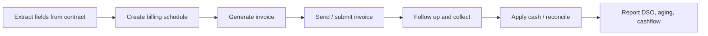

# Monk Product Evolution

Date: 2026-05-04

## Timeline

| Date | Event | What changed | Confidence |
|---|---|---|---|
| Sep 2023 | Atlas pre-seed listed on Wellfound | Earlier "turn contracts into cash" startup identity appears under Atlas / withatlas.ai | 🟡 Same founder/wedge, but legal continuity not confirmed. |
| 2024 | Monk founded | LinkedIn and AlleyWatch list Monk as founded in 2024 by George Kurdin and Joe Zhou | ✅ |
| Spring 2025 | $4M seed led by BTV | Monk receives seed funding and begins/continues commercial push | ✅ |
| 2025 | Contract extraction, billing engine, CLM engine development | Monk says it has pushed these systems since 2025 | ✅ Primary-source claim |
| Oct 8, 2025 | BTV publishes "Why We Invested in Monk" | BTV says Monk had landed high-growth companies including Profound and ElevenLabs within six months | ✅ |
| Feb 11, 2026 | Audit Log product update | Monk adds stronger audit history across contracts, invoices, amendments, comments, and system/user actions | ✅ |
| Mar 2, 2026 | Real-time contract-to-cash architecture post | Monk explains ensemble models, Braintrust evals, schema-first extraction, deterministic guardrails, amendments, hybrid pricing | ✅ |
| Mar 30, 2026 | Salesforce integration listed on blog index | Product surface expands around real-time CRM ingestion | ✅ Blog index, but full page not inspected |
| Apr 21, 2026 | $25M Series A | Footwork and Acrew co-lead; total reported funding reaches $29M | ✅ |
| Apr 28, 2026 | Intelligent Collections in Slack | Collections moves deeper into Slack/customer-context workflows | ✅ |
| 2026 | Public changelog surfaces billing/API depth | Changelog references usage billing, rate cards, credit wallets, revenue recognition schedules, REST API, pricing estimate API, and webhooks beta | 🟡 Public changelog, but packaging/docs not fully public |

## Evolution Narrative

### 1. Atlas: Contract-To-Cash Thesis

🟡 The earliest public breadcrumb found is Atlas on Wellfound. It described the company as helping F500s or businesses turn contracts into cash with AI, starting with AR workflow automation. It listed George Kurdin as founder and used withatlas.ai as website. [Wellfound Atlas](https://wellfound.com/company/atlasfinance)

The product thesis was already recognizable:

- contracts become invoices,
- finance leaders are the buyer,
- AR automation is the starting wedge,
- customers save time and increase cash on hand.

### 2. Monk: AR Automation Platform

✅ The current Monk website packages that thesis into a fuller platform:

- AR Automation
- Intelligent Collections
- Integrations
- Security
- Customer Stories
- Partnerships for PE/VC firms and accounting/fractional CFOs

This is a shift from "contract-to-cash startup" to "AR system of record and operations layer." [Homepage](https://monk.com/)

### 3. From Extraction To Workflow Ownership

✅ Monk's March 2026 architecture post makes clear that the company does not want to stop at document extraction. It says most extraction tools hand over JSON and leave the rest to the customer, while Monk runs the pipeline from ingestion to invoice generation with human validation where needed. [Reinventing contract-to-cash](https://monk.com/blog/reinventing-contract-to-cash-with-ai)

This is the central product evolution:

### 4. From Email Collections To Multi-Channel Collections

✅ The April 2026 Slack update shows Monk moving from email-oriented collections into the channels where customer relationships already happen. It says Slack workflows have to reconcile events from Stripe, Gmail/Outlook, Monk's agent engine, and the ERP; then map Stripe customer IDs to Slack channels with exact/fuzzy/metadata matching. [Slack Collections](https://monk.com/blog/intelligent-collections-in-slack)

🟡 This points to a broader ambition: AR not as a back-office queue, but as a customer-context layer that GTM/CS/finance all see.

### 5. Auditability As Product Requirement

✅ The February 2026 audit log update is important because AR automation touches customer communication and financial records. Monk says the log tracks contracts, invoices, amendments, comments, and separates system actions from user actions. [Audit Log](https://monk.com/blog/upgrade-on-monk-audit-log)

That is the right product direction for finance: every automated action needs reviewability, attribution, and rollback context.

## Product Roadmap Signals

🟡 **More AR modules:** The Series A announcement says Monk will invest in R&D and continue building products in accounts receivable. [PR Newswire](https://www.prnewswire.com/news-releases/monk-raises-25m-series-a-to-automate-accounts-receivable-with-ai-302748872.html)

🟡 **Cash application:** Monk's blog describes one-day cash application, remittance matching, bank connectors, LLM interpreters, graph matching, and policy engines. It reads partly as thought leadership and partly as product roadmap/current module. [Cash Application](https://monk.com/blog/one-day-cash-application-automating-remittance-matching-for-the-ai-era)

🟡 **Billing-platform expansion:** Changelog entries indicate Monk is moving beyond collections into billing-engine territory: usage meters, plans, rate cards, contract pricing overrides, credit wallets, credit memos, revenue recognition schedules, and invoice editing/resend workflows. [Changelog](https://monk.com/changelog)

🟡 **Developer/API expansion:** The changelog also mentions REST API keys, customer/invoice queries, a pricing estimate API, and webhooks beta. This does not yet look like a public self-serve developer platform, but it weakens the earlier "no API surface" read. [Changelog](https://monk.com/changelog)

🟡 **Partner channel:** PE/VC and accounting/fractional CFO partner pages suggest GTM through investors, portfolio support, accounting firms, and outsourced finance operators. [PE & VC partners](https://monk.com/partner/pe-vc-firms), [Accounting partners](https://monk.com/partner/accounting-fractional-cfos)

## Source List

- Wellfound Atlas: https://wellfound.com/company/atlasfinance
- LinkedIn: https://www.linkedin.com/company/monk-finance
- Homepage: https://monk.com/
- Blog: https://monk.com/blog
- BTV: https://better-tomorrow-ventures.ghost.io/why-we-invested-in-monk/
- Audit Log: https://monk.com/blog/upgrade-on-monk-audit-log
- Reinventing contract-to-cash: https://monk.com/blog/reinventing-contract-to-cash-with-ai
- Slack Collections: https://monk.com/blog/intelligent-collections-in-slack
- Cash Application: https://monk.com/blog/one-day-cash-application-automating-remittance-matching-for-the-ai-era
- Changelog: https://monk.com/changelog
- PR Newswire: https://www.prnewswire.com/news-releases/monk-raises-25m-series-a-to-automate-accounts-receivable-with-ai-302748872.html
