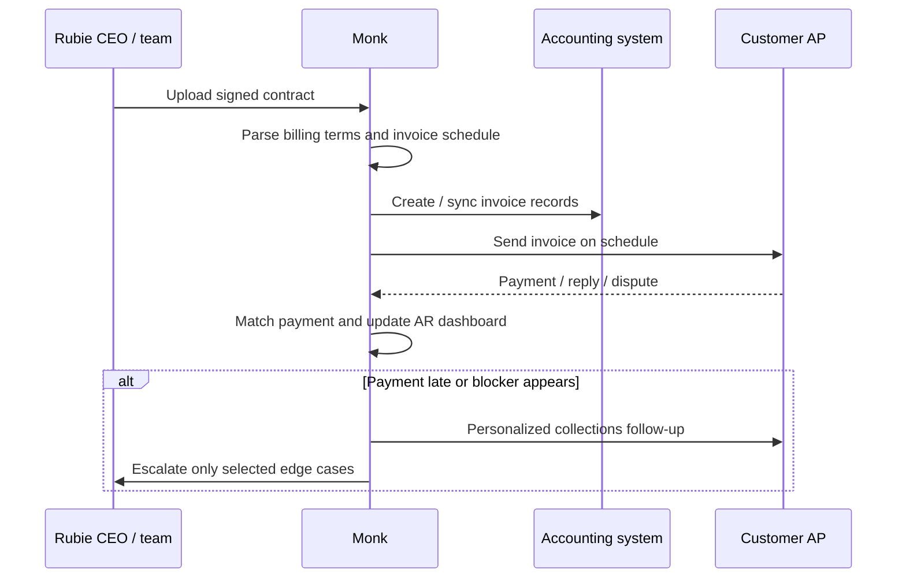
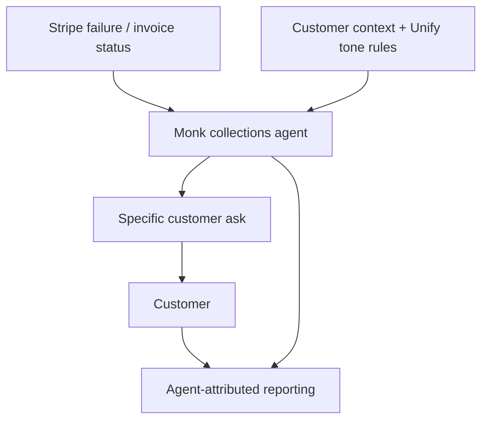
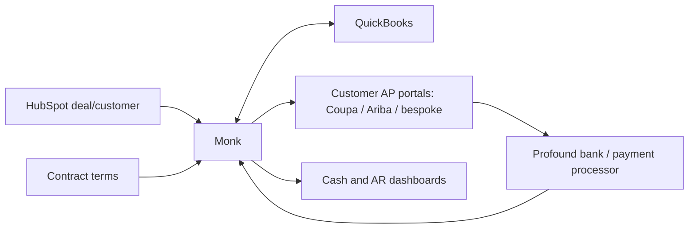

# Monk Use Cases And Examples

Date: 2026-05-04

## Pattern

Monk's best customers appear to be fast-growing B2B companies with sales-led or hybrid sales/product-led motions where finance is lean, contracts vary, invoices are delayed, and collections depend on customer-specific context.

✅ **Named public customers/case studies:** Unify, Pump, Rubie, Siro, Subject, Profound. [Customer Stories](https://monk.com/customer-stories)

✅ **Additional named customer in external coverage:** ElevenLabs. [FinTech Futures](https://www.fintechfutures.com/venture-capital-funding/ar-start-up-monk-bags-25m-series-a), [BTV](https://better-tomorrow-ventures.ghost.io/why-we-invested-in-monk/)

🟡 **Additional testimonial-only customer:** Goodship appears on Monk's customer page via a finance-leader quote, but I found no dedicated Monk case study. [Customer Stories](https://monk.com/customer-stories)

🔴 **All detailed workflow metrics below are vendor-published unless otherwise stated.** The case studies include named executives and concrete workflows, but they are still Monk marketing pages.

## Customer Matrix

| Customer | Business | Monk use case | Published result | Confidence |
|---|---|---|---|---|
| Unify | Outbound GTM platform | Stripe-informed intelligent collections, reporting, tone-aligned outreach | Overdue Stripe AR cut in half after month one | 🔴 Vendor case study |
| Pump | Cloud-cost optimization / group buying | Collections workflow, integrations, AR source of truth | $10M+ collected in recent months; 40+ hrs/week saved; >96% collections emails automated | 🔴 Vendor case study |
| Rubie | AI data migration platform | Contract upload, invoice schedules, collections, reconciliation | 30% reduction in total AR; 20+ hrs/month saved | 🔴 Vendor case study |
| Siro | AI platform for in-person sales teams | Intelligent collections embedded into invoice-to-cash | 45% reduction in overdue AR; 10+ hrs/week saved | 🔴 Vendor case study |
| Subject | AI digital curriculum for K-12 districts | Contract ingest, flux analysis, unbilled revenue recovery, AR system of record | Significant unbilled revenue recovered; real-time reporting across hundreds of school districts | 🔴 Vendor case study |
| Profound | AI visibility / answer-engine optimization platform | HubSpot + QuickBooks sync, invoice generation, AP portal submissions | +122% cash-on-hand in month one; 5x reduction in aging balance; 3 headcount saved | 🔴 Vendor case study |
| ElevenLabs | AI audio company | Not detailed publicly | Named by BTV and FinTech Futures as customer | 🟡 Named but no workflow proof found |
| Goodship | Freight/logistics procurement platform | Edge-case handling, AP portal submissions, follow-ups, reporting | Testimonial says prior tools failed on these edge cases | 🟡 Testimonial only |

## Walkthrough 1: Rubie Contract-To-Cash

### What Rubie Does

✅ Rubie is described as an AI-powered data migration platform for software companies, using agents for extraction, mapping, transformation, and validation. [Rubie case study](https://monk.com/case-study/rubie)

### Problem

🔴 Rubie's CEO was reportedly creating invoices, chasing payments, and reconciling accounts manually. The case study says there was no system connecting signed contracts to billing, no automated outreach, and no clean paid/unpaid tracker. [Rubie case study](https://monk.com/case-study/rubie)

### Monk Workflow

### Money Path

1. ✅ Signed customer contract is uploaded to Monk.
2. ✅ Monk extracts billing terms and creates a schedule.
3. ✅ Monk sends invoices on Rubie's behalf.
4. ✅ Monk agents handle payment follow-up across the invoice portfolio.
5. ✅ Monk dashboards show AR and collections performance.
6. 🟡 Payments likely settle through Rubie's existing bank/payment/accounting stack; Monk is the orchestration layer, not the money transmitter. No evidence says Monk holds funds.

### Alternative Before Monk

🔴 Founder-owned manual billing: contract interpretation, invoice creation, customer follow-up, and reconciliation were handled by the CEO/team. [Rubie case study](https://monk.com/case-study/rubie)

### Published Outcome

🔴 Monk reports 30% reduction in total AR and 20+ hours saved per month across invoicing, collections, and reconciliation. [Rubie case study](https://monk.com/case-study/rubie)

## Walkthrough 2: Unify Stripe-Informed Collections

### What Unify Does

✅ Unify is described as an outbound system of action for GTM teams, combining intent signals, B2B contact data, AI agents, sequencing, and analytics. [Unify case study](https://monk.com/case-study/unify)

### Problem

🔴 Unify's finance team wanted collections outreach that matched its own personalized customer-management style. The case study says payment failure data from Stripe was not being used to inform outreach, reporting was weak, and generic collections tone risked customer relationships. [Unify case study](https://monk.com/case-study/unify)

### Monk Workflow

### Money Path

1. ✅ Stripe invoices/subscriptions/customers and payment failure reasons are synced into Monk.
2. ✅ Monk identifies why payment failed: declined card, missing payment method, card limit, or another status.
3. ✅ Monk sends a customer-specific follow-up that asks for the exact corrective action.
4. ✅ If payment resolves, Monk attributes the collection outcome and updates reporting.
5. 🟡 Funds still move through Stripe or Unify's existing payment setup; Monk supplies context-aware AR workflow.

### Alternative Before Monk

🔴 Manual or generic outreach that lacked Stripe-specific failure context and reporting. [Unify case study](https://monk.com/case-study/unify)

### Published Outcome

🔴 Monk says overdue Stripe AR was cut in half after month one and payment success improved through Stripe-informed agent responses. [Unify case study](https://monk.com/case-study/unify)

## Walkthrough 3: Profound Enterprise AP Portal Handling

### What Profound Does

✅ Profound is described as a technology platform that helps companies understand and control AI visibility. [Profound case study](https://monk.com/case-study/profound)

### Problem

🔴 Profound's bookings grew faster than cash collection. AR lived in spreadsheets, the CPA lacked invoice visibility, and leadership lacked real-time customer/revenue view. [Profound case study](https://monk.com/case-study/profound)

### Monk Workflow

1. ✅ Monk connected HubSpot and QuickBooks and set up bi-directional sync across internal data sources.
2. ✅ Monk configured branded invoice aesthetics and collection-agent communication guidelines.
3. ✅ Monk automated invoice submission to Coupa, Ariba, and 11 bespoke F500 AP portals.
4. ✅ Monk gave leadership AR/cash visibility and reduced admin load on GTM teams.

### Money Path

### Published Outcome

🔴 Monk reports +122% cash-on-hand in month one, 5x reduction in aging balance, and 3 incremental headcount saved. [Profound case study](https://monk.com/case-study/profound)

## Other Use Cases

### Pump: High-Volume Customer Collections

✅ Pump helps businesses reduce cloud infrastructure costs through group buying power and AI-driven optimization. [Pump case study](https://monk.com/case-study/pump)

🔴 Pump reportedly managed $25M in volume across 1,500+ customers and had collected over $10M via Monk in recent months. The case study says Monk connected to accounting, banking, and CRM tools, then replaced customer-by-customer manual follow-up with repeatable workflows. [Pump case study](https://monk.com/case-study/pump)

### Siro: Invoice-To-Cash For Lean Finance

✅ Siro sells an AI platform that records and analyzes in-person sales conversations. [Siro case study](https://monk.com/case-study/siro)

🔴 Siro deployed Monk's Intelligent Collections module after a vendor evaluation; Monk says Siro reduced overdue AR by 45% while growing revenue and saved 10+ hours/week on manual follow-ups. [Siro case study](https://monk.com/case-study/siro)

### Subject: District Procurement Complexity

✅ Subject produces AI-powered digital curriculum and learning intelligence tools for K-12 school districts. [Subject case study](https://monk.com/case-study/subject)

🔴 This is the cleanest example of "edge cases matter." District-level procurement involves curriculum schedules, POs, multi-stakeholder billing, and slow public-sector AP. Monk says its flux analysis found delivered services that had never been invoiced and helped Subject build an AR system of record across hundreds of school district accounts. [Subject case study](https://monk.com/case-study/subject)

## Production Evidence And Review Footprint

✅ **Production signals are stronger than waitlist signals.** Monk has named customer stories, named finance/operator quotes, public product pages, and a $25M Series A. Several stories describe live workflows across Stripe, HubSpot, QuickBooks, AP portals, Slack/email, and finance reporting.

🔴 **Third-party review footprint is weak.** G2 reportedly lists Monk with no meaningful review base, and I found no Product Hunt launch or independent implementation teardown. That means customer references matter more than public review mining for this company.

🟡 **Metrics vary across pages and indexed versions.** Public claims include $14M collected, $22M Q2 cash collected, $600M or $1B AR trusted/managed, 18 hrs/week, 26 hrs/month, 90% invoice resolution, and 98.8% invoice resolution depending on page/version. Treat these as directional growth/marketing metrics until Monk gives a dated cohort.

## Buyer Persona

✅ Monk explicitly targets ambitious founders, CFOs, COOs, finance teams, operations, accounting, RevOps, GTM, and PE/VC portfolio operators. [Homepage](https://monk.com/), [PE & VC partners](https://monk.com/partner/pe-vc-firms), [Accounting partners](https://monk.com/partner/accounting-fractional-cfos)

🟡 **Best-fit ICP:**

- B2B SaaS or AI-native company
- Sales-led or hybrid sales/product-led motion
- Growing fast enough that billing complexity is changing every quarter
- Lean finance/accounting team
- Customer base includes enterprise AP portals or procurement processes
- Existing stack includes HubSpot/Salesforce, QuickBooks/NetSuite, Stripe, Slack, Gmail, DocuSign

🟡 **Unproven or weaker ICPs:** traditional manufacturing, healthcare, global enterprise e-invoicing, large-scale deduction management, and heavily regulated multi-country AR have less public proof than the AI/SaaS/startup customer cluster.

## What Customers Seem To Buy

They are not buying "collections emails." They are buying an outsourced/automated AR operating layer:

1. Contract ingestion and billing schedule setup.
2. Invoice generation and sync to accounting systems.
3. Context-aware follow-up.
4. Portal/AP/vendor setup handling.
5. Cash application/reconciliation.
6. Reporting for leadership, finance, and board prep.
7. A high-touch Slack-supported implementation team.

## Source List

- Customer stories index: https://monk.com/customer-stories
- Unify: https://monk.com/case-study/unify
- Pump: https://monk.com/case-study/pump
- Rubie: https://monk.com/case-study/rubie
- Siro: https://monk.com/case-study/siro
- Subject: https://monk.com/case-study/subject
- Profound: https://monk.com/case-study/profound
- FinTech Futures: https://www.fintechfutures.com/venture-capital-funding/ar-start-up-monk-bags-25m-series-a
- BTV: https://better-tomorrow-ventures.ghost.io/why-we-invested-in-monk/
