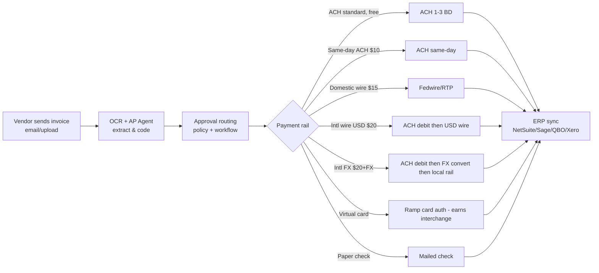
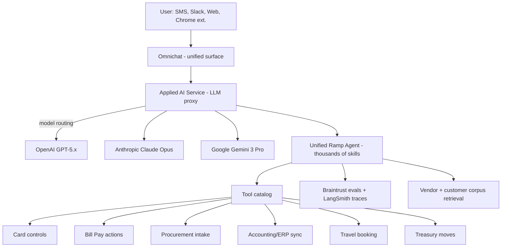

# Ramp Business — Architecture, Products, AI Features, Technical Mechanics

*Stream 2: Product catalog, card mechanics, Bill Pay, Treasury, Ramp Intelligence, Ramp Agents, AI infrastructure, integrations, pricing*
*Compiled 2026-05-09. Confidence labels: ✅ High (multi-source, primary-confirmed) · 🟡 Medium (single source or marketing claim) · 🔴 Low / speculative / unverifiable.*

---

## 1. Baseline: What Ramp Business Actually Is

Ramp Business (ramp.com) is the New York–based corporate spend-management fintech founded in 2019 by Eric Glyman, Karim Atiyeh, and Gene Lee — not to be confused with the unrelated crypto on-ramp **Ramp Network** (rampnetwork.com). The company started life as a corporate charge card with built-in expense controls, then layered on bill pay, travel, procurement, treasury, reimbursements, and — most relevantly for this brief — an AI/agent layer ("Ramp Intelligence" + "Ramp Agents") that the company has positioned since 2023 as the centerpiece of its product strategy. As of November 2025, Ramp serves 50,000+ business customers, processes $100B+ in annual purchase volume, has crossed $1B ARR (vs. $500M ARR a year prior), and was last valued at $32B (Lightspeed-led round, Nov 2025), with a follow-on round at a $40B+ pre-money reportedly in motion as of May 2026 ✅.

Strategically, Ramp's pitch is "save 5%" on corporate spend by combining (a) interchange-funded free software, (b) AI-driven automation that removes finance-team labor, and (c) data network effects from aggregated card and invoice spend across 50k customers (vendor benchmarking, price intelligence) ✅.

---

## 2. Full Product Catalog

| SKU | What it does | Status | Confidence |
|---|---|---|---|
| **Ramp Card** (corporate cards) | Charge cards, virtual + physical, unlimited issuance | GA | ✅ |
| **Ramp Bill Pay** | AP automation: invoice OCR, approval routing, ACH/wire/check/card payouts | GA | ✅ |
| **Ramp Travel** | T&E booking on flights/hotels, built on Priceline rail | GA (launched 2024) | ✅ |
| **Ramp Procurement** | Intake-to-pay: vendor requests, POs, approval workflows | GA (post-Venue acquisition, 2024) | ✅ |
| **Ramp Treasury / Ramp Business Account** | Operating-cash account (deposit) + Ramp Investment Account (money-market fund) | GA (Feb 2025 launch) | ✅ |
| **Ramp Plus** | Paid tier with reimbursements, advanced controls, real-time ERP sync | GA at $15/user/mo | ✅ |
| **Ramp Enterprise** | Multi-entity, multi-currency, custom controls, dedicated CSM | GA (custom pricing) | ✅ |
| **Ramp International / Global** | Multi-currency cards, local FX, international reimbursements (Enterprise tier for full functionality) | GA | ✅ |
| **Ramp Intelligence** | AI feature suite: receipt OCR, contract extraction, price intelligence, copilot | GA (since Mar 2023, expanded continuously) | ✅ |
| **Ramp Agents** | Agentic action-takers across the workflow: Controllers, AP, Procurement, Bill Pay (Visa) | Rolling GA July 2025 → Mar 2026 | ✅ |
| **Ramp Inspect** | *Internal* coding agent — not a customer-facing SKU but worth noting | Internal-only | ✅ |

Sources: [ramp.com/product](https://ramp.com/), [Q3 2025 release](https://ramp.com/new-on-ramp-q3-2025), [Q4 2025 release](https://ramp.com/new-on-ramp-q4-2025), [2025 release notes](https://ramp.com/blog/2025-release-notes).

---

## 3. Card Mechanics: Issuer, Network, Processor, Interchange

- **Networks**: **Visa** (no Mastercard SKU). The two consumer-facing card products are the **Ramp Visa Corporate Card** (charge card, issued by **Celtic Bank, Member FDIC**) and the **Ramp Visa Commercial Card** (issued by **Sutton Bank, Member FDIC**) ✅ ([Ramp support: corporate cards](https://support.ramp.com/hc/en-us/articles/360043060853-Ramp-corporate-cards))
- **Issuer-of-record**: Celtic + Sutton (two-issuer setup is standard once a fintech scales — used to balance volume risk and underwriting authority across charge vs. credit constructs). 🟡 medium-high.
- **Issuer processor**: Historically **Marqeta** — confirmed via Marqeta's published Ramp case study ✅ ([Marqeta case study PDF](https://pages.marqeta.com/hubfs/pdfs/Ramp_Case_Study_v3.pdf)). Industry chatter that Stripe Issuing has expanded into the segment Ramp occupies, but **no public confirmation** Ramp has migrated off Marqeta. 🟡
- **Interchange economics**: Corporate card-not-present interchange ≈ **~2.7–2.9% + $0.10**. Ramp pays issuer-processor fees in the **0.3–0.5% range** (Marqeta wholesale tier), nets the spread, **rebates ~1.5% as cash back**, and reinvests the remainder into software development rather than premium points — this is the "free software funded by interchange" wedge ✅.
- **Rewards model**: 1.5% flat cash back on Ramp Card; no rotating categories, no points (deliberate — Ramp's thesis is that rewards inflate spend, contradicting their save-money pitch) ✅.

---

## 4. Bill Pay Mechanics: How Money Actually Moves

Mechanics ✅ (sourced from [ramp.com/accounts-payable](https://ramp.com/accounts-payable), [bill payment timelines](https://support.ramp.com/hc/en-us/articles/4417836454419-Bill-payment-methods-and-timelines), [Ramp pricing](https://ramp.com/pricing)):

- **OCR claim**: 99% accuracy (marketing — not independently audited 🟡).
- **International wire (USD)**: Ramp ACH-debits the customer's funding account (1–4 BD), then sends the USD wire to the foreign vendor (1–5 BD additional). Net 2–9 BD end-to-end.
- **International FX**: Same ACH debit step, then conversion at "competitive rates" before payout in local currency. Free/Plus customers fund from a USD account; **Enterprise tier required for true multi-currency / locally-funded payouts** ✅.
- **Float economics**: ACH-debit-then-pay structure means Ramp likely holds funds **in transit for 1–4 BD on every Bill Pay** transaction. Whether they earn float on this is **not publicly disclosed** 🟡 — but standard fintech treasury practice would be to sweep it. The Ramp Treasury launch arguably re-distributes that float to customers in the form of yield (more on this below).
- **Per-payment fees**: Standard ACH free; same-day ACH $10; domestic wire $15; intl wire (USD) $20; intl FX $20 + spread ✅.

---

## 5. Treasury Mechanics: Where Idle Cash Sits

Ramp Treasury, launched Feb 2025, has **two distinct products** with different rails ([Increase customer page](https://increase.com/customers/ramp-treasury); [Ramp support: Business Account](https://support.ramp.com/hc/en-us/articles/35043351807507-Ramp-Business-Account-Overview); [Ramp support: Investment Account](https://support.ramp.com/hc/en-us/articles/37119973102995-Ramp-Investment-Account-Overview)):

| Product | Construct | Partner | APY | Insurance |
|---|---|---|---|---|
| **Ramp Business Account** | Deposit/checking | **First Internet Bank of Indiana** (Member FDIC); APIs by **Increase Technologies, Inc.** | Up to 2–2.5% (paid as cash reward by Ramp Business Corp, *not* by the bank) | FDIC pass-through up to limits |
| **Ramp Investment Account (Self-Directed)** | Money-market fund (MMF) | Custodied at **Apex Clearing**; invests in **Invesco Premier U.S. Government Money Portfolio (FUGXX)** | Tracks FUGXX 7-day yield (was ~5%+ in 2024, varies; ~4% range Mar 2026) | SIPC (custodial), MMF NAV not FDIC-insured |
| **Ramp Managed Investment Account** | Discretionary MMF (newer Q3 2025 release) | Same custodial setup | Similar | Same |

✅ All four sources align. Importantly:
- The headline "4–5% APY" claim is on the **Investment Account (MMF)** side — not a deposit yield. That distinction matters: customers' funds in the MMF are not FDIC-insured deposits; they hold shares of FUGXX, with NAV risk (negligible for a Treasury-only MMF in normal conditions, but real in a 2008/2020-style stress) ✅.
- The Ramp Business *deposit* account yields 2–2.5%, paid as a Ramp-funded reward (which is a clever way to skirt the legal/regulatory headache of bank deposit interest while still marketing "yield") ✅.
- **Increase** is the BaaS layer enabling the deposit account — same Increase that powers many YC fintechs.

---

## 6. Ramp Intelligence — What's Actually Shipped vs. Marketed

| Feature | Status | Mechanic | Confidence |
|---|---|---|---|
| **Receipt extraction / OCR** | Shipped (years; refined continuously) | Vision model + traditional OCR fallback. Pulls amount, merchant, date, line items into transaction record | ✅ |
| **Contract review / extraction** | Shipped (Mar 2023) | GPT-4 extracts pricing, term, renewal date, SKU breakdown from uploaded SaaS contracts | ✅ ([Ramp Intelligence launch](https://www.prnewswire.com/news-releases/ramp-launches-broad-set-of-ai-powered-capabilities-to-save-businesses-time-and-money-leads-financial-technology-sector-in-value-generating-ai-applications-301828616.html)) |
| **Price Intelligence (vendor benchmarking)** | Shipped | Aggregates millions of Ramp transactions; benchmarks customer's quoted SaaS price vs. peers; cleanses merchant strings (e.g. "SFDC*" → "Salesforce") | ✅ |
| **Spend insights / anomaly detection** | Shipped | Real-time dashboards flag duplicate subs, overspend, unused licenses | ✅ |
| **Procurement workflow auto-routing** | Shipped (post-Venue) | Visual workflow builder with parallel approvals; AI-driven vendor evaluation | ✅ |
| **AI-assisted accounting / month-end close** | Shipped (Q3 2025) | Auto-categorizes transactions, groups for review, flags miscoded items | ✅ |
| **Forecasting / cash forecasting** | Shipped (with Treasury) | Cash forecasts derived from recurring spend patterns | 🟡 (limited public detail) |
| **Tour Guide agent** | Shipped (early agentic UX) | Takes cursor control, demonstrates platform — atomic actions: scroll/click/fill | ✅ ([LangChain breakout case study](https://www.langchain.com/breakoutagents/ramp)) |
| **AI spend visibility (token-level)** | Shipped (early 2026) | Pulls token-level usage from OpenAI/Anthropic to show *which AI vendors* internal teams spend on | ✅ ([trillion-dollar AI blindspot post](https://ramp.com/blog/trillion-dollar-ai-blindspot)) |

The **Ramp AI Index** ([ramp.com/velocity/ai-index-march-2026](https://ramp.com/velocity/ai-index-march-2026)) is a marketing/data product — they publish aggregate adoption stats (e.g., "OpenAI 36% penetration vs. Anthropic 12%"). It's a content-marketing flywheel but also confirms Ramp has the data plumbing to slice card spend by vendor in real time ✅.

---

## 7. Ramp Agents — The Agent Layer

Named, shipped agent families (timeline):

| Agent | Launch | Scope | Real actions or just suggest? |
|---|---|---|---|
| **Tour Guide / Copilot** | 2023 | Platform navigation, Q&A | Click + fill (RPA-ish) ✅ |
| **Agents for Controllers** | **July 2025** | Expense policy enforcement, fraud flagging, auto-approve low-risk | **Real action** — auto-approves 85% of expenses with claimed 99% accuracy ✅ ([PRNewswire](https://www.prnewswire.com/news-releases/ramp-introduces-ai-agents-to-automate-finance-operations-302502154.html)) |
| **Policy Agents** | Q3 2025 | Reviews every expense, auto-follows up with employees for missing context | Real action — auto-follow-up + auto-approve ✅ |
| **Agents for AP** | **October 2025** | Invoice coding, approval, payment processing | Real action — codes line items, recommends + executes payment ✅ ([Bill Pay agent PR](https://www.prnewswire.com/news-releases/ramp-launches-agents-for-ap-to-automate-accounts-payable-302576975.html)) |
| **Procurement Agents** | **Q1 2026 / May 2026** | Natural-language intake, vendor sourcing, due-diligence checks | Real action — runs procurement 3x faster ✅ ([CPA Practice Advisor](https://www.cpapracticeadvisor.com/2026/05/02/ramp-rolls-out-ai-agents-for-procurement/182627/)) |
| **Visa-powered Bill Pay agents** | **March 31, 2026** | Agentic corporate bill pay using Visa Trusted Agent Protocol + Visa Intelligent Commerce | Real action with cryptographic agent attestations ✅ ([PYMNTS](https://www.pymnts.com/news/b2b-payments/2026/visa-and-ramp-develop-ai-agents-for-corporate-bill-pay/); [Visa investor PR](https://investor.visa.com/news/news-details/2025/Visa-and-Partners-Complete-Secure-AI-Transactions-Setting-the-Stage-for-Mainstream-Adoption-in-2026/default.aspx)) |

### Architectural shift in early 2026

Per ZenML's writeup of Ramp's case study ([ZenML LLMOps DB](https://www.zenml.io/llmops-database/building-production-scale-ai-agents-for-financial-automation)): Ramp originally pursued a **decentralized "hundreds of discrete agents"** approach. After the early-2026 frontier model releases (GPT-5.x / Claude Opus 4.x / Gemini 3 Pro tier — see §8), they **collapsed to a single unified agent with thousands of skills** and consolidated **five different conversational UIs into one Omnichat** surface ✅. This is a meaningful architecture data point: the agentic pattern they bet on in 2024–2025 (specialized agents, hard-wired workflows) became obsolete as model capability + tool-calling reliability improved.

✅ Diagram structure inferred from ZenML case study + LangChain breakout-agents writeup; the *exact* model routing logic isn't published, marked 🟡 on specifics.

---

## 8. AI Infrastructure Under the Hood

This is where Ramp has been remarkably transparent — their builders blog plus third-party case studies (LangChain, Modal, Anthropic, ZenML) reveal a stack that's atypical for a regulated fintech. ✅ unless flagged.

### Foundation models
- **OpenAI GPT-4 / GPT-4o / GPT-5.x** — original Ramp Intelligence (Mar 2023) was explicitly "powered by GPT-4" ✅
- **Anthropic Claude (Sonnet, Opus, and Claude Code)** — Ramp is a published Anthropic enterprise customer with a dedicated case study at [claude.com/customers/ramp](https://claude.com/customers/ramp). Quote-confirmed: 1M+ lines of AI-suggested code in 30 days; ~50% of engineers use weekly; incident-investigation time reduced 80% ✅
- **Google Gemini** — referenced in ZenML writeup as a router target ✅
- **Custom fine-tunes** — no public evidence of in-house pretrained models or fine-tunes; the architecture is "best frontier model, swap via config" 🟡

### Inference / orchestration
- **Applied AI Service** — Ramp's internal LLM proxy/gateway, conceptually similar to **LiteLLM**, with three extensions: structured output, consistent APIs across providers, and (third extension less specifically described in source — likely tool-call schema unification) ✅. Engineers swap GPT-5.x → Claude Opus → Gemini 3 Pro **with a config change** ✅.
- **LangChain + LangGraph + LangSmith** — used for agent dev + evaluation per LangChain's own case study and ZenML database ✅.
- **Modal** — Ramp's compute platform of choice for **Inspect** (the internal coding agent) and at least the dev-loop side of agent infra. Modal Sandboxes spin full dev environments in seconds with VS Code server, Chromium, terminal, all services accessible at low latency ✅ ([Modal blog post on Ramp Inspect](https://modal.com/blog/how-ramp-built-a-full-context-background-coding-agent-on-modal); [Ramp Builders: Why we built our own agent](https://builders.ramp.com/post/why-we-built-our-background-agent)).
- **OpenCode** — used as the underlying coding agent runtime inside the Modal sandbox for Inspect ✅.

### Eval / observability
- **Braintrust** — Ramp is named as a production AI team using Braintrust for tracing, eval, and behavior improvement ✅ (multiple Braintrust marketing pages cite Ramp).
- **LangSmith** — for LangChain-orchestrated agents ✅.
- Internal "harness engineering" + "continual learning" pattern matches LangChain's published Ramp framing ✅.

### Vector DB / RAG
- **No public confirmation** of which vector DB (Pinecone vs. Weaviate vs. pgvector vs. in-house) Ramp uses. 🔴
- The price-intelligence and contract-review features clearly imply embedding-based retrieval over the 50k-customer transaction corpus + uploaded contract corpus, but specifics are not disclosed.
- Educated guess (🔴): given Modal-native infra and structured-output focus, pgvector or in-house tabular ANN over their Snowflake/data-lake is more plausible than Pinecone, but this is speculative.

### Inspect (the coding agent — internal-only product)
- ~30–50%+ of merged PRs at Ramp generated by Inspect (multiple sources, range across timestamps) ✅ ([InfoQ](https://www.infoq.com/news/2026/01/ramp-coding-agent-platform/))
- Frontier-model agnostic; integrates with GitHub, Slack, Buildkite, Sentry, Datadog
- Three interaction modes: Slack bot, web UI, **Chrome extension** for visual React component editing
- Visual verification via VNC + Chromium inside the sandbox ✅

---

## 9. Public Developer API

Verified at [docs.ramp.com](https://docs.ramp.com/) and [support.ramp.com developer access](https://support.ramp.com/hc/en-us/articles/46681939909907-Accessing-the-Developer-API):

- **Base URL**: `docs.ramp.com/developer-api/v1/...` ✅
- **Auth**: **OAuth 2.0** with scope-pattern `resource:permission` (e.g. `transactions:read`, `bills:write`) ✅
- **Token lifetime**: Access tokens last **10 days**; refresh logic recommended before expiry rather than waiting on 401s ✅
- **Webhooks**: `POST /v1/webhooks` to register endpoint + event subscription. Events documented include `transaction.created` (and analogous for bills, users, cards) ✅
- **Rate limits**: Documented on `docs.ramp.com/developer-api/v1/api/limits`. Specific numerical limits require fetching that page (not retrieved here) 🟡
- **Sandbox**: Available via account manager (not self-serve). Same endpoints/scopes as production; different base URL + credentials. Pre-populated with sample transactions, cards, users, departments, bills, reimbursements ✅
- Resource catalog (inferred): transactions, cards, users, bills, vendors, reimbursements, departments, locations, accounting categories, custom fields, webhooks. ✅

(See `developer_experience.md` for full DX deep-dive.)

---

## 10. Integrations

| Category | Vendors integrated |
|---|---|
| **Accounting / ERP** | NetSuite ✅, QuickBooks Online + Desktop ✅, Sage Intacct ✅, Xero ✅, Workday Financials ✅, Microsoft Dynamics 365 (BC + F&O) ✅, Acumatica ✅, Oracle Fusion Cloud ✅, Zoho Books ✅ — total claimed "30+" |
| **HRIS** | Workday ✅, BambooHR 🟡, Gusto 🟡, Rippling 🟡, ADP 🟡 |
| **SSO / Identity** | Okta ✅ (dedicated integration page); Azure AD / Entra ID 🟡; OneLogin 🟡 (presumed via SAML at Enterprise tier) |
| **Travel** | Priceline (rail backbone for Ramp Travel) ✅; Corporate Traveler 🟡; no confirmed Navan/TripActions integration (they're competitors) |
| **Procurement (external)** | Limited — Ramp positions itself as a procurement *platform*, so coexistence with Coupa/ServiceNow isn't a heavy use case |
| **Comms** | Slack ✅ (full conversational interface), SMS ✅, Microsoft Teams 🟡 |
| **Data warehouse** | Not prominently advertised; likely via reverse-ETL (Census/Hightouch) rather than direct Snowflake/BigQuery connector 🔴 |

Sources: [ramp.com/integrations](https://ramp.com/integrations), [integrations/okta](https://ramp.com/integrations/okta), [integrations/netsuite](https://ramp.com/integrations/netsuite), [integrations/sage](https://ramp.com/integrations/sage).

---

## 11. Pricing — Is Ramp Actually Free?

| Tier | Price | What you get |
|---|---|---|
| **Free** | $0 | Unlimited corporate cards, basic controls, SMS/Slack expense, basic Bill Pay, basic accounting integrations |
| **Plus** | $15 / user / month | Real-time NetSuite + Sage Intacct sync, advanced approvals, multi-entity at limited scale, more reimbursement features |
| **Enterprise** | Custom | Multi-currency cards, locally-funded reimbursements, multi-country issuing, custom workflows, advanced API, dedicated CSM |

✅ ([ramp.com/pricing](https://ramp.com/pricing))

**Per-payment fees** (apply on Free + Plus, possibly negotiable on Enterprise):
- Standard ACH: free
- Same-day ACH: $10
- Domestic wire: $15
- International wire (USD): $20
- International FX wire: $20 + FX spread
- Foreign transaction (card): no issuer FX fee, but **3% currency conversion fee** on the consumer-facing card use ✅

**The "free" claim is technically true** for the entry tier — Ramp monetizes via interchange (~1.5–2% net of cashback) and per-payment fees rather than seat licenses. Plus and Enterprise are the SaaS revenue. Treasury is monetized via NIM (Ramp earns the spread between FUGXX yield and what they pass through to the deposit account). 🟡 NIM economics inferred, not disclosed.

---

## 12. Performance / Savings Claims

- "**Save 5%**" / "**save 3.5% on average**" — appears in marketing as a blended figure across cashback (~1.5%), software-spend reduction via duplicate-license detection and Price Intelligence, and time savings rebadged as cost ✅ marketing claim, 🔴 methodology not independently audited.
- Concrete customer datapoint: Crossbeam attributed "$100k–200k/year across all contracts" to Ramp Price Intelligence ✅ ([Crossbeam customer story](https://ramp.com/customers/crossbeam-customer-story)).
- AP throughput: claim "2.4× faster than legacy software" 🟡 (marketing).
- Agent metrics: 85% of expense reviews automated at 99% accuracy (Controllers agent) 🟡 (Ramp-published, not externally audited).

---

## 13. Settlement / Float Economics

- **Card float**: As an issuer, Ramp's program (via Sutton/Celtic) collects from cardholders on monthly cycles, settles to merchants daily — the bank carries float, processor (Marqeta) facilitates, and Ramp earns interchange. The bank's deposit float is part of the program economics but not publicly broken out 🟡.
- **Bill Pay float**: ACH-debit-then-pay creates 1–4 BD in-transit float per transaction. Ramp Treasury's launch arguably re-routes that float into customer-facing yield (the customer's idle cash now lives in Increase-powered deposit + FUGXX MMF rather than Ramp's pre-funding account), which is a customer-friendly framing of what would otherwise be Ramp's NIM.
- **Treasury NIM**: On the Investment Account side, FUGXX is the customer's investment — Ramp earns advisory/platform fees (not deeply disclosed) rather than NIM. On the Business Account, the spread between First Internet Bank's wholesale deposit rate and the 2–2.5% paid to customers is the implicit revenue, paid by Ramp Business Corp as a "cash reward" to keep the structure clean of deposit-interest regulation 🟡 ([Increase customer page](https://increase.com/customers/ramp-treasury)).

---

## 14. Acquisitions Mapped to Product Features

| Acquisition | Date | Tech brought in | Resulting feature |
|---|---|---|---|
| **Buyer** ("negotiation-as-a-service") | August 2021 | Vendor negotiation playbooks, contract analysis | Foundation of vendor management + contract data ingestion ✅ |
| **Cohere.io** (no relation to LLM lab Cohere) | June 2023 | Generative AI for customer support; team led by Yunyu Lin + Rahul Sengottuvelu | Seeded Ramp Intelligence: tour-guide agent, copilot, OCR enhancement, conversational UX ✅ ([acquisition PR](https://www.prnewswire.com/news-releases/ramp-acquires-ai-powered-customer-support-platform-cohereio-301863407.html)) |
| **Venue** (Sequoia-backed procurement startup) | January 2024 | Vendor intake forms, flexible approvals, PO management; founders TK Kong, Young Kim, Kevin Chan | Backbone of Ramp Procurement / Plus tier ✅ ([Ramp PR](https://www.prnewswire.com/news-releases/ramp-radically-expands-procurement-capabilities-with-venue-acquisition-and-product-enhancements-302047858.html)) |
| **Jolt AI** | 2025 (per Crunchbase/private) | AI for engineering velocity; coding-agent precursor | Likely contributed to Inspect (internal coding agent) 🟡 ([Crunchbase News](https://news.crunchbase.com/fintech/ramp-jolt-ai-acquisition-fintech-ai-ma/)) |

**Note**: **Veho** and **Intriduce** did not surface in the search corpus as Ramp acquisitions. Veho is a separate last-mile logistics company; "Intriduce" may be a misspelling or rumor. Marking 🔴 unconfirmed.

---

## 15. What's New in 2025–2026 (timeline)

| Date | Launch |
|---|---|
| **Jan 2025** | Q1 release; expanded reimbursements, AI policy enforcement preview ✅ |
| **Feb 2025** | **Ramp Treasury** (Business Account + Investment Account, FUGXX-backed) ✅ |
| **Mar 2025** | $13B valuation marker, Series E prep ✅ |
| **Jun 2025** | $200M Series E at $16B valuation; CNBC Disruptor 50 ✅ |
| **Jul 2025** | **Agents for Controllers** — first GA agent product (expense policy, fraud, auto-approve) ✅ |
| **Jul 2025** | $500M Series E-2 at $22.5B valuation ✅ |
| **Aug 2025** | "New on Ramp August" — various incremental features ✅ |
| **Q3 2025 ("Systems That Run Themselves" release)** | Policy Agents, SMS/Slack expense, automated follow-ups, accounting-workflow automation, Managed Investment Account ✅ |
| **Oct 2025** | **Agents for AP / Bill Pay Agents** ✅ |
| **Nov 2025** | $300M raise at **$32B** valuation (Lightspeed-led); $1B ARR crossed ✅ |
| **Q4 2025 ("The Year of Ramp Intelligence" release)** | Token-level AI spend visibility; expanded agent skills; Omnichat consolidation ✅ |
| **Jan 2026** | InfoQ feature on Inspect coding agent (>30% of PRs) ✅ |
| **Mar 31, 2026** | **Ramp + Visa partnership** — agentic Bill Pay using Visa Intelligent Commerce + Visa Trusted Agent Protocol; renewed multi-year issuing agreement ✅ |
| **Mar 2026** | Ramp AI Index updates (Anthropic narrowing OpenAI gap in enterprise) ✅ |
| **Apr/May 2026** | **Procurement Agents GA** — natural-language intake, AI vendor evaluation, agent-run due diligence ✅ |
| **May 2026** | Reported $40B+ valuation talks (TechCrunch, May 7) ✅ |

---

## Open Questions / Gaps

1. **Vector database / RAG specifics** — not publicly disclosed; only architectural patterns are described. 🔴
2. **Issuer-processor migration** — whether Ramp has moved or is moving from Marqeta to Stripe Issuing or in-house BIN sponsorship. 🟡
3. **Exact NIM and float economics** — Ramp does not break out interchange vs. SaaS vs. Treasury revenue mix in any public source. 🔴
4. **"Veho / Intriduce" acquisitions** — did not validate. May be misremembered names. 🔴
5. **Vercel AI Gateway / OpenRouter usage** — not found in any public source. The Applied AI Service is described as **internal**, comparable to but not built on LiteLLM/Vercel. 🟡

---

## Most-load-bearing source URLs

- Ramp Builders engineering blog: [builders.ramp.com](https://builders.ramp.com/) and [why we built our background agent](https://builders.ramp.com/post/why-we-built-our-background-agent)
- Q3/Q4 2025 release pages: [ramp.com/new-on-ramp-q3-2025](https://ramp.com/new-on-ramp-q3-2025), [ramp.com/new-on-ramp-q4-2025](https://ramp.com/new-on-ramp-q4-2025)
- 2025 release notes hub: [ramp.com/blog/2025-release-notes](https://ramp.com/blog/2025-release-notes)
- Modal case study on Inspect: [modal.com/blog/how-ramp-built-a-full-context-background-coding-agent-on-modal](https://modal.com/blog/how-ramp-built-a-full-context-background-coding-agent-on-modal)
- Anthropic case study: [claude.com/customers/ramp](https://claude.com/customers/ramp)
- LangChain breakout-agents Ramp case: [langchain.com/breakoutagents/ramp](https://www.langchain.com/breakoutagents/ramp)
- ZenML LLMOps DB Ramp entries: [zenml.io/llmops-database/building-production-scale-ai-agents-for-financial-automation](https://www.zenml.io/llmops-database/building-production-scale-ai-agents-for-financial-automation) and [building-an-internal-background-coding-agent](https://www.zenml.io/llmops-database/building-an-internal-background-coding-agent-with-full-development-environment-integration)
- Increase Treasury page: [increase.com/customers/ramp-treasury](https://increase.com/customers/ramp-treasury)
- Visa partnership PR: [pymnts.com/news/b2b-payments/2026/visa-and-ramp-develop-ai-agents-for-corporate-bill-pay](https://www.pymnts.com/news/b2b-payments/2026/visa-and-ramp-develop-ai-agents-for-corporate-bill-pay/)
- Ramp Intelligence original launch: [PRNewswire 2023](https://www.prnewswire.com/news-releases/ramp-launches-broad-set-of-ai-powered-capabilities-to-save-businesses-time-and-money-leads-financial-technology-sector-in-value-generating-ai-applications-301828616.html)
- Sacra CTO interview on issuing: [sacra.com/research/karim-atiyeh-ramp-expert-interview-card-issuing](https://sacra.com/research/karim-atiyeh-ramp-expert-interview-card-issuing/)
