# Ramp Business — Quarter-by-Quarter Product Evolution (2019–Q2 2026)

*Stream 6 / Product Evolution Changelog*
*Compiled 2026-05-09. Confidence labels: ✅ High (multiple primary sources), 🟡 Medium (single source or inference), 🔴 Low (rumor / speculation).*

---

## Executive snapshot

In ~2,400 days, Ramp went from a 3-person Capital One alumni team pitching "1.5% cashback on a corporate card" to a $32B (and reportedly heading to $40B+) "AI-native finance OS" with $1B+ ARR, ~50,000 customers, and a fleet of autonomous AI agents handling AP, procurement, and policy enforcement. The arc breaks cleanly into four eras: **Card v1 (2019–2021)** → **Spend management platform (2021–2023)** → **Finance automation suite (2023–2024)** → **AI-native / agentic finance OS (2025–2026)**. ✅

---

## Summary timeline

```mermaid
timeline
    title Ramp product & funding arc 2019–2026
    Q1 2019 : Founded by Glyman / Atiyeh / Lee (post-Paribus)
    Q3 2019 : $7M seed (Founders Fund / Coatue / Rabois)
    Q1 2020 : Public launch of corporate card (1.5% cashback)
    Q3 2020 : Expense management software launch
    Q2 2021 : Series B $115M @ $1.6B (Stripe + D1)
    Q3 2021 : Series C $300M @ $3.9B; Buyer acquisition; Bill Pay launches Oct
    Q1 2022 : Series D $750M ($200M equity + $550M debt) @ $8.1B
    Q3 2022 : Ramp Flex (B2B BNPL); international payments (176 countries)
    Q2 2023 : Cohere.io acquired; Ramp Intelligence launches (GPT-4)
    Q3 2023 : Down round $300M @ $5.8B; Procurement launch; Venue acquired (announced Jan 2024)
    Q1 2024 : Procurement public launch (Venue announced)
    Q2 2024 : Ramp Travel launches (Priceline partnership)
    Q2 2024 : Series D-2 $150M @ $7.65B
    Q4 2024 : App Center launches (200+ integrations)
    Q1 2025 : Ramp Treasury launches (Jan 22); $13B tender offer (Mar)
    Q2 2025 : Series E $200M @ $16B; Stripe stablecoin-card partnership
    Q3 2025 : Series E-2 $500M @ $22.5B (Iconiq-led); $1B ARR
    Q4 2025 : Agents for AP launch (Oct 7); Jolt AI acqui-hire (Oct 6); Series F $300M @ $32B (Lightspeed, Nov 17)
    Q1 2026 : Billhop acquisition (Mar 13); EU/UK launch announced
    Q2 2026 : Procurement AI Agents fleet (Apr 29); $40B+ talks (May 7)
```

---

## Valuation arc (mini-chart)

| Date | Round | Amount | Post-money | Lead |
|---|---|---|---|---|
| Aug 2019 | Seed | $7M | ~$25M pre | Founders Fund (Rabois) ✅ |
| Feb 2021 | Series A | ~$30M | ~$320M | Founders Fund 🟡 |
| Apr 2021 | Series B | $115M (two tranches) | $1.6B | D1 + Stripe ✅ |
| Aug 2021 | Series C | $300M | $3.9B | Founders Fund ✅ |
| Mar 2022 | Series D | $200M equity + $550M debt | $8.1B | Founders Fund / Citi / GS ✅ |
| Aug 2023 | Series D extension (down round) | $300M | $5.8B (-28%) | Thrive + Sands ✅ |
| Apr 2024 | Series D-2 | $150M | $7.65B | Khosla + Founders Fund ✅ |
| Mar 2025 | Secondary tender | $150M | $13B | GIC / Avenir / Thrive ✅ |
| Jun 2025 | Series E | $200M | $16B | Founders Fund (5th time) ✅ |
| Jul 2025 | Series E-2 | $500M | $22.5B | Iconiq Growth ✅ |
| Nov 2025 | Series F (primary + secondary) | $300M | $32B | Lightspeed ✅ |
| May 2026 (talks) | New round | ~$750M | $40B+ pre | Iconiq + GIC co-lead 🟡 |

Trajectory: ~3.7× from seed → unicorn in 2 yrs; 2× drop trough-to-trough during 2022–23 venture winter; **5.5× rebound from $5.8B (Aug 2023) to $32B (Nov 2025) in 27 months**, almost entirely driven by the AI-agentic narrative. ✅

---

## Quarter-by-quarter changelog

### 2019: Founding + Stealth

**Q1 2019 — Founding.** Eric Glyman and Karim Atiyeh (Harvard classmates, co-founders of Paribus, sold to Capital One in 2016) plus Gene Lee leave Capital One and incorporate Ramp Financial in March 2019. The founding pitch per [Bloomberg / Cornell Tech](https://www.bloomberg.com/company/stories/how-eric-glyman-ramp-sheet-paper-fintech-business-four-years-cornell-tech-bloomberg/) was "a sheet of paper" — they'd interviewed ~100 finance leaders and learned that existing corporate cards (Brex, Amex) actively *encouraged* spending via points/perks. Ramp's contrarian thesis: build a card whose KPI is *getting customers to spend less*. ✅

**Q3 2019 — Seed.** $7M seed at $25M pre-money in August 2019. Keith Rabois (then Founders Fund) led, Coatue and Adam Rothenberg's BoxGroup co-invested ([TechCrunch](https://techcrunch.com/2019/08/08/ramp-financial/), [FinTech Futures](https://www.fintechfutures.com/2019/08/brex-competitor-ramp-financial-raises-7m/)). Positioning at the time was explicitly "Brex competitor" — startup-focused corporate card. ✅ First customer onboarded August 2019, then ~6 months of stealth/private beta. ✅

---

### 2020: Card v1 ships

**Q1 2020 — Public launch.** Feb 12, 2020: Ramp publicly launches the corporate card. Pitch: 1.5% cashback on everything, no foreign transaction fees, no personal guarantee, no annual fees ([TechCrunch launch coverage](https://techcrunch.com/2020/02/12/ramp-is-a-corporate-card-focused-on-helping-you-spend-less/)). Issued on Visa rails through **Stripe Issuing** as the strategic infrastructure partner — Ramp was effectively Stripe Issuing's flagship customer ([Stripe case study](https://stripe.com/customers/ramp)). ✅

**Q3 2020 — First product expansion: expense management software.** August 2020 Ramp ships its first non-card product: an expense-management software layer that auto-collects receipts, syncs to QuickBooks/Xero, and flags out-of-policy spend ([TechCrunch Aug 2020](https://techcrunch.com/2020/08/12/corp-card-startup-ramp-launches-expense-management-software/)). This is the first quiet pivot from "card" to "spend platform." ✅

🟡 The "save 1.5% → save 3.5%" reframing appears in 2021 marketing — Ramp combines the 1.5% cashback with savings from its expense controls/savings insights to claim ~3.5% effective savings.

---

### 2021: Unicorn velocity

**Q1 2021 — Series A.** ~Feb 2021, ~$30M Series A led by Founders Fund (round details thinly reported but referenced by Wikipedia and several profiles 🟡).

**Q2 2021 — Unicorn.** April 8, 2021: $115M Series B in two tranches — $65M led by D1 Capital at $1.1B post, then $50M led by **Stripe** at $1.6B post ([TechCrunch](https://techcrunch.com/2021/04/08/spend-management-startup-ramp-confirms-115m-raise-1-6b-valuation/)). Ramp becomes the fastest NY-based startup ever to hit unicorn status. ✅ Q2 Rewind blog highlights granular merchant-level spend controls and savings insights ([Q2 2021 Rewind](https://ramp.com/blog/ramp-rewind-q2-2021)). ✅

**Q3 2021 — Series C + first acquisition + Bill Pay.** Aug 24, 2021: $300M Series C @ $3.9B led by Founders Fund ([TechCrunch](https://techcrunch.com/2021/08/24/ramp-raises-300m-at-a-3-9b-valuation-makes-its-first-acquisition/)). Same announcement: **first acquisition — Buyer.co**, a "negotiation-as-a-service" platform that helps companies negotiate big SaaS contracts. Buyer becomes the foundation of what becomes Ramp's vendor-management / price-intelligence muscle. ✅

**Q4 2021 — Bill Pay launches.** Oct 26, 2021: Ramp Bill Pay GA — explicit shot at Bill.com ([CNBC](https://www.cnbc.com/2021/10/26/corporate-cards-ramp-targets-billcom-with-free-payments-software.html), [Ramp blog](https://ramp.com/blog/announcing-ramp-bill-pay)). Free, syncs with QuickBooks/Xero/NetSuite/Sage, AI parses invoices to auto-fill line items. ✅

---

### 2022: Pre-downturn peak + cross-border

**Q1 2022 — Series D peak.** March 21, 2022: $750M raise — $200M equity led by Founders Fund + $550M debt ($300M Citi, $250M Goldman) at $8.1B ([TechCrunch](https://techcrunch.com/2022/03/21/corporate-spend-startup-ramp-closes-on-750-million-confirms-new-8-1b-valuation/)). Revenue grew nearly 10× YoY in 2021 to >$5B annualized payments volume. ✅

**Q3 2022 — B2B BNPL + international.** August 2022: **Ramp Flex** launches — B2B buy-now-pay-later inside Bill Pay; Ramp pays vendor day-zero, customer pays Ramp in 30/60/90 days for 1–3% fee ([TechCrunch Aug 2022](https://techcrunch.com/2022/08/23/fintech-ramp-bill-payments-flexible-financing/)). ✅

**Q4 2022 — Cross-border GA.** Oct 25, 2022: international bill payments, FX, and global reimbursements live across **176 countries / 83 currencies** ([PRNewswire](https://www.prnewswire.com/news-releases/ramp-simplifies-how-us-businesses-spend-and-finance-bills-internationally-releases-new-product-capabilities-designed-to-save-time-and-money-301658133.html)). ✅

---

### 2023: The down-round / sideways year — but product velocity *accelerates*

**Q1 2023 — Smart Copilot v0.** Q1 Rewind ([Q1 2023](https://ramp.com/blog/q1-ramp-rewind-2023)) introduces Copilot, a smart-assistant for navigation and quick analysis (early conversational UX before Ramp Intelligence). ✅

**Q2 2023 — The AI inflection.** Two big moves in two months:
- **May 18, 2023** — **Ramp Intelligence** launches: GPT-4-powered vendor price intelligence (benchmarked against $10B+ of Ramp transaction data), accounting copilot ("show me all gas purchases above $100"), contract extraction, auto-generated expense fields ([PRNewswire](https://www.prnewswire.com/news-releases/ramp-launches-broad-set-of-ai-powered-capabilities-to-save-businesses-time-and-money-leads-financial-technology-sector-in-value-generating-ai-applications-301828616.html)). ✅
- **June 26, 2023** — **Cohere.io acquired** (the AI customer-support startup, *not* Cohere.com the LLM lab). 6-person team led by Yunyu Lin and Rahul Sengottuvelu joins to build out gen-AI for finance ([TechCrunch](https://techcrunch.com/2023/06/26/as-the-generative-ai-craze-rages-on-fintech-ramp-acquires-ai-powered-customer-support-startup-cohere-io/)). ✅

**Q3 2023 — Down round + Procurement + global.**
- **Aug 22, 2023**: $300M down round at $5.8B post (-28%), co-led by Thrive + Sands ([TechCrunch](https://techcrunch.com/2023/08/22/fintech-startup-ramp-raises-300m-at-a-28-lower-valuation-of-5-8b/)). Same press release announces **expansion into procurement** — purchase requests, vendor management, intake workflows. ✅
- **August 2023** (announced Jan 2024): **Venue acquired** — Sequoia-backed procurement startup founded 2022 by TK Kong (becomes Ramp's Head of Procurement) ([Fortune](https://fortune.com/2024/01/30/young-entrepreneur-sequoia-thrive-capital-ramp-sale/)). ✅
- **Ramp Plus** tier launches Sept 18, 2023 — paid tier at $15/user/mo gating advanced features ✅. This is a big deal: Ramp's first major monetization-beyond-interchange.

**Q4 2023.** Continued procurement build-out; revenue passes $300M ARR. ✅

---

### 2024: Procurement, Travel, App Center — the platform year

**Q1 2024 — Procurement publicly debuts.**
- **Jan 30, 2024**: Venue acquisition publicly announced together with **Ramp Procurement** general availability ([PRNewswire](https://www.prnewswire.com/news-releases/ramp-radically-expands-procurement-capabilities-with-venue-acquisition-and-product-enhancements-302047858.html)). Within months Procurement helps customers catch >$50M in overbilling errors; intake-to-pay 8.5× faster. ✅

**Q2 2024 — Ramp Travel + Series D-2.**
- **April 17, 2024**: $150M Series D-2 @ $7.65B, co-led by **Khosla + Founders Fund** with Sequoia and Greylock entering ([TechCrunch](https://techcrunch.com/2024/04/17/ramp-raises-another-150-million-co-led-by-khosla-founders-fund-at-a-7-65b-valuation/)). ✅
- **June 4, 2024**: **Ramp Travel** launches via partnership with **Priceline Partner Solutions** ([PRNewswire](https://www.prnewswire.com/news-releases/ramp-launches-integrated-travel-booking-product-designed-to-help-companies-spend-less-302163205.html)). ✅

**Q4 2024 — App Center + ecosystem play.**
- **October 24, 2024**: **Ramp App Center** launches with 200+ integrations from 75+ partners (NetSuite, QuickBooks, Ironclad, Carta, Puzzle, Digits, Campfire) ([Fortune](https://fortune.com/2024/10/24/ramp-valued-at-7-65-billion-launches-app-store/)). ✅
- 2024 totals: 200+ updates shipped, 30,000 customers, $1B+ in customer savings, 10M+ hours saved in 2024 alone. ✅

---

### 2025: The agentic year — four rounds, $1B ARR, AI agents go mainstream

**Q1 2025 — Treasury + tender offer.**
- **January 22, 2025**: **Ramp Treasury** launches — 2.5% on operating cash via First Internet Bank of Indiana, 4.38% via Apex on the investment side ([TechCrunch](https://techcrunch.com/2025/01/22/ramp-encroaches-into-digital-bank-territory-with-new-treasury-product/)). Ramp now competes with Mercury / Brex Cash. ✅
- **March 3, 2025**: $150M secondary tender offer @ $13B, GIC + Avenir + Thrive + Khosla + General Catalyst participate ([CNBC](https://www.cnbc.com/2025/03/03/ramp-secures-13-billion-valuation-in-secondary-deal.html)). ✅

**Q2 2025 — $16B Series E + Stripe stablecoin partnership.**
- **May 2025**: Ramp + Stripe announce **stablecoin-backed corporate cards** — first of their kind, starting in select LatAm markets ([PRNewswire](https://www.prnewswire.com/news-releases/ramp-and-stripe-deepen-partnership-to-accelerate-global-commerce-through-stablecoin-backed-cards-302449212.html)). ✅ Notable: Ramp leans into the stablecoin moment but explicitly *not* into crypto-native rails — the stablecoin is plumbing, not product.
- **June 17, 2025**: $200M Series E @ $16B, fifth time Founders Fund leads ([CNBC](https://www.cnbc.com/2025/06/17/ramp-valued-at-16-billion-in-peter-thiel-founders-fund-led-deal.html)). 40,000+ customers; $80B annualized purchase volume. Total equity raised: $1.4B. ✅

**Q3 2025 — $22.5B in 45 days + "Systems That Run Themselves."**
- **July 30, 2025**: $500M Series E-2 @ $22.5B, **Iconiq Growth** leads (a notable shift away from Founders Fund as sole anchor); Sutter Hill, Lightspeed, T. Rowe, GV, Emerson Collective, Pinegrove all enter ([TechCrunch](https://techcrunch.com/2025/07/30/ramp-hits-22-5b-valuation-just-45-days-after-reaching-16b/)). Annualized revenue crosses **$1B**. ✅
- **Q3 product release** themed *"Systems That Run Themselves"* ([Ramp Q3 2025](https://ramp.com/new-on-ramp-q3-2025)): real-time accruals/reconciliation in accounting, SMS-based policy answers, auto-batched bill payments. ✅

**Q4 2025 — Agents + Jolt + Lightspeed.**
- **October 6, 2025**: **Jolt AI acqui-hire** — 3-person team (Spektor, Jon Reynolds CTO, Carlos Kelly principal) joins Ramp's engineering platform team. Product itself not acquired ([Crunchbase News](https://news.crunchbase.com/fintech/ramp-jolt-ai-acquisition-fintech-ai-ma/)). ✅
- **October 7, 2025**: **Agents for AP** launches — fully autonomous: invoice coding, fraud detection, approval recs, payments. Early access flagged $1M+ in fraudulent invoices in 90 days; 85% of accounting fields auto-coded correctly first try ([PRNewswire](https://www.prnewswire.com/news-releases/ramp-launches-agents-for-ap-to-automate-accounts-payable-302576975.html)). ✅
- **November 17, 2025**: $300M @ $32B led by **Lightspeed** (Ravi Mhatre's "intelligence layer for finance" thesis post — [LSVP](https://lsvp.com/stories/why-we-led-ramps-300m-round-building-the-intelligence-layer-for-finance/)). 4th raise of 2025; total equity to date $2.3B. Half the round earmarked for employee secondary ([TechCrunch](https://techcrunch.com/2025/11/17/ramp-hits-32b-valuation-just-three-months-after-hitting-22-5b/)). ✅
- Q4 release themed *"The Year of Ramp Intelligence"* ([Ramp Q4 2025](https://ramp.com/new-on-ramp-q4-2025)): Policy Agents auto-follow-up for context; full Slack/SMS-only expense flows; AP Agents now flag suspicious invoices pre-bill. ✅
- **Glass** internal tool publicly discussed: Ramp claims **99.5% daily AI adoption** internally; 350+ reusable workflows; memory pipeline refreshing every 24h; Dojo skills marketplace ([Eric Glyman X](https://x.com/eglyman/status/2043362828178841860)). ✅

---

### 2026: Europe + Procurement Agents + $40B+

**Q1 2026 — Europe entry via Billhop.**
- **March 13, 2026**: **Billhop acquired** — Stockholm/London-based payments platform with UK + Sweden licenses; lets buyers pay any vendor by card even if vendor doesn't accept cards ([PRNewswire](https://www.prnewswire.com/news-releases/ramp-acquires-billhop-to-expand-access-for-uk-and-european-customers-302712928.html), [Bloomberg](https://www.bloomberg.com/news/articles/2026-03-13/ramp-acquires-billhop-plans-expansion-across-europe-and-uk)). First international offices: London + Stockholm. UK headcount to 2× in 12 months. ✅ Direct EU/UK customer onboarding goes live "this summer."

**Q2 2026 — Procurement Agents + $40B talks.**
- **April 29, 2026**: **Procurement AI Agent fleet** launches ([PRNewswire](https://www.prnewswire.com/news-releases/ramp-launches-fleet-of-ai-agents-across-its-procurement-platform-302756657.html)). Capabilities: natural-language intake, agent-run security/legal/finance due diligence (saves ~2h per request), zero-touch sourcing (RFx generation, vendor scoring, recommendation), 90-day-out renewal briefings with pricing benchmarks. Customers see 16% avg vendor savings, 46h/mo eliminated, 3× faster procurement cycles. ✅
- **May 7, 2026**: ~$750M round in talks at $40B+ pre-money, **Iconiq + GIC co-leading** ([TechCrunch](https://techcrunch.com/2026/05/07/ramp-in-talks-to-hit-40b-valuation-6-months-after-reaching-32b/)). Ramp tells investors it plans to be **IPO-ready by end of 2026**. Run-rate ~$1.4B; >50,000 customers; cash-flow positive. 🟡 (deal not closed as of report date)

---

## Killed / quietly-dropped features

| Feature | Status | Notes | Confidence |
|---|---|---|---|
| Original "Ramp Financial" branding | Renamed to just "Ramp" | "Ramp Financial" was the legal name in 2019; product/marketing dropped "Financial" by 2020 launch | ✅ |
| **Buyer.co** as standalone brand | Absorbed | The Buyer team's negotiation-as-a-service got folded into "Vendor Management" then later into "Ramp Intelligence" / Procurement | ✅ |
| **Cohere.io** customer-support product | Killed (acqui-hire) | Standalone product shut down; team rebuilt as Ramp's gen-AI infra | ✅ |
| **Jolt AI** product | Killed (acqui-hire) | Ramp explicitly said it bought *only the team*, not the product | ✅ |
| **Copilot** (smart-assistant brand, Q1 2023) | Renamed/merged | Subsumed into "Ramp Intelligence" branding by Q2 2023 | 🟡 |
| Standalone "Ramp Plus" gating model | Evolving | Several features that launched in Plus eventually moved to base or Enterprise tier; Plus pricing has changed at least twice | 🟡 |

🟡 Nothing surfaced in research suggests Ramp has truly "killed" a major shipped consumer-facing product — they tend to *absorb and rebrand* rather than sunset. This is itself a signal: very few false starts in their public roadmap, which is suspicious — likely some failures are simply quiet.

---

## Acquisitions feeding products

| Date | Target | Approx. price | Description | Product enabled |
|---|---|---|---|---|
| Aug 2021 | **Buyer.co** | ~$30M (rumored) 🟡 | Negotiation-as-a-service for SaaS contracts | Vendor negotiations, foundation of price-intelligence corpus → later powers Ramp Intelligence and Procurement Agents ✅ |
| Jun 2023 | **Cohere.io** (NOT Cohere AI) | Undisclosed | 6-person AI customer-support startup using LLMs to auto-resolve tickets | Foundation for **Ramp Intelligence** (May 2023 launch one month *before* announcement — Cohere team was already integrated) ✅ |
| Aug 2023 (announced Jan 2024) | **Venue** | Undisclosed; Venue had only raised $1.2M | Sequoia-backed procurement startup, ex-Stripe team | Direct lift-and-shift into **Ramp Procurement** GA in Q1 2024 ✅ |
| Oct 2025 | **Jolt AI** | Undisclosed (3-person acqui-hire) | AI coding assistant for large codebases | Internal engineering productivity (Glass, agentic codegen) — "team only, not product" ✅ |
| Mar 2026 | **Billhop** | Undisclosed | Stockholm/London card-payments platform, EU + UK licenses | EU/UK Ramp launch; regulatory passport; first international offices ✅ |

🔴 **Veho** and **Glean** (sometimes named as Ramp acquisitions) — I could find **no evidence Ramp acquired either**. Veho is a separate last-mile-delivery startup; Glean is an enterprise search product. The question may have conflated similar-sounding names with **Venue** and **Buyer**. ✅ (Confidence high that these acquisitions did *not* happen.)

🔴 **Intriduce.io** — also no evidence of acquisition surfaced. Likely conflation.

---

## Open-source posture

Ramp's open-source surface is **deliberately small and agent-focused**, not a Stripe-style developer-platform play:

- **github.com/ramp-public/ramp_mcp** — official Ramp MCP server (Model Context Protocol) for retrieving and analyzing Ramp data via the Developer API. MIT-licensed. ✅
- **docs.ramp.com** + **ramp.com/developer-tools** — official API docs, but no published OpenAPI spec in the open-source repo as of search. 🟡
- **Third-party wrappers** (e.g. `r0aringthunder/ramp-api`) are community, not first-party.
- **No public AI eval harness**, no open-sourced agent framework, no published model weights or fine-tunes. The Glass internal platform is *described* publicly ([Eric Glyman](https://x.com/eglyman/status/2043362828178841860)) but not released as code.

Verdict: Ramp's open-source is "developer integration enablement only" — they're closed-source on AI/agent infra and treat that as the moat. ✅

---

## Discrepancies with the "clean AI-native pivot" narrative

1. **The AI pivot is recursive, not greenfield.** Ramp didn't *pivot* to AI in 2024 as the marketing implies — they **bought their AI foundation in June 2023 (Cohere.io)** and shipped Ramp Intelligence one month before they even announced it. The "AI-native" framing is heavily *retroactive*; the Buyer team had been doing rules-based price intelligence since 2021. ✅ The current "agentic" framing (2025) is a layer on top of an LLM layer (2023) that was bolted on top of a rules-engine layer (2021).

2. **Brex 3.0 is shadowing Ramp's positioning.** Brex publicly went "AI-native" in 2024–2025 with very similar language. Brex peaked at $12.3B and trades at $5–6B in secondary. The competitive pressure from Brex is *not* obviously what triggered Ramp's pivot — Ramp moved earlier (May 2023 Intelligence vs. Brex's "Brex 3.0" announcement) — but the "AI-native" race-to-narrative is real. 🟡 Brex's catch-up did not appear to *cause* the pivot, but it may have *accelerated* the agent-fleet timing.

3. **Valuation is detaching from the obvious revenue ratio.** $32B at $1B ARR = 32× ARR. By Nov 2025 SaaS comps for high-growth public fintechs are 8–15×. The premium is *entirely* the agentic narrative. The May 2026 $40B+ round at $1.4B run-rate is ~28× — still rich. 🟡 If "Agents for AP" + "Procurement Agents" don't drive demonstrably higher net retention by 2027, this multiple compresses fast.

4. **Founders Fund concentration.** Founders Fund led 5 of Ramp's first 7 priced rounds. That's unusual — and the $22.5B Iconiq lead in July 2025 looked like a deliberate diversification of cap-table influence ahead of IPO.

5. **The "what we kill" silence.** Ramp's PR is unusually free of dead-feature confessions. For a company shipping 200–270 features/year, the absence of any visible "we tried X and stopped" suggests either (a) extraordinary product discipline or (b) a lot of stuff being absorbed/renamed rather than honestly retired. 🟡

6. **"Self-driving money" vs. chatbots.** Glyman's repeated framing ([Sequoia podcast](https://sequoiacap.com/podcast/training-data-eric-glyman/), [McKinsey](https://www.mckinsey.com/industries/financial-services/our-insights/ramps-ceo-on-building-zero-touch-finance)) explicitly rejects the chatbot UI fashion. This is **strategically smart** but somewhat post-hoc — Ramp Intelligence v1 (May 2023) *was* substantially copilot/chat-shaped. The "zero-touch" framing crystallized in 2024–25 once the agent metaphor displaced the copilot metaphor. ✅

7. **"International" timing ambiguity.** Ramp claimed "176 countries / 83 currencies" in Q4 2022 for cross-border *payments* — but didn't actually let foreign-headquartered companies *be* customers until summer 2026 (Billhop). The "global" claim was about who *receives* payments, not who can use Ramp. This is a marketing/reality gap that the Billhop acquisition is finally closing. ✅

---

## Open questions worth a follow-up pass

- **Exact terms of the Buyer acquisition** (~$30M is rumored; never confirmed).
- **Whether the $40B+ May 2026 round closes** at announced terms or pulls back (deal was not closed as of 2026-05-09).
- **Did Ramp ever sunset something material?** Worth a Wayback Machine pass directly comparing ramp.com homepages Q1 2022 → Q1 2024 → Q1 2026 to spot disappeared product cards.
- **Glass commercialization?** Internal-only as of May 2026, but Glyman has hinted at "every employee gets a [Glass-like tool]" — could become an external product.
- **IPO path.** Ramp told investors they'll be IPO-ready by end of 2026. Direct-listing or traditional float?

---

## Source bibliography (primary inline links)

Funding rounds: [TechCrunch 2019 seed](https://techcrunch.com/2019/08/08/ramp-financial/) · [TechCrunch Series B Apr 2021](https://techcrunch.com/2021/04/08/spend-management-startup-ramp-confirms-115m-raise-1-6b-valuation/) · [TechCrunch Series C Aug 2021](https://techcrunch.com/2021/08/24/ramp-raises-300m-at-a-3-9b-valuation-makes-its-first-acquisition/) · [TechCrunch $750M Mar 2022](https://techcrunch.com/2022/03/21/corporate-spend-startup-ramp-closes-on-750-million-confirms-new-8-1b-valuation/) · [TechCrunch down round Aug 2023](https://techcrunch.com/2023/08/22/fintech-startup-ramp-raises-300m-at-a-28-lower-valuation-of-5-8b/) · [TechCrunch Apr 2024 D-2](https://techcrunch.com/2024/04/17/ramp-raises-another-150-million-co-led-by-khosla-founders-fund-at-a-7-65b-valuation/) · [CNBC tender Mar 2025](https://www.cnbc.com/2025/03/03/ramp-secures-13-billion-valuation-in-secondary-deal.html) · [CNBC Series E Jun 2025](https://www.cnbc.com/2025/06/17/ramp-valued-at-16-billion-in-peter-thiel-founders-fund-led-deal.html) · [TechCrunch $22.5B Jul 2025](https://techcrunch.com/2025/07/30/ramp-hits-22-5b-valuation-just-45-days-after-reaching-16b/) · [TechCrunch $32B Nov 2025](https://techcrunch.com/2025/11/17/ramp-hits-32b-valuation-just-three-months-after-hitting-22-5b/) · [TechCrunch $40B talks May 2026](https://techcrunch.com/2026/05/07/ramp-in-talks-to-hit-40b-valuation-6-months-after-reaching-32b/)

Product launches: [Bill Pay launch Oct 2021 – CNBC](https://www.cnbc.com/2021/10/26/corporate-cards-ramp-targets-billcom-with-free-payments-software.html) · [Ramp Bill Pay blog](https://ramp.com/blog/announcing-ramp-bill-pay) · [Ramp Flex Aug 2022](https://thefintechtimes.com/ramps-flex-solution-introduced-into-bill-pay-product-to-reinvent-business-spending/) · [International payments Oct 2022](https://www.prnewswire.com/news-releases/ramp-simplifies-how-us-businesses-spend-and-finance-bills-internationally-releases-new-product-capabilities-designed-to-save-time-and-money-301658133.html) · [Ramp Intelligence May 2023 launch](https://www.prnewswire.com/news-releases/ramp-launches-broad-set-of-ai-powered-capabilities-to-save-businesses-time-and-money-leads-financial-technology-sector-in-value-generating-ai-applications-301828616.html) · [Procurement Jan 2024](https://www.prnewswire.com/news-releases/ramp-radically-expands-procurement-capabilities-with-venue-acquisition-and-product-enhancements-302047858.html) · [Ramp Travel Jun 2024](https://www.prnewswire.com/news-releases/ramp-launches-integrated-travel-booking-product-designed-to-help-companies-spend-less-302163205.html) · [App Center Oct 2024](https://www.prnewswire.com/news-releases/ramp-launches-app-center-pioneering-an-open-ecosystem-for-financial-operations-302285401.html) · [Ramp Treasury Jan 2025](https://techcrunch.com/2025/01/22/ramp-encroaches-into-digital-bank-territory-with-new-treasury-product/) · [Stripe stablecoin May 2025](https://www.prnewswire.com/news-releases/ramp-and-stripe-deepen-partnership-to-accelerate-global-commerce-through-stablecoin-backed-cards-302449212.html) · [Agents for AP Oct 2025](https://www.prnewswire.com/news-releases/ramp-launches-agents-for-ap-to-automate-accounts-payable-302576975.html) · [Procurement Agents Apr 2026](https://www.prnewswire.com/news-releases/ramp-launches-fleet-of-ai-agents-across-its-procurement-platform-302756657.html)

Acquisitions: [Cohere.io Jun 2023 – Ramp blog](https://ramp.com/blog/welcome-cohere) · [Cohere TC](https://techcrunch.com/2023/06/26/as-the-generative-ai-craze-rages-on-fintech-ramp-acquires-ai-powered-customer-support-startup-cohere-io/) · [Venue Jan 2024 announcement](https://www.pymnts.com/acquisitions/2024/ramp-acquires-venue-enhances-procurement-product/) · [Venue Fortune profile](https://fortune.com/2024/01/30/young-entrepreneur-sequoia-thrive-capital-ramp-sale/) · [Jolt AI Oct 2025 – Crunchbase News](https://news.crunchbase.com/fintech/ramp-jolt-ai-acquisition-fintech-ai-ma/) · [Billhop Mar 2026 – Bloomberg](https://www.bloomberg.com/news/articles/2026-03-13/ramp-acquires-billhop-plans-expansion-across-europe-and-uk)

Quarterly Rewinds & releases: [Q2 2021](https://ramp.com/blog/ramp-rewind-q2-2021) · [Q3 2021](https://ramp.com/blog/ramp-rewind-q3-2021) · [Q4 2021](https://ramp.com/blog/ramp-rewind-q4-2021) · [Q1 2022](https://ramp.com/blog/ramp-rewind-q1-2022) · [Q2 2022](https://ramp.com/blog/ramp-rewind-q2-2022) · [Q3 2022](https://ramp.com/blog/q3-ramp-rewind-2022) · [Q1 2023](https://ramp.com/blog/q1-ramp-rewind-2023) · [Q2 2023](https://ramp.com/blog/q2-2023-ramp-rewind) · [2024 recap](https://ramp.com/blog/2024-recap) · [Q3 2025](https://ramp.com/new-on-ramp-q3-2025) · [Q4 2025](https://ramp.com/new-on-ramp-q4-2025) · [2025 release notes](https://ramp.com/blog/2025-release-notes)

Founder voice / podcasts: [Sequoia "Self-driving money" podcast](https://sequoiacap.com/podcast/training-data-eric-glyman/) · [Logan Bartlett Ep 110 Jul 2024](https://podcasts.apple.com/us/podcast/ep-110-how-eric-glyman-ceo-ramp-runs-one-of-the/id1606770839?i=1000662013110) · [McKinsey "zero-touch finance"](https://www.mckinsey.com/industries/financial-services/our-insights/ramps-ceo-on-building-zero-touch-finance) · [Glyman on Glass](https://x.com/eglyman/status/2043362828178841860)

Other: [Wikipedia Ramp](https://en.wikipedia.org/wiki/Ramp_(company)) · [Contrary Research breakdown](https://research.contrary.com/company/ramp) · [Sacra Ramp profile](https://sacra.com/c/ramp/) · [Bloomberg "sheet of paper"](https://www.bloomberg.com/company/stories/how-eric-glyman-ramp-sheet-paper-fintech-business-four-years-cornell-tech-bloomberg/) · [Fortune founder profile](https://fortune.com/article/ramp-founder-eric-glyman-titans-and-disruptors/)
