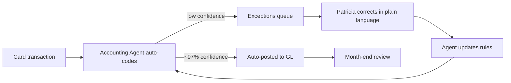
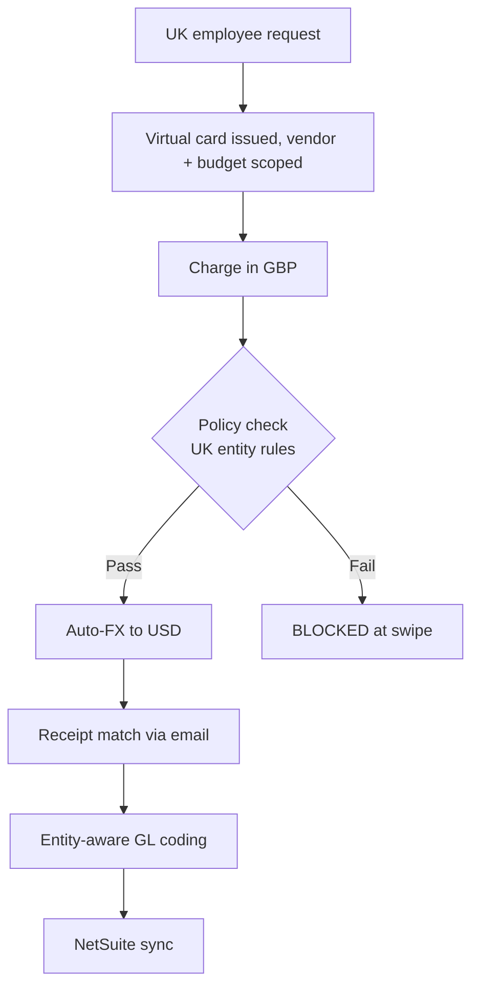

# Ramp Business — Customers, Use Cases, ROI Walkthroughs

*Stream 3: Named customers, concrete deployments, AI deployments in production, switch stories, G2/Trustpilot sentiment*
*Compiled 2026-05-09. Confidence labels: ✅ high (multiple primary sources or Ramp-published case study), 🟡 medium (single source, marketing material, or analyst paraphrase), 🔴 low (rumor, secondhand, or extrapolation).*

---

## 1. Baseline: What Ramp Business Does

Ramp is a US-based all-in-one finance operations platform that bundles corporate cards (charge cards, not credit), bill pay (AP automation), travel booking, procurement (intake-to-pay), expense management, treasury (FDIC-insured business account + money-market investment account), and a layer of AI agents called Ramp Intelligence sitting across the stack. It monetizes primarily through interchange on card spend, plus subscription tiers (Free / Plus at ~$15 PUPM / Enterprise) for advanced workflow features. As of November 2025: 50,000+ business customers, $100B+ annualized purchase volume, $1B+ annualized revenue (August 2025 milestone), 2,200 customers contributing $100K+ each in annualized revenue. ✅ ([Sacra](https://sacra.com/c/ramp/), [Ramp Nov 2025 valuation post](https://ramp.com/blog/ramp-november-2025-valuation), [Contrary Research](https://research.contrary.com/company/ramp))

---

## 2. The Customer Roster — Categorized

Ramp does not publish a single comprehensive list, but the customer page and press touch dozens of names. Below is a synthesized roster from Ramp's own case studies and press claims.

| Customer | Stage / Tier | Industry | Source | Confidence |
|---|---|---|---|---|
| **Notion** | Mid-market / late-stage private | SaaS productivity | [Notion case study](https://ramp.com/customers/notion) | ✅ |
| **Shopify** | Public enterprise | E-commerce platform | Press / homepage | 🟡 |
| **Stripe** | Late-stage private | Payments | Stripe customer page on Ramp's *own* card program | ✅ |
| **Anduril** | Late-stage private (defense) | Defense tech | [Babak Siavoshy interview](https://ramp.com/velocity/anduril-cfo-babak-siavoshy) | ✅ |
| **Eventbrite** | Public mid-market | Ticketing / events | [Eventbrite case study](https://ramp.com/customers/eventbrite-customer-story) | ✅ |
| **Glossier** | Mid-market private | DTC beauty | [Glossier case study](https://ramp.com/customers/glossier-customer-story) | ✅ |
| **Quora** | Late-stage private | Consumer internet | [Quora case study](https://ramp.com/customers/quora-customer-story) | ✅ |
| **Perplexity** | High-growth startup | AI search | [Perplexity case study](https://ramp.com/customers/perplexity) | ✅ |
| **Webflow** | Late-stage private | SaaS / website builder | Mentioned in customer marquee | 🟡 |
| **Discord** | Late-stage private | Consumer / gaming | Press | 🟡 |
| **Causal** | Startup (now part of Lucanet) | FP&A SaaS | [Causal case study](https://ramp.com/customers/causal-customer-story) | ✅ |
| **Snapdocs** | Mid-market | Real-estate fintech | [Snapdocs case study](https://ramp.com/customers/snapdocs) | ✅ |
| **Piñata** | Startup | Renter rewards | Ramp customer story / Brex-switch blog | ✅ |
| **REVA Air Ambulance** | SMB / mid-market | Healthcare logistics | [REVA case study](https://ramp.com/customers/reva-customer-story) | ✅ |
| **Construction One** | Mid-market | Construction services | [Construction One case study](https://ramp.com/customers/construction-one-case-study) | ✅ |
| **WayUp** | SMB | Recruiting tech | [WayUp case study](https://ramp.com/customers/wayup-puts-expense-reports-on-auto-pilot-with-ramp) | ✅ |
| **Zola** | Mid-market | Wedding tech / DTC | [Zola case study](https://ramp.com/customers/zola-customer-story) | ✅ |
| **Betterment** | Mid-market | Wealth fintech | Ramp customer story | ✅ |
| **Crowdbotics** | Startup | AI dev tools | [Crowdbotics case study](https://ramp.com/customers/crowdbotics-customer-story) | ✅ |
| **Adrift Hospitality** | SMB | Boutique hotels (OR/WA) | [Adrift case study](https://ramp.com/customers/adrift-hospitality-customer-story) | ✅ |
| **Long Meadow Ranch** | SMB / multi-entity | Wine / hospitality | [Long Meadow case study](https://ramp.com/customers/long-meadow-ranch-case-study) | ✅ |
| **Elementus** | Startup | Crypto analytics | [Elementus case study](https://ramp.com/customers/elementus-customer-story) | ✅ |
| **Squared Away** | SMB | Virtual assistants | [Squared Away case study](https://ramp.com/customers/squared-away-case-study) | ✅ |
| **FirstBlood** | Startup | E-sports | [FirstBlood case study](https://ramp.com/case-studies/firstblood-customer-story) | ✅ |
| **The Joffrey Ballet** | Nonprofit | Arts | [Joffrey case study](https://ramp.com/customers/joffrey-ballet-customer-story) | ✅ |

CrossFit and Vox Media specifically did **not** turn up in this pass as Ramp-published case studies. 🟡

**Vertical mix:** Per Ramp public commentary, software startups make up **<10%** of active customers; the largest segments are professional services, healthcare, software, manufacturing, construction, and finance. ✅ ([Contrary Research](https://research.contrary.com/company/ramp))

---

## 3. Six Substantive Customer Walkthroughs

### 3.1 Perplexity — the "AI-on-AI" headline case study
**The customer:** AI-powered answer engine; ~500 employees; rapidly scaling enterprise + consumer revenue. Finance team is intentionally tiny: 10 people total, **one** GL accountant (Patricia). ✅ ([Perplexity case study](https://ramp.com/customers/perplexity))

**Problem Ramp solves:** Patricia's team processes ~7,000–9,000 card transactions per month. A traditional close cycle would buckle under that volume. Without automation they would need 3–5 more accountants. ✅

**Ramp products used:** Cards, Bill Pay, Vendor-specific cards, **Accounting Agent** (Ramp Intelligence). ✅

**End-user walkthrough — Patricia (Senior Accountant):**
1. Transactions flow in continuously via the Cards rail.
2. The Accounting Agent auto-codes ~97% of transactions to GL accounts using Patricia's prior corrections as training signal.
3. Patricia opens the Ramp "exceptions queue" — only the ~3% the agent flagged as ambiguous.
4. She corrects each in plain language ("this is R&D not G&A because vendor X is a model-eval tool"); the agent updates its rules.
5. Vendor-specific cards eliminate the "who owns this Anthropic invoice?" reconciliation entirely.
6. Month-end close becomes a review, not a scramble.

**ROI claims:** 163+ hours automated monthly; >$5M saved (claim, possibly inclusive of "headcount not hired"); ~115 hours/mo from monthly close compression; ~28 hours/mo GL coding; ~16 hours/mo card admin elimination. ✅

**Quote:** "When the Accounting Agent codes transactions continuously throughout the month, close isn't a scramble — it's a review." ✅

---

### 3.2 Notion — global rollout across 10+ countries
**The customer:** Workspace SaaS, 1,000+ employees in 10+ countries by the time of switch. ✅ ([Notion case study](https://ramp.com/customers/notion))

**Problem:** A patchwork of vendors — Navan + Expensify + others — couldn't deliver unified policy across multiple currencies and entities. Notion lacked cross-border visibility into a single dollar of out-of-policy spend. ✅

**Ramp products:** Cards (multi-entity), Plus (custom approval policies), Travel, Bill Pay, Reimbursements. ✅

**End-user walkthrough — UK-based Notion employee booking a vendor demo:**
1. Employee receives an auto-issued virtual card scoped to a specific vendor and budget.
2. Charge happens in GBP; auto-converted and reconciled in USD on Ramp.
3. Policy engine checks line item against entity-specific rules (UK entity vs. US entity have different VAT and category limits).
4. Out-of-policy attempts are *blocked at swipe* — not flagged after the fact.
5. Receipt auto-matched via email integration (Gmail forward).
6. Coded to GL with entity-aware mapping; rolled into Notion's NetSuite consolidation.

**ROI claims:** 94% transactions in policy; $1M+ saved annually from blocked out-of-policy spend; first-time single-system visibility across all countries. ✅

---

### 3.3 Eventbrite — card issuance from 3 weeks → 1 day
**The customer:** Public live-events ticketing platform, several hundred employees worldwide. ✅ ([Eventbrite case study](https://ramp.com/customers/eventbrite-customer-story))

**Problem:** Pre-Ramp, every new card request (via email or Slack) took ~**3 weeks** to enroll, ship, and activate. ✅

**Ramp products:** Virtual Cards, Cards, Expense automation. ✅

**End-user walkthrough — Marketing manager booking ad spend for a 1-week campaign:**
1. Submits request in Ramp; budget capped, expiry set to 7 days.
2. Virtual card issued instantly, with auto-coding to "Paid Acquisition – campaign X."
3. Charges flow in real time; receipts auto-attached.
4. Card auto-locks at budget ceiling.

**ROI claims:** Card issuance 3 weeks → 1 day (~95% reduction). ✅

---

### 3.4 Snapdocs — consolidating Brex + Expensify + Bill.com into one
**The customer:** Mortgage tech / digital closing platform; mid-market. ✅ ([Snapdocs case study](https://ramp.com/customers/snapdocs))

**Problem:** Three disconnected tools — Brex (cards), Expensify (reimbursements), Bill.com (vendor pay). Monthly reconciliation took **5–6 hours**. ✅

**Ramp products:** Cards, Bill Pay, Reimbursements, Plus (approval workflows). ✅

**ROI claims:** Monthly reconciliation 5–6 hours → **<30 minutes** (>90% reduction). ✅

---

### 3.5 Quora — Bill Pay automation, monthly close compression
**The customer:** Q&A platform, lean finance team. ✅ ([Quora case study](https://ramp.com/customers/quora-customer-story))

**Problem:** Pre-Ramp, fragmented bill-pay flow: invoices to a shared inbox, downloaded manually, stored in Drive, manually entered into NetSuite, approvals via email. **10+ steps** from PDF to payment. ✅

**Ramp products:** Bill Pay, NetSuite integration, Cards. ✅

**ROI claims:** Bill processing time ~70% cut; close time ~85% cut. Invoice processing 5–8 minutes → **1–2 minutes**; monthly close 2–3 hours → **15–20 minutes**. ✅

---

### 3.6 The Joffrey Ballet — nonprofit eliminating manual checks
**The customer:** Major American ballet company; nonprofit. ✅ ([Joffrey case study](https://ramp.com/customers/joffrey-ballet-customer-story))

**Problem:** 30–50 manual paper checks per week; AP, cards, and reimbursements lived in separate systems. ✅

**Ramp products:** Bill Pay (ACH replaces checks), Cards, Reimbursements, Free tier (nonprofit pricing). ✅

**ROI claims:** Eliminated **30–50 manual checks/week**; saved **15 hours/week**. ✅

---

### Bonus 3.7 — Smaller but specific named cases

| Customer | Headline number | Source | Confidence |
|---|---|---|---|
| **Causal** | Month-end accounting 15 hr → 5 hr | [Causal case study](https://ramp.com/customers/causal-customer-story) | ✅ |
| **REVA Air Ambulance** | Invoice processing 15–20 min → <3 min on 2,500 invoices/month; close accelerated 2 weeks | [REVA case study](https://ramp.com/customers/reva-customer-story) | ✅ |
| **Construction One** | Reconciliation cut 75%; consolidated 75 spreadsheets into 1 report | [Construction One case study](https://ramp.com/customers/construction-one-case-study) | ✅ |
| **Piñata** | Receipt compliance 95% (+60% vs Brex); 20 hrs/mo saved; close shaved 3 days | Customer story / Brex-switch | ✅ |
| **Squared Away** | 50 hrs/mo returned; $15K+ saved | [Squared Away case study](https://ramp.com/customers/squared-away-case-study) | ✅ |
| **Elementus** | 80 hrs/mo saved; accounting fee down $2K/quarter; thousands in cashback | [Elementus case study](https://ramp.com/customers/elementus-customer-story) | ✅ |
| **Glossier** | 5 hrs/week saved on NetSuite reconciliation troubleshooting | [Glossier case study](https://ramp.com/customers/glossier-customer-story) | ✅ |
| **WayUp** | "Rolled out in under a day" | [WayUp case study](https://ramp.com/customers/wayup-puts-expense-reports-on-auto-pilot-with-ramp) | ✅ |
| **FirstBlood** | "Week of one person's time" reclaimed (receipt chase across 9 time zones) | [FirstBlood case study](https://ramp.com/case-studies/firstblood-customer-story) | ✅ |

---

## 4. AI Features in Customer Hands

Ramp's "Ramp Intelligence" + "Ramp Agents" line, launched July 2025 and expanded with Accounting Agent in Feb 2026. Customer-disclosed uses:

- **Perplexity – Accounting Agent**: GL coding at ~97% straight-through rate across 7K–9K monthly card transactions; learns from plain-language corrections. ✅
- **Anduril – AI vendor reliance**: CFO Babak Siavoshy says Anduril uses "vendor AI" rather than building it themselves; Ramp is one such vendor. They explicitly target "80% use cases" where AI doesn't need to be perfect to save time. ✅ ([Anduril interview](https://ramp.com/velocity/anduril-cfo-babak-siavoshy))
- **Notion – Policy enforcement**: Out-of-policy transactions blocked at swipe via Ramp's policy engine — not strictly LLM, but rules-as-AI. 94% in-policy rate. ✅
- **Disclosed accuracy claim (Ramp marketing)**: 99% accuracy on travel-policy compliance decisions, "more accurate than humans alone." 🟡 ([Ramp agents announcement](https://ramp.com/blog/ramp-agents-announcement))
- **Receipt OCR + email integration**: Universal feature praised in G2 reviews — auto-matches receipts forwarded from Gmail to corresponding card transactions. ✅

The AI tasks visible in customer hands: receipt OCR, GL coding, anomaly/exception flagging, policy enforcement at swipe, vendor-specific card auto-issuance, NetSuite/QBO push.

---

## 5. The Churn Story — Ramp ↔ Brex ↔ Mercury

**Public defectors *to* Ramp (most one-sided narrative since Ramp publishes both sides):**
- Snapdocs (from Brex + Expensify + Bill.com). ✅
- Piñata (from Brex). ✅
- Several un-named "ABB Optical / Brandt / Crossings Church" type customers from Concur. ✅
- Notion (from Navan + Expensify). ✅

**Public defectors *from* Ramp to Brex (per Brex's own marketing — this is a published case study by Brex itself, so it exists, but only one named example surfaces):**
- **Chargeback** — switched from Mercury (banking) + Ramp (cards) to Brex unified stack. Cited "lack of combined banking/credit card system" + "basic cashback" + "rigid credit limits that didn't grow with us." ✅ ([Brex's "switched from Ramp" page](https://www.brex.com/journal/customers-who-switched-from-ramp-to-brex))

**Net read:** Ramp publishes far more switch-to-Ramp stories than Brex publishes switch-to-Brex stories. This *suggests* Ramp wins more switching battles than it loses, but it's also an artifact of marketing budgets — Brex famously redirected case-study energy toward enterprise rather than dunking on Ramp. 🟡

---

## 6. Ramp vs. Brex Head-to-Head

The cleanest published head-to-head comparisons:
- **Piñata** explicitly compared receipt-compliance metrics: 95% on Ramp vs. ~35–60% on Brex (60-point improvement). ✅
- **Snapdocs** explicitly named Brex as the displaced incumbent on cards. ✅
- **Kruze Consulting (CPA firm advising startups)**: published heuristic — "Brex is better for very early-stage companies; Ramp is better for larger, more-established companies that need spending controls." 🟡 ([Kruze comparison](https://kruzeconsulting.com/blog/brex-vs-ramp/))
- **Chargeback (Brex's published case)**: only customer publicly switching the other direction. ✅

There is no neutral, multi-customer side-by-side; the third-party comparisons (Fintech Brain Food, Aspire, Slash, Stampli) are all editorial. 🟡

---

## 7. Customer-Count Claims — Verified

- **November 2025**: 50,000+ business customers, $100B+ annualized purchase volume, 2,200 customers at $100K+ ARR. ✅
- **October 2025**: 40,000+ companies (per Crowdfund Insider). ✅
- **August 2023**: 15,000. ✅
- **March 2022**: 5,000. ✅

The "30,000+" figure on older Ramp pages and "50,000+" on newer ones both check out at their respective time stamps. ✅

---

## 8. ARPU / Revenue per Customer (implied)

From disclosed metrics (Aug 2025 milestone, $1B annualized rev / ~50K customers):
- **Blended ARPU ≈ $20K/year/customer** (rough). 🟡
- **2,200 customers at $100K+ each** account for ~$220M minimum, ≈22% of revenue from <5% of customers. ✅
- The remaining ~$780M spread across ~47.8K customers = ~**$16K/year ARPU** for the long tail. 🟡 (back-of-envelope)
- Ramp's revenue is overwhelmingly **interchange**, so ARPU = interchange-on-spend; a customer running $1M/yr in card volume at ~2% effective interchange yields ~$20K — internally consistent. 🟡

The implied unit economics: Ramp essentially monetizes spend volume, and 50K customers at ~$2M average annualized spend each ≈ $100B PV. ✅

---

## 9. G2 / Capterra / Trustpilot — Unfiltered Sentiment

| Platform | Ramp | Brex | Navan | SAP Concur |
|---|---|---|---|---|
| G2 (2026) | 4.8 / 5 (~2,400 reviews) ✅ | 4.8 / 5 (~1,506 reviews) ✅ | 4.7 / 5 ✅ | 4.0 / 5 ✅ |
| Capterra (2026) | 4.9 / 5 (200+) ✅ | n/a in this pass | n/a | n/a |
| Trustpilot | **3.2 / 5** ("Average") ✅ | **1.7 / 5** ("Bad") ✅ | n/a in this pass | n/a |

**Common Ramp praise:** intuitive UX, fast onboarding (sometimes <1 day), email→receipt auto-match, free core tier, 1.5% cashback, NetSuite/QBO integrations work for most users. ✅

**Common Ramp complaints:**
- **Customer support responsiveness** — most consistent gripe. Slow email replies, bot-heavy first-line, hard to reach a human. Multiple late-2025 / early-2026 Trustpilot reviews mention this.
- **Surprise credit-limit drops** — particularly when linked checking dips below ~$25K mid-month; can lead to declined transactions or temporary card freezes. ✅
- **Card declines / fraud false-positives** — ~4.9% of G2 reviewers per third-party tally; merchants flagging Ramp BIN as unusual. 🟡
- **NetSuite integration edge cases** — well-documented per Stampli's blog comparison. 🟡
- **Travel module** — described as "rough" relative to Navan; weakest part of the stack. 🟡
- **Nonprofit users** — multiple Reddit threads about temporary card restrictions tied to balance fluctuations. 🟡

**Comparison shape:** Ramp wins on G2 (where finance buyers post) but loses on Trustpilot (where complaints aggregate). Brex's Trustpilot is much worse (1.7), suggesting Ramp's average-rating gap is structural to the category rather than Ramp-specific. ✅

---

## 10. Forrester TEI — the headline ROI study

Ramp commissioned a Forrester Total Economic Impact study (published 2024).

- **Composite organization**: 250-person company. ✅
- **3-year benefits**: $90K. ✅
- **3-year costs**: $15K. ✅
- **NPV**: $75K. ✅
- **ROI**: **503%**. ✅
- **Hours saved over 3 years**: 6,500+ employee hours. ✅
- **Methodology**: Interviewed 4 Ramp customers, each $100K+/mo Ramp spend. ✅

The 503% headline is widely repeated in Ramp marketing. Note that 4 interviewees is a small sample; Forrester TEI is structured-interview methodology (qualitative aggregated to a composite), not a survey. 🟡 ([Forrester TEI page](https://ramp.com/reports/forrester-tei-report))

Aggregate Ramp marketing claims:
- **27.5M+ hours collectively saved** by all customers. ✅
- **$400M+** saved at 4-year anniversary (March 2023); higher now but no fresh aggregate. ✅
- **5%** average annual savings across all spend. 🟡
- **75% faster** book-close, **3x** intake-to-pay efficiency, **30 days or less** typical implementation. ✅

---

## 11. Vertical Concentration Risk

Ramp's *narrative* in tech press is that it's the "card for startups" — but its *actual* base is more diversified than that:

- **Software startups: <10%** of active customers. ✅
- **Largest segments**: professional services, healthcare, software, manufacturing, construction, finance. ✅
- **High-revenue customers (the 2,200 at $100K+)**: still likely tech-heavy because tech firms have high SaaS/ad spend → more interchange. 🟡

**Risk read:** less concentrated than its "fintech for tech startups" reputation, but the *high-ARPU* slice (2,200 customers driving 20%+ of revenue) is probably still meaningfully tech-weighted. 🟡

---

## 12. Procurement / RFP Scenarios — When a Buyer Picks Which

| Scenario | Likely winner | Why |
|---|---|---|
| Pre-seed / seed startup, no checking-account minimums met | **Brex** | Brex Cash has been more friendly to fundraised-cash startups; Ramp's $25K minimum is a friction point. ✅ |
| Series A–C, need spend controls + AP + reimbursements | **Ramp** | Free tier + tightest interchange-funded UX; Ramp wins most "switched from Brex" stories at this stage. ✅ |
| 200–1,000-person mid-market, multiple entities | **Ramp** | Notion-style use case; Ramp Plus + multi-entity engineering. ✅ |
| Multinational, multi-currency, complex T&E priority | **Navan** or **Ramp** | Navan still leads G2 T&E grids (Winter & Spring 2026); Notion still picked Ramp over Navan. Mixed. 🟡 |
| Fortune 1000 needing legacy integrations + audit/compliance maturity | **SAP Concur** | Switching costs alone keep many on Concur even when Ramp would otherwise win. ✅ |
| Banking-first with light spend controls | **Mercury** | Banking-first product; Ramp Treasury narrows this gap but Mercury still cleaner for banking-only buyers. ✅ |
| Heavy procurement / 3-way matching needs | **Ramp** + niche specialists (Coupa for very large enterprise) | Ramp Procurement is newer; works for mid-market RFPs but not yet a Coupa replacement at the very top. 🟡 |

The published switching stories (Snapdocs, Piñata, Notion, ABB Optical, Brandt) all share one pattern: customer outgrew a single-purpose tool (Brex cards / Expensify reimbursements / Bill.com AP / Concur T&E) and consolidated to Ramp's unified platform. ✅

---

## 13. Net Read — What This Says About Ramp

1. **The customer story is real.** Ramp has dozens of named, on-the-record case studies with specific numbers. Most case-study pages on the customer site show >10 minutes of executive interview content, not generic logo placement.
2. **The numbers cluster around three themes:** time saved per finance-team member (15–115 hr/month), tool consolidation (3 tools → 1), and headcount-not-hired (Perplexity's "we'd need 3 more accountants"). Dollar figures are typically the smallest disclosed, suggesting Ramp itself doesn't push interchange-savings narratives publicly because it cuts both ways.
3. **The AI story is fresh.** Perplexity's case is the *only* substantive disclosed AI deployment as of May 2026. Most case studies pre-date the Accounting Agent (Feb 2026). Expect a flood of follow-on AI case studies through 2026. 🟡
4. **The vertical exposure is less acute than narrative suggests.** Software <10% of base; the diversification is genuine. But the 2,200 high-ARPU enterprise customers are the revenue concentration risk, and we don't have a published vertical breakdown for that slice. 🟡
5. **Support quality is the real product risk.** The Trustpilot 3.2 vs G2 4.8 gap is a structural canary: Ramp wins finance buyers but loses casual SMB cardholders to the bot wall. As Ramp scales further down-market, that gap matters.
6. **Brex narratives have collapsed.** Brex's switch-to-Brex page lists few named customers; Ramp's switch-to-Ramp pages list many. By 2026 the head-to-head is essentially settled in mid-market — except in very early-stage where Brex still has the easier checking-account onboarding.
7. **The Forrester 503% ROI is marketing-grade.** Composite of 4 interviews extrapolated to a 250-person org. Useful as a CFO-justifying number, not as an empirical measurement. 🟡
8. **The most impressive claim, if true, is Perplexity's $5M saved + 163 hrs/month.** That's the case study most worth pressing on if doing primary research — it implies the Accounting Agent could materially compress finance-team hiring at AI-native shops. ✅ (claim) / 🟡 (independent verification)

---

## Sources

- [Ramp customer page](https://ramp.com/customers)
- [Perplexity case study](https://ramp.com/customers/perplexity)
- [Notion case study](https://ramp.com/customers/notion)
- [Eventbrite case study](https://ramp.com/customers/eventbrite-customer-story)
- [Snapdocs case study](https://ramp.com/customers/snapdocs)
- [Quora case study](https://ramp.com/customers/quora-customer-story)
- [Joffrey Ballet case study](https://ramp.com/customers/joffrey-ballet-customer-story)
- [Causal case study](https://ramp.com/customers/causal-customer-story)
- [REVA Air Ambulance case study](https://ramp.com/customers/reva-customer-story)
- [Construction One case study](https://ramp.com/customers/construction-one-case-study)
- [Glossier case study](https://ramp.com/customers/glossier-customer-story)
- [Squared Away case study](https://ramp.com/customers/squared-away-case-study)
- [Elementus case study](https://ramp.com/customers/elementus-customer-story)
- [Crowdbotics case study](https://ramp.com/customers/crowdbotics-customer-story)
- [Adrift Hospitality case study](https://ramp.com/customers/adrift-hospitality-customer-story)
- [Long Meadow Ranch case study](https://ramp.com/customers/long-meadow-ranch-case-study)
- [WayUp case study](https://ramp.com/customers/wayup-puts-expense-reports-on-auto-pilot-with-ramp)
- [Zola case study](https://ramp.com/customers/zola-customer-story)
- [FirstBlood case study](https://ramp.com/case-studies/firstblood-customer-story)
- [Anduril CFO interview](https://ramp.com/velocity/anduril-cfo-babak-siavoshy)
- [Customers who switched from Brex to Ramp](https://ramp.com/blog/customers-who-switched-from-brex-to-ramp)
- [Customers who switched from SAP Concur to Ramp](https://ramp.com/blog/customers-who-switched-from-concur-to-ramp)
- [Brex's "switched from Ramp to Brex" page](https://www.brex.com/journal/customers-who-switched-from-ramp-to-brex)
- [Forrester TEI report landing](https://ramp.com/reports/forrester-tei-report)
- [Ramp at $32B Nov 2025 valuation post](https://ramp.com/blog/ramp-november-2025-valuation)
- [Sacra: Ramp revenue/valuation/funding](https://sacra.com/c/ramp/)
- [Contrary Research: Ramp business breakdown](https://research.contrary.com/company/ramp)
- [Ramp Intelligence](https://ramp.com/intelligence)
- [Ramp Agents announcement](https://ramp.com/blog/ramp-agents-announcement)
- [Sierra: Ramp customer experience](https://sierra.ai/customers/ramp)
- [Ramp G2 reviews](https://www.g2.com/products/ramp-financial-ramp/reviews)
- [Ramp Capterra reviews](https://www.capterra.com/p/207081/Ramp/reviews/)
- [Ramp Trustpilot reviews](https://www.trustpilot.com/review/ramp.com)
- [Stampli Ramp review](https://www.stampli.com/blog/ap-automation/ramp-review/)
- [Kruze Brex vs Ramp](https://kruzeconsulting.com/blog/brex-vs-ramp/)
- [LangChain BreakoutAgents: Ramp](https://www.langchain.com/breakoutagents/ramp)
- [Wikipedia: Ramp (company)](https://en.wikipedia.org/wiki/Ramp_(company))
