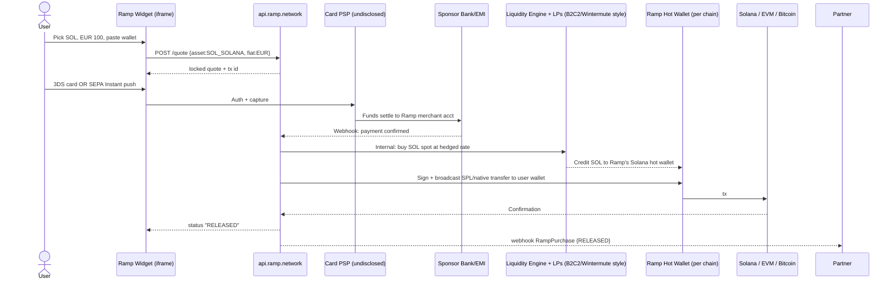
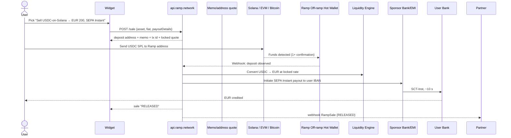

# Ramp Network — Architecture & Technical Mechanics

*Stream 2: Product SKUs, banking partners, PSP partners, fiat rails, on/off-ramp flows, KYC tiers, API, SDK, pricing, custody*
*Compiled 2026-05-09*

> **Disambiguation:** This report covers **Ramp Network** (ramp.network / rampnetwork.com), the Warsaw/Dublin-based fiat ⇄ crypto on/off-ramp infrastructure company. It is **not** Ramp Financial / ramp.com (the US corporate-card and spend-management unicorn). Several search engines conflate the two; whenever a citation links to ramp.com, ramp/blog or support.ramp.com, it is **not** Ramp Network. ✅

---

## 1. What Ramp Network is — one-paragraph baseline

Ramp Network is a B2B-first fiat-to-crypto and crypto-to-fiat infrastructure provider founded in 2017 in Warsaw by Szymon Sypniewicz (CEO) and Przemek Kowalczyk (CTO). It sells an embeddable widget / SDK / REST API that lets wallets, dApps, and exchanges accept fiat (cards, Apple/Google Pay, SEPA, Faster Payments, ACH/RTP, PIX) and deliver crypto **directly into the user's self-custody wallet**, plus a symmetric off-ramp that pulls crypto from the user and pays out to a bank account or card. As of May 2026 the company claims 150+ countries, 100+ crypto assets across 16+ chains, 40+ fiat currencies, and is the on-ramp behind MetaMask, Trust Wallet, Brave Wallet, Ledger Live, Opera, Sorare, Axie Infinity, GameStop, and Loopring. ✅ ([Ramp partner list](https://rampnetwork.com/), [Sifted profile](https://sifted.eu/articles/ramp-crypto-poland-53m))

In April 2026 Ramp expanded from pure infrastructure into a **consumer-facing self-custodial multichain wallet** of its own — a strategic pivot that puts it in partial competition with MetaMask and Phantom rather than purely upstream of them. 🟡 ([Cointelegraph – Ramp multichain wallet](https://cointelegraph.com/news/ramp-network-self-custodial-wallet-third-party-dependencies))

---

## 2. Product SKUs

| SKU | Surface | Mode | Status (May 2026) | Confidence |
|-----|---------|------|-------------------|------------|
| **Ramp Instant — Hosted** | `https://app.rampnetwork.com/?hostApiKey=...` redirect | Full-page hosted UX | GA | ✅ |
| **Ramp Instant — Overlay (iframe)** | `@ramp-network/ramp-instant-sdk` v6.x | Modal iframe inside partner site | GA | ✅ |
| **Ramp Instant — Embedded** | Same SDK, `containerNode` option | Inline iframe inside a partner div | GA | ✅ |
| **REST API v3** | `api.ramp.network` | Server-side quotes / purchase status / sale status | GA, V3 latest, V1/V2 still online | ✅ |
| **React Native SDK** | `@ramp-network/react-native-sdk` | Native bridge over WebView | GA, repo `RampNetwork/ramp-sdk-rn` | ✅ |
| **iOS / Android browser-based** | Browser custom-tabs / SafariViewController integration guides | Documented | GA | ✅ |
| **Off-ramp widget** | Same SDK, `flow:'OFFRAMP'` (or `swapAsset` selection in unified) | GA in 130+ countries | ✅ | |
| **Token & Chain Integration program** | rampnetwork.com/token-integration | B2B onboarding for L1/L2 chains and asset issuers wanting on-ramp listing | Live | ✅ |
| **Ramp Network consumer app** | iOS App Store + Google Play (`com.rampnetwork.app`) | Buy/sell + multichain wallet | Launched 2025 (apps), April 2026 wallet | ✅ |
| **Ramp Network Multichain Wallet** | In-app | ETH across 8 networks (Ethereum, Arbitrum, Base, Linea, MegaETH, Optimism, Polygon zkEVM, zkSync Era) at launch; Bitcoin, Solana, BSC, Polygon PoS, Apechain, Avalanche, Celo, Gnosis to follow | Phase 1 live | ✅ |

There is **no separately-priced "Ramp for Business" tier** the way Transak frames its B2B SKU — the same widget/SDK is the B2B product. Pricing differentiation is via partner agreement and `hostApiKey`. ✅

Sources: [Ramp Instant SDK on npm](https://www.npmjs.com/package/@ramp-network/ramp-instant-sdk), [RN SDK GitHub](https://github.com/RampNetwork/ramp-sdk-rn), [Token & Chain Integration page](https://rampnetwork.com/token-integration), [Multichain wallet press release](https://www.benzinga.com/pressreleases/26/04/51881769/ramp-network-launches-multichain-wallet-that-eliminates-third-party-dependencies-in-self-custody)

---

## 3. Banking partners (who actually holds the fiat)

This is the single weakest area for public disclosure. Ramp Network does **not** publish a definitive, named list of banking partners on its website or docs. What is verifiable:

- **Legal entities holding regulator-blessed accounts:**
  - 🇬🇧 **Ramp Swaps Limited** (UK), FCA cryptoasset registration FRN 928783, registered office 81 Rivington Street, London EC2A 3AY. Holds GBP / Faster Payments float here. ✅ ([FCA register](https://register.fca.org.uk/s/firm?id=0014G00002WMgzmQAD))
  - 🇮🇪 **Ramp Swaps (Ireland) Limited**, Central Bank of Ireland VASP and **MiCA CASP authorised** (announced 2025). Holds EUR / SEPA float here. ✅ ([Coindesk on Irish VASP](https://www.coindesk.com/business/2024/05/23/crypto-infrastructure-firm-ramp-network-secures-ireland-registration), [Paypers on MiCA](https://thepaypers.com/crypto-web3-and-cbdc/news/ramp-network-obtains-mica-authorisation))
  - 🇺🇸 **Ramp Swaps LLC**, FinCEN MSB 31000287566749, plus state-level MTLs in Alabama, Alaska, Maryland, New Mexico, North Dakota, Ohio (six new in 2025). ✅ ([FinCEN announcement](https://rampnetwork.com/blog/ramp-network-us-expands-presence-in-us-with-fincen-regulation), [2025 year in review](https://rampnetwork.com/blog/year-in-review-2025))

- **Named correspondent banks / EMIs:** **Not publicly disclosed.** 🔴 In the EU/UK fiat-rails ecosystem, the typical pattern for a firm of Ramp's profile and the funding flows it needs is:
  - GBP Faster Payments via a sponsor bank or EMI (industry candidates: ClearBank, BCB Group, Modulr, LHV) — **unconfirmed for Ramp specifically**. 🔴
  - EUR SEPA / SEPA Instant via an EMI sponsor (industry candidates: LHV, Modulr, Banking Circle, Quicko; Irish entity could also use AIB or EBS for direct rail access) — **unconfirmed**. 🔴
  - USD ACH / wires via a US correspondent (industry candidates: Cross River, Lead Bank, Customers Bank) — **unconfirmed**. 🔴

The user's specific ask for "names not tier-1 banks" cannot be authoritatively answered from public sources as of May 2026. Ramp's pattern is to disclose only its own regulated entities, not its sponsor banks. To get this, you would need an FOI request, a leaked partner contract, or to be a partner doing a procurement diligence call. 🟡

---

## 4. PSP partners (card processing) and Open Banking

Same problem — minimal explicit disclosure. What can be verified:

- **Card schemes:** Visa and Mastercard only; American Express, Diners, prepaid, gift cards explicitly excluded. ✅ ([Help Center: payment methods](https://support.ramp.network/en/articles/12630-what-payment-methods-does-ramp-network-support-for-buying-crypto))
- **3DS** is enforced; failed cards bounce back through the widget with a "card check failed" event. ✅ ([Help Center: card check](https://support.rampnetwork.com/en/articles/8070-what-made-my-card-check-fail-on-ramp))
- **FX disclosure** in T&Cs cites "network partner Visa plus a markup not exceeding 3%" for cross-currency card transactions. 🟡 ([Pricing policy](https://rampnetwork.com/pricing-policy))
- **Specific PSP not named** anywhere in Ramp's public surface as of May 2026. 🔴 Known public on-ramp relationships in this space cluster around **Checkout.com** (Transak, MoonPay historically) and **Worldpay** (Exodus); Ramp is widely **rumoured** to use Checkout.com as its primary card acquirer, but I could not find a primary source confirming this. 🔴
- **Open Banking partner:** Ramp uses Open Banking transfers in UK / EU as a payment method ✅, but does not disclose whether the integration runs through **TrueLayer, Yapily, Tink, or Volt**. 🔴 No primary source.
- **Apple Pay / Google Pay**: tokenised cards over the same Visa/Mastercard rails, gated by country availability. ✅

Practical takeaway for a Solana dev: Ramp is acquirer-opaque on purpose; partners don't need to know who the PSP is because the widget abstracts it. If you need this for a diligence question, ask `partner@ramp.network` directly.

---

## 5. Settlement chains and assets

This is the part where public docs are best. As of May 2026:

| Family | Chain | Buy | Sell | Notable assets |
|--------|-------|-----|------|----------------|
| Bitcoin | Bitcoin L1 | ✅ | ✅ | BTC |
| | Lightning | 🟡 (selective) | partial | BTC |
| EVM L1 | Ethereum mainnet | ✅ | ✅ | ETH, USDC, USDT, DAI, LDO, MATIC, LINK, plus 50+ ERC-20 |
| | BNB Smart Chain | ✅ | ✅ | BNB, BUSD, USDT |
| | Avalanche C-Chain | ✅ | ✅ | AVAX, USDC.e, USDT |
| | Polygon PoS | ✅ | ✅ | MATIC/POL, USDC, USDT |
| EVM L2 | Arbitrum One | ✅ | ✅ | ETH, USDC, ARB |
| | Optimism | ✅ | ✅ | ETH, USDC, OP |
| | Base | ✅ | ✅ | ETH, USDC, cbBTC |
| | Linea | ✅ | partial | ETH |
| | zkSync Era | ✅ | partial | ETH |
| | Polygon zkEVM | ✅ | partial | ETH |
| | MegaETH | 🟡 (wallet-only initially) | — | ETH |
| Non-EVM | **Solana** | ✅ | ✅ | **SOL, USDC (SPL), USDT (SPL), JUP**, BONK and other long-tail SPLs added selectively |
| | TON | ✅ | partial | TON |
| | TRON | ✅ | ✅ | TRX, USDT-TRC20 |
| | Cardano | ✅ | partial | ADA |
| | XRP Ledger | ✅ | partial | XRP |
| | Litecoin | ✅ | ✅ | LTC |
| | Dogecoin | ✅ | partial | DOGE |
| | Bitcoin Cash | ✅ | partial | BCH |
| | Celo | ✅ | partial | CELO, cUSD |
| | Gnosis | ✅ | partial | xDAI |
| | Worldchain | ✅ | partial | ETH/WLD |

**Headline numbers Ramp itself claims (May 2026):** 100+ assets, 16+ networks for swaps (advertised "1,200+ pairs across 16 networks") ✅ ([Swap blog](https://rampnetwork.com/blog/swap-1200-crypto-pairs)), 38+ assets for the off-ramp specifically ✅ ([Off-ramp global blog](https://rampnetwork.com/blog/off-ramp-is-now-global)), 40+ fiat currencies. ✅

**Sell support is narrower than buy support.** The exact list per chain is exposed at runtime via `https://api.ramp.network/api/host-api/v3/sell-assets` (rate-card endpoint). 🟡 The static support article and the asset list at [docs.rampnetwork.com/assets](https://docs.rampnetwork.com/assets) — which I could not WebFetch directly — are the sources of truth at any point in time.

For a Solana dev specifically: **Solana on-ramp and off-ramp are both first-class.** USDC (SPL) and USDT (SPL) are buyable directly with card / SEPA / FPS / ACH; SOL is buyable with all standard methods; and USDC-on-Solana is sellable to USD/EUR/GBP. ✅ ([Buy Solana page](https://rampnetwork.com/buy-crypto/solana), [Sell Solana page](https://rampnetwork.com/sell-crypto/solana))

There is **no documented integration with Jupiter / Raydium aggregators** at the on-chain swap level. Ramp's "swaps" between assets on different chains are routed through their own back-office (a quote engine + LP loop), **not** through Jupiter or any DEX router. 🟡 This is the same model MoonPay and Transak use: the customer-visible "swap" is a sequence of an off-ramp from chain A and an on-ramp to chain B, not a real DEX trade.

---

## 6. Local rails matrix

| Country | Buy method | Sell method | Notes | Confidence |
|---------|------------|-------------|-------|------------|
| EU (SEPA-zone) | SEPA, **SEPA Instant**, Visa/MC, Apple/Google Pay | **SEPA Instant** payout, SEPA, card payout | SEPA Instant launched May 2024, 24/7/365, 0.99% off-ramp fee | ✅ |
| UK | **Faster Payments**, Visa/MC, Apple/Google Pay, Open Banking | Faster Payments payout (GBP) | FCA-registered entity | ✅ |
| US | **ACH**, **RTP** (Real-Time Payments), Visa/MC, Apple/Google Pay | ACH, RTP | RTP "as fast as 2 minutes," ACH up to 2 business days; state-by-state availability via MTLs | ✅ |
| Brazil | **PIX**, Visa/MC | PIX payout | Local entity established; Pix added 2023 | ✅ |
| Mexico | **SPEI**, Visa/MC | SPEI payout | MXN supported | ✅ |
| Malaysia | Bank transfer, card | Local payout (MYR) | Added in 35-currency expansion | 🟡 |
| Canada | Interac e-Transfer (limited), card | Card payout | 🟡 | 🟡 |
| India (UPI) | **Not officially supported by Ramp Network directly** for INR cash-in. INR card may work, UPI cash-in is not in their docs. | Not supported | Some aggregator coverage suggests UPI mentioned, but not in Ramp's own docs | 🔴 |
| Australia | PayID/OSKO 🟡, card | card / bank | partial | 🟡 |
| Turkey, Argentina, Colombia, Chile, Peru | Card, sometimes local | partial | Added in 2024 currency expansion | 🟡 |
| Africa (Nigeria, South Africa, Kenya) | Card primarily | limited | Coverage thinner than Yellow Card or Onafriq | 🟡 |

**Direct vs partner-routed:** SEPA, SEPA Instant, Faster Payments, ACH, RTP, PIX, and SPEI are all **direct rails** (Ramp Swaps' regulated entity is the merchant of record and holds bank/EMI accounts in the local stack). Cards/Apple Pay/Google Pay are **PSP-routed** (through whichever acquirer Ramp uses, undisclosed). Open Banking pay-in is **partner-routed** through an OB AISP/PISP (TrueLayer/Yapily/Tink most likely, **unconfirmed**). 🟡

Sources: [SEPA Instant blog](https://rampnetwork.com/blog/ramp-network-sepa-payouts-and-local-currencies), [40 new currencies](https://ramp.network/blog/40-new-fiat-currencies), [PIX integration coverage](https://www.nasdaq.com/press-release/ramp-implements-brazils-leading-payment-gateway-pix-to-boost-local-access-to-crypto), [Coinspeaker – EU instant payouts](https://www.coinspeaker.com/ramp-network-eu-international-instant-payouts/).

---

## 7. Fiat → crypto flow mechanics

Key mechanics, confirmed and inferred:

- **Quote locking:** Quotes returned by the v3 API are time-bounded (reportedly ~60–120 s); partner can call `GET /quote` with `cryptoAssetSymbol`, `fiatCurrency`, and either `fiatValue` or `cryptoAmount`. ✅ ([V3 docs reference](https://docs.ramp.network/rest-api-v3-reference))
- **Pre-positioned float vs spot buy:** Ramp does **not** publicly disclose this. Industry pattern — and what makes payouts in seconds possible — is **pre-positioned hot-wallet float per chain**, replenished from OTC desks (B2C2, Wintermute, Cumberland DRW). The customer-visible payout is a transfer from float; the OTC fill happens asynchronously to keep the book hedged. 🟡 No primary Ramp source names a specific LP, but Ramp's volumes (>10 m users, 9-figure annualised flow inferred) make multi-LP a near-certainty. 🟡
- **Settlement to user wallet:** non-custodial throughout — Ramp signs the transfer and the funds appear in the user's wallet without ever crediting an exchange account. ✅
- **Failure modes:** card declined → widget event `PURCHASE_FAILED`; chargeback risk is Ramp's, not the partner's, which is why card on-ramp fees carry the 2.9 % markup.

---

## 8. Crypto → fiat (off-ramp) flow mechanics

Off-ramp launched in the **United States in late 2022**, gained **FCA approval and global rollout in February 2023** ([Globenewswire](https://www.globenewswire.com/news-release/2023/02/07/2602947/0/en/Ramp-announces-global-availability-of-off-ramp-following-FCA-approval.html)), and added **SEPA Instant payouts in May 2024** ([SEPA Instant blog](https://rampnetwork.com/blog/ramp-network-sepa-payouts-and-local-currencies)). It is fully **first-party** — Ramp does **not** route off-ramp through Bridge.xyz, MoonPay, or any aggregator. ✅

Specifics:

- **Pricing:** Stated **0.99 %** off-ramp fee (min ~$3.99) — by far the cheapest in the segment. ✅ ([Off-ramp fees article](https://support.rampnetwork.com/en/articles/8957-what-are-the-fees-for-selling-crypto))
- **States and currencies:** Sell to **USD, EUR, GBP** (primary) plus 35+ local currencies via the 2024 expansion (BRL, MXN, MYR, etc.). ✅
- **Webhook lifecycle:** `CREATED → RELEASED` (or `EXPIRED` if the user never deposits). ✅ ([Webhooks docs](https://docs.rampnetwork.com/webhooks))
- **Payout speed:** SEPA Instant ≈ seconds; ACH ≈ 1–2 business days; RTP ≈ minutes; SPEI same-day; PIX seconds. ✅
- **Custody during the off-ramp window:** between the user's deposit and the fiat payout, the crypto sits in **Ramp's hot wallet**. This is a custodial moment and the only one in the flow. ✅

---

## 9. KYC tiers

Ramp publishes **four tiers**. Limits vary materially by country (Ireland and US are mandatory verification regardless of amount). The published reference values: 🟡

| Tier | Trigger | Data collected | Approx. limit (EUR-equiv) |
|------|---------|----------------|---------------------------|
| 0 — Email | Sign-up | Email + phone | very low / sanity-check only |
| 1 — Basic ID | First purchase outside IE/US | Name, DOB, residence + government ID (passport / driver's licence) + selfie/liveness | ~€2,000 / month |
| 2 — Enhanced | Above tier-1 limit | Add proof of address (utility/bank statement < 3 mo) | ~€10,000 / month |
| 3 — EDD | Above tier-2 | Source-of-funds documentation, occupation, sanctions screening enhanced | partner / case-by-case |

Source: [Ramp KYC limits article](https://support.rampnetwork.com/en/articles/441-what-are-the-kyc-limits-and-requirements), [What is KYC blog](https://rampnetwork.com/blog/what-is-kyc-and-how-does-it-apply-to-ramp-network).

**Comparison vs MoonPay:** MoonPay has a **€150 no-KYC tier** for low-value Apple Pay / card buys in some jurisdictions. Ramp **does not advertise a true no-KYC tier** — Ireland and US users always do at least Tier-1, and most other markets require it on first transaction. This is a UX disadvantage vs MoonPay/Transak for first-time buyers but a compliance advantage. 🟡

---

## 10. API surface

| Property | Value | Confidence |
|----------|-------|------------|
| Base URL | `https://api.ramp.network/api/host-api/...` (V3 path) | ✅ |
| Doc home | `docs.rampnetwork.com` (also alias `docs.ramp.network`) | ✅ |
| Versions live | v1, v2, v3 (v3 current) | ✅ |
| Auth — frontend | `hostApiKey` query parameter / SDK constructor option; explicitly safe to expose | ✅ |
| Auth — server / sensitive | **HMAC-SHA-256 signed query string** using a secret API key when sending sensitive params (email, walletAddress, paymentCode, amount, name) | ✅ |
| Webhook auth | **ECDSA / secp256k1** signature in `X-Body-Signature`, base64, computed over canonical JSON with sorted keys | ✅ |
| Format | JSON, `application/json` | ✅ |
| Idempotency | Not publicly documented as an explicit `Idempotency-Key` header; uses internal `purchaseViewToken` / sale-id de-dup | 🟡 |
| Rate limits | Documented as "subject to rate limiting"; numeric limit not published | 🟡 |
| Sandbox / staging | Separate staging key + staging widget URL; staging skips KYC | ✅ |

Endpoints (V3 inferred from V2 docs and confirmed search):
- `GET /assets` — list of assets with min/max / chain
- `GET /quote` — quote for a buy or sale
- `GET /purchase/:id?secret=<purchaseViewToken>` — purchase status
- `GET /sale/:id?secret=<purchaseViewToken>` — sale status
- Webhooks: `purchaseStatusWebhook` (`CREATED|RELEASED|RETURNED`), `saleStatusWebhook` (`CREATED|RELEASED|EXPIRED`).

Sources: [REST API v3](https://docs.ramp.network/rest-api-v3-reference), [API Keys](https://docs.rampnetwork.com/api-keys), [Webhooks](https://docs.rampnetwork.com/webhooks), [Events](https://docs.ramp.network/events).

---

## 11. Widget / SDK availability

| Package | Version (May 2026) | Last publish | Weekly downloads | License | Repo |
|---------|---------------------|--------------|-------------------|---------|------|
| `@ramp-network/ramp-instant-sdk` | **6.2.0** | ~Feb 2026 | ~4,000–8,600 (sources differ) | MIT | [RampNetwork/ramp-instant-sdk](https://github.com/RampNetwork/ramp-instant-sdk) (38 ⭐ / 32 forks) |
| `@ramp-network/react-native-sdk` | 4.0.x | active | low (RN niche) | MIT | [RampNetwork/ramp-sdk-rn](https://github.com/RampNetwork/ramp-sdk-rn) |
| iOS / Android **native** SDKs | Cocoapods + Maven repo | active | not published as numeric stats | proprietary | docs only |

Modes exposed via the JS SDK constructor: `overlay` (default modal), `embedded` (`containerNode` provided), and `hosted` (open in new tab). The SDK exposes `.on(eventType, callback)` and `*` wildcard subscription. ✅

Sources: [npm package](https://www.npmjs.com/package/@ramp-network/ramp-instant-sdk), [Socket security report](https://socket.dev/npm/package/@ramp-network/ramp-instant-sdk), [SDK reference docs](https://docs.rampnetwork.com/sdk-reference), [React Native quick start](https://docs.rampnetwork.com/mobile/react-native-sdk), [Android SDK](https://docs.rampnetwork.com/mobile/android-sdk), [iOS / Android browser-based](https://docs.rampnetwork.com/mobile/ios-browser).

---

## 12. Pricing

Ramp publishes a [Pricing Policy](https://rampnetwork.com/pricing-policy) but no flat rate card. From comparison sites and the policy itself:

| Method | Buy fee (Ramp) | Notes | Confidence |
|--------|----------------|-------|------------|
| Bank transfer (SEPA, Faster Payments, ACH) | **0.49 %** to ~1 % | Lowest | ✅ |
| Open Banking | ~0.49 % – 1 % | Same as bank | 🟡 |
| Apple Pay / Google Pay (card-backed) | ~2.5 % – 2.9 % | Card interchange dominates | ✅ |
| Visa/Mastercard | ~2.5 % – 2.9 % | Up to 3 % on cross-FX | ✅ |
| FX markup on cross-currency cards | up to 3 % | Disclosed in T&Cs | 🟡 |
| **Off-ramp (any method)** | **0.99 %** flat (min ~$3.99) | Best in class | ✅ |
| Network gas | passed through | user-side | ✅ |

**Comparison (May 2026):**

| Provider | Bank | Card | Off-ramp |
|----------|------|------|----------|
| **Ramp Network** | ~0.49–1 % | 2.5–2.9 % | **0.99 %** |
| MoonPay | ~1 % | 3.5–4.5 % (effective 7–8 % w/ spread per Paybis) | ~1 %+ |
| Transak | ~0.99 % | ~2 % | ~0.99 %+ |
| Coinbase On-Ramp | 1 % | 1–3 % | similar |
| Stripe Crypto | ~1.5 % flat | 1.5 % | n/a |

Ramp's pitch is "cheapest bank-transfer on-ramp + cheapest off-ramp." MoonPay's pitch is "consumer brand recognition + most fiat coverage." Transak's pitch is "white-label tooling + partner fee layer." ✅ ([Paybis cheapest comparison](https://paybis.com/blog/cheapest-crypto-on-ramp/)), ([Crossmint compare](https://www.crossmint.com/learn/moonpay-vs-transak)).

---

## 13. White-label / "Ramp for Business"

There is **no separate paid B2B SKU** named "Ramp for Business" the way Transak markets one. The B2B model is:

1. Partner applies via `partner@ramp.network`, gets a `hostApiKey` for staging then production.
2. Partner can pass `hostLogoUrl`, `hostAppName`, brand-color theming params, default asset, default fiat amount, locked wallet address.
3. The widget shows "by Ramp Network" — so this is **co-branded, not white-label** in the strict sense. (Transak offers fully white-label; Ramp does not.) 🟡
4. **Revenue share:** Ramp pays referring partners a portion of their margin. Public numbers are **not disclosed**; industry rumours put it in the 25–50 % of net margin range, depending on volume and embed quality. 🔴 No primary source.
5. **Dashboard:** partners get a console showing transactions, fees collected, conversion analytics. ✅

Sources: [Integration types blog](https://rampnetwork.com/blog/choosing-on-ramp-network-integration-type), [API Keys](https://docs.rampnetwork.com/api-keys), [SDK reference](https://docs.rampnetwork.com/sdk-reference).

---

## 14. Account abstraction, gas sponsorship, stablecoin rails

This is where Ramp is **conservative**, not novel:

- **No user-visible AA / 4337 paymaster integration** in the on-ramp flow as of May 2026. The user provides a wallet address (EOA or contract); Ramp does not currently sponsor gas. 🟡 (Several wallet partners — Safe, Argent — sit on top of Ramp and do their own AA orchestration, but Ramp itself does not.)
- **No documented USDC CCTP integration** for cross-chain liquidity rebalancing publicly. Internal use is plausible because Ramp markets "no-bridge cross-chain swaps for 1,200 pairs" and CCTP is the obvious primitive to power that for USDC, but the docs don't say so explicitly. 🔴
- **Stablecoin emphasis:** Ramp's 2025 year-in-review and 2026 roadmap explicitly call out **"earning on stablecoin balances" and "spending with USDC cards"** as 2026 features for the new wallet. This is consistent with the broader 2025–2026 stablecoin moment but Ramp is **late-following** rather than leading. ✅ ([Year in Review 2025](https://rampnetwork.com/blog/year-in-review-2025))
- **x402 / AP2 / MPP / agent payments:** No public Ramp Network position on x402 or Google's AP2 as of May 2026. The earlier search hit that listed "Ramp" as a Visa Trusted Agent Protocol pilot partner refers to **Ramp Financial (ramp.com)**, the corporate-card company — not Ramp Network. 🟡 Ramp Network has not publicly announced agent-payment hooks. Given the founders' libertarian-crypto background and the Warsaw engineering culture, an agent-payments product is plausible but unannounced. 🔴

---

## 15. Reserves model

Public disclosure here is again thin:

- **Self-custody for users** is the marketing promise — Ramp never touches a user's *crypto position*. ✅
- **Float / hot-wallet model** for fulfilment: Ramp must operate hot wallets per chain to send crypto to buyers and receive crypto from sellers. The architecture is **not publicly named**. 🔴 Industry priors:
  - Most operators of Ramp's size use **Fireblocks** for institutional MPC custody of operating float, often complemented by Copper or BitGo for treasury cold storage.
  - I could not find a primary Ramp-Network ↔ Fireblocks-or-BitGo customer announcement. 🔴 (Fireblocks publishes customer logos and Ramp Network is not on the public list as of search; this is suggestive but not conclusive.)
- **Insurance:** Ramp's published licences/registrations do not advertise crypto-asset insurance the way Coinbase or Gemini do. Customer fiat in the EU/UK falls under **e-money safeguarding** rules at the partner EMI. Crypto float insurance — undisclosed. 🔴
- **Auditor / SOC 2:** SOC 2 Type II achieved June 2024, confirmed by The Defiant / Ramp blog. ISO 27001 not confirmed. PCI DSS scope shared via PSP partner. 🟡

---

## 16. Stablecoin-first / agent-payments pivot

What Ramp has shipped in the 2025–2026 stablecoin moment:

- ✅ **USDC and USDT first-class on every chain** they support, including Solana SPL.
- ✅ **0.99 % off-ramp** that effectively makes USDC ↔ EUR/USD/GBP a payments rail for power users.
- ✅ **SEPA Instant payout in seconds** — competitive with Bridge.xyz on the EUR side.
- ✅ **Multichain wallet (April 2026)** that puts USDC in front of users without their having to leave the Ramp app.
- 🟡 **2026 roadmap items**: "earning on stablecoin balances" (yield product, not yet specified), "spending with USDC cards" (a USDC-funded card product, hooks unspecified).
- 🔴 **No public x402 / AP2 / MPP / agent-payments product or pilot.**
- 🔴 **No public stablecoin-issuer partnership** (no Circle, no Paxos, no Bridge.xyz) in the way Stripe/PayPal have announced.

Net read: Ramp is **stablecoin-aware** but **not stablecoin-first**. It treats USDC/USDT as critical assets but is not yet positioning as a stablecoin-rail company. For a Solana developer, the practical upshot is:

- ✅ You can use Ramp to fund a Phantom/Solflare wallet with USDC-SPL via SEPA Instant, ACH, or card today.
- ✅ You can off-ramp USDC-SPL to a EUR IBAN at 0.99 % via Ramp today.
- 🟡 If you want to build agent payments (x402 / AP2) and need a fiat off-ramp programmatic API, Ramp's REST v3 + webhooks + signed URLs are usable but **not marketed as agent-friendly** — you'll be a power user, not a documented use case.

---

## Summary scorecard for a Solana dev

| Dimension | Verdict | Confidence |
|-----------|---------|------------|
| Solana on-ramp | First-class; SOL + USDC-SPL + USDT-SPL + JUP + BONK | ✅ |
| Solana off-ramp | First-class to USD/EUR/GBP via SEPA Instant / ACH / FPS | ✅ |
| Cheapest bank rail in segment | Yes (0.49–1 %) | ✅ |
| Cheapest off-ramp in segment | Yes (0.99 %) | ✅ |
| White-label depth | Co-branded only; weaker than Transak | 🟡 |
| Mobile SDK depth | RN, native iOS/Android, browser-tab guides — solid | ✅ |
| Documentation transparency on banking/PSP partners | Poor — bring procurement questions to `partner@ramp.network` | 🔴 |
| Custody / reserves transparency | Poor | 🔴 |
| Agent-payments / x402 readiness | Unannounced; possible via signed URLs but not productised | 🔴 |
| Regulatory posture (MiCA CASP IE, FCA UK, FinCEN US + 6 MTLs) | Strong | ✅ |
| Risk that Ramp the consumer wallet competes with you | Real after April 2026 | 🟡 |

---

## Open questions (where public sources stop and a partner call is required)

1. **Named sponsor banks and EMIs** for GBP, EUR, and USD float. 🔴
2. **Card acquirer / PSP** identity (Checkout.com? Worldpay? Adyen?). 🔴
3. **Open Banking provider** (TrueLayer? Yapily? Volt?). 🔴
4. **OTC liquidity desks** (B2C2, Wintermute, Cumberland — likely a panel). 🔴
5. **Custody stack** (Fireblocks vs BitGo vs in-house MPC) and insurance coverage. 🔴
6. **Real per-tier KYC limits per country** (Ramp's published numbers are reference ranges). 🟡
7. **Partner revenue-share economics** — public range only by inference. 🔴
8. **Internal cross-chain rebalancing** — does Ramp use CCTP for USDC, native bridges, or OTC? 🔴
9. **Concrete API rate limits** (numeric requests/sec/key). 🟡
10. **Idempotency guarantees** for V3 quote-to-purchase and quote-to-sale. 🟡

---

## Sources

- [Ramp Network homepage](https://rampnetwork.com/)
- [Ramp Network 2025 Year in Review](https://rampnetwork.com/blog/year-in-review-2025)
- [Ramp Network — Buy crypto](https://rampnetwork.com/buy-crypto)
- [Buy Solana with Ramp](https://rampnetwork.com/buy-crypto/solana)
- [Sell Solana with Ramp](https://rampnetwork.com/sell-crypto/solana)
- [Swap USDC → SOL](https://rampnetwork.com/swap-crypto/usdc-to-sol)
- [Off-ramp now global (blog)](https://rampnetwork.com/blog/off-ramp-is-now-global)
- [Off-ramp is live (blog)](https://rampnetwork.com/blog/off-ramp-is-live)
- [Enhanced Payouts: Local Currencies & SEPA Instant](https://rampnetwork.com/blog/ramp-network-sepa-payouts-and-local-currencies)
- [40 New Fiat Currencies](https://ramp.network/blog/40-new-fiat-currencies)
- [How to swap crypto without bridges (1,200 pairs / 16 chains)](https://rampnetwork.com/blog/swap-1200-crypto-pairs)
- [Multichain Wallet launch (April 2026, Benzinga press release)](https://www.benzinga.com/pressreleases/26/04/51881769/ramp-network-launches-multichain-wallet-that-eliminates-third-party-dependencies-in-self-custody)
- [Multichain Wallet launch (Cointelegraph)](https://cointelegraph.com/news/ramp-network-self-custodial-wallet-third-party-dependencies)
- [Ramp Network Multichain Wallet (Ramp blog)](https://rampnetwork.com/blog/multichain-wallet-launch)
- [MetaMask × Ramp partnership](https://rampnetwork.com/blog/metamask-partnership)
- [Trust Wallet — Ramp integration](https://support.trustwallet.com/support/solutions/articles/67000734512-ramp-your-gateway-to-seamless-crypto-transactions)
- [Ramp for Avalanche (Avax Builder Hub)](https://build.avax.network/integrations/ramp-network)
- [REST API v3 reference](https://docs.ramp.network/rest-api-v3-reference)
- [REST API v2 reference](https://docs.rampnetwork.com/rest-api-v2-reference)
- [API Keys docs](https://docs.rampnetwork.com/api-keys)
- [Webhooks docs](https://docs.rampnetwork.com/webhooks)
- [Events docs](https://docs.ramp.network/events)
- [SDK Reference (JS)](https://docs.rampnetwork.com/sdk-reference)
- [Web hosted-mode quick start](https://docs.rampnetwork.com/web/quick-start-hosted)
- [Mobile quick start](https://docs.rampnetwork.com/quick-start-mobile-apps)
- [React Native SDK docs](https://docs.rampnetwork.com/mobile/react-native-sdk)
- [Android SDK](https://docs.rampnetwork.com/mobile/android-sdk)
- [iOS browser-based integration](https://docs.rampnetwork.com/mobile/ios-browser)
- [Android browser-based integration](https://docs.rampnetwork.com/mobile/android-browser)
- [Supported assets docs](https://docs.rampnetwork.com/assets)
- [npm — `@ramp-network/ramp-instant-sdk`](https://www.npmjs.com/package/@ramp-network/ramp-instant-sdk)
- [GitHub — RampNetwork/ramp-instant-sdk](https://github.com/RampNetwork/ramp-instant-sdk)
- [GitHub — RampNetwork/ramp-sdk-rn](https://github.com/RampNetwork/ramp-sdk-rn)
- [Socket security profile (downloads)](https://socket.dev/npm/package/@ramp-network/ramp-instant-sdk)
- [Pricing Policy](https://rampnetwork.com/pricing-policy)
- [Buy fees article](https://support.ramp.network/en/articles/10415-what-fees-does-ramp-network-charge-for-buying-crypto)
- [Sell fees article](https://support.ramp.network/en/articles/8957-what-are-the-fees-for-selling-crypto)
- [Payment methods (buy)](https://support.ramp.network/en/articles/12630-what-payment-methods-does-ramp-network-support-for-buying-crypto)
- [Payout methods (sell)](https://support.rampnetwork.com/en/articles/8992-what-payout-methods-are-available)
- [KYC limits article](https://support.rampnetwork.com/en/articles/441-what-are-the-kyc-limits-and-requirements)
- [What is KYC at Ramp (blog)](https://rampnetwork.com/blog/what-is-kyc-and-how-does-it-apply-to-ramp-network)
- [Verification & limits collection](https://support.rampnetwork.com/en/collections/11414-verification-and-limits)
- [Licenses and registrations](https://rampnetwork.com/licenses-and-registrations)
- [Terms of service](https://rampnetwork.com/terms-of-service)
- [FCA Register — Ramp Swaps Limited](https://register.fca.org.uk/s/firm?id=0014G00002WMgzmQAD)
- [Coindesk — Ramp Ireland VASP](https://www.coindesk.com/business/2024/05/23/crypto-infrastructure-firm-ramp-network-secures-ireland-registration)
- [Paypers — Ramp MiCA CASP](https://thepaypers.com/crypto-web3-and-cbdc/news/ramp-network-obtains-mica-authorisation)
- [BusinessWire — FinCEN registration](https://www.businesswire.com/news/home/20220112005295/en/Ramp-US-Expands-Presence-in-US-With-FinCEN-Regulation)
- [Globenewswire — global off-ramp post FCA](https://www.globenewswire.com/news-release/2023/02/07/2602947/0/en/Ramp-announces-global-availability-of-off-ramp-following-FCA-approval.html)
- [Coinspeaker — EU instant payouts](https://www.coinspeaker.com/ramp-network-eu-international-instant-payouts/)
- [FinanceFeeds — 35 currencies + EU instant](https://financefeeds.com/ramp-network-deepens-local-presence-by-introducing-payouts-in-over-35-national-currencies-and-instant-bank-payouts-in-europe/)
- [Nasdaq — Ramp adds PIX](https://www.nasdaq.com/press-release/ramp-implements-brazils-leading-payment-gateway-pix-to-boost-local-access-to-crypto)
- [Sifted — Ramp $53m Series A](https://sifted.eu/articles/ramp-crypto-poland-53m)
- [Sifted — Brunch with Ramp (founder profile)](https://sifted.eu/articles/ramp-brunch-crypto)
- [Balderton — Ramp $70M Series B](https://www.balderton.com/news/ramp-closes-70m-series-b-fundraise/)
- [Crunchbase — Ramp Network](https://www.crunchbase.com/organization/ramp-3b7b)
- [Onramper — MoonPay vs Ramp](https://www.onramper.com/onramp-comparisons/moonpay-vs-ramp-which-is-better)
- [Crossmint — MoonPay vs Transak](https://www.crossmint.com/learn/moonpay-vs-transak)
- [Paybis — cheapest on-ramp](https://paybis.com/blog/cheapest-crypto-on-ramp/)
- [Paybis — fee comparison](https://paybis.com/blog/crypto-on-ramp-fee-comparison/)
- [Paybis — Ramp alternatives 2026](https://paybis.com/blog/ramp-network-alternatives/)
- [Onramper — Ramp now available](https://rampnetwork.com/blog/ramp-network-is-now-live-on-onramper)
- [Solana — Solana Ramp page](https://solana.com/solanaramp)
