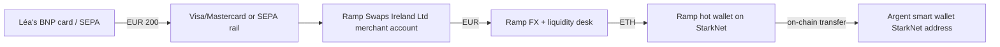
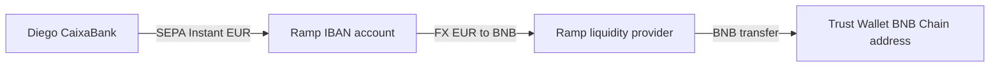
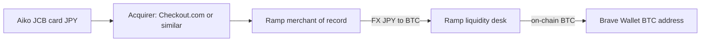
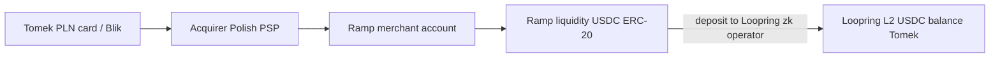
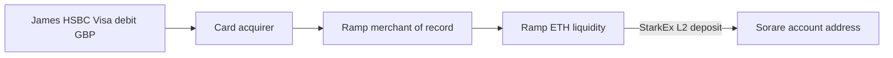

# Ramp Network — Customers, Use Cases, End-User Walkthroughs

*Stream 3: Named customers (wallets, dApps, L1/L2 partners), end-user flows, money paths, customer-loss stories*
*Compiled 2026-05-09*

> ⚠️ **Naming-collision warning that surfaced repeatedly during research.** Ramp Network (rampnetwork.com / ramp.network) is regularly conflated with Ramp Business (ramp.com), the YC-backed corporate-card / spend-management company that hit a $32B valuation in November 2025. Several headlines I found (e.g. PRNewswire Nov 2025 "Ramp reaches $32B valuation") refer to Ramp Business, **not** Ramp Network. Treat any "Ramp" stat that mentions "spend management," "corporate cards," "TPV $57B," "Notion / Shopify / Webflow customers," "Lightspeed-led $300M round," or a $32B valuation as **Ramp Business**, not the crypto onramp. The figures in this report are filtered for crypto-Ramp (Ramp Network) only. ✅

---

## 1. What Ramp Network does (baseline)

Ramp Network (legal vehicle: Ramp Swaps Sp. z o.o., later Ramp Swaps (Ireland) Limited, founded 2018 in Warsaw by Szymon Sypniewicz and Przemek Kowalczyk) is a **B2B2C fiat-to-crypto on/off-ramp infrastructure provider**. It sells an embeddable widget + SDK that wallets, dApps, and web3 games drop in so their end-users can buy/sell crypto with debit/credit cards, Apple Pay, Google Pay, SEPA, ACH, RTP, SPEI, and Pix without leaving the host app — crypto delivered straight to the user's self-custodial wallet (non-custodial flow). Ramp itself never holds end-user crypto. Ramp is FCA-registered in the UK and, as of December 2025, an EU-wide MiCAR-authorised CASP via the Central Bank of Ireland ✅ ([Ramp blog – MiCAR authorisation](https://rampnetwork.com/blog/ramp-swaps-micar-authorisation), [Bitcoin.com News](https://news.bitcoin.com/ramp-network-secures-micar-license-from-central-bank-of-ireland/)).

Funding: $52.7M Series A (2021, Balderton-led), $70M Series B Nov 2022 co-led by Mubadala Capital and Korelya Capital, with Balderton, Galaxy Digital Ventures, NFX, Cogito, Seedcamp, Firstminute participating — total ≈ $130M ✅ ([Balderton announcement](https://www.balderton.com/news/ramp-closes-70m-series-b-fundraise/), [CoinDesk](https://www.coindesk.com/business/2022/11/09/ramp-raises-70m-to-provide-crypto-payments-infrastructure)).

---

## 2. Enumerated named customers / partners

The roster Ramp itself markets as "trusted by hundreds of businesses" with named anchor logos ✅ ([Bitget compare](https://www.bitget.com/academy/ramp-vs-crypto-onram), [Onramper compare](https://www.onramper.com/onramp-comparisons/moonpay-vs-ramp-which-is-better)):

> **Axie Infinity, Brave Browser, DeFi Kingdoms, GameStop, Ledger, Loopring, MetaMask, Opera, Sorare, Trust Wallet** — that ten-logo block is what Ramp puts above the fold.

Plus second-tier integrations identified across blog posts and press releases:

| Customer | Type | Announced | Source |
|---|---|---|---|
| Argent | Wallet (StarkNet) | First on zkSync Era 2023; ongoing | [Argent case study](https://rampnetwork.com/blog/argent-success-story) ✅ |
| 1inch Wallet | Wallet (DeFi) | 2024 | [Ramp 2024 recap](https://rampnetwork.com/blog/year-in-review-2024) ✅ |
| Zerion | Wallet (portfolio) | early integration (Ramp Instant SDK launch ~2020) | [Medium – Ramp Instant goes live](https://medium.com/rampnetwork/ramp-instant-goes-live-b90abd8253bb) 🟡 |
| Multis | Wallet | Ramp Instant launch | same Medium post 🟡 |
| AdEx | dApp | Ramp Instant launch | same Medium post 🟡 |
| Universal Login | SDK | Ramp Instant launch | same Medium post 🟡 |
| Sorare | dApp (sports NFTs) | live; case study | [Sorare success story](https://rampnetwork.com/blog/sorare-success-story) ✅ |
| Brave Wallet | Browser-wallet | On-ramp May 2022; off-ramp March 2023 | [Brave blog](https://brave.com/blog/sell-with-ramp/) ✅ |
| MetaMask | Wallet | Long-running; L2 sell added 2024 | [Ramp blog – MetaMask L2s](https://rampnetwork.com/blog/ramp-metamask-l2s) ✅ |
| Ledger Live | HW wallet UI | live | [Trust Wallet support / compare pages](https://www.bitget.com/academy/ramp-vs-crypto-onram) ✅ |
| Trust Wallet | Wallet | ~2022 on-ramp; off-ramp Apr 2023 | [CoinDesk](https://www.coindesk.com/business/2023/04/05/trust-wallet-partners-with-moonpay-and-ramp-for-off-ramp-integration), [Trust Wallet community](https://community.trustwallet.com/t/ramp-network-has-been-integrated-to-trust-wallet/239339) ✅ |
| Opera (Crypto Browser) | Browser-wallet | UK launch July 2020 | [Opera blog](https://blogs.opera.com/mobile/2020/07/easy-crypto-wallet-top-ups-in-the-uk-with-ramp-partnershipp-with-dapp-com/) ✅ |
| Loopring | L2 / smart wallet | live; case study | [Loopring case study](https://rampnetwork.com/blog/loopring-success-story) ✅ |
| Axie Infinity | Web3 game | Aug 2021; case study (60→19 steps) | [Ramp blog – Axie case study](https://blog.ramp.network/axie-infinity-0) ✅ |
| DeFi Kingdoms | Web3 game | live | Ramp customer logos 🟡 |
| GameStop (NFT marketplace) | Marketplace | 2022 | Ramp customer logos 🟡 |
| LUKSO Network | L1 ecosystem | 2024 | [Ramp – Lukso integration](https://ramp.network/blog/ramp-network-integrates-with-lukso-network) ✅ |
| Telos | L1 ecosystem | Feb 2024 | [Chainwire](https://chainwire.org/2024/02/01/ramp-rolls-out-global-on-ramp-for-tlos-the-native-token-of-the-telos-blockchain/) ✅ |
| SWEAT Wallet (move-to-earn / NEAR) | Wallet/dApp | 2024 | [Ramp 2024 recap](https://rampnetwork.com/blog/year-in-review-2024) ✅ |
| Arkham (analytics + ARKM token) | dApp/CEX | 2024 | [Ramp blog – ARKM integration](https://ramp.network/blog/ramp-network-integrates-arkm) ✅ |
| Coco Wallet | Wallet (LATAM remittance) | 2024 — case study claims +75% volume | [Coco case study](https://rampnetwork.com/blog/coco-wallet-success-story) ✅ |
| Polkadot Asset Hub via Velocity Labs | L1 partner | April 2024 (USDC, USDT, DOT) | [CryptoBriefing](https://cryptobriefing.com/velocity-labs-and-ramp-network-facilitate-fiat-to-crypto-onramp-on-polkadot-via-asset-hub-support/) ✅ |
| Avalanche | L1 ecosystem | listed in Avalanche Builder Hub | [Avalanche Builder Hub](https://build.avax.network/integrations/ramp-network) ✅ |
| Privy | Embedded wallet infra | USDT-on-Solana joint launch 2025 | [The Defiant](https://thedefiant.io/news/defi/usdt-live-solana-plasma-ethereum-ramp-privy-rt2zgt) ✅ |
| Plasma (stablechain) | L1 | 2025 USDT launch | same source ✅ |
| Solana Foundation | L1 ecosystem (Ramp listed on solana.com/solanaramp) | live | [Solana on/off ramp page](https://solana.com/solanaramp), [Solana Compass](https://solanacompass.com/projects/ramp) ✅ |
| Fuse | L1 ecosystem | listed in Fuse ecosystem | [Fuse ecosystem](https://www.fuse.io/ecosystem-project/ramp) ✅ |

Customers expected to find but couldn't confirm (or saw listed only on aggregator pages) — flagging as 🔴 / not-verified:
- Phantom (uses MoonPay, Coinbase Pay, Stripe, Robinhood, Onmeta — **Ramp not listed** on Phantom's documented provider lineup) 🔴 ([Phantom help center](https://help.phantom.com/hc/en-us/articles/4406543783571-How-to-buy-Solana-SOL-Ethereum-ETH-Polygon-POL-and-Bitcoin-BTC))
- Backpack — no public Ramp integration confirmed 🔴
- Solflare — no public Ramp integration confirmed 🔴
- Magic Eden — only indirect via Brave's "Brave + Solana + Ramp + Magic Eden" 2022 announcement, not a direct ME-Ramp widget integration 🔴 ([crypto.news](https://crypto.news/brave-browser-solana-ramp-magic-eden-integration-web3/))
- OpenSea — appears in **MoonPay's** roster, not Ramp's
- Coinbase Wallet, Rainbow, Frame — not found
- Decentraland, The Sandbox — not found in any case-study or press release; Ramp's gaming logos lean on Axie Infinity, DeFi Kingdoms, Sorare instead

---

## 3. Customer tiers

### Wallets
**Anchor (active, named in Ramp's home tier):** MetaMask ✅, Trust Wallet ✅, Brave Wallet ✅, Ledger Live ✅, Argent ✅, Opera Crypto Browser ✅, 1inch Wallet ✅, Zerion 🟡 (early SDK partner, current depth unclear), Coco Wallet ✅, SWEAT Wallet ✅.
**Notably absent:** Phantom 🔴, Backpack 🔴, Solflare 🔴, Coinbase Wallet 🔴, Rainbow 🔴, Frame 🔴.

### dApps / Web3 apps
Sorare ✅, Axie Infinity ✅, DeFi Kingdoms 🟡, Loopring (smart wallet + DEX) ✅, GameStop NFT marketplace 🟡, AdEx 🟡, Multis 🟡, Arkham 🟡, Universal Login 🟡.

### L1/L2 ecosystem partners
Solana ✅ (listed on solana.com/solanaramp), Avalanche ✅, Polygon ✅, Polkadot Asset Hub via Velocity Labs ✅ (April 2024), zkSync Era ✅ (first onramp, 2023), StarkNet ✅, Linea ✅, Base ✅, Arbitrum ✅, Optimism ✅, MegaETH ✅, Polygon zkEVM ✅, LUKSO ✅, Telos ✅, NEAR ✅, Plasma (stablecoin chain) ✅, Tempo ✅, Fuse ✅. Cardano (ADA) and Cosmos (ATOM) appear on the supported-asset list but no foundation-level partnership PR found.

### Exchanges
**Effectively zero CEX integrations** — and structurally that's correct. CEXes operate their own onramps (Coinbase Pay, Kraken Onramp, Bybit, Binance Pay) so they're not Ramp's TAM. The closest thing is Arkham Exchange (whose ARKM token Ramp listed) ✅. No Binance / Coinbase / Kraken / OKX / Bitstamp deals exist publicly. 🔴/✅

---

## 4. Six deep customer walkthroughs

### 4.1 Argent (now "Ready" — StarkNet smart wallet)

**Customer product.** Argent is a London-based mobile smart-contract wallet that pioneered account abstraction on Ethereum (recovery via guardians, gas abstraction, dApp access from inside the app). It pivoted from zkSync Era to StarkNet in late 2024, rebranding to Ready in 2025 ✅ ([The Block](https://www.theblock.co/post/260179/crypto-wallet-developer-argent-to-stop-zksync-era-development-to-prioritize-starknet)).

**Problem Ramp solves.** Before Ramp, an Argent user had to (a) sign up on a CEX in their fiat country, (b) pass CEX KYC, (c) buy ETH on Ethereum L1, (d) pay L1 gas to bridge to zkSync, (e) wait for finality, (f) only then have funds in Argent. Three separate apps, two KYC events, gas friction. Ramp collapsed (a)-(f) into one in-app overlay that delivers ETH directly to the user's L2 address, no L1 hop, no bridge gas ✅ ([Argent success story](https://rampnetwork.com/blog/argent-success-story)).

**Ramp product used.** Mobile Native SDK (iOS/Android), overlay flow, white-label theming. Argent was Ramp's marquee win for being the **first onramp ever to support zkSync Era** as a destination chain (2023) ✅.

**End-user persona walkthrough — "Léa, 28, Lyon, FR, first-time DeFi user."** She wants 200 EUR of ETH to try Aave on StarkNet:
1. Downloads Argent on iOS, recovers via 2 guardian friends.
2. Taps "Add funds" → Ramp overlay opens inside Argent.
3. KYC: passport photo + selfie liveness (Onfido under the hood). Ramp typically clears UK/EU consumers in 2–5 minutes; mid-tier ($1k+) tickets can need proof of address ✅.
4. Pays €200 via SEPA Instant from her BNP Paribas account (low-fee path) or with her Visa debit (~2.9% card fee).
5. Ramp Swaps (Ireland) executes the EUR→ETH conversion. Liquidity is sourced from Ramp's market-maker network (historically including Cumberland/B2C2) and Ramp routes the ETH directly to Léa's StarkNet address — no L1 leg.
6. Funds settle in 1–10 minutes. She can immediately deposit into Aave on StarkNet from inside Argent.

**Money path.**

**Pre-Ramp alternative.** Argent would have needed to wire (a) a card-acquirer like Checkout.com or Stripe Crypto, (b) a KYC vendor (Onfido / Sumsub), (c) a sanctions/AML stack, (d) L1→L2 bridging UX, (e) per-jurisdiction money-transmitter or e-money registrations across 30 EU + UK. Build cost easily 18–24 months and seven figures.

**Disclosed cost.** Ramp doesn't publish revenue-share with Argent. Argent's case-study language ("3 apps → 1 app" and "66% reduction") is qualitative; no specific bps disclosed 🟡. Public Ramp bank-transfer fee starts at 0.49%; cards 2.9–4.9% ✅ ([Bitget](https://www.bitget.com/academy/ramp-vs-crypto-onram)).

---

### 4.2 Trust Wallet

**Customer product.** Trust Wallet — Binance-acquired self-custodial mobile wallet, 100M+ downloads claimed, multi-chain (EVM + Solana + Cosmos + Bitcoin).

**Problem Ramp solves.** Trust uses an aggregator model: it offers Ramp **and** MoonPay **and** Topper **and** Banxa side-by-side at the buy-crypto screen. Ramp's job is to be the cheapest-or-most-available option in EU/UK and to support local payment rails (SEPA Instant, UK Faster Payments, Pix, SPEI) where MoonPay is weaker. ✅ ([Trust Wallet support](https://support.trustwallet.com/support/solutions/articles/67000734512-ramp-your-gateway-to-seamless-crypto-transactions))

**Ramp product used.** Web SDK (iframe overlay) inside the in-app webview; off-ramp added in April 2023 alongside MoonPay's off-ramp ✅ ([CoinDesk Apr 2023](https://www.coindesk.com/business/2023/04/05/trust-wallet-partners-with-moonpay-and-ramp-for-off-ramp-integration)).

**End-user walkthrough — "Diego, 34, Madrid, Trust Wallet user wanting BNB."**
1. Opens Trust Wallet → Buy → BNB → Trust shows quotes from Ramp / MoonPay / Banxa.
2. Picks Ramp because EUR fee for SEPA Instant is lowest.
3. KYC done once and persists — repeat purchases skip it.
4. €100 SEPA Instant from CaixaBank → BNB on BNB Chain → settles in his Trust Wallet BSC address in ~5 minutes.

**Money path.**

**Headline claim.** Joint promo June 5–11, 2023: Trust waived all Ramp fees for first-purchasers, drove **+300% week-over-week new-user signups** through the Ramp+Trust funnel ✅ ([Trust Wallet success story](https://rampnetwork.com/blog/trust-success-story)). Ramp also claims downstream effects: ~50% increase in fund rate, 2× retention vs other funding methods, +80% monthly app opens — but these are Ramp's own numbers from "a similar campaign with another partner," not externally audited 🟡.

---

### 4.3 Brave Wallet

**Customer product.** Brave Wallet is the natively-integrated browser wallet inside Brave Browser (~80M MAU at the time of integration). Multi-chain (EVM + Solana + Filecoin + BTC view).

**Problem Ramp solves.** Brave wanted a single onramp that worked in both desktop extension and mobile, with off-ramp parity for compliance with EU/UK. Ramp's FCA registration and global off-ramp (Feb 2023 launch) made it the natural choice ✅ ([Globenewswire](https://www.globenewswire.com/news-release/2023/02/07/2602947/0/en/Ramp-announces-global-availability-of-off-ramp-following-FCA-approval.html)).

**Ramp product used.** JavaScript SDK overlay launched from Brave's wallet UI, with the wallet address pre-filled and locked. White-labeled to Brave's brand (no Ramp Network logo dominance).

**Walkthrough — "Aiko, 31, Tokyo (Brave on macOS), wants 0.05 BTC."**
- Aiko clicks Buy in Brave Wallet → Ramp overlay opens, pre-filled with her Brave BTC address.
- KYC passes via Onfido using Japanese driver's licence + selfie (~3 min).
- She pays with a JCB card. (Note: JCB support is region-dependent — some users report JCB declines; Visa/Mastercard most reliable 🟡.)
- BTC delivered to her Brave BTC address; on-chain settlement ~10–20 min after confirmations.

**Off-ramp:** Mar 2023 launch — Aiko can also sell crypto from Brave Wallet to JPY via Wise / SWIFT for international rails ✅ ([Brave blog](https://brave.com/blog/sell-with-ramp/)).

---

### 4.4 Loopring (zkRollup L2 + smart wallet)

**Customer product.** Loopring is a zk-rollup DEX + smart-contract wallet on Ethereum. Heavy in 2021–22, since shrunk in TVL but still operational.

**Problem Ramp solves.** Ethereum L1 gas was the killer onboarding tax for new Loopring users. Ramp delivers ETH/USDC/LRC directly to the user's Loopring L2 account — bypassing L1 deposit, no gas, no bridge wait ✅ ([Loopring case study](https://rampnetwork.com/blog/loopring-success-story)).

**Ramp product used.** Web SDK + custom L2 destination address routing. Ramp added LRC as a supported token specifically for this integration.

**Walkthrough — "Tomek, 26, Warsaw, wants 500 USDC on Loopring L2 to provide LP liquidity."**
- Opens Loopring smart wallet → Add Funds → Ramp overlay
- Pays via Polish Blik or PLN card
- USDC arrives on Loopring L2 (no L1 leg, no L1 gas, no manual bridge)
- Total time: 5–8 min including KYC

**Disclosed metrics.** "Within 3 months: 20,000+ Ramp transactions for Loopring. Avg ticket ~$300. Ramp = highest % of all Loopring on-ramp volume, beating every other onramp option." ✅ ([Loopring case study](https://rampnetwork.com/blog/loopring-success-story)).

---

### 4.5 Sorare

**Customer product.** Sorare is a Paris-based fantasy-football NFT game (officially licensed Premier League, NBA, MLB cards) running on Ethereum + StarkWare's StarkEx L2. Account-abstracted email-login wallets behind the scenes.

**Problem Ramp solves.** Sorare's user base is **football fans, not crypto natives**. They need to top up their Sorare smart-contract address with ETH or USDC to buy player cards in card auctions denominated in ETH. Ramp solves: no MetaMask install, no seed phrase, no L2 bridge step, just card → ETH in Sorare account ✅ ([Sorare success story](https://rampnetwork.com/blog/sorare-success-story)).

**Ramp product used.** Hosted/iframe widget inside the Sorare web app. Address auto-resolved from logged-in Sorare account (the user never sees a 0x address).

**Walkthrough — "James, 41, Manchester, Premier League fan with no prior crypto."**
- Logs into Sorare with email + Google → wins a player auction at 0.04 ETH
- "Top up" button → Ramp overlay
- Visa debit (HSBC UK) £100 → 0.04 ETH delivered to his Sorare-managed StarkEx account in ~3 min
- Total apps used by James: 1 (Sorare). He doesn't know what StarkEx is.

---

### 4.6 Axie Infinity

**Customer product.** Axie Infinity (Sky Mavis) — Pokémon-style P2E game on the Ronin sidechain. Major SE-Asia user base, especially Philippines.

**Problem Ramp solves.** Axie's onboarding pre-Ramp was a 60-step nightmare: install Metamask, fund ETH, bridge to Ronin, set up Ronin wallet, swap to AXS/SLP/WETH on Katana, buy Axie team. **Ramp cut this to 19 steps and reduced time from ~2 hours to ~12 minutes** ✅ ([Ramp blog – Axie](https://blog.ramp.network/axie-infinity-0)). Buyers can purchase SLP, AXS, and WETH on Ronin with U.S. Visa/Mastercard.

**Ramp product used.** Web SDK + Ronin-network destination support (specifically added for Axie). 90% faster onboarding is the headline.

**Walkthrough — "Maria, 22, Manila, wants to start playing Axie."**
- Goes to axieinfinity.com → makes a Ronin wallet (browser ext.)
- Clicks "Buy AXS with card" → Ramp overlay
- KYC via PH-passport + selfie
- Pays USD $50 with BPI Visa (Philippine peso routed through Visa cross-border)
- AXS lands in her Ronin wallet — she can then trade AXS→Axies on the Ronin marketplace

Ramp gives Sky Mavis a clean fiat path that doesn't require Maria to ever touch Binance / Coins.ph / GCash → Metamask → bridge.

---

## 5. Active vs PR-only

| Customer | Status | Evidence |
|---|---|---|
| MetaMask | **Active** | Continuously updated through 2024 (L2 sell-flow added); appears in every "buy crypto in MetaMask" support article ✅ |
| Trust Wallet | **Active** | Aggregator co-list with MoonPay; off-ramp added 2023; named in Ramp 2025 review ✅ |
| Brave Wallet | **Active** | On + off ramp live, Ramp = primary provider in Brave Wallet sell flow ✅ |
| Argent / Ready | **Active but pivoted** | Originally zkSync, migrated to StarkNet alongside Argent. Argent rebranded to Ready 2025 — Ramp follows ✅ |
| Sorare | **Active** | Case study still live, Sorare still uses Ramp inside its top-up flow ✅ |
| Axie Infinity | **Likely degraded** | The case-study win was 2021–22 era. Axie's user count collapsed 95%+ post-Ronin hack. Integration may still be live but "active" is generous 🟡 |
| Loopring | **Likely degraded** | Loopring's TVL collapsed 2023–25; integration probably still live but volume tiny 🟡 |
| GameStop NFT marketplace | **Dead / dormant** | GameStop wound down its NFT marketplace in early 2024 🔴 |
| DeFi Kingdoms | **Dormant** | DFK volume down 99% from peak, still listed 🔴 |
| Opera Crypto Browser | **Dormant / unclear** | Original Opera+Ramp 2020 announcement; Opera later integrated Simplex (2021) and shifted strategy 🟡 |
| 1inch Wallet | **Active** | 2024 announcement; 1inch Wallet Android added on-ramp aggregation including Ramp ✅ |
| Coco Wallet | **Active, growing** | 2024 case study, +75% volume claim ✅ |
| Polkadot Asset Hub (Velocity Labs) | **Active** | Apr 2024 launch, named in Ramp 2024 recap ✅ |
| LUKSO | **Active** | 2024 ✅ |
| Telos | **Active** | Feb 2024 ✅ |
| SWEAT Wallet | **Active** | 2024 ✅ |
| Arkham | **Active** | ARKM token integration 2024 ✅ |
| Privy + Plasma + USDT-on-Solana joint launch | **Active** | 2025 launch ✅ |

---

## 6. End-user persona

What can be stitched together from public reviews, the company's regulatory stance, and the product surface:

- **Geography skew:** **UK + EU heavy.** Ramp is UK-incorporated (founded 2018 Warsaw + London), FCA-registered, and only got MiCAR coverage in late 2025. Trust Wallet's joint promo in 2023 was specifically Europe-targeted ✅. Ramp has US 50-state coverage but in the US it's competing against Coinbase Pay and MoonPay's much louder presence. Latin America (Pix, SPEI, Coco Wallet) is the explicit growth bet 2024–25. Brazil (Pix) and Mexico (SPEI) called out specifically ✅.
- **Age:** No public demographic data 🔴. The product positioning ("as easy as e-commerce", non-technical first-buyers) plus partner mix (Sorare = football fans, Axie = SEA gamers, Brave = privacy-first browser users) suggests a 25-45 mainstream consumer demographic, not crypto-Twitter natives.
- **Sophistication:** **Low.** Ramp's positioning is explicitly "first-time crypto buyers" — both founders' framing (Sypniewicz interviews) and partner case studies (Argent: "your first DeFi step", Sorare: "no MetaMask required") point to non-native users 🟡.
- **Ticket size:** Loopring case study disclosed ~$300 average ticket ✅. Trust Wallet promo data implies similar ranges. Most UK card limits land in the £100–£500 first-purchase band.

---

## 7. Volume / user-count claims (verifiable vs not)

- Ramp Network publishes a live transactions page at [rampnetwork.com/transactions](https://rampnetwork.com/transactions) for MiCAR transparency reporting ✅.
- The 2024 recap claims being "the highest-ranked crypto company on Sifted's Rising 100 B2B SaaS Startups for 2024 (24th overall)" ✅ ([Year-in-review 2024](https://rampnetwork.com/blog/year-in-review-2024)).
- The 2025 recap claims 195+ cross-chain swap pairs at launch and "long-standing integrations moving from on-ramp-only to full buy + sell" ✅ ([Year-in-review 2025](https://rampnetwork.com/blog/year-in-review-2025)).
- Loopring case study: 20,000+ transactions in 3 months, $300 avg ticket → ~$6M onboarded for a mid-tier L2 in 90 days ✅.
- **No total annualized GMV figure has been published publicly by Ramp Network** (and "Ramp $57B TPV" in search results refers to Ramp Business, not Ramp Network) 🔴. This is conspicuously absent compared to MoonPay, which has thrown around figures like "$3B+ annual volume."
- 160+ employees as of 2024, offices in UK, US, Ireland, Poland ✅.

---

## 8. Onboarding friction & operational reliability

- **First-time buy speed:** Most Trustpilot positive reviews describe ~3–10 minute end-to-end purchase for card payments ✅.
- **KYC time:** Self-reported 1–5 minutes for clean Onfido pass; longer (hours to days) for re-review cases. Ramp's KYC stack is Onfido + Sumsub-style document/selfie verification + sanctions screening 🟡.
- **Card-decline rate:** Not publicly disclosed 🔴, but Trustpilot complaints suggest meaningful decline rates for non-Visa/Mastercard cards (JCB, Amex, prepaid cards), and intermittent issues with bank fraud-control rejections especially for first-time crypto purchases.
- **Fees disclosed:**
  - Bank transfer (SEPA Instant, ACH, RTP, SPEI): from **0.49%** ✅ ([rampnetwork.com](https://rampnetwork.com/))
  - Card payment: **2.9–4.9%** depending on jurisdiction, BIN, asset 🟡 ([Bitget](https://www.bitget.com/academy/ramp-vs-crypto-onram))
  - Sell/off-ramp fees vary by payout method (ACH/SEPA/SPEI/RTP)
  - Compare: MoonPay cards up to 4.5% with $3.99 minimum; Ramp's blended price is generally 50–100bps cheaper than MoonPay on bank transfers, comparable on cards ✅.

---

## 9. Customer-support surface — the unfiltered side

Trustpilot data is the cleanest public signal ✅ ([trustpilot.com/review/ramp.network](https://www.trustpilot.com/review/ramp.network)):

- **~10,000+ reviews**, overall hovering near **4.0–4.3 stars** depending on page sample (different mirrors show different aggregates).
- **Repeated complaint patterns:**
  - **KYC failures with no explanation.** Multiple reviews where users completed KYC, got "verified", and then hit a transaction block. Bank statements rejected without reason given.
  - **Stuck transactions / "money disappeared".** Funds debited from card, KYC step then errors out, support unresponsive. Several reviews specifically call out the chat being FAQ-only with no live agent.
  - **Chargeback impotence.** A user's bank told them "Bill/Transfer Payment" classification removed Visa Purchase chargeback rights — i.e., Ramp routes some transactions in ways that strip cardholder protections.
  - **Order re-pricing after KYC.** A user reported completing KYC, only for the original order to expire and be re-quoted at a worse rate.
- **Common positives:** "Smooth as buying groceries online", "no hidden fees", "completed in minutes", first-time buyer-friendly UX. The bimodal distribution is consistent with most onramps — happy users stay quiet until something breaks.
- **Geo-blocks:** Most US states covered; certain countries (Russia, sanctioned jurisdictions, parts of Africa) blocked or limited. Some Indian / Turkish / Pakistani / Nigerian Trustpilot reviews reference geographic friction 🟡.

---

## 10. Competitor migration stories

Searched explicitly for "wallet switched from MoonPay to Ramp" and "wallet dropped Ramp for MoonPay" and **could not find a single clean narrative case** of a wallet publicly defecting in either direction 🔴. The dominant pattern across major wallets (Trust Wallet, MetaMask, Brave, Phantom, Coinbase Wallet) is **aggregator integration**: they offer Ramp **and** MoonPay **and** Banxa **and** Topper / Onramper concurrently, with quote-routing per user. So the unit of competition is no longer "win the wallet" — it's "win the route" once the user is already in the wallet's onramp picker. That's a meaningful strategic shift relative to 2020–22 when wallet-exclusive deals were the prize.

The closest thing to a public "loss" is **Phantom**, which uses MoonPay as the headline + Stripe + Robinhood + Coinbase Pay + Onmeta — and **does not list Ramp** as of 2025 ✅ ([Phantom help](https://help.phantom.com/hc/en-us/articles/4406543783571-How-to-buy-Solana-SOL-Ethereum-ETH-Polygon-POL-and-Bitcoin-BTC)). Given Phantom's scale and Solana-centricity, that's a notable absence for Ramp.

---

## 11. Solana-specific named integrations

Filtering specifically for the Solana ecosystem ✅:

- **Solana Foundation:** Ramp is listed on the official Solana onramp directory at [solana.com/solanaramp](https://solana.com/solanaramp) ✅. Solana Compass also lists Ramp as a supported on/off ramp for Solana ✅ ([Solana Compass](https://solanacompass.com/projects/ramp)).
- **Solana support added across product:** SOL, USDC-on-Solana, USDT-on-Solana (2025 with Privy + Plasma launch) all supported ✅.
- **No direct integration with Phantom, Backpack, or Solflare confirmed.** This is **the central Solana finding**: Ramp supports Solana the chain, but the **three biggest Solana wallets do not surface Ramp as their default onramp**. Phantom uses MoonPay/Coinbase/Stripe/Robinhood. Backpack and Solflare have their own provider stacks.
- Ramp can be reached *as a destination wallet* from a Phantom address (the user opens Ramp's hosted page at buy.ramp.network and pastes their Phantom Solana address), but that's not an embedded integration — it's a generic "send-to-wallet" use.
- **Implication for a Solana developer:** if you ship a Solana dApp and want an embedded onramp, your live-customer reference points are weaker for Ramp than for MoonPay or Coinbase Onramp. Privy + Ramp (the 2025 USDT-on-Solana launch) is the cleanest Solana-on-Ramp story today.

---

## 12. Comparison to MoonPay's customer roster

MoonPay's loud-logo slate:
- **Visa** (commercial agreement / Web3 Loyalty)
- **OpenSea** (NFT mint/buy with card)
- **Bitcoin.com**
- **Trust Wallet** (yes, **same** wallet — co-listed)
- **Universal Music**
- **Ledger**
- **Bitcoin.com Wallet**
- **PayPal** (some integrations)
- **imToken**
- **Phantom** (default fiat onramp)

**Head-to-head:**

| | Ramp Network | MoonPay |
|---|---|---|
| Wallet anchor logos | MetaMask, Trust, Brave, Ledger, Argent, Opera, 1inch | Trust, imToken, Phantom, Ledger, Bitcoin.com Wallet |
| dApp / NFT logos | Sorare, Axie, Loopring | OpenSea, Universal Music NFTs, Mojito |
| Brand-name retail | (none) | Visa, PayPal |
| L1 ecosystem | Solana, Polkadot, Avalanche, LUKSO, Telos, NEAR, Plasma | Bitcoin (deep), Solana, Ethereum, Cardano |
| Geographic strength | UK/EU, +LATAM via Pix/SPEI 2024-25 | US dominant, global breadth |
| Solana-specific wallet wins | Privy infra, Solana.com listing | **Phantom** (biggest single SOL wallet) |

MoonPay's roster is louder in **mainstream/retail brands**; Ramp's is denser in **wallet/L2/DeFi-native** infrastructure. Ramp is strong with crypto-native power-user wallets (MetaMask, Argent, Brave, Trust); MoonPay is strong with consumer-facing brand campaigns (Visa Web3 Loyalty, Universal Music, OpenSea). For a Solana-first founder, MoonPay has Phantom; Ramp does not 🟡.

---

## 13. High-profile customer LOSSES

**Confirmed / strongly suggested losses:**

- **Phantom never adopted Ramp** — not a "loss" so much as a never-won. Material because Phantom is the dominant Solana wallet 🟡.
- **GameStop NFT marketplace** wound down 2024; the integration is effectively dead 🔴.
- **Argent's zkSync Era track was deprecated** late 2024 — Ramp followed Argent to StarkNet, so this is a re-platform not a loss, but the original zkSync-Era-first marketing story has aged 🟡.
- **Axie Infinity** integration is technically still alive but the user base has collapsed; Ramp's biggest single case-study win is now a fraction of its former volume 🟡.
- **Loopring** — same story; integration likely live but volume materially down post-2023 🟡.
- **Coinbase Wallet, Rainbow, Frame, Backpack, Solflare** — never integrated as far as public records show 🔴.

No documented case found of a major wallet publicly migrating off Ramp to a competitor with a "we switched" announcement. The losses are mostly attrition (dApp dies, marketplace shuts) or non-acquisitions (Phantom).

---

## Bottom line for a Solana-developer audience

1. Ramp Network's **defensible base is EU-native wallet & smart-wallet infra**: MetaMask, Argent, Brave, Trust, Loopring, Sorare, 1inch, Coco Wallet. ✅
2. Ramp is **structurally weaker on Solana** than on EVM — no Phantom/Backpack/Solflare embedded integrations confirmed; Solana coverage is via direct widget + Privy infra, not native wallet partnerships. 🟡
3. The **B2B2C funnel is now an aggregator funnel.** Wallets show 3–5 onramp providers and route by quote — so Ramp's per-user winrate matters more than any single-wallet exclusive deal. ✅
4. Real customer losses are mostly **dApp attrition** (GameStop NFT, weakening Axie/Loopring) and one **never-won** (Phantom). 🟡
5. The most credible recent customer signals are **Coco Wallet (LATAM remittance)**, **1inch Wallet**, **Polkadot Asset Hub via Velocity Labs**, and the **Privy + Plasma + USDT-on-Solana** stack — these are 2024–25 launches that suggest Ramp is leaning into stablecoins and emerging-market rails rather than chasing more EVM-wallet logos. ✅
6. The **MiCAR authorisation in late 2025** is the single most important commercial catalyst going forward — it gives Ramp a unified EU passport, which competitors without an Irish CASP licence don't yet have. ✅

If your research thesis is "find niche AI×crypto problems," the Ramp customer roster reveals two real, non-obvious gaps:
- **No Solana-native wallet has a deep Ramp integration** — implying the embedded-onramp slot in Solana wallets is contested and more provider-replaceable than on EVM, which means routing/quote-aggregation logic on Solana is itself a product surface.
- **Ramp's emerging-markets lean (Coco Wallet, Pix, SPEI)** suggests the high-margin volume is shifting from "DeFi degens in London" to "remittance corridors via stablecoins" — a different end-user persona than the MetaMask/Argent original wedge, and probably the right place to look for under-served jobs-to-be-done.

---

## Sources

- [Ramp Network – Argent success story](https://rampnetwork.com/blog/argent-success-story)
- [Ramp Network – Trust Wallet success story](https://rampnetwork.com/blog/trust-success-story)
- [Ramp Network – Loopring case study](https://rampnetwork.com/blog/loopring-success-story)
- [Ramp Network – Coco Wallet case study](https://rampnetwork.com/blog/coco-wallet-success-story)
- [Ramp Network – Sorare success story](https://rampnetwork.com/blog/sorare-success-story)
- [Ramp Network – Axie Infinity case study](https://blog.ramp.network/axie-infinity-0)
- [Ramp Network – 2024 year in review](https://rampnetwork.com/blog/year-in-review-2024)
- [Ramp Network – 2025 year in review](https://rampnetwork.com/blog/year-in-review-2025)
- [Ramp Network – MetaMask L2 sell flow](https://rampnetwork.com/blog/ramp-metamask-l2s)
- [Ramp Network – Polkadot Asset Hub integration](https://rampnetwork.com/blog/ramp-network-integrates-with-the-polkadot-asset-hub)
- [Ramp Network – LUKSO integration](https://ramp.network/blog/ramp-network-integrates-with-lukso-network)
- [Ramp Network – Telos integration](https://rampnetwork.com/blog/ramp-network-unleashes-simplified-web3-onboarding-with-telos)
- [Ramp Network – Arkham (ARKM) integration](https://ramp.network/blog/ramp-network-integrates-arkm)
- [Ramp Network – MiCAR authorisation](https://rampnetwork.com/blog/ramp-swaps-micar-authorisation)
- [Brave – Crypto off-ramp in Brave Wallet](https://brave.com/blog/sell-with-ramp/)
- [Opera blog – Crypto Wallet top-ups via Ramp](https://blogs.opera.com/mobile/2020/07/easy-crypto-wallet-top-ups-in-the-uk-with-ramp-partnershipp-with-dapp-com/)
- [The Block – Argent stops zkSync Era](https://www.theblock.co/post/260179/crypto-wallet-developer-argent-to-stop-zksync-era-development-to-prioritize-starknet)
- [CoinDesk – Ramp $70M Series B](https://www.coindesk.com/business/2022/11/09/ramp-raises-70m-to-provide-crypto-payments-infrastructure)
- [Balderton – Ramp Series B announcement](https://www.balderton.com/news/ramp-closes-70m-series-b-fundraise/)
- [CoinDesk – Trust Wallet + Ramp + MoonPay off-ramp](https://www.coindesk.com/business/2023/04/05/trust-wallet-partners-with-moonpay-and-ramp-for-off-ramp-integration)
- [Trust Wallet support – Ramp gateway](https://support.trustwallet.com/support/solutions/articles/67000734512-ramp-your-gateway-to-seamless-crypto-transactions)
- [Phantom help – buy crypto in Phantom](https://help.phantom.com/hc/en-us/articles/4406543783571-How-to-buy-Solana-SOL-Ethereum-ETH-Polygon-POL-and-Bitcoin-BTC)
- [Solana on/off ramp directory](https://solana.com/solanaramp)
- [Solana Compass – Ramp on Solana](https://solanacompass.com/projects/ramp)
- [The Defiant – USDT live on Solana, Plasma, Ethereum (Ramp + Privy)](https://thedefiant.io/news/defi/usdt-live-solana-plasma-ethereum-ramp-privy-rt2zgt)
- [CryptoBriefing – Velocity Labs + Ramp on Polkadot](https://cryptobriefing.com/velocity-labs-and-ramp-network-facilitate-fiat-to-crypto-onramp-on-polkadot-via-asset-hub-support/)
- [Avalanche Builder Hub – Ramp Network](https://build.avax.network/integrations/ramp-network)
- [Onramper – MoonPay vs Ramp comparison](https://www.onramper.com/onramp-comparisons/moonpay-vs-ramp-which-is-better)
- [Bitget – Ramp vs onramps](https://www.bitget.com/academy/ramp-vs-crypto-onram)
- [Trustpilot – Ramp Network reviews](https://www.trustpilot.com/review/ramp.network)
- [Ramp – live transactions reporting](https://rampnetwork.com/transactions)
- [Bitcoin.com News – MiCAR licence](https://news.bitcoin.com/ramp-network-secures-micar-license-from-central-bank-of-ireland/)
- [Globenewswire – global off-ramp following FCA approval (Feb 2023)](https://www.globenewswire.com/news-release/2023/02/07/2602947/0/en/Ramp-announces-global-availability-of-off-ramp-following-FCA-approval.html)
- [Medium – Ramp Instant goes live (Zerion / Multis / AdEx / Universal Login)](https://medium.com/rampnetwork/ramp-instant-goes-live-b90abd8253bb)
- [Crypto.news – Brave + Solana + Ramp + Magic Eden](https://crypto.news/brave-browser-solana-ramp-magic-eden-integration-web3/)
