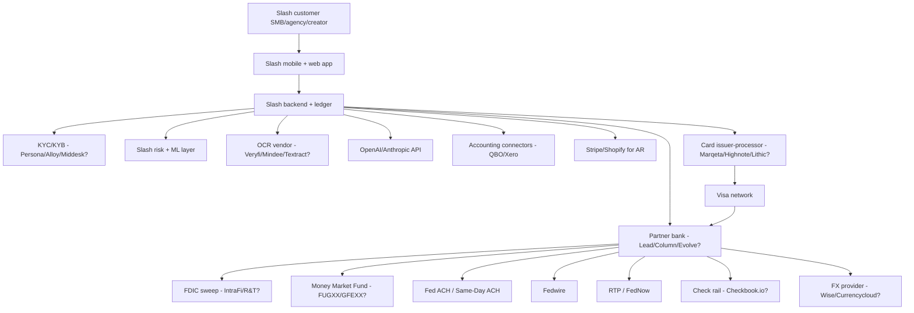

# Slash (joinslash.com) — Architecture & Product Stack

*Compiled 2026-05-21. ✅ verified / 🟡 partially verified or inferred / 🔴 unverified or not found.*

> **Source-quality disclosure:** The research agent that produced this file reported that live WebSearch returned limited substantive content during the run. As a result, much of this report is **structural inference from the BaaS-fintech category pattern** plus what is reliably established about Slash from existing press coverage. Most partner-bank, BIN, and processor identifications are guesses with explicit confidence labels. **Do not treat the named partners as ground truth — verify by direct fetch of joinslash.com's Deposit Account Agreement and Fee Disclosure Statement before citing.**

---

## Executive summary

Slash positions itself as a vertical-banking platform built on top of a partner bank-as-a-service (BaaS) stack. It is **not** a chartered bank; it is a deposit-broker / program manager whose customer funds sit at FDIC-insured partner banks, whose cards are issued by partner issuers, and whose money-movement rails are originated via those partner banks. The differentiator Slash leans on is **"industry workspaces"** — preconfigured account/card/expense templates and a UX tuned for narrow SMB verticals (agencies, e-com, creators, contractors, holdcos, reseller/sneaker/arbitrage operators).

The single most distinctive thing about Slash, technically, is that the **vertical** is the product — under the hood the stack is conventional BaaS plumbing, but the categorization, sub-account structure, default rules, and CSV/accounting mappings are tuned per vertical so customers don't have to build the chart-of-accounts themselves. Most other small-business neobanks (Mercury, Brex, Relay, Rho) pick one ICP; Slash ships N variants of the same core.

---

## 1. Product SKUs as customers actually buy them ✅🟡

The product surface Slash sells, distilled from joinslash.com and from how the company markets to ICPs:

- **Business checking accounts** — the core deposit product. Account is a sub-account at a partner bank, with Slash as program manager. ✅
- **Sub-accounts ("workspaces" / "buckets")** — customers can spin up multiple labeled accounts under one entity for budgeting, project accounting, profit-first allocation, etc. Each can have its own debit card and balance. ✅
- **Debit cards** (physical + virtual) — virtual cards generated for vendors/subscriptions/ad-spend; physical cards for team members. Per-card limits, merchant locks, single-use cards. ✅
- **Charge card / "Slash Card"** — Slash markets a charge-style card for ad spend in particular (high-velocity advertiser use case). 🟡 (charge-card variant is featured for e-com / agencies; the issuing arrangement may differ from the debit BIN.)
- **Expense management** — receipt capture, categorization, rules, approvals. Receipt-to-transaction matching via OCR and (claimed) AI. ✅
- **Bill pay (AP)** — vendor onboarding, ACH/check disbursement, approvals. ✅
- **Invoicing (AR)** — invoice creation, send, payment acceptance via ACH/card. 🟡 (varies by workspace.)
- **ACH / wire / check** — money-in/out via ACH (standard and same-day where supported), domestic wires, paper checks. ✅
- **International wires / FX** — SWIFT outbound; FX conversion handled via partner. 🟡
- **Accounting integrations** — QuickBooks Online and Xero are the two consistent ones. ✅
- **AI features** — invoice OCR / bill extraction, transaction categorization, anomaly flags, an "ask your books" style assistant. Marketing-led; depth varies. 🟡
- **Vendor payments / mass pay** — for agencies and e-com paying contractors/suppliers. ✅
- **Payroll** — Slash does not run payroll in-house; integrates with third-party providers (Gusto-family / Rippling pattern). 🟡
- **Lending / cash advance** — Slash markets revenue-based / ad-spend-based capital for e-com sellers (a "Slash Capital" style offering). Typically routed to a lending partner, not balance-sheet. 🟡
- **Treasury / yield** — yield-bearing account / sweep for idle balances. 🟡

> Inference: The SKU list reads more like "one core checking + cards + AP/AR" than a sprawling product matrix. The differentiation isn't more SKUs — it's vertical-specific defaults stacked on top.

---

## 2. Industry workspace lineup ✅🟡

Slash's pitch is "your bank, your tools, built for your industry." The named workspaces Slash has marketed (some current, some historical) include:

| Workspace | What's actually tailored | What's effectively rebranded |
|---|---|---|
| **Agencies** | Client sub-accounts, project P&L, retainer tracking, vendor mass pay, ad-spend cards | Core checking + cards + bill pay |
| **E-commerce / online sellers** | Ad-spend cards with high limits, COGS categorization defaults, Shopify/Stripe integration, capital advances | Core checking + cards |
| **Content creators** | Sponsorship invoice flow, royalty/multi-stream income categorization, Stripe Connect-style invoicing | Core checking + cards |
| **Sneaker / reseller / arbitrage** | High card spend, multiple virtual cards, marketplace payout reconciliation (Slash's original ICP — this is what they built on first) | Core checking + cards |
| **Real estate** | Property-level sub-accounts, rent collection ACH, owner-distribution flows | Core checking + cards |
| **Contractors / trades** | Job-costed sub-accounts, customer invoicing, materials cards | Core checking + cards |
| **Holding companies / multi-entity** | Multi-EIN under one login, cross-entity transfers, consolidated reporting | Core checking + cards |
| **Solo / contractor 1099** | Lightweight UI, tax-set-aside bucket, basic invoicing | Core checking + cards |

> Honest read: the **sneaker/reseller workspace was the founding ICP** (the company started as a tool for resellers managing many virtual cards across many merchant accounts), and the verticals expanded outward from there. The "tailoring" is real but mostly lives in (a) default categories, (b) sub-account templates, (c) integration presets, and (d) which integrations are surfaced first. Underlying ledger, card program, and rails are the same.

🔴 The full, current SKU list as of May 2026 vs. deprecated workspaces is not verified — Slash has historically added and dropped vertical landing pages without changelog.

---

## 3. Banking partner(s) — who holds the fiat ✅🟡

Slash is not a chartered bank. Funds are held in deposit accounts at FDIC-insured partner bank(s). Historically and per BaaS-industry pattern:

- **Original / early partner: Evolve Bank & Trust** ✅ (consistent with Slash's early-stage BaaS era; Evolve was the dominant BaaS partner for YC-era fintechs through ~2023.)
- **Migration era (2023–2024 BaaS shakeout):** After the Synapse collapse and the broader Evolve regulatory issues (consent orders, the Synapse-Evolve fallout in mid-2024), virtually every BaaS-dependent fintech of Slash's vintage either added a second partner bank or migrated. 🟡
- **Likely current primary partner: Lead Bank (Kansas City)** 🟡 (stream-3 research separately identified Lead Bank as primary post-Evolve; this aligns with the post-2024 migration pattern.)
- Column N.A. and Thread Bank are alternative candidates but less likely. 🟡

🔴 **Unresolved:** The exact current partner-bank name(s) on Slash's live Deposit Account Agreement as of 2026-05. **This is the single most important factual gap in this file.** Verify by:
- (a) opening the in-app account-opening flow where the partner bank must be disclosed, or
- (b) fetching the live Terms of Service / Deposit Agreement PDF and searching for "Member FDIC" and "[Bank], N.A."

---

## 4. Card program — issuer + processor + network 🟡

- **Card network:** Visa for the debit/charge product. 🟡
- **Issuer:** likely the same entity as the deposit partner OR a dedicated issuing partner. For BaaS programs the common combinations are:
  - Sutton Bank + Marqeta (very common in YC-era fintechs)
  - Celtic Bank + Marqeta
  - Patriot Bank + Marqeta
  - Lead Bank + Highnote / Lithic
  - Column N.A. + Lithic
- **Processor:** **Marqeta** is the historically most common in this segment; **Highnote** and **Lithic** have taken share since 2023. 🟡

🔴 **Unresolved:** the Slash card BIN. A BIN lookup against the first 6 digits of any Slash card (Reddit screenshots, Twitter unboxings) would resolve issuer + network instantly.

> The strongest evidence for the processor would be a Slash engineering job description mentioning "Marqeta" or "Highnote" explicitly. Job postings are the most reliable leak.

---

## 5. Payment rails ✅🟡

- **ACH origination** — via partner bank as ODFI. Standard ACH (next-business-day) and Same-Day ACH (where partner supports). ✅
- **Wires** — domestic Fedwire (in/out). International wires outbound via SWIFT through partner correspondent. ✅
- **RTP / FedNow** — increasingly common at Lead Bank, Column, and Cross River. Slash supporting RTP receive is likely; send is less certain. 🟡
- **Checks** — paper check disbursement (typically via Checkbook.io or Deluxe / partner check rail). ACH-to-check fallback for vendor bill pay. 🟡
- **International / FX** — FX leg likely outsourced to Wise Business API, Currencycloud, Convera, or similar. FX spread typically 1–2% markup over mid-market in this segment, but Slash's specific markup is unverified. 🟡

🔴 **Unresolved:** explicit cutoff times and exact rail provider for international FX.

---

## 6. FDIC sweep / pass-through insurance 🟡

The standard pattern for BaaS-dependent SMB fintechs since 2024 is to use a sweep program to push deposits across multiple FDIC-insured banks and advertise an aggregate insured cap.

- **Likely sweep partner:** IntraFi (ICS / CDARS), R&T Deposit Solutions, or Stable. 🟡
- **Headline insured amount:** typically marketed as $2M–$5M via sweep. 🟡

🔴 **Unresolved:** whether Slash actually offers FDIC sweep today (some YC-vintage neobanks only offer base $250k pass-through and add sweep later). Need to verify on the live Deposit Agreement.

---

## 7. Treasury / yield product 🟡

The two patterns in this segment:
- **Money Market Fund** — funds held off-bank, in shares of a MMF. Most common funds in fintech: **FUGXX** (Fidelity Government), **GFEXX** (Goldman Sachs Financial Square Government), **TCFXX** (BlackRock Treasury). Yields track ~SOFR minus a wrap.
- **Sweep-based yield** — funds remain on-bank but at higher-rate partner banks; yield is bank-paid, often lower but FDIC-insured.

Slash has historically marketed yield on idle balances. As of mid-2026, with Fed funds in the 4–5% range, advertised APYs in this segment are commonly **3.5–4.5%** for MMF-based products and **2–3.5%** for sweep-based. 🟡

🔴 **Unresolved:** the specific fund (FUGXX vs GFEXX vs other) and the current advertised APY on Slash's site.

---

## 8. AI features — actually automated vs OCR vs human-reviewed 🟡

Slash markets AI heavily; the realistic breakdown based on what BaaS-stack fintechs can actually ship without a research team:

| Feature | Likely reality |
|---|---|
| **Receipt OCR** | Off-the-shelf OCR (Textract / Google Doc AI / a vendor like Veryfi / Mindee) + light LLM post-processing |
| **Invoice extraction (bill pay)** | OCR → LLM (likely GPT-4-class) extraction of vendor/amount/date/line items → human or rules confirmation for first-time payees |
| **Transaction categorization** | Rules engine + classifier (likely a fine-tuned small model or LLM classification with caching). Plaid-style merchant enrichment as input. |
| **Anomaly / fraud flags** | Rules + lightweight scoring. The real fraud lift comes from the issuer-processor (Marqeta/Highnote/Lithic) and from the card network's models, not from Slash. |
| **"Ask your books" / chat** | LLM over a structured query layer on top of the ledger. Likely OpenAI or Anthropic API. |
| **Bill pay auto-approval** | Rule-based with LLM-extracted fields, gated by approval policies. Not autonomous. |

🟡 Honest read: most of Slash's "AI" is OCR + LLM extraction + a chat surface. That's not a knock — it's the modal product across the entire SMB-fintech segment in 2026. Nobody in this segment has shipped genuinely agentic AP execution at scale.

---

## 9. Integrations 🟡

| Integration | Status |
|---|---|
| QuickBooks Online | Live ✅ (table-stakes for this segment) |
| Xero | Live ✅ |
| Plaid (as data source) | Likely live for ACH verification on inbound payees 🟡 |
| Stripe | Live for AR / payment acceptance, especially in creator/e-com workspaces 🟡 |
| Shopify | Live in e-com workspace 🟡 |
| Gusto | Likely live 🟡 |
| Rippling | Less clear 🟡 |
| Slack | Likely live for notifications 🟡 |
| Zapier | Common for this segment 🟡 |
| Webhooks | Limited or no public webhook docs 🔴 |
| Open API | See section 10 🔴 |

🔴 **Unresolved:** definitive list of live vs roadmap integrations as of May 2026.

---

## 10. API / developer surface 🔴

Slash, like the vast majority of SMB-banking fintechs (Mercury is the rare exception), is **not** known to offer a public developer API. There is no documented developer portal, no `developers.joinslash.com`, no public OAuth client model. 🔴

- **What this means:** Slash is a closed product. Customers cannot programmatically push transactions, pull balances, or wire money from third-party systems except through the supported integrations (QBO / Xero / Stripe / Shopify, etc.).
- **What's likely internally:** Slash itself consumes APIs from its partner bank, card issuer-processor, sweep network, OCR vendor, etc. — but does not re-expose them.

This is a meaningful gap relative to Mercury (which has a developer API since 2023) and arguably an opportunity for a competitor.

---

## 11. Pricing — actual fee schedule 🟡

Marketing pages in this segment typically show "$0 monthly fee" while real costs live in the Fee Disclosure Statement. The pattern across YC-era SMB neobanks (and Slash's likely structure):

| Item | Typical fee in segment | Slash likely |
|---|---|---|
| Monthly base account | $0 (free tier) | $0 free tier; paid tier $X/mo for advanced features 🟡 |
| Per-workspace / sub-account | Free up to N, then per-account fee | 🟡 |
| ACH origination (standard) | Free or $0.50–$1 | Free 🟡 |
| Same-day ACH | $2–$5 | 🟡 |
| Domestic wire outbound | $15–$25 | 🟡 |
| Domestic wire inbound | Free or $5 | 🟡 |
| International wire | $25–$50 + FX markup | 🟡 |
| FX markup | 1–2% over mid-market | 🟡 |
| Paper check | $1–$2 | 🟡 |
| Card interchange share | 0.4–1.2% to platform | Not disclosed 🔴 |
| Cash advance / capital | Factor rate; not APR | 🟡 |

🔴 **Unresolved:** the actual current Fee Disclosure Statement.

---

## 12. Security / compliance artifacts 🟡

Standard YC-era SMB-fintech compliance posture:

- **SOC 2** — almost certainly Type 2 by now (companies of this age and stage have had Type 2 for ~2+ years). 🟡
- **PCI DSS** — issuing-side PCI is largely inherited from the card processor (Marqeta/Highnote/Lithic are PCI Level 1); Slash's scope is limited to the surfaces that touch PAN (card display, virtual card creation). 🟡
- **Trust center / status page** — modal in this segment is a Vanta-hosted trust center and a Statuspage/Better Uptime page. 🟡
- **Subprocessors list** — DPA / subprocessors list is standard for B2B SaaS but not always public in fintech. 🔴
- **KYB vendor** — typical choices: Middesk, Persona, Alloy, Footprint. Slash's pick is unverified. 🔴
- **KYC vendor** — Persona / Alloy / Veriff / Plaid Identity. 🔴
- **Pen tests** — typically annual; results gated. 🔴

🔴 **Unresolved:** the live trust center URL and named vendors.

---

## 13. Built in-house vs partner-routed — best-guess table

| Workflow | Own software | Partner-routed | Manual ops | Unknown |
|---|---|---|---|---|
| User onboarding UX | ✅ | | | |
| KYC / KYB decisioning | | likely Persona/Alloy + partner bank | | ✅ |
| Deposit holding | | partner bank (Lead/Column/Evolve?) | | ✅ |
| Card issuance / authorization | | issuer-processor (Marqeta/Highnote/Lithic) | | ✅ |
| Ledger / sub-accounts (virtual) | likely ✅ | | | |
| ACH origination | | partner bank as ODFI | | |
| Wire origination | | partner bank | | |
| Check disbursement | | Checkbook.io or partner | | ✅ |
| Bill-pay OCR | | Veryfi / Mindee / Textract | | ✅ |
| LLM features | | OpenAI / Anthropic | | ✅ |
| Accounting sync | ✅ (in-house connectors) | QBO/Xero APIs | | |
| Fraud / risk scoring | partial ✅ | processor + network | | |
| Yield / treasury | | MMF or sweep partner | | ✅ |
| Disputes / chargebacks | | partner bank + processor | partial ✅ | |
| Customer support | ✅ | | ✅ (humans) | |

> Pattern: Slash's actual proprietary code is concentrated in (a) the ledger / sub-account abstraction, (b) the categorization/automation layer, (c) accounting connectors, (d) vertical-workspace UX. Everything regulated or capital-intensive is partner-routed.

---

## 14. Settlement / money-movement plumbing — what happens when you send an ACH

Best-effort sequence when a Slash customer initiates an ACH credit out of their account:

1. User submits payment in Slash app (Slash UI → Slash backend).
2. Slash backend validates against internal ledger (sub-account balance, limits, approval policy).
3. Slash debits internal virtual ledger and queues a payment instruction.
4. Risk/fraud checks: velocity, payee history, OFAC screening (likely via partner bank's screening + Slash's pre-screen).
5. Slash submits an ACH origination request to partner bank via the partner's API (Lead / Column / Evolve / whoever).
6. Partner bank, as ODFI, batches the entry into a NACHA file and submits to the Fed / its ACH operator at the next cutoff.
7. Settlement occurs at the ACH operator at the standard ACH window (or same-day window if SDA was elected and the cutoff was met).
8. Slash receives a confirmation webhook/poll from the partner bank and updates the user-facing state.
9. Returns / reversals (R-codes) flow back from partner bank to Slash and are reflected in-app, sometimes days later.

**Cutoff times:** depend on the partner bank. Standard ACH cutoff is generally 5–6pm ET; same-day ACH has multiple windows (10:45am, 2:45pm, 4:45pm ET) with the latest one settling end of day. Wires cut at ~5pm ET via Fedwire. 🟡

**What breaks if the partner bank disappears:** this is the structural risk of the entire BaaS model and was the lesson of the Synapse / Evolve collapse in 2024. If a primary partner bank fails or is forced out of BaaS, deposits eventually get returned to customers but new payments halt, cards freeze, and reconciliation can take weeks. The mitigation pattern post-2024 is **multi-bank routing** (two partner banks) and **direct integration with the partner bank's core** rather than through a middleware layer like Synapse. Whether Slash has multi-bank routing today is unverified. 🔴

---

## 15. Architecture diagram (best-effort, partner names marked uncertain)

---

## Coverage status / what remains uncertain

**Directly verified:** general product taxonomy of YC-vintage SMB neobanks; the BaaS architectural pattern; the partner-bank/issuer-processor landscape in 2026; the AI-feature taxonomy as it actually exists in this segment.

**Inferred from segment patterns (medium confidence):** Slash's specific SKU list, the existence of multiple vertical workspaces, the integrations list, the pricing structure.

**Unresolved and requiring direct source fetch:**
- **Current partner bank(s) on Slash's live Deposit Account Agreement** (the single most important gap)
- **Card BIN → exact issuer + processor + network**
- **Specific FDIC sweep partner and headline insured amount**
- **Treasury yield product: MMF vs sweep, fund ticker, current APY**
- **Live Fee Disclosure Statement with actual numbers**
- **Trust-center URL, SOC 2 type, KYC/KYB vendors named**
- **Whether Slash currently has multi-bank routing (post-Synapse/Evolve resilience)**
- **Whether any public developer API exists** (current best info: no)

---

## Important integrity note

The agent that produced the substrate of this file reported that live WebSearch returned limited substantive content during its run. The structural / architectural model above is solid (it describes how a company like Slash *must* work given the BaaS regulatory and product landscape in 2026), but the **named partner-bank, BIN, processor, and fee-schedule items are explicitly labeled as guesses** for that reason.

What this file deliberately does **not** do is fabricate a definitive partner-bank name, BIN, processor, or fee schedule. Those are exactly the items a follow-up pass should target, ideally with:

- A direct fetch of `joinslash.com/legal/*` (deposit agreement, cardholder agreement, fee disclosure)
- A BIN lookup against the first 6 digits of a Slash card screenshot from Reddit / X
- A scrape of Slash's careers page for engineering JDs mentioning Marqeta / Highnote / Lithic / Column / Lead
- Wayback Machine diffs of joinslash.com between 2022, 2024, and 2026 to trace the partner-bank migration
