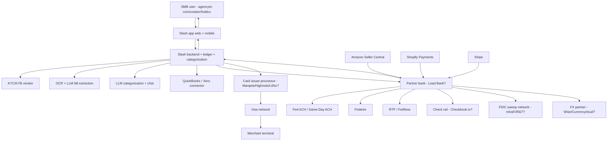

# Slash — Product Flow

*Compiled 2026-05-21. Canonical step-by-step user/data/money flow for the Slash business banking product.*

---

## 1. User starts here

A small-business operator — most commonly an agency owner, e-commerce seller, content creator, or holding-company operator — arrives at joinslash.com via (a) X/Twitter founder posts and creator-community word-of-mouth, (b) YC alumni referral, (c) targeted vertical landing-page SEO ("banking for agencies," "banking for Amazon FBA sellers"), or (d) a comparison page vs. Mercury / Brex / Found.

The user selects a vertical workspace at signup (Agency, E-com, Creator, Holdco, Contractor, Real Estate) — this primarily affects onboarding flow, default sub-account labels, default expense categories, and which integrations are surfaced first.

---

## 2. Data enters here

**Onboarding inputs:**
- Personal KYC: government ID, SSN, date of birth, address (verified via Persona / Alloy / equivalent KYC vendor — exact vendor unverified)
- Business KYB: EIN, formation documents, beneficial-ownership disclosures (CTA-compliant), industry code, expected monthly volume (verified via Middesk / Persona Business / equivalent)
- For multi-entity / holdco workflows: one parent KYB plus one EIN per child LLC

**Ongoing inputs:**
- Inbound wires, ACH, RTP from customers / Amazon / Shopify / Stripe
- Card-swipe transactions from physical / virtual cards
- Bill / invoice uploads (PDF, photo) for AP workflow
- Manual transfers, internal transfers between sub-accounts

---

## 3. The system transforms it here

**At Slash's backend (best inference):**
- A virtual ledger represents each customer's account, sub-accounts, and pending transactions
- A categorization engine (rules + LLM-classification) tags each transaction by vertical-specific default categories
- An OCR + LLM pipeline extracts vendor / amount / due-date / line-items from uploaded bills
- A reconciliation layer matches inbound disbursements (e.g., Amazon payouts, Stripe deposits) against expected payment schedules
- Approval-policy logic gates wires and bill payments above configured limits
- Webhook handlers from partner bank, card processor, and KYC/KYB vendors update the ledger

---

## 4. External tools / partners / rails are called here

- **Partner bank** (likely Lead Bank as of 2026, with Evolve as legacy): holds the actual deposit, originates ACH, originates wires, settles card transactions, applies pass-through FDIC insurance
- **FDIC sweep network** (likely IntraFi or R&T — unverified): extends pass-through insurance across multiple partner banks for headline $X-million coverage
- **Card issuer-processor** (likely Marqeta / Highnote / Lithic — unverified): authorizes card transactions in real time, handles tokenization, settles via Visa
- **Visa network**: card-network routing, fraud scoring, interchange
- **KYC / KYB vendor**: identity verification at onboarding and on suspicious-activity escalation
- **OCR vendor**: bill/receipt extraction
- **LLM provider** (OpenAI / Anthropic — unverified): categorization, "ask your books" chat, bill extraction enrichment
- **Accounting integration partners**: QuickBooks Online, Xero (live two-way sync confirmed for these two)
- **AR / e-com partners**: Stripe, Shopify, Amazon Seller Central (depending on workspace)
- **FX / international payments partner** (likely Wise Business API or Currencycloud — unverified): cross-border wires + FX conversion
- **Check disbursement rail** (likely Checkbook.io or partner-bank check rail): paper checks for vendors who don't accept ACH

---

## 5. Money / data / state changes here

A canonical money path (ACH out — paying a vendor from a sub-account):

1. User submits a $5,000 ACH credit to a vendor from their "Acme Client Retainer" sub-account in the Slash app
2. Slash backend validates: sub-account balance ≥ $5,000, payee not on internal blocklist, payee passes OFAC screening, amount within user's daily limit, approval policy passed
3. Slash decrements the virtual sub-account balance immediately (real-time UI)
4. Slash submits an ACH origination request to the partner bank's API
5. Partner bank, as ODFI, batches the entry into a NACHA file and submits to its ACH operator at the next cutoff (standard ACH next-business-day; same-day ACH if available and cutoff met)
6. Partner bank receives settlement confirmation from the operator
7. Partner bank notifies Slash via webhook; Slash marks the transaction as settled
8. Categorization engine tags the transaction (e.g., "Contractor payment — Vendor X — Client: Acme")
9. If a QuickBooks/Xero integration is enabled, the transaction syncs to the customer's general ledger with the tag

A canonical money path (Amazon disbursement in):

1. Amazon Seller Central initiates a biweekly disbursement ACH to the customer's Slash account
2. Partner bank receives the ACH credit
3. Partner bank notifies Slash; Slash credits the appropriate sub-account (which one depends on routing-number mapping: each sub-account has its own routing/account number)
4. Categorization engine tags as "Amazon disbursement — Brand X" with the Amazon disbursement ID
5. Reconciliation layer matches against the customer's Amazon Seller Central data (if connected) and flags discrepancies
6. ROAS dashboard updates if e-com workspace is active

---

## 6. User sees output here

- Real-time balance update across all sub-accounts
- Categorized transaction feed
- Per-vertical dashboards (ROAS for e-com, client P&L for agencies, tax-set-aside running total for creators, multi-LLC consolidated cash for holdcos)
- Bill / invoice approval queue
- Card spend by category, by card, by user
- One-click export to QuickBooks / Xero / CSV
- 1099-NEC generation at year-end for contractor payments

---

## 7. Failure cases go here

- **KYC / KYB rejection at signup**: customer cannot open an account. Slash provides a generic rejection (per partner-bank policy) with no specific reason. The customer's options are typically to escalate or to try a competitor.
- **Account freeze post-signup**: triggered by anomalous activity, partner-bank risk re-review, or industry-segment de-risking. Funds remain at partner bank but customer cannot transact. Resolution requires manual review (days to weeks).
- **Partner-bank disruption (e.g., Synapse 2024 / Evolve 2024 patterns)**: customer money stays insured but card / ACH / wire flow may halt for hours to weeks. Slash's documented response was to migrate to direct partner-bank relationships (Lead Bank primary).
- **ACH return (R-code)**: a sent ACH is reversed by the receiving bank (insufficient funds, account closed, etc.). Slash debits the customer's sub-account and notifies; the receiving party never sees the money.
- **Card decline / fraud hold**: real-time decline at point-of-sale; customer notified in-app
- **Wire reversal / fraud**: domestic wires are extremely difficult to recall once sent. Slash escalates to partner bank's fraud team; resolution is hours-to-weeks-best-case
- **FX rate slippage**: customer initiates an international wire at quoted rate; actual settlement rate may differ if partner FX provider applies markup at settlement rather than quote

---

## 8. Human handoffs happen here

- **Manual KYB review**: for edge-case business types (crypto-adjacent, high-velocity card use, certain regulated industries), the partner-bank compliance team takes the case manually before onboarding
- **High-value wires**: wires above a customer-tier threshold typically require a Slash compliance review before submission to partner bank
- **Dispute resolution**: card disputes go through Slash → partner bank → card network → merchant. Customer-facing communication is from Slash; underlying timeline is partner-bank-controlled
- **Account closures / industry-segment de-risking**: partner bank can require Slash to off-board customer segments; Slash communicates timeline and migration options
- **Customer support**: routine support is in-house Slash; anything touching the partner-bank ledger (e.g., a stuck ACH) requires partner-bank operations escalation

---

## 9. Mermaid diagram — primary product flow

---

## 10. What would break if Slash disappeared tomorrow

Customer funds are at the partner bank, FDIC-insured up to the pass-through limit (and beyond via sweep, if Slash uses one). In a Slash-only failure (with the partner bank intact), the partner bank would (eventually) make customers whole on deposits.

What would break:
- Cards stop working at the issuer-processor (some delay)
- ACH origination halts (no one to instruct the partner bank)
- Sub-account ledgering becomes unavailable — partner bank only sees aggregate FBO accounts, not the customer's sub-account structure
- Bill-pay / categorization / QuickBooks-sync workflows are dead
- Multi-LLC consolidated dashboards are dead
- Customer-facing app is dead

What would survive:
- Aggregate deposit balance at partner bank (FDIC-insured)
- Recoverable transaction history (subpoena / data-export rights)
- Card history at processor (data export rights)

The structural risk is the same as for every BaaS-overlay fintech: the partner bank's solvency and operations are the only thing standing between customers and lost money, and the fintech itself is mostly a UX-and-software layer on top.
