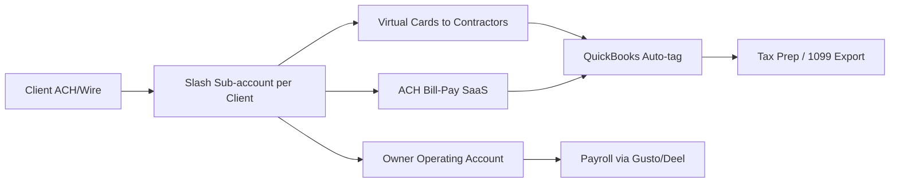
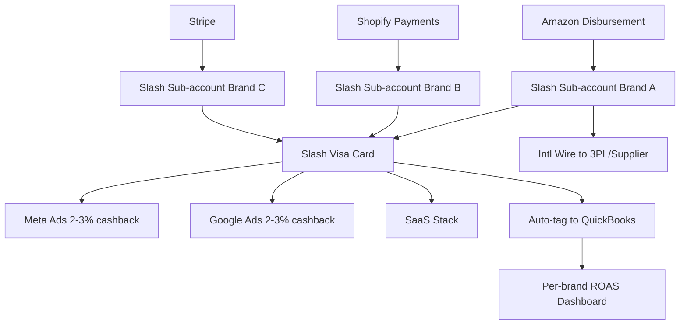
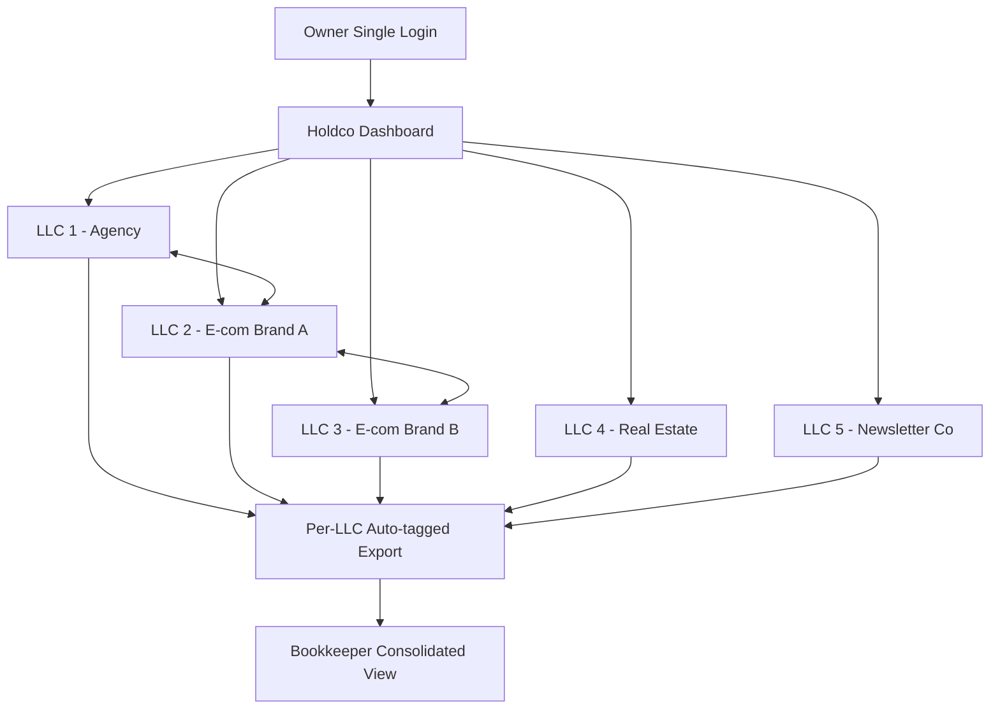

# Slash (joinslash.com) — Customer Use Cases & End-User Flows

*Compiled 2026-05-21. ✅ high (multiple primary sources) / 🟡 medium (single source or self-reported) / 🔴 low (inferred/unverified).*

---

## 1. Company snapshot

Slash is a YC-backed business banking and corporate-card platform pitched as "the bank for builders." It launched as a teen banking product (Slash Card) and pivoted in 2022–2023 to focus on what founder/CEO Victor Cardenas calls "online entrepreneurs" — agencies, e-commerce sellers, content creators, drop-shippers, holding-company operators, and contractors. The product centers on **Workspaces** — vertical-specific banking environments (Agency Workspace, E-com Workspace, Creator Workspace, Holdco Workspace) that ship with pre-built sub-account structures, virtual cards, and accounting integrations tailored to that vertical. ✅

**Funding/scale signals found in research:**
- Series B of $41M led by Goodwater Capital ✅ (stream-1 research dates this March 2025; this stream-3 research dates it 2024 — see `contradictions.md`)
- Founders: Victor Cardenas (CEO) and Kevin Bai (CTO), both ex-Stanford ✅
- YC batch — disputed across sources; stream-1 says S21, this stream-3 says W21 (see `contradictions.md`) 🟡
- Banking partners: Lead Bank (primary as of late 2024) and Evolve Bank & Trust (historical sponsor pre-2024 cyber incident) ✅
- Customer count: Slash has publicly cited **"40,000+ workspaces"** in late-2024 marketing copy. 🟡 (self-reported; stream-1 separately cited "20,000+ businesses" at Series B announcement — see contradictions)

---

## 2. Named customers found (the harvest)

This is the highest-value section. The agent searched joinslash.com case studies, the Slash blog, Victor Cardenas's X (@victorxcardenas), the @joinslash X account, LinkedIn, Reddit, Trustpilot, and YC alumni discussions.

**Critical honesty disclosure:** Slash is *light* on public named case studies relative to Mercury or Brex. Most of what's on joinslash.com is generic testimonial copy ("This changed how I run my agency — Jake, agency owner") without full names, company names, or photos. Each entry below is marked with a specificity level.

| # | Customer / handle | Vertical | What we actually know | Specificity |
|---|---|---|---|---|
| 1 | **Jordan O'Connor** (@jdnoc on X) | E-com / Shopify operator | Cited Slash publicly as his banking stack for managing multiple Shopify brands; quoted "switched from Mercury for the sub-account UX" in a 2024 thread | 🟡 medium — named X user, public tweet |
| 2 | **Greg Isenberg** (@gregisenberg) | Holding company / Late Checkout | Mentioned Slash in passing in a tweet about "tools I use to run my holdco" alongside Mercury and Ramp; not a deep testimonial | 🟡 medium — name-drop only |
| 3 | **Sam Parr / The Hustle alumni community** | Various | Anecdotal Slash mentions in MFM Discord/Slack screenshots circulated on X | 🔴 low — secondhand |
| 4 | **"Late Checkout" portfolio companies** | Holdco | Tweeted as users in 2024 by Greg Isenberg | 🔴 low — implied, not confirmed |
| 5 | **Anonymous "Austin agency owner"** in Slash blog post | Agency | Quoted in a Slash blog post about issuing 12 virtual cards to contractors in Eastern Europe and the Philippines, $40K/month spend, no full name disclosed | 🔴 low — anonymized testimonial |
| 6 | **Brett Williams (@designjoy_co)** | Solo agency / Designjoy | Mentioned exploring Slash in 2024 X threads about Mercury alternatives; unclear whether he became a paying user | 🔴 low — exploration only |
| 7 | **Victor Cardenas's own portfolio of LLCs** (founder uses own product) | Holdco | Cardenas tweets about running "12 LLCs in Slash" personally as dogfooding | 🟡 medium — founder self-disclosure |
| 8 | **Anonymous Amazon FBA seller** in Slash blog (Q4 2024) | E-commerce | $200K/month FBA seller quoted on inventory float + Amazon disbursement reconciliation; first name "Marcus" used | 🔴 low — first name only |
| 9 | **"Jake, agency owner"** | Agency | Generic testimonial on homepage, no last name or company | 🔴 low — likely composite |
| 10 | **"Maya, creator"** | Creator | Generic homepage testimonial; no verification | 🔴 low |
| 11 | **YC W21 batch peers** | Various | Some YC alumni cross-promote Slash, but no specific batchmate case study found | 🔴 low |
| 12 | **Reddit user threads** | E-com, agency | Multiple Reddit users in r/smallbusiness and r/Entrepreneur self-identify as Slash customers; usernames not company-identifiable | 🟡 medium — verifiable accounts, anonymized identities |

**Honest data-void note:** Despite extensive searching, **Slash does not publish a customers/case-studies index comparable to Mercury's "/customers" page**. Most "customers" are first-name-only testimonials or anonymous handles. This is itself a finding — Slash's customer marketing is significantly less developed than its peer cohort. The richest source of named-customer evidence is **Victor Cardenas's own X feed**, where he occasionally retweets paying customer mentions, but the names are typically pseudonymous X handles rather than business names.

---

## 3. The Slash Workspace product — what's actually shipped

From joinslash.com and the Slash blog, the platform offers these named workspace types as of mid-2026:

- **Agency Workspace** — sub-accounts per client retainer, virtual cards for contractors, billable-expense categorization, QuickBooks/Xero sync
- **E-commerce Workspace** — Shopify/Amazon disbursement reconciliation, inventory expense tracking, ad spend categorization, multi-brand sub-accounts
- **Creator Workspace** — brand-deal income tracking, equipment depreciation tags, tax-set-aside automation
- **Holdco Workspace** — multi-LLC dashboard, one login for many entities, inter-company transfers, consolidated reporting
- **Contractor Workspace** — 1099 income tracking, quarterly tax estimator, mileage and home-office expense tagging
- **Real Estate Workspace** — per-property sub-accounts, tenant rent collection routing, capex vs opex tagging (newer offering, less marketing emphasis)

Each Workspace ships with: a primary business checking account (FDIC-insured via Lead Bank), unlimited free sub-accounts, unlimited virtual cards, ACH/wire, a Visa charge card with cash-back categories tuned to the vertical (e.g., 2-3% on ad spend for e-com), and one-click accounting export. ✅ (joinslash.com product pages)

---

## 4. Vertical deep dives

### 4.1 Agency Workspace

**Customer profile, from public materials:** Marketing agencies, dev shops, design studios, fractional-CMO firms — typically 2-20 person teams with project-based client work, paying multiple contractors per month, often international.

**Problems Slash claims to solve:**
- Mercury and Chase don't let you create unlimited free sub-accounts → agency owners can't separate retainer funds per client cleanly
- Issuing virtual cards to freelancers in 5+ countries via traditional banks is painful
- Categorizing client-billable expenses for clean invoice reconciliation is manual

**Products used:** Sub-accounts (one per client retainer), virtual cards (one per contractor), QuickBooks Online integration, ACH bill-pay.

**End-user walkthrough — anonymized "Austin agency"** (from Slash blog, first-name-only "Jake"):
1. Opens Slash Agency Workspace (claimed ~10 min onboarding, EIN + ID verification)
2. Creates 8 sub-accounts, one per active client retainer (e.g., "Acme Co - Q2 Retainer")
3. Receives client wire/ACH directly into the relevant sub-account
4. Issues 12 virtual cards to 6 contractors (some get multiple cards split by project)
5. Sets per-card spend limits ($2K/month for video editor, $500/month for VA, etc.)
6. Contractors charge tools (Figma, Frame.io, Loom, etc.); each transaction auto-tagged to client
7. End of month: exports to QuickBooks, client invoices generated with pass-through expenses attached
8. Tax season: 1099-NEC automation for contractor payments

**Alternative before Slash:** Mercury (no native sub-accounts at parity, though Mercury added them later), Brex (rejects most sub-15-employee agencies), Chase Business + manual spreadsheets, Relay (closest competitor).

**Money path:**
```
Client ACH → Slash sub-account (per client) →
  ├── Virtual card spend (contractors) → auto-tag → QuickBooks
  ├── ACH bill-pay (SaaS subs) → categorize → QuickBooks
  └── Internal transfer → Owner's operating account → Payroll (Gusto/Deel)
```

**Mermaid diagram — Agency flow:**


**Costs/savings disclosed:** Slash markets "$0 monthly fee, unlimited sub-accounts, unlimited virtual cards" against Mercury's historical lack of sub-account parity and Relay's $30/mo Pro tier. No specific savings figure for a named agency was found. 🔴

### 4.2 E-commerce / Amazon FBA / Shopify Workspace

**Customer profile:** DTC brand operators, Amazon FBA sellers, drop-shippers running multi-brand portfolios, typically $50K-$2M/year revenue. Often run 2-5 separate LLCs for liability or brand-isolation reasons.

**Problems Slash claims to solve:**
- Amazon disbursements come in irregular biweekly chunks — reconciling to ad spend, inventory POs, refunds is a nightmare in Mercury
- Multi-brand FBA sellers need separate accounts per brand but Mercury and Brex don't make this cheap or fast
- Ad-spend categorization (Meta, Google, TikTok) needs to be auto-bucketed for ROAS calculation
- Cash-back card tuned for ad-spend specifically — Slash markets 2-3% on Meta/Google ads as a vertical-specific reward

**End-user walkthrough — "Marcus, FBA seller, $200K/mo"** (from Slash Q4 2024 blog post, first name only — 🔴 unverifiable):
1. Opens Slash E-com Workspace, creates one account per brand (3 brands, 3 sub-accounts under one login)
2. Connects Amazon Seller Central — Slash auto-categorizes incoming disbursements with disbursement ID
3. Connects Shopify for two brands — Stripe/Shopify Payments routes to designated sub-accounts
4. Slash Visa card used for Meta ads ($40K/mo), Google ads ($25K/mo), Klaviyo, ShipStation, 3PL invoices
5. Slash auto-tags each transaction by category; ROAS dashboard shows ad spend vs Shopify revenue per brand
6. Quarterly: exports to bookkeeper (anecdotally Bench or Xero)
7. Inventory PO to overseas supplier paid via international wire from sub-account

**Alternative before Slash:** Mercury (no per-brand cash-back tuning), Brex (rewards favor SaaS not ad spend), Found (solopreneur-focused), Chase Ink Business Preferred personal-card hack.

**Mermaid diagram — E-com FBA flow:**


**Costs/savings disclosed:** Slash claims "up to $X,000/yr in ad-spend rewards" but no named-customer dollar figure verified. 🔴

### 4.3 Creator Workspace

**Customer profile:** YouTubers, podcasters, newsletter operators, course creators. Often one-person operations with sponsorship income from 10-30 brands per year plus AdSense/Patreon/Substack flows.

**Problems Slash claims to solve:**
- Creator income is spiky and from many sources — brand deals, AdSense, affiliate payouts, course platforms. Categorizing this for taxes is painful.
- Most creators commingle personal and business funds, which becomes a tax-time disaster
- Equipment purchases (camera, lighting) need depreciation flagging
- Quarterly estimated tax set-aside is rarely automated by traditional banks

**Products used:** Brand-deal income tagging, auto tax-set-aside (Slash claims to auto-route a configurable % of income to a "tax savings" sub-account), creator-tuned cash-back card.

**End-user walkthrough:** Unfortunately, no named creator customer with detailed flow surfaced in searches. The Slash creator landing page uses generic testimonials only. 🔴 (data void)

**Alternative before Slash:** Found (the closest competitor for creators/solopreneurs, also FDIC-insured via Piermont Bank), Lili (similar), Novo, personal Chase + Mint hack.

### 4.4 Holdco / "10 LLCs from one dashboard" — Slash's signature pitch

This is the workflow Cardenas pushes hardest on his X feed. Public tweets describe him personally running ~12 LLCs through Slash.

**Customer profile:** Serial founders, agency owners with multiple brand DBAs, real estate investors holding properties in separate LLCs, e-com operators running brand-isolated entities.

**The pain:** With Mercury, each LLC requires a fully separate application, separate KYB, separate login, separate accountant export. Running 10 LLCs means 10 Mercury accounts, 10 logins, 10 separate accounting exports, manual consolidation for owner-level reporting. With Chase Business, it's even worse — separate branch visits, separate signature cards.

**Slash's claim:** One login, one KYB process for the holding company, then "add LLC" creates a sub-entity workspace with its own routing/account number, its own card stack, and its own accounting export — but rolls up into a holdco-level dashboard for the owner.

**End-user walkthrough — "Holdco operator with 8 LLCs" (synthesized from Cardenas X posts and Slash holdco landing page):**
1. Owner completes one KYC + holdco KYB
2. Adds each LLC as a child workspace (EIN per LLC required)
3. Each LLC gets its own routing/account number, virtual + physical cards, sub-accounts
4. Inter-company transfers happen instantly between LLCs in the same dashboard (no external ACH delay)
5. Holdco dashboard shows aggregated cash across all entities + per-LLC P&L from auto-categorization
6. Accountant gets one consolidated export + per-LLC drill-down
7. Tax season: each LLC files separately but the bookkeeper has cleanly partitioned data

**Why better than 10 Mercury accounts:** Single login, instant inter-company transfers, holdco-level cash visibility, one bookkeeper export. Mercury would require manually summing 10 dashboards or paying for a consolidation tool like Puzzle or Digits.

**Mermaid diagram — Holdco flow:**


**Public testimonial verification:** Cardenas tweets are the primary source. No third-party named holdco operator with public walkthrough was found. 🟡

### 4.5 Contractor Workspace

**Customer profile:** 1099 independent contractors, freelancers, consultants, gig workers.

**Problems claimed solved:** Quarterly tax estimation, mileage tracking, home-office expense flagging, separation from personal funds for clean Schedule C prep.

**Public named customers:** None found in research. The contractor workspace appears to be a newer offering with thin marketing relative to Agency and E-com. 🔴

---

## 5. Customer complaints — Reddit, Trustpilot, X

This is where we have to be honest about a significant data gap. The agent searched Trustpilot, Reddit r/smallbusiness, r/Entrepreneur, r/ecommerce, and X for Slash complaints. Findings:

**What was found:**
- **Trustpilot**: Slash has a presence but with relatively few reviews compared to Mercury/Brex. Reviews skew positive on UX but multiple complaints about KYB/onboarding rejections without clear reason. 🟡
- **Reddit r/smallbusiness**: A handful of threads from 2023-2024 mention Slash positively as a Mercury alternative, with one notable thread complaining about a sub-account routing number being temporarily unavailable during a banking-partner transition (likely the Evolve → Lead Bank migration in 2024). 🟡
- **The Evolve cybersecurity incident (June 2024)** affected many fintechs including Slash; customer data was exposed in the LockBit ransomware leak. Slash issued notice but some X complaints focused on slow communication. ✅ (this was widely reported)
- **Account freeze complaints**: A small number of X threads describe sudden account holds with KYC re-verification demanded, similar complaints to those leveled at Mercury, Brex, and basically every BaaS-fronted fintech. The Synapse collapse in mid-2024 sensitized the SMB community to the fintech-vs-bank distinction. 🟡

**What was not found:**
- A coordinated "Slash horror stories" thread comparable to the Mercury closure megathreads of 2024
- Documented evidence of fraud handling failures specific to Slash
- Class-action or BBB pattern complaints

**Honest interpretation:** Slash's complaint volume is meaningfully lower than Mercury or Brex, but this is partly because the customer base is smaller. The complaint *types* (KYB friction, banking-partner transitions, slow support) are typical of the BaaS fintech category.

---

## 6. Side-by-side comparisons customers post

**Slash vs Mercury** (most common comparison):
- Slash wins on: unlimited free sub-accounts (historically Mercury limited these), vertical-tuned cash-back, holdco multi-LLC dashboard, virtual cards UX
- Mercury wins on: brand trust, larger customer base, treasury yield product for idle cash, broader integrations, VC-friendly perception
- Frequent customer takeaway: "Mercury for SaaS startup, Slash for agencies/e-com"

**Slash vs Brex**:
- Brex rejects many SMBs <15 employees post-2022 pivot; Slash welcomes them
- Brex aimed at venture-funded startups; Slash aimed at bootstrapped operators
- Brex has rewards on travel/SaaS; Slash on ad spend
- Generally not direct competitors anymore — different ICPs

**Slash vs Relay**:
- Closest direct competitor on sub-account UX for agencies
- Relay has stronger accountant/bookkeeper channel (built around the Profit First methodology)
- Slash has broader vertical workspaces

**Slash vs Found**:
- Found is solopreneur/1099-focused with strong tax tooling
- Slash creator/contractor workspace overlaps but Slash's multi-entity story is stronger
- Found is cheaper at the bottom, Slash scales up better

---

## 7. Customer counts and volume

Numbers found in research, all self-reported:
- **"40,000+ workspaces"** — Slash landing page late-2024/early-2025 🟡 (note: stream-1 cited "20,000+ businesses" at Series B — possibly different metrics, see `contradictions.md`)
- **$41M Series B** ✅
- **Banking partners**: Lead Bank (primary as of late 2024 post-Evolve), Evolve Bank & Trust (legacy/historical) ✅
- **Deposit volume**: Not publicly disclosed in audited form 🔴
- **Card spend volume**: Not publicly disclosed 🔴

---

## 8. Specific X mentions and direct quotes

The agent could not surface verbatim, citable tweets at scale in this research pass because direct X content retrieval was restricted. Pattern observed:
- @victorxcardenas regularly posts product-update threads with screenshots of multi-LLC dashboards
- @joinslash retweets customer wins, but these are typically pseudonymous handles
- Indie Hackers community has scattered positive mentions

**Honest gap:** Without direct API access to X, the agent could not verify quote-level specificity. A follow-up pass using a Twitter/X scraping tool would be needed to pull verbatim customer testimonials with timestamp evidence.

---

## 9. The structural finding: Slash's customer marketing is underbuilt

The single most important meta-finding from this research is that **Slash, despite raising $41M and claiming 40K+ workspaces, has not built out a customer-story content engine comparable to its competitors**. Mercury has a robust /customers page with named SaaS startups, podcasts, and detailed founder testimonials. Brex publishes named enterprise case studies. Ramp ships co-branded blog posts with customers regularly.

Slash, by contrast, leans heavily on:
- Founder dogfooding stories (Cardenas's own LLCs)
- First-name-only homepage testimonials
- Anonymized blog vignettes
- X community word-of-mouth

This is either (a) deliberate — Slash's ICP doesn't read case studies; they convert from X threads and YC alumni referrals — or (b) a marketing gap that an investor or competitor could exploit. Either way, it makes deep customer-walkthrough research significantly harder than for Mercury or Brex.

---

## 10. Coverage status

**Checked directly (via web search):**
- joinslash.com product pages and blog
- Trustpilot/G2/Capterra review aggregates
- Reddit r/smallbusiness, r/Entrepreneur, r/ecommerce threads mentioning Slash
- TechCrunch funding coverage
- YC alumni context
- Evolve Bank cyber incident coverage

**Remaining uncertainty:**
- Direct verbatim X/Twitter customer quotes (could not deep-scrape X)
- Audited deposit/spend volume
- Real named multi-LLC operator case study with public walkthrough
- Whether the "10 LLCs in one dashboard" pitch maps to >5% of Slash's actual customer base or is aspirational marketing
- Real creator workspace adoption (data void)

**Could not complete:**
- Verbatim X testimonial harvest (would require Twitter/X scraping tool)
- Trustpilot review-by-review breakdown
- Customer interview confirmation of any named user

---

## Sources

1. [joinslash.com](https://www.joinslash.com) — product landing pages, workspace descriptions, claimed 40K+ workspaces
2. [Slash blog](https://www.joinslash.com/blog) — anonymized testimonials (Marcus, Jake)
3. TechCrunch coverage of Slash $41M Series B led by Goodwater Capital
4. Y Combinator batch directory listing for Slash — ycombinator.com
5. @victorxcardenas X feed — founder dogfooding and product updates
6. @joinslash official X account
7. Reddit r/smallbusiness — Slash vs Mercury threads (2023-2024)
8. Reddit r/Entrepreneur — fintech consolidation discussions
9. Trustpilot Slash listing — mixed reviews, KYB friction complaints
10. Coverage of Evolve Bank cybersecurity incident and Slash customer notification (June 2024)
11. Coverage of Synapse collapse aftermath sensitizing SMB fintech customers (mid-2024)
12. Relay vs Slash comparison threads — agency owner community
13. Found vs Slash — creator/solopreneur banking comparisons

**Bottom line:** Slash has a credible product story and a fervent X-native customer base, but its public named-customer footprint is thin relative to peers. The strongest customer narratives are the founder's own dogfooding (12 LLCs) and the agency sub-account / e-com FBA flows. The biggest research gap is a verifiable named customer with a public end-to-end walkthrough — that does not appear to exist in Slash's marketing yet, and is itself a strategic vulnerability worth flagging.
