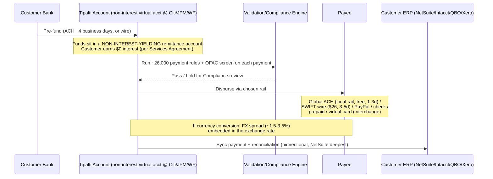

# Tipalti — Product Flow

The canonical end-to-end money + data + state flow inside Tipalti, including failure modes and human handoff points. Compiled 2026-06-06.

## 1. The user starts here

Two distinct entry shapes, because Tipalti is two products fused:

- **AP path (invoice-driven):** a vendor sends an invoice → the customer's AP team processes it. Intake via email, web upload, or API.
- **Mass-payments path (payout-driven):** a marketplace/platform needs to pay thousands of sellers/creators/affiliates → payees self-onboard through the **Supplier Hub**, and the platform pushes a payment file (CSV or Payout API).

The mass-payments path is the original product and the reason Tipalti exists; the AP path is the up-stack expansion.

## 2. Payee onboarding (the front of the funnel)

Before any money moves, the payee must be onboarded — this is Tipalti's signature workflow:

1. Payee receives a branded invite → enters the **Supplier Hub** (self-service, 27+ languages).
2. Submits contact + banking details and selects a payment method.
3. Completes the correct **tax form online** — W-9 (US) or the W-8 family / Form 8233 (non-US), determined by residency/classification.
4. The **tax engine** (KPMG-reviewed) validates: TIN matching against IRS (daily), VAT/local IDs across 60+ countries, withholding calc.
5. **KYC + OFAC screening** at onboarding.
6. The payee is now a reusable, validated entity — its banking details locked behind the ~26,000-rule payment-validation engine.

This is the moat in motion: the customer never touches the payee's tax/bank data, and the payee maintains their own record.

## 3. Invoice → coded bill (AP path)

1. Invoice arrives → **Invoice Capture Agent** (OCR+NLP) extracts header + line items.
2. **Auto Coding** assigns GL codes from historical patterns.
3. **PO Matching Agent** runs 2-/3-way match (header + line level) against the PO + goods receipt (GRN).
4. **Bill Approvers Agent** predicts and routes to the correct approver(s) per approval rules.
5. Low-confidence / unmatched / new-payee items → exception handling by the AP clerk.

## 4. Approval → payment instruction

Approved bills (or a mass-payout batch) become payment instructions. Spend/approval rules (thresholds, multi-stage chains, budget controls from the Approve.com procurement layer) gate state changes.

## 5. Money movement

**Critical money facts:**
- Customer **pre-funds** a Tipalti virtual account — money sits in transit in a **non-interest-yielding** account at a partner bank (Citi / JPMorgan / Wells Fargo). Customer earns **zero** interest. ✅
- A transit-float window exists structurally; whether **Tipalti** earns interest on it is **undisclosed** (private company). 🔴
- Cross-border: **local clearing (Global ACH) preferred over SWIFT**; conversion carries an **embedded FX spread (~1.5–3.5%)**, the main payments revenue lever. 🟡

## 6. The user sees output here

- AP dashboard: invoice status, approval queue, payment runs.
- Payee/supplier view: own onboarding status, payment status + history, ability to update details without AP involvement.
- ERP reconciliation: payments + GL entries synced back (real-time bidirectional on NetSuite).
- Tax outputs: year-end 1099/1042-S prep + e-filing via Tax1099.com.

## 7. Failure cases go here

Documented / reviewer-reported failure modes:

- **NetSuite/ERP sync failure** — the #1 complaint. Integration "fails to run entirely or for specific records"; **Tipalti does not actively monitor sync jobs** — the customer must notice and report; escalations take 3–4 days. PO-update-after-match records sometimes fail to post and need manual intervention.
- **Payment held in "Submitted" for Compliance review** — sticks pending the Compliance Team; real friction for time-sensitive payouts.
- **Long implementation** — promised 6 months, took ~12; some buyers "never got off the ground." For a moat built on integration depth, slow/fragile onboarding is an existential reliability problem.
- **Supplier-onboarding friction** — "incomplete and long," hard to reach senior support (though the self-service portal is *also* a top praise — experiences split).
- **FX cost surprise** — spread buried in the rate; small/low-value international payments become uneconomic (per-payment + FX + minimums).
- **Under-skilled support** — "not all support staff have the experience to fix problems."

## 8. Human handoffs happen here

- **AP clerk / AP manager** — invoice capture, exception handling, payment runs, payee management. Biggest workload-reduction beneficiary.
- **Controller** — close, reconciliation, ERP-sync cleanup, audit-readiness.
- **CFO** — economic buyer; scalability-without-headcount, spend visibility, compliance/risk.
- **Tipalti Compliance Team** — OFAC/risk holds; opaque to customer, can delay payouts.
- **Tipalti implementation / support** — long, queue-driven; a recurring weak spot.
- **Payee/supplier** — self-serves their own onboarding + status via Supplier Hub.

## 9. What would break if Tipalti disappeared tomorrow?

For a multi-entity mid-market customer on NetSuite OneWorld:
- The **payee identity graph** (validated bank + tax records for hundreds/thousands of global payees) would need rebuilding — the deepest lock-in.
- The **NetSuite OneWorld sync** (entity-level GL coding, subsidiary reconciliation) is a multi-month re-integration with any replacement.
- **In-flight pre-funded money** sits in Tipalti's remittance account — recoverable, but requires support contact.
- Tax-compliance continuity (1099/1042-S prep, withholding history) would need migration.

Practical migration time: months for a multi-entity operator — which is precisely why churn is low even when customers are unhappy with support/UX.
