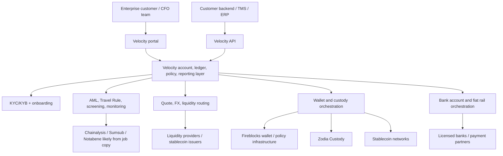

# Velocity - Architecture

Date: 2026-05-07

This is an inferred architecture from public product copy, docs landing pages, partner announcements, trust center metadata, and job descriptions. The exact internal architecture is not public.

## One-frame architecture



## Product primitives

Public docs landing page and homepage imply the following primitives:

- Entity/account: an approved business customer.
- Wallet: stablecoin wallet used to receive and send on-chain funds.
- Bank account: fiat endpoint for deposits/withdrawals/transfers.
- Beneficiary: payout recipient, wallet, or bank counterparty.
- Quote: pricing object for stablecoin/fiat conversion or currency pair execution.
- Transfer: movement between wallets, bank accounts, or beneficiaries.
- Payment method: supported rail/currency/network.
- Webhook: event notification surface, implied by docs nav in earlier crawls and common API design.
- Compliance metadata: Travel Rule, KYC/KYB, EDD, monitoring, audit logs.

The homepage exposes a sample quote request:

```bash
curl -X POST "https://velocity.xyz/v1/transfers/quote" \
  -H "Content-Type: application/json" \
  -H "Authorization: Bearer <token>" \
  -d '{
    "entity_id": "...",
    "currency_pair": "USDC-EUR",
    "side": "BUY",
    "amount": 1000000000.00,
    "amount_currency": "USDC",
    "wallet_id": "...",
    "bank_account_id": "..."
  }'
```

Source: [homepage](https://www.velocity.xyz/).

## Money movement model

Velocity is not merely "send USDC." It is presenting a unified money movement layer:

1. Customer onboards and is approved.
2. Customer creates or connects wallets/bank accounts.
3. Customer requests a quote for a currency pair or transfer route.
4. Velocity routes through stablecoin, fiat, bank, custody, and liquidity partners.
5. Compliance checks run before and during movement.
6. Settlement happens through stablecoin rails, fiat rails, or both.
7. Reporting and reconciliation sync to the portal/API/TMS/ERP.

## Custody model

Velocity says digital assets are secured through HSM-based, bank-grade custody and regulated partners. Fireblocks provides secure wallet architecture, approval flows, policy enforcement, segregation of assets, and transaction infrastructure. Zodia Custody is named as custodian and is described as the partner handling the digital asset layer underpinning settlement flows.

Likely model:

- Velocity does not hand customers raw private keys.
- Customer balances are represented inside Velocity's ledger/account system.
- On-chain assets are held or orchestrated through institutional custody/wallet providers.
- Approval policies and governance are enforced in custody/wallet infrastructure plus Velocity's own ledger/policy layer.

Sources: [homepage](https://www.velocity.xyz/), [Fireblocks partnership](https://www.velocity.xyz/blog-post/velocity-x-fireblocks-strategic-partnership), [Zodia partnership](https://www.velocity.xyz/blog-post/velocity-zodiacustody).

## Compliance model

Velocity is building for institutional compliance, not casual crypto usage. Public signals:

- Travel Rule topic in docs.
- Trust Centre has GDPR, DORA, ISO/IEC 27001, SOC 2 Type I, SOC 2 Type II markers.
- Financial crime job listings mention corporate KYC, EDD, transaction monitoring, suspicious activity escalation, Chainalysis, Sumsub, and Notabene.
- Zodia post mentions EMI permissions, MiCA, and global licensing.

This suggests compliance is not outsourced entirely. Velocity appears to own the workflow and policy layer, while using specialized vendors and regulated partners for execution.

## Partner dependency map

- Fireblocks: wallet, transaction policy, digital asset operations.
- Zodia Custody: institutional custody.
- Paxos/USDG: stablecoin/rewards partner.
- Banking partners: unnamed.
- Liquidity providers: unnamed.
- Blockchain networks: unnamed.
- Compliance vendors: not all publicly confirmed, but job copy names Chainalysis, Sumsub, and Notabene as desired experience.

## What is not knowable publicly

- Which stablecoin networks are live.
- Which fiat currencies and countries are live.
- Which bank partners support local accounts.
- Whether Velocity has direct licenses or operates through partners in each region.
- Exact wallet ownership/legal custody model.
- Whether API docs include idempotency, webhooks, rate limits, sandbox, SDKs, error schemas, or reconciliation endpoints.
- Actual payment volume and number of live customers.

## Architecture lesson for us

Velocity's stack is a full financial network. We should not try to replicate all of it. A realistic MVP should compose:

- Bridge for fiat on/off-ramp and local accounts.
- Privy/Turnkey or Squads/Grid for wallet/smart account control.
- Solana USDC for settlement.
- Our own ledger, policy, reconciliation, and AI workflow layer.

The wedge is not "we have rails." The wedge is "we make the finance team smarter and faster on top of rails."
