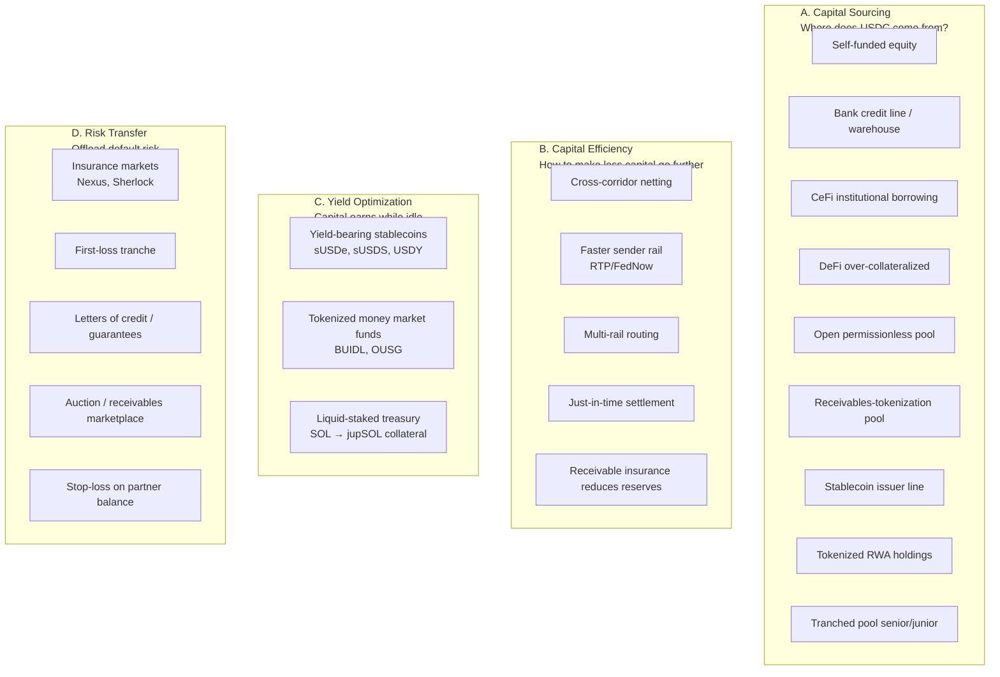
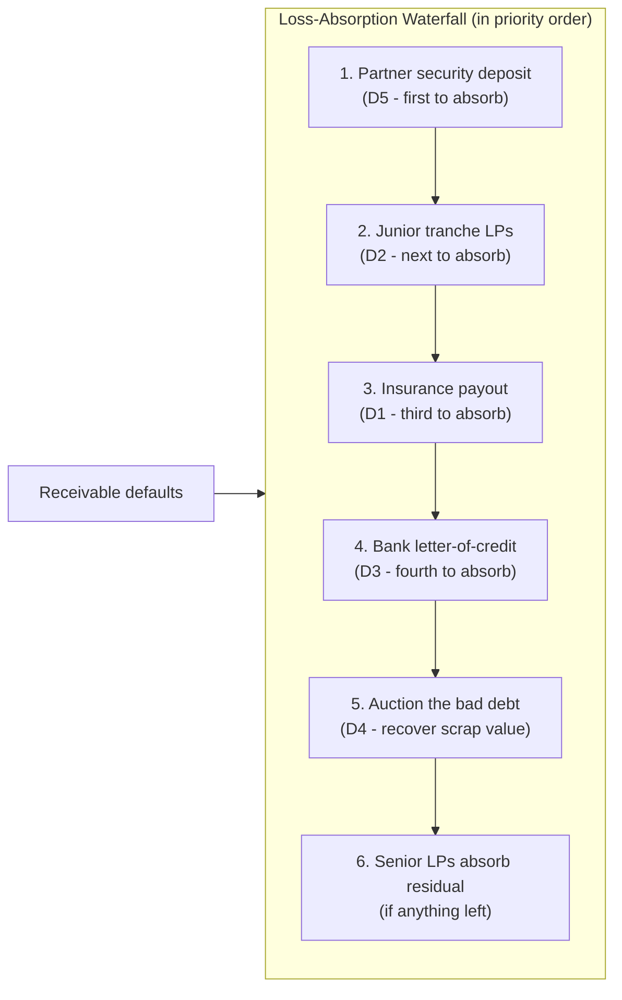
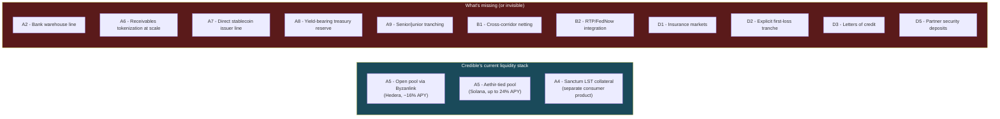
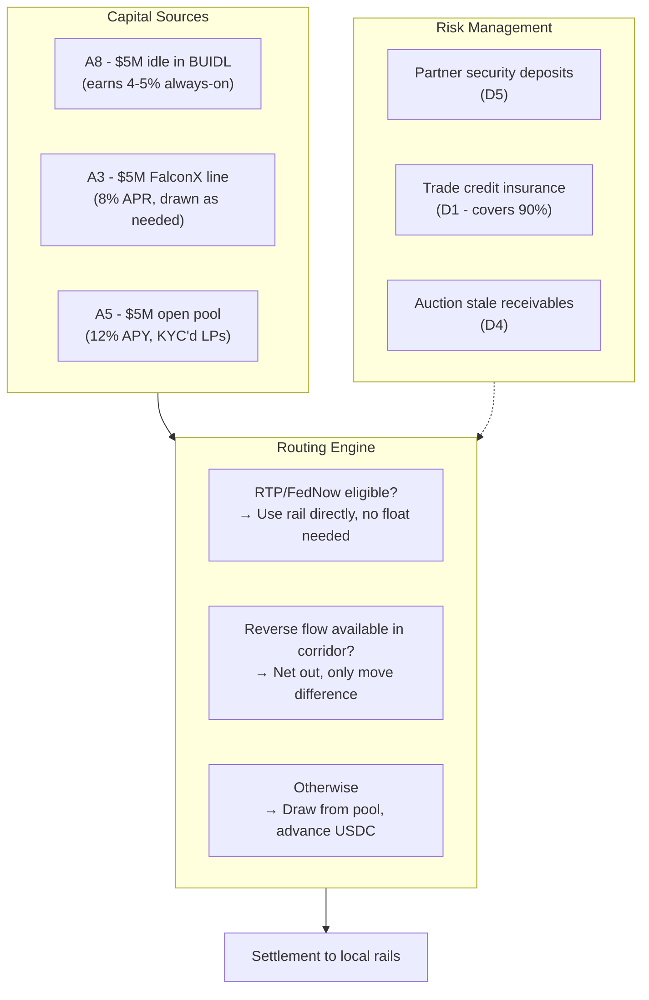
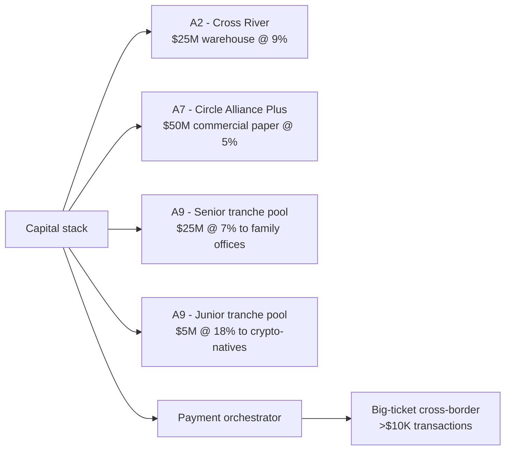
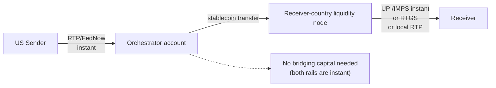

# Liquidity Models for T+0 Cross-Border Payment Orchestrators

> Design space exploration. The core question: when an ACH takes T+2 to settle on the sender side but the recipient wants funds T+0, **where does the bridging capital come from**? This file maps every credible mechanism, scores them, and proposes architectures that could improve on what Credible Finance is doing today.
> **Date:** 2026-05-01
> **Reference happy path:** [`../../companies/credible-finance/happypath.png`](../../companies/credible-finance/happypath.png)

---

## 1. Frame: what does "fronting payments" actually require?

### The capital math (this is more important than it looks)

Consider a payment orchestrator doing **$100M/month** of cross-border volume with a **5-day average receivable duration** (ACH settles T+2 to T+3, plus 1–2 days operational buffer):

```
Required revolving capital  =  Monthly volume × (Avg duration / Days in month)
                            =  $100M × (5/30)
                            ≈  $16.5M
```

That's the at-rest float. Less than people assume. **At 73x annual capital turnover**, $5M of capital can technically support ~$365M/year of volume.

The question is therefore not *"how do we raise $100M?"* but *"how do we get a $5–20M revolving pool of USDC at a cost of capital below our take rate?"*

### The cost-of-capital ceiling

A payment orchestrator earns roughly:
- **FX spread**: 0.5–2% (Credible claims ~4–5% better than Wise on INR; net spread to them likely ~0.5–1%)
- **Settlement fee**: 0.1–0.5%
- **Net interest on advance**: 0.05–0.2% per transaction (5 days × ~0.04%/day)

**Total take rate: ~0.7–2.7% per transaction.** After operating costs (KYC, OFAC, banking partners, salaries) realistically **30–60% of take goes to the LP yield**.

So the cost-of-capital ceiling is roughly **15–25% APR** on the LP side. That's why Credible can offer 16% APY on Byzanlink and Huma can offer 9% — both are within range. Anything above 25% APY breaks the unit economics.

### The hard constraints

Any liquidity model must satisfy:

1. **Available 24/7** — payments don't wait for business hours
2. **Cost of capital < 25% APR** — beyond that, you can't make money
3. **Scales without proportional capital growth** — bigger volume shouldn't 1:1 require bigger LP base; turnover does the work
4. **Tolerable regulatory profile** — if LPs are US persons, securities-law cost is real
5. **Honors withdrawals** — LPs need to be able to exit (eventually), or you have an angry retail base

### What can fail (the failure-path your diagram already flags)

Three failure modes that the liquidity model has to absorb or transfer:

- **ACH return / NSF / fraud reversal** — the sender's ACH bounces *after* Credible already paid out. Money is gone. Who eats it?
- **Partner default** — fintech partner goes insolvent or refuses to pay. Their accumulated float is at risk.
- **Black-swan correlated default** — corridor shutdown, sanction, banking crisis. Multiple receivables fail at once.

Your diagram correctly identified the four classical mechanisms for handling this:
- **Auction** (sell distressed receivables)
- **Bond insurance** (third-party guarantor)
- **Letters of credit** (bank-issued guarantee)
- **Collateral liquidation** (seize partner-pledged assets)

We'll come back to these in §5 (risk transfer).

---

## 2. The design space — four categories

Cleanly separating these is the trick. Most "liquidity discussions" mash them together.



A complete liquidity architecture combines mechanisms from all four. Credible mostly uses **A5** (open pool via Byzanlink) and informally **D2** (no published first-loss tranche but their TradFi co-lenders implicitly absorb some risk). They've left B, C, and most of D essentially unbuilt.

---

## 3. Capital sourcing — the 9 mechanisms

### A1. Self-funded equity

**How it works:** Founders put in their own cash + equity round goes into the float.
**Cost of capital:** Effectively the equity discount rate (15–25% expected return for VCs).
**Capacity:** Capped at how much you raise.
**Pros:** No counterparty, full margin retention, simple legally.
**Cons:** Doesn't scale, dilutes founders, equity wasted on something that earns 16% in a vault. Worst possible use of equity capital.
**When it makes sense:** Day 0 only. Up to first ~$1M of float to bootstrap, then transition out.

### A2. Bank credit line / warehouse facility

**How it works:** A bank (Cross River, Goldman, Lead, Western Alliance) extends a credit facility — typically $5–50M revolving, secured against receivables.
**Cost of capital:** **SOFR + 4–8%** in 2026 ≈ 8–12% APR.
**Capacity:** $5M to $500M+ depending on partner.
**Pros:** Cheapest large-scale capital. Banks understand receivables financing. No retail-LP onboarding hassle.
**Cons:** 6–12 month relationship-build to get the line. Covenants (loan-to-value, concentration limits, default-rate triggers). Bank can cut the line if your default rate spikes. **Most banks won't extend warehouse lines to crypto-related businesses** — this is the structural reason Credible went with permissionless pools instead.
**When it makes sense:** Once you're at $50M+/month volume and have audited financials. Pair with an FDIC-insured banking partner who already takes crypto exposure (Cross River, Lead, Brale).

### A3. CeFi institutional borrowing

**How it works:** Borrow USDC from prime brokers — FalconX, Anchorage, Galaxy Digital, BitGo Prime. Programmable, fast, against collateral.
**Cost of capital:** **8–14% APR** in 2026, varies with market.
**Capacity:** $1M to $100M+ depending on counterparty.
**Pros:** Faster setup than banks (4–6 weeks). USDC-native (no fiat-on-ramp friction). Programmable APIs. Counterparty understands crypto risk.
**Cons:** Requires posting collateral (typically 130–150% LTV in BTC/ETH). Counterparty risk (Genesis blowup 2023 reminds us). Rates vary with crypto cycle.
**When it makes sense:** Excellent for $5–50M float once you have crypto-asset collateral to pledge. The right "second-layer" capital after early bootstrap.

### A4. DeFi over-collateralized borrowing

**How it works:** Pledge crypto (BTC/ETH/SOL/LSTs) as collateral on Aave, Compound, Morpho, Marginfi, Kamino. Borrow USDC against it.
**Cost of capital:** **5–12% APR** depending on protocol and market.
**Capacity:** Limited by your crypto holdings (and collateral pool depth).
**Pros:** Permissionless, instant, 24/7. No relationship-build. Cheapest source if you have crypto reserves.
**Cons:** Requires owning volatile crypto as collateral (capital inefficient — you're locking up $130–150 of crypto to borrow $100 of USDC). Liquidation risk if collateral drops. Smart-contract risk. Doesn't help if you don't already hold crypto.
**When it makes sense:** Niche play. If your treasury already holds crypto for other reasons (ecosystem holdings, partner tokens), put it to work as borrow collateral. Bad as a primary source.

### A5. Open permissionless pool — the Credible/Huma model

**How it works:** Build a vault (Byzanlink, Centrifuge, Maple, custom). Anyone (or KYC'd persons) deposits USDC. They get a yield-bearing LP token. Vault funds advances; receivable-fee yield flows back to LPs.
**Cost of capital:** **8–24% APY** depending on the protocol's risk profile and utilization.
**Capacity:** Scales with marketing + investor relations effort. Huma is at $10B+ cumulative volume.
**Pros:** Permissionless capital aggregation. Decentralized. Passes the crypto-native sniff test. Programmable.
**Cons:** **Securities-law landmine in the US** — bCRED, cUSDC, etc. are likely securities under Howey. Need Reg D 506(c) wrapper, DST trust, or aggressive offshore structure (Credible's UAE base). Withdrawal queue dynamics in stress (LPs all want out at once). Marketing the yield is its own job.
**When it makes sense:** Globally distributed retail/institutional LP base, willing to accept multi-jurisdiction exposure. **This is what Credible chose; it's also why they sit in Abu Dhabi.**

### A6. Receivables-tokenization pool — the Centrifuge/Goldfinch model

**How it works:** Each batch of in-flight receivables (the actual ACH advances) is wrapped as an NFT or fungible token. LPs buy these tokens. As receivables settle, LPs get paid.
**Cost of capital:** **6–12% APY** typically (Goldfinch Senior Pool was 8–13%).
**Capacity:** Limited by tokenization throughput; structurally good for $50M-$1B.
**Pros:** Transparent risk on a per-pool or per-receivable basis. Easier to syndicate to institutional capital. Receivables are senior in bankruptcy (cleaner waterfall). Programmable secondary markets.
**Cons:** Tokenization layer is engineering work (Centrifuge's CFG token + Tinlake architecture is non-trivial). Slower than a vault. Has had real defaults publicly (Goldfinch deals 2023–24).
**When it makes sense:** Once you have institutional LPs who want per-pool risk visibility (family offices, funds, foundations) rather than blended-pool yield.

### A7. Stablecoin issuer direct line

**How it works:** Partner with the stablecoin issuer (Circle, Tether, Sky, Ethena) for a direct mint line or institutional commercial paper.
**Cost of capital:** **3–6% APR** if you can swing it. Effectively prime.
**Capacity:** Massive — Circle alone has $80B+ in circulation.
**Pros:** Cheapest capital available. The stablecoin issuer already has float earning 5%+ on T-bills; lending to a high-quality counterparty at 6% is a no-brainer for them.
**Cons:** **Requires being a major customer** — Circle isn't going to do this for a $1M-volume startup. Realistically you need $100M+/yr in USDC turnover to get attention. Long relationship-build. Circle Alliance Program (Credible has this) is the entry path.
**When it makes sense:** Late-stage, when you're an obvious systemic customer. The endgame for any payment orchestrator at scale.

### A8. Tokenized RWA holdings as treasury

**How it works:** Hold yield-bearing tokenized treasury bills as your reserve (BUIDL, USDY, OUSG, USDM, USYC). When you need USDC for an advance, redeem or sell. Capital earns ~4–5% while idle.
**Cost of capital:** Negative — it's actually **negative cost** because the asset earns yield.
**Capacity:** Up to your treasury size.
**Pros:** Capital is productive while idle. Counterparty is the US Treasury (BlackRock manages BUIDL). Stable, regulated, audited.
**Cons:** Slight redemption friction (BUIDL settles same-day; USDY is instant on-chain swaps via Ondo). Adds smart-contract risk on top of treasury. Yields are modest (4–5%) — only an "optimization" not a "source."
**When it makes sense:** Always. **Every payment orchestrator should hold its idle reserve in a yield-bearing form by default in 2026.** Not doing this is leaving 4–5% APY on the table for free.

### A9. Tranched pool — senior/junior structure

**How it works:** Two LP tiers. Senior LPs get lower yield but absorb losses last. Junior LPs get higher yield but absorb defaults first. Goldfinch did this; Maple does this.
**Cost of capital:** Senior **6–8% APY**, junior **15–25% APY**, blended ~10–14%.
**Capacity:** Scales with marketing.
**Pros:** Appeals to multiple risk appetites simultaneously. Conservative institutional capital can come into senior; yield-hunters into junior. Junior tranche acts as a built-in first-loss buffer for senior tranche.
**Cons:** More complex (legal docs, smart contracts, pricing). Junior tranche is harder to fill in bear markets. Default-cascade dynamics if junior is wiped out.
**When it makes sense:** When you have $20M+ float and want to attract pension funds / family offices alongside crypto-natives. **Credible should consider this — currently they have one undifferentiated pool which means they can't price-discriminate by risk appetite.**

### Capital sourcing summary table

| Mechanism | Cost of capital | Capacity | Setup time | Crypto-friendly? |
|---|---|---|---|---|
| A1. Self-funded | ~equity discount | $0–$5M | Day 0 | Yes |
| A2. Bank warehouse | 8–12% | $5M–$500M | 6–12 mo | Rare |
| A3. CeFi prime brokers | 8–14% | $1M–$100M | 4–6 wk | Yes |
| A4. DeFi over-coll | 5–12% | Limited by crypto holdings | Hours | Yes |
| A5. Open permissionless pool | 8–24% | Scales w/ marketing | 3–6 mo | Yes |
| A6. Receivables tokenization | 6–12% | $50M–$1B | 3–6 mo | Yes |
| A7. Stablecoin issuer line | 3–6% | $$$ | 12–24 mo | Yes |
| A8. Tokenized RWA treasury | **Negative** (yields 4–5%) | Up to treasury | Days | Yes |
| A9. Tranched pool | 6–25% (split) | Scales | 6–9 mo | Yes |

**The right play in 2026 looks like a stack:** A8 always-on (treasury earns yield) + A4 or A3 for fast-draw bridge capital + A5 or A9 for primary LP base + A2 or A7 once volume justifies the relationship.

---

## 4. Capital efficiency — making less capital go further

This is the most underrated lever. **Better capital efficiency = better unit economics than competitors with bigger pools.**

### B1. Cross-corridor netting (the killer optimization)

**The insight:** If you're moving $100M/day USD→INR and someone is moving $80M/day INR→USD, you can net out 80% of the flow and only need to physically move $20M.

**How it works:**
- Run a matching engine across all in-flight transfers
- Hold balances in both USD and INR sides
- Rebalance only when imbalance grows past a threshold

**Capital efficiency:** Can reduce required float by **50–80%** in established corridors.

**Pros:** Massive economic leverage. Same volume, fraction of the capital.
**Cons:** Requires bidirectional volume — easier in big mature corridors (US↔India, US↔Mexico) than emerging ones. Settlement-time mismatches still need bridging capital. Operational complexity.
**When it makes sense:** Once you have $50M+/month in any single corridor with non-trivial reverse flow. Wise has been doing this for a decade — it's not a secret, it's just hard.

This is **the single biggest competitive lever a Credible-better product could pull.** Credible's small volume means they can't net much. A platform optimized for netting from day one (or that aggregates flow across multiple fintechs) could have 3–5x better capital efficiency.

### B2. Faster sender rail — RTP / FedNow

**The insight:** ACH takes T+2 because of the rail. **RTP (The Clearing House) and FedNow both settle in seconds on the US side.** If sender uses RTP/FedNow, **you don't need bridging capital at all** — funds arrive before you need to pay out.

**Status:** RTP processes ~1B+ transactions/year as of 2025; FedNow live since July 2023, ~1,000+ participating banks by 2026. Coverage is incomplete but growing.

**Capital efficiency:** **Eliminates the float requirement entirely** for RTP/FedNow-eligible flows.

**Pros:** Solves the problem at the rail, not the funding layer. No LP pool needed for these flows.
**Cons:** Not all sender banks support it yet. Maximum transaction limits ($1M for FedNow). Senders may need to opt in. Only solves the US side; receiver-country rails matter too.
**When it makes sense:** Now, for B2B flows with high-value senders who use RTP/FedNow-enabled banks. **Should be the default path** — only use the credit pool when the rail is slow.

### B3. Multi-rail routing (smart routing engine)

**The insight:** Different rails have different cost/speed/reliability tradeoffs. Route each transaction to the optimal rail.

**Examples:**
- Small / urgent: stablecoin rail (USDC on Base/Solana/Hedera)
- Large / not urgent: SWIFT (cheaper for big amounts)
- US sender, RTP-eligible: RTP (no bridging needed)
- Stablecoin sender (already on-chain): direct stablecoin transfer (no off-ramp on send side)

**Capital efficiency:** Marginally better — reduces float on flows that don't need it.

**Pros:** Optimizes per-transaction economics. Resilience (one rail down doesn't stop everything).
**Cons:** Engineering complexity. Each rail integration is its own work. Compliance multiplies.
**When it makes sense:** Once you have 3+ corridors live and partners ask for cost optimization.

### B4. Just-in-time settlement (batch + delay)

**The insight:** Don't pay out instantly for *every* transaction. For non-urgent flows, batch them and settle when the ACH actually clears.

**Capital efficiency:** Eliminates float for batched flows.

**Pros:** Zero capital required. Standard for B2B-to-B2B flows.
**Cons:** Loses the "T+0" marketing pitch — that's the whole point of Credible. Use sparingly.
**When it makes sense:** For internal-treasury or low-urgency partner flows where T+0 isn't a competitive requirement.

### B5. Receivable insurance reduces reserves

**The insight:** If you insure 90% of your receivable book against default, you can hold 10x less capital reserves against the same volume.

**How it works:** Buy default insurance from underwriters (commercial trade credit insurance — Atradius, Coface, Euler Hermes — or DeFi alternatives like Nexus Mutual / Sherlock).

**Capital efficiency:** 5–10x reduction in required reserves.

**Pros:** Real capital relief. Standard tool in trade finance for 100+ years.
**Cons:** Insurance costs eat 1–3% of insured value annually — must be priced into the take rate. Underwriters require detailed loss-history data (which a startup doesn't have yet).
**When it makes sense:** Once you have 18+ months of clean default-rate data. Then it's a powerful unlock.

---

## 5. Risk transfer — handling the failure modes from your diagram

Your diagram already flagged **auction / bond insurance / letters of credit / collateral liquidation**. Mapping these to formal mechanisms:

### D1. Insurance markets

- **Nexus Mutual / Sherlock / Cover Protocol** (DeFi cover): smart-contract risk + protocol-default cover
- **Atradius / Coface / Euler Hermes** (TradFi trade credit insurance): receivable-default cover
- **Lloyd's syndicates** (specialty insurance): bespoke for novel structures

### D2. First-loss tranche

A junior LP class that absorbs the first X% of any default. Wraps a permissionless pool with implicit insurance. Required for institutional senior LPs.

### D3. Letters of credit / bank guarantees

A bank issues a guarantee that a partner will perform. If partner defaults, bank pays. Standard in TradFi import/export. Costs ~1–3% per year of the guaranteed amount.

### D4. Auction / receivables marketplace

If a receivable is distressed (ACH didn't settle as expected), sell it to a third-party debt buyer at a discount. Recover something rather than zero. Requires a marketplace (could be on-chain — interesting Credible-better idea).

### D5. Stop-loss on partner balance

Each partner posts a security deposit (collateral) sized to their risk exposure. If they default, you seize the deposit first. Common in PSP arrangements; absent in Credible's docs.

### Combining these

A complete failure-handling stack would look like:



**Credible's published docs cover none of this explicitly.** They have a pool, no published first-loss tranche, no insurance, no security deposits described. Their "zero defaults in 11 months on $60M" is doing the work that a real waterfall would otherwise do. **This is a gap a competitor could close hard.**

---

## 6. Where Credible sits today



Credible has the **easiest two mechanisms** (A5 open pool, A4 LST collateral). They've built basically nothing on the **capital efficiency** axis (B1, B2 are entirely missing) or the **risk transfer** axis (D1–D5 are all unbuilt or invisible).

**This is the actual product gap.** Not the smart contract code — anyone can deploy a vault. The strategic gap is on capital efficiency and risk transfer.

---

## 7. What "better than Credible" could look like — three architectures

### Architecture 1: The capital-efficient operator

**Thesis:** Match Credible on liquidity sourcing but be 3–5x more capital-efficient via netting + RTP integration.



**Why this is better than Credible:**
- $15M total capital supports the same volume as Credible's $30–50M (per the founder's volume claims)
- Idle capital earns 4–5% via BUIDL instead of 0%
- 80% of US-flows that are RTP-eligible bypass the pool entirely
- Cross-corridor netting eats 50%+ of remaining float requirement
- Insurance reduces required reserves by 5–10x for the rest

**Realistic margin improvement: 200–500bps over Credible** at same volume.

### Architecture 2: The institutional-first orchestrator

**Thesis:** Skip retail LPs entirely. Get a bank warehouse + Circle direct line + tranched institutional pool. Compete on credibility for big-ticket B2B volume.



**Why this is better than Credible:**
- Cost of capital ~6.5% blended (vs Credible's likely 16%+)
- That's a **9.5% gross-margin advantage**, structural
- Institutional LPs are sticky (no withdrawal-queue dynamics)
- Compliance posture is stronger (banked partners, not offshore pool)

**Realistic margin advantage: 600–900bps**, and lower volatility.

**The catch:** 12–24 months to assemble. Bank warehouse + Circle line + tranched pool all require senior teams + audited financials + meaningful volume to demonstrate. Not a hackathon-stage business.

### Architecture 3: The "no float" RTP-first orchestrator

**Thesis:** Don't carry float at all. Only do payments where both rails are instant.



**Why this could be better than Credible:**
- **Zero capital cost.** Capital efficiency is infinite.
- Simpler operationally — no LP relationships, no vault, no risk management
- Cleaner regulatory profile (no securities, no LP onboarding)

**The catch:**
- Only works for RTP/FedNow-eligible senders + countries with instant rails (India UPI, Brazil Pix, Philippines InstaPay, Singapore PayNow)
- Excludes a lot of corridors (Nigeria, much of Africa, traditional LatAm)
- Smaller TAM but much better unit economics on the addressable slice

**This could be the wedge.** Pick 3–4 corridors where both rails are instant (US↔India, US↔Brazil, US↔Mexico, US↔Philippines), execute flawlessly, and scale only into corridors that develop instant rails. **Credible can't easily do this because their LP base demands volume — they have to keep moving even on slow corridors.** A no-float orchestrator can be picky.

---

## 8. The non-obvious insights

After mapping the design space, three things jump out:

### 8a. Yield-bearing treasury (A8) is the universally-correct default

**Every PayFi orchestrator should hold their idle reserve in BUIDL / USDY / USDM by default.** Even Credible isn't doing this (their reserves sit in the Byzanlink vault as USDC, earning the vault yield but only when utilized). This is leaving 4–5% APY on the table for free, every day.

**Implementation:** Reserve sits in BUIDL. When a payment-out is triggered, redeem BUIDL → USDC → execute. Redemption is same-day via BlackRock; instantaneous on-chain via Ondo's USDY swap.

**Margin gain: ~30–80bps on the gross take rate.** Not huge, but free.

### 8b. RTP/FedNow on the sender side is the structural threat to Credible's model

**As RTP/FedNow coverage grows toward universal in 2026–28, the value of "we eliminate the T+2 ACH gap" decreases.** Credible's entire pitch is solving a problem that's slowly being solved at the rail level.

**This is a 3–5 year clock.** New entrants should architect for the world where the sender side is instant, not where it's delayed. That means:
- Don't build a giant LP pool — build a cross-corridor netting engine + smart router
- Don't compete on liquidity — compete on coverage, partner experience, FX rate, regulatory position

### 8c. The risk-waterfall gap (D1–D5) is a sharper sell to institutional LPs than yield

**Credible can't onboard pension funds, sovereign wealth, or major family offices today** because their risk-management waterfall is invisible. A competitor that publishes a clean waterfall (security deposits → first-loss tranche → insurance → letters of credit → auction → senior loss) unlocks 10x larger capital pools than retail-y vault yields can attract.

**Counterintuitive insight:** Better risk management attracts cheaper capital, which improves margins. Credible is playing the wrong game by trying to attract retail at 16% APY when institutional at 6% APY would be 10x cheaper *and* 100x bigger.

---

## 9. Combining everything — the synthesis

If you were designing the v2 of Credible from a clean sheet, the answer probably looks like:

| Layer | Mechanism | Why |
|---|---|---|
| **Idle treasury** | A8 (BUIDL/USDY) | Always-on yield, no opportunity cost |
| **Fast-draw bridge** | A3 (FalconX line) or A4 (DeFi over-coll) | Cheap, instant, programmable |
| **Primary LP base** | A9 (tranched pool — institutional senior + crypto-native junior) | Cheaper blended cost than A5; appeals to bigger pools |
| **Capital efficiency** | B1 (cross-corridor netting) + B2 (RTP/FedNow on sender side) + B5 (receivable insurance) | 3–5x more volume per dollar of float |
| **Risk transfer** | D5 (partner security deposits) + D1 (insurance) + D2 (junior tranche) + D4 (auction stale) | Published, modeled, regulator-friendly |
| **Future** | A7 (Circle direct line) | Endgame; only when volume justifies |

**This is roughly what Wise + Stripe + Bridge would build if they restarted from a 2026 clean sheet.** None of the components are exotic; what's exotic is bothering to assemble all of them.

The intuitive opportunity: **Credible's lead is on regulatory licenses and TradFi co-lender relationships. Their lag is on capital architecture.** A new entrant that matches the licenses (or skips them via partnership) and crushes the capital architecture could leapfrog Credible on unit economics in 18–24 months.

---

## 10. Open research threads

Things to dig deeper into next, in priority order:

1. **RTP / FedNow corridor coverage** — what % of US senders are RTP-eligible by bank? What's the trajectory through 2027? Is this real or marketing? (Federal Reserve publishes some data; bank-by-bank coverage is harder.)
2. **Cross-corridor netting at small scale** — how does a $10M-volume operator actually pull this off? What's the matching-engine architecture? Wise has a patent / proprietary system worth understanding.
3. **Tokenized RWA treasury benchmarking** — BUIDL vs USDY vs USDM vs OUSG — which has the best operational profile for a payment orchestrator's reserve management? Same-day vs instant redemption matters.
4. **Trade credit insurance for crypto-rail receivables** — does Atradius / Coface / Euler Hermes underwrite this? At what rates? (No public data — would need direct broker contact.)
5. **The economics of Wise's netting** — they're public, their 10-K probably reveals what % of their volume nets out. Reverse-engineering this would calibrate the netting opportunity for a new entrant.
6. **Huma Finance's published default rate** — they claim "zero credit defaults" on $10B+ volume. If true, what's their underwriting model? This is the closest live data we have.
7. **Solana / Base / Hedera payment-rail comparisons** — for the off-ramp side, which chain has the best operational profile for fiat conversion at scale?
8. **Stablecoin on-ramp/off-ramp aggregators** — Bridge (Stripe), BVNK, Conduit, Zero Hash. What take rate are they actually charging in 2026? Margin in this layer matters as much as the LP layer.

---

## Sources

- Companion files: [`../../companies/credible-finance/liquidity_architecture.md`](../../companies/credible-finance/liquidity_architecture.md), [`../../companies/credible-finance/architecture.md`](../../companies/credible-finance/architecture.md)
- [Wise plc 10-K (FY2024)](https://wise.com/gb/about/investors) — for cross-corridor netting model reverse-engineering
- [The Clearing House RTP statistics](https://www.theclearinghouse.org/payment-systems/rtp)
- [BlackRock BUIDL fact sheet](https://www.blackrock.com/us/individual/products/buidl)
- [Ondo USDY documentation](https://docs.ondo.finance/general-access-products/usdy)
- [Huma Finance docs](https://docs.huma.finance/)
- [Goldfinch Senior Pool design](https://docs.goldfinch.finance/) — for tranched pool reference
- [Centrifuge Tinlake architecture](https://docs.centrifuge.io/) — for receivables tokenization reference
- [Atradius / Euler Hermes / Coface](https://group.atradius.com/) — trade credit insurance market
- [FalconX, Anchorage, Galaxy Digital lending products](https://www.falconx.io/) — CeFi institutional borrowing reference
- [FedNow service participation list](https://www.frbservices.org/financial-services/fednow/organizations.html)
