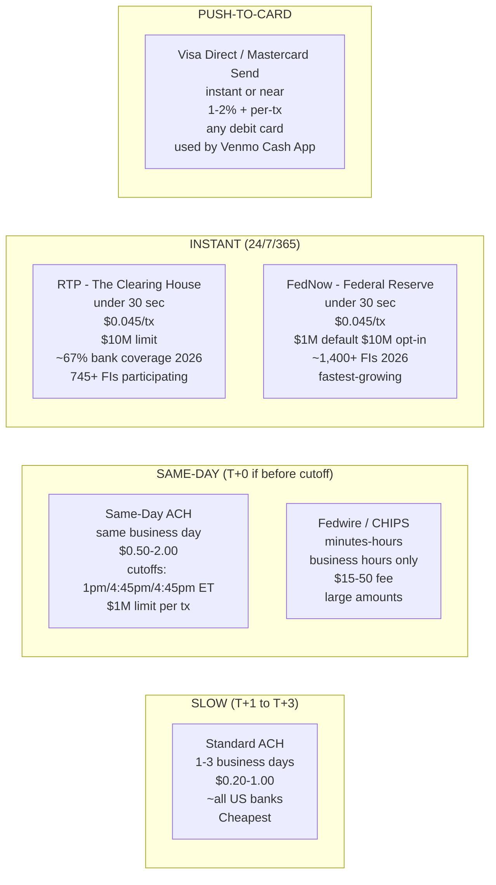
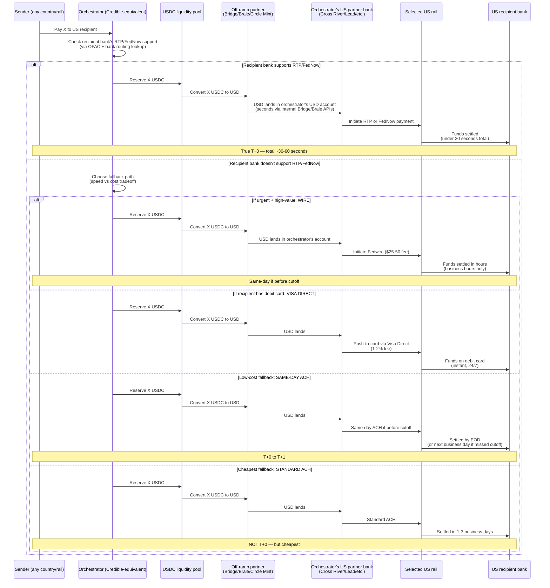
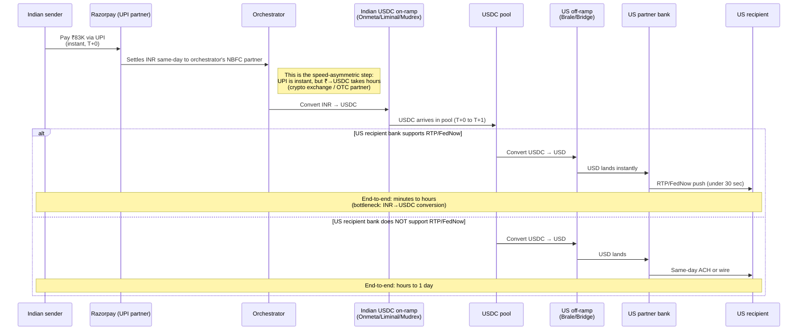

# US Payout Rails — The Honest "T+0" Mechanics

> The rail-by-rail mechanics for getting USDC into a US bank account. Answers the question: when a payment orchestrator (Credible, Bridge, BVNK, anyone) claims "T+0 settlement to US recipients," what's actually happening?
> **Date:** 2026-05-03

---

## The honest answer in one paragraph

**True T+0 to a US bank account is conditional on the recipient bank supporting RTP or FedNow.** As of 2026, that's roughly **67-70% of US bank accounts**, growing. For the other 30%, the actual options are: same-day ACH (T+0 if before cutoff), wire (~$15-50 fee, instant during business hours), push-to-debit via Visa Direct (~1.5% fee, instant), or standard ACH (T+1 to T+3 — NOT T+0). **When a payment orchestrator markets "T+0" to US recipients, they're either restricting to RTP/FedNow-eligible banks, paying expensive wire fees in the background, or quietly delivering T+1/T+2 to the long tail.**

For the on-chain → US bank account flow specifically: USDC needs to be off-ramped through a regulated partner (Circle Mint, Bridge, Brale, etc.), then pushed via one of the rails above. The off-ramp itself is typically same-day for institutional accounts; it's the recipient-side rail that gates the whole flow.

---

## 1. The five US payment rails — speed, cost, coverage

### The detail

**Standard ACH (the legacy default)**
- 1-3 business days settlement
- Practically T+2 most often
- Cost: $0.20-1.00
- Coverage: ~every US bank
- **What "T+0" pitches DON'T mean**

**Same-Day ACH**
- Settles same business day IF you make the cutoff
- Three cutoff windows: 10:30am, 2:45pm, 4:45pm ET (NACHA)
- $1M per transaction limit (raised from $100K in 2022)
- Cost: $0.50-2.00 + bank fees
- Coverage: most US banks support
- **Marketing trick:** orchestrators sometimes use this and call it T+0 — technically true if processed before cutoff, but if a payment is initiated at 5pm ET it goes to next business day

**Wire Transfer (Fedwire / CHIPS)**
- Settles in minutes to a few hours
- Business hours only (Fedwire: 9pm ET previous day → 7pm ET cutoff)
- Cost: $15-50 fee per transaction (sometimes $25-30 typical)
- Capacity: very large
- **Reality:** orchestrators sometimes use wire for high-value transactions where the fee is acceptable, AND for low-coverage recipients without RTP/FedNow

**RTP (Real-Time Payments) — The Clearing House**
- Launched 2017 by The Clearing House (private bank consortium)
- **Instant: target under 30 seconds, actual median ~10 seconds**
- 24/7/365 (true 24/7)
- Cost: ~$0.045 per transaction
- Capacity: **$10M per transaction** (raised from $1M in 2024)
- Coverage: **~67% of US demand deposits, ~745+ participating FIs** as of 2026
- **Banks supporting RTP:** JP Morgan Chase, BoA, Wells Fargo, Citi, US Bank, PNC, Truist, Fifth Third, Cross River, Lead Bank, Mercury, Brex, every major fintech-friendly bank

**FedNow — Federal Reserve**
- Launched July 2023 by the Fed
- **Instant: under 20 seconds typically**
- 24/7/365
- Cost: ~$0.045 per transaction
- Capacity: $1M default per transaction; $10M with opt-in
- Coverage: **~1,400+ participating FIs** as of 2026 — fastest-growing
- **Notable:** more community/regional banks than RTP, less concentrated. The Fed is pushing universal coverage by ~2027-28

**Push-to-Card (Visa Direct / Mastercard Send)**
- Instant or near-instant settlement to debit card
- 24/7
- Cost: typically 1-2% + per-transaction fees ($0.50-1)
- Coverage: any debit card with the network
- Used by Venmo, Cash App for "instant transfer" feature
- **Useful as a fallback** when recipient bank doesn't support RTP/FedNow but recipient has a debit card

---

## 2. The off-ramp speed — getting USDC OFF the chain to USD

Before any of those rails can fire, the USDC has to leave the chain and become USD in a US bank account. Options:

| Off-ramp partner | USDC → USD speed | Cost | Recipient capability |
|---|---|---|---|
| **Circle Mint** (institutional) | Same-day for verified accounts | Effectively free above $30K min | Wire to any US bank |
| **Bridge (Stripe)** | Programmatic, near-instant | ~10-30bps | RTP/FedNow capable (Cross River-backed) |
| **Brale** | Programmatic, near-instant | ~10-30bps | RTP/FedNow + ACH (Cross River-backed) |
| **Coinbase Prime** | ACH (1-3 days) or wire (same-day) | Per-transaction fees | Standard rails |
| **MoonPay Business** | Variable | 1-2% take | Standard rails |
| **Conduit** | Programmatic | ~25bps | RTP/FedNow + wire |

**The fast modern stack: USDC → Circle Mint OR Bridge OR Brale → US partner bank → RTP/FedNow → recipient.**

**Total end-to-end latency for the fast path: 30-60 seconds.**

For the slow path (recipient bank doesn't support RTP/FedNow): USDC → Bridge → US bank → standard ACH → recipient = 1-3 business days.

---

## 3. The actual end-to-end flow when an orchestrator claims T+0

---

## 4. The five things every orchestrator's "T+0" claim hides

1. **Bank coverage gating.** "T+0" works for ~67-70% of US recipients (RTP/FedNow-supported). The remaining 30% gets same-day ACH (if cutoff met), wire (if fee acceptable), or quietly slower settlement.

2. **Cutoff times matter.** Same-day ACH cutoffs are 10:30am / 2:45pm / 4:45pm ET. A payment initiated at 5pm goes to next business day — even if the orchestrator says "T+0." A "T+0" pitch should specify "T+0 if initiated before [cutoff]."

3. **Wire fees in the background.** For high-value transactions to non-RTP/FedNow banks, the orchestrator pays $15-50 wire fees and absorbs them into their take rate. This works for $1K+ transactions; breaks for $50 transactions.

4. **Push-to-card is expensive.** Visa Direct's 1-2% take is fine for high-margin payouts but kills unit economics for thin-margin remittance corridors.

5. **The off-ramp is rarely the bottleneck.** Bridge/Brale/Circle Mint all settle USDC → USD in seconds at the institutional partner level. The bottleneck is always the recipient-side rail.

---

## 5. What Credible probably actually does

Based on Credible's stated infrastructure:
- ✅ US MSB partnership (unannounced, most likely **Brale** — stablecoin-native, RTP/FedNow capable)
- ✅ USDC liquidity pool (Hedera Byzanlink + Solana)
- 🟡 RTP/FedNow access via partner bank (Brale's bank Cross River supports both)
- 🟡 Probably uses smart routing — RTP/FedNow first, fall back to same-day ACH, wire as last resort

**My read on Credible's "T+0" claim for US recipients:**
- True T+0 for RTP/FedNow-eligible recipients (~67% of cases)
- Same-day ACH for the long tail (technically T+0 if before cutoff)
- They probably don't reveal the bank-coverage caveat in marketing

**Note:** Credible's primary "T+0" pitch is for **payouts TO emerging markets** (UPI in India, NIBSS in Nigeria, InstaPay in Philippines) — those are genuinely instant on the recipient side. The US-recipient case is the harder one, and they don't market it as aggressively.

---

## 6. The crucial implication for your plan

If you're building a Credible-equivalent that needs to pay US recipients:

### Choose your US partner bank carefully

The partner bank determines what rails you have access to:
- **Cross River Bank** — supports RTP, FedNow, ACH. Stablecoin-friendly. Used by Brale, Bridge, Lead Bank-equivalents
- **Lead Bank** — RTP, FedNow, fintech-friendly
- **Customers Bank** — Real-time payments, large fintech book
- **Brale (the platform, not a bank)** — wraps Cross River, gives you USDC ↔ USD with RTP/FedNow exit
- **Bridge (Stripe-owned)** — wraps multiple banks, probably uses Cross River + others

**For a solo founder pitching MVP:** Brale is the easiest first integration. They're newer, hungrier for volume, and stablecoin-native. Cross River direct is harder to onboard at pre-revenue.

### Build smart routing from day one

Don't promise blanket "T+0." Promise:
- **T+0 for RTP/FedNow-eligible recipients** (transparent caveat)
- **Same-day ACH for the rest** (still better than competitors' T+1 to T+3)
- **Wire option for urgent / high-value** (with explicit fee disclosure)

This is more honest than Credible's "T+0 across the board" framing and easier to defend in due diligence.

### Don't waste capital on US-side liquidity unnecessarily

For RTP/FedNow flows, you don't need a big USDC pool. You need:
1. A small USD float at your partner bank for outbound RTP/FedNow
2. Refill it from USDC via Circle Mint / Bridge / Brale on a daily basis
3. The USDC pool funds the RECEIVING side (international corridors)

The US-side payout doesn't need a giant pre-funded float — it needs ~3 days of operational float at most.

---

## 7. The reverse-corridor implication (your earlier question revisited)

For the inverse flow (India → US, INR → USD):

**The asymmetry you noticed:**
- UPI on the sender side = truly instant (no need for the orchestrator to advance capital — money is in their hand instantly)
- USD payout on the recipient side = bottlenecked by RTP/FedNow coverage, not by funding

So the reverse-corridor flow has a **different pain point**: not a credit/funding gap, but a **rail-routing problem**. You don't need a big bridging-capital pool for the US-out side. You need:
- Instant Indian on-ramp (INR → USDC) — minutes
- Pre-funded small USD float at US partner bank — buffer
- Smart routing for US recipient (RTP/FedNow first, fall back as needed)

**This actually makes the reverse-corridor a CHEAPER product to build** than the forward direction. Less capital, simpler funding model, just smart rail routing.

---

## 8. The 2-3 year forward view

RTP/FedNow coverage trajectory:
- 2024: ~50% of demand deposits
- 2026: ~67% (current)
- 2028: targeted ~90%+ (Federal Reserve push)
- 2030: probably universal

By 2028-29, "T+0 to US bank account" becomes commodity infrastructure. Today there's still pricing power for orchestrators that handle the routing complexity. **Window: ~2-3 years.**

For the user's plan: don't invest heavily in proprietary US-side payout infrastructure. The rail is a solved problem. Invest instead in:
- Coverage of the long-tail emerging markets (the receiver side is where the moat is)
- The MoR / compliance / dispute layer (Credible's gap)
- The customer experience (the API, the dashboard, the developer love)

---

## 9. The bottom line

**For your specific question** — "how does Credible deliver T+0 to a US recipient?":

The answer is one of:
1. **Recipient bank supports RTP/FedNow** → genuinely T+0 in seconds. ~67% of cases.
2. **Recipient bank doesn't support RTP/FedNow** → same-day ACH if before cutoff, else next business day. Marketed as T+0 but technically T+0 to T+1.
3. **High-value transaction** → wire (~$25 fee, hours).
4. **Recipient has debit card** → push-to-debit via Visa Direct (~1.5% fee, instant).

**The "T+0" pitch works because:**
- Most institutional senders (the actual customers) have recipient banks that DO support RTP/FedNow
- For the long-tail, same-day ACH is "close enough" for most use cases
- Wire is a known fallback for urgent/high-value

**Your competitor positioning:** be honest about the rail gating. *"T+0 to RTP/FedNow-eligible recipients (now ~67% of US banks); same-day ACH or wire for the rest. We tell you upfront."* This is more credible than Credible's blanket claim.

---

## Sources

- [The Clearing House RTP statistics](https://www.theclearinghouse.org/payment-systems/rtp)
- [FedNow service participation list](https://www.frbservices.org/financial-services/fednow/organizations.html)
- [NACHA Same-Day ACH guidelines](https://www.nacha.org/rules/same-day-ach)
- [Visa Direct documentation](https://developer.visa.com/capabilities/visa_direct)
- [Bridge by Stripe](https://www.bridge.xyz)
- [Brale](https://brale.xyz) — stablecoin-native banking infrastructure
- [Circle Mint](https://www.circle.com/circle-mint)
- Companion: [`./liquidity_models.md`](./liquidity_models.md) — covers RTP/FedNow as a capital-efficiency lever (B2)
