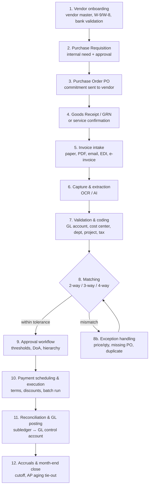

# 2 — The Complete AP Lifecycle

*The heart of the primer: every stage of accounts payable, in order.*

## The stages

1. **Vendor / supplier onboarding & vendor master data.** Before anyone can be paid, the supplier is established in the **vendor master** (the authoritative record of who can be paid): legal entity data, **tax form** (W-9 for US persons, W-8 series for foreign), **validated banking details**, and KYB/vendor validation. *Control note:* fraudulent **bank-detail-change requests** are a leading attack vector — changes should require dual approval + out-of-band verification.

2. **Purchase requisition → Purchase Order (PO).** *(PO-based AP only.)* A **requisition** is the internal request signaling a need to buy (routed for budget approval); the approved requisition becomes a **PO** — a formal, externally issued commitment to the vendor specifying items, quantities, agreed prices. The PO is the binding reference the invoice is later matched against.

3. **Goods Receipt / Goods Receipt Note (GRN) / service confirmation.** When the order arrives, receiving records *what was actually delivered* (quantity, condition) against the PO. For services, the equivalent is a service confirmation. Independent proof of receipt used in matching.

4. **Invoice receipt / intake.** The vendor's **invoice** arrives via paper, PDF, email, **EDI** (structured machine-to-machine), or **e-invoice** (structured XML, increasingly mandated). A core challenge is consolidating heterogeneous inputs into one pipeline.

5. **Invoice capture & data extraction.** Raw invoices → structured data via **OCR** (Optical Character Recognition), increasingly augmented by AI/LLMs that extract template-free. Benchmark for *manual* entry: ~111 seconds / ~105 keystrokes per invoice, ~12.5% needing rework — which is why capture is the highest-leverage automation step.

6. **Validation & coding.** Check completeness/accuracy and assign accounting dimensions: **GL account**, **cost center / department**, **project**, **tax codes**. Coding is what makes spend show up correctly in the financials and management reports.

7. **Matching** — the core verification control:
   - **2-way match** (PO + Invoice): quantity billed ≤ ordered AND invoice price ≤ PO price. Default for services / no goods receipt.
   - **3-way match** (PO + Receipt + Invoice): adds quantity billed ≤ **received** — you only pay for what you got. The workhorse control for goods.
   - **4-way match** (PO + Receipt + **Inspection/Acceptance** + Invoice): adds quantity billed ≤ **accepted** — where quality inspection matters.
   Mismatches beyond defined **tolerances** trigger a **matching hold** that blocks payment.

8. **Exception handling.** When matching fails or data is missing, the invoice becomes an **exception** needing human resolution: price mismatch, quantity mismatch, missing PO, duplicate, wrong tax. Exceptions are the primary source of delay and cost — **~14% average exception rate**, and "high exceptions" is the #1 challenge AP leaders cite. Resolved items loop back into matching (often via a **credit memo** or PO amendment).

9. **Approval workflows.** Matched invoices route for authorization per a **Delegation of Authority (DoA) matrix** — who can approve what spend, up to what amount, under what conditions. Mechanics: dollar **thresholds/tiers**, escalating **hierarchies**, **delegation** rules, and **segregation of duties** (the person who enters ≠ approves ≠ pays ≠ reconciles).

10. **Payment scheduling & execution.** Approved payables are scheduled per **payment terms** (Net 30) and **early-pay discounts** (e.g., **2/10 Net 30** = 2% off if paid within 10 days). AP batches due invoices into a **payment run** and pays via ACH/wire/check/card, coordinating with **Treasury** for funding. A **remittance advice** tells the vendor which invoices a payment covers.

11. **Reconciliation & GL posting.** Each payable/payment posts from the **AP subledger** to the **GL**. **AP-to-GL reconciliation** compares the **AP aging** (subledger total) to the **GL AP control account** until they tie out. Common breakage: unrecorded invoices, duplicates, timing differences, unrecorded credits.

12. **Accruals & month-end / period close.** AP enforces **cutoff** (right invoices in the right period), **books accruals** for goods/services received-but-not-invoiced, **reconciles** to the GL, and **documents** the tie-out before books lock. The **AP aging report** buckets unpaid invoices by age (Current, 1–30, 31–60, 61–90, 90+).

## PO-based vs Non-PO (expense-invoice) AP

| | **PO-based** ("2/3-way match") | **Non-PO / expense-invoice** |
|---|---|---|
| Trigger | Spend pre-authorized via **PO** | Invoice for un-pre-approved spend |
| Typical spend | Planned goods, direct/indirect | Utilities, rent, subscriptions, pro fees, ad-hoc/tail spend |
| Verification | **Automated 2-/3-way match** | No order to match → **manual review** |
| Coding | Largely **inherited from the PO** | AP determines GL codes invoice-by-invoice |
| Approval | Fast (approval happened at PO stage) | Routed to find the right approver *after the fact* |
| Speed/risk | Faster, fewer exceptions, clean trail | Slower, higher error/duplicate/maverick-spend risk |

PO-based AP **front-loads control** (approve + commit *before* buying) enabling straight-through matching; non-PO AP back-loads everything onto AP after the invoice arrives. Organizations push to convert non-PO spend into PO spend where practical.

## Key documents / data objects

**Invoice** (vendor's bill — creates the payable) · **Purchase Order** (buyer's binding commitment, the match reference) · **Goods Receipt Note** (proof of what was received) · **Vendor Master** (authoritative payee record: tax ID, W-9/W-8, validated bank details) · **Remittance Advice** (notice to vendor of what a payment settles) · **Credit Memo / Vendor Credit** (negative invoice for returns/overcharges) · **Vendor Statement** (periodic supplier summary AP reconciles against).

## Manual-AP pain points (why automation exists)

Data-entry errors · **duplicate payments** (paid twice) · **lost/missing invoices** · **late payments** (fees + strained suppliers) · **missed early-pay discounts** (median org pays 96% on time but only ~15% within the discount window — lost to *process lag*, not choice) · **fraud exposure** (billing schemes, check/ACH fraud, fake vendors).

→ Next: [03_payments_rails_crossborder_tax.md](./03_payments_rails_crossborder_tax.md)
