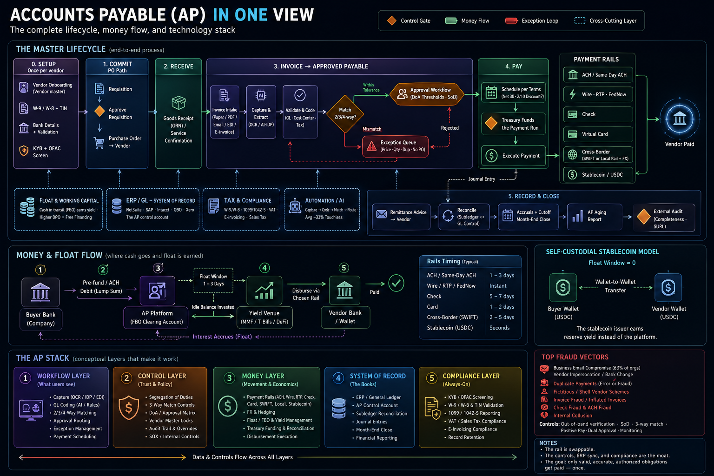
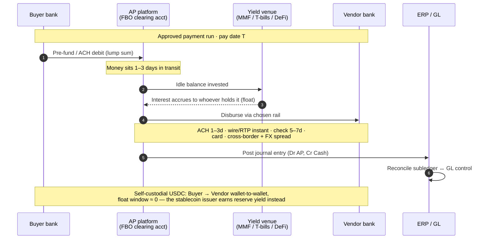
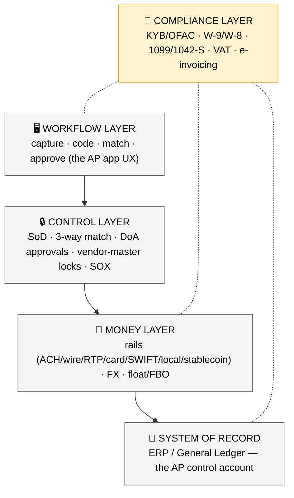

# 6 — AP in One View

*The whole discipline as diagrams. Three views: the master lifecycle, the money-&-float flow, and the conceptual layer stack.*

> **Rendered infographic:**  — a polished single-image version of all three views below (generated from this file; verified accurate against the primer, June 2026). The Mermaid source follows so it stays editable/regenerable.

> **How to view:** these are [Mermaid](https://mermaid.live) diagrams. They render in GitHub, the VS Code Mermaid extension, Obsidian, or by pasting into [mermaid.live](https://mermaid.live). In a plain terminal they show as code. (Ask and I can export them to PNG/SVG.)

---

## View 1 — The master flowchart (everything, one picture)

The horizontal spine is the **lifecycle** (setup → commit → receive → invoice→payable → pay → record). **Orange hexagons/diamonds = control gates.** **Green = money movement.** **Red = the exception loop.** **Blue dotted boxes = the cross-cutting layers** (float, ERP, tax, AI) that touch multiple stages.

```mermaid
flowchart LR
  subgraph S0["0 · SETUP — once per vendor"]
    V0["Vendor onboarding<br/>(vendor master)"]
    V1["W-9 / W-8 + TIN"]
    V2["Bank details + validation"]
    V3{{"KYB + OFAC screen"}}
    V0 --> V1 --> V2 --> V3
  end
  subgraph S1["1 · COMMIT — PO path"]
    R1["Requisition"]
    R2["Approve requisition"]
    R3["Purchase Order → vendor"]
    R1 --> R2 --> R3
  end
  subgraph S2["2 · RECEIVE"]
    G1["Goods Receipt (GRN) /<br/>service confirmation"]
  end
  subgraph S3["3 · INVOICE → APPROVED PAYABLE"]
    I1["Invoice intake<br/>paper/PDF/email/EDI/e-invoice"]
    I2["Capture & extract<br/>OCR / AI-IDP"]
    I3["Validate & code<br/>GL · cost center · tax"]
    M1{"Match<br/>2 / 3 / 4-way?"}
    E1["Exception queue<br/>price · qty · dup · no PO"]
    A1{{"Approval workflow<br/>DoA thresholds · SoD"}}
    I1 --> I2 --> I3 --> M1
    M1 -- "within tolerance" --> A1
    M1 -- "mismatch" --> E1
    E1 -- "fix / credit memo" --> M1
    A1 -- "rejected" --> E1
  end
  subgraph S4["4 · PAY"]
    P1["Schedule per terms<br/>Net 30 · 2/10 discount?"]
    P2{{"Treasury funds<br/>the payment run"}}
    P3["Execute payment"]
    P1 --> P2 --> P3
  end
  subgraph RAILS["Payment rails"]
    RA["ACH / Same-Day ACH"]
    RW["Wire · RTP · FedNow"]
    RC["Check"]
    RV["Virtual card"]
    RX["Cross-border:<br/>SWIFT or local rail + FX"]
    RS["Stablecoin / USDC"]
  end
  subgraph S5["5 · RECORD & CLOSE"]
    C1["Remittance advice → vendor"]
    C2["Reconcile<br/>subledger ↔ GL control"]
    C3["Accruals + cutoff<br/>month-end close"]
    C4["AP aging report"]
    C5{{"External audit<br/>completeness · SURL"}}
    C1 --> C2 --> C3 --> C4 --> C5
  end
  V3 --> R1
  R3 --> G1 --> I1
  A1 -- "approved" --> P1
  P3 --> RAILS
  RAILS --> VEND(["Vendor paid"])
  VEND --> C1
  P3 -. "journal entry" .-> C2
  NONPO["Non-PO / expense invoice<br/>(no PO to match)"] -.-> I1
  FLOAT["💰 FLOAT & WORKING CAPITAL<br/>cash in transit (FBO) earns yield ·<br/>higher DPO = free financing"]
  P2 -.-> FLOAT
  ERP[("📒 ERP / GL — system of record<br/>NetSuite · SAP · Intacct · QBO · Xero")]
  ERP -.-> I3
  ERP -.-> C2
  TAX["🧾 TAX & COMPLIANCE<br/>W-9/W-8 · 1099/1042-S · VAT · e-invoicing"]
  TAX -.-> V1
  TAX -.-> C3
  AILAYER["🤖 AUTOMATION / AI<br/>capture→code→match→route ·<br/>avg ~33% touchless"]
  AILAYER -.-> I2
  classDef gate fill:#ffe8cc,stroke:#e8893b,color:#000;
  classDef money fill:#d6f5d6,stroke:#2e8b57,color:#000;
  classDef overlay fill:#e8ecff,stroke:#8895cc,color:#000;
  classDef exc fill:#ffd6d6,stroke:#c0392b,color:#000;
  class V3,M1,A1,C5 gate;
  class P1,P2,P3,RA,RW,RC,RV,RX,RS,VEND money;
  class E1 exc;
  class FLOAT,ERP,TAX,AILAYER overlay;
```

**Read it in one breath:** a vendor is onboarded and screened → (for PO spend) a requisition becomes a PO → goods are received → the invoice arrives, gets captured, coded, and **matched** against the PO/receipt → clean ones route through **approval**, mismatches loop through the **exception queue** → Treasury funds the run and it pays out over a **rail** → the vendor is paid, a journal entry posts, and AP **reconciles to the GL and closes**. The whole thing sits on top of the **ERP** (system of record), is wrapped by **tax/compliance** at the edges, is increasingly run by **AI** in the middle, and **earns float** wherever cash sits in transit.

---

## View 2 — The money & float flow

Where the cash actually goes, and where "idle money makes money." The last note shows how the self-custodial stablecoin model collapses the float window.

---

## View 3 — The conceptual layer stack

Any AP product is really a stack. The **workflow layer** is what users see; the **control** and **money** layers are where trust and economics live; the **ERP** is the system of record everything must reconcile to; **compliance** wraps the whole thing.

**The point of this view:** the rail (bottom of the money layer) is the *least* differentiated part — what's hard and defensible is the **control layer**, the **ERP sync** into the system of record, and the **compliance layer**. That's the recurring lesson from the company research: *whoever owns onboarding + tax + ERP sync + controls wins; the rail is swappable.*

---

## Legend

| Symbol | Meaning |
|---|---|
| Orange hexagon / diamond | **Control gate** (screen, match decision, approval, audit) |
| Green box | **Money movement** (schedule, fund, rails, vendor paid) |
| Red box | **Exception** (the rework loop) |
| Blue dotted box | **Cross-cutting layer** (float, ERP, tax, AI) touching multiple stages |
| Solid arrow | Process flow | 
| Dotted arrow | Cross-cutting relationship / data sync |

← Back to the primer: [README.md](./README.md)
